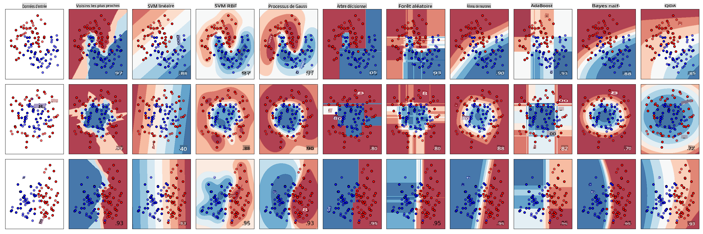
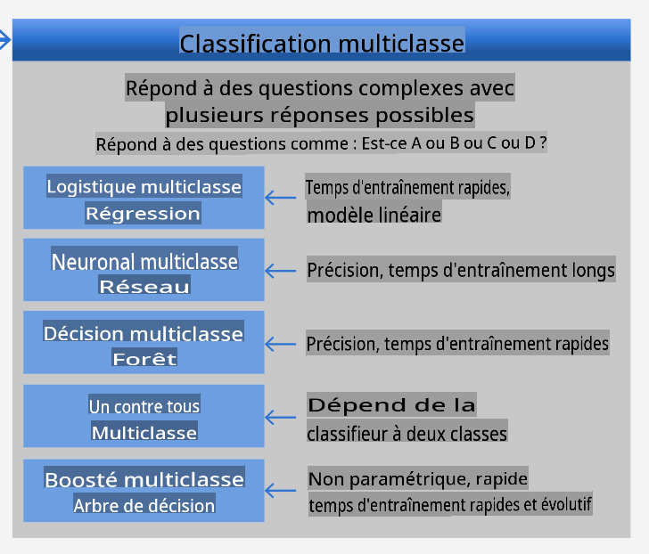
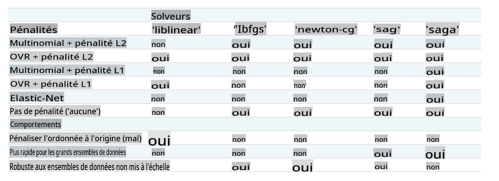

<!--
CO_OP_TRANSLATOR_METADATA:
{
  "original_hash": "9579f42e3ff5114c58379cc9e186a828",
  "translation_date": "2025-09-03T23:49:36+00:00",
  "source_file": "4-Classification/2-Classifiers-1/README.md",
  "language_code": "fr"
}
-->
# Classificateurs de cuisine 1

Dans cette leçon, vous utiliserez le jeu de données que vous avez sauvegardé lors de la dernière leçon, rempli de données équilibrées et propres sur les cuisines.

Vous utiliserez ce jeu de données avec une variété de classificateurs pour _prédire une cuisine nationale donnée en fonction d'un groupe d'ingrédients_. En le faisant, vous en apprendrez davantage sur certaines des façons dont les algorithmes peuvent être utilisés pour des tâches de classification.

## [Quiz avant la leçon](https://gray-sand-07a10f403.1.azurestaticapps.net/quiz/21/)
# Préparation

En supposant que vous avez terminé [Leçon 1](../1-Introduction/README.md), assurez-vous qu'un fichier _cleaned_cuisines.csv_ existe dans le dossier racine `/data` pour ces quatre leçons.

## Exercice - prédire une cuisine nationale

1. En travaillant dans le dossier _notebook.ipynb_ de cette leçon, importez ce fichier ainsi que la bibliothèque Pandas :

    ```python
    import pandas as pd
    cuisines_df = pd.read_csv("../data/cleaned_cuisines.csv")
    cuisines_df.head()
    ```

    Les données ressemblent à ceci :

|     | Unnamed: 0 | cuisine | almond | angelica | anise | anise_seed | apple | apple_brandy | apricot | armagnac | ... | whiskey | white_bread | white_wine | whole_grain_wheat_flour | wine | wood | yam | yeast | yogurt | zucchini |
| --- | ---------- | ------- | ------ | -------- | ----- | ---------- | ----- | ------------ | ------- | -------- | --- | ------- | ----------- | ---------- | ----------------------- | ---- | ---- | --- | ----- | ------ | -------- |
| 0   | 0          | indian  | 0      | 0        | 0     | 0          | 0     | 0            | 0       | 0        | ... | 0       | 0           | 0          | 0                       | 0    | 0    | 0   | 0     | 0      | 0        |
| 1   | 1          | indian  | 1      | 0        | 0     | 0          | 0     | 0            | 0       | 0        | ... | 0       | 0           | 0          | 0                       | 0    | 0    | 0   | 0     | 0      | 0        |
| 2   | 2          | indian  | 0      | 0        | 0     | 0          | 0     | 0            | 0       | 0        | ... | 0       | 0           | 0          | 0                       | 0    | 0    | 0   | 0     | 0      | 0        |
| 3   | 3          | indian  | 0      | 0        | 0     | 0          | 0     | 0            | 0       | 0        | ... | 0       | 0           | 0          | 0                       | 0    | 0    | 0   | 0     | 0      | 0        |
| 4   | 4          | indian  | 0      | 0        | 0     | 0          | 0     | 0            | 0       | 0        | ... | 0       | 0           | 0          | 0                       | 0    | 0    | 0   | 0     | 1      | 0        |
  

1. Maintenant, importez plusieurs autres bibliothèques :

    ```python
    from sklearn.linear_model import LogisticRegression
    from sklearn.model_selection import train_test_split, cross_val_score
    from sklearn.metrics import accuracy_score,precision_score,confusion_matrix,classification_report, precision_recall_curve
    from sklearn.svm import SVC
    import numpy as np
    ```

1. Divisez les coordonnées X et y en deux dataframes pour l'entraînement. `cuisine` peut être le dataframe des étiquettes :

    ```python
    cuisines_label_df = cuisines_df['cuisine']
    cuisines_label_df.head()
    ```

    Cela ressemblera à ceci :

    ```output
    0    indian
    1    indian
    2    indian
    3    indian
    4    indian
    Name: cuisine, dtype: object
    ```

1. Supprimez la colonne `Unnamed: 0` et la colonne `cuisine` en appelant `drop()`. Sauvegardez le reste des données comme caractéristiques entraînables :

    ```python
    cuisines_feature_df = cuisines_df.drop(['Unnamed: 0', 'cuisine'], axis=1)
    cuisines_feature_df.head()
    ```

    Vos caractéristiques ressemblent à ceci :

|      | almond | angelica | anise | anise_seed | apple | apple_brandy | apricot | armagnac | artemisia | artichoke |  ... | whiskey | white_bread | white_wine | whole_grain_wheat_flour | wine | wood |  yam | yeast | yogurt | zucchini |
| ---: | -----: | -------: | ----: | ---------: | ----: | -----------: | ------: | -------: | --------: | --------: | ---: | ------: | ----------: | ---------: | ----------------------: | ---: | ---: | ---: | ----: | -----: | -------: |
|    0 |      0 |        0 |     0 |          0 |     0 |            0 |       0 |        0 |         0 |         0 |  ... |       0 |           0 |          0 |                       0 |    0 |    0 |    0 |     0 |      0 |        0 | 0 |
|    1 |      1 |        0 |     0 |          0 |     0 |            0 |       0 |        0 |         0 |         0 |  ... |       0 |           0 |          0 |                       0 |    0 |    0 |    0 |     0 |      0 |        0 | 0 |
|    2 |      0 |        0 |     0 |          0 |     0 |            0 |       0 |        0 |         0 |         0 |  ... |       0 |           0 |          0 |                       0 |    0 |    0 |    0 |     0 |      0 |        0 | 0 |
|    3 |      0 |        0 |     0 |          0 |     0 |            0 |       0 |        0 |         0 |         0 |  ... |       0 |           0 |          0 |                       0 |    0 |    0 |    0 |     0 |      0 |        0 | 0 |
|    4 |      0 |        0 |     0 |          0 |     0 |            0 |       0 |        0 |         0 |         0 |  ... |       0 |           0 |          0 |                       0 |    0 |    0 |    0 |     0 |      1 |        0 | 0 |

Vous êtes maintenant prêt à entraîner votre modèle !

## Choisir votre classificateur

Maintenant que vos données sont propres et prêtes pour l'entraînement, vous devez décider quel algorithme utiliser pour la tâche. 

Scikit-learn regroupe la classification sous l'apprentissage supervisé, et dans cette catégorie, vous trouverez de nombreuses façons de classifier. [La variété](https://scikit-learn.org/stable/supervised_learning.html) peut sembler déroutante au premier abord. Les méthodes suivantes incluent toutes des techniques de classification :

- Modèles linéaires
- Machines à vecteurs de support
- Descente de gradient stochastique
- Plus proches voisins
- Processus gaussiens
- Arbres de décision
- Méthodes d'ensemble (classificateur par vote)
- Algorithmes multiclasses et multi-sorties (classification multiclasses et multi-étiquettes, classification multiclasses-multi-sorties)

> Vous pouvez également utiliser [les réseaux neuronaux pour classifier des données](https://scikit-learn.org/stable/modules/neural_networks_supervised.html#classification), mais cela dépasse le cadre de cette leçon.

### Quel classificateur choisir ?

Alors, quel classificateur devriez-vous choisir ? Souvent, tester plusieurs et chercher un bon résultat est une façon de procéder. Scikit-learn propose une [comparaison côte à côte](https://scikit-learn.org/stable/auto_examples/classification/plot_classifier_comparison.html) sur un jeu de données créé, comparant KNeighbors, SVC de deux façons, GaussianProcessClassifier, DecisionTreeClassifier, RandomForestClassifier, MLPClassifier, AdaBoostClassifier, GaussianNB et QuadraticDiscriminationAnalysis, montrant les résultats visualisés : 


> Graphiques générés à partir de la documentation de Scikit-learn

> AutoML résout ce problème de manière élégante en exécutant ces comparaisons dans le cloud, vous permettant de choisir le meilleur algorithme pour vos données. Essayez-le [ici](https://docs.microsoft.com/learn/modules/automate-model-selection-with-azure-automl/?WT.mc_id=academic-77952-leestott)

### Une meilleure approche

Une meilleure façon que de deviner au hasard est de suivre les idées de cette [fiche pratique ML téléchargeable](https://docs.microsoft.com/azure/machine-learning/algorithm-cheat-sheet?WT.mc_id=academic-77952-leestott). Ici, nous découvrons que, pour notre problème multiclasses, nous avons quelques choix :


> Une section de la fiche pratique des algorithmes de Microsoft, détaillant les options de classification multiclasses

✅ Téléchargez cette fiche pratique, imprimez-la et accrochez-la sur votre mur !

### Raisonnement

Voyons si nous pouvons raisonner sur différentes approches données les contraintes que nous avons :

- **Les réseaux neuronaux sont trop lourds**. Étant donné notre jeu de données propre mais minimal, et le fait que nous exécutons l'entraînement localement via des notebooks, les réseaux neuronaux sont trop lourds pour cette tâche.
- **Pas de classificateur à deux classes**. Nous n'utilisons pas de classificateur à deux classes, ce qui exclut le one-vs-all. 
- **Un arbre de décision ou une régression logistique pourrait fonctionner**. Un arbre de décision pourrait fonctionner, ou une régression logistique pour des données multiclasses. 
- **Les arbres de décision boostés multiclasses résolvent un problème différent**. L'arbre de décision boosté multiclasses est le plus adapté aux tâches non paramétriques, par exemple les tâches conçues pour établir des classements, donc il n'est pas utile pour nous.

### Utiliser Scikit-learn 

Nous utiliserons Scikit-learn pour analyser nos données. Cependant, il existe de nombreuses façons d'utiliser la régression logistique dans Scikit-learn. Consultez les [paramètres à passer](https://scikit-learn.org/stable/modules/generated/sklearn.linear_model.LogisticRegression.html?highlight=logistic%20regressio#sklearn.linear_model.LogisticRegression).  

Essentiellement, il y a deux paramètres importants - `multi_class` et `solver` - que nous devons spécifier lorsque nous demandons à Scikit-learn d'effectuer une régression logistique. La valeur de `multi_class` applique un certain comportement. La valeur du solver correspond à l'algorithme à utiliser. Tous les solveurs ne peuvent pas être associés à toutes les valeurs de `multi_class`.

Selon la documentation, dans le cas multiclasses, l'algorithme d'entraînement :

- **Utilise le schéma one-vs-rest (OvR)**, si l'option `multi_class` est définie sur `ovr`
- **Utilise la perte d'entropie croisée**, si l'option `multi_class` est définie sur `multinomial`. (Actuellement, l'option `multinomial` est prise en charge uniquement par les solveurs ‘lbfgs’, ‘sag’, ‘saga’ et ‘newton-cg’.)"

> 🎓 Le 'schéma' ici peut être 'ovr' (one-vs-rest) ou 'multinomial'. Étant donné que la régression logistique est vraiment conçue pour prendre en charge la classification binaire, ces schémas lui permettent de mieux gérer les tâches de classification multiclasses. [source](https://machinelearningmastery.com/one-vs-rest-and-one-vs-one-for-multi-class-classification/)

> 🎓 Le 'solver' est défini comme "l'algorithme à utiliser dans le problème d'optimisation". [source](https://scikit-learn.org/stable/modules/generated/sklearn.linear_model.LogisticRegression.html?highlight=logistic%20regressio#sklearn.linear_model.LogisticRegression).

Scikit-learn propose ce tableau pour expliquer comment les solveurs gèrent les différents défis présentés par les différentes structures de données :



## Exercice - diviser les données

Nous pouvons nous concentrer sur la régression logistique pour notre premier essai d'entraînement, puisque vous avez récemment appris à ce sujet dans une leçon précédente.
Divisez vos données en groupes d'entraînement et de test en appelant `train_test_split()` :

```python
X_train, X_test, y_train, y_test = train_test_split(cuisines_feature_df, cuisines_label_df, test_size=0.3)
```

## Exercice - appliquer la régression logistique

Étant donné que vous utilisez le cas multiclasses, vous devez choisir quel _schéma_ utiliser et quel _solver_ définir. Utilisez LogisticRegression avec un paramètre multiclasses et le solveur **liblinear** pour entraîner.

1. Créez une régression logistique avec multi_class défini sur `ovr` et le solveur défini sur `liblinear` :

    ```python
    lr = LogisticRegression(multi_class='ovr',solver='liblinear')
    model = lr.fit(X_train, np.ravel(y_train))
    
    accuracy = model.score(X_test, y_test)
    print ("Accuracy is {}".format(accuracy))
    ```

    ✅ Essayez un solveur différent comme `lbfgs`, qui est souvent défini par défaut
> Remarque, utilisez la fonction Pandas [`ravel`](https://pandas.pydata.org/pandas-docs/stable/reference/api/pandas.Series.ravel.html) pour aplatir vos données si nécessaire.
La précision est bonne à plus de **80 %** !

1. Vous pouvez voir ce modèle en action en testant une ligne de données (#50) :

    ```python
    print(f'ingredients: {X_test.iloc[50][X_test.iloc[50]!=0].keys()}')
    print(f'cuisine: {y_test.iloc[50]}')
    ```

    Le résultat est affiché :

   ```output
   ingredients: Index(['cilantro', 'onion', 'pea', 'potato', 'tomato', 'vegetable_oil'], dtype='object')
   cuisine: indian
   ```

   ✅ Essayez un autre numéro de ligne et vérifiez les résultats.

1. En approfondissant, vous pouvez vérifier la précision de cette prédiction :

    ```python
    test= X_test.iloc[50].values.reshape(-1, 1).T
    proba = model.predict_proba(test)
    classes = model.classes_
    resultdf = pd.DataFrame(data=proba, columns=classes)
    
    topPrediction = resultdf.T.sort_values(by=[0], ascending = [False])
    topPrediction.head()
    ```

    Le résultat est affiché - la cuisine indienne est sa meilleure supposition, avec une bonne probabilité :

    |          |        0 |
    | -------: | -------: |
    |   indian | 0.715851 |
    |  chinese | 0.229475 |
    | japanese | 0.029763 |
    |   korean | 0.017277 |
    |     thai | 0.007634 |

    ✅ Pouvez-vous expliquer pourquoi le modèle est assez sûr qu'il s'agit d'une cuisine indienne ?

1. Obtenez plus de détails en affichant un rapport de classification, comme vous l'avez fait dans les leçons sur la régression :

    ```python
    y_pred = model.predict(X_test)
    print(classification_report(y_test,y_pred))
    ```

    |              | précision | rappel | f1-score | support |
    | ------------ | --------- | ------ | -------- | ------- |
    | chinese      | 0.73      | 0.71   | 0.72     | 229     |
    | indian       | 0.91      | 0.93   | 0.92     | 254     |
    | japanese     | 0.70      | 0.75   | 0.72     | 220     |
    | korean       | 0.86      | 0.76   | 0.81     | 242     |
    | thai         | 0.79      | 0.85   | 0.82     | 254     |
    | précision    | 0.80      | 1199   |          |         |
    | moyenne macro| 0.80      | 0.80   | 0.80     | 1199    |
    | moyenne pondérée | 0.80  | 0.80   | 0.80     | 1199    |

## 🚀Défi

Dans cette leçon, vous avez utilisé vos données nettoyées pour construire un modèle d'apprentissage automatique capable de prédire une cuisine nationale en fonction d'une série d'ingrédients. Prenez le temps de parcourir les nombreuses options que Scikit-learn propose pour classifier les données. Approfondissez le concept de 'solver' pour comprendre ce qui se passe en coulisses.

## [Quiz après la leçon](https://gray-sand-07a10f403.1.azurestaticapps.net/quiz/22/)

## Révision & Étude personnelle

Approfondissez un peu plus les mathématiques derrière la régression logistique dans [cette leçon](https://people.eecs.berkeley.edu/~russell/classes/cs194/f11/lectures/CS194%20Fall%202011%20Lecture%2006.pdf)
## Devoir 

[Étudiez les solvers](assignment.md)

---

**Avertissement** :  
Ce document a été traduit à l'aide du service de traduction automatique [Co-op Translator](https://github.com/Azure/co-op-translator). Bien que nous nous efforcions d'assurer l'exactitude, veuillez noter que les traductions automatisées peuvent contenir des erreurs ou des inexactitudes. Le document original dans sa langue d'origine doit être considéré comme la source faisant autorité. Pour des informations critiques, il est recommandé de faire appel à une traduction humaine professionnelle. Nous déclinons toute responsabilité en cas de malentendus ou d'interprétations erronées résultant de l'utilisation de cette traduction.