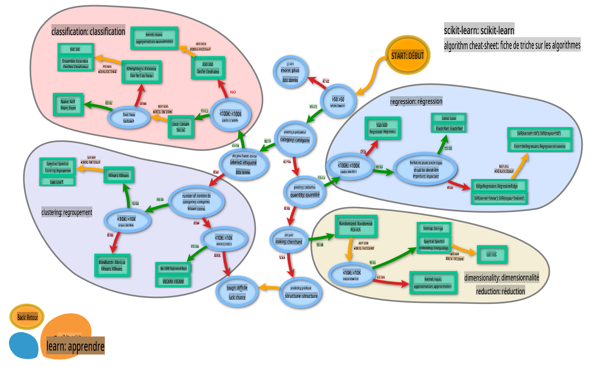

<!--
CO_OP_TRANSLATOR_METADATA:
{
  "original_hash": "808a71076f76ae8f5458862a8edd9215",
  "translation_date": "2025-09-03T23:57:51+00:00",
  "source_file": "4-Classification/3-Classifiers-2/README.md",
  "language_code": "fr"
}
-->
# Classificateurs de cuisine 2

Dans cette deuxième leçon sur la classification, vous explorerez davantage de méthodes pour classifier des données numériques. Vous apprendrez également les implications du choix d'un classificateur plutôt qu'un autre.

## [Quiz avant la leçon](https://gray-sand-07a10f403.1.azurestaticapps.net/quiz/23/)

### Prérequis

Nous supposons que vous avez terminé les leçons précédentes et que vous disposez d'un jeu de données nettoyé dans votre dossier `data`, appelé _cleaned_cuisines.csv_, à la racine de ce dossier de 4 leçons.

### Préparation

Nous avons chargé votre fichier _notebook.ipynb_ avec le jeu de données nettoyé et l'avons divisé en dataframes X et y, prêts pour le processus de construction du modèle.

## Une carte de classification

Précédemment, vous avez appris les différentes options disponibles pour classifier des données en utilisant la fiche de référence de Microsoft. Scikit-learn propose une fiche similaire, mais plus détaillée, qui peut vous aider à affiner davantage vos choix de classificateurs (également appelés estimateurs) :


> Conseil : [visitez cette carte en ligne](https://scikit-learn.org/stable/tutorial/machine_learning_map/) et cliquez sur les chemins pour lire la documentation.

### Le plan

Cette carte est très utile une fois que vous avez une compréhension claire de vos données, car vous pouvez "suivre" ses chemins pour prendre une décision :

- Nous avons >50 échantillons
- Nous voulons prédire une catégorie
- Nous avons des données étiquetées
- Nous avons moins de 100K échantillons
- ✨ Nous pouvons choisir un Linear SVC
- Si cela ne fonctionne pas, puisque nous avons des données numériques :
    - Nous pouvons essayer un ✨ KNeighbors Classifier 
      - Si cela ne fonctionne pas, essayer ✨ SVC et ✨ Ensemble Classifiers

C'est un chemin très utile à suivre.

## Exercice - diviser les données

En suivant ce chemin, nous devrions commencer par importer quelques bibliothèques nécessaires.

1. Importez les bibliothèques nécessaires :

    ```python
    from sklearn.neighbors import KNeighborsClassifier
    from sklearn.linear_model import LogisticRegression
    from sklearn.svm import SVC
    from sklearn.ensemble import RandomForestClassifier, AdaBoostClassifier
    from sklearn.model_selection import train_test_split, cross_val_score
    from sklearn.metrics import accuracy_score,precision_score,confusion_matrix,classification_report, precision_recall_curve
    import numpy as np
    ```

1. Divisez vos données d'entraînement et de test :

    ```python
    X_train, X_test, y_train, y_test = train_test_split(cuisines_feature_df, cuisines_label_df, test_size=0.3)
    ```

## Classificateur Linear SVC

Le clustering par vecteurs de support (SVC) fait partie de la famille des machines à vecteurs de support (SVM) en apprentissage automatique (en savoir plus ci-dessous). Dans cette méthode, vous pouvez choisir un 'kernel' pour décider comment regrouper les étiquettes. Le paramètre 'C' fait référence à la 'régularisation', qui régule l'influence des paramètres. Le kernel peut être l'un des [plusieurs](https://scikit-learn.org/stable/modules/generated/sklearn.svm.SVC.html#sklearn.svm.SVC) ; ici, nous le définissons sur 'linear' pour garantir que nous utilisons Linear SVC. La probabilité est par défaut 'false' ; ici, nous la définissons sur 'true' pour obtenir des estimations de probabilité. Nous définissons l'état aléatoire sur '0' pour mélanger les données et obtenir des probabilités.

### Exercice - appliquer un Linear SVC

Commencez par créer un tableau de classificateurs. Vous ajouterez progressivement à ce tableau au fur et à mesure des tests.

1. Commencez avec un Linear SVC :

    ```python
    C = 10
    # Create different classifiers.
    classifiers = {
        'Linear SVC': SVC(kernel='linear', C=C, probability=True,random_state=0)
    }
    ```

2. Entraînez votre modèle en utilisant le Linear SVC et affichez un rapport :

    ```python
    n_classifiers = len(classifiers)
    
    for index, (name, classifier) in enumerate(classifiers.items()):
        classifier.fit(X_train, np.ravel(y_train))
    
        y_pred = classifier.predict(X_test)
        accuracy = accuracy_score(y_test, y_pred)
        print("Accuracy (train) for %s: %0.1f%% " % (name, accuracy * 100))
        print(classification_report(y_test,y_pred))
    ```

    Le résultat est assez bon :

    ```output
    Accuracy (train) for Linear SVC: 78.6% 
                  precision    recall  f1-score   support
    
         chinese       0.71      0.67      0.69       242
          indian       0.88      0.86      0.87       234
        japanese       0.79      0.74      0.76       254
          korean       0.85      0.81      0.83       242
            thai       0.71      0.86      0.78       227
    
        accuracy                           0.79      1199
       macro avg       0.79      0.79      0.79      1199
    weighted avg       0.79      0.79      0.79      1199
    ```

## Classificateur K-Neighbors

K-Neighbors fait partie de la famille "neighbors" des méthodes d'apprentissage automatique, qui peuvent être utilisées pour l'apprentissage supervisé et non supervisé. Dans cette méthode, un nombre prédéfini de points est créé et les données sont regroupées autour de ces points afin que des étiquettes généralisées puissent être prédites pour les données.

### Exercice - appliquer le classificateur K-Neighbors

Le classificateur précédent était bon et fonctionnait bien avec les données, mais peut-être pouvons-nous obtenir une meilleure précision. Essayez un classificateur K-Neighbors.

1. Ajoutez une ligne à votre tableau de classificateurs (ajoutez une virgule après l'élément Linear SVC) :

    ```python
    'KNN classifier': KNeighborsClassifier(C),
    ```

    Le résultat est un peu moins bon :

    ```output
    Accuracy (train) for KNN classifier: 73.8% 
                  precision    recall  f1-score   support
    
         chinese       0.64      0.67      0.66       242
          indian       0.86      0.78      0.82       234
        japanese       0.66      0.83      0.74       254
          korean       0.94      0.58      0.72       242
            thai       0.71      0.82      0.76       227
    
        accuracy                           0.74      1199
       macro avg       0.76      0.74      0.74      1199
    weighted avg       0.76      0.74      0.74      1199
    ```

    ✅ En savoir plus sur [K-Neighbors](https://scikit-learn.org/stable/modules/neighbors.html#neighbors)

## Classificateur Support Vector

Les classificateurs par vecteurs de support font partie de la famille des [machines à vecteurs de support](https://wikipedia.org/wiki/Support-vector_machine) en apprentissage automatique, utilisées pour les tâches de classification et de régression. Les SVM "cartographient les exemples d'entraînement en points dans l'espace" pour maximiser la distance entre deux catégories. Les données suivantes sont cartographiées dans cet espace afin que leur catégorie puisse être prédite.

### Exercice - appliquer un classificateur Support Vector

Essayons d'obtenir une meilleure précision avec un classificateur Support Vector.

1. Ajoutez une virgule après l'élément K-Neighbors, puis ajoutez cette ligne :

    ```python
    'SVC': SVC(),
    ```

    Le résultat est très bon !

    ```output
    Accuracy (train) for SVC: 83.2% 
                  precision    recall  f1-score   support
    
         chinese       0.79      0.74      0.76       242
          indian       0.88      0.90      0.89       234
        japanese       0.87      0.81      0.84       254
          korean       0.91      0.82      0.86       242
            thai       0.74      0.90      0.81       227
    
        accuracy                           0.83      1199
       macro avg       0.84      0.83      0.83      1199
    weighted avg       0.84      0.83      0.83      1199
    ```

    ✅ En savoir plus sur [Support-Vectors](https://scikit-learn.org/stable/modules/svm.html#svm)

## Classificateurs ensemblistes

Suivons le chemin jusqu'à la fin, même si le test précédent était très bon. Essayons quelques 'classificateurs ensemblistes', en particulier Random Forest et AdaBoost :

```python
  'RFST': RandomForestClassifier(n_estimators=100),
  'ADA': AdaBoostClassifier(n_estimators=100)
```

Le résultat est très bon, surtout pour Random Forest :

```output
Accuracy (train) for RFST: 84.5% 
              precision    recall  f1-score   support

     chinese       0.80      0.77      0.78       242
      indian       0.89      0.92      0.90       234
    japanese       0.86      0.84      0.85       254
      korean       0.88      0.83      0.85       242
        thai       0.80      0.87      0.83       227

    accuracy                           0.84      1199
   macro avg       0.85      0.85      0.84      1199
weighted avg       0.85      0.84      0.84      1199

Accuracy (train) for ADA: 72.4% 
              precision    recall  f1-score   support

     chinese       0.64      0.49      0.56       242
      indian       0.91      0.83      0.87       234
    japanese       0.68      0.69      0.69       254
      korean       0.73      0.79      0.76       242
        thai       0.67      0.83      0.74       227

    accuracy                           0.72      1199
   macro avg       0.73      0.73      0.72      1199
weighted avg       0.73      0.72      0.72      1199
```

✅ En savoir plus sur [Classificateurs ensemblistes](https://scikit-learn.org/stable/modules/ensemble.html)

Cette méthode d'apprentissage automatique "combine les prédictions de plusieurs estimateurs de base" pour améliorer la qualité du modèle. Dans notre exemple, nous avons utilisé Random Trees et AdaBoost. 

- [Random Forest](https://scikit-learn.org/stable/modules/ensemble.html#forest), une méthode d'agrégation, construit une 'forêt' d'arbres de décision infusés de hasard pour éviter le surapprentissage. Le paramètre n_estimators est défini sur le nombre d'arbres.

- [AdaBoost](https://scikit-learn.org/stable/modules/generated/sklearn.ensemble.AdaBoostClassifier.html) ajuste un classificateur à un jeu de données, puis ajuste des copies de ce classificateur au même jeu de données. Il se concentre sur les poids des éléments mal classés et ajuste l'ajustement pour le prochain classificateur afin de corriger.

---

## 🚀Défi

Chacune de ces techniques possède un grand nombre de paramètres que vous pouvez ajuster. Faites des recherches sur les paramètres par défaut de chacune et réfléchissez à ce que modifier ces paramètres signifierait pour la qualité du modèle.

## [Quiz après la leçon](https://gray-sand-07a10f403.1.azurestaticapps.net/quiz/24/)

## Révision et étude personnelle

Il y a beaucoup de jargon dans ces leçons, alors prenez un moment pour consulter [cette liste](https://docs.microsoft.com/dotnet/machine-learning/resources/glossary?WT.mc_id=academic-77952-leestott) de terminologie utile !

## Devoir 

[Jeu de paramètres](assignment.md)

---

**Avertissement** :  
Ce document a été traduit à l'aide du service de traduction automatique [Co-op Translator](https://github.com/Azure/co-op-translator). Bien que nous nous efforcions d'assurer l'exactitude, veuillez noter que les traductions automatisées peuvent contenir des erreurs ou des inexactitudes. Le document original dans sa langue d'origine doit être considéré comme la source faisant autorité. Pour des informations critiques, il est recommandé de faire appel à une traduction humaine professionnelle. Nous déclinons toute responsabilité en cas de malentendus ou d'interprétations erronées résultant de l'utilisation de cette traduction.