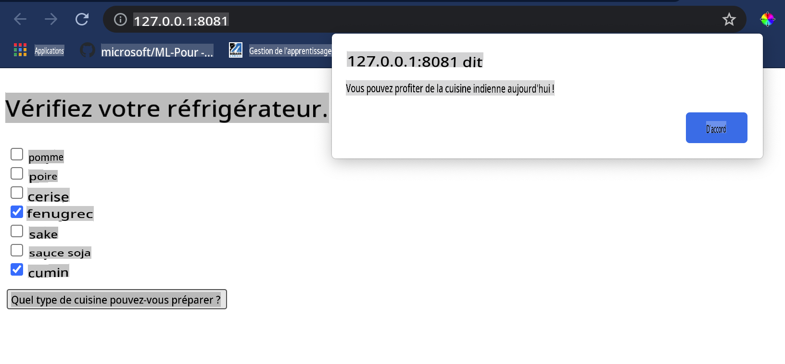

# Créer une application Web de recommandation de cuisine

Dans cette leçon, vous allez construire un modèle de classification en utilisant certaines des techniques que vous avez apprises dans les leçons précédentes et avec le délicieux ensemble de données sur la cuisine utilisé tout au long de cette série. De plus, vous allez créer une petite application web pour utiliser un modèle sauvegardé, en tirant parti de l'exécution web d'Onnx.

L'un des usages pratiques les plus utiles de l'apprentissage automatique est la construction de systèmes de recommandation, et vous pouvez faire le premier pas dans cette direction aujourd'hui !

[](https://youtu.be/17wdM9AHMfg "ML appliqué")

> 🎥 Cliquez sur l'image ci-dessus pour voir une vidéo : Jen Looper construit une application web utilisant des données de cuisine classées

## [Quiz avant la leçon](https://gray-sand-07a10f403.1.azurestaticapps.net/quiz/25/)

Dans cette leçon, vous apprendrez :

- Comment construire un modèle et le sauvegarder au format Onnx
- Comment utiliser Netron pour inspecter le modèle
- Comment utiliser votre modèle dans une application web pour l'inférence

## Construisez votre modèle

Construire des systèmes d'apprentissage automatique appliqués est une partie importante de l'exploitation de ces technologies pour vos systèmes d'entreprise. Vous pouvez utiliser des modèles dans vos applications web (et donc les utiliser dans un contexte hors ligne si nécessaire) en utilisant Onnx.

Dans une [leçon précédente](../../3-Web-App/1-Web-App/README.md), vous avez construit un modèle de régression sur les observations d'OVNIs, l'avez "picklé" et l'avez utilisé dans une application Flask. Bien que cette architecture soit très utile à connaître, c'est une application Python full-stack, et vos exigences peuvent inclure l'utilisation d'une application JavaScript.

Dans cette leçon, vous pouvez construire un système de base basé sur JavaScript pour l'inférence. Cependant, d'abord, vous devez entraîner un modèle et le convertir pour une utilisation avec Onnx.

## Exercice - entraîner un modèle de classification

Tout d'abord, entraînez un modèle de classification en utilisant l'ensemble de données sur les cuisines nettoyé que nous avons utilisé.

1. Commencez par importer des bibliothèques utiles :

    ```python
    !pip install skl2onnx
    import pandas as pd 
    ```

    Vous avez besoin de '[skl2onnx](https://onnx.ai/sklearn-onnx/)' pour aider à convertir votre modèle Scikit-learn au format Onnx.

1. Ensuite, travaillez avec vos données de la même manière que vous l'avez fait dans les leçons précédentes, en lisant un fichier CSV avec `read_csv()` :

    ```python
    data = pd.read_csv('../data/cleaned_cuisines.csv')
    data.head()
    ```

1. Supprimez les deux premières colonnes inutiles et sauvegardez les données restantes sous le nom 'X' :

    ```python
    X = data.iloc[:,2:]
    X.head()
    ```

1. Sauvegardez les étiquettes sous le nom 'y' :

    ```python
    y = data[['cuisine']]
    y.head()
    
    ```

### Commencez la routine d'entraînement

Nous allons utiliser la bibliothèque 'SVC' qui a une bonne précision.

1. Importez les bibliothèques appropriées de Scikit-learn :

    ```python
    from sklearn.model_selection import train_test_split
    from sklearn.svm import SVC
    from sklearn.model_selection import cross_val_score
    from sklearn.metrics import accuracy_score,precision_score,confusion_matrix,classification_report
    ```

1. Séparez les ensembles d'entraînement et de test :

    ```python
    X_train, X_test, y_train, y_test = train_test_split(X,y,test_size=0.3)
    ```

1. Construisez un modèle de classification SVC comme vous l'avez fait dans la leçon précédente :

    ```python
    model = SVC(kernel='linear', C=10, probability=True,random_state=0)
    model.fit(X_train,y_train.values.ravel())
    ```

1. Maintenant, testez votre modèle en appelant `predict()` :

    ```python
    y_pred = model.predict(X_test)
    ```

1. Imprimez un rapport de classification pour vérifier la qualité du modèle :

    ```python
    print(classification_report(y_test,y_pred))
    ```

    Comme nous l'avons vu précédemment, la précision est bonne :

    ```output
                    precision    recall  f1-score   support
    
         chinese       0.72      0.69      0.70       257
          indian       0.91      0.87      0.89       243
        japanese       0.79      0.77      0.78       239
          korean       0.83      0.79      0.81       236
            thai       0.72      0.84      0.78       224
    
        accuracy                           0.79      1199
       macro avg       0.79      0.79      0.79      1199
    weighted avg       0.79      0.79      0.79      1199
    ```

### Convertissez votre modèle en Onnx

Assurez-vous de faire la conversion avec le nombre de Tensor approprié. Cet ensemble de données a 380 ingrédients répertoriés, donc vous devez indiquer ce nombre dans `FloatTensorType` :

1. Convertissez en utilisant un nombre de tensor de 380.

    ```python
    from skl2onnx import convert_sklearn
    from skl2onnx.common.data_types import FloatTensorType
    
    initial_type = [('float_input', FloatTensorType([None, 380]))]
    options = {id(model): {'nocl': True, 'zipmap': False}}
    ```

1. Créez le fichier onx et sauvegardez-le sous le nom **model.onnx** :

    ```python
    onx = convert_sklearn(model, initial_types=initial_type, options=options)
    with open("./model.onnx", "wb") as f:
        f.write(onx.SerializeToString())
    ```

    > Notez que vous pouvez passer des [options](https://onnx.ai/sklearn-onnx/parameterized.html) dans votre script de conversion. Dans ce cas, nous avons passé 'nocl' à True et 'zipmap' à False. Étant donné qu'il s'agit d'un modèle de classification, vous avez la possibilité de supprimer ZipMap qui produit une liste de dictionnaires (non nécessaire). `nocl` refers to class information being included in the model. Reduce your model's size by setting `nocl` to 'True'. 

Running the entire notebook will now build an Onnx model and save it to this folder.

## View your model

Onnx models are not very visible in Visual Studio code, but there's a very good free software that many researchers use to visualize the model to ensure that it is properly built. Download [Netron](https://github.com/lutzroeder/Netron) and  open your model.onnx file. You can see your simple model visualized, with its 380 inputs and classifier listed:


Netron is a helpful tool to view your models.

Now you are ready to use this neat model in a web app. Let's build an app that will come in handy when you look in your refrigerator and try to figure out which combination of your leftover ingredients you can use to cook a given cuisine, as determined by your model.

## Build a recommender web application

You can use your model directly in a web app. This architecture also allows you to run it locally and even offline if needed. Start by creating an `index.html` file in the same folder where you stored your `model.onnx` fichier.

1. Dans ce fichier _index.html_, ajoutez le balisage suivant :

    ```html
    <!DOCTYPE html>
    <html>
        <header>
            <title>Cuisine Matcher</title>
        </header>
        <body>
            ...
        </body>
    </html>
    ```

1. Maintenant, en travaillant dans les balises `body`, ajoutez un peu de balisage pour montrer une liste de cases à cocher reflétant certains ingrédients :

    ```html
    <h1>Check your refrigerator. What can you create?</h1>
            <div id="wrapper">
                <div class="boxCont">
                    <input type="checkbox" value="4" class="checkbox">
                    <label>apple</label>
                </div>
            
                <div class="boxCont">
                    <input type="checkbox" value="247" class="checkbox">
                    <label>pear</label>
                </div>
            
                <div class="boxCont">
                    <input type="checkbox" value="77" class="checkbox">
                    <label>cherry</label>
                </div>
    
                <div class="boxCont">
                    <input type="checkbox" value="126" class="checkbox">
                    <label>fenugreek</label>
                </div>
    
                <div class="boxCont">
                    <input type="checkbox" value="302" class="checkbox">
                    <label>sake</label>
                </div>
    
                <div class="boxCont">
                    <input type="checkbox" value="327" class="checkbox">
                    <label>soy sauce</label>
                </div>
    
                <div class="boxCont">
                    <input type="checkbox" value="112" class="checkbox">
                    <label>cumin</label>
                </div>
            </div>
            <div style="padding-top:10px">
                <button onClick="startInference()">What kind of cuisine can you make?</button>
            </div> 
    ```

    Remarquez que chaque case à cocher a une valeur. Cela reflète l'index où l'ingrédient est trouvé selon l'ensemble de données. Par exemple, la pomme, dans cette liste alphabétique, occupe la cinquième colonne, donc sa valeur est '4' puisque nous commençons à compter à partir de 0. Vous pouvez consulter le [tableau des ingrédients](../../../../4-Classification/data/ingredient_indexes.csv) pour découvrir l'index d'un ingrédient donné.

    En poursuivant votre travail dans le fichier index.html, ajoutez un bloc de script où le modèle est appelé après la dernière fermeture `</div>`.

1. Tout d'abord, importez le [Onnx Runtime](https://www.onnxruntime.ai/) :

    ```html
    <script src="https://cdn.jsdelivr.net/npm/onnxruntime-web@1.9.0/dist/ort.min.js"></script> 
    ```

    > Onnx Runtime est utilisé pour permettre l'exécution de vos modèles Onnx sur une large gamme de plateformes matérielles, y compris des optimisations et une API à utiliser.

1. Une fois le Runtime en place, vous pouvez l'appeler :

    ```html
    <script>
        const ingredients = Array(380).fill(0);
        
        const checks = [...document.querySelectorAll('.checkbox')];
        
        checks.forEach(check => {
            check.addEventListener('change', function() {
                // toggle the state of the ingredient
                // based on the checkbox's value (1 or 0)
                ingredients[check.value] = check.checked ? 1 : 0;
            });
        });

        function testCheckboxes() {
            // validate if at least one checkbox is checked
            return checks.some(check => check.checked);
        }

        async function startInference() {

            let atLeastOneChecked = testCheckboxes()

            if (!atLeastOneChecked) {
                alert('Please select at least one ingredient.');
                return;
            }
            try {
                // create a new session and load the model.
                
                const session = await ort.InferenceSession.create('./model.onnx');

                const input = new ort.Tensor(new Float32Array(ingredients), [1, 380]);
                const feeds = { float_input: input };

                // feed inputs and run
                const results = await session.run(feeds);

                // read from results
                alert('You can enjoy ' + results.label.data[0] + ' cuisine today!')

            } catch (e) {
                console.log(`failed to inference ONNX model`);
                console.error(e);
            }
        }
               
    </script>
    ```

Dans ce code, plusieurs choses se passent :

1. Vous avez créé un tableau de 380 valeurs possibles (1 ou 0) à définir et à envoyer au modèle pour l'inférence, en fonction de si une case à cocher d'ingrédient est cochée.
2. Vous avez créé un tableau de cases à cocher et un moyen de déterminer si elles étaient cochées dans un `init` function that is called when the application starts. When a checkbox is checked, the `ingredients` array is altered to reflect the chosen ingredient.
3. You created a `testCheckboxes` function that checks whether any checkbox was checked.
4. You use `startInference` function when the button is pressed and, if any checkbox is checked, you start inference.
5. The inference routine includes:
   1. Setting up an asynchronous load of the model
   2. Creating a Tensor structure to send to the model
   3. Creating 'feeds' that reflects the `float_input` input that you created when training your model (you can use Netron to verify that name)
   4. Sending these 'feeds' to the model and waiting for a response

## Test your application

Open a terminal session in Visual Studio Code in the folder where your index.html file resides. Ensure that you have [http-server](https://www.npmjs.com/package/http-server) installed globally, and type `http-server` à l'invite. Un localhost devrait s'ouvrir et vous pouvez voir votre application web. Vérifiez quelle cuisine est recommandée en fonction de divers ingrédients :



Félicitations, vous avez créé une application web de 'recommandation' avec quelques champs. Prenez le temps de développer ce système !
## 🚀Défi

Votre application web est très minimale, alors continuez à l'élargir en utilisant les ingrédients et leurs index de la donnée [ingredient_indexes](../../../../4-Classification/data/ingredient_indexes.csv). Quelles combinaisons de saveurs fonctionnent pour créer un plat national donné ?

## [Quiz après la leçon](https://gray-sand-07a10f403.1.azurestaticapps.net/quiz/26/)

## Révision & Auto-apprentissage

Bien que cette leçon ait seulement effleuré l'utilité de la création d'un système de recommandation pour les ingrédients alimentaires, ce domaine des applications d'apprentissage automatique regorge d'exemples. Lisez un peu plus sur la façon dont ces systèmes sont construits :

- https://www.sciencedirect.com/topics/computer-science/recommendation-engine
- https://www.technologyreview.com/2014/08/25/171547/the-ultimate-challenge-for-recommendation-engines/
- https://www.technologyreview.com/2015/03/23/168831/everything-is-a-recommendation/

## Devoir 

[Construire un nouveau système de recommandation](assignment.md)

**Avertissement** :  
Ce document a été traduit à l'aide de services de traduction automatisés basés sur l'IA. Bien que nous visons à garantir l'exactitude, veuillez noter que les traductions automatiques peuvent contenir des erreurs ou des inexactitudes. Le document original dans sa langue natale doit être considéré comme la source autoritaire. Pour des informations critiques, une traduction professionnelle humaine est recommandée. Nous ne sommes pas responsables des malentendus ou des interprétations erronées résultant de l'utilisation de cette traduction.