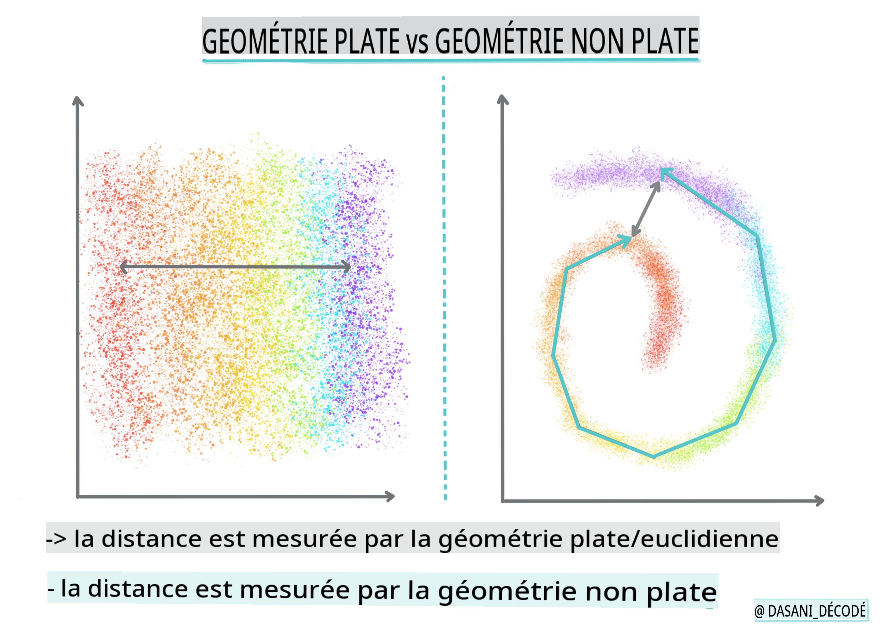
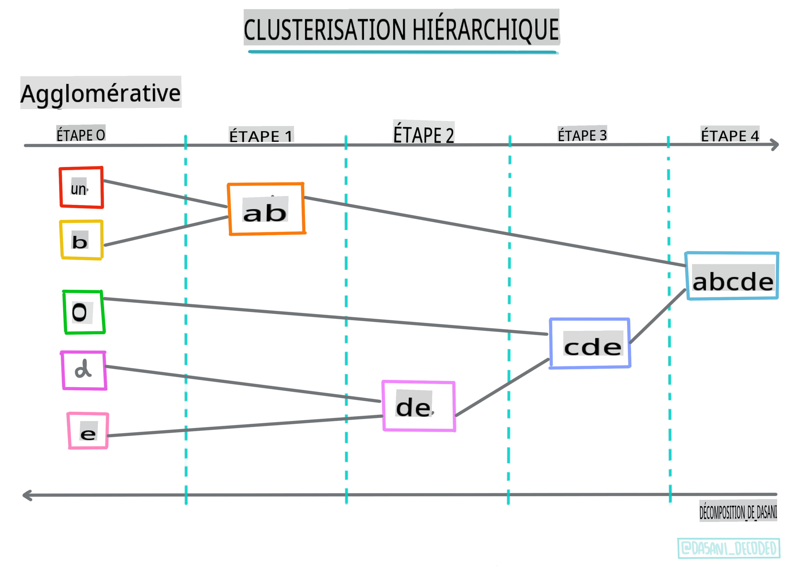
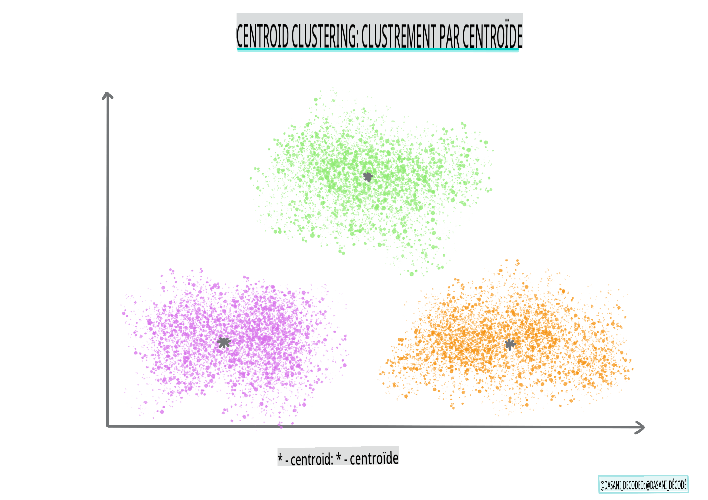

# Introduction au clustering

Le clustering est un type d'[Apprentissage Non Supervisé](https://wikipedia.org/wiki/Unsupervised_learning) qui suppose qu'un ensemble de données n'est pas étiqueté ou que ses entrées ne sont pas associées à des sorties prédéfinies. Il utilise divers algorithmes pour trier des données non étiquetées et fournir des regroupements selon les motifs qu'il discernent dans les données.

[](https://youtu.be/ty2advRiWJM "No One Like You par PSquare")

> 🎥 Cliquez sur l'image ci-dessus pour une vidéo. Pendant que vous étudiez l'apprentissage machine avec le clustering, profitez de quelques morceaux de Dance Hall nigérian - c'est une chanson très bien notée de 2014 par PSquare.

## [Quiz avant le cours](https://gray-sand-07a10f403.1.azurestaticapps.net/quiz/27/)
### Introduction

Le [clustering](https://link.springer.com/referenceworkentry/10.1007%2F978-0-387-30164-8_124) est très utile pour l'exploration des données. Voyons s'il peut aider à découvrir des tendances et des motifs dans la manière dont les auditeurs nigérians consomment la musique.

✅ Prenez une minute pour réfléchir aux utilisations du clustering. Dans la vie réelle, le clustering se produit chaque fois que vous avez une pile de linge et que vous devez trier les vêtements des membres de votre famille 🧦👕👖🩲. En science des données, le clustering se produit lorsque l'on essaie d'analyser les préférences d'un utilisateur ou de déterminer les caractéristiques d'un ensemble de données non étiqueté. Le clustering, d'une certaine manière, aide à donner un sens au chaos, comme un tiroir à chaussettes.

[](https://youtu.be/esmzYhuFnds "Introduction au Clustering")

> 🎥 Cliquez sur l'image ci-dessus pour une vidéo : John Guttag du MIT introduit le clustering.

Dans un cadre professionnel, le clustering peut être utilisé pour déterminer des choses comme la segmentation de marché, par exemple, pour déterminer quels groupes d'âge achètent quels articles. Une autre utilisation serait la détection d'anomalies, peut-être pour détecter une fraude à partir d'un ensemble de données de transactions par carte de crédit. Ou vous pourriez utiliser le clustering pour déterminer des tumeurs dans un lot de scans médicaux.

✅ Réfléchissez une minute à la façon dont vous pourriez avoir rencontré le clustering "dans la nature", dans un cadre bancaire, de commerce électronique ou commercial.

> 🎓 Fait intéressant, l'analyse des clusters a vu le jour dans les domaines de l'anthropologie et de la psychologie dans les années 1930. Pouvez-vous imaginer comment cela aurait pu être utilisé ?

Alternativement, vous pourriez l'utiliser pour regrouper des résultats de recherche - par liens d'achat, images ou avis, par exemple. Le clustering est utile lorsque vous avez un grand ensemble de données que vous souhaitez réduire et sur lequel vous souhaitez effectuer une analyse plus granulaire, de sorte que la technique puisse être utilisée pour en apprendre davantage sur les données avant la construction d'autres modèles.

✅ Une fois vos données organisées en clusters, vous leur assignez un identifiant de cluster, et cette technique peut être utile pour préserver la confidentialité d'un ensemble de données ; vous pouvez plutôt faire référence à un point de données par son identifiant de cluster, plutôt que par des données identifiables plus révélatrices. Pouvez-vous penser à d'autres raisons pour lesquelles vous feriez référence à un identifiant de cluster plutôt qu'à d'autres éléments du cluster pour l'identifier ?

Approfondissez votre compréhension des techniques de clustering dans ce [module d'apprentissage](https://docs.microsoft.com/learn/modules/train-evaluate-cluster-models?WT.mc_id=academic-77952-leestott).

## Commencer avec le clustering

[Scikit-learn propose un large éventail](https://scikit-learn.org/stable/modules/clustering.html) de méthodes pour effectuer du clustering. Le type que vous choisissez dépendra de votre cas d'utilisation. Selon la documentation, chaque méthode a divers avantages. Voici un tableau simplifié des méthodes prises en charge par Scikit-learn et de leurs cas d'utilisation appropriés :

| Nom de la méthode                  | Cas d'utilisation                                                        |
| :---------------------------------- | :---------------------------------------------------------------------- |
| K-Means                             | usage général, inductif                                                |
| Propagation d'affinité             | nombreux, clusters inégaux, inductif                                   |
| Mean-shift                          | nombreux, clusters inégaux, inductif                                   |
| Clustering spectral                 | peu, clusters égaux, transductif                                       |
| Clustering hiérarchique de Ward    | nombreux, clusters contraints, transductif                             |
| Clustering agglomératif            | nombreux, distances non euclidiennes, transductif                      |
| DBSCAN                              | géométrie non plate, clusters inégaux, transductif                    |
| OPTICS                              | géométrie non plate, clusters inégaux avec densité variable, transductif |
| Mélanges gaussiens                  | géométrie plate, inductif                                             |
| BIRCH                               | grand ensemble de données avec des valeurs aberrantes, inductif        |

> 🎓 La façon dont nous créons des clusters a beaucoup à voir avec la manière dont nous regroupons les points de données. Décomposons un peu le vocabulaire :
>
> 🎓 ['Transductif' vs. 'inductif'](https://wikipedia.org/wiki/Transduction_(machine_learning))
> 
> L'inférence transductive est dérivée de cas d'entraînement observés qui se rapportent à des cas de test spécifiques. L'inférence inductive est dérivée de cas d'entraînement qui se rapportent à des règles générales qui ne sont ensuite appliquées qu'aux cas de test.
> 
> Un exemple : Imaginez que vous ayez un ensemble de données qui est seulement partiellement étiqueté. Certaines choses sont des 'disques', certaines des 'cd', et certaines sont vides. Votre travail est de fournir des étiquettes pour les vides. Si vous choisissez une approche inductive, vous entraîneriez un modèle à la recherche de 'disques' et de 'cd', et appliqueriez ces étiquettes à vos données non étiquetées. Cette approche aura du mal à classifier des choses qui sont en réalité des 'cassettes'. Une approche transductive, en revanche, gère ces données inconnues de manière plus efficace car elle s'efforce de regrouper des éléments similaires ensemble puis applique une étiquette à un groupe. Dans ce cas, les clusters pourraient refléter des 'objets musicaux ronds' et des 'objets musicaux carrés'.
> 
> 🎓 ['Géométrie non plate' vs. 'plate'](https://datascience.stackexchange.com/questions/52260/terminology-flat-geometry-in-the-context-of-clustering)
> 
> Dérivée de la terminologie mathématique, la géométrie non plate vs. plate fait référence à la mesure des distances entre les points par des méthodes géométriques soit 'plates' ([Euclidienne](https://wikipedia.org/wiki/Euclidean_geometry)) soit 'non plates' (non euclidiennes).
>
> 'Plate' dans ce contexte fait référence à la géométrie euclidienne (dont certaines parties sont enseignées comme 'géométrie plane'), et non plate fait référence à la géométrie non euclidienne. Quel rapport la géométrie a-t-elle avec l'apprentissage machine ? Eh bien, en tant que deux domaines ancrés dans les mathématiques, il doit y avoir un moyen commun de mesurer les distances entre les points dans les clusters, et cela peut être fait de manière 'plate' ou 'non plate', selon la nature des données. Les [distances euclidiennes](https://wikipedia.org/wiki/Euclidean_distance) sont mesurées comme la longueur d'un segment de ligne entre deux points. Les [distances non euclidiennes](https://wikipedia.org/wiki/Non-Euclidean_geometry) sont mesurées le long d'une courbe. Si vos données, visualisées, semblent ne pas exister sur un plan, vous pourriez avoir besoin d'utiliser un algorithme spécialisé pour les gérer.
>

> Infographie par [Dasani Madipalli](https://twitter.com/dasani_decoded)
> 
> 🎓 ['Distances'](https://web.stanford.edu/class/cs345a/slides/12-clustering.pdf)
> 
> Les clusters sont définis par leur matrice de distance, c'est-à-dire les distances entre les points. Cette distance peut être mesurée de plusieurs manières. Les clusters euclidiens sont définis par la moyenne des valeurs des points et contiennent un 'centroïde' ou point central. Les distances sont donc mesurées par rapport à ce centroïde. Les distances non euclidiennes se réfèrent aux 'clustroids', le point le plus proche des autres points. Les clustroids, à leur tour, peuvent être définis de différentes manières.
> 
> 🎓 ['Contraint'](https://wikipedia.org/wiki/Constrained_clustering)
> 
> Le [Clustering Contraint](https://web.cs.ucdavis.edu/~davidson/Publications/ICDMTutorial.pdf) introduit l'apprentissage 'semi-supervisé' dans cette méthode non supervisée. Les relations entre les points sont signalées comme 'ne peuvent pas être liées' ou 'doivent être liées', de sorte que certaines règles sont imposées à l'ensemble de données.
>
> Un exemple : Si un algorithme est lâché sur un lot de données non étiquetées ou semi-étiquetées, les clusters qu'il produit peuvent être de mauvaise qualité. Dans l'exemple ci-dessus, les clusters pourraient regrouper des 'objets musicaux ronds', des 'objets musicaux carrés' et des 'objets triangulaires' et des 'biscuits'. Si des contraintes ou des règles à suivre sont données ("l'objet doit être en plastique", "l'objet doit pouvoir produire de la musique"), cela peut aider à 'contraindre' l'algorithme à faire de meilleurs choix.
> 
> 🎓 'Densité'
> 
> Les données qui sont 'bruyantes' sont considérées comme 'denses'. Les distances entre les points dans chacun de ses clusters peuvent se révéler, après examen, plus ou moins denses, ou 'encombrées', et donc ces données doivent être analysées avec la méthode de clustering appropriée. [Cet article](https://www.kdnuggets.com/2020/02/understanding-density-based-clustering.html) démontre la différence entre l'utilisation des algorithmes de clustering K-Means et HDBSCAN pour explorer un ensemble de données bruyantes avec une densité de cluster inégale.

## Algorithmes de clustering

Il existe plus de 100 algorithmes de clustering, et leur utilisation dépend de la nature des données à disposition. Discutons de certains des principaux :

- **Clustering hiérarchique**. Si un objet est classé par sa proximité à un objet voisin, plutôt qu'à un plus éloigné, des clusters sont formés en fonction de la distance de leurs membres à d'autres objets. Le clustering agglomératif de Scikit-learn est hiérarchique.

   
   > Infographie par [Dasani Madipalli](https://twitter.com/dasani_decoded)

- **Clustering par centroïde**. Cet algorithme populaire nécessite le choix de 'k', ou le nombre de clusters à former, après quoi l'algorithme détermine le point central d'un cluster et regroupe les données autour de ce point. Le [clustering K-means](https://wikipedia.org/wiki/K-means_clustering) est une version populaire du clustering par centroïde. Le centre est déterminé par la moyenne la plus proche, d'où le nom. La distance au cluster est minimisée.

   
   > Infographie par [Dasani Madipalli](https://twitter.com/dasani_decoded)

- **Clustering basé sur la distribution**. Basé sur la modélisation statistique, le clustering basé sur la distribution se concentre sur la détermination de la probabilité qu'un point de données appartienne à un cluster, et l'assigne en conséquence. Les méthodes de mélange gaussien appartiennent à ce type.

- **Clustering basé sur la densité**. Les points de données sont assignés à des clusters en fonction de leur densité, ou de leur regroupement autour les uns des autres. Les points de données éloignés du groupe sont considérés comme des valeurs aberrantes ou du bruit. DBSCAN, Mean-shift et OPTICS appartiennent à ce type de clustering.

- **Clustering basé sur une grille**. Pour des ensembles de données multidimensionnels, une grille est créée et les données sont divisées parmi les cellules de la grille, créant ainsi des clusters.

## Exercice - cluster vos données

Le clustering en tant que technique est grandement aidé par une visualisation appropriée, alors commençons par visualiser nos données musicales. Cet exercice nous aidera à décider quelle méthode de clustering nous devrions utiliser le plus efficacement pour la nature de ces données.

1. Ouvrez le fichier [_notebook.ipynb_](https://github.com/microsoft/ML-For-Beginners/blob/main/5-Clustering/1-Visualize/notebook.ipynb) dans ce dossier.

1. Importez le package `Seaborn` pour une bonne visualisation des données.

    ```python
    !pip install seaborn
    ```

1. Ajoutez les données des chansons depuis [_nigerian-songs.csv_](https://github.com/microsoft/ML-For-Beginners/blob/main/5-Clustering/data/nigerian-songs.csv). Chargez un dataframe avec des données sur les chansons. Préparez-vous à explorer ces données en important les bibliothèques et en affichant les données :

    ```python
    import matplotlib.pyplot as plt
    import pandas as pd
    
    df = pd.read_csv("../data/nigerian-songs.csv")
    df.head()
    ```

    Vérifiez les premières lignes de données :

    |     | name                     | album                        | artist              | artist_top_genre | release_date | length | popularity | danceability | acousticness | energy | instrumentalness | liveness | loudness | speechiness | tempo   | time_signature |
    | --- | ------------------------ | ---------------------------- | ------------------- | ---------------- | ------------ | ------ | ---------- | ------------ | ------------ | ------ | ---------------- | -------- | -------- | ----------- | ------- | -------------- |
    | 0   | Sparky                   | Mandy & The Jungle           | Cruel Santino       | alternative r&b  | 2019         | 144000 | 48         | 0.666        | 0.851        | 0.42   | 0.534            | 0.11     | -6.699   | 0.0829      | 133.015 | 5              |
    | 1   | shuga rush               | EVERYTHING YOU HEARD IS TRUE | Odunsi (The Engine) | afropop          | 2020         | 89488  | 30         | 0.71         | 0.0822       | 0.683  | 0.000169         | 0.101    | -5.64    | 0.36        | 129.993 | 3              |
    | 2   | LITT!                    | LITT!                        | AYLØ                | indie r&b        | 2018         | 207758 | 40         | 0.836        | 0.272        | 0.564  | 0.000537         | 0.11     | -7.127   | 0.0424      | 130.005 | 4              |
    | 3   | Confident / Feeling Cool | Enjoy Your Life              | Lady Donli          | nigerian pop     | 2019         | 175135 | 14         | 0.894        | 0.798        | 0.611  | 0.000187         | 0.0964   | -4.961   | 0.113       | 111.087 | 4              |
    | 4   | wanted you               | rare.                        | Odunsi (The Engine) | afropop          | 2018         | 152049 | 25         | 0.702        | 0.116        | 0.833  | 0.91             | 0.348    | -6.044   | 0.0447      | 105.115 | 4              |

1. Obtenez des informations sur le dataframe en appelant `info()` :

    ```python
    df.info()
    ```

   La sortie devrait ressembler à ceci :

    ```output
    <class 'pandas.core.frame.DataFrame'>
    RangeIndex: 530 entries, 0 to 529
    Data columns (total 16 columns):
     #   Column            Non-Null Count  Dtype  
    ---  ------            --------------  -----  
     0   name              530 non-null    object 
     1   album             530 non-null    object 
     2   artist            530 non-null    object 
     3   artist_top_genre  530 non-null    object 
     4   release_date      530 non-null    int64  
     5   length            530 non-null    int64  
     6   popularity        530 non-null    int64  
     7   danceability      530 non-null    float64
     8   acousticness      530 non-null    float64
     9   energy            530 non-null    float64
     10  instrumentalness  530 non-null    float64
     11  liveness          530 non-null    float64
     12  loudness          530 non-null    float64
     13  speechiness       530 non-null    float64
     14  tempo             530 non-null    float64
     15  time_signature    530 non-null    int64  
    dtypes: float64(8), int64(4), object(4)
    memory usage: 66.4+ KB
    ```

1. Vérifiez les valeurs nulles, en appelant `isnull()` et en vérifiant que la somme est 0 :

    ```python
    df.isnull().sum()
    ```

    Tout semble bon :

    ```output
    name                0
    album               0
    artist              0
    artist_top_genre    0
    release_date        0
    length              0
    popularity          0
    danceability        0
    acousticness        0
    energy              0
    instrumentalness    0
    liveness            0
    loudness            0
    speechiness         0
    tempo               0
    time_signature      0
    dtype: int64
    ```

1. Décrivez les données :

    ```python
    df.describe()
    ```

    |       | release_date | length      | popularity | danceability | acousticness | energy   | instrumentalness | liveness | loudness  | speechiness | tempo      | time_signature |
    | ----- | ------------ | ----------- | ---------- | ------------ | ------------ | -------- | ---------------- | -------- | --------- | ----------- | ---------- | -------------- |
    | count | 530          | 530         | 530        | 530          | 530          | 530      | 530              | 530      | 530       | 530         | 530        | 530            |
    | mean  | 2015.390566  | 222298.1698 | 17.507547  | 0.741619     | 0.265412     | 0.760623 | 0.016305         | 0.147308 | -4.953011 | 0.130748    | 116.487864 | 3.986792       |
    | std   | 3.131688     | 39696.82226 | 18.992212  | 0.117522     | 0.208342     | 0.148533 | 0.090321         | 0.123588 | 2.464186  | 0.092939    | 23.518601  | 0.333701       |
    | min   | 1998        
## [Quiz post-conférence](https://gray-sand-07a10f403.1.azurestaticapps.net/quiz/28/)

## Revue et auto-apprentissage

Avant d'appliquer des algorithmes de clustering, comme nous l'avons appris, il est judicieux de comprendre la nature de votre ensemble de données. Lisez-en plus sur ce sujet [ici](https://www.kdnuggets.com/2019/10/right-clustering-algorithm.html)

[Cet article utile](https://www.freecodecamp.org/news/8-clustering-algorithms-in-machine-learning-that-all-data-scientists-should-know/) vous guide à travers les différentes manières dont divers algorithmes de clustering se comportent, selon les formes de données.

## Devoir

[Recherchez d'autres visualisations pour le clustering](assignment.md)

**Avertissement** :  
Ce document a été traduit à l'aide de services de traduction automatisés basés sur l'IA. Bien que nous nous efforçons d'assurer l'exactitude, veuillez noter que les traductions automatiques peuvent contenir des erreurs ou des inexactitudes. Le document original dans sa langue natale doit être considéré comme la source autoritaire. Pour des informations critiques, une traduction humaine professionnelle est recommandée. Nous ne sommes pas responsables des malentendus ou des erreurs d'interprétation résultant de l'utilisation de cette traduction.