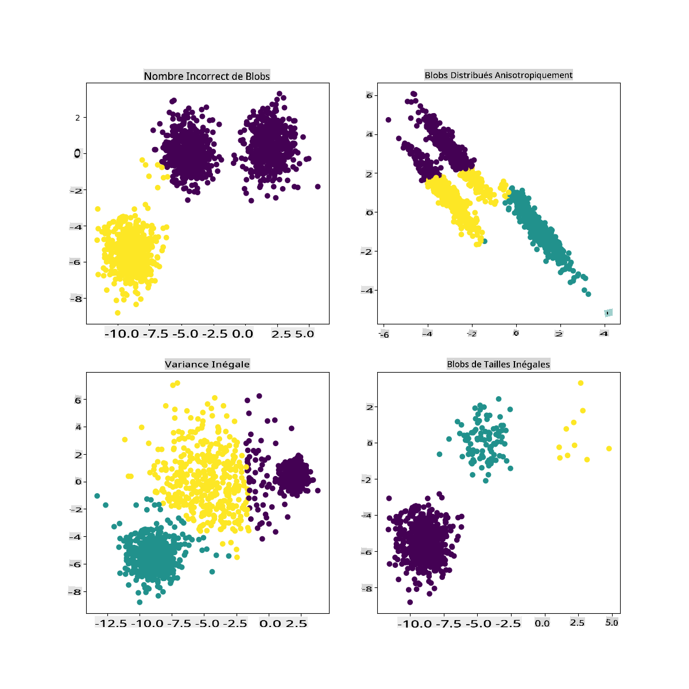

<!--
CO_OP_TRANSLATOR_METADATA:
{
  "original_hash": "085d571097d201810720df4cd379f8c2",
  "translation_date": "2025-09-03T23:09:58+00:00",
  "source_file": "5-Clustering/2-K-Means/README.md",
  "language_code": "fr"
}
-->
# Regroupement K-Means

## [Quiz avant le cours](https://gray-sand-07a10f403.1.azurestaticapps.net/quiz/29/)

Dans cette leçon, vous apprendrez à créer des regroupements en utilisant Scikit-learn et le jeu de données sur la musique nigériane que vous avez importé précédemment. Nous couvrirons les bases du K-Means pour le regroupement. Gardez à l'esprit que, comme vous l'avez appris dans la leçon précédente, il existe de nombreuses façons de travailler avec des regroupements, et la méthode que vous utilisez dépend de vos données. Nous allons essayer le K-Means car c'est la technique de regroupement la plus courante. Commençons !

Termes que vous allez découvrir :

- Score de silhouette
- Méthode du coude
- Inertie
- Variance

## Introduction

[Le regroupement K-Means](https://wikipedia.org/wiki/K-means_clustering) est une méthode issue du domaine du traitement du signal. Elle est utilisée pour diviser et partitionner des groupes de données en 'k' regroupements à l'aide d'une série d'observations. Chaque observation travaille à regrouper un point de données donné le plus proche de sa 'moyenne' ou du point central d'un regroupement.

Les regroupements peuvent être visualisés sous forme de [diagrammes de Voronoï](https://wikipedia.org/wiki/Voronoi_diagram), qui incluent un point (ou 'graine') et sa région correspondante.


> Infographie par [Jen Looper](https://twitter.com/jenlooper)

Le processus de regroupement K-Means [s'exécute en trois étapes](https://scikit-learn.org/stable/modules/clustering.html#k-means) :

1. L'algorithme sélectionne un nombre k de points centraux en échantillonnant à partir du jeu de données. Ensuite, il boucle :
    1. Il attribue chaque échantillon au centroïde le plus proche.
    2. Il crée de nouveaux centroïdes en prenant la valeur moyenne de tous les échantillons attribués aux centroïdes précédents.
    3. Puis, il calcule la différence entre les nouveaux et les anciens centroïdes et répète jusqu'à ce que les centroïdes se stabilisent.

Un inconvénient du K-Means est que vous devez définir 'k', c'est-à-dire le nombre de centroïdes. Heureusement, la 'méthode du coude' aide à estimer une bonne valeur de départ pour 'k'. Vous allez l'essayer dans un instant.

## Prérequis

Vous travaillerez dans le fichier [_notebook.ipynb_](https://github.com/microsoft/ML-For-Beginners/blob/main/5-Clustering/2-K-Means/notebook.ipynb) de cette leçon, qui inclut l'importation des données et le nettoyage préliminaire que vous avez effectué dans la leçon précédente.

## Exercice - préparation

Commencez par examiner à nouveau les données des chansons.

1. Créez un boxplot en appelant `boxplot()` pour chaque colonne :

    ```python
    plt.figure(figsize=(20,20), dpi=200)
    
    plt.subplot(4,3,1)
    sns.boxplot(x = 'popularity', data = df)
    
    plt.subplot(4,3,2)
    sns.boxplot(x = 'acousticness', data = df)
    
    plt.subplot(4,3,3)
    sns.boxplot(x = 'energy', data = df)
    
    plt.subplot(4,3,4)
    sns.boxplot(x = 'instrumentalness', data = df)
    
    plt.subplot(4,3,5)
    sns.boxplot(x = 'liveness', data = df)
    
    plt.subplot(4,3,6)
    sns.boxplot(x = 'loudness', data = df)
    
    plt.subplot(4,3,7)
    sns.boxplot(x = 'speechiness', data = df)
    
    plt.subplot(4,3,8)
    sns.boxplot(x = 'tempo', data = df)
    
    plt.subplot(4,3,9)
    sns.boxplot(x = 'time_signature', data = df)
    
    plt.subplot(4,3,10)
    sns.boxplot(x = 'danceability', data = df)
    
    plt.subplot(4,3,11)
    sns.boxplot(x = 'length', data = df)
    
    plt.subplot(4,3,12)
    sns.boxplot(x = 'release_date', data = df)
    ```

    Ces données sont un peu bruyantes : en observant chaque colonne sous forme de boxplot, vous pouvez voir des valeurs aberrantes.

    

Vous pourriez parcourir le jeu de données et supprimer ces valeurs aberrantes, mais cela rendrait les données assez minimales.

1. Pour l'instant, choisissez les colonnes que vous utiliserez pour votre exercice de regroupement. Sélectionnez celles avec des plages similaires et encodez la colonne `artist_top_genre` en données numériques :

    ```python
    from sklearn.preprocessing import LabelEncoder
    le = LabelEncoder()
    
    X = df.loc[:, ('artist_top_genre','popularity','danceability','acousticness','loudness','energy')]
    
    y = df['artist_top_genre']
    
    X['artist_top_genre'] = le.fit_transform(X['artist_top_genre'])
    
    y = le.transform(y)
    ```

1. Maintenant, vous devez choisir combien de regroupements cibler. Vous savez qu'il y a 3 genres musicaux que nous avons extraits du jeu de données, alors essayons avec 3 :

    ```python
    from sklearn.cluster import KMeans
    
    nclusters = 3 
    seed = 0
    
    km = KMeans(n_clusters=nclusters, random_state=seed)
    km.fit(X)
    
    # Predict the cluster for each data point
    
    y_cluster_kmeans = km.predict(X)
    y_cluster_kmeans
    ```

Vous voyez un tableau imprimé avec des regroupements prédits (0, 1 ou 2) pour chaque ligne du dataframe.

1. Utilisez ce tableau pour calculer un 'score de silhouette' :

    ```python
    from sklearn import metrics
    score = metrics.silhouette_score(X, y_cluster_kmeans)
    score
    ```

## Score de silhouette

Cherchez un score de silhouette proche de 1. Ce score varie de -1 à 1, et si le score est 1, le regroupement est dense et bien séparé des autres regroupements. Une valeur proche de 0 représente des regroupements qui se chevauchent, avec des échantillons très proches de la frontière de décision des regroupements voisins. [(Source)](https://dzone.com/articles/kmeans-silhouette-score-explained-with-python-exam)

Notre score est **0,53**, donc en plein milieu. Cela indique que nos données ne sont pas particulièrement adaptées à ce type de regroupement, mais continuons.

### Exercice - construire un modèle

1. Importez `KMeans` et commencez le processus de regroupement.

    ```python
    from sklearn.cluster import KMeans
    wcss = []
    
    for i in range(1, 11):
        kmeans = KMeans(n_clusters = i, init = 'k-means++', random_state = 42)
        kmeans.fit(X)
        wcss.append(kmeans.inertia_)
    
    ```

    Il y a quelques parties ici qui méritent une explication.

    > 🎓 range : Ce sont les itérations du processus de regroupement.

    > 🎓 random_state : "Détermine la génération de nombres aléatoires pour l'initialisation des centroïdes." [Source](https://scikit-learn.org/stable/modules/generated/sklearn.cluster.KMeans.html#sklearn.cluster.KMeans)

    > 🎓 WCSS : "somme des carrés intra-regroupement" mesure la distance moyenne au carré de tous les points d'un regroupement par rapport au centroïde du regroupement. [Source](https://medium.com/@ODSC/unsupervised-learning-evaluating-clusters-bd47eed175ce).

    > 🎓 Inertie : Les algorithmes K-Means tentent de choisir des centroïdes pour minimiser l'inertie, "une mesure de la cohérence interne des regroupements." [Source](https://scikit-learn.org/stable/modules/clustering.html). La valeur est ajoutée à la variable wcss à chaque itération.

    > 🎓 k-means++ : Dans [Scikit-learn](https://scikit-learn.org/stable/modules/clustering.html#k-means), vous pouvez utiliser l'optimisation 'k-means++', qui "initialise les centroïdes pour qu'ils soient (généralement) éloignés les uns des autres, conduisant probablement à de meilleurs résultats que l'initialisation aléatoire."

### Méthode du coude

Précédemment, vous avez supposé que, parce que vous avez ciblé 3 genres musicaux, vous devriez choisir 3 regroupements. Mais est-ce le cas ?

1. Utilisez la 'méthode du coude' pour en être sûr.

    ```python
    plt.figure(figsize=(10,5))
    sns.lineplot(x=range(1, 11), y=wcss, marker='o', color='red')
    plt.title('Elbow')
    plt.xlabel('Number of clusters')
    plt.ylabel('WCSS')
    plt.show()
    ```

    Utilisez la variable `wcss` que vous avez construite à l'étape précédente pour créer un graphique montrant où se trouve le 'pli' dans le coude, ce qui indique le nombre optimal de regroupements. Peut-être que c'est **bien** 3 !

    

## Exercice - afficher les regroupements

1. Essayez à nouveau le processus, cette fois en définissant trois regroupements, et affichez les regroupements sous forme de graphique de dispersion :

    ```python
    from sklearn.cluster import KMeans
    kmeans = KMeans(n_clusters = 3)
    kmeans.fit(X)
    labels = kmeans.predict(X)
    plt.scatter(df['popularity'],df['danceability'],c = labels)
    plt.xlabel('popularity')
    plt.ylabel('danceability')
    plt.show()
    ```

1. Vérifiez la précision du modèle :

    ```python
    labels = kmeans.labels_
    
    correct_labels = sum(y == labels)
    
    print("Result: %d out of %d samples were correctly labeled." % (correct_labels, y.size))
    
    print('Accuracy score: {0:0.2f}'. format(correct_labels/float(y.size)))
    ```

    La précision de ce modèle n'est pas très bonne, et la forme des regroupements vous donne un indice sur la raison.

    

    Ces données sont trop déséquilibrées, trop peu corrélées et il y a trop de variance entre les valeurs des colonnes pour bien regrouper. En fait, les regroupements qui se forment sont probablement fortement influencés ou biaisés par les trois catégories de genres que nous avons définies ci-dessus. C'était un processus d'apprentissage !

    Dans la documentation de Scikit-learn, vous pouvez voir qu'un modèle comme celui-ci, avec des regroupements pas très bien délimités, a un problème de 'variance' :

    
    > Infographie de Scikit-learn

## Variance

La variance est définie comme "la moyenne des carrés des écarts par rapport à la moyenne" [(Source)](https://www.mathsisfun.com/data/standard-deviation.html). Dans le contexte de ce problème de regroupement, cela fait référence à des données où les nombres de notre jeu de données ont tendance à diverger un peu trop de la moyenne.

✅ C'est un excellent moment pour réfléchir à toutes les façons dont vous pourriez corriger ce problème. Ajuster un peu plus les données ? Utiliser différentes colonnes ? Utiliser un autre algorithme ? Astuce : Essayez de [normaliser vos données](https://www.mygreatlearning.com/blog/learning-data-science-with-k-means-clustering/) pour les mettre à l'échelle et tester d'autres colonnes.

> Essayez ce '[calculateur de variance](https://www.calculatorsoup.com/calculators/statistics/variance-calculator.php)' pour mieux comprendre le concept.

---

## 🚀Défi

Passez du temps avec ce notebook en ajustant les paramètres. Pouvez-vous améliorer la précision du modèle en nettoyant davantage les données (en supprimant les valeurs aberrantes, par exemple) ? Vous pouvez utiliser des poids pour donner plus d'importance à certains échantillons de données. Que pouvez-vous faire d'autre pour créer de meilleurs regroupements ?

Astuce : Essayez de mettre vos données à l'échelle. Il y a du code commenté dans le notebook qui ajoute une mise à l'échelle standard pour que les colonnes de données se ressemblent davantage en termes de plage. Vous constaterez que, bien que le score de silhouette diminue, le 'pli' dans le graphique du coude devient plus lisse. Cela est dû au fait que laisser les données non mises à l'échelle permet aux données avec moins de variance de peser davantage. Lisez un peu plus sur ce problème [ici](https://stats.stackexchange.com/questions/21222/are-mean-normalization-and-feature-scaling-needed-for-k-means-clustering/21226#21226).

## [Quiz après le cours](https://gray-sand-07a10f403.1.azurestaticapps.net/quiz/30/)

## Révision et étude personnelle

Jetez un œil à un simulateur K-Means [comme celui-ci](https://user.ceng.metu.edu.tr/~akifakkus/courses/ceng574/k-means/). Vous pouvez utiliser cet outil pour visualiser des points de données d'échantillon et déterminer leurs centroïdes. Vous pouvez modifier l'aléatoire des données, le nombre de regroupements et le nombre de centroïdes. Cela vous aide-t-il à comprendre comment les données peuvent être regroupées ?

Consultez également [ce document sur le K-Means](https://stanford.edu/~cpiech/cs221/handouts/kmeans.html) de Stanford.

## Devoir

[Essayez différentes méthodes de regroupement](assignment.md)

---

**Avertissement** :  
Ce document a été traduit à l'aide du service de traduction automatique [Co-op Translator](https://github.com/Azure/co-op-translator). Bien que nous nous efforcions d'assurer l'exactitude, veuillez noter que les traductions automatisées peuvent contenir des erreurs ou des inexactitudes. Le document original dans sa langue d'origine doit être considéré comme la source faisant autorité. Pour des informations critiques, il est recommandé de recourir à une traduction professionnelle réalisée par un humain. Nous déclinons toute responsabilité en cas de malentendus ou d'interprétations erronées résultant de l'utilisation de cette traduction.