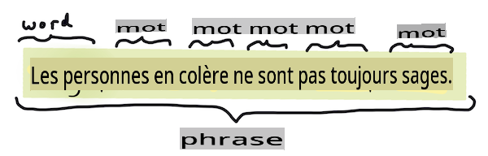
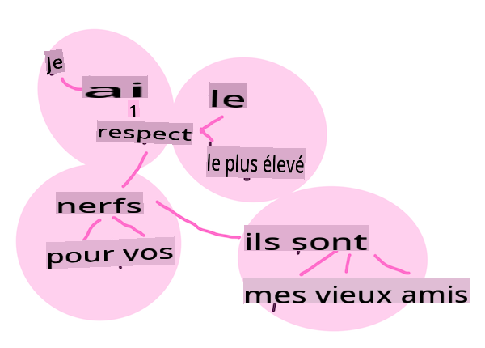
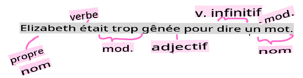

# Tâches et techniques courantes en traitement du langage naturel

Pour la plupart des tâches de *traitement du langage naturel*, le texte à traiter doit être décomposé, examiné, et les résultats stockés ou croisés avec des règles et des ensembles de données. Ces tâches permettent au programmeur de déduire le _sens_ ou l’_intention_ ou simplement la _fréquence_ des termes et des mots dans un texte.

## [Quiz pré-conférence](https://gray-sand-07a10f403.1.azurestaticapps.net/quiz/33/)

Découvrons les techniques courantes utilisées dans le traitement de texte. Associées à l'apprentissage automatique, ces techniques vous aident à analyser efficacement de grandes quantités de texte. Avant d'appliquer l'apprentissage automatique à ces tâches, comprenons cependant les problèmes rencontrés par un spécialiste en traitement du langage naturel.

## Tâches courantes en NLP

Il existe différentes manières d'analyser un texte sur lequel vous travaillez. Il y a des tâches que vous pouvez effectuer et, à travers ces tâches, vous êtes en mesure de comprendre le texte et de tirer des conclusions. Vous effectuez généralement ces tâches dans un certain ordre.

### Tokenisation

Probablement la première chose que la plupart des algorithmes de NLP doivent faire est de diviser le texte en tokens, ou mots. Bien que cela semble simple, tenir compte de la ponctuation et des délimiteurs de mots et de phrases dans différentes langues peut rendre cela délicat. Vous devrez peut-être utiliser diverses méthodes pour déterminer les délimitations.


> Tokenisation d'une phrase de **Orgueil et Préjugés**. Infographie par [Jen Looper](https://twitter.com/jenlooper)

### Embeddings

[Les embeddings de mots](https://wikipedia.org/wiki/Word_embedding) sont une manière de convertir vos données textuelles numériquement. Les embeddings sont réalisés de manière à ce que les mots ayant un sens similaire ou les mots utilisés ensemble se regroupent.


> "J'ai le plus grand respect pour vos nerfs, ce sont mes vieux amis." - Embeddings de mots pour une phrase de **Orgueil et Préjugés**. Infographie par [Jen Looper](https://twitter.com/jenlooper)

✅ Essayez [cet outil intéressant](https://projector.tensorflow.org/) pour expérimenter avec les embeddings de mots. En cliquant sur un mot, vous voyez des groupes de mots similaires : 'jouet' se regroupe avec 'disney', 'lego', 'playstation', et 'console'.

### Analyse syntaxique et étiquetage des parties du discours

Chaque mot qui a été tokenisé peut être étiqueté comme une partie du discours - un nom, un verbe ou un adjectif. La phrase `the quick red fox jumped over the lazy brown dog` pourrait être étiquetée comme suit : renard = nom, a sauté = verbe.



> Analyse syntaxique d'une phrase de **Orgueil et Préjugés**. Infographie par [Jen Looper](https://twitter.com/jenlooper)

L'analyse syntaxique consiste à reconnaître quels mots sont liés les uns aux autres dans une phrase - par exemple, `the quick red fox jumped` est une séquence adjectif-nom-verbe qui est distincte de la séquence `lazy brown dog`.  

### Fréquences de mots et de phrases

Une procédure utile lors de l'analyse d'un grand corpus de texte est de construire un dictionnaire de chaque mot ou phrase d'intérêt et de la fréquence à laquelle il apparaît. La phrase `the quick red fox jumped over the lazy brown dog` a une fréquence de mot de 2 pour le.

Voyons un exemple de texte où nous comptons la fréquence des mots. Le poème de Rudyard Kipling, The Winners, contient le vers suivant :

```output
What the moral? Who rides may read.
When the night is thick and the tracks are blind
A friend at a pinch is a friend, indeed,
But a fool to wait for the laggard behind.
Down to Gehenna or up to the Throne,
He travels the fastest who travels alone.
```

Les fréquences de phrases peuvent être insensibles à la casse ou sensibles à la casse selon les besoins, la phrase `un ami` has a frequency of 2 and `le` has a frequency of 6, and `voyages` est 2.

### N-grams

Un texte peut être divisé en séquences de mots d'une longueur définie, un seul mot (unigramme), deux mots (bigrammes), trois mots (trigrammes) ou tout nombre de mots (n-grams).

Par exemple, `the quick red fox jumped over the lazy brown dog` avec un score n-gram de 2 produit les n-grams suivants :

1. le rapide 
2. rapide rouge 
3. rouge renard
4. renard a sauté 
5. a sauté par-dessus 
6. par-dessus le 
7. le paresseux 
8. paresseux brun 
9. brun chien

Il peut être plus facile de visualiser cela comme une boîte glissante sur la phrase. Voici pour les n-grams de 3 mots, le n-gram est en gras dans chaque phrase :

1.   <u>**le rapide rouge**</u> renard a sauté par-dessus le paresseux brun chien
2.   le **<u>rapide rouge renard</u>** a sauté par-dessus le paresseux brun chien
3.   le rapide **<u>rouge renard a sauté</u>** par-dessus le paresseux brun chien
4.   le rapide rouge **<u>renard a sauté par-dessus</u>** le paresseux brun chien
5.   le rapide rouge renard **<u>a sauté par-dessus le</u>** paresseux brun chien
6.   le rapide rouge renard a sauté **<u>par-dessus le paresseux</u>** brun chien
7.   le rapide rouge renard a sauté par-dessus <u>**le paresseux brun**</u> chien
8.   le rapide rouge renard a sauté par-dessus le **<u>paresseux brun chien</u>**


> Valeur n-gram de 3 : Infographie par [Jen Looper](https://twitter.com/jenlooper)

### Extraction de phrases nominales

Dans la plupart des phrases, il y a un nom qui est le sujet ou l'objet de la phrase. En anglais, il est souvent identifiable par la présence de 'un' ou 'une' ou 'le' qui le précède. Identifier le sujet ou l'objet d'une phrase en 'extraction de la phrase nominale' est une tâche courante en NLP lorsqu'il s'agit de comprendre le sens d'une phrase.

✅ Dans la phrase "Je ne peux pas me fixer sur l'heure, ou le lieu, ou le regard ou les mots, qui ont posé les fondations. Cela fait trop longtemps. J'étais au milieu avant de savoir que j'avais commencé.", pouvez-vous identifier les phrases nominales ?

Dans la phrase `the quick red fox jumped over the lazy brown dog`, il y a 2 phrases nominales : **rapide renard rouge** et **paresseux chien brun**.

### Analyse des sentiments

Une phrase ou un texte peut être analysé pour déterminer le sentiment, ou à quel point il est *positif* ou *négatif*. Le sentiment est mesuré en *polarité* et *objectivité/sujetivité*. La polarité est mesurée de -1.0 à 1.0 (négatif à positif) et de 0.0 à 1.0 (le plus objectif au plus subjectif).

✅ Plus tard, vous apprendrez qu'il existe différentes manières de déterminer le sentiment en utilisant l'apprentissage automatique, mais une manière consiste à avoir une liste de mots et de phrases qui sont catégorisés comme positifs ou négatifs par un expert humain et à appliquer ce modèle au texte pour calculer un score de polarité. Pouvez-vous voir comment cela fonctionnerait dans certaines circonstances et moins bien dans d'autres ?

### Flexion

La flexion vous permet de prendre un mot et d'obtenir le singulier ou le pluriel de ce mot.

### Lemmatisation

Un *lemme* est la racine ou le mot principal pour un ensemble de mots, par exemple *volé*, *volent*, *volant* ont un lemme du verbe *voler*.

Il existe également des bases de données utiles disponibles pour le chercheur en NLP, notamment :

### WordNet

[WordNet](https://wordnet.princeton.edu/) est une base de données de mots, synonymes, antonymes et de nombreux autres détails pour chaque mot dans de nombreuses langues différentes. Elle est incroyablement utile lorsqu'il s'agit de construire des traductions, des correcteurs orthographiques ou des outils linguistiques de tout type.

## Bibliothèques NLP

Heureusement, vous n'avez pas à construire toutes ces techniques vous-même, car il existe d'excellentes bibliothèques Python qui rendent cela beaucoup plus accessible aux développeurs qui ne sont pas spécialisés dans le traitement du langage naturel ou l'apprentissage automatique. Les leçons suivantes incluent davantage d'exemples de celles-ci, mais ici vous apprendrez quelques exemples utiles pour vous aider dans la prochaine tâche.

### Exercice - utiliser `TextBlob` library

Let's use a library called TextBlob as it contains helpful APIs for tackling these types of tasks. TextBlob "stands on the giant shoulders of [NLTK](https://nltk.org) and [pattern](https://github.com/clips/pattern), and plays nicely with both." It has a considerable amount of ML embedded in its API.

> Note: A useful [Quick Start](https://textblob.readthedocs.io/en/dev/quickstart.html#quickstart) guide is available for TextBlob that is recommended for experienced Python developers 

When attempting to identify *noun phrases*, TextBlob offers several options of extractors to find noun phrases. 

1. Take a look at `ConllExtractor`.

    ```python
    from textblob import TextBlob
    from textblob.np_extractors import ConllExtractor
    # import and create a Conll extractor to use later 
    extractor = ConllExtractor()
    
    # later when you need a noun phrase extractor:
    user_input = input("> ")
    user_input_blob = TextBlob(user_input, np_extractor=extractor)  # note non-default extractor specified
    np = user_input_blob.noun_phrases                                    
    ```

    > Que se passe-t-il ici ? [ConllExtractor](https://textblob.readthedocs.io/en/dev/api_reference.html?highlight=Conll#textblob.en.np_extractors.ConllExtractor) est "Un extracteur de phrases nominales qui utilise l'analyse de chunks entraînée avec le corpus d'entraînement ConLL-2000." ConLL-2000 fait référence à la Conférence de 2000 sur l'apprentissage automatique du langage naturel. Chaque année, la conférence organisait un atelier pour s'attaquer à un problème épineux en NLP, et en 2000, il s'agissait de l'extraction de chunks nominaux. Un modèle a été entraîné sur le Wall Street Journal, avec "les sections 15-18 comme données d'entraînement (211727 tokens) et la section 20 comme données de test (47377 tokens)". Vous pouvez consulter les procédures utilisées [ici](https://www.clips.uantwerpen.be/conll2000/chunking/) et les [résultats](https://ifarm.nl/erikt/research/np-chunking.html).

### Défi - améliorer votre bot avec le NLP

Dans la leçon précédente, vous avez construit un bot de questions-réponses très simple. Maintenant, vous allez rendre Marvin un peu plus sympathique en analysant votre entrée pour le sentiment et en imprimant une réponse correspondant au sentiment. Vous devrez également identifier une `noun_phrase` et poser des questions à son sujet.

Vos étapes pour construire un bot conversationnel meilleur :

1. Imprimer des instructions conseillant à l'utilisateur comment interagir avec le bot
2. Démarrer la boucle 
   1. Accepter l'entrée de l'utilisateur
   2. Si l'utilisateur a demandé à quitter, alors quitter
   3. Traiter l'entrée de l'utilisateur et déterminer la réponse sentimentale appropriée
   4. Si une phrase nominale est détectée dans le sentiment, la mettre au pluriel et demander plus d'informations sur ce sujet
   5. Imprimer la réponse
3. revenir à l'étape 2

Voici le code pour déterminer le sentiment en utilisant TextBlob. Notez qu'il n'y a que quatre *gradients* de réponse au sentiment (vous pourriez en avoir plus si vous le souhaitez) :

```python
if user_input_blob.polarity <= -0.5:
  response = "Oh dear, that sounds bad. "
elif user_input_blob.polarity <= 0:
  response = "Hmm, that's not great. "
elif user_input_blob.polarity <= 0.5:
  response = "Well, that sounds positive. "
elif user_input_blob.polarity <= 1:
  response = "Wow, that sounds great. "
```

Voici un exemple de sortie pour vous guider (l'entrée de l'utilisateur est sur les lignes commençant par >) :

```output
Hello, I am Marvin, the friendly robot.
You can end this conversation at any time by typing 'bye'
After typing each answer, press 'enter'
How are you today?
> I am ok
Well, that sounds positive. Can you tell me more?
> I went for a walk and saw a lovely cat
Well, that sounds positive. Can you tell me more about lovely cats?
> cats are the best. But I also have a cool dog
Wow, that sounds great. Can you tell me more about cool dogs?
> I have an old hounddog but he is sick
Hmm, that's not great. Can you tell me more about old hounddogs?
> bye
It was nice talking to you, goodbye!
```

Une solution possible à la tâche est [ici](https://github.com/microsoft/ML-For-Beginners/blob/main/6-NLP/2-Tasks/solution/bot.py)

✅ Vérification des connaissances

1. Pensez-vous que les réponses sympathiques pourraient "tromper" quelqu'un en pensant que le bot les comprenait réellement ?
2. L'identification de la phrase nominale rend-elle le bot plus "crédible" ?
3. Pourquoi l'extraction d'une "phrase nominale" d'une phrase serait-elle une chose utile à faire ?

---

Implémentez le bot dans la vérification des connaissances précédente et testez-le sur un ami. Peut-il les tromper ? Pouvez-vous rendre votre bot plus "crédible" ?

## 🚀Défi

Prenez une tâche dans la vérification des connaissances précédente et essayez de l'implémenter. Testez le bot sur un ami. Peut-il les tromper ? Pouvez-vous rendre votre bot plus "crédible" ?

## [Quiz post-conférence](https://gray-sand-07a10f403.1.azurestaticapps.net/quiz/34/)

## Revue et auto-apprentissage

Dans les prochaines leçons, vous en apprendrez davantage sur l'analyse des sentiments. Recherchez cette technique intéressante dans des articles comme ceux-ci sur [KDNuggets](https://www.kdnuggets.com/tag/nlp)

## Devoir 

[Faites parler un bot](assignment.md)

**Avertissement** :  
Ce document a été traduit à l'aide de services de traduction automatique basés sur l'IA. Bien que nous nous efforçons d'assurer l'exactitude, veuillez noter que les traductions automatisées peuvent contenir des erreurs ou des inexactitudes. Le document original dans sa langue native doit être considéré comme la source autoritaire. Pour des informations critiques, une traduction professionnelle par un humain est recommandée. Nous ne sommes pas responsables des malentendus ou des interprétations erronées résultant de l'utilisation de cette traduction.