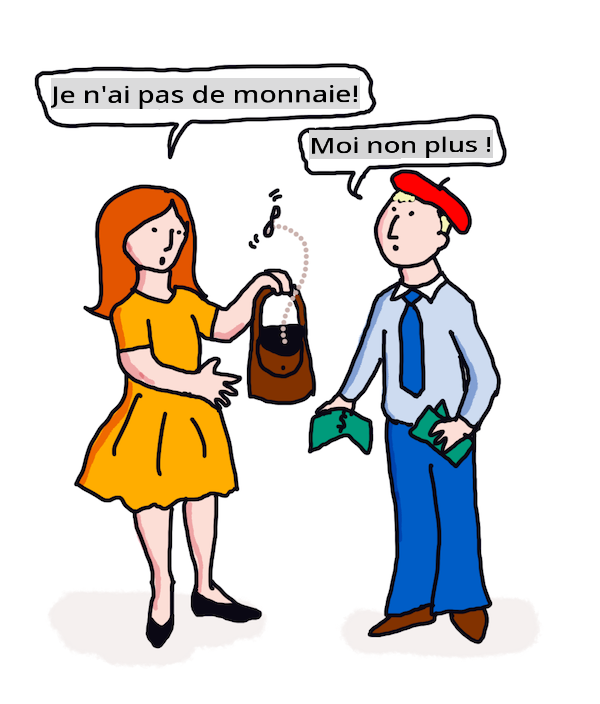

# Traduction et analyse de sentiment avec ML

Dans les leçons précédentes, vous avez appris à construire un bot de base en utilisant `TextBlob`, une bibliothèque qui intègre le ML en arrière-plan pour effectuer des tâches NLP de base telles que l'extraction de phrases nominales. Un autre défi important en linguistique computationnelle est la _traduction_ précise d'une phrase d'une langue parlée ou écrite à une autre.

## [Quiz avant la leçon](https://gray-sand-07a10f403.1.azurestaticapps.net/quiz/35/)

La traduction est un problème très difficile, aggravé par le fait qu'il existe des milliers de langues, chacune pouvant avoir des règles grammaticales très différentes. Une approche consiste à convertir les règles grammaticales formelles d'une langue, comme l'anglais, en une structure non dépendante de la langue, puis à les traduire en les convertissant à nouveau dans une autre langue. Cette approche signifie que vous suivriez les étapes suivantes :

1. **Identification**. Identifier ou étiqueter les mots dans la langue d'entrée en noms, verbes, etc.
2. **Créer une traduction**. Produire une traduction directe de chaque mot dans le format de la langue cible.

### Exemple de phrase, de l'anglais à l'irlandais

En 'anglais', la phrase _I feel happy_ se compose de trois mots dans l'ordre :

- **sujet** (I)
- **verbe** (feel)
- **adjectif** (happy)

Cependant, dans la langue 'irlandaise', la même phrase a une structure grammaticale très différente - les émotions comme "*happy*" ou "*sad*" sont exprimées comme étant *sur* vous.

La phrase anglaise `I feel happy` en irlandais serait `Tá athas orm`. Une traduction *littérale* serait `Happy is upon me`.

Un locuteur irlandais traduisant en anglais dirait `I feel happy`, et non `Happy is upon me`, car il comprend le sens de la phrase, même si les mots et la structure de la phrase sont différents.

L'ordre formel de la phrase en irlandais est :

- **verbe** (Tá ou is)
- **adjectif** (athas, ou happy)
- **sujet** (orm, ou upon me)

## Traduction

Un programme de traduction naïf pourrait traduire uniquement les mots, en ignorant la structure de la phrase.

✅ Si vous avez appris une deuxième (ou troisième ou plus) langue en tant qu'adulte, vous avez peut-être commencé par penser dans votre langue maternelle, traduisant un concept mot à mot dans votre tête vers la deuxième langue, puis exprimant votre traduction. C'est similaire à ce que font les programmes de traduction naïfs. Il est important de dépasser cette phase pour atteindre la fluidité !

La traduction naïve conduit à de mauvaises (et parfois hilarantes) mistraductions : `I feel happy` se traduit littéralement par `Mise bhraitheann athas` en irlandais. Cela signifie (littéralement) `me feel happy` et n'est pas une phrase valide en irlandais. Bien que l'anglais et l'irlandais soient des langues parlées sur deux îles voisines, ce sont des langues très différentes avec des structures grammaticales différentes.

> Vous pouvez regarder quelques vidéos sur les traditions linguistiques irlandaises, comme [celle-ci](https://www.youtube.com/watch?v=mRIaLSdRMMs)

### Approches de l'apprentissage automatique

Jusqu'à présent, vous avez appris l'approche des règles formelles pour le traitement du langage naturel. Une autre approche consiste à ignorer le sens des mots et _à utiliser plutôt l'apprentissage automatique pour détecter des motifs_. Cela peut fonctionner dans la traduction si vous avez beaucoup de texte (un *corpus*) ou des textes (*corpora*) dans les langues d'origine et cible.

Par exemple, considérez le cas de *Pride and Prejudice*, un roman anglais bien connu écrit par Jane Austen en 1813. Si vous consultez le livre en anglais et une traduction humaine du livre en *français*, vous pourriez détecter des phrases dans l'une qui sont _traduits de manière idiomatique_ dans l'autre. Vous le ferez dans un instant.

Par exemple, lorsqu'une phrase anglaise telle que `I have no money` est traduite littéralement en français, elle pourrait devenir `Je n'ai pas de monnaie`. "Monnaie" est un faux ami français délicat, car 'money' et 'monnaie' ne sont pas synonymes. Une meilleure traduction qu'un humain pourrait faire serait `Je n'ai pas d'argent`, car elle transmet mieux le sens que vous n'avez pas d'argent (plutôt que 'monnaie de poche' qui est le sens de 'monnaie').



> Image par [Jen Looper](https://twitter.com/jenlooper)

Si un modèle ML a suffisamment de traductions humaines pour construire un modèle, il peut améliorer l'exactitude des traductions en identifiant des motifs communs dans des textes qui ont été précédemment traduits par des locuteurs humains experts des deux langues.

### Exercice - traduction

Vous pouvez utiliser `TextBlob` pour traduire des phrases. Essayez la célèbre première ligne de **Pride and Prejudice** :

```python
from textblob import TextBlob

blob = TextBlob(
    "It is a truth universally acknowledged, that a single man in possession of a good fortune, must be in want of a wife!"
)
print(blob.translate(to="fr"))

```

`TextBlob` fait un assez bon travail de traduction : "C'est une vérité universellement reconnue, qu'un homme célibataire en possession d'une bonne fortune doit avoir besoin d'une femme !".

On peut soutenir que la traduction de TextBlob est en fait beaucoup plus précise que la traduction française de 1932 du livre par V. Leconte et Ch. Pressoir :

"C'est une vérité universelle qu'un célibataire pourvu d'une belle fortune doit avoir envie de se marier, et, si peu que l'on sache de son sentiment à cet égard, lorsqu'il arrive dans une nouvelle résidence, cette idée est si bien fixée dans l'esprit de ses voisins qu'ils le considèrent sur-le-champ comme la propriété légitime de l'une ou l'autre de leurs filles."

Dans ce cas, la traduction informée par le ML fait un meilleur travail que le traducteur humain qui met inutilement des mots dans la bouche de l'auteur original pour 'clarté'.

> Que se passe-t-il ici ? Et pourquoi TextBlob est-il si bon en traduction ? Eh bien, en arrière-plan, il utilise Google Translate, une IA sophistiquée capable d'analyser des millions de phrases pour prédire les meilleures chaînes pour la tâche à accomplir. Il n'y a rien de manuel ici et vous avez besoin d'une connexion Internet pour utiliser `blob.translate`.

✅ Try some more sentences. Which is better, ML or human translation? In which cases?

## Sentiment analysis

Another area where machine learning can work very well is sentiment analysis. A non-ML approach to sentiment is to identify words and phrases which are 'positive' and 'negative'. Then, given a new piece of text, calculate the total value of the positive, negative and neutral words to identify the overall sentiment. 

This approach is easily tricked as you may have seen in the Marvin task - the sentence `Great, that was a wonderful waste of time, I'm glad we are lost on this dark road` est une phrase avec un sentiment sarcastique et négatif, mais l'algorithme simple détecte 'great', 'wonderful', 'glad' comme positifs et 'waste', 'lost' et 'dark' comme négatifs. Le sentiment global est influencé par ces mots contradictoires.

✅ Arrêtez-vous une seconde et réfléchissez à la façon dont nous exprimons le sarcasme en tant que locuteurs humains. L'inflexion du ton joue un rôle important. Essayez de dire la phrase "Eh bien, ce film était génial" de différentes manières pour découvrir comment votre voix transmet le sens.

### Approches ML

L'approche ML consisterait à rassembler manuellement des corpus de textes négatifs et positifs - tweets, critiques de films, ou tout autre contenu où l'humain a donné une note *et* une opinion écrite. Ensuite, des techniques NLP peuvent être appliquées aux opinions et aux notes, afin que des motifs émergent (par exemple, les critiques de films positives tendent à avoir l'expression 'Oscar worthy' plus souvent que les critiques négatives, ou les critiques de restaurants positives disent 'gourmet' beaucoup plus que 'dégoûtant').

> ⚖️ **Exemple** : Si vous travailliez dans le bureau d'un politicien et qu'il y avait une nouvelle loi en cours de débat, les électeurs pourraient écrire au bureau avec des courriels soutenant ou contre la nouvelle loi en question. Supposons que vous soyez chargé de lire les courriels et de les trier en 2 piles, *pour* et *contre*. S'il y avait beaucoup de courriels, vous pourriez être submergé en essayant de tous les lire. Ne serait-il pas agréable qu'un bot puisse tous les lire pour vous, les comprendre et vous dire dans quelle pile chaque courriel appartient ?
> 
> Une façon d'y parvenir est d'utiliser l'apprentissage automatique. Vous entraîneriez le modèle avec une portion des courriels *contre* et une portion des courriels *pour*. Le modèle tendrait à associer des phrases et des mots avec le côté contre et le côté pour, *mais il ne comprendrait aucun des contenus*, seulement que certains mots et motifs étaient plus susceptibles d'apparaître dans un courriel *contre* ou *pour*. Vous pourriez le tester avec des courriels que vous n'aviez pas utilisés pour entraîner le modèle, et voir s'il parvenait à la même conclusion que vous. Ensuite, une fois que vous étiez satisfait de l'exactitude du modèle, vous pourriez traiter des courriels futurs sans avoir à lire chacun d'eux.

✅ Ce processus ressemble-t-il à des processus que vous avez utilisés dans des leçons précédentes ?

## Exercice - phrases sentimentales

Le sentiment est mesuré avec une *polarité* de -1 à 1, ce qui signifie que -1 est le sentiment le plus négatif, et 1 est le plus positif. Le sentiment est également mesuré avec un score de 0 à 1 pour l'objectivité (0) et la subjectivité (1).

Jetez un autre coup d'œil à *Pride and Prejudice* de Jane Austen. Le texte est disponible ici sur [Project Gutenberg](https://www.gutenberg.org/files/1342/1342-h/1342-h.htm). L'exemple ci-dessous montre un court programme qui analyse le sentiment des premières et dernières phrases du livre et affiche sa polarité de sentiment et son score d'objectivité/subjectivité.

Vous devriez utiliser la bibliothèque `TextBlob` (décrite ci-dessus) pour déterminer `sentiment` (vous n'avez pas à écrire votre propre calculateur de sentiment) dans la tâche suivante.

```python
from textblob import TextBlob

quote1 = """It is a truth universally acknowledged, that a single man in possession of a good fortune, must be in want of a wife."""

quote2 = """Darcy, as well as Elizabeth, really loved them; and they were both ever sensible of the warmest gratitude towards the persons who, by bringing her into Derbyshire, had been the means of uniting them."""

sentiment1 = TextBlob(quote1).sentiment
sentiment2 = TextBlob(quote2).sentiment

print(quote1 + " has a sentiment of " + str(sentiment1))
print(quote2 + " has a sentiment of " + str(sentiment2))
```

Vous voyez la sortie suivante :

```output
It is a truth universally acknowledged, that a single man in possession of a good fortune, must be in want # of a wife. has a sentiment of Sentiment(polarity=0.20952380952380953, subjectivity=0.27142857142857146)

Darcy, as well as Elizabeth, really loved them; and they were
     both ever sensible of the warmest gratitude towards the persons
      who, by bringing her into Derbyshire, had been the means of
      uniting them. has a sentiment of Sentiment(polarity=0.7, subjectivity=0.8)
```

## Défi - vérifier la polarité du sentiment

Votre tâche est de déterminer, en utilisant la polarité du sentiment, si *Pride and Prejudice* a plus de phrases absolument positives que de phrases absolument négatives. Pour cette tâche, vous pouvez supposer qu'un score de polarité de 1 ou -1 est absolument positif ou négatif respectivement.

**Étapes :**

1. Téléchargez une [copie de Pride and Prejudice](https://www.gutenberg.org/files/1342/1342-h/1342-h.htm) depuis Project Gutenberg au format .txt. Supprimez les métadonnées au début et à la fin du fichier, ne laissant que le texte original.
2. Ouvrez le fichier en Python et extrayez le contenu sous forme de chaîne.
3. Créez un TextBlob en utilisant la chaîne du livre.
4. Analysez chaque phrase du livre dans une boucle.
   1. Si la polarité est 1 ou -1, stockez la phrase dans un tableau ou une liste de messages positifs ou négatifs.
5. À la fin, imprimez toutes les phrases positives et négatives (séparément) et le nombre de chacune.

Voici une [solution d'exemple](https://github.com/microsoft/ML-For-Beginners/blob/main/6-NLP/3-Translation-Sentiment/solution/notebook.ipynb).

✅ Vérification des connaissances

1. Le sentiment est basé sur les mots utilisés dans la phrase, mais le code *comprend-il* les mots ?
2. Pensez-vous que la polarité du sentiment est précise, ou en d'autres termes, êtes-vous *d'accord* avec les scores ?
   1. En particulier, êtes-vous d'accord ou pas d'accord avec la polarité **positive** absolue des phrases suivantes ?
      * “Quel excellent père vous avez, les filles !” dit-elle, lorsque la porte était fermée.
      * “Votre examen de M. Darcy est terminé, je présume,” dit Miss Bingley ; “et priez, quel est le résultat ?” “Je suis parfaitement convaincue par cela que M. Darcy n'a aucun défaut.”
      * Comme ces choses se produisent merveilleusement !
      * J'ai la plus grande aversion au monde pour ce genre de chose.
      * Charlotte est une excellente gestionnaire, je n'en doute pas.
      * “C'est en effet délicieux !
      * Je suis si heureux !
      * Votre idée des poneys est délicieuse.
   2. Les 3 phrases suivantes ont été notées avec un sentiment positif absolu, mais à la lecture attentive, elles ne sont pas des phrases positives. Pourquoi l'analyse de sentiment a-t-elle pensé qu'elles étaient des phrases positives ?
      * Heureux je serai, lorsque son séjour à Netherfield sera terminé !” “Je souhaite pouvoir dire quoi que ce soit pour vous réconforter,” répondit Elizabeth ; “mais c'est totalement hors de mon pouvoir.
      * Si je pouvais vous voir aussi heureux !
      * Notre détresse, ma chère Lizzy, est très grande.
   3. Êtes-vous d'accord ou pas d'accord avec la polarité **négative** absolue des phrases suivantes ?
      - Tout le monde est dégoûté par son orgueil.
      - “J'aimerais savoir comment il se comporte parmi les étrangers.” “Vous allez entendre alors - mais préparez-vous à quelque chose de très terrible.
      - La pause était pour les sentiments d'Elizabeth terrible.
      - Ce serait terrible !

✅ Tout aficionado de Jane Austen comprendra qu'elle utilise souvent ses livres pour critiquer les aspects les plus ridicules de la société anglaise de la Régence. Elizabeth Bennett, le personnage principal de *Pride and Prejudice*, est une observatrice sociale perspicace (comme l'auteure) et son langage est souvent très nuancé. Même M. Darcy (l'intérêt amoureux de l'histoire) note l'utilisation ludique et taquine du langage par Elizabeth : "J'ai eu le plaisir de votre connaissance assez longtemps pour savoir que vous trouvez un grand plaisir à professant occasionnellement des opinions qui, en fait, ne sont pas les vôtres."

---

## 🚀Défi

Pouvez-vous rendre Marvin encore meilleur en extrayant d'autres caractéristiques de l'entrée de l'utilisateur ?

## [Quiz après la leçon](https://gray-sand-07a10f403.1.azurestaticapps.net/quiz/36/)

## Révision & Auto-apprentissage

Il existe de nombreuses façons d'extraire le sentiment d'un texte. Pensez aux applications commerciales qui pourraient utiliser cette technique. Réfléchissez à la façon dont cela peut mal tourner. Lisez davantage sur des systèmes sophistiqués prêts pour l'entreprise qui analysent le sentiment, tels que [Azure Text Analysis](https://docs.microsoft.com/azure/cognitive-services/Text-Analytics/how-tos/text-analytics-how-to-sentiment-analysis?tabs=version-3-1?WT.mc_id=academic-77952-leestott). Testez certaines des phrases de *Pride and Prejudice* ci-dessus et voyez si cela peut détecter les nuances.

## Devoir 

[Licence poétique](assignment.md)

**Avertissement** :  
Ce document a été traduit à l'aide de services de traduction automatisée basés sur l'IA. Bien que nous nous efforçons d'assurer l'exactitude, veuillez noter que les traductions automatisées peuvent contenir des erreurs ou des inexactitudes. Le document original dans sa langue native doit être considéré comme la source autoritaire. Pour des informations critiques, une traduction humaine professionnelle est recommandée. Nous ne sommes pas responsables des malentendus ou des erreurs d'interprétation résultant de l'utilisation de cette traduction.