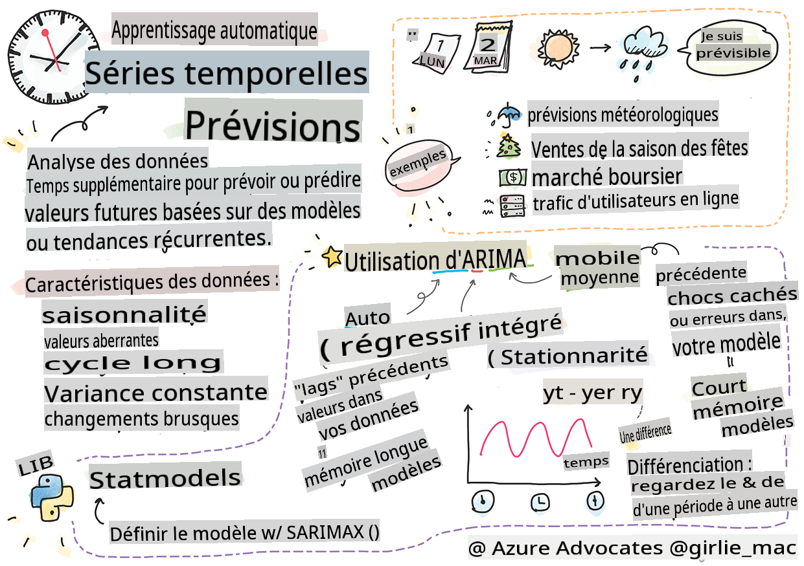
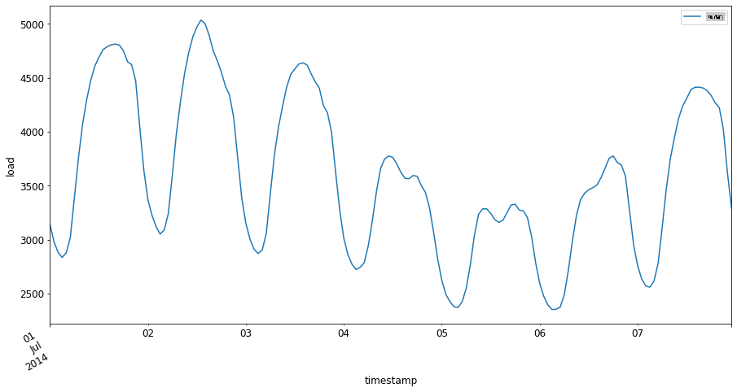

# Introduction à la prévision des séries temporelles



> Sketchnote par [Tomomi Imura](https://www.twitter.com/girlie_mac)

Dans cette leçon et la suivante, vous apprendrez un peu sur la prévision des séries temporelles, une partie intéressante et précieuse du répertoire d'un scientifique en ML qui est un peu moins connue que d'autres sujets. La prévision des séries temporelles est une sorte de 'boule de cristal' : basée sur la performance passée d'une variable telle que le prix, vous pouvez prédire sa valeur potentielle future.

[](https://youtu.be/cBojo1hsHiI "Introduction à la prévision des séries temporelles")

> 🎥 Cliquez sur l'image ci-dessus pour une vidéo sur la prévision des séries temporelles

## [Quiz avant la leçon](https://gray-sand-07a10f403.1.azurestaticapps.net/quiz/41/)

C'est un domaine utile et intéressant avec une réelle valeur pour les entreprises, étant donné son application directe aux problèmes de tarification, d'inventaire et de chaîne d'approvisionnement. Bien que les techniques d'apprentissage profond aient commencé à être utilisées pour obtenir plus d'informations afin de mieux prédire les performances futures, la prévision des séries temporelles reste un domaine largement informé par des techniques classiques de ML.

> Le programme de séries temporelles utile de Penn State peut être trouvé [ici](https://online.stat.psu.edu/stat510/lesson/1)

## Introduction

Supposons que vous mainteniez un ensemble de parcmètres intelligents qui fournissent des données sur la fréquence à laquelle ils sont utilisés et pendant combien de temps au fil du temps.

> Que se passerait-il si vous pouviez prédire, en vous basant sur la performance passée du parcmètre, sa valeur future selon les lois de l'offre et de la demande ?

Prédire avec précision quand agir pour atteindre votre objectif est un défi qui pourrait être relevé par la prévision des séries temporelles. Cela ne rendrait pas les gens heureux d'être facturés davantage pendant les périodes de forte affluence lorsqu'ils cherchent une place de parking, mais ce serait un moyen sûr de générer des revenus pour nettoyer les rues !

Explorons certains des types d'algorithmes de séries temporelles et commençons un carnet pour nettoyer et préparer des données. Les données que vous allez analyser proviennent de la compétition de prévision GEFCom2014. Elles consistent en 3 ans de valeurs horaires de charge électrique et de température entre 2012 et 2014. Étant donné les modèles historiques de charge électrique et de température, vous pouvez prédire les valeurs futures de la charge électrique.

Dans cet exemple, vous apprendrez à prévoir une étape temporelle à l'avance, en utilisant uniquement les données de charge historiques. Cependant, avant de commencer, il est utile de comprendre ce qui se passe en coulisses.

## Quelques définitions

Lorsque vous rencontrez le terme 'série temporelle', vous devez comprendre son utilisation dans plusieurs contextes différents.

🎓 **Série temporelle**

En mathématiques, "une série temporelle est une série de points de données indexés (ou listés ou représentés graphiquement) dans l'ordre temporel. Le plus souvent, une série temporelle est une séquence prise à des points successifs également espacés dans le temps." Un exemple de série temporelle est la valeur de clôture quotidienne du [Dow Jones Industrial Average](https://wikipedia.org/wiki/Time_series). L'utilisation de graphiques de séries temporelles et de modélisation statistique est fréquemment rencontrée dans le traitement du signal, la prévision météorologique, la prédiction des tremblements de terre et d'autres domaines où des événements se produisent et des points de données peuvent être tracés au fil du temps.

🎓 **Analyse des séries temporelles**

L'analyse des séries temporelles est l'analyse des données de séries temporelles mentionnées ci-dessus. Les données de séries temporelles peuvent prendre des formes distinctes, y compris les 'séries temporelles interrompues' qui détectent des modèles dans l'évolution d'une série temporelle avant et après un événement perturbateur. Le type d'analyse nécessaire pour la série temporelle dépend de la nature des données. Les données de séries temporelles elles-mêmes peuvent prendre la forme de séries de nombres ou de caractères.

L'analyse à réaliser utilise une variété de méthodes, y compris le domaine de fréquence et le domaine temporel, linéaire et non linéaire, et plus encore. [En savoir plus](https://www.itl.nist.gov/div898/handbook/pmc/section4/pmc4.htm) sur les nombreuses façons d'analyser ce type de données.

🎓 **Prévision des séries temporelles**

La prévision des séries temporelles est l'utilisation d'un modèle pour prédire des valeurs futures basées sur les modèles affichés par des données précédemment recueillies telles qu'elles se sont produites dans le passé. Bien qu'il soit possible d'utiliser des modèles de régression pour explorer les données de séries temporelles, avec des indices temporels comme variables x sur un graphique, ces données sont mieux analysées à l'aide de types de modèles spéciaux.

Les données de séries temporelles sont une liste d'observations ordonnées, contrairement aux données qui peuvent être analysées par régression linéaire. Le plus courant est l'ARIMA, un acronyme qui signifie "Moyenne Mobile Intégrée Autoregressive".

Les [modèles ARIMA](https://online.stat.psu.edu/stat510/lesson/1/1.1) "relient la valeur présente d'une série à des valeurs passées et à des erreurs de prédiction passées." Ils sont les plus appropriés pour analyser des données dans le domaine temporel, où les données sont ordonnées dans le temps.

> Il existe plusieurs types de modèles ARIMA, dont vous pouvez apprendre davantage [ici](https://people.duke.edu/~rnau/411arim.htm) et que vous aborderez dans la prochaine leçon.

Dans la prochaine leçon, vous construirez un modèle ARIMA en utilisant des [Séries Temporelles Univariées](https://itl.nist.gov/div898/handbook/pmc/section4/pmc44.htm), qui se concentre sur une variable qui change de valeur au fil du temps. Un exemple de ce type de données est [cet ensemble de données](https://itl.nist.gov/div898/handbook/pmc/section4/pmc4411.htm) qui enregistre la concentration mensuelle de CO2 à l'Observatoire de Mauna Loa :

|  CO2   | YearMonth | Année | Mois |
| :----: | :-------: | :---: | :---: |
| 330.62 |  1975.04  | 1975  |   1   |
| 331.40 |  1975.13  | 1975  |   2   |
| 331.87 |  1975.21  | 1975  |   3   |
| 333.18 |  1975.29  | 1975  |   4   |
| 333.92 |  1975.38  | 1975  |   5   |
| 333.43 |  1975.46  | 1975  |   6   |
| 331.85 |  1975.54  | 1975  |   7   |
| 330.01 |  1975.63  | 1975  |   8   |
| 328.51 |  1975.71  | 1975  |   9   |
| 328.41 |  1975.79  | 1975  |  10   |
| 329.25 |  1975.88  | 1975  |  11   |
| 330.97 |  1975.96  | 1975  |  12   |

✅ Identifiez la variable qui change au fil du temps dans cet ensemble de données

## Caractéristiques des données de séries temporelles à considérer

Lorsque vous examinez des données de séries temporelles, vous pourriez remarquer qu'elles possèdent [certaines caractéristiques](https://online.stat.psu.edu/stat510/lesson/1/1.1) que vous devez prendre en compte et atténuer pour mieux comprendre ses modèles. Si vous considérez les données de séries temporelles comme potentiellement fournissant un 'signal' que vous souhaitez analyser, ces caractéristiques peuvent être considérées comme du 'bruit'. Vous devrez souvent réduire ce 'bruit' en compensant certaines de ces caractéristiques à l'aide de techniques statistiques.

Voici quelques concepts que vous devriez connaître pour pouvoir travailler avec des séries temporelles :

🎓 **Tendances**

Les tendances sont définies comme des augmentations et des diminutions mesurables au fil du temps. [En savoir plus](https://machinelearningmastery.com/time-series-trends-in-python). Dans le contexte des séries temporelles, il s'agit de savoir comment utiliser et, si nécessaire, supprimer les tendances de votre série temporelle.

🎓 **[Saisonnalité](https://machinelearningmastery.com/time-series-seasonality-with-python/)**

La saisonnalité est définie comme des fluctuations périodiques, telles que les pics de vente pendant les vacances, par exemple. [Jetez un œil](https://itl.nist.gov/div898/handbook/pmc/section4/pmc443.htm) à la façon dont différents types de graphiques affichent la saisonnalité dans les données.

🎓 **Valeurs aberrantes**

Les valeurs aberrantes sont éloignées de la variance standard des données.

🎓 **Cycle à long terme**

Indépendamment de la saisonnalité, les données peuvent afficher un cycle à long terme tel qu'une récession économique qui dure plus d'un an.

🎓 **Variance constante**

Au fil du temps, certaines données affichent des fluctuations constantes, comme l'utilisation d'énergie jour et nuit.

🎓 **Changements brusques**

Les données peuvent afficher un changement brusque qui pourrait nécessiter une analyse plus approfondie. La fermeture brutale des entreprises en raison de COVID, par exemple, a causé des changements dans les données.

✅ Voici un [exemple de graphique de séries temporelles](https://www.kaggle.com/kashnitsky/topic-9-part-1-time-series-analysis-in-python) montrant les dépenses quotidiennes en monnaie virtuelle sur plusieurs années. Pouvez-vous identifier certaines des caractéristiques énumérées ci-dessus dans ces données ?


## Exercice - démarrer avec les données de consommation d'énergie

Commençons à créer un modèle de séries temporelles pour prédire la consommation future d'énergie en fonction de la consommation passée.

> Les données dans cet exemple proviennent de la compétition de prévision GEFCom2014. Elles consistent en 3 ans de valeurs horaires de charge électrique et de température entre 2012 et 2014.
>
> Tao Hong, Pierre Pinson, Shu Fan, Hamidreza Zareipour, Alberto Troccoli et Rob J. Hyndman, "Prévision énergétique probabiliste : Compétition mondiale de prévision énergétique 2014 et au-delà", International Journal of Forecasting, vol.32, no.3, pp 896-913, juillet-septembre 2016.

1. Dans le dossier `working` de cette leçon, ouvrez le fichier _notebook.ipynb_. Commencez par ajouter des bibliothèques qui vous aideront à charger et visualiser les données.

    ```python
    import os
    import matplotlib.pyplot as plt
    from common.utils import load_data
    %matplotlib inline
    ```

    Notez que vous utilisez les fichiers de la fonction incluse `common` folder which set up your environment and handle downloading the data.

2. Next, examine the data as a dataframe calling `load_data()` and `head()` :

    ```python
    data_dir = './data'
    energy = load_data(data_dir)[['load']]
    energy.head()
    ```

    Vous pouvez voir qu'il y a deux colonnes représentant la date et la charge :

    |                     |  charge  |
    | :-----------------: | :------: |
    | 2012-01-01 00:00:00 | 2698.0  |
    | 2012-01-01 01:00:00 | 2558.0  |
    | 2012-01-01 02:00:00 | 2444.0  |
    | 2012-01-01 03:00:00 | 2402.0  |
    | 2012-01-01 04:00:00 | 2403.0  |

3. Maintenant, tracez les données en appelant `plot()` :

    ```python
    energy.plot(y='load', subplots=True, figsize=(15, 8), fontsize=12)
    plt.xlabel('timestamp', fontsize=12)
    plt.ylabel('load', fontsize=12)
    plt.show()
    ```

    

4. Maintenant, tracez la première semaine de juillet 2014, en la fournissant comme entrée au modèle `energy` in `[de date] : [à date]` :

    ```python
    energy['2014-07-01':'2014-07-07'].plot(y='load', subplots=True, figsize=(15, 8), fontsize=12)
    plt.xlabel('timestamp', fontsize=12)
    plt.ylabel('load', fontsize=12)
    plt.show()
    ```

    

    Un beau graphique ! Jetez un œil à ces graphiques et voyez si vous pouvez déterminer certaines des caractéristiques énumérées ci-dessus. Que pouvons-nous déduire en visualisant les données ?

Dans la prochaine leçon, vous créerez un modèle ARIMA pour réaliser des prévisions.

---

## 🚀Défi

Faites une liste de toutes les industries et domaines de recherche que vous pouvez penser qui bénéficieraient de la prévision des séries temporelles. Pouvez-vous penser à une application de ces techniques dans les arts ? En économétrie ? En écologie ? Dans le commerce de détail ? Dans l'industrie ? Dans la finance ? Où d'autre ?

## [Quiz après la leçon](https://gray-sand-07a10f403.1.azurestaticapps.net/quiz/42/)

## Révision & Auto-apprentissage

Bien que nous ne les couvrions pas ici, les réseaux neuronaux sont parfois utilisés pour améliorer les méthodes classiques de prévision des séries temporelles. Lisez-en plus [dans cet article](https://medium.com/microsoftazure/neural-networks-for-forecasting-financial-and-economic-time-series-6aca370ff412)

## Devoir

[Visualisez d'autres séries temporelles](assignment.md)

**Avertissement** :  
Ce document a été traduit à l'aide de services de traduction automatique basés sur l'IA. Bien que nous nous efforçons d'assurer l'exactitude, veuillez noter que les traductions automatisées peuvent contenir des erreurs ou des inexactitudes. Le document original dans sa langue native doit être considéré comme la source autorisée. Pour des informations critiques, une traduction humaine professionnelle est recommandée. Nous ne sommes pas responsables des malentendus ou des interprétations erronées résultant de l'utilisation de cette traduction.