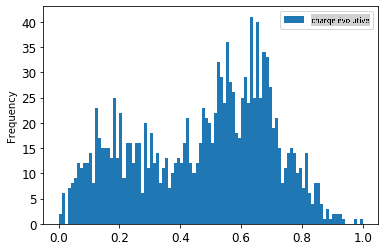
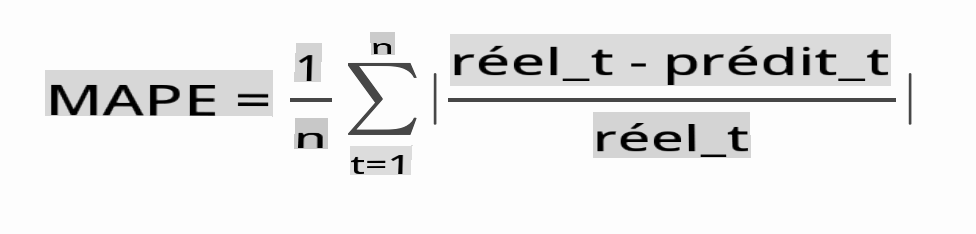

# Prévision de séries temporelles avec ARIMA

Dans la leçon précédente, vous avez appris un peu sur la prévision de séries temporelles et chargé un ensemble de données montrant les fluctuations de la charge électrique sur une période donnée.

[](https://youtu.be/IUSk-YDau10 "Introduction à ARIMA")

> 🎥 Cliquez sur l'image ci-dessus pour une vidéo : Une brève introduction aux modèles ARIMA. L'exemple est réalisé en R, mais les concepts sont universels.

## [Quiz avant le cours](https://gray-sand-07a10f403.1.azurestaticapps.net/quiz/43/)

## Introduction

Dans cette leçon, vous découvrirez une méthode spécifique pour construire des modèles avec [ARIMA : *A*uto*R*égressif *I*ntegré *M*oyenne *A*mobile](https://wikipedia.org/wiki/Autoregressive_integrated_moving_average). Les modèles ARIMA sont particulièrement adaptés pour ajuster des données qui montrent [non-stationnarité](https://wikipedia.org/wiki/Stationary_process).

## Concepts généraux

Pour pouvoir travailler avec ARIMA, il y a certains concepts que vous devez connaître :

- 🎓 **Stationnarité**. Dans un contexte statistique, la stationnarité fait référence à des données dont la distribution ne change pas lorsqu'elle est décalée dans le temps. Les données non stationnaires, en revanche, montrent des fluctuations dues à des tendances qui doivent être transformées pour être analysées. La saisonnalité, par exemple, peut introduire des fluctuations dans les données et peut être éliminée par un processus de "différenciation saisonnière".

- 🎓 **[Différenciation](https://wikipedia.org/wiki/Autoregressive_integrated_moving_average#Differencing)**. Différencier les données, encore une fois dans un contexte statistique, fait référence au processus de transformation des données non stationnaires pour les rendre stationnaires en supprimant leur tendance non constante. "La différenciation élimine les changements dans le niveau d'une série temporelle, éliminant ainsi tendance et saisonnalité et stabilisant par conséquent la moyenne de la série temporelle." [Article de Shixiong et al](https://arxiv.org/abs/1904.07632)

## ARIMA dans le contexte des séries temporelles

Décomposons les parties d'ARIMA pour mieux comprendre comment cela nous aide à modéliser les séries temporelles et à nous aider à faire des prévisions.

- **AR - pour AutoRégressif**. Les modèles autorégressifs, comme leur nom l'indique, regardent 'en arrière' dans le temps pour analyser les valeurs précédentes de vos données et faire des hypothèses à leur sujet. Ces valeurs précédentes sont appelées 'lags'. Un exemple serait des données montrant les ventes mensuelles de crayons. Le total des ventes de chaque mois serait considéré comme une 'variable évolutive' dans l'ensemble de données. Ce modèle est construit car "la variable évolutive d'intérêt est régressée sur ses propres valeurs retardées (c'est-à-dire antérieures)." [wikipedia](https://wikipedia.org/wiki/Autoregressive_integrated_moving_average)

- **I - pour Intégré**. Contrairement aux modèles 'ARMA' similaires, le 'I' dans ARIMA fait référence à son aspect *[intégré](https://wikipedia.org/wiki/Order_of_integration)*. Les données sont 'intégrées' lorsque des étapes de différenciation sont appliquées pour éliminer la non-stationnarité.

- **MA - pour Moyenne Mobile**. L'aspect [moyenne mobile](https://wikipedia.org/wiki/Moving-average_model) de ce modèle fait référence à la variable de sortie qui est déterminée en observant les valeurs actuelles et passées des lags.

En résumé : ARIMA est utilisé pour ajuster un modèle à la forme spéciale des données de séries temporelles aussi étroitement que possible.

## Exercice - construire un modèle ARIMA

Ouvrez le dossier [_/working_](https://github.com/microsoft/ML-For-Beginners/tree/main/7-TimeSeries/2-ARIMA/working) dans cette leçon et trouvez le fichier [_notebook.ipynb_](https://github.com/microsoft/ML-For-Beginners/blob/main/7-TimeSeries/2-ARIMA/working/notebook.ipynb).

1. Exécutez le notebook pour charger la bibliothèque Python `statsmodels` ; vous en aurez besoin pour les modèles ARIMA.

1. Chargez les bibliothèques nécessaires

1. Maintenant, chargez plusieurs autres bibliothèques utiles pour tracer des données :

    ```python
    import os
    import warnings
    import matplotlib.pyplot as plt
    import numpy as np
    import pandas as pd
    import datetime as dt
    import math

    from pandas.plotting import autocorrelation_plot
    from statsmodels.tsa.statespace.sarimax import SARIMAX
    from sklearn.preprocessing import MinMaxScaler
    from common.utils import load_data, mape
    from IPython.display import Image

    %matplotlib inline
    pd.options.display.float_format = '{:,.2f}'.format
    np.set_printoptions(precision=2)
    warnings.filterwarnings("ignore") # specify to ignore warning messages
    ```

1. Chargez les données à partir du fichier `/data/energy.csv` dans un dataframe Pandas et jetez un œil :

    ```python
    energy = load_data('./data')[['load']]
    energy.head(10)
    ```

1. Tracez toutes les données d'énergie disponibles de janvier 2012 à décembre 2014. Il ne devrait pas y avoir de surprises car nous avons vu ces données dans la dernière leçon :

    ```python
    energy.plot(y='load', subplots=True, figsize=(15, 8), fontsize=12)
    plt.xlabel('timestamp', fontsize=12)
    plt.ylabel('load', fontsize=12)
    plt.show()
    ```

    Maintenant, construisons un modèle !

### Créer des ensembles de données d'entraînement et de test

Maintenant que vos données sont chargées, vous pouvez les séparer en ensembles d'entraînement et de test. Vous entraînerez votre modèle sur l'ensemble d'entraînement. Comme d'habitude, après que le modèle ait terminé son entraînement, vous évaluerez sa précision en utilisant l'ensemble de test. Vous devez vous assurer que l'ensemble de test couvre une période ultérieure par rapport à l'ensemble d'entraînement pour garantir que le modèle ne tire pas d'informations des périodes futures.

1. Allouez une période de deux mois allant du 1er septembre au 31 octobre 2014 à l'ensemble d'entraînement. L'ensemble de test inclura la période de deux mois du 1er novembre au 31 décembre 2014 :

    ```python
    train_start_dt = '2014-11-01 00:00:00'
    test_start_dt = '2014-12-30 00:00:00'
    ```

    Étant donné que ces données reflètent la consommation quotidienne d'énergie, il existe un fort schéma saisonnier, mais la consommation est la plus similaire à celle des jours les plus récents.

1. Visualisez les différences :

    ```python
    energy[(energy.index < test_start_dt) & (energy.index >= train_start_dt)][['load']].rename(columns={'load':'train'}) \
        .join(energy[test_start_dt:][['load']].rename(columns={'load':'test'}), how='outer') \
        .plot(y=['train', 'test'], figsize=(15, 8), fontsize=12)
    plt.xlabel('timestamp', fontsize=12)
    plt.ylabel('load', fontsize=12)
    plt.show()
    ```

    

    Par conséquent, utiliser une fenêtre de temps relativement petite pour entraîner les données devrait être suffisant.

    > Note : Étant donné que la fonction que nous utilisons pour ajuster le modèle ARIMA utilise la validation en échantillon pendant l'ajustement, nous omettrons les données de validation.

### Préparer les données pour l'entraînement

Maintenant, vous devez préparer les données pour l'entraînement en effectuant un filtrage et une mise à l'échelle de vos données. Filtrez votre ensemble de données pour n'inclure que les périodes de temps et les colonnes dont vous avez besoin, et mettez à l'échelle pour garantir que les données sont projetées dans l'intervalle 0,1.

1. Filtrez l'ensemble de données original pour n'inclure que les périodes de temps mentionnées par ensemble et n'incluez que la colonne nécessaire 'load' ainsi que la date :

    ```python
    train = energy.copy()[(energy.index >= train_start_dt) & (energy.index < test_start_dt)][['load']]
    test = energy.copy()[energy.index >= test_start_dt][['load']]

    print('Training data shape: ', train.shape)
    print('Test data shape: ', test.shape)
    ```

    Vous pouvez voir la forme des données :

    ```output
    Training data shape:  (1416, 1)
    Test data shape:  (48, 1)
    ```

1. Mettez les données à l'échelle pour qu'elles soient dans la plage (0, 1).

    ```python
    scaler = MinMaxScaler()
    train['load'] = scaler.fit_transform(train)
    train.head(10)
    ```

1. Visualisez les données originales par rapport aux données mises à l'échelle :

    ```python
    energy[(energy.index >= train_start_dt) & (energy.index < test_start_dt)][['load']].rename(columns={'load':'original load'}).plot.hist(bins=100, fontsize=12)
    train.rename(columns={'load':'scaled load'}).plot.hist(bins=100, fontsize=12)
    plt.show()
    ```

    

    > Les données originales

    

    > Les données mises à l'échelle

1. Maintenant que vous avez calibré les données mises à l'échelle, vous pouvez mettre à l'échelle les données de test :

    ```python
    test['load'] = scaler.transform(test)
    test.head()
    ```

### Implémenter ARIMA

Il est temps d'implémenter ARIMA ! Vous allez maintenant utiliser la bibliothèque `statsmodels` que vous avez installée plus tôt.

Vous devez maintenant suivre plusieurs étapes :

1. Définissez le modèle en appelant `SARIMAX()` and passing in the model parameters: p, d, and q parameters, and P, D, and Q parameters.
   2. Prepare the model for the training data by calling the fit() function.
   3. Make predictions calling the `forecast()` function and specifying the number of steps (the `horizon`) to forecast.

> 🎓 What are all these parameters for? In an ARIMA model there are 3 parameters that are used to help model the major aspects of a time series: seasonality, trend, and noise. These parameters are:

`p`: the parameter associated with the auto-regressive aspect of the model, which incorporates *past* values.
`d`: the parameter associated with the integrated part of the model, which affects the amount of *differencing* (🎓 remember differencing 👆?) to apply to a time series.
`q`: the parameter associated with the moving-average part of the model.

> Note: If your data has a seasonal aspect - which this one does - , we use a seasonal ARIMA model (SARIMA). In that case you need to use another set of parameters: `P`, `D`, and `Q` which describe the same associations as `p`, `d`, and `q`, mais correspondant aux composants saisonniers du modèle.

1. Commencez par définir votre valeur d'horizon préférée. Essayons 3 heures :

    ```python
    # Specify the number of steps to forecast ahead
    HORIZON = 3
    print('Forecasting horizon:', HORIZON, 'hours')
    ```

    Sélectionner les meilleures valeurs pour les paramètres d'un modèle ARIMA peut être difficile car c'est quelque peu subjectif et chronophage. Vous pourriez envisager d'utiliser une bibliothèque `auto_arima()` function from the [`pyramid`](https://alkaline-ml.com/pmdarima/0.9.0/modules/generated/pyramid.arima.auto_arima.html),

1. Pour l'instant, essayez quelques sélections manuelles pour trouver un bon modèle.

    ```python
    order = (4, 1, 0)
    seasonal_order = (1, 1, 0, 24)

    model = SARIMAX(endog=train, order=order, seasonal_order=seasonal_order)
    results = model.fit()

    print(results.summary())
    ```

    Un tableau de résultats est imprimé.

Vous avez construit votre premier modèle ! Maintenant, nous devons trouver un moyen de l'évaluer.

### Évaluer votre modèle

Pour évaluer votre modèle, vous pouvez effectuer la validation dite `walk forward`. En pratique, les modèles de séries temporelles sont réentraînés chaque fois qu'une nouvelle donnée devient disponible. Cela permet au modèle de faire la meilleure prévision à chaque étape temporelle.

En commençant au début de la série temporelle en utilisant cette technique, entraînez le modèle sur l'ensemble de données d'entraînement. Ensuite, faites une prédiction sur la prochaine étape temporelle. La prédiction est évaluée par rapport à la valeur connue. L'ensemble d'entraînement est ensuite élargi pour inclure la valeur connue et le processus est répété.

> Note : Vous devriez garder la fenêtre de l'ensemble d'entraînement fixe pour un entraînement plus efficace afin que chaque fois que vous ajoutez une nouvelle observation à l'ensemble d'entraînement, vous supprimiez l'observation du début de l'ensemble.

Ce processus fournit une estimation plus robuste de la façon dont le modèle se comportera en pratique. Cependant, cela a un coût computationnel en raison de la création de tant de modèles. Cela est acceptable si les données sont petites ou si le modèle est simple, mais cela pourrait poser problème à grande échelle.

La validation walk-forward est la norme d'or pour l'évaluation des modèles de séries temporelles et est recommandée pour vos propres projets.

1. Tout d'abord, créez un point de données de test pour chaque étape HORIZON.

    ```python
    test_shifted = test.copy()

    for t in range(1, HORIZON+1):
        test_shifted['load+'+str(t)] = test_shifted['load'].shift(-t, freq='H')

    test_shifted = test_shifted.dropna(how='any')
    test_shifted.head(5)
    ```

    |            |          | load | load+1 | load+2 |
    | ---------- | -------- | ---- | ------ | ------ |
    | 2014-12-30 | 00:00:00 | 0.33 | 0.29   | 0.27   |
    | 2014-12-30 | 01:00:00 | 0.29 | 0.27   | 0.27   |
    | 2014-12-30 | 02:00:00 | 0.27 | 0.27   | 0.30   |
    | 2014-12-30 | 03:00:00 | 0.27 | 0.30   | 0.41   |
    | 2014-12-30 | 04:00:00 | 0.30 | 0.41   | 0.57   |

    Les données sont décalées horizontalement selon son point d'horizon.

1. Faites des prédictions sur vos données de test en utilisant cette approche de fenêtre glissante dans une boucle de la taille de la longueur des données de test :

    ```python
    %%time
    training_window = 720 # dedicate 30 days (720 hours) for training

    train_ts = train['load']
    test_ts = test_shifted

    history = [x for x in train_ts]
    history = history[(-training_window):]

    predictions = list()

    order = (2, 1, 0)
    seasonal_order = (1, 1, 0, 24)

    for t in range(test_ts.shape[0]):
        model = SARIMAX(endog=history, order=order, seasonal_order=seasonal_order)
        model_fit = model.fit()
        yhat = model_fit.forecast(steps = HORIZON)
        predictions.append(yhat)
        obs = list(test_ts.iloc[t])
        # move the training window
        history.append(obs[0])
        history.pop(0)
        print(test_ts.index[t])
        print(t+1, ': predicted =', yhat, 'expected =', obs)
    ```

    Vous pouvez observer l'entraînement en cours :

    ```output
    2014-12-30 00:00:00
    1 : predicted = [0.32 0.29 0.28] expected = [0.32945389435989236, 0.2900626678603402, 0.2739480752014323]

    2014-12-30 01:00:00
    2 : predicted = [0.3  0.29 0.3 ] expected = [0.2900626678603402, 0.2739480752014323, 0.26812891674127126]

    2014-12-30 02:00:00
    3 : predicted = [0.27 0.28 0.32] expected = [0.2739480752014323, 0.26812891674127126, 0.3025962399283795]
    ```

1. Comparez les prédictions à la charge réelle :

    ```python
    eval_df = pd.DataFrame(predictions, columns=['t+'+str(t) for t in range(1, HORIZON+1)])
    eval_df['timestamp'] = test.index[0:len(test.index)-HORIZON+1]
    eval_df = pd.melt(eval_df, id_vars='timestamp', value_name='prediction', var_name='h')
    eval_df['actual'] = np.array(np.transpose(test_ts)).ravel()
    eval_df[['prediction', 'actual']] = scaler.inverse_transform(eval_df[['prediction', 'actual']])
    eval_df.head()
    ```

    Sortie
    |     |            | timestamp | h   | prédiction | réel    |
    | --- | ---------- | --------- | --- | ---------- | -------- |
    | 0   | 2014-12-30 | 00:00:00  | t+1 | 3,008.74   | 3,023.00 |
    | 1   | 2014-12-30 | 01:00:00  | t+1 | 2,955.53   | 2,935.00 |
    | 2   | 2014-12-30 | 02:00:00  | t+1 | 2,900.17   | 2,899.00 |
    | 3   | 2014-12-30 | 03:00:00  | t+1 | 2,917.69   | 2,886.00 |
    | 4   | 2014-12-30 | 04:00:00  | t+1 | 2,946.99   | 2,963.00 |

    Observez la prédiction des données horaires, comparée à la charge réelle. Quelle est la précision de cela ?

### Vérifier la précision du modèle

Vérifiez la précision de votre modèle en testant son erreur absolue moyenne en pourcentage (MAPE) sur toutes les prédictions.

> **🧮 Montrez-moi les mathématiques**
>
> 
>
>  [MAPE](https://www.linkedin.com/pulse/what-mape-mad-msd-time-series-allameh-statistics/) est utilisé pour montrer la précision des prévisions comme un ratio défini par la formule ci-dessus. La différence entre réel<sub>t</sub> et prédit<sub>t</sub> est divisée par réel<sub>t</sub>. "La valeur absolue dans ce calcul est sommée pour chaque point de prévision et divisée par le nombre de points ajustés n." [wikipedia](https://wikipedia.org/wiki/Mean_absolute_percentage_error)

1. Exprimez l'équation en code :

    ```python
    if(HORIZON > 1):
        eval_df['APE'] = (eval_df['prediction'] - eval_df['actual']).abs() / eval_df['actual']
        print(eval_df.groupby('h')['APE'].mean())
    ```

1. Calculez le MAPE d'un pas :

    ```python
    print('One step forecast MAPE: ', (mape(eval_df[eval_df['h'] == 't+1']['prediction'], eval_df[eval_df['h'] == 't+1']['actual']))*100, '%')
    ```

    MAPE de prévision d'un pas :  0.5570581332313952 %

1. Imprimez le MAPE de prévision multi-pas :

    ```python
    print('Multi-step forecast MAPE: ', mape(eval_df['prediction'], eval_df['actual'])*100, '%')
    ```

    ```output
    Multi-step forecast MAPE:  1.1460048657704118 %
    ```

    Un joli petit nombre est le meilleur : considérez qu'une prévision avec un MAPE de 10 est erronée de 10 %.

1. Mais comme toujours, il est plus facile de voir ce type de mesure de précision visuellement, alors traçons-le :

    ```python
     if(HORIZON == 1):
        ## Plotting single step forecast
        eval_df.plot(x='timestamp', y=['actual', 'prediction'], style=['r', 'b'], figsize=(15, 8))

    else:
        ## Plotting multi step forecast
        plot_df = eval_df[(eval_df.h=='t+1')][['timestamp', 'actual']]
        for t in range(1, HORIZON+1):
            plot_df['t+'+str(t)] = eval_df[(eval_df.h=='t+'+str(t))]['prediction'].values

        fig = plt.figure(figsize=(15, 8))
        ax = plt.plot(plot_df['timestamp'], plot_df['actual'], color='red', linewidth=4.0)
        ax = fig.add_subplot(111)
        for t in range(1, HORIZON+1):
            x = plot_df['timestamp'][(t-1):]
            y = plot_df['t+'+str(t)][0:len(x)]
            ax.plot(x, y, color='blue', linewidth=4*math.pow(.9,t), alpha=math.pow(0.8,t))

        ax.legend(loc='best')

    plt.xlabel('timestamp', fontsize=12)
    plt.ylabel('load', fontsize=12)
    plt.show()
    ```

    

🏆 Un très joli graphique, montrant un modèle avec une bonne précision. Bien joué !

---

## 🚀Défi

Explorez les différentes façons de tester la précision d'un modèle de séries temporelles. Nous abordons le MAPE dans cette leçon, mais existe-t-il d'autres méthodes que vous pourriez utiliser ? Recherchez-les et annoter. Un document utile peut être trouvé [ici](https://otexts.com/fpp2/accuracy.html)

## [Quiz après le cours](https://gray-sand-07a10f403.1.azurestaticapps.net/quiz/44/)

## Revue & Auto-apprentissage

Cette leçon ne couvre que les bases de la prévision de séries temporelles avec ARIMA. Prenez un peu de temps pour approfondir vos connaissances en explorant [ce dépôt](https://microsoft.github.io/forecasting/) et ses différents types de modèles pour apprendre d'autres façons de construire des modèles de séries temporelles.

## Devoir

[Un nouveau modèle ARIMA](assignment.md)

**Avertissement** :  
Ce document a été traduit à l'aide de services de traduction automatisée par IA. Bien que nous nous efforçons d'assurer l'exactitude, veuillez noter que les traductions automatisées peuvent contenir des erreurs ou des inexactitudes. Le document original dans sa langue native doit être considéré comme la source autorisée. Pour des informations critiques, une traduction humaine professionnelle est recommandée. Nous ne sommes pas responsables des malentendus ou des erreurs d'interprétation résultant de l'utilisation de cette traduction.