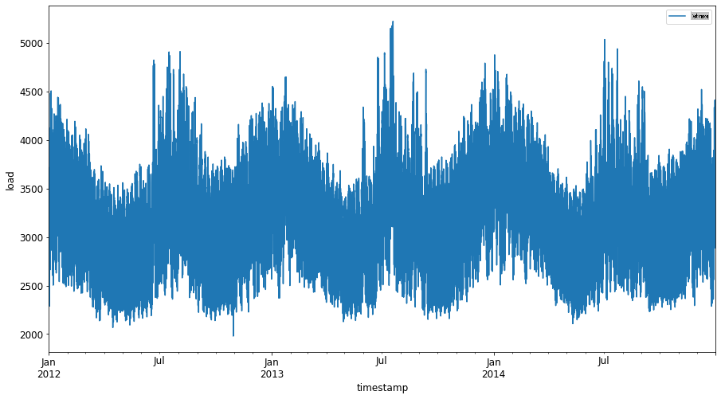
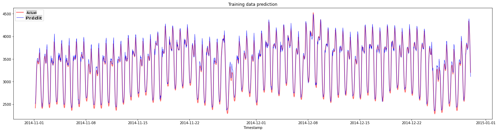
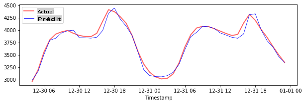

# Prévision de séries temporelles avec le Support Vector Regressor

Dans la leçon précédente, vous avez appris à utiliser le modèle ARIMA pour faire des prévisions de séries temporelles. Maintenant, vous allez vous intéresser au modèle Support Vector Regressor, qui est un modèle de régression utilisé pour prédire des données continues.

## [Quiz pré-lecture](https://gray-sand-07a10f403.1.azurestaticapps.net/quiz/51/)

## Introduction

Dans cette leçon, vous découvrirez une méthode spécifique pour construire des modèles avec [**SVM** : **S**upport **V**ector **M**achine](https://en.wikipedia.org/wiki/Support-vector_machine) pour la régression, ou **SVR : Support Vector Regressor**.

### SVR dans le contexte des séries temporelles [^1]

Avant de comprendre l'importance de SVR dans la prévision des séries temporelles, voici quelques concepts importants que vous devez connaître :

- **Régression :** Technique d'apprentissage supervisé pour prédire des valeurs continues à partir d'un ensemble donné d'entrées. L'idée est d'ajuster une courbe (ou une ligne) dans l'espace des caractéristiques qui a le maximum de points de données. [Cliquez ici](https://en.wikipedia.org/wiki/Regression_analysis) pour plus d'informations.
- **Support Vector Machine (SVM) :** Un type de modèle d'apprentissage automatique supervisé utilisé pour la classification, la régression et la détection d'outliers. Le modèle est un hyperplan dans l'espace des caractéristiques, qui dans le cas de la classification agit comme une frontière, et dans le cas de la régression agit comme la ligne de meilleur ajustement. Dans SVM, une fonction noyau est généralement utilisée pour transformer le jeu de données dans un espace de dimensions supérieures, afin qu'ils puissent être facilement séparables. [Cliquez ici](https://en.wikipedia.org/wiki/Support-vector_machine) pour plus d'informations sur les SVM.
- **Support Vector Regressor (SVR) :** Un type de SVM, pour trouver la ligne de meilleur ajustement (qui dans le cas de SVM est un hyperplan) qui a le maximum de points de données.

### Pourquoi SVR ? [^1]

Dans la dernière leçon, vous avez appris sur ARIMA, qui est une méthode statistique linéaire très réussie pour prévoir des données de séries temporelles. Cependant, dans de nombreux cas, les données de séries temporelles présentent *une non-linéarité*, qui ne peut pas être modélisée par des modèles linéaires. Dans de tels cas, la capacité de SVM à prendre en compte la non-linéarité dans les données pour les tâches de régression rend SVR efficace pour la prévision de séries temporelles.

## Exercice - construire un modèle SVR

Les premières étapes de préparation des données sont les mêmes que celles de la leçon précédente sur [ARIMA](https://github.com/microsoft/ML-For-Beginners/tree/main/7-TimeSeries/2-ARIMA).

Ouvrez le dossier [_/working_](https://github.com/microsoft/ML-For-Beginners/tree/main/7-TimeSeries/3-SVR/working) de cette leçon et trouvez le fichier [_notebook.ipynb_](https://github.com/microsoft/ML-For-Beginners/blob/main/7-TimeSeries/3-SVR/working/notebook.ipynb). [^2]

1. Exécutez le notebook et importez les bibliothèques nécessaires :  [^2]

   ```python
   import sys
   sys.path.append('../../')
   ```

   ```python
   import os
   import warnings
   import matplotlib.pyplot as plt
   import numpy as np
   import pandas as pd
   import datetime as dt
   import math
   
   from sklearn.svm import SVR
   from sklearn.preprocessing import MinMaxScaler
   from common.utils import load_data, mape
   ```

2. Chargez les données à partir du fichier `/data/energy.csv` dans un dataframe Pandas et jetez un œil :  [^2]

   ```python
   energy = load_data('../../data')[['load']]
   ```

3. Tracez toutes les données énergétiques disponibles de janvier 2012 à décembre 2014 : [^2]

   ```python
   energy.plot(y='load', subplots=True, figsize=(15, 8), fontsize=12)
   plt.xlabel('timestamp', fontsize=12)
   plt.ylabel('load', fontsize=12)
   plt.show()
   ```

   

   Maintenant, construisons notre modèle SVR.

### Créer des ensembles de données d'entraînement et de test

Maintenant que vos données sont chargées, vous pouvez les séparer en ensembles d'entraînement et de test. Ensuite, vous allez remodeler les données pour créer un ensemble de données basé sur les étapes temporelles, ce qui sera nécessaire pour le SVR. Vous allez entraîner votre modèle sur l'ensemble d'entraînement. Après que le modèle ait terminé l'entraînement, vous évaluerez sa précision sur l'ensemble d'entraînement, l'ensemble de test, puis sur l'ensemble de données complet pour voir la performance globale. Vous devez vous assurer que l'ensemble de test couvre une période ultérieure par rapport à l'ensemble d'entraînement pour garantir que le modèle ne tire pas d'informations des périodes futures [^2] (une situation connue sous le nom de *Surapprentissage*).

1. Allouez une période de deux mois du 1er septembre au 31 octobre 2014 à l'ensemble d'entraînement. L'ensemble de test comprendra la période de deux mois du 1er novembre au 31 décembre 2014 : [^2]

   ```python
   train_start_dt = '2014-11-01 00:00:00'
   test_start_dt = '2014-12-30 00:00:00'
   ```

2. Visualisez les différences : [^2]

   ```python
   energy[(energy.index < test_start_dt) & (energy.index >= train_start_dt)][['load']].rename(columns={'load':'train'}) \
       .join(energy[test_start_dt:][['load']].rename(columns={'load':'test'}), how='outer') \
       .plot(y=['train', 'test'], figsize=(15, 8), fontsize=12)
   plt.xlabel('timestamp', fontsize=12)
   plt.ylabel('load', fontsize=12)
   plt.show()
   ```

   

### Préparer les données pour l'entraînement

Maintenant, vous devez préparer les données pour l'entraînement en effectuant un filtrage et un redimensionnement de vos données. Filtrez votre ensemble de données pour n'inclure que les périodes et colonnes nécessaires, et redimensionnez pour garantir que les données sont projetées dans l'intervalle 0,1.

1. Filtrez l'ensemble de données original pour inclure uniquement les périodes mentionnées par ensemble et n'incluez que la colonne nécessaire 'load' ainsi que la date : [^2]

   ```python
   train = energy.copy()[(energy.index >= train_start_dt) & (energy.index < test_start_dt)][['load']]
   test = energy.copy()[energy.index >= test_start_dt][['load']]
   
   print('Training data shape: ', train.shape)
   print('Test data shape: ', test.shape)
   ```

   ```output
   Training data shape:  (1416, 1)
   Test data shape:  (48, 1)
   ```
   
2. Redimensionnez les données d'entraînement pour qu'elles soient dans l'intervalle (0, 1) : [^2]

   ```python
   scaler = MinMaxScaler()
   train['load'] = scaler.fit_transform(train)
   ```
   
4. Maintenant, vous redimensionnez les données de test : [^2]

   ```python
   test['load'] = scaler.transform(test)
   ```

### Créer des données avec des étapes temporelles [^1]

Pour le SVR, vous transformez les données d'entrée pour qu'elles soient de la forme `[batch, timesteps]`. So, you reshape the existing `train_data` and `test_data` de sorte qu'il y ait une nouvelle dimension qui fait référence aux étapes temporelles.

```python
# Converting to numpy arrays
train_data = train.values
test_data = test.values
```

Pour cet exemple, nous prenons `timesteps = 5`. Ainsi, les entrées du modèle sont les données pour les 4 premières étapes temporelles, et la sortie sera les données pour la 5ème étape temporelle.

```python
timesteps=5
```

Conversion des données d'entraînement en tenseur 2D à l'aide de la compréhension de liste imbriquée :

```python
train_data_timesteps=np.array([[j for j in train_data[i:i+timesteps]] for i in range(0,len(train_data)-timesteps+1)])[:,:,0]
train_data_timesteps.shape
```

```output
(1412, 5)
```

Conversion des données de test en tenseur 2D :

```python
test_data_timesteps=np.array([[j for j in test_data[i:i+timesteps]] for i in range(0,len(test_data)-timesteps+1)])[:,:,0]
test_data_timesteps.shape
```

```output
(44, 5)
```

Sélection des entrées et sorties à partir des données d'entraînement et de test :

```python
x_train, y_train = train_data_timesteps[:,:timesteps-1],train_data_timesteps[:,[timesteps-1]]
x_test, y_test = test_data_timesteps[:,:timesteps-1],test_data_timesteps[:,[timesteps-1]]

print(x_train.shape, y_train.shape)
print(x_test.shape, y_test.shape)
```

```output
(1412, 4) (1412, 1)
(44, 4) (44, 1)
```

### Implémenter SVR [^1]

Maintenant, il est temps d'implémenter SVR. Pour en savoir plus sur cette implémentation, vous pouvez consulter [cette documentation](https://scikit-learn.org/stable/modules/generated/sklearn.svm.SVR.html). Pour notre implémentation, nous suivons ces étapes :

  1. Définir le modèle en appelant la fonction `SVR()` and passing in the model hyperparameters: kernel, gamma, c and epsilon
  2. Prepare the model for the training data by calling the `fit()` function
  3. Make predictions calling the `predict()`

Maintenant, nous créons un modèle SVR. Ici, nous utilisons le [noyau RBF](https://scikit-learn.org/stable/modules/svm.html#parameters-of-the-rbf-kernel) et fixons les hyperparamètres gamma, C et epsilon respectivement à 0.5, 10 et 0.05.

```python
model = SVR(kernel='rbf',gamma=0.5, C=10, epsilon = 0.05)
```

#### Ajuster le modèle sur les données d'entraînement [^1]

```python
model.fit(x_train, y_train[:,0])
```

```output
SVR(C=10, cache_size=200, coef0=0.0, degree=3, epsilon=0.05, gamma=0.5,
    kernel='rbf', max_iter=-1, shrinking=True, tol=0.001, verbose=False)
```

#### Faire des prédictions avec le modèle [^1]

```python
y_train_pred = model.predict(x_train).reshape(-1,1)
y_test_pred = model.predict(x_test).reshape(-1,1)

print(y_train_pred.shape, y_test_pred.shape)
```

```output
(1412, 1) (44, 1)
```

Vous avez construit votre SVR ! Maintenant, nous devons l'évaluer.

### Évaluer votre modèle [^1]

Pour l'évaluation, nous allons d'abord redimensionner les données à notre échelle originale. Ensuite, pour vérifier la performance, nous tracerons le graphique des séries temporelles originales et prédites, et nous imprimerons également le résultat MAPE.

Redimensionnez la sortie prédite et originale :

```python
# Scaling the predictions
y_train_pred = scaler.inverse_transform(y_train_pred)
y_test_pred = scaler.inverse_transform(y_test_pred)

print(len(y_train_pred), len(y_test_pred))
```

```python
# Scaling the original values
y_train = scaler.inverse_transform(y_train)
y_test = scaler.inverse_transform(y_test)

print(len(y_train), len(y_test))
```

#### Vérifier la performance du modèle sur les données d'entraînement et de test [^1]

Nous extrayons les horodatages de l'ensemble de données pour les afficher sur l'axe des x de notre graphique. Notez que nous utilisons les premières ```timesteps-1``` valeurs comme entrée pour la première sortie, donc les horodatages pour la sortie commenceront après cela.

```python
train_timestamps = energy[(energy.index < test_start_dt) & (energy.index >= train_start_dt)].index[timesteps-1:]
test_timestamps = energy[test_start_dt:].index[timesteps-1:]

print(len(train_timestamps), len(test_timestamps))
```

```output
1412 44
```

Tracez les prédictions pour les données d'entraînement :

```python
plt.figure(figsize=(25,6))
plt.plot(train_timestamps, y_train, color = 'red', linewidth=2.0, alpha = 0.6)
plt.plot(train_timestamps, y_train_pred, color = 'blue', linewidth=0.8)
plt.legend(['Actual','Predicted'])
plt.xlabel('Timestamp')
plt.title("Training data prediction")
plt.show()
```



Imprimez le MAPE pour les données d'entraînement

```python
print('MAPE for training data: ', mape(y_train_pred, y_train)*100, '%')
```

```output
MAPE for training data: 1.7195710200875551 %
```

Tracez les prédictions pour les données de test

```python
plt.figure(figsize=(10,3))
plt.plot(test_timestamps, y_test, color = 'red', linewidth=2.0, alpha = 0.6)
plt.plot(test_timestamps, y_test_pred, color = 'blue', linewidth=0.8)
plt.legend(['Actual','Predicted'])
plt.xlabel('Timestamp')
plt.show()
```



Imprimez le MAPE pour les données de test

```python
print('MAPE for testing data: ', mape(y_test_pred, y_test)*100, '%')
```

```output
MAPE for testing data:  1.2623790187854018 %
```

🏆 Vous avez obtenu un très bon résultat sur l'ensemble de données de test !

### Vérifier la performance du modèle sur l'ensemble de données complet [^1]

```python
# Extracting load values as numpy array
data = energy.copy().values

# Scaling
data = scaler.transform(data)

# Transforming to 2D tensor as per model input requirement
data_timesteps=np.array([[j for j in data[i:i+timesteps]] for i in range(0,len(data)-timesteps+1)])[:,:,0]
print("Tensor shape: ", data_timesteps.shape)

# Selecting inputs and outputs from data
X, Y = data_timesteps[:,:timesteps-1],data_timesteps[:,[timesteps-1]]
print("X shape: ", X.shape,"\nY shape: ", Y.shape)
```

```output
Tensor shape:  (26300, 5)
X shape:  (26300, 4) 
Y shape:  (26300, 1)
```

```python
# Make model predictions
Y_pred = model.predict(X).reshape(-1,1)

# Inverse scale and reshape
Y_pred = scaler.inverse_transform(Y_pred)
Y = scaler.inverse_transform(Y)
```

```python
plt.figure(figsize=(30,8))
plt.plot(Y, color = 'red', linewidth=2.0, alpha = 0.6)
plt.plot(Y_pred, color = 'blue', linewidth=0.8)
plt.legend(['Actual','Predicted'])
plt.xlabel('Timestamp')
plt.show()
```


```python
print('MAPE: ', mape(Y_pred, Y)*100, '%')
```

```output
MAPE:  2.0572089029888656 %
```

🏆 De très beaux graphiques, montrant un modèle avec une bonne précision. Bien joué !

---

## 🚀Défi

- Essayez d'ajuster les hyperparamètres (gamma, C, epsilon) lors de la création du modèle et évaluez-les sur les données pour voir quel ensemble d'hyperparamètres donne les meilleurs résultats sur les données de test. Pour en savoir plus sur ces hyperparamètres, vous pouvez consulter le document [ici](https://scikit-learn.org/stable/modules/svm.html#parameters-of-the-rbf-kernel).
- Essayez d'utiliser différentes fonctions noyau pour le modèle et analysez leurs performances sur l'ensemble de données. Un document utile peut être trouvé [ici](https://scikit-learn.org/stable/modules/svm.html#kernel-functions).
- Essayez d'utiliser différentes valeurs pour `timesteps` afin que le modèle puisse remonter dans le temps pour faire des prédictions.

## [Quiz post-lecture](https://gray-sand-07a10f403.1.azurestaticapps.net/quiz/52/)

## Revue et auto-apprentissage

Cette leçon avait pour but d'introduire l'application de SVR pour la prévision de séries temporelles. Pour en savoir plus sur SVR, vous pouvez consulter [ce blog](https://www.analyticsvidhya.com/blog/2020/03/support-vector-regression-tutorial-for-machine-learning/). Cette [documentation sur scikit-learn](https://scikit-learn.org/stable/modules/svm.html) fournit une explication plus complète sur les SVM en général, [les SVR](https://scikit-learn.org/stable/modules/svm.html#regression) et également d'autres détails d'implémentation tels que les différentes [fonctions noyau](https://scikit-learn.org/stable/modules/svm.html#kernel-functions) qui peuvent être utilisées, ainsi que leurs paramètres.

## Devoir

[Un nouveau modèle SVR](assignment.md)

## Crédits

[^1]: Le texte, le code et la sortie de cette section ont été contribué par [@AnirbanMukherjeeXD](https://github.com/AnirbanMukherjeeXD)  
[^2]: Le texte, le code et la sortie de cette section ont été pris de [ARIMA](https://github.com/microsoft/ML-For-Beginners/tree/main/7-TimeSeries/2-ARIMA)

**Avertissement** :  
Ce document a été traduit à l'aide de services de traduction automatique basés sur l'IA. Bien que nous visons à l'exactitude, veuillez noter que les traductions automatisées peuvent contenir des erreurs ou des inexactitudes. Le document original dans sa langue native doit être considéré comme la source autorisée. Pour des informations critiques, une traduction humaine professionnelle est recommandée. Nous ne sommes pas responsables des malentendus ou des interprétations erronées résultant de l'utilisation de cette traduction.