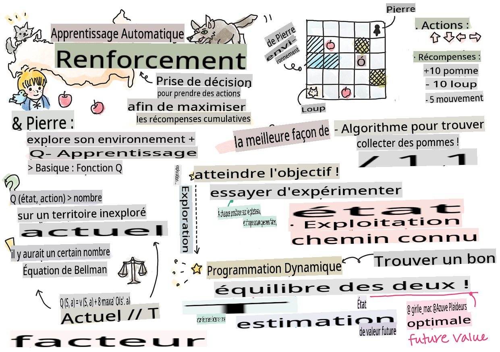

<!--
CO_OP_TRANSLATOR_METADATA:
{
  "original_hash": "0ffe994d1cc881bdeb49226a064116e5",
  "translation_date": "2025-09-04T00:15:37+00:00",
  "source_file": "8-Reinforcement/1-QLearning/README.md",
  "language_code": "fr"
}
-->
# Introduction à l'apprentissage par renforcement et au Q-Learning


> Sketchnote par [Tomomi Imura](https://www.twitter.com/girlie_mac)

L'apprentissage par renforcement repose sur trois concepts importants : l'agent, des états, et un ensemble d'actions par état. En exécutant une action dans un état donné, l'agent reçoit une récompense. Imaginez à nouveau le jeu vidéo Super Mario. Vous êtes Mario, dans un niveau de jeu, debout près du bord d'une falaise. Au-dessus de vous se trouve une pièce. Vous, étant Mario, dans un niveau de jeu, à une position spécifique... c'est votre état. Faire un pas vers la droite (une action) vous ferait tomber dans le vide, ce qui vous donnerait un score numérique faible. Cependant, appuyer sur le bouton de saut vous permettrait de marquer un point et de rester en vie. C'est un résultat positif qui devrait vous attribuer un score numérique positif.

En utilisant l'apprentissage par renforcement et un simulateur (le jeu), vous pouvez apprendre à jouer au jeu pour maximiser la récompense, c'est-à-dire rester en vie et marquer autant de points que possible.

[](https://www.youtube.com/watch?v=lDq_en8RNOo)

> 🎥 Cliquez sur l'image ci-dessus pour écouter Dmitry parler de l'apprentissage par renforcement

## [Quiz avant la leçon](https://gray-sand-07a10f403.1.azurestaticapps.net/quiz/45/)

## Prérequis et configuration

Dans cette leçon, nous allons expérimenter avec du code en Python. Vous devriez être en mesure d'exécuter le code du Jupyter Notebook de cette leçon, soit sur votre ordinateur, soit dans le cloud.

Vous pouvez ouvrir [le notebook de la leçon](https://github.com/microsoft/ML-For-Beginners/blob/main/8-Reinforcement/1-QLearning/notebook.ipynb) et suivre cette leçon pour construire.

> **Note :** Si vous ouvrez ce code depuis le cloud, vous devez également récupérer le fichier [`rlboard.py`](https://github.com/microsoft/ML-For-Beginners/blob/main/8-Reinforcement/1-QLearning/rlboard.py), qui est utilisé dans le code du notebook. Ajoutez-le au même répertoire que le notebook.

## Introduction

Dans cette leçon, nous allons explorer le monde de **[Pierre et le Loup](https://fr.wikipedia.org/wiki/Pierre_et_le_Loup)**, inspiré d'un conte musical du compositeur russe [Sergei Prokofiev](https://fr.wikipedia.org/wiki/Sergei_Prokofiev). Nous utiliserons **l'apprentissage par renforcement** pour permettre à Pierre d'explorer son environnement, de collecter de délicieuses pommes et d'éviter de rencontrer le loup.

**L'apprentissage par renforcement** (RL) est une technique d'apprentissage qui nous permet d'apprendre un comportement optimal d'un **agent** dans un **environnement** en réalisant de nombreuses expériences. Un agent dans cet environnement doit avoir un **objectif**, défini par une **fonction de récompense**.

## L'environnement

Pour simplifier, considérons le monde de Pierre comme un plateau carré de taille `largeur` x `hauteur`, comme ceci :


Chaque case de ce plateau peut être :

* **sol**, sur lequel Pierre et d'autres créatures peuvent marcher.
* **eau**, sur laquelle il est évidemment impossible de marcher.
* un **arbre** ou de l'**herbe**, un endroit où l'on peut se reposer.
* une **pomme**, que Pierre serait ravi de trouver pour se nourrir.
* un **loup**, qui est dangereux et doit être évité.

Il existe un module Python séparé, [`rlboard.py`](https://github.com/microsoft/ML-For-Beginners/blob/main/8-Reinforcement/1-QLearning/rlboard.py), qui contient le code pour travailler avec cet environnement. Comme ce code n'est pas essentiel pour comprendre nos concepts, nous allons importer le module et l'utiliser pour créer le plateau d'exemple (bloc de code 1) :

```python
from rlboard import *

width, height = 8,8
m = Board(width,height)
m.randomize(seed=13)
m.plot()
```

Ce code devrait afficher une image de l'environnement similaire à celle ci-dessus.

## Actions et politique

Dans notre exemple, l'objectif de Pierre serait de trouver une pomme tout en évitant le loup et les autres obstacles. Pour ce faire, il peut essentiellement se déplacer jusqu'à ce qu'il trouve une pomme.

Ainsi, à n'importe quelle position, il peut choisir entre l'une des actions suivantes : haut, bas, gauche et droite.

Nous allons définir ces actions sous forme de dictionnaire et les associer à des paires de changements de coordonnées correspondants. Par exemple, se déplacer à droite (`R`) correspondrait à une paire `(1,0)`. (bloc de code 2) :

```python
actions = { "U" : (0,-1), "D" : (0,1), "L" : (-1,0), "R" : (1,0) }
action_idx = { a : i for i,a in enumerate(actions.keys()) }
```

Pour résumer, la stratégie et l'objectif de ce scénario sont les suivants :

- **La stratégie** de notre agent (Pierre) est définie par ce qu'on appelle une **politique**. Une politique est une fonction qui retourne l'action à effectuer dans un état donné. Dans notre cas, l'état du problème est représenté par le plateau, y compris la position actuelle du joueur.

- **L'objectif** de l'apprentissage par renforcement est d'apprendre une bonne politique qui nous permettra de résoudre le problème efficacement. Cependant, comme point de départ, considérons la politique la plus simple appelée **marche aléatoire**.

## Marche aléatoire

Résolvons d'abord notre problème en implémentant une stratégie de marche aléatoire. Avec la marche aléatoire, nous choisirons aléatoirement la prochaine action parmi les actions autorisées, jusqu'à ce que nous atteignions la pomme (bloc de code 3).

1. Implémentez la marche aléatoire avec le code ci-dessous :

    ```python
    def random_policy(m):
        return random.choice(list(actions))
    
    def walk(m,policy,start_position=None):
        n = 0 # number of steps
        # set initial position
        if start_position:
            m.human = start_position 
        else:
            m.random_start()
        while True:
            if m.at() == Board.Cell.apple:
                return n # success!
            if m.at() in [Board.Cell.wolf, Board.Cell.water]:
                return -1 # eaten by wolf or drowned
            while True:
                a = actions[policy(m)]
                new_pos = m.move_pos(m.human,a)
                if m.is_valid(new_pos) and m.at(new_pos)!=Board.Cell.water:
                    m.move(a) # do the actual move
                    break
            n+=1
    
    walk(m,random_policy)
    ```

    L'appel à `walk` devrait retourner la longueur du chemin correspondant, qui peut varier d'une exécution à l'autre.

1. Exécutez l'expérience de marche plusieurs fois (disons, 100), et affichez les statistiques résultantes (bloc de code 4) :

    ```python
    def print_statistics(policy):
        s,w,n = 0,0,0
        for _ in range(100):
            z = walk(m,policy)
            if z<0:
                w+=1
            else:
                s += z
                n += 1
        print(f"Average path length = {s/n}, eaten by wolf: {w} times")
    
    print_statistics(random_policy)
    ```

    Notez que la longueur moyenne d'un chemin est d'environ 30-40 étapes, ce qui est assez élevé, étant donné que la distance moyenne jusqu'à la pomme la plus proche est d'environ 5-6 étapes.

    Vous pouvez également voir à quoi ressemble le mouvement de Pierre pendant la marche aléatoire :

    

## Fonction de récompense

Pour rendre notre politique plus intelligente, nous devons comprendre quels mouvements sont "meilleurs" que d'autres. Pour ce faire, nous devons définir notre objectif.

L'objectif peut être défini en termes de **fonction de récompense**, qui retournera une valeur de score pour chaque état. Plus le nombre est élevé, meilleure est la fonction de récompense. (bloc de code 5)

```python
move_reward = -0.1
goal_reward = 10
end_reward = -10

def reward(m,pos=None):
    pos = pos or m.human
    if not m.is_valid(pos):
        return end_reward
    x = m.at(pos)
    if x==Board.Cell.water or x == Board.Cell.wolf:
        return end_reward
    if x==Board.Cell.apple:
        return goal_reward
    return move_reward
```

Un aspect intéressant des fonctions de récompense est que dans la plupart des cas, *nous ne recevons une récompense substantielle qu'à la fin du jeu*. Cela signifie que notre algorithme doit d'une certaine manière se souvenir des "bons" pas qui mènent à une récompense positive à la fin, et augmenter leur importance. De même, tous les mouvements qui mènent à de mauvais résultats doivent être découragés.

## Q-Learning

L'algorithme que nous allons discuter ici s'appelle **Q-Learning**. Dans cet algorithme, la politique est définie par une fonction (ou une structure de données) appelée **Q-Table**. Elle enregistre la "qualité" de chaque action dans un état donné.

On l'appelle Q-Table car il est souvent pratique de la représenter sous forme de tableau ou de tableau multidimensionnel. Étant donné que notre plateau a des dimensions `largeur` x `hauteur`, nous pouvons représenter la Q-Table à l'aide d'un tableau numpy de forme `largeur` x `hauteur` x `len(actions)` : (bloc de code 6)

```python
Q = np.ones((width,height,len(actions)),dtype=np.float)*1.0/len(actions)
```

Notez que nous initialisons toutes les valeurs de la Q-Table avec une valeur égale, dans notre cas - 0.25. Cela correspond à la politique de "marche aléatoire", car tous les mouvements dans chaque état sont également bons. Nous pouvons passer la Q-Table à la fonction `plot` afin de visualiser la table sur le plateau : `m.plot(Q)`.


Au centre de chaque case, il y a une "flèche" qui indique la direction préférée du mouvement. Étant donné que toutes les directions sont égales, un point est affiché.

Nous devons maintenant exécuter la simulation, explorer notre environnement, et apprendre une meilleure distribution des valeurs de la Q-Table, ce qui nous permettra de trouver le chemin vers la pomme beaucoup plus rapidement.

## Essence du Q-Learning : Équation de Bellman

Une fois que nous commençons à nous déplacer, chaque action aura une récompense correspondante, c'est-à-dire que nous pourrions théoriquement sélectionner la prochaine action en fonction de la récompense immédiate la plus élevée. Cependant, dans la plupart des états, le mouvement n'atteindra pas notre objectif de trouver la pomme, et nous ne pouvons donc pas immédiatement décider quelle direction est meilleure.

> Rappelez-vous que ce n'est pas le résultat immédiat qui compte, mais plutôt le résultat final, que nous obtiendrons à la fin de la simulation.

Pour tenir compte de cette récompense différée, nous devons utiliser les principes de la **[programmation dynamique](https://fr.wikipedia.org/wiki/Programmation_dynamique)**, qui nous permettent de réfléchir à notre problème de manière récursive.

Supposons que nous sommes maintenant dans l'état *s*, et que nous voulons passer à l'état suivant *s'*. En le faisant, nous recevrons la récompense immédiate *r(s,a)*, définie par la fonction de récompense, plus une certaine récompense future. Si nous supposons que notre Q-Table reflète correctement l'"attractivité" de chaque action, alors dans l'état *s'*, nous choisirons une action *a* qui correspond à la valeur maximale de *Q(s',a')*. Ainsi, la meilleure récompense future possible que nous pourrions obtenir dans l'état *s* sera définie comme `max`

## Vérification de la politique

Étant donné que la Q-Table liste l'"attractivité" de chaque action dans chaque état, il est assez facile de l'utiliser pour définir une navigation efficace dans notre monde. Dans le cas le plus simple, nous pouvons sélectionner l'action correspondant à la valeur la plus élevée de la Q-Table : (bloc de code 9)

```python
def qpolicy_strict(m):
        x,y = m.human
        v = probs(Q[x,y])
        a = list(actions)[np.argmax(v)]
        return a

walk(m,qpolicy_strict)
```

> Si vous essayez le code ci-dessus plusieurs fois, vous remarquerez peut-être qu'il "bloque" parfois, et vous devez appuyer sur le bouton STOP dans le notebook pour l'interrompre. Cela se produit parce qu'il peut y avoir des situations où deux états "pointent" l'un vers l'autre en termes de valeur Q optimale, ce qui amène l'agent à se déplacer indéfiniment entre ces états.

## 🚀Défi

> **Tâche 1 :** Modifiez la fonction `walk` pour limiter la longueur maximale du chemin à un certain nombre de pas (par exemple, 100), et observez le code ci-dessus retourner cette valeur de temps en temps.

> **Tâche 2 :** Modifiez la fonction `walk` afin qu'elle ne retourne pas aux endroits où elle est déjà passée auparavant. Cela empêchera `walk` de boucler, cependant, l'agent peut toujours se retrouver "piégé" dans un endroit dont il ne peut pas s'échapper.

## Navigation

Une meilleure politique de navigation serait celle que nous avons utilisée pendant l'entraînement, qui combine exploitation et exploration. Dans cette politique, nous sélectionnerons chaque action avec une certaine probabilité, proportionnelle aux valeurs dans la Q-Table. Cette stratégie peut encore amener l'agent à retourner à une position qu'il a déjà explorée, mais, comme vous pouvez le voir dans le code ci-dessous, elle aboutit à un chemin moyen très court vers l'emplacement souhaité (rappelez-vous que `print_statistics` exécute la simulation 100 fois) : (bloc de code 10)

```python
def qpolicy(m):
        x,y = m.human
        v = probs(Q[x,y])
        a = random.choices(list(actions),weights=v)[0]
        return a

print_statistics(qpolicy)
```

Après avoir exécuté ce code, vous devriez obtenir une longueur moyenne de chemin beaucoup plus petite qu'auparavant, dans une plage de 3 à 6.

## Étudier le processus d'apprentissage

Comme nous l'avons mentionné, le processus d'apprentissage est un équilibre entre l'exploration et l'exploitation des connaissances acquises sur la structure de l'espace problème. Nous avons vu que les résultats de l'apprentissage (la capacité à aider un agent à trouver un chemin court vers l'objectif) se sont améliorés, mais il est également intéressant d'observer comment la longueur moyenne du chemin évolue pendant le processus d'apprentissage :

## Les apprentissages peuvent être résumés comme suit :

- **La longueur moyenne du chemin augmente**. Ce que nous observons ici, c'est qu'au début, la longueur moyenne du chemin augmente. Cela est probablement dû au fait que lorsque nous ne savons rien de l'environnement, nous sommes susceptibles de nous retrouver piégés dans des états défavorables, comme l'eau ou le loup. À mesure que nous apprenons davantage et commençons à utiliser ces connaissances, nous pouvons explorer l'environnement plus longtemps, mais nous ne savons toujours pas très bien où se trouvent les pommes.

- **La longueur du chemin diminue à mesure que nous apprenons davantage**. Une fois que nous avons suffisamment appris, il devient plus facile pour l'agent d'atteindre l'objectif, et la longueur du chemin commence à diminuer. Cependant, nous restons ouverts à l'exploration, ce qui nous amène souvent à nous éloigner du meilleur chemin et à explorer de nouvelles options, rendant le chemin plus long que l'optimal.

- **Augmentation brusque de la longueur**. Ce que nous observons également sur ce graphique, c'est qu'à un certain moment, la longueur a augmenté brusquement. Cela indique la nature stochastique du processus, et qu'à un moment donné, nous pouvons "altérer" les coefficients de la Q-Table en les remplaçant par de nouvelles valeurs. Cela devrait idéalement être minimisé en diminuant le taux d'apprentissage (par exemple, vers la fin de l'entraînement, nous ajustons les valeurs de la Q-Table uniquement par une petite valeur).

Dans l'ensemble, il est important de se rappeler que le succès et la qualité du processus d'apprentissage dépendent significativement des paramètres, tels que le taux d'apprentissage, la décroissance du taux d'apprentissage et le facteur de réduction. Ceux-ci sont souvent appelés **hyperparamètres**, pour les distinguer des **paramètres**, que nous optimisons pendant l'entraînement (par exemple, les coefficients de la Q-Table). Le processus de recherche des meilleures valeurs d'hyperparamètres est appelé **optimisation des hyperparamètres**, et il mérite un sujet à part entière.

## [Quiz post-lecture](https://gray-sand-07a10f403.1.azurestaticapps.net/quiz/46/)

## Devoir 
[Un monde plus réaliste](assignment.md)

---

**Avertissement** :  
Ce document a été traduit à l'aide du service de traduction automatique [Co-op Translator](https://github.com/Azure/co-op-translator). Bien que nous nous efforcions d'assurer l'exactitude, veuillez noter que les traductions automatisées peuvent contenir des erreurs ou des inexactitudes. Le document original dans sa langue d'origine doit être considéré comme la source faisant autorité. Pour des informations critiques, il est recommandé de recourir à une traduction professionnelle effectuée par un humain. Nous déclinons toute responsabilité en cas de malentendus ou d'interprétations erronées résultant de l'utilisation de cette traduction.