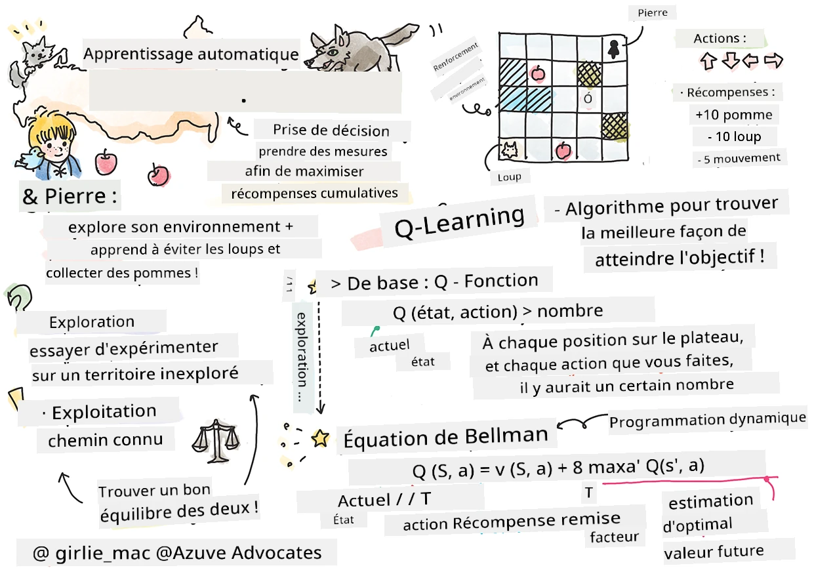

# Introduction à l'apprentissage par renforcement et au Q-Learning


> Sketchnote par [Tomomi Imura](https://www.twitter.com/girlie_mac)

L'apprentissage par renforcement implique trois concepts importants : l'agent, certains états et un ensemble d'actions par état. En exécutant une action dans un état spécifié, l'agent reçoit une récompense. Imaginez encore le jeu vidéo Super Mario. Vous êtes Mario, vous êtes dans un niveau de jeu, debout au bord d'une falaise. Au-dessus de vous se trouve une pièce. Vous, en tant que Mario, dans un niveau de jeu, à une position spécifique... c'est votre état. Faire un pas vers la droite (une action) vous ferait tomber du bord, ce qui vous donnerait un score numérique faible. Cependant, appuyer sur le bouton de saut vous permettrait de marquer un point et de rester en vie. C'est un résultat positif qui devrait vous attribuer un score numérique positif.

En utilisant l'apprentissage par renforcement et un simulateur (le jeu), vous pouvez apprendre à jouer afin de maximiser la récompense, qui est de rester en vie et de marquer autant de points que possible.

[](https://www.youtube.com/watch?v=lDq_en8RNOo)

> 🎥 Cliquez sur l'image ci-dessus pour écouter Dmitry parler de l'apprentissage par renforcement

## [Quiz pré-lecture](https://ff-quizzes.netlify.app/en/ml/)

## Prérequis et installation

Dans cette leçon, nous expérimenterons avec du code Python. Vous devriez pouvoir exécuter le code du Jupyter Notebook de cette leçon, soit sur votre ordinateur, soit dans le cloud.

Vous pouvez ouvrir [le notebook de la leçon](https://github.com/microsoft/ML-For-Beginners/blob/main/8-Reinforcement/1-QLearning/notebook.ipynb) et suivre cette leçon pour construire.

> **Note :** Si vous ouvrez ce code depuis le cloud, vous devez également récupérer le fichier [`rlboard.py`](https://github.com/microsoft/ML-For-Beginners/blob/main/8-Reinforcement/1-QLearning/rlboard.py), qui est utilisé dans le code du notebook. Ajoutez-le dans le même répertoire que le notebook.

## Introduction

Dans cette leçon, nous allons explorer le monde de **[Pierre et le Loup](https://fr.wikipedia.org/wiki/Pierre_et_le_loup)**, inspiré d'un conte musical du compositeur russe [Sergei Prokofiev](https://fr.wikipedia.org/wiki/Sergei_Prokofiev). Nous utiliserons l'**apprentissage par renforcement** pour permettre à Pierre d'explorer son environnement, de collecter de délicieuses pommes et d'éviter le loup.

L'**apprentissage par renforcement** (RL) est une technique d'apprentissage qui nous permet d'apprendre un comportement optimal d'un **agent** dans un **environnement** en réalisant de nombreuses expériences. Un agent dans cet environnement doit avoir un **objectif**, défini par une **fonction de récompense**.

## L'environnement

Pour simplifier, considérons que le monde de Pierre est une grille carrée de taille `largeur` x `hauteur`, comme ceci :


Chaque case de cette grille peut être :

* **sol**, sur lequel Pierre et d'autres créatures peuvent marcher.
* **eau**, sur laquelle il est évidemment impossible de marcher.
* un **arbre** ou de **l'herbe**, un endroit où vous pouvez vous reposer.
* une **pomme**, qui représente quelque chose que Pierre serait heureux de trouver pour se nourrir.
* un **loup**, qui est dangereux et doit être évité.

Il existe un module Python séparé, [`rlboard.py`](https://github.com/microsoft/ML-For-Beginners/blob/main/8-Reinforcement/1-QLearning/rlboard.py), qui contient le code pour travailler avec cet environnement. Comme ce code n'est pas important pour comprendre nos concepts, nous importerons le module et l'utiliserons pour créer la grille d'exemple (bloc de code 1) :

```python
from rlboard import *

width, height = 8,8
m = Board(width,height)
m.randomize(seed=13)
m.plot()
```

Ce code devrait afficher une image de l'environnement similaire à celle ci-dessus.

## Actions et politique

Dans notre exemple, l'objectif de Pierre serait de trouver une pomme tout en évitant le loup et d'autres obstacles. Pour cela, il peut essentiellement se déplacer jusqu'à trouver une pomme.

Ainsi, à n'importe quelle position, il peut choisir entre les actions suivantes : haut, bas, gauche et droite.

Nous définirons ces actions sous forme d'un dictionnaire, et les mapperons à des paires correspondant aux changements de coordonnées. Par exemple, aller à droite (`R`) correspondrait à une paire `(1,0)`. (bloc de code 2) :

```python
actions = { "U" : (0,-1), "D" : (0,1), "L" : (-1,0), "R" : (1,0) }
action_idx = { a : i for i,a in enumerate(actions.keys()) }
```

En résumé, la stratégie et l'objectif de ce scénario sont les suivants :

- **La stratégie**, de notre agent (Pierre) est définie par une **politique**. Une politique est une fonction qui retourne l'action à tout état donné. Dans notre cas, l'état du problème est représenté par la grille, incluant la position actuelle du joueur.

- **L'objectif**, de l'apprentissage par renforcement est d'apprendre finalement une bonne politique qui nous permettra de résoudre le problème efficacement. Cependant, comme référence, considérons la politique la plus simple appelée **marche aléatoire**.

## Marche aléatoire

Résolvons d'abord notre problème en implémentant une stratégie de marche aléatoire. Avec la marche aléatoire, nous choisirons de manière aléatoire la prochaine action parmi celles autorisées, jusqu'à atteindre la pomme (bloc de code 3).

1. Implémentez la marche aléatoire avec le code ci-dessous :

    ```python
    def random_policy(m):
        return random.choice(list(actions))
    
    def walk(m,policy,start_position=None):
        n = 0 # nombre de pas
        # définir la position initiale
        if start_position:
            m.human = start_position 
        else:
            m.random_start()
        while True:
            if m.at() == Board.Cell.apple:
                return n # succès !
            if m.at() in [Board.Cell.wolf, Board.Cell.water]:
                return -1 # mangé par un loup ou noyé
            while True:
                a = actions[policy(m)]
                new_pos = m.move_pos(m.human,a)
                if m.is_valid(new_pos) and m.at(new_pos)!=Board.Cell.water:
                    m.move(a) # faire le déplacement réel
                    break
            n+=1
    
    walk(m,random_policy)
    ```

    L'appel à `walk` devrait retourner la longueur du chemin correspondant, qui peut varier d'une exécution à l'autre.

1. Exécutez l'expérience de marche un certain nombre de fois (disons 100), et affichez les statistiques résultantes (bloc de code 4) :

    ```python
    def print_statistics(policy):
        s,w,n = 0,0,0
        for _ in range(100):
            z = walk(m,policy)
            if z<0:
                w+=1
            else:
                s += z
                n += 1
        print(f"Average path length = {s/n}, eaten by wolf: {w} times")
    
    print_statistics(random_policy)
    ```

    Notez que la longueur moyenne d'un chemin est d'environ 30-40 pas, ce qui est assez long, étant donné que la distance moyenne à la pomme la plus proche est d'environ 5-6 pas.

    Vous pouvez aussi voir à quoi ressemble le déplacement de Pierre durant la marche aléatoire :

    

## Fonction de récompense

Pour rendre notre politique plus intelligente, nous devons comprendre quels mouvements sont « meilleurs » que d’autres. Pour cela, nous devons définir notre objectif.

L'objectif peut être défini en termes de **fonction de récompense**, qui retournera une valeur de score pour chaque état. Plus ce nombre est élevé, meilleure est la fonction de récompense. (bloc de code 5)

```python
move_reward = -0.1
goal_reward = 10
end_reward = -10

def reward(m,pos=None):
    pos = pos or m.human
    if not m.is_valid(pos):
        return end_reward
    x = m.at(pos)
    if x==Board.Cell.water or x == Board.Cell.wolf:
        return end_reward
    if x==Board.Cell.apple:
        return goal_reward
    return move_reward
```

Une chose intéressante au sujet des fonctions de récompense est que dans la plupart des cas, *une récompense substantielle ne nous est donnée qu'à la fin du jeu*. Cela signifie que notre algorithme doit d'une certaine façon mémoriser les « bonnes » étapes qui mènent à une récompense positive à la fin, et augmenter leur importance. De même, tous les mouvements qui mènent à de mauvais résultats doivent être découragés.

## Q-Learning

Un algorithme que nous allons discuter ici s'appelle **Q-Learning**. Dans cet algorithme, la politique est définie par une fonction (ou une structure de données) appelée **Q-Table**. Elle enregistre la "bonté" de chacune des actions dans un état donné.

Elle s'appelle Q-Table car il est souvent pratique de la représenter sous la forme d'un tableau, ou d'un tableau multidimensionnel. Puisque notre grille a des dimensions `largeur` x `hauteur`, nous pouvons représenter la Q-Table en utilisant un tableau numpy de forme `largeur` x `hauteur` x `len(actions)` : (bloc de code 6)

```python
Q = np.ones((width,height,len(actions)),dtype=np.float)*1.0/len(actions)
```

Notez que nous initialisons toutes les valeurs de la Q-Table avec une valeur égale, dans notre cas - 0,25. Cela correspond à la politique de la « marche aléatoire », car tous les mouvements à chaque état sont également bons. Nous pouvons passer la Q-Table à la fonction `plot` afin de visualiser le tableau sur la grille : `m.plot(Q)`.


Au centre de chaque case, il y a une « flèche » qui indique la direction préférée du mouvement. Comme toutes les directions sont égales, un point est affiché.

Maintenant, nous devons exécuter la simulation, explorer notre environnement, et apprendre une meilleure distribution des valeurs de la Q-Table, ce qui nous permettra de trouver le chemin vers la pomme beaucoup plus rapidement.

## L'essence du Q-Learning : l'équation de Bellman

Une fois que nous commençons à bouger, chaque action aura une récompense correspondante, c’est-à-dire que nous pouvons théoriquement sélectionner la prochaine action selon la meilleure récompense immédiate. Cependant, dans la plupart des états, le mouvement n'atteindra pas notre objectif d'atteindre la pomme, et nous ne pouvons donc pas immédiatement décider quelle direction est meilleure.

> Souvenez-vous que ce n’est pas le résultat immédiat qui compte, mais plutôt le résultat final que nous obtiendrons à la fin de la simulation.

Pour prendre en compte cette récompense différée, nous devons utiliser les principes de **[programmation dynamique](https://fr.wikipedia.org/wiki/Programmation_dynamique)**, qui nous permettent de penser à notre problème de manière récursive.

Supposons que nous soyons maintenant à l'état *s*, et que nous voulons aller à l'état suivant *s'*. En faisant cela, nous recevrons la récompense immédiate *r(s,a)*, définie par la fonction de récompense, plus une récompense future. Si nous supposons que notre Q-Table reflète correctement « l'attractivité » de chaque action, alors à l'état *s'* nous choisirons une action *a* correspondant à la valeur maximale de *Q(s',a')*. Ainsi, la meilleure récompense future possible à l'état *s* sera définie comme `max`<sub>a'</sub>*Q(s',a')* (le maximum ici est calculé sur toutes les actions possibles *a'* à l'état *s'*).

Cela donne la **formule de Bellman** pour calculer la valeur de la Q-Table à l'état *s*, pour une action donnée *a* :


Ici γ est le facteur de **décote** qui détermine à quel point vous devriez préférer la récompense actuelle par rapport à la récompense future et inversement.

## Algorithme d'apprentissage

Avec l'équation ci-dessus, nous pouvons maintenant écrire un pseudo-code pour notre algorithme d'apprentissage :

* Initialiser la Q-Table Q avec des nombres égaux pour tous les états et actions
* Fixer le taux d'apprentissage α ← 1
* Répéter la simulation plusieurs fois
   1. Commencer à une position aléatoire
   1. Répéter
        1. Sélectionner une action *a* à l'état *s*
        2. Effectuer l'action en allant à un nouvel état *s'*
        3. Si la condition de fin de jeu est atteinte, ou si la récompense totale est trop faible - quitter la simulation  
        4. Calculer la récompense *r* à ce nouvel état
        5. Mettre à jour la fonction Q selon l'équation de Bellman : *Q(s,a)* ← *(1-α)Q(s,a)+α(r+γ max<sub>a'</sub>Q(s',a'))*
        6. *s* ← *s'*
        7. Mettre à jour la récompense totale et diminuer α.

## Exploiter vs. explorer

Dans l'algorithme ci-dessus, nous n'avons pas précisé comment choisir exactement une action à l'étape 2.1. Si nous choisissons l'action au hasard, nous **explorerons** aléatoirement l'environnement, et il est assez probable que nous mourions fréquemment ainsi que d’explorer des zones où nous n’irions pas normalement. Une autre approche serait d’**exploiter** les valeurs de la Q-Table que nous connaissons déjà, en choisissant ainsi la meilleure action (avec la plus haute valeur Q-Table) à l’état *s*. Cela, cependant, nous empêchera d’explorer d’autres états, et il est probable que nous ne trouvions pas la solution optimale.

Ainsi, la meilleure approche est de trouver un équilibre entre exploration et exploitation. Cela peut se faire en choisissant l'action à l'état *s* avec des probabilités proportionnelles aux valeurs dans la Q-Table. Au début, lorsque toutes les valeurs de la Q-Table sont identiques, cela correspondrait à une sélection aléatoire, mais à mesure que nous en apprenons davantage sur notre environnement, nous serions plus susceptibles de suivre la route optimale tout en permettant à l'agent de choisir parfois un chemin inexploré.

## Implémentation Python

Nous sommes maintenant prêts à implémenter l'algorithme d'apprentissage. Avant cela, nous avons également besoin d'une fonction qui convertira des nombres arbitraires dans la Q-Table en un vecteur de probabilités pour les actions correspondantes.

1. Créez une fonction `probs()` :

    ```python
    def probs(v,eps=1e-4):
        v = v-v.min()+eps
        v = v/v.sum()
        return v
    ```

    Nous ajoutons quelques `eps` au vecteur original afin d'éviter une division par 0 dans le cas initial, lorsque tous les composants du vecteur sont identiques.

Exécutez l'algorithme d'apprentissage sur 5000 expériences, également appelées **époques** : (bloc de code 8)
```python
    for epoch in range(5000):
    
        # Choisir le point initial
        m.random_start()
        
        # Commencer à voyager
        n=0
        cum_reward = 0
        while True:
            x,y = m.human
            v = probs(Q[x,y])
            a = random.choices(list(actions),weights=v)[0]
            dpos = actions[a]
            m.move(dpos,check_correctness=False) # nous permettons au joueur de sortir du plateau, ce qui termine l'épisode
            r = reward(m)
            cum_reward += r
            if r==end_reward or cum_reward < -1000:
                lpath.append(n)
                break
            alpha = np.exp(-n / 10e5)
            gamma = 0.5
            ai = action_idx[a]
            Q[x,y,ai] = (1 - alpha) * Q[x,y,ai] + alpha * (r + gamma * Q[x+dpos[0], y+dpos[1]].max())
            n+=1
```

Après avoir exécuté cet algorithme, la Q-Table devrait être mise à jour avec des valeurs qui définissent l'attractivité des différentes actions à chaque étape. Nous pouvons essayer de visualiser la Q-Table en traçant un vecteur à chaque case qui pointera dans la direction souhaitée du mouvement. Par simplicité, nous dessinons un petit cercle au lieu d'une pointe de flèche.


## Vérification de la politique

Puisque la Q-Table liste l’« attractivité » de chaque action à chaque état, il est assez facile de l’utiliser pour définir une navigation efficace dans notre monde. Dans le cas le plus simple, nous pouvons sélectionner l’action correspondant à la valeur maximale de la Q-Table : (bloc de code 9)

```python
def qpolicy_strict(m):
        x,y = m.human
        v = probs(Q[x,y])
        a = list(actions)[np.argmax(v)]
        return a

walk(m,qpolicy_strict)
```


> Si vous essayez le code ci-dessus plusieurs fois, vous remarquerez peut-être que parfois il « se bloque », et vous devez appuyer sur le bouton STOP dans le notebook pour l’interrompre. Cela arrive parce qu’il peut y avoir des situations où deux états se « pointent » mutuellement en termes de valeur Q optimale, auquel cas l’agent finit par se déplacer indéfiniment entre ces états.

## 🚀Défi

> **Tâche 1 :** Modifiez la fonction `walk` pour limiter la longueur maximale du chemin à un certain nombre de pas (disons, 100), et observez que le code ci-dessus retourne cette valeur de temps en temps.

> **Tâche 2 :** Modifiez la fonction `walk` pour qu’elle ne retourne pas aux endroits où elle est déjà passée auparavant. Cela empêchera `walk` de boucler, cependant, l’agent peut toujours se retrouver « piégé » dans un endroit dont il ne peut pas s’échapper.

## Navigation

Une meilleure politique de navigation serait celle que nous avons utilisée pendant l’entraînement, qui combine exploitation et exploration. Dans cette politique, nous sélectionnerons chaque action avec une certaine probabilité, proportionnelle aux valeurs dans la Q-Table. Cette stratégie peut encore amener l’agent à retourner à une position qu’il a déjà explorée, mais, comme vous pouvez le voir dans le code ci-dessous, cela aboutit à un chemin moyen très court vers la localisation souhaitée (rappelez-vous que `print_statistics` exécute la simulation 100 fois) : (bloc de code 10)

```python
def qpolicy(m):
        x,y = m.human
        v = probs(Q[x,y])
        a = random.choices(list(actions),weights=v)[0]
        return a

print_statistics(qpolicy)
```

Après avoir exécuté ce code, vous devriez obtenir une longueur moyenne de chemin beaucoup plus petite qu’auparavant, dans la plage de 3 à 6.

## Étudier le processus d’apprentissage

Comme nous l’avons mentionné, le processus d’apprentissage est un équilibre entre exploration et exploitation des connaissances acquises sur la structure de l’espace problème. Nous avons vu que les résultats de l’apprentissage (la capacité à aider un agent à trouver un chemin court vers l’objectif) se sont améliorés, mais il est aussi intéressant d’observer comment la longueur moyenne du chemin se comporte pendant le processus d’apprentissage :


Les apprentissages peuvent être résumés ainsi :

- **La longueur moyenne du chemin augmente**. Ce que l’on voit ici est qu’au début, la longueur moyenne du chemin augmente. Cela est probablement dû au fait que lorsque nous ne connaissons rien de l’environnement, il est probable que nous soyons piégés dans de mauvais états, comme dans l’eau ou près du loup. À mesure que nous apprenons et commençons à utiliser cette connaissance, nous pouvons explorer l’environnement plus longtemps, mais nous ne savons toujours pas très bien où se trouvent les pommes.

- **La longueur du chemin diminue à mesure que nous apprenons**. Une fois que nous avons suffisamment appris, il devient plus facile pour l’agent d’atteindre l’objectif, et la longueur du chemin commence à diminuer. Cependant, nous restons ouverts à l’exploration, donc nous nous écartons souvent du meilleur chemin et explorons de nouvelles options, ce qui rend le chemin plus long que l’optimal.

- **La longueur augmente brusquement**. Ce que nous observons aussi sur ce graphique est qu’à un moment donné, la longueur a augmenté brusquement. Cela indique la nature stochastique du processus et que nous pouvons à un moment donné « altérer » les coefficients de la Q-Table en les écrasant avec de nouvelles valeurs. Idéalement, cela devrait être minimisé en diminuant le taux d’apprentissage (par exemple, vers la fin de l’entraînement, nous ajustons les valeurs de la Q-Table par une petite valeur).

Globalement, il est important de se rappeler que le succès et la qualité du processus d’apprentissage dépendent significativement des paramètres, tels que le taux d’apprentissage, la décroissance du taux d’apprentissage, et le facteur de remise. Ceux-ci sont souvent appelés **hyperparamètres**, pour les distinguer des **paramètres**, que nous optimisons pendant l’entraînement (par exemple, les coefficients de la Q-Table). Le processus de recherche des meilleures valeurs d’hyperparamètres s’appelle **optimisation des hyperparamètres**, et mérite un sujet à part entière.

## [Quiz post-conférence](https://ff-quizzes.netlify.app/en/ml/)

## Devoir
[Un monde plus réaliste](assignment.md)

---

<!-- CO-OP TRANSLATOR DISCLAIMER START -->
**Avertissement** :
Ce document a été traduit à l'aide du service de traduction automatique [Co-op Translator](https://github.com/Azure/co-op-translator). Bien que nous nous efforçions d'assurer l'exactitude, veuillez noter que les traductions automatisées peuvent contenir des erreurs ou des inexactitudes. Le document original dans sa langue native doit être considéré comme la source faisant autorité. Pour les informations critiques, il est recommandé de recourir à une traduction professionnelle réalisée par un humain. Nous ne saurions être tenus responsables des malentendus ou erreurs d'interprétation découlant de l'utilisation de cette traduction.
<!-- CO-OP TRANSLATOR DISCLAIMER END -->