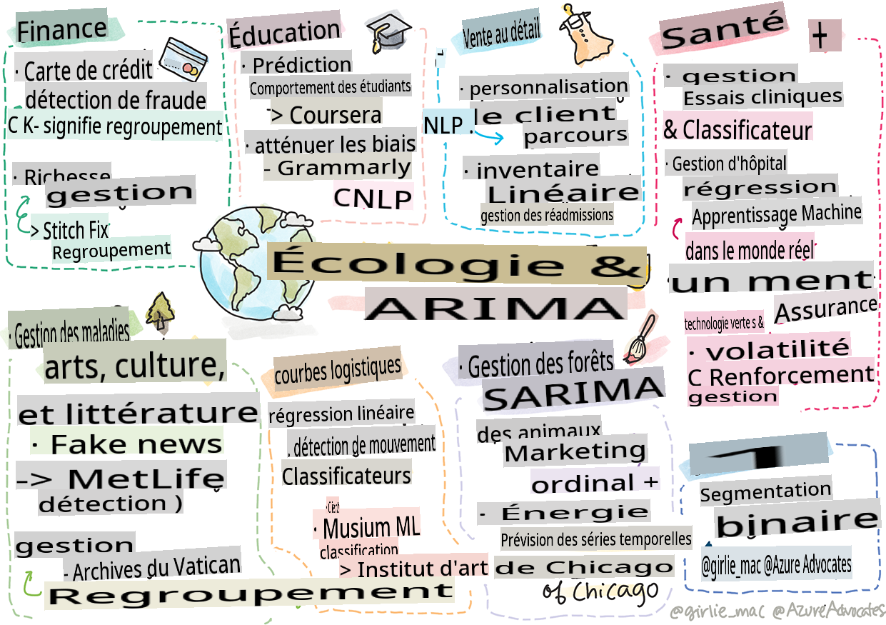

<!--
CO_OP_TRANSLATOR_METADATA:
{
  "original_hash": "20f18ff565638be615df4174858e4a7f",
  "translation_date": "2025-09-03T23:15:10+00:00",
  "source_file": "9-Real-World/1-Applications/README.md",
  "language_code": "fr"
}
-->
# Postscript : L'apprentissage automatique dans le monde réel

> Sketchnote par [Tomomi Imura](https://www.twitter.com/girlie_mac)

Dans ce programme, vous avez appris de nombreuses façons de préparer des données pour l'entraînement et de créer des modèles d'apprentissage automatique. Vous avez construit une série de modèles classiques de régression, de regroupement, de classification, de traitement du langage naturel et de séries chronologiques. Félicitations ! Maintenant, vous vous demandez peut-être à quoi tout cela sert... quelles sont les applications réelles de ces modèles ?

Bien que l'industrie s'intéresse beaucoup à l'IA, qui utilise généralement l'apprentissage profond, les modèles classiques d'apprentissage automatique ont encore des applications précieuses. Vous utilisez peut-être déjà certaines de ces applications aujourd'hui ! Dans cette leçon, vous explorerez comment huit secteurs et domaines spécialisés différents utilisent ces types de modèles pour rendre leurs applications plus performantes, fiables, intelligentes et utiles aux utilisateurs.

## [Quiz avant la leçon](https://gray-sand-07a10f403.1.azurestaticapps.net/quiz/49/)

## 💰 Finance

Le secteur financier offre de nombreuses opportunités pour l'apprentissage automatique. De nombreux problèmes dans ce domaine peuvent être modélisés et résolus grâce à l'IA.

### Détection de fraude par carte de crédit

Nous avons étudié le [regroupement k-means](../../5-Clustering/2-K-Means/README.md) plus tôt dans le cours, mais comment peut-il être utilisé pour résoudre des problèmes liés à la fraude par carte de crédit ?

Le regroupement k-means est utile dans une technique de détection de fraude appelée **détection des anomalies**. Les anomalies, ou écarts dans les observations d'un ensemble de données, peuvent nous indiquer si une carte de crédit est utilisée normalement ou si quelque chose d'inhabituel se produit. Comme indiqué dans l'article ci-dessous, vous pouvez trier les données de carte de crédit en utilisant un algorithme de regroupement k-means et attribuer chaque transaction à un groupe en fonction de son degré d'anomalie. Ensuite, vous pouvez évaluer les groupes les plus risqués pour déterminer s'il s'agit de transactions frauduleuses ou légitimes.
[Référence](https://citeseerx.ist.psu.edu/viewdoc/download?doi=10.1.1.680.1195&rep=rep1&type=pdf)

### Gestion de patrimoine

En gestion de patrimoine, un individu ou une entreprise gère des investissements au nom de ses clients. Leur objectif est de maintenir et de faire croître la richesse à long terme, il est donc essentiel de choisir des investissements performants.

Une façon d'évaluer la performance d'un investissement est d'utiliser la régression statistique. La [régression linéaire](../../2-Regression/1-Tools/README.md) est un outil précieux pour comprendre comment un fonds se comporte par rapport à un indice de référence. Nous pouvons également déterminer si les résultats de la régression sont statistiquement significatifs, ou dans quelle mesure ils affecteraient les investissements d'un client. Vous pourriez même approfondir votre analyse en utilisant une régression multiple, où des facteurs de risque supplémentaires peuvent être pris en compte. Pour un exemple de fonctionnement de cette méthode pour un fonds spécifique, consultez l'article ci-dessous sur l'évaluation des performances des fonds à l'aide de la régression.
[Référence](http://www.brightwoodventures.com/evaluating-fund-performance-using-regression/)

## 🎓 Éducation

Le secteur éducatif est également un domaine très intéressant où l'IA peut être appliquée. Il existe des problèmes fascinants à résoudre, comme détecter la triche lors des examens ou des essais, ou gérer les biais, intentionnels ou non, dans le processus de correction.

### Prédiction du comportement des étudiants

[Coursera](https://coursera.com), un fournisseur de cours en ligne ouverts, possède un excellent blog technique où ils discutent de nombreuses décisions d'ingénierie. Dans cette étude de cas, ils ont tracé une ligne de régression pour explorer une éventuelle corrélation entre une faible note NPS (Net Promoter Score) et la rétention ou l'abandon des cours.
[Référence](https://medium.com/coursera-engineering/controlled-regression-quantifying-the-impact-of-course-quality-on-learner-retention-31f956bd592a)

### Réduction des biais

[Grammarly](https://grammarly.com), un assistant d'écriture qui vérifie les fautes d'orthographe et de grammaire, utilise des systèmes sophistiqués de [traitement du langage naturel](../../6-NLP/README.md) dans ses produits. Ils ont publié une étude de cas intéressante sur leur blog technique concernant la manière dont ils ont traité les biais de genre dans l'apprentissage automatique, que vous avez étudiés dans notre [leçon introductive sur l'équité](../../1-Introduction/3-fairness/README.md).
[Référence](https://www.grammarly.com/blog/engineering/mitigating-gender-bias-in-autocorrect/)

## 👜 Commerce de détail

Le secteur du commerce de détail peut certainement tirer parti de l'IA, que ce soit pour améliorer le parcours client ou pour gérer les stocks de manière optimale.

### Personnalisation du parcours client

Chez Wayfair, une entreprise qui vend des articles pour la maison comme des meubles, aider les clients à trouver les produits adaptés à leurs goûts et besoins est primordial. Dans cet article, les ingénieurs de l'entreprise décrivent comment ils utilisent l'IA et le NLP pour "proposer les bons résultats aux clients". Leur moteur d'intention de requête utilise notamment l'extraction d'entités, l'entraînement de classificateurs, l'extraction d'opinions et de sentiments sur les avis clients. C'est un cas classique d'utilisation du NLP dans le commerce en ligne.
[Référence](https://www.aboutwayfair.com/tech-innovation/how-we-use-machine-learning-and-natural-language-processing-to-empower-search)

### Gestion des stocks

Des entreprises innovantes et agiles comme [StitchFix](https://stitchfix.com), un service de box qui expédie des vêtements aux consommateurs, s'appuient fortement sur l'IA pour les recommandations et la gestion des stocks. Leurs équipes de stylisme collaborent avec leurs équipes de merchandising : "un de nos data scientists a expérimenté un algorithme génétique et l'a appliqué à l'habillement pour prédire ce qui pourrait être un vêtement réussi qui n'existe pas encore aujourd'hui. Nous avons présenté cela à l'équipe de merchandising, et maintenant ils peuvent l'utiliser comme outil."
[Référence](https://www.zdnet.com/article/how-stitch-fix-uses-machine-learning-to-master-the-science-of-styling/)

## 🏥 Santé

Le secteur de la santé peut tirer parti de l'IA pour optimiser les tâches de recherche ainsi que les problèmes logistiques comme la réadmission des patients ou la prévention de la propagation des maladies.

### Gestion des essais cliniques

La toxicité dans les essais cliniques est une préoccupation majeure pour les fabricants de médicaments. Quelle quantité de toxicité est tolérable ? Dans cette étude, l'analyse de diverses méthodes d'essais cliniques a conduit au développement d'une nouvelle approche pour prédire les résultats des essais cliniques. En particulier, ils ont utilisé la forêt aléatoire pour produire un [classificateur](../../4-Classification/README.md) capable de distinguer entre différents groupes de médicaments.
[Référence](https://www.sciencedirect.com/science/article/pii/S2451945616302914)

### Gestion des réadmissions hospitalières

Les soins hospitaliers sont coûteux, surtout lorsque les patients doivent être réadmis. Cet article discute d'une entreprise qui utilise l'IA pour prédire le potentiel de réadmission en utilisant des algorithmes de [regroupement](../../5-Clustering/README.md). Ces groupes aident les analystes à "découvrir des groupes de réadmissions qui peuvent partager une cause commune".
[Référence](https://healthmanagement.org/c/healthmanagement/issuearticle/hospital-readmissions-and-machine-learning)

### Gestion des maladies

La récente pandémie a mis en lumière les façons dont l'IA peut aider à stopper la propagation des maladies. Dans cet article, vous reconnaîtrez l'utilisation d'ARIMA, de courbes logistiques, de régression linéaire et de SARIMA. "Ce travail est une tentative de calculer le taux de propagation de ce virus et ainsi de prédire les décès, les guérisons et les cas confirmés, afin de mieux nous préparer et survivre."
[Référence](https://www.ncbi.nlm.nih.gov/pmc/articles/PMC7979218/)

## 🌲 Écologie et technologies vertes

La nature et l'écologie comprennent de nombreux systèmes sensibles où l'interaction entre les animaux et la nature est au centre des préoccupations. Il est important de pouvoir mesurer ces systèmes avec précision et d'agir de manière appropriée en cas de problème, comme un incendie de forêt ou une baisse de la population animale.

### Gestion des forêts

Vous avez appris le [Renforcement de l'apprentissage](../../8-Reinforcement/README.md) dans les leçons précédentes. Il peut être très utile pour prédire des schémas dans la nature. En particulier, il peut être utilisé pour suivre des problèmes écologiques comme les incendies de forêt et la propagation d'espèces invasives. Au Canada, un groupe de chercheurs a utilisé le Renforcement de l'apprentissage pour construire des modèles dynamiques d'incendies de forêt à partir d'images satellites. En utilisant un processus innovant de "propagation spatiale (SSP)", ils ont imaginé un incendie de forêt comme "l'agent à n'importe quelle cellule du paysage." "Les actions que le feu peut entreprendre à partir d'un emplacement à tout moment incluent la propagation vers le nord, le sud, l'est ou l'ouest, ou ne pas se propager."

Cette approche inverse la configuration habituelle du RL puisque la dynamique du processus de décision de Markov (MDP) correspondant est une fonction connue pour la propagation immédiate des incendies. Lisez-en davantage sur les algorithmes classiques utilisés par ce groupe dans le lien ci-dessous.
[Référence](https://www.frontiersin.org/articles/10.3389/fict.2018.00006/full)

### Détection des mouvements des animaux

Bien que l'apprentissage profond ait révolutionné le suivi visuel des mouvements des animaux (vous pouvez créer votre propre [traqueur d'ours polaire](https://docs.microsoft.com/learn/modules/build-ml-model-with-azure-stream-analytics/?WT.mc_id=academic-77952-leestott) ici), les techniques classiques d'IA ont encore leur place dans cette tâche.

Les capteurs pour suivre les mouvements des animaux de ferme et l'IoT utilisent ce type de traitement visuel, mais des techniques d'IA plus basiques sont utiles pour prétraiter les données. Par exemple, dans cet article, les postures des moutons ont été surveillées et analysées à l'aide de divers algorithmes de classification. Vous pourriez reconnaître la courbe ROC à la page 335.
[Référence](https://druckhaus-hofmann.de/gallery/31-wj-feb-2020.pdf)

### ⚡️ Gestion de l'énergie

Dans nos leçons sur la [prévision des séries chronologiques](../../7-TimeSeries/README.md), nous avons évoqué le concept de parcmètres intelligents pour générer des revenus pour une ville en comprenant l'offre et la demande. Cet article discute en détail de la manière dont le regroupement, la régression et la prévision des séries chronologiques se combinent pour aider à prédire l'utilisation future de l'énergie en Irlande, sur la base des compteurs intelligents.
[Référence](https://www-cdn.knime.com/sites/default/files/inline-images/knime_bigdata_energy_timeseries_whitepaper.pdf)

## 💼 Assurance

Le secteur de l'assurance est un autre secteur qui utilise l'IA pour construire et optimiser des modèles financiers et actuariels viables.

### Gestion de la volatilité

MetLife, un fournisseur d'assurance-vie, est transparent sur la manière dont ils analysent et atténuent la volatilité dans leurs modèles financiers. Dans cet article, vous remarquerez des visualisations de classification binaire et ordinale. Vous découvrirez également des visualisations de prévision.
[Référence](https://investments.metlife.com/content/dam/metlifecom/us/investments/insights/research-topics/macro-strategy/pdf/MetLifeInvestmentManagement_MachineLearnedRanking_070920.pdf)

## 🎨 Arts, culture et littérature

Dans les arts, par exemple dans le journalisme, il existe de nombreux problèmes intéressants. Détecter les fausses informations est un problème majeur, car il a été prouvé qu'elles influencent l'opinion des gens et même qu'elles renversent des démocraties. Les musées peuvent également bénéficier de l'utilisation de l'IA, que ce soit pour trouver des liens entre les artefacts ou pour planifier leurs ressources.

### Détection des fausses informations

Détecter les fausses informations est devenu un jeu du chat et de la souris dans les médias d'aujourd'hui. Dans cet article, les chercheurs suggèrent qu'un système combinant plusieurs des techniques d'IA que nous avons étudiées peut être testé et le meilleur modèle déployé : "Ce système est basé sur le traitement du langage naturel pour extraire des caractéristiques des données, puis ces caractéristiques sont utilisées pour l'entraînement des classificateurs d'apprentissage automatique tels que Naive Bayes, Support Vector Machine (SVM), Random Forest (RF), Stochastic Gradient Descent (SGD) et Logistic Regression (LR)."
[Référence](https://www.irjet.net/archives/V7/i6/IRJET-V7I6688.pdf)

Cet article montre comment la combinaison de différents domaines de l'IA peut produire des résultats intéressants qui peuvent aider à stopper la propagation des fausses informations et à éviter des dommages réels ; dans ce cas, l'impulsion était la propagation de rumeurs sur les traitements COVID qui ont incité à la violence de masse.

### IA dans les musées

Les musées sont à l'aube d'une révolution de l'IA où la catalogation et la numérisation des collections ainsi que la recherche de liens entre les artefacts deviennent plus faciles grâce aux avancées technologiques. Des projets comme [In Codice Ratio](https://www.sciencedirect.com/science/article/abs/pii/S0306457321001035#:~:text=1.,studies%20over%20large%20historical%20sources.) aident à percer les mystères des collections inaccessibles comme les Archives du Vatican. Mais l'aspect commercial des musées bénéficie également des modèles d'IA.

Par exemple, l'Art Institute of Chicago a construit des modèles pour prédire ce qui intéresse les visiteurs et quand ils assisteront aux expositions. L'objectif est de créer des expériences de visite individualisées et optimisées à chaque visite. "Au cours de l'exercice 2017, le modèle a prédit la fréquentation et les admissions avec une précision de 1 %, déclare Andrew Simnick, vice-président senior à l'Art Institute."
[Référence](https://www.chicagobusiness.com/article/20180518/ISSUE01/180519840/art-institute-of-chicago-uses-data-to-make-exhibit-choices)

## 🏷 Marketing

### Segmentation des clients

Les stratégies marketing les plus efficaces ciblent les clients de différentes manières en fonction de divers regroupements. Dans cet article, les utilisations des algorithmes de regroupement sont discutées pour soutenir le marketing différencié. Le marketing différencié aide les entreprises à améliorer la reconnaissance de leur marque, à atteindre davantage de clients et à générer plus de revenus.
[Référence](https://ai.inqline.com/machine-learning-for-marketing-customer-segmentation/)

## 🚀 Défi
Identifiez un autre secteur qui bénéficie de certaines des techniques que vous avez apprises dans ce programme, et découvrez comment il utilise l'apprentissage automatique.

## [Quiz après le cours](https://gray-sand-07a10f403.1.azurestaticapps.net/quiz/50/)

## Révision et étude personnelle

L'équipe de science des données de Wayfair propose plusieurs vidéos intéressantes sur la manière dont ils utilisent l'apprentissage automatique dans leur entreprise. Cela vaut la peine de [jeter un œil](https://www.youtube.com/channel/UCe2PjkQXqOuwkW1gw6Ameuw/videos) !

## Devoir

[Une chasse au trésor sur l'apprentissage automatique](assignment.md)

---

**Avertissement** :  
Ce document a été traduit à l'aide du service de traduction automatique [Co-op Translator](https://github.com/Azure/co-op-translator). Bien que nous nous efforcions d'assurer l'exactitude, veuillez noter que les traductions automatisées peuvent contenir des erreurs ou des inexactitudes. Le document original dans sa langue d'origine doit être considéré comme la source faisant autorité. Pour des informations critiques, il est recommandé de recourir à une traduction professionnelle réalisée par un humain. Nous déclinons toute responsabilité en cas de malentendus ou d'interprétations erronées résultant de l'utilisation de cette traduction.