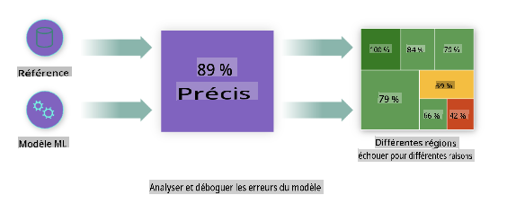
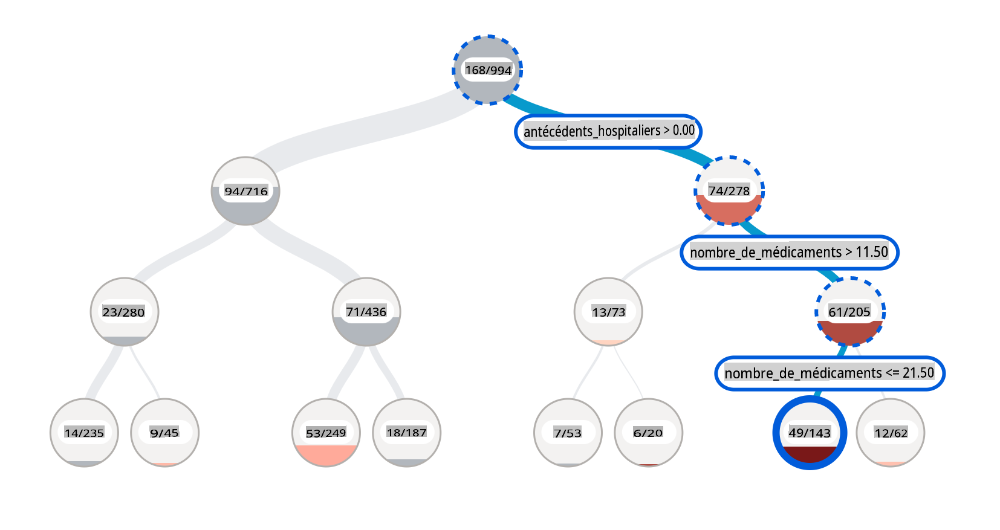
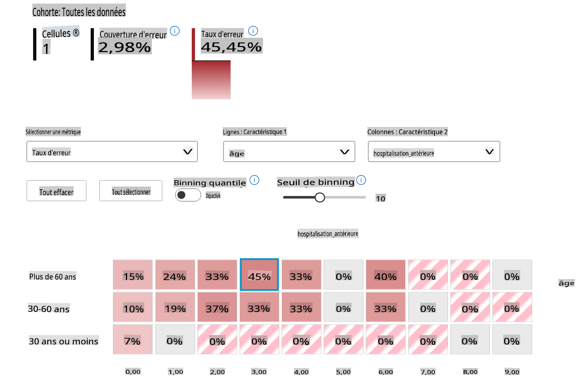
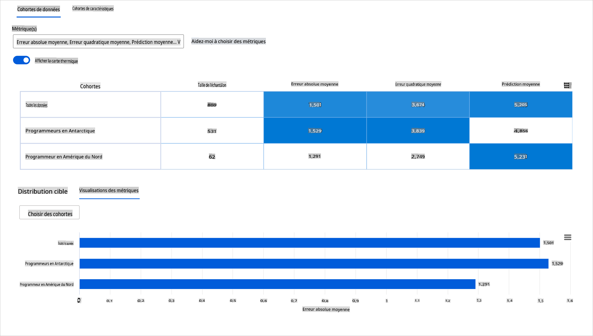
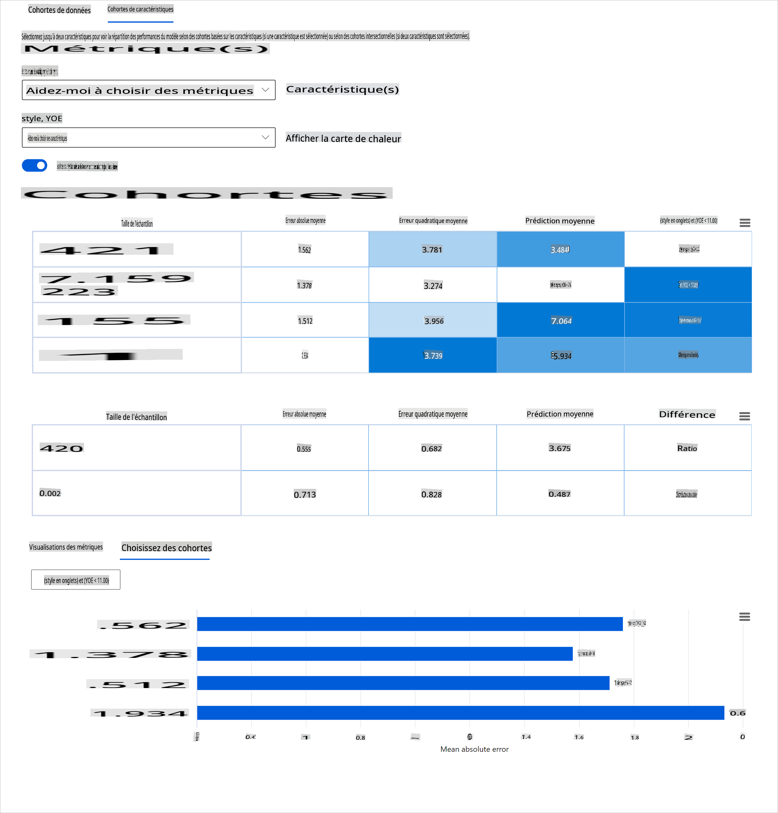
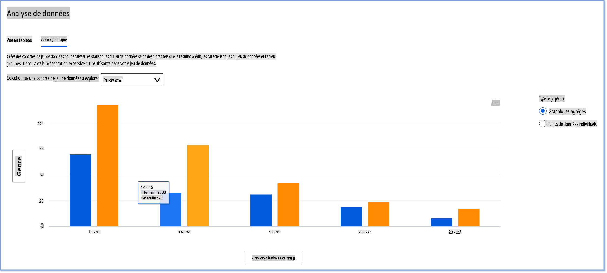
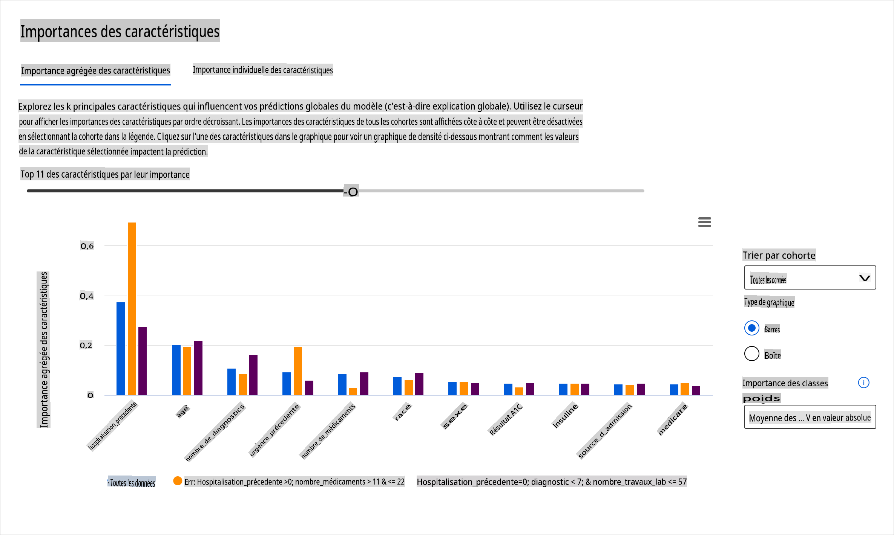
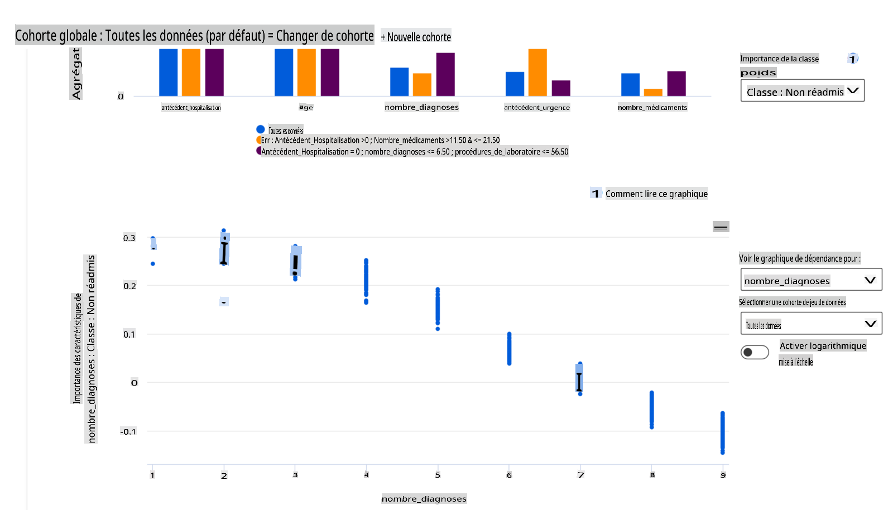

# Postscript : Débogage de modèle en apprentissage automatique à l'aide des composants du tableau de bord AI responsable

## [Quiz pré-conférence](https://gray-sand-07a10f403.1.azurestaticapps.net/quiz/5/)

## Introduction

L'apprentissage automatique impacte notre vie quotidienne. L'IA trouve sa place dans certains des systèmes les plus importants qui nous affectent en tant qu'individus ainsi que notre société, que ce soit dans la santé, la finance, l'éducation ou l'emploi. Par exemple, des systèmes et des modèles sont impliqués dans des tâches de prise de décision quotidiennes, comme les diagnostics médicaux ou la détection de fraudes. Par conséquent, les avancées en IA, accompagnées d'une adoption accélérée, sont confrontées à des attentes sociétales en évolution et à une réglementation croissante en réponse. Nous voyons constamment des domaines où les systèmes d'IA continuent de ne pas répondre aux attentes ; ils exposent de nouveaux défis ; et les gouvernements commencent à réglementer les solutions IA. Il est donc essentiel que ces modèles soient analysés afin de fournir des résultats équitables, fiables, inclusifs, transparents et responsables pour tous.

Dans ce programme, nous examinerons des outils pratiques qui peuvent être utilisés pour évaluer si un modèle présente des problèmes d'IA responsable. Les techniques de débogage traditionnelles en apprentissage automatique tendent à se baser sur des calculs quantitatifs tels que la précision agrégée ou la perte d'erreur moyenne. Imaginez ce qui peut se passer lorsque les données que vous utilisez pour construire ces modèles manquent de certaines données démographiques, telles que la race, le sexe, l'opinion politique, la religion, ou représentent de manière disproportionnée de telles démographies. Que se passe-t-il lorsque la sortie du modèle est interprétée pour favoriser certaines démographies ? Cela peut introduire une sur ou sous-représentation de ces groupes de caractéristiques sensibles, entraînant des problèmes d'équité, d'inclusivité ou de fiabilité du modèle. Un autre facteur est que les modèles d'apprentissage automatique sont considérés comme des boîtes noires, ce qui rend difficile la compréhension et l'explication des éléments qui influencent la prédiction d'un modèle. Tous ces défis se posent aux scientifiques des données et aux développeurs d'IA lorsqu'ils ne disposent pas d'outils adéquats pour déboguer et évaluer l'équité ou la fiabilité d'un modèle.

Dans cette leçon, vous apprendrez à déboguer vos modèles en utilisant :

- **Analyse des erreurs** : identifier où dans votre distribution de données le modèle présente des taux d'erreur élevés.
- **Vue d'ensemble du modèle** : effectuer une analyse comparative à travers différents cohortes de données pour découvrir des disparités dans les métriques de performance de votre modèle.
- **Analyse des données** : examiner où il pourrait y avoir une sur ou sous-représentation de vos données qui peut fausser votre modèle pour favoriser une démographie de données par rapport à une autre.
- **Importance des caractéristiques** : comprendre quelles caractéristiques influencent les prédictions de votre modèle à un niveau global ou local.

## Prérequis

Comme prérequis, veuillez consulter la revue [Outils d'IA responsable pour les développeurs](https://www.microsoft.com/ai/ai-lab-responsible-ai-dashboard)

> 

## Analyse des erreurs

Les métriques traditionnelles de performance des modèles utilisées pour mesurer la précision sont principalement des calculs basés sur des prédictions correctes contre incorrectes. Par exemple, déterminer qu'un modèle est précis à 89 % du temps avec une perte d'erreur de 0,001 peut être considéré comme une bonne performance. Les erreurs ne sont souvent pas réparties uniformément dans votre ensemble de données sous-jacent. Vous pouvez obtenir un score de précision du modèle de 89 % mais découvrir qu'il existe différentes régions de vos données pour lesquelles le modèle échoue 42 % du temps. Les conséquences de ces schémas d'échec avec certains groupes de données peuvent entraîner des problèmes d'équité ou de fiabilité. Il est essentiel de comprendre les domaines où le modèle fonctionne bien ou non. Les régions de données où il y a un grand nombre d'inexactitudes dans votre modèle peuvent se révéler être une démographie de données importante.

Le composant d'Analyse des erreurs sur le tableau de bord RAI illustre comment les échecs du modèle sont répartis à travers divers cohortes avec une visualisation en arbre. Cela est utile pour identifier les caractéristiques ou les zones où le taux d'erreur est élevé avec votre ensemble de données. En voyant d'où proviennent la plupart des inexactitudes du modèle, vous pouvez commencer à enquêter sur la cause profonde. Vous pouvez également créer des cohortes de données pour effectuer des analyses. Ces cohortes de données aident dans le processus de débogage à déterminer pourquoi la performance du modèle est bonne dans une cohorte, mais erronée dans une autre.

Les indicateurs visuels sur la carte des arbres aident à localiser les zones problématiques plus rapidement. Par exemple, plus la couleur rouge d'un nœud d'arbre est sombre, plus le taux d'erreur est élevé.

La carte thermique est une autre fonctionnalité de visualisation que les utilisateurs peuvent utiliser pour enquêter sur le taux d'erreur en utilisant une ou deux caractéristiques afin de trouver un contributeur aux erreurs du modèle à travers l'ensemble de données ou les cohortes.

Utilisez l'analyse des erreurs lorsque vous avez besoin de :

* Acquérir une compréhension approfondie de la façon dont les échecs du modèle sont répartis à travers un ensemble de données et à travers plusieurs dimensions d'entrée et de caractéristiques.
* Décomposer les métriques de performance agrégées pour découvrir automatiquement des cohortes erronées afin d'informer vos étapes de mitigation ciblées.

## Vue d'ensemble du modèle

Évaluer la performance d'un modèle d'apprentissage automatique nécessite d'obtenir une compréhension holistique de son comportement. Cela peut être réalisé en examinant plus d'une métrique telle que le taux d'erreur, la précision, le rappel, la précision ou l'Erreur Absolue Moyenne (EAM) pour trouver des disparités parmi les métriques de performance. Une métrique de performance peut sembler excellente, mais des inexactitudes peuvent être révélées dans une autre métrique. De plus, comparer les métriques pour des disparités à travers l'ensemble de données ou les cohortes aide à éclairer où le modèle fonctionne bien ou non. Cela est particulièrement important pour observer la performance du modèle parmi des caractéristiques sensibles par rapport à des caractéristiques non sensibles (par exemple, la race des patients, le sexe ou l'âge) pour découvrir les potentielles injustices que le modèle peut avoir. Par exemple, découvrir que le modèle est plus erroné dans une cohorte qui a des caractéristiques sensibles peut révéler des injustices potentielles que le modèle peut avoir.

Le composant Vue d'ensemble du modèle du tableau de bord RAI aide non seulement à analyser les métriques de performance de la représentation des données dans une cohorte, mais il donne aux utilisateurs la possibilité de comparer le comportement du modèle à travers différentes cohortes.

La fonctionnalité d'analyse basée sur les caractéristiques du composant permet aux utilisateurs de réduire les sous-groupes de données au sein d'une caractéristique particulière pour identifier des anomalies à un niveau granulaire. Par exemple, le tableau de bord dispose d'une intelligence intégrée pour générer automatiquement des cohortes pour une caractéristique sélectionnée par l'utilisateur (par exemple, *"time_in_hospital < 3"* ou *"time_in_hospital >= 7"*). Cela permet à un utilisateur d'isoler une caractéristique particulière d'un groupe de données plus large pour voir si elle est un facteur clé des résultats erronés du modèle.

Le composant Vue d'ensemble du modèle prend en charge deux classes de métriques de disparité :

**Disparité dans la performance du modèle** : Ces ensembles de métriques calculent la disparité (différence) dans les valeurs de la métrique de performance sélectionnée à travers les sous-groupes de données. Voici quelques exemples :

* Disparité dans le taux de précision
* Disparité dans le taux d'erreur
* Disparité dans la précision
* Disparité dans le rappel
* Disparité dans l'erreur absolue moyenne (EAM)

**Disparité dans le taux de sélection** : Cette métrique contient la différence dans le taux de sélection (prédiction favorable) parmi les sous-groupes. Un exemple de cela est la disparité dans les taux d'approbation de prêts. Le taux de sélection signifie la fraction de points de données dans chaque classe classés comme 1 (en classification binaire) ou distribution des valeurs de prédiction (en régression).

## Analyse des données

> "Si vous torturez les données assez longtemps, elles avoueront n'importe quoi" - Ronald Coase

Cette déclaration semble extrême, mais il est vrai que les données peuvent être manipulées pour soutenir n'importe quelle conclusion. Une telle manipulation peut parfois se produire involontairement. En tant qu'êtres humains, nous avons tous des biais, et il est souvent difficile de savoir consciemment quand vous introduisez un biais dans les données. Garantir l'équité en IA et en apprentissage automatique reste un défi complexe.

Les données sont un énorme point aveugle pour les métriques de performance traditionnelles des modèles. Vous pouvez avoir des scores de précision élevés, mais cela ne reflète pas toujours le biais sous-jacent des données qui pourrait exister dans votre ensemble de données. Par exemple, si un ensemble de données d'employés a 27 % de femmes occupant des postes de direction dans une entreprise et 73 % d'hommes au même niveau, un modèle d'IA pour la publicité d'emploi formé sur ces données pourrait cibler principalement un public masculin pour les postes de niveau supérieur. Avoir ce déséquilibre dans les données a faussé la prédiction du modèle en faveur d'un sexe. Cela révèle un problème d'équité où il y a un biais de genre dans le modèle d'IA.

Le composant Analyse des données sur le tableau de bord RAI aide à identifier les zones où il y a une sur- et sous-représentation dans l'ensemble de données. Il aide les utilisateurs à diagnostiquer la cause profonde des erreurs et des problèmes d'équité introduits par des déséquilibres de données ou un manque de représentation d'un groupe de données particulier. Cela donne aux utilisateurs la possibilité de visualiser les ensembles de données en fonction des résultats prévus et réels, des groupes d'erreurs et des caractéristiques spécifiques. Parfois, découvrir un groupe de données sous-représenté peut également révéler que le modèle n'apprend pas bien, d'où les nombreuses inexactitudes. Avoir un modèle présentant un biais de données n'est pas seulement un problème d'équité, mais montre que le modèle n'est ni inclusif ni fiable.

Utilisez l'analyse des données lorsque vous avez besoin de :

* Explorer les statistiques de votre ensemble de données en sélectionnant différents filtres pour découper vos données en différentes dimensions (également appelées cohortes).
* Comprendre la distribution de votre ensemble de données à travers différentes cohortes et groupes de caractéristiques.
* Déterminer si vos résultats relatifs à l'équité, à l'analyse des erreurs et à la causalité (dérivés d'autres composants du tableau de bord) sont le résultat de la distribution de votre ensemble de données.
* Décider dans quels domaines collecter plus de données pour atténuer les erreurs résultant de problèmes de représentation, de bruit d'étiquetage, de bruit de caractéristiques, de biais d'étiquetage et de facteurs similaires.

## Interprétabilité du modèle

Les modèles d'apprentissage automatique tendent à être des boîtes noires. Comprendre quelles caractéristiques de données clés influencent la prédiction d'un modèle peut être un défi. Il est important de fournir de la transparence sur les raisons pour lesquelles un modèle fait une certaine prédiction. Par exemple, si un système d'IA prédit qu'un patient diabétique risque d'être réadmis à l'hôpital dans moins de 30 jours, il devrait être en mesure de fournir des données à l'appui qui ont conduit à sa prédiction. Avoir des indicateurs de données à l'appui apporte de la transparence pour aider les cliniciens ou les hôpitaux à prendre des décisions éclairées. De plus, être capable d'expliquer pourquoi un modèle a fait une prédiction pour un patient individuel permet d'assurer la responsabilité vis-à-vis des réglementations sanitaires. Lorsque vous utilisez des modèles d'apprentissage automatique de manière à affecter la vie des gens, il est crucial de comprendre et d'expliquer ce qui influence le comportement d'un modèle. L'explicabilité et l'interprétabilité du modèle aident à répondre à des questions dans des scénarios tels que :

* Débogage de modèle : Pourquoi mon modèle a-t-il fait cette erreur ? Comment puis-je améliorer mon modèle ?
* Collaboration homme-IA : Comment puis-je comprendre et faire confiance aux décisions du modèle ?
* Conformité réglementaire : Mon modèle respecte-t-il les exigences légales ?

Le composant Importance des caractéristiques du tableau de bord RAI vous aide à déboguer et à obtenir une compréhension complète de la façon dont un modèle fait des prédictions. C'est également un outil utile pour les professionnels de l'apprentissage automatique et les décideurs pour expliquer et montrer des preuves des caractéristiques influençant le comportement d'un modèle pour la conformité réglementaire. Ensuite, les utilisateurs peuvent explorer à la fois des explications globales et locales pour valider quelles caractéristiques influencent la prédiction d'un modèle. Les explications globales énumèrent les principales caractéristiques qui ont affecté la prédiction globale d'un modèle. Les explications locales affichent quelles caractéristiques ont conduit à la prédiction d'un modèle pour un cas individuel. La capacité à évaluer des explications locales est également utile dans le débogage ou l'audit d'un cas spécifique pour mieux comprendre et interpréter pourquoi un modèle a fait une prédiction précise ou inexacte.

* Explications globales : Par exemple, quelles caractéristiques affectent le comportement global d'un modèle de réadmission à l'hôpital pour diabétiques ?
* Explications locales : Par exemple, pourquoi un patient diabétique de plus de 60 ans avec des hospitalisations antérieures a-t-il été prédit comme étant réadmis ou non réadmis dans les 30 jours suivant son retour à l'hôpital ?

Dans le processus de débogage de l'examen de la performance d'un modèle à travers différentes cohortes, l'Importance des caractéristiques montre quel niveau d'impact une caractéristique a à travers les cohortes. Elle aide à révéler des anomalies lors de la comparaison du niveau d'influence que la caractéristique a sur les prédictions erronées d'un modèle. Le composant Importance des caractéristiques peut montrer quelles valeurs dans une caractéristique ont influencé positivement ou négativement le résultat du modèle. Par exemple, si un modèle a fait une prédiction inexacte, le composant vous donne la possibilité d'approfondir et de déterminer quelles caractéristiques ou valeurs de caractéristiques ont conduit à la prédiction. Ce niveau de détail aide non seulement au débogage, mais fournit également transparence et responsabilité dans les situations d'audit. Enfin, le composant peut vous aider à identifier des problèmes d'équité. Pour illustrer, si une caractéristique sensible telle que l'ethnicité ou le sexe est fortement influente dans la prédiction d'un modèle, cela pourrait être un signe de biais racial ou de genre dans le modèle.

Utilisez l'interprétabilité lorsque vous avez besoin de :

* Déterminer à quel point les prédictions de votre système d'IA sont fiables en comprenant quelles caractéristiques sont les plus importantes pour les prédictions.
* Aborder le débogage de votre modèle en le comprenant d'abord et en identifiant si le modèle utilise des caractéristiques saines ou simplement de fausses corrélations.
* Découvrir des sources potentielles d'injustice en comprenant si le modèle base ses prédictions sur des caractéristiques sensibles ou sur des caractéristiques qui leur sont fortement corrélées.
* Renforcer la confiance des utilisateurs dans les décisions de votre modèle en générant des explications locales pour illustrer leurs résultats.
* Compléter un audit réglementaire d'un système d'IA pour valider les modèles et surveiller l'impact des décisions du modèle sur les humains.

## Conclusion

Tous les composants du tableau de bord RAI sont des outils pratiques pour vous aider à construire des modèles d'apprentissage automatique qui sont moins nuisibles et plus fiables pour la société. Cela améliore la prévention des menaces aux droits de l'homme ; la discrimination ou l'exclusion de certains groupes des opportunités de vie ; et le risque de blessures physiques ou psychologiques. Cela aide également à établir la confiance dans les décisions de votre modèle en générant des explications locales pour illustrer leurs résultats. Certains des dommages potentiels peuvent être classés comme :

- **Allocation**, si un sexe ou une ethnie, par exemple, est favorisé par rapport à un autre.
- **Qualité du service**. Si vous formez les données pour un scénario spécifique mais que la réalité est beaucoup plus complexe, cela entraîne un service de mauvaise performance.
- **Stéréotypage**. Associer un groupe donné à des attributs préassignés.
- **Dénigrement**. Critiquer et étiqueter injustement quelque chose ou quelqu'un.
- **Sur- ou sous-représentation**. L'idée est qu'un certain groupe n'est pas vu dans une certaine profession, et tout service ou fonction qui continue de promouvoir cela contribue à nuire.

### Tableau de bord Azure RAI

Le [tableau de bord Azure RAI](https://learn.microsoft.com/en-us/azure/machine-learning/concept-responsible-ai-dashboard?WT.mc_id=aiml-90525-ruyakubu) est construit sur des outils open-source développés par des institutions académiques et organisations de premier plan, y compris Microsoft, qui sont essentiels pour les scientifiques des données et les développeurs d'IA afin de mieux comprendre le comportement des modèles, découvrir et atténuer les problèmes indésirables des modèles d'IA.

- Apprenez à utiliser les différents composants en consultant la [documentation du tableau de bord RAI.](https://learn.microsoft.com/en-us/azure/machine-learning/how-to-responsible-ai-dashboard?WT.mc_id=aiml-90525-ruyakubu)

- Découvrez quelques [carnets d'exemples](https://

**Avertissement** :  
Ce document a été traduit à l'aide de services de traduction automatique basés sur l'IA. Bien que nous nous efforçons d'assurer l'exactitude, veuillez noter que les traductions automatisées peuvent contenir des erreurs ou des inexactitudes. Le document original dans sa langue native doit être considéré comme la source faisant autorité. Pour des informations critiques, une traduction humaine professionnelle est recommandée. Nous ne sommes pas responsables des malentendus ou des erreurs d'interprétation résultant de l'utilisation de cette traduction.