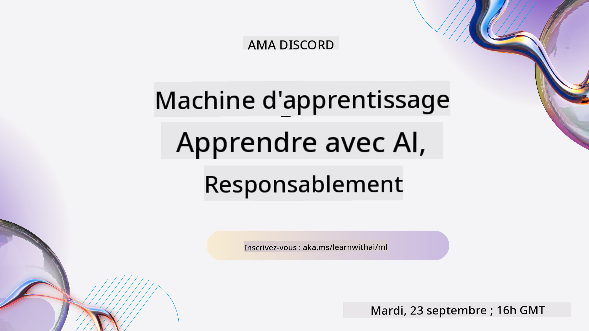
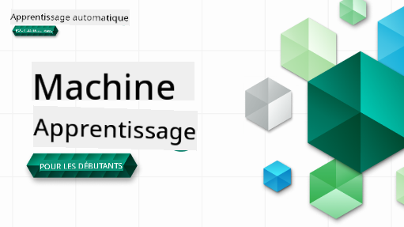

<!--
CO_OP_TRANSLATOR_METADATA:
{
  "original_hash": "735a01983e2c4c2b2698d0cee2c19d7a",
  "translation_date": "2025-10-11T10:21:16+00:00",
  "source_file": "README.md",
  "language_code": "fr"
}
-->
  
  
  
  
  

  
  
  

### 🌐 Support multilingue

#### Pris en charge via GitHub Action (Automatisé et toujours à jour)

<!-- CO-OP TRANSLATOR LANGUAGES TABLE START -->
[Arabe](../ar/README.md) | [Bengali](../bn/README.md) | [Bulgare](../bg/README.md) | [Birman (Myanmar)](../my/README.md) | [Chinois (Simplifié)](../zh/README.md) | [Chinois (Traditionnel, Hong Kong)](../hk/README.md) | [Chinois (Traditionnel, Macao)](../mo/README.md) | [Chinois (Traditionnel, Taïwan)](../tw/README.md) | [Croate](../hr/README.md) | [Tchèque](../cs/README.md) | [Danois](../da/README.md) | [Néerlandais](../nl/README.md) | [Estonien](../et/README.md) | [Finnois](../fi/README.md) | [Français](./README.md) | [Allemand](../de/README.md) | [Grec](../el/README.md) | [Hébreu](../he/README.md) | [Hindi](../hi/README.md) | [Hongrois](../hu/README.md) | [Indonésien](../id/README.md) | [Italien](../it/README.md) | [Japonais](../ja/README.md) | [Coréen](../ko/README.md) | [Lituanien](../lt/README.md) | [Malais](../ms/README.md) | [Marathi](../mr/README.md) | [Népalais](../ne/README.md) | [Norvégien](../no/README.md) | [Persan (Farsi)](../fa/README.md) | [Polonais](../pl/README.md) | [Portugais (Brésil)](../br/README.md) | [Portugais (Portugal)](../pt/README.md) | [Punjabi (Gurmukhi)](../pa/README.md) | [Roumain](../ro/README.md) | [Russe](../ru/README.md) | [Serbe (Cyrillique)](../sr/README.md) | [Slovaque](../sk/README.md) | [Slovène](../sl/README.md) | [Espagnol](../es/README.md) | [Swahili](../sw/README.md) | [Suédois](../sv/README.md) | [Tagalog (Filipino)](../tl/README.md) | [Tamoul](../ta/README.md) | [Thaï](../th/README.md) | [Turc](../tr/README.md) | [Ukrainien](../uk/README.md) | [Ourdou](../ur/README.md) | [Vietnamien](../vi/README.md)  
<!-- CO-OP TRANSLATOR LANGUAGES TABLE END -->

#### Rejoignez notre communauté

Nous organisons une série d'apprentissage avec l'IA sur Discord. Apprenez-en plus et rejoignez-nous à la [Série Apprendre avec l'IA](https://aka.ms/learnwithai/discord) du 18 au 30 septembre 2025. Vous découvrirez des astuces pour utiliser GitHub Copilot en science des données.

# Apprentissage automatique pour débutants - Un programme

> 🌍 Voyagez autour du monde en explorant l'apprentissage automatique à travers les cultures du monde 🌍

Les Cloud Advocates de Microsoft sont ravis de proposer un programme de 12 semaines et 26 leçons entièrement dédié à **l'apprentissage automatique**. Dans ce programme, vous apprendrez ce que l'on appelle parfois **l'apprentissage automatique classique**, en utilisant principalement la bibliothèque Scikit-learn et en évitant l'apprentissage profond, qui est couvert dans notre programme [IA pour débutants](https://aka.ms/ai4beginners). Associez ces leçons à notre programme ['Science des données pour débutants'](https://aka.ms/ds4beginners) également !

Voyagez avec nous à travers le monde en appliquant ces techniques classiques à des données provenant de nombreuses régions du globe. Chaque leçon comprend des quiz avant et après la leçon, des instructions écrites pour compléter la leçon, une solution, un devoir, et bien plus encore. Notre pédagogie basée sur les projets vous permet d'apprendre tout en construisant, une méthode éprouvée pour que les nouvelles compétences soient bien assimilées.

**✍️ Un grand merci à nos auteurs** Jen Looper, Stephen Howell, Francesca Lazzeri, Tomomi Imura, Cassie Breviu, Dmitry Soshnikov, Chris Noring, Anirban Mukherjee, Ornella Altunyan, Ruth Yakubu et Amy Boyd  

**🎨 Merci également à nos illustrateurs** Tomomi Imura, Dasani Madipalli et Jen Looper  

**🙏 Remerciements spéciaux 🙏 à nos auteurs, relecteurs et contributeurs de contenu Microsoft Student Ambassador**, notamment Rishit Dagli, Muhammad Sakib Khan Inan, Rohan Raj, Alexandru Petrescu, Abhishek Jaiswal, Nawrin Tabassum, Ioan Samuila et Snigdha Agarwal  

**🤩 Une gratitude supplémentaire envers les Microsoft Student Ambassadors Eric Wanjau, Jasleen Sondhi et Vidushi Gupta pour nos leçons en R !**

# Premiers pas

Suivez ces étapes :  
1. **Forkez le dépôt** : Cliquez sur le bouton "Fork" en haut à droite de cette page.  
2. **Clonez le dépôt** : `git clone https://github.com/microsoft/ML-For-Beginners.git`  

> [Retrouvez toutes les ressources supplémentaires pour ce cours dans notre collection Microsoft Learn](https://learn.microsoft.com/en-us/collections/qrqzamz1nn2wx3?WT.mc_id=academic-77952-bethanycheum)  

> 🔧 **Besoin d'aide ?** Consultez notre [Guide de dépannage](TROUBLESHOOTING.md) pour des solutions aux problèmes courants liés à l'installation, la configuration et l'exécution des leçons.

**[Étudiants](https://aka.ms/student-page)**, pour utiliser ce programme, forkez l'intégralité du dépôt sur votre propre compte GitHub et complétez les exercices seul ou en groupe :  

- Commencez par un quiz avant la leçon.  
- Lisez la leçon et complétez les activités, en vous arrêtant et en réfléchissant à chaque vérification des connaissances.  
- Essayez de créer les projets en comprenant les leçons plutôt qu'en exécutant le code de solution ; cependant, ce code est disponible dans les dossiers `/solution` de chaque leçon orientée projet.  
- Passez le quiz après la leçon.  
- Complétez le défi.  
- Complétez le devoir.  
- Après avoir terminé un groupe de leçons, visitez le [Forum de discussion](https://github.com/microsoft/ML-For-Beginners/discussions) et "apprenez à voix haute" en remplissant le PAT approprié. Un 'PAT' est un outil d'évaluation des progrès, une grille que vous remplissez pour approfondir votre apprentissage. Vous pouvez également réagir aux PAT des autres pour que nous apprenions ensemble.  

> Pour approfondir vos connaissances, nous vous recommandons de suivre ces modules et parcours d'apprentissage [Microsoft Learn](https://docs.microsoft.com/en-us/users/jenlooper-2911/collections/k7o7tg1gp306q4?WT.mc_id=academic-77952-leestott).

**Enseignants**, nous avons [inclus quelques suggestions](for-teachers.md) sur la manière d'utiliser ce programme.

---

## Vidéos explicatives

Certaines leçons sont disponibles sous forme de vidéos courtes. Vous pouvez les retrouver directement dans les leçons ou sur la [playlist ML pour débutants sur la chaîne YouTube Microsoft Developer](https://aka.ms/ml-beginners-videos) en cliquant sur l'image ci-dessous.

---

## Rencontrez l'équipe

**Gif par** [Mohit Jaisal](https://linkedin.com/in/mohitjaisal)

> 🎥 Cliquez sur l'image ci-dessus pour une vidéo sur le projet et les personnes qui l'ont créé !

---

## Pédagogie

Nous avons choisi deux principes pédagogiques en construisant ce programme : garantir qu'il est basé sur des **projets pratiques** et qu'il inclut des **quiz fréquents**. En outre, ce programme a un **thème commun** pour lui donner de la cohésion.

En veillant à ce que le contenu soit aligné avec des projets, le processus devient plus engageant pour les étudiants et la rétention des concepts est augmentée. De plus, un quiz à faible enjeu avant un cours fixe l'intention de l'étudiant d'apprendre un sujet, tandis qu'un deuxième quiz après le cours assure une meilleure rétention. Ce programme a été conçu pour être flexible et amusant et peut être suivi en totalité ou en partie. Les projets commencent petits et deviennent de plus en plus complexes à la fin du cycle de 12 semaines. Ce programme inclut également un post-scriptum sur les applications réelles de l'apprentissage automatique, qui peut être utilisé comme crédit supplémentaire ou comme base de discussion.

> Retrouvez notre [Code de conduite](CODE_OF_CONDUCT.md), nos [Directives de contribution](CONTRIBUTING.md), nos [Directives de traduction](TRANSLATIONS.md) et notre [Guide de dépannage](TROUBLESHOOTING.md). Nous accueillons vos retours constructifs !

## Chaque leçon inclut

- un sketchnote optionnel  
- une vidéo complémentaire optionnelle  
- une vidéo explicative (certaines leçons uniquement)  
- [quiz d'échauffement avant la leçon](https://ff-quizzes.netlify.app/en/ml/)  
- leçon écrite  
- pour les leçons basées sur des projets, des guides étape par étape pour construire le projet  
- vérifications des connaissances  
- un défi  
- lecture complémentaire  
- devoir  
- [quiz après la leçon](https://ff-quizzes.netlify.app/en/ml/)  

> **Note sur les langages** : Ces leçons sont principalement écrites en Python, mais beaucoup sont également disponibles en R. Pour compléter une leçon en R, rendez-vous dans le dossier `/solution` et recherchez les leçons en R. Elles incluent une extension .rmd qui représente un fichier **R Markdown**, défini comme une intégration de `blocs de code` (en R ou d'autres langages) et d'un `en-tête YAML` (qui guide la mise en forme des sorties comme PDF) dans un `document Markdown`. Ainsi, il sert de cadre exemplaire pour la science des données puisqu'il vous permet de combiner votre code, ses résultats et vos réflexions en les écrivant en Markdown. De plus, les documents R Markdown peuvent être rendus dans des formats de sortie tels que PDF, HTML ou Word.

> **Note sur les quiz** : Tous les quiz sont contenus dans le dossier [Quiz App](../../quiz-app), pour un total de 52 quiz de trois questions chacun. Ils sont liés dans les leçons, mais l'application de quiz peut être exécutée localement ; suivez les instructions dans le dossier `quiz-app` pour l'héberger localement ou le déployer sur Azure.

| Numéro de leçon |                             Sujet                              |                   Groupement de leçons                   | Objectifs d'apprentissage                                                                                                       |                                                              Leçon liée                                                               |                        Auteur                        |
| :-------------: | :------------------------------------------------------------: | :-----------------------------------------------------: | ------------------------------------------------------------------------------------------------------------------------------- | :------------------------------------------------------------------------------------------------------------------------------------: | :--------------------------------------------------: |
|      01       |                Introduction au machine learning                |      [Introduction](1-Introduction/README.md)       | Apprenez les concepts de base du machine learning                                                                               |                                             [Leçon](1-Introduction/1-intro-to-ML/README.md)                                             |                       Muhammad                       |
|      02       |                L'histoire du machine learning                 |      [Introduction](1-Introduction/README.md)       | Découvrez l'histoire derrière ce domaine                                                                                        |                                            [Leçon](1-Introduction/2-history-of-ML/README.md)                                            |                     Jen et Amy                      |
|      03       |                  Équité et machine learning                   |      [Introduction](1-Introduction/README.md)       | Quels sont les enjeux philosophiques importants liés à l'équité que les étudiants doivent considérer en construisant et appliquant des modèles ML ? |                                              [Leçon](1-Introduction/3-fairness/README.md)                                               |                        Tomomi                        |
|      04       |                Techniques pour le machine learning            |      [Introduction](1-Introduction/README.md)       | Quelles techniques les chercheurs en ML utilisent-ils pour construire des modèles ML ?                                          |                                          [Leçon](1-Introduction/4-techniques-of-ML/README.md)                                           |                    Chris et Jen                     |
|      05       |                   Introduction à la régression                |        [Régression](2-Regression/README.md)         | Commencez avec Python et Scikit-learn pour les modèles de régression                                                           |         [Python](2-Regression/1-Tools/README.md) • [R](../../2-Regression/1-Tools/solution/R/lesson_1.html)         |      Jen • Eric Wanjau       |
|      06       |                Prix des citrouilles en Amérique du Nord 🎃    |        [Régression](2-Regression/README.md)         | Visualisez et nettoyez les données en préparation au ML                                                                         |          [Python](2-Regression/2-Data/README.md) • [R](../../2-Regression/2-Data/solution/R/lesson_2.html)          |      Jen • Eric Wanjau       |
|      07       |                Prix des citrouilles en Amérique du Nord 🎃    |        [Régression](2-Regression/README.md)         | Construisez des modèles de régression linéaire et polynomiale                                                                  |        [Python](2-Regression/3-Linear/README.md) • [R](../../2-Regression/3-Linear/solution/R/lesson_3.html)        |      Jen et Dmitry • Eric Wanjau       |
|      08       |                Prix des citrouilles en Amérique du Nord 🎃    |        [Régression](2-Regression/README.md)         | Construisez un modèle de régression logistique                                                                                 |     [Python](2-Regression/4-Logistic/README.md) • [R](../../2-Regression/4-Logistic/solution/R/lesson_4.html)      |      Jen • Eric Wanjau       |
|      09       |                          Une application web 🔌               |           [Application web](3-Web-App/README.md)    | Construisez une application web pour utiliser votre modèle entraîné                                                            |                                                 [Python](3-Web-App/1-Web-App/README.md)                                                  |                         Jen                          |
|      10       |                 Introduction à la classification              |    [Classification](4-Classification/README.md)     | Nettoyez, préparez et visualisez vos données ; introduction à la classification                                                | [Python](4-Classification/1-Introduction/README.md) • [R](../../4-Classification/1-Introduction/solution/R/lesson_10.html)  | Jen et Cassie • Eric Wanjau |
|      11       |             Délicieuses cuisines asiatiques et indiennes 🍜   |    [Classification](4-Classification/README.md)     | Introduction aux classificateurs                                                                                               | [Python](4-Classification/2-Classifiers-1/README.md) • [R](../../4-Classification/2-Classifiers-1/solution/R/lesson_11.html) | Jen et Cassie • Eric Wanjau |
|      12       |             Délicieuses cuisines asiatiques et indiennes 🍜   |    [Classification](4-Classification/README.md)     | Plus de classificateurs                                                                                                         | [Python](4-Classification/3-Classifiers-2/README.md) • [R](../../4-Classification/3-Classifiers-2/solution/R/lesson_12.html) | Jen et Cassie • Eric Wanjau |
|      13       |             Délicieuses cuisines asiatiques et indiennes 🍜   |    [Classification](4-Classification/README.md)     | Construisez une application web de recommandation en utilisant votre modèle                                                    |                                              [Python](4-Classification/4-Applied/README.md)                                              |                         Jen                          |
|      14       |                   Introduction au clustering                  |        [Clustering](5-Clustering/README.md)         | Nettoyez, préparez et visualisez vos données ; introduction au clustering                                                      |         [Python](5-Clustering/1-Visualize/README.md) • [R](../../5-Clustering/1-Visualize/solution/R/lesson_14.html)         |      Jen • Eric Wanjau       |
|      15       |              Exploration des goûts musicaux nigérians 🎧      |        [Clustering](5-Clustering/README.md)         | Explorez la méthode de clustering K-Means                                                                                      |           [Python](5-Clustering/2-K-Means/README.md) • [R](../../5-Clustering/2-K-Means/solution/R/lesson_15.html)           |      Jen • Eric Wanjau       |
|      16       |        Introduction au traitement du langage naturel ☕️      |   [Traitement du langage naturel](6-NLP/README.md)  | Apprenez les bases du NLP en construisant un bot simple                                                                        |                                             [Python](6-NLP/1-Introduction-to-NLP/README.md)                                              |                       Stephen                        |
|      17       |                      Tâches courantes en NLP ☕️              |   [Traitement du langage naturel](6-NLP/README.md)  | Approfondissez vos connaissances en NLP en comprenant les tâches courantes liées aux structures linguistiques                  |                                                    [Python](6-NLP/2-Tasks/README.md)                                                     |                       Stephen                        |
|      18       |             Traduction et analyse de sentiments ♥️           |   [Traitement du langage naturel](6-NLP/README.md)  | Traduction et analyse de sentiments avec Jane Austen                                                                           |                                            [Python](6-NLP/3-Translation-Sentiment/README.md)                                             |                       Stephen                        |
|      19       |                  Hôtels romantiques d'Europe ♥️              |   [Traitement du langage naturel](6-NLP/README.md)  | Analyse de sentiments avec des avis d'hôtels 1                                                                                 |                                               [Python](6-NLP/4-Hotel-Reviews-1/README.md)                                                |                       Stephen                        |
|      20       |                  Hôtels romantiques d'Europe ♥️              |   [Traitement du langage naturel](6-NLP/README.md)  | Analyse de sentiments avec des avis d'hôtels 2                                                                                 |                                               [Python](6-NLP/5-Hotel-Reviews-2/README.md)                                                |                       Stephen                        |
|      21       |            Introduction à la prévision de séries temporelles |        [Séries temporelles](7-TimeSeries/README.md) | Introduction à la prévision de séries temporelles                                                                               |                                             [Python](7-TimeSeries/1-Introduction/README.md)                                              |                      Francesca                       |
|      22       | ⚡️ Utilisation mondiale de l'énergie ⚡️ - prévision avec ARIMA |        [Séries temporelles](7-TimeSeries/README.md) | Prévision de séries temporelles avec ARIMA                                                                                     |                                                 [Python](7-TimeSeries/2-ARIMA/README.md)                                                 |                      Francesca                       |
|      23       |  ⚡️ Utilisation mondiale de l'énergie ⚡️ - prévision avec SVR |        [Séries temporelles](7-TimeSeries/README.md) | Prévision de séries temporelles avec Support Vector Regressor                                                                  |                                                  [Python](7-TimeSeries/3-SVR/README.md)                                                  |                       Anirban                        |
|      24       |             Introduction à l'apprentissage par renforcement  | [Apprentissage par renforcement](8-Reinforcement/README.md) | Introduction à l'apprentissage par renforcement avec Q-Learning                                                                |                                             [Python](8-Reinforcement/1-QLearning/README.md)                                              |                        Dmitry                        |
|      25       |                 Aidez Peter à éviter le loup ! 🐺             | [Apprentissage par renforcement](8-Reinforcement/README.md) | Gym pour l'apprentissage par renforcement                                                                                      |                                                [Python](8-Reinforcement/2-Gym/README.md)                                                 |                        Dmitry                        |
|  Postscript   |            Scénarios et applications ML dans le monde réel   |      [ML dans la nature](9-Real-World/README.md)    | Applications intéressantes et révélatrices du ML classique dans le monde réel                                                  |                                             [Leçon](9-Real-World/1-Applications/README.md)                                              |                         Équipe                       |
|  Postscript   |            Débogage de modèles ML avec le tableau de bord RAI |      [ML dans la nature](9-Real-World/README.md)    | Débogage de modèles en machine learning en utilisant les composants du tableau de bord Responsible AI                          |                                             [Leçon](9-Real-World/2-Debugging-ML-Models/README.md)                                              |                         Ruth Yakubu                       |

> [retrouvez toutes les ressources supplémentaires pour ce cours dans notre collection Microsoft Learn](https://learn.microsoft.com/en-us/collections/qrqzamz1nn2wx3?WT.mc_id=academic-77952-bethanycheum)

## Accès hors ligne

Vous pouvez consulter cette documentation hors ligne en utilisant [Docsify](https://docsify.js.org/#/). Clonez ce dépôt, [installez Docsify](https://docsify.js.org/#/quickstart) sur votre machine locale, puis dans le dossier racine de ce dépôt, tapez `docsify serve`. Le site sera accessible sur le port 3000 de votre localhost : `localhost:3000`.

## PDFs

Trouvez un PDF du programme avec des liens [ici](https://microsoft.github.io/ML-For-Beginners/pdf/readme.pdf).

## 🎒 Autres cours 

Notre équipe propose d'autres cours ! Découvrez :

- [Edge AI pour les débutants](https://aka.ms/edgeai-for-beginners)
- [Agents IA pour les débutants](https://aka.ms/ai-agents-beginners)
- [IA générative pour les débutants](https://aka.ms/genai-beginners)
- [IA générative pour les débutants .NET](https://github.com/microsoft/Generative-AI-for-beginners-dotnet)
- [IA générative avec JavaScript](https://github.com/microsoft/generative-ai-with-javascript)
- [IA générative avec Java](https://github.com/microsoft/Generative-AI-for-beginners-java)
- [IA pour les débutants](https://aka.ms/ai-beginners)
- [Science des données pour les débutants](https://aka.ms/datascience-beginners)
- [ML pour les débutants](https://aka.ms/ml-beginners)
- [Cybersécurité pour les débutants](https://github.com/microsoft/Security-101) 
- [Développement web pour les débutants](https://aka.ms/webdev-beginners)
- [IoT pour les débutants](https://aka.ms/iot-beginners)
- [Développement XR pour les débutants](https://github.com/microsoft/xr-development-for-beginners)
- [Maîtriser GitHub Copilot pour la programmation en binôme](https://github.com/microsoft/Mastering-GitHub-Copilot-for-Paired-Programming)
- [Maîtriser GitHub Copilot pour les développeurs C#/.NET](https://github.com/microsoft/mastering-github-copilot-for-dotnet-csharp-developers)
- [Choisissez votre propre aventure Copilot](https://github.com/microsoft/CopilotAdventures)

## Obtenir de l'aide

Si vous êtes bloqué ou avez des questions sur la création d'applications IA, rejoignez :

Si vous avez des retours sur le produit ou des erreurs lors de la création, visitez :

---

**Avertissement** :  
Ce document a été traduit à l'aide du service de traduction automatique [Co-op Translator](https://github.com/Azure/co-op-translator). Bien que nous nous efforcions d'assurer l'exactitude, veuillez noter que les traductions automatisées peuvent contenir des erreurs ou des inexactitudes. Le document original dans sa langue d'origine doit être considéré comme la source faisant autorité. Pour des informations critiques, il est recommandé de recourir à une traduction humaine professionnelle. Nous déclinons toute responsabilité en cas de malentendus ou d'interprétations erronées résultant de l'utilisation de cette traduction.