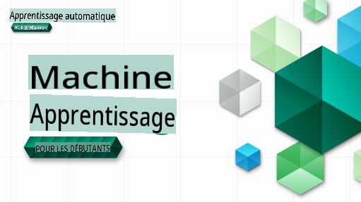

# Apprentissage Automatique pour Débutants - Un Programme

> 🌍 Voyagez autour du monde en explorant l'apprentissage automatique à travers les cultures du monde 🌍

Les Cloud Advocates de Microsoft sont heureux de proposer un programme de 12 semaines et 26 leçons entièrement consacré à l'**Apprentissage Automatique**. Dans ce programme, vous apprendrez ce que l'on appelle parfois l'**apprentissage automatique classique**, en utilisant principalement Scikit-learn comme bibliothèque et en évitant l'apprentissage profond, qui est abordé dans notre [programme AI pour Débutants](https://aka.ms/ai4beginners). Associez ces leçons à notre [programme 'Data Science pour Débutants'](https://aka.ms/ds4beginners) également !

Voyagez avec nous autour du monde alors que nous appliquons ces techniques classiques à des données provenant de nombreuses régions du monde. Chaque leçon comprend des quiz avant et après la leçon, des instructions écrites pour compléter la leçon, une solution, un devoir, et plus encore. Notre pédagogie basée sur des projets vous permet d'apprendre en construisant, une méthode éprouvée pour que les nouvelles compétences 's'ancrent'.

**✍️ Un grand merci à nos auteurs** Jen Looper, Stephen Howell, Francesca Lazzeri, Tomomi Imura, Cassie Breviu, Dmitry Soshnikov, Chris Noring, Anirban Mukherjee, Ornella Altunyan, Ruth Yakubu et Amy Boyd

**🎨 Merci également à nos illustrateurs** Tomomi Imura, Dasani Madipalli, et Jen Looper

**🙏 Remerciements spéciaux 🙏 à nos auteurs, réviseurs et contributeurs de contenu Microsoft Student Ambassador**, notamment Rishit Dagli, Muhammad Sakib Khan Inan, Rohan Raj, Alexandru Petrescu, Abhishek Jaiswal, Nawrin Tabassum, Ioan Samuila, et Snigdha Agarwal

**🤩 Une gratitude supplémentaire aux Microsoft Student Ambassadors Eric Wanjau, Jasleen Sondhi, et Vidushi Gupta pour nos leçons R !**

# Prise en Main

Suivez ces étapes :
1. **Forkez le dépôt** : Cliquez sur le bouton "Fork" en haut à droite de cette page.
2. **Clonez le dépôt** :   `git clone https://github.com/microsoft/ML-For-Beginners.git`

> [trouvez toutes les ressources supplémentaires pour ce cours dans notre collection Microsoft Learn](https://learn.microsoft.com/en-us/collections/qrqzamz1nn2wx3?WT.mc_id=academic-77952-bethanycheum)

**[Étudiants](https://aka.ms/student-page)**, pour utiliser ce programme, forkiez l'intégralité du dépôt sur votre propre compte GitHub et réalisez les exercices seul ou en groupe :

- Commencez par un quiz pré-conférence.
- Lisez la conférence et complétez les activités, en faisant des pauses et en réfléchissant à chaque vérification des connaissances.
- Essayez de créer les projets en comprenant les leçons plutôt qu'en exécutant le code de solution ; cependant, ce code est disponible dans les dossiers `/solution` de chaque leçon orientée projet.
- Passez le quiz post-conférence.
- Complétez le défi.
- Complétez le devoir.
- Après avoir terminé un groupe de leçons, visitez le [Forum de Discussion](https://github.com/microsoft/ML-For-Beginners/discussions) et "apprenez à haute voix" en remplissant le barème PAT approprié. Un 'PAT' est un Outil d'Évaluation des Progrès qui est un barème que vous remplissez pour approfondir votre apprentissage. Vous pouvez également réagir à d'autres PAT afin que nous puissions apprendre ensemble.

> Pour des études supplémentaires, nous recommandons de suivre ces modules et parcours d'apprentissage sur [Microsoft Learn](https://docs.microsoft.com/en-us/users/jenlooper-2911/collections/k7o7tg1gp306q4?WT.mc_id=academic-77952-leestott).

**Enseignants**, nous avons [inclus quelques suggestions](for-teachers.md) sur la manière d'utiliser ce programme.

---

## Vidéos explicatives

Certaines des leçons sont disponibles sous forme de courtes vidéos. Vous pouvez les trouver en ligne dans les leçons, ou sur la [playlist ML pour Débutants sur la chaîne YouTube des Développeurs Microsoft](https://aka.ms/ml-beginners-videos) en cliquant sur l'image ci-dessous.

---

## Rencontrez l'Équipe

**Gif par** [Mohit Jaisal](https://linkedin.com/in/mohitjaisal)

> 🎥 Cliquez sur l'image ci-dessus pour une vidéo sur le projet et les personnes qui l'ont créé !

---

## Pédagogie

Nous avons choisi deux principes pédagogiques lors de la création de ce programme : garantir qu'il soit pratique **basé sur des projets** et qu'il inclue des **quiz fréquents**. De plus, ce programme a un **thème** commun pour lui donner de la cohésion.

En veillant à ce que le contenu soit aligné avec les projets, le processus devient plus engageant pour les étudiants et la rétention des concepts sera améliorée. De plus, un quiz à faible enjeu avant un cours fixe l'intention de l'étudiant d'apprendre un sujet, tandis qu'un deuxième quiz après le cours assure une rétention supplémentaire. Ce programme a été conçu pour être flexible et amusant et peut être suivi dans son intégralité ou en partie. Les projets commencent petit et deviennent de plus en plus complexes à la fin du cycle de 12 semaines. Ce programme inclut également un post-scriptum sur les applications réelles de l'apprentissage automatique, qui peut être utilisé comme crédit supplémentaire ou comme base de discussion.

> Trouvez notre [Code de Conduite](CODE_OF_CONDUCT.md), nos directives sur [Contributions](CONTRIBUTING.md), et sur [Traduction](TRANSLATIONS.md). Nous accueillons vos retours constructifs !

## Chaque leçon comprend

- sketchnote optionnelle
- vidéo supplémentaire optionnelle
- vidéo explicative (certaines leçons seulement)
- quiz de réchauffement pré-conférence
- leçon écrite
- pour les leçons basées sur des projets, des guides étape par étape sur comment construire le projet
- vérifications des connaissances
- un défi
- lecture complémentaire
- devoir
- quiz post-conférence

> **Une note sur les langues** : Ces leçons sont principalement écrites en Python, mais beaucoup sont également disponibles en R. Pour compléter une leçon en R, allez dans le dossier `/solution` et recherchez les leçons R. Elles incluent une extension .rmd qui représente un fichier **R Markdown** qui peut être simplement défini comme une intégration de `code chunks` (de R ou d'autres langages) et un `YAML header` (qui guide comment formater les sorties telles que PDF) dans un `Markdown document`. En tant que tel, il sert de cadre d'édition exemplaire pour la science des données puisqu'il vous permet de combiner votre code, sa sortie, et vos réflexions en vous permettant de les écrire en Markdown. De plus, les documents R Markdown peuvent être rendus dans des formats de sortie tels que PDF, HTML, ou Word.

> **Une note sur les quiz** : Tous les quiz se trouvent dans le [dossier Quiz App](../../quiz-app), pour un total de 52 quiz de trois questions chacun. Ils sont liés à l'intérieur des leçons, mais l'application de quiz peut être exécutée localement ; suivez les instructions dans le dossier `quiz-app` pour héberger localement ou déployer sur Azure.

| Numéro de leçon |                             Sujet                              |                   Regroupement de leçons                   | Objectifs d'apprentissage                                                                                                             |                                                              Leçon liée                                                               |                        Auteur                        |
| :-------------: | :------------------------------------------------------------: | :-------------------------------------------------------: | ------------------------------------------------------------------------------------------------------------------------------- | :--------------------------------------------------------------------------------------------------------------------------------------: | :--------------------------------------------------: |
|      01        |                Introduction à l'apprentissage automatique                |      [Introduction](1-Introduction/README.md)       | Apprendre les concepts de base de l'apprentissage automatique                                                                                |                                             [Leçon](1-Introduction/1-intro-to-ML/README.md)                                             |                       Muhammad                       |
|      02        |                L'Histoire de l'apprentissage automatique                 |      [Introduction](1-Introduction/README.md)       | Apprendre l'histoire sous-jacente de ce domaine                                                                                         |                                            [Leçon](1-Introduction/2-history-of-ML/README.md)                                            |                     Jen et Amy                      |
|      03        |                 Équité et apprentissage automatique                  |      [Introduction](1-Introduction/README.md)       | Quelles sont les questions philosophiques importantes autour de l'équité que les étudiants devraient considérer lors de la construction et de l'application des modèles d'apprentissage automatique ? |                                              [Leçon](1-Introduction/3-fairness/README.md)                                               |                        Tomomi                        |
|      04       |                Techniques d'apprentissage automatique                 |      [Introduction](1-Introduction/README.md)       | Quelles techniques les chercheurs en apprentissage automatique utilisent-ils pour construire des modèles d'apprentissage automatique ?                                                                       |                                          [Leçon](1-Introduction/4-techniques-of-ML/README.md)                                           |                    Chris et Jen                     |
|      05       |                   Introduction à la régression                   |        [Régression](2-Regression/README.md)         | Commencez avec Python et Scikit-learn pour les modèles de régression                                                                  |         <ul><li>[Python](2-Regression/1-Tools/README.md)</li><li>[R](../../2-Regression/1-Tools/solution/R/lesson_1.html)</li></ul>         |      <ul><li>Jen</li><li>Eric Wanjau</li></ul>       |
|      06       |                Prix des citrouilles en Amérique du Nord 🎃                |        [Régression](2-Regression/README.md)         | Visualisez et nettoyez les données en préparation pour l'apprentissage automatique                                                                                  |          <ul><li>[Python](2-Regression/2-Data/README.md)</li><li>[R](../../2-Regression/2-Data/solution/R/lesson_2.html)</li></ul>          |      <ul><li>Jen</li><li>Eric Wanjau</li></ul>       |
|      07       |                Prix des citrouilles en Amérique du Nord 🎃                |        [Régression](2-Regression/README.md)         | Construisez des modèles de régression linéaire et polynomiale                                                                                   |        <ul><li>[Python](2-Regression/3-Linear/README.md)</li><li>[R](../../2-Regression/3-Linear/solution/R/lesson_3.html)</li></ul>        |      <ul><li>Jen et Dmitry</li><li>Eric Wanjau</li></ul>       |
|      08       |                Prix des citrouilles en Amérique du Nord 🎃                |        [Régression](2-Regression/README.md)         | Construisez un modèle de régression logistique                                                                                               |     <ul><li>[Python](2-Regression/4-Logistic/README.md) </li><li>[R](../../2-Regression/4-Logistic/solution/R/lesson_4.html)</li></ul>      |      <ul><li>Jen</li><li>Eric Wanjau</li></ul>       |
|      09       |                          Une application web 🔌                          |           [Application Web](3-Web-App/README.md)            | Créez une application web pour utiliser votre modèle entraîné                                                                                       |                                                 [Python](3-Web-App/1-Web-App/README.md)                                                  |                         Jen                          |
|      10       |                 Introduction à la classification                 |    [Classification](4-Classification/README.md)     | Nettoyez, préparez et visualisez vos données ; introduction à la classification                                                            | <ul><li> [Python](4-Classification/1-Introduction/README.md) </li><li>[R](../../4-Classification/1-Introduction/solution/R/lesson_10.html)  | <ul><li>Jen et Cassie</li><li>Eric Wanjau</li></ul> |
|      11       |             Délicieuses cuisines asiatiques et indiennes 🍜             |    [Classification](4-Classification/README.md)     | Introduction aux classificateurs                                                                                                     | <ul><li> [Python](4-Classification/2-Classifiers-1/README.md)</li><li>[R](../../4-Classification/2-Classifiers-1/solution/R/lesson_11.html) | <ul><li>Jen et Cassie</li><li>Eric Wanjau</li></ul> |
|      12       |             Délicieuses cuisines asiatiques et indiennes 🍜             |    [Classification](4-Classification/README.md)     | Plus de classificateurs                                                                                                                | <ul><li> [Python](4-Classification/3-Classifiers-2/README.md)</li><li>[R](../../4-Classification/3-Classifiers-2/solution/R/lesson_12.html) | <ul><li>Jen et Cassie</li><li>Eric Wanjau</li></ul> |
|      13       |             Délicieuses cuisines asiatiques et indiennes 🍜             |    [Classification](4-Classification/README.md)     | Créez une application web de recommandation en utilisant votre modèle                                                                                    |                                              [Python](4-Classification/4-Applied/README.md)                                              |                         Jen                          |
|      14       |                   Introduction au clustering                   |        [Clustering](5-Clustering/README.md)         | Nettoyez, préparez et visualisez vos données ; Introduction au clustering                                                                |         <ul><li> [Python](5-Clustering/1-Visualize/README.md)</li><li>[R](../../5-Clustering/1-Visualize/solution/R/lesson_14.html)         |      <ul><li>Jen</li><li>Eric Wanjau</li></ul>       |
|      15       |              Exploration des goûts musicaux nigérians 🎧              |        [Clustering](5-Clustering/README.md)         | Explorez la méthode de clustering K-Means                                                                                           |           <ul><li> [Python](5-Clustering/2-K-Means/README.md)</li><li>[R](../../5-Clustering/2-K-Means/solution/R/lesson_15.html)           |      <ul><li>Jen</li><li>Eric Wanjau</li></ul>       |
|      16       |        Introduction au traitement du langage naturel ☕️         |   [Traitement du langage naturel](6-NLP/README.md)    | Apprenez les bases du traitement du langage naturel en construisant un bot simple                                                                             |                                             [Python](6-NLP/1-Introduction-to-NLP/README.md)                                              |                       Stephen                        |
|      17       |                      Tâches courantes en traitement du langage naturel ☕️                      |   [Traitement du langage naturel](6-NLP/README.md)    | Approfondissez vos connaissances en traitement du langage naturel en comprenant les tâches courantes liées aux structures linguistiques                          |                                                    [Python](6-NLP/2-Tasks/README.md)                                                     |                       Stephen                        |
|      18       |             Traduction et analyse de sentiment ♥️              |   [Traitement du langage naturel](6-NLP/README.md)    | Traduction et analyse de sentiment avec Jane Austen                                                                             |                                            [Python](6-NLP/3-Translation-Sentiment/README.md)                                             |                       Stephen                        |
|      19       |                  Hôtels romantiques d'Europe ♥️                  |   [Traitement du langage naturel](6-NLP/README.md)    | Analyse de sentiment avec des critiques d'hôtels 1                                                                                         |                                               [Python](6-NLP/4-Hotel-Reviews-1/README.md)                                                |                       Stephen                        |
|      20       |                  Hôtels romantiques d'Europe ♥️                  |   [Traitement du langage naturel](6-NLP/README.md)    | Analyse de sentiment avec des critiques d'hôtels 2                                                                                         |                                               [Python](6-NLP/5-Hotel-Reviews-2/README.md)                                                |                       Stephen                        |
|      21       |            Introduction à la prévision des séries temporelles             |        [Séries temporelles](7-TimeSeries/README.md)        | Introduction à la prévision des séries temporelles                                                                                         |                                             [Python](7-TimeSeries/1-Introduction/README.md)                                              |                      Francesca                       |
|      22       | ⚡️ Utilisation mondiale de l'énergie ⚡️ - prévision des séries temporelles avec ARIMA |        [Séries temporelles](7-TimeSeries/README.md)        | Prévision des séries temporelles avec ARIMA                                                                                              |                                                 [Python](7-TimeSeries/2-ARIMA/README.md)                                                 |                      Francesca                       |
|      23       |  ⚡️ Utilisation mondiale de l'énergie ⚡️ - prévision des séries temporelles avec SVR  |        [Séries temporelles](7-TimeSeries/README.md)        | Prévision des séries temporelles avec le régressseur à vecteurs de support                                                                           |                                                  [Python](7-TimeSeries/3-SVR/README.md)                                                  |                       Anirban                        |
|      24       |             Introduction à l'apprentissage par renforcement             | [Apprentissage par renforcement](8-Reinforcement/README.md) | Introduction à l'apprentissage par renforcement avec Q-Learning                                                                          |                                             [Python](8-Reinforcement/1-QLearning/README.md)                                              |                        Dmitry                        |
|      25       |                 Aidez Peter à éviter le loup ! 🐺                  | [Apprentissage par renforcement](8-Reinforcement/README.md) | Gym d'apprentissage par renforcement                                                                                                      |                                                [Python](8-Reinforcement/2-Gym/README.md)                                                 |                        Dmitry                        |
|  Postscript   |            Scénarios et applications de ML dans le monde réel            |      [ML dans la nature](9-Real-World/README.md)       | Applications intéressantes et révélatrices du ML classique                                                               |                                             [Leçon](9-Real-World/1-Applications/README.md)                                              |                         Équipe                         |
|  Postscript   |            Débogage de modèles en ML en utilisant le tableau de bord RAI          |      [ML dans la nature](9-Real-World/README.md)       | Débogage de modèles en apprentissage automatique en utilisant les composants du tableau de bord d'IA responsable                                                              |                                             [Leçon](9-Real-World/2-Debugging-ML-Models/README.md)                                              |                         Ruth Yakubu                       |

> [trouvez toutes les ressources supplémentaires pour ce cours dans notre collection Microsoft Learn](https://learn.microsoft.com/en-us/collections/qrqzamz1nn2wx3?WT.mc_id=academic-77952-bethanycheum)

## Accès hors ligne

Vous pouvez exécuter cette documentation hors ligne en utilisant [Docsify](https://docsify.js.org/#/). Forkez ce dépôt, [installez Docsify](https://docsify.js.org/#/quickstart) sur votre machine locale, puis dans le dossier racine de ce dépôt, tapez `docsify serve`. Le site sera servi sur le port 3000 sur votre localhost : `localhost:3000`.

## PDFs
Trouvez un PDF du programme avec des liens [ici](https://microsoft.github.io/ML-For-Beginners/pdf/readme.pdf).

## Aide Requise

Souhaitez-vous contribuer à une traduction ? Veuillez lire nos [directives de traduction](TRANSLATIONS.md) et ajouter un problème template pour gérer la charge de travail [ici](https://github.com/microsoft/ML-For-Beginners/issues).

## Autres Programmes

Notre équipe produit d'autres programmes ! Découvrez :

- [AI for Beginners](https://aka.ms/ai4beginners)
- [Data Science for Beginners](https://aka.ms/datascience-beginners)
- [**Nouvelle Version 2.0** - AI Génératif pour Débutants](https://aka.ms/genai-beginners)
- [**NOUVEAU** Cyber-sécurité pour Débutants](https://github.com/microsoft/Security-101??WT.mc_id=academic-96948-sayoung)
- [Développement Web pour Débutants](https://aka.ms/webdev-beginners)
- [IoT pour Débutants](https://aka.ms/iot-beginners)
- [Apprentissage Automatique pour Débutants](https://aka.ms/ml4beginners)
- [Développement XR pour Débutants](https://aka.ms/xr-dev-for-beginners)
- [Maîtriser GitHub Copilot pour la Programmation Paire AI](https://aka.ms/GitHubCopilotAI)

**Avertissement** :  
Ce document a été traduit à l'aide de services de traduction automatique basés sur l'IA. Bien que nous visons à garantir l'exactitude, veuillez noter que les traductions automatiques peuvent contenir des erreurs ou des inexactitudes. Le document original dans sa langue native doit être considéré comme la source faisant autorité. Pour des informations critiques, une traduction professionnelle humaine est recommandée. Nous ne sommes pas responsables des malentendus ou des interprétations erronées résultant de l'utilisation de cette traduction.