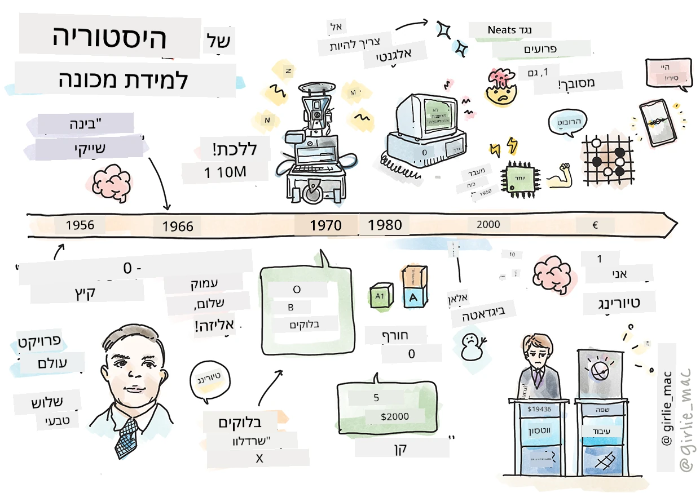
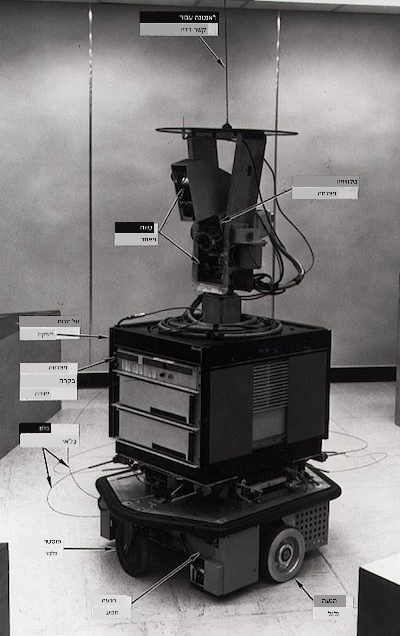
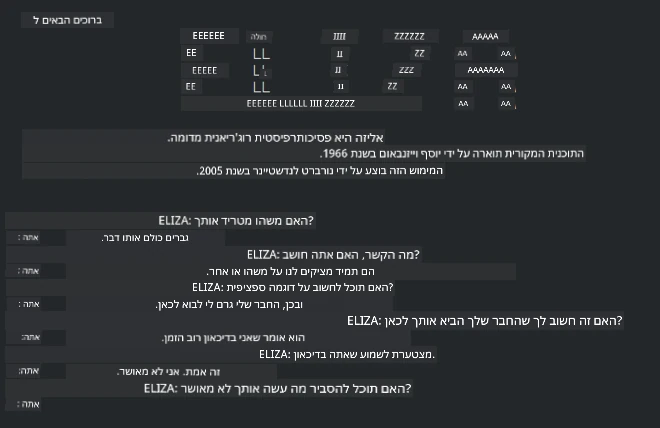

# היסטוריה של למידת מכונה

> סקצ'נוט מאת [טומומי אימורה](https://www.twitter.com/girlie_mac)

## [מבחן טרום-הרצאה](https://ff-quizzes.netlify.app/en/ml/)

---

> 🎥 לחצו על התמונה למעלה לסרטון קצר שמסביר את השיעור הזה.

בשיעור זה נעבור דרך ציוני דרך מרכזיים בהיסטוריה של למידת מכונה ואינטליגנציה מלאכותית.

ההיסטוריה של אינטליגנציה מלאכותית (AI) כתחום משולבת בהיסטוריה של למידת המכונה, שכן האלגוריתמים וההתפתחויות החישוביות שתומכות ב-ML הוזינו לפיתוח ה-AI. כדאי לזכור שבעוד שתחומים אלה התחילו להתגבש כשדות למידה מובחנים בשנות ה-50, [תגליות אלגוריתמיות, סטטיסטיות, מתמטיות, חישוביות וטכניות](https://wikipedia.org/wiki/Timeline_of_machine_learning) חשובות קדמו והתגלגלו לתקופה זו. למעשה, אנשים חשבו על שאלות אלה למשך [מאות שנים](https://wikipedia.org/wiki/History_of_artificial_intelligence): מאמר זה דן ביסודות האינטלקטואליים ההיסטוריים של רעיון 'מכונה חושבת'.

---
## תגליות בולטות

- 1763, 1812 [משפט בייס](https://wikipedia.org/wiki/Bayes%27_theorem) וקודמיו. משפט זה ויישומיו הם הבסיס להסקה, המתאר את ההסתברות לאירוע בהתבסס על ידע קודם.
- 1805 [תאוריית הריבועים הפחותים](https://wikipedia.org/wiki/Least_squares) מאת המתמטיקאי הצרפתי אדריאן-מרי לגדר. תאוריה זו, שתלמדו עליה ביחידת הרגרסיה, מסייעת בהתאמת נתונים.
- 1913 [שרשרות מרקוב](https://wikipedia.org/wiki/Markov_chain), על שמו של המתמטיקאי הרוסי אנדריי מרקוב, משמשות לתיאור רציף אירועים אפשריים בהתבסס על מצב קודם.
- 1957 [פרספטרון](https://wikipedia.org/wiki/Perceptron) הוא סוג של מסווג לינארי שהומצא על ידי הפסיכולוג האמריקאי פרנק רוזנבלט ומהווה בסיס להתקדמויות בלמידה עמוקה.

---

- 1967 [שכני הקרוב ביותר](https://wikipedia.org/wiki/Nearest_neighbor) הוא אלגוריתם שתוכנן במקור למיפוי מסלולים. בהקשר למידת מכונה משתמשים בו לזיהוי דפוסים.
- 1970 [בקפראופגיישן](https://wikipedia.org/wiki/Backpropagation) משמש לאימון [רשתות עצביות מזינות קדימה](https://wikipedia.org/wiki/Feedforward_neural_network).
- 1982 [רשתות עצביות חוזרות](https://wikipedia.org/wiki/Recurrent_neural_network) הן רשתות עצביות מלאכותיות הנובעות מרשתות מזינות קדימה ויוצרות גרפים זמן-סדרתיים.

✅ עשו קצת מחקר. אילו תאריכים אחרים בולטים כהכרחיים בהיסטוריה של ML ו-AI?

---
## 1950: מכונות שחושבות

אלן טיורינג, אדם יוצא דופן באמת שנבחר [על ידי הציבור ב-2019](https://wikipedia.org/wiki/Icons:_The_Greatest_Person_of_the_20th_Century) כמדען הגדול ביותר במאה ה-20, מיוחס לו שתרם להנחת היסוד למושג 'מכונה שיכולה לחשוב'. הוא התמודד עם ספקנים ועם הצורך שלו להוכחות אמפיריות למושג זה, בין היתר באמצעות יצירת [מבחן טיורינג](https://www.bbc.com/news/technology-18475646), אותו תחקור בשיעורי עיבוד שפה טבעית שלנו.

---
## 1956: פרויקט מחקר הקיץ בדארטמות'

"פרויקט מחקר הקיץ בדארטמות' על אינטליגנציה מלאכותית היה אירוע מכונן עבור התחום," וכאן נוצר המונח 'אינטליגנציה מלאכותית' ([מקור](https://250.dartmouth.edu/highlights/artificial-intelligence-ai-coined-dartmouth)).

> כל היבט של למידה או כל תכונה אחרת של אינטליגנציה יכול, מבחינה עקרונית, להיות מתואר כל כך מדויק כך שניתן יהיה ליצור מכונה המדמה זאת.

---

החוקר הראשי, פרופסור למתמטיקה ג'ון מקארתי, קיווה "להתקדם על בסיס ההשערה שכל היבט של למידה או כל תכונה אחרת של אינטליגנציה ניתן לתיאור מדויק שמאפשר ליצור מכונה המדמה זאת." בין המשתתפים היה גם דמות מוכרת נוספת בתחום, מרווין מינסקי.

הסדנה מיוחסת ככזו שיזמה ועודדה דיונים רבים כולל "עליית שיטות סימבוליות, מערכות ממוקדות תחומים מוגבלים (מערכות מומחים מוקדמות), ומערכות דדוקטיביות לעומת מערכות אינדוקטיביות." ([מקור](https://wikipedia.org/wiki/Dartmouth_workshop)).

---
## 1956 - 1974: "השנים הזהובות"

משנות ה-50 ועד אמצע שנות ה-70, האופטימיות הייתה רבה בתקווה ש-AI תפתור בעיות רבות. ב-1967, מרווין מינסקי טען בביטחון ש"בתוך דור ... הבעייה של יצירת 'אינטליגנציה מלאכותית' תיפתר במידה רבה." (מינסקי, מרווין (1967), חישוב: מכונות סופיות ואינסופיות, אנגלווד קליפס, ניו ג'רזי: פרנטיס-הול)

מחקר בעיבוד שפה טבעית שגשג, החיפוש שוכלל והועצם, ונוצר מושג ה'מיקרו-עולמות', שבו משימות פשוטות התבצעו באמצעות הוראות בשפה פשוטה.

---

המחקר מומן היטב על ידי סוכנויות ממשלתיות, נעשו התקדמויות בחישוב ואלגוריתמים, ונבנו אב-טיפוסים של מכונות חכמות. כמה מהמכונות הללו כוללות:

* [שייקי הרובוט](https://wikipedia.org/wiki/Shakey_the_robot), שיכול לנווט ולקבל החלטות כיצד לבצע משימות 'בחוכמה'.

    
    > שייקי בשנת 1972

---

* אליזה, 'צ'טבוט' מוקדם, יכלה לשוחח עם אנשים ולפעול כ'פסיכולוג' פרימיטיבי. תלמדו עוד על אליזה בשיעורי עיבוד שפה טבעית.

    
    > גרסה של אליזה, צ'טבוט

---

* "עולם הבניינים" היה דוגמה למיקרו-עולם שבו ניתן היה להניח ולמיין בניינים, ונערכו ניסויים ללמד מכונות לקבל החלטות. התקדמות שנבנתה עם ספריות כגון [SHRDLU](https://wikipedia.org/wiki/SHRDLU) סייעה לקידום עיבוד השפה.

    

    > 🎥 לחצו על התמונה למעלה לסרטון: עולם הבניינים עם SHRDLU

---
## 1974 - 1980: "חורף ה-AI"

עד אמצע שנות ה-70 התברר שהמורכבות שביצירת 'מכונות חכמות' הייתה מוערכת פחות מדי, וההבטחה, בהתחשב בכוח המיחשוב הזמין, הייתה מופרזת. המימון התקצר והביטחון בתחום פחת. כמה מהנושאים שפגעו בביטחון כללו:
---
- **מגבלות**. כוח המיחשוב היה מוגבל מדי.
- **התפוצצות קומבינטורית**. כמות הפרמטרים שצריך לאמן גדלה באופן אקספוננציאלי ככל שדרש יותר מהמחשבים, ללא התפתחות מקבילה בכוח וביכולת המיחשוב.
- **מחסור בנתונים**. היה מחסור בנתונים שהקשה על תהליך הבדיקה, הפיתוח והדיוק של האלגוריתמים.
- **האם אנחנו שואלים את השאלות הנכונות?**. השאלות שנשאלו החלו להיטען ולבקר. החוקרים נפגשו בביקורת על הגישות שלהם:
  - מבחני טיורינג הובאו לשאלה באמצעות, בין היתר, 'תאוריית החדר הסיני' שהציעה ש"תכנות מחשב דיגיטלי עשוי להראות כאילו הוא מבין שפה אך לא יכול לייצר הבנה אמיתית." ([מקור](https://plato.stanford.edu/entries/chinese-room/))
  - האתיקה של הכנסת אינטליגנציות מלאכותיות כמו "הפסיכולוג" ELIZA לחברה הובלה לביקורת.

---

באותו זמן החלו להיווצר זרמים שונים בתחום ה-AI. הוקם דיכוטומיה בין פרקטיקות ["מסודרות" לעומת "פרועות"](https://wikipedia.org/wiki/Neats_and_scruffies). מעבדות _פרועות_ שינו תוכניות שעות רבות עד שהגיעו לתוצאות הרצויות. מעבדות _מסודרות_ "מוקדות בלוגיקה ובפתרון פורמלי של בעיות". ELIZA ו-SHRDLU היו מערכות _פרועות_ ידועות. בשנות ה-80, כשהתעורר הביקוש להפוך מערכות ML לשחזריות, הגישה _המסודרת_ בהדרגה תפסה מקום מרכזי בגלל שניתן להסביר את תוצאותיה טוב יותר.

---
## מערכות מומחים בשנות ה-80

ככל שהתחום גדל, היתרון העסקי שלו הפך ברור, ובשנות ה-80 צץ השימוש במערכות 'מומחים'. "מערכות מומחים היו בין הצורות הראשונות של תוכנות AI שהצליחו באמת." ([מקור](https://wikipedia.org/wiki/Expert_system)).

סוג זה של מערכת הוא למעשה _היברידי_, הכולל חלקית מנוע חוקים שמגדיר דרישות עסקיות, ומנוע הסקה שניצל את מערכת החוקים לגילוי עובדות חדשות.

תקופה זו ראתה גם התייחסות מוגברת לרשתות עצביות.

---
## 1987 - 1993: 'הקפאה' ב-AI

ההתפשטות של חומרת מערכות מומחים מתמחות הייתה לתוצאה לא רצויה של התמקצעות יתר. עליית מחשבים אישיים התחרתה אף היא עם מערכות גדולות, ממוקדות ומרוכזות אלו. הדמוקרטיזציה של המחשוב החלה, ולבסוף סללה את הדרך לפריצת הנתונים הגדולה המודרנית.

---
## 1993 - 2011

תקופה זו סימנה עידן חדש ל-ML ו-AI כדי לפתור בעיות שנגרמו קודם למחסור בנתונים ובכוח מחשוב. כמות הנתונים התחילה לגדול במהירות ולהיות זמינה יותר, לטוב ולרע, במיוחד עם הופעת המכשיר הסלולרי סביב 2007. כוח המיחשוב התרחב באופן אקספוננציאלי, והאלגוריתמים התפתחו במקביל. התחום החל להתבגר כשהימים הפראיים של העבר החלו להתגבשות לדיסציפלינה אמיתית.

---
## היום

כיום למידת מכונה ו-AI נוגעות כמעט בכל תחומי חיינו. עידן זה דורש הבנה זהירה של הסיכונים וההשפעות הפוטנציאליות של אלגוריתמים אלו על חיי אדם. כפי שבראד סמית' ממיקרוסופט ציין, "טכנולוגיית המידע מעלה סוגיות שנוגעות ללב ההגנות על זכויות אדם יסודיות כמו פרטיות וחופש הביטוי. סוגיות אלה מחדדות את האחריות של חברות טכנולוגיה היוצרות מוצרים אלו. בעינינו, הן גם דורשות רגולציה ממשלתית מושכלת ופיתוח נורמות סביב שימושים מקובלים" ([מקור](https://www.technologyreview.com/2019/12/18/102365/the-future-of-ais-impact-on-society/)).

---

נשאר לראות מה העתיד צופן, אך חשוב להבין את מערכות המחשב האלה ואת התוכנה והאלגוריתמים שמפעילים אותם. אנו מקווים שסילבוס זה יעזור לכם לרכוש הבנה טובה יותר כדי שתוכלו להחליט בעצמכם.

> 🎥 לחצו על התמונה למעלה לסרטון: יאן לקון מדבר על ההיסטוריה של למידה עמוקה בהרצאה זו

---
## 🚀אתגר

התחפרו ברגע היסטורי אחד ולמדו עוד על האנשים שמאחוריו. יש דמויות מרתקות, ולא נוצרה תגלית מדעית באוויר תרבותי נקי. מה גיליתם?

## [מבחן פוסט-הרצאה](https://ff-quizzes.netlify.app/en/ml/)

---
## סקירה ולמידה עצמית

הנה פריטים לצפייה והאזנה:

[פודקאסט שבו Amy Boyd דנה בהתפתחות AI](http://runasradio.com/Shows/Show/739)

---

## מטלה

[צרו ציר זמן](assignment.md)

---

<!-- CO-OP TRANSLATOR DISCLAIMER START -->
**כתב ויתור**:
מסמך זה תורגם באמצעות שירות תרגום אוטומטי [Co-op Translator](https://github.com/Azure/co-op-translator). למרות שאנו שואפים לדיוק, יש לקחת בחשבון שתרגומים אוטומטיים עלולים להכיל שגיאות או אי-דיוקים. יש להחשיב את המסמך המקורי בשפתו הטבעית כמקור הסמכות. למידע קריטי מומלץ להשתמש בתרגום מקצועי על ידי מתרגם אדם. אנו לא אחראים לכל אי-הבנה או פירוש שגוי הנובע מהשימוש בתרגום זה.
<!-- CO-OP TRANSLATOR DISCLAIMER END -->