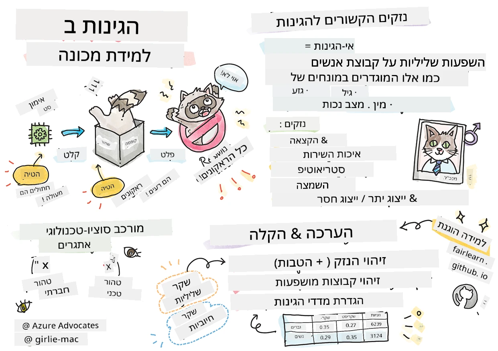
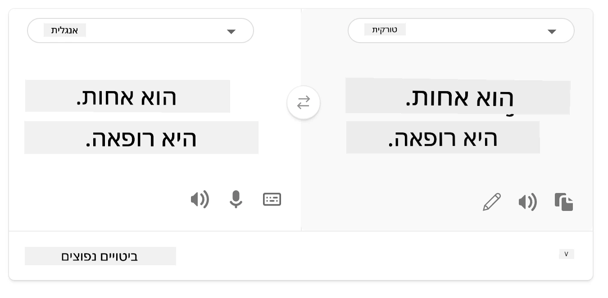
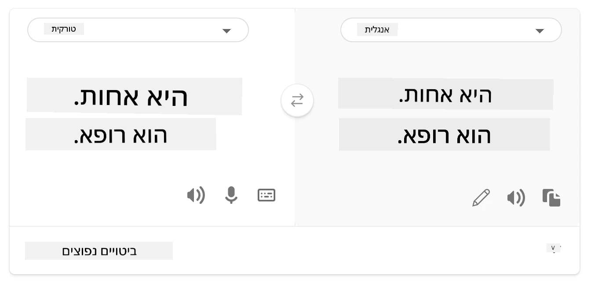
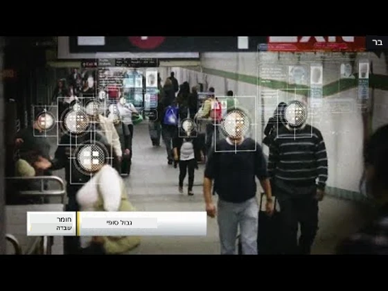

# בניית פתרונות למידת מכונה עם בינה מלאכותית אחראית
 

> שרטוט מאת [Tomomi Imura](https://www.twitter.com/girlie_mac)

## [חידון לפני ההרצאה](https://ff-quizzes.netlify.app/en/ml/)
 
## מבוא

בתכנית לימודים זו, תתחילו לגלות כיצד למידת מכונה משפיעה וכבר משפיעה על חיי היומיום שלנו. כבר כיום, מערכות ודגמים מעורבים במשימות קבלת החלטות יומיומיות, כמו אבחנות בריאותיות, אישורי הלוואות או גילוי הונאה. לכן, חשוב שהדגמים הללו יעבדו היטב ויספקו תוצאות שניתן לסמוך עליהן. כמו כל יישום תוכנה, מערכות AI עלולות לא לעמוד בציפיות או להביא לתוצאות בלתי רצויות. לכן חיוני להיות מסוגל להבין ולהסביר את התנהגות מודל AI.

דמיינו מה עלול לקרות כאשר הנתונים בהם אתם משתמשים לבניית דגמים אלו חסרים קבוצות דמוגרפיות מסוימות, כגון גזע, מין, השקפה פוליטית, דת, או מייצגים באופן לא פרופורציונלי את אותן קבוצות. מה קורה כאשר התוצאה של המודל מפורשת לטובת דמוגרפיה מסוימת? מה תהיה ההשלכה לאפליקציה? בנוסף, מה קורה כאשר למודל יש תוצאה שלילית ופוגע באנשים? מי אחראי להתנהגות מערכת ה-AI? אלה הן כמה מהשאלות שנחקור בתכנית לימודים זו.

בשיעור זה תלמדו:

- להעלות את המודעות לחשיבות ההוגנות בלמידת מכונה ולנזקים הקשורים להוגנות.
- להכיר את הנוהג לחקור חריגים ותסריטים יוצאי דופן כדי להבטיח אמינות ובטיחות.
- להבין את הצורך להעצים את כולם על ידי עיצוב מערכות מכילות.
- לחקור כמה חשוב להגן על פרטיות ואבטחת נתונים ואנשים.
- לראות את חשיבות הגישה של "קופסת זכוכית" כדי להסביר את התנהגות דגמי ה-AI.
- להיות מודעים לאופן בו האחריות חיונית לבניית אמון במערכות AI.

## דרישות מוקדמות

כדרישה מוקדמת, אנא עברו את מסלול הלמידה "עקרונות בינה מלאכותית אחראית" וצפו בסרטון למטה בנושא:

למדו עוד על בינה מלאכותית אחראית במעקב אחר מסלול זה [Learning Path](https://docs.microsoft.com/learn/modules/responsible-ai-principles/?WT.mc_id=academic-77952-leestott)

> 🎥 לחצו על התמונה למעלה לסרטון: הגישה של מיקרוסופט לבינה מלאכותית אחראית

## הוגנות

מערכות AI צריכות להתייחס לכולם בהוגנות ולהימנע מהשפעה שונה על קבוצות אנשים דומות. לדוגמה, כאשר מערכות AI מספקות הנחיות לטיפול רפואי, בקשות להלוואות או תעסוקה, הן צריכות לתת את אותן ההמלצות לכל מי שיש לו תסמינים דומים, מצב כלכלי דומה או הכשרה מקצועית דומה. כל אחד מאיתנו כנשא הטיות מונחות שמורשות המשפיעות על החלטותינו ופעולותינו. הטיות אלו יכולות להיות ברורות בנתונים שבהם אנו משתמשים לאימון מערכות AI. מניפולציה כזו יכולה להתרחש לפעמים בטעות. לעיתים קרובות קשה במודע לדעת מתי אתם מכניסים הטיה לנתונים.

**“אי-הוגנות”** כוללת השפעות שליליות, או "נזקים", עבור קבוצת אנשים, כגון אלה המוגדרים במונחים של גזע, מין, גיל או מצב נכות. הנזקים העיקריים הקשורים להוגנות יכולים להתחלק כך:

- **הקצאה**, אם מגדר או אתניות לדוגמה מועדפים על אחרים.
- **איכות השירות**. אם מאמנים את הנתונים לתרחיש ספציפי אך המציאות מורכבת יותר, זה מוביל לשירות ביצועי ירוד. לדוגמה, מתDisp מוזל יד לא הצליח לזהות אנשים עם עור כהה. [Reference](https://gizmodo.com/why-cant-this-soap-dispenser-identify-dark-skin-1797931773)
- **השמצה**. לבקר ולהתייג משהו או מישהו בצורה בלתי הוגנת. לדוגמה, טכנולוגיית סימון תמונות תויגה לשמצה כאשר סימנה בטעות תמונות של אנשים עם עור כהה ככלבים.
- **ייצוג מופרז או חסר**. הרעיון הוא שקבוצה מסוימת לא נראית במקצוע מסוים, וכל שירות או פונקציה שמקדם זאת תורם לנזק.
- **סטריאוטיפים**. לקשר קבוצה מסוימת עם תכונות מוקצות מראש. לדוגמה, מערכת תרגום שפות בין אנגלית לטורקית עלולה להכיל אי דיוקים בגלל מילים של סטריאוטיפים מגדריים.

> תרגום לטורקית

> תרגום חזרה לאנגלית

בעת עיצוב ובדיקת מערכות AI, עלינו לוודא שה-AI הוגן ואינו מתוכנת לקבל החלטות מוטות או מפלות, שהאדם גם אסור לו לקבל. הבטחת הוגנות ב-AI ולמידת מכונה נשארת אתגר טכנו-חברתי מורכב.

### אמינות ובטיחות

כדי לבנות אמון, מערכות AI צריכות להיות אמינות, בטוחות ועקביות בתנאים נורמליים ובלתי צפויים. חשוב לדעת כיצד מערכות AI יתנהגו במגוון מצבים, במיוחד כאשר הם חריגים. כאשר בונים פתרונות AI, יש צורך להקדיש דגש משמעותי כיצד להתמודד עם מגוון רחב של נסיבות שהפתרונות AI ייתקלו בהן. לדוגמה, רכב אוטונומי חייב לשים את בטיחות האנשים בראש סדר העדיפויות. כתוצאה מכך, ה-AI שמפעיל את הרכב צריך לקחת בחשבון את כל התסריטים האפשריים בהם הרכב עלול להיתקל, כגון לילה, סופות רעמים או סופות שלגים, ילדים שרצים מעבר לכביש, חיות מחמד, עבודות בכביש וכו'. כמה טוב מערכת AI מסוגלת להתמודד עם מגוון רחב של תנאים באופן אמין ובטוח משקף את רמת הצפייה שהמדען או המפתח של ה-AI שקל במהלך העיצוב או בדיקת המערכת.

> [🎥 לחצו כאן לסרטון: ](https://www.microsoft.com/videoplayer/embed/RE4vvIl)

### שיתופיות

מערכות AI צריכות להיות מעוצבות כדי לכלול ולהעצים את כולם. בעת עיצוב ויישום מערכות AI, מדעני נתונים ומפתחי AI מזהים ומתמודדים עם מחסומים פוטנציאליים במערכת שיכולים בטעות להוציא אנשים מחוץ. לדוגמה, ישנם מיליארד אנשים עם מוגבלויות ברחבי העולם. עם התקדמות ה-AI, הם יכולים לגשת למגוון רחב של מידע והזדמנויות בקלות רבה יותר בחיי היומיום שלהם. על ידי התמודדות עם המחסומים, נוצרות הזדמנויות לחדש ולפתח מוצרי AI עם חוויות טובות יותר שמועילות לכולם.

> [🎥 לחצו כאן לסרטון: שיתופיות ב-AI](https://www.microsoft.com/videoplayer/embed/RE4vl9v)

### אבטחה ופרטיות

מערכות AI צריכות להיות בטוחות ולכבד את פרטיות האנשים. אנשים סומכים פחות על מערכות שמסכנות את פרטיותם, מידעם או חייהם. כאשר מאמנים מודלים של למידת מכונה, אנו מסתמכים על נתונים כדי להפיק את התוצאות הטובות ביותר. בכך, יש לשקול את המקור והיושרה של הנתונים. לדוגמה, האם הנתונים הוגשו על ידי המשתמש או זמינים לציבור? לאחר מכן, בעת עבודה עם הנתונים, חיוני לפתח מערכות AI שיכולות להגן על מידע סודי ולהתנגד להתקפות. ככל שה-AI נעשה נפוץ יותר, ההגנה על הפרטיות ואבטחת מידע אישי ועסקי נעשות קריטיות ומורכבות יותר. סוגיות פריבטיות ואבטחת נתונים דורשות תשומת לב מיוחדת ב-AI כיוון שגישה לנתונים חיונית למערכות AI לעשות תחזיות והחלטות מדויקות ומושכלות על אנשים.

> [🎥 לחצו כאן לסרטון: אבטחה ב-AI](https://www.microsoft.com/videoplayer/embed/RE4voJF)

- בתעשייה שלנו נעשו התפתחויות משמעותיות בפרטיות ואבטחה, שניזונו במידה רבה מה-GDPR (תקנת הגנת המידע הכללית).
- אך עם מערכות AI עלינו להכיר במתח בין הצורך בנתונים אישיים כדי להפוך מערכות ליותר אישיות ויעילות – לבין פרטיות.
- בדומה ללידת המחשבים המחוברים עם האינטרנט, אנו רואים גם עלייה משמעותית במספר סוגיות האבטחה הקשורות ל-AI.
- במקביל, ראינו שימוש ב-AI לשיפור האבטחה. לדוגמה, רוב הסורקים המודרניים נגד וירוסים מונעים היום על ידי אלגוריתמים AI.
- עלינו להבטיח שתהליכי מדעי הנתונים שלנו משולבים בהרמוניה עם השיטות האחרונות של פרטיות ואבטחה.

### שקיפות
מערכות AI צריכות להיות מובנות. חלק חשוב בשקיפות הוא הסבר התנהגות מערכות ה-AI והרכיבים שלהן. שיפור ההבנה של מערכות AI דורש מהמעורבים להבין כיצד ומדוע הן פועלות, כדי שיוכלו לזהות בעיות ביצועים פוטנציאליות, חששות בטיחות ופרטיות, הטיות, פרקטיקות הכללה לא ראויות או תוצאות בלתי מכוונות. אנו גם מאמינים כי אלה שמשתמשים במערכות AI צריכים להיות כנים וגלויים לגבי מתי, מדוע ואיך הם בוחרים ליישמן. כמו גם לגבי מגבלות המערכות שבהן הם משתמשים. לדוגמה, אם בנק משתמש במערכת AI לתמיכה בהחלטות ההלוואה לצרכנים, חשוב לבדוק את התוצאות ולהבין אילו נתונים משפיעים על המלצות המערכת. ממשלות מתחילות להסדיר את ה-AI ברחבי התעשיות, ולכן מדעני נתונים וארגונים חייבים להסביר אם מערכת AI עומדת בדרישות הרגולציה, במיוחד כאשר יש תוצאה לא רצויה.

> [🎥 לחצו כאן לסרטון: שקיפות ב-AI](https://www.microsoft.com/videoplayer/embed/RE4voJF)

- משום שמערכות AI מורכבות כל כך, קשה להבין כיצד הן פועלות ולפרש את התוצאות.
- חוסר הבנה זה משפיע על האופן שבו מערכות אלו מנוהלות, מפעילות ומתועדות.
- חוסר ההבנה הזה חשוב אף יותר משפיע על החלטות שמתקבלות תוך שימוש בתוצאות שמערכות אלו מפיקות.

### אחריות
 
האנשים שמעצבים ומפעילים מערכות AI צריכים להיות אחראים לאופן שבו מערכותיהם פועלות. הצורך באחריות הוא קריטי במיוחד בטכנולוגיות שימוש רגישות כמו זיהוי פנים. לאחרונה, יש דרישה גוברת לטכנולוגיית זיהוי פנים, במיוחד מארגוני אכיפת חוק שרואים את הפוטנציאל בטכנולוגיה לשימושים כמו מציאת ילדים נעדרים. עם זאת, טכנולוגיות אלו עלולות לשמש ממשלות לסכן את חירויות היסוד של אזרחיהם על ידי, למשל, הפעלה מתמדת של מעקב על אנשים מסוימים. לכן, מדעני נתונים וארגונים חייבים להיות אחראים לאופן בו מערכת ה-AI שלהם משפיעה על יחידים או על החברה.

> 🎥 לחצו על התמונה למעלה לסרטון: אזהרות ממעקב המוני באמצעות זיהוי פנים

בסופו של דבר, אחת מהשאלות הגדולות של דורנו, כדור ראשון שמביא את ה-AI לחברה, היא איך להבטיח שמחשבים יישארו אחראים בפני אנשים ואיך להבטיח שאנשים שמעצבים מחשבים יישארו אחראים בפני כולם.

## הערכת השפעה

לפני אימון מודל למידת מכונה, חשוב לבצע הערכת השפעה כדי להבין את מטרת מערכת ה-AI; מה השימוש המיועד; היכן היא תופעל; ומי יתקשר עם המערכת. אלו מידע מועיל לבוחן או לבודק המעריך את המערכת לדעת אילו גורמים לקחת בחשבון בעת זיהוי סיכונים פוטנציאליים ותוצאות צפויות.

להלן אזורי מיקוד בעת ביצוע הערכת השפעה:

* **השפעה שלילית על יחידים**. חשוב להיות מודעים לכל מגבלה או דרישות, שימוש בלתי נתמך או כל הגבלה ידועה שמפריעה לביצועי המערכת כדי להבטיח שהמערכת לא תשמש בדרך שתווצר נזק ליחידים.
* **דרישות נתונים**. הבנת כיצד והיכן המערכת תשתמש בנתונים מאפשרת לבוחנים לחקור את דרישות הנתונים שעליכם לקחת בחשבון (למשל, תקנות GDPR או HIPAA). בנוסף, לבדוק אם מקור או כמות הנתונים מספיקה לאימון.
* **סיכום השפעה**. לאסוף רשימה של נזקים פוטנציאליים שעשויים לעלות משימוש במערכת. במהלך מחזור החיים של למידת המכונה, לבדוק האם בעיות שזוהו מומטות או מטופלות.
* **מטרות ישימות** עבור כל אחד מששת העקרונות המרכזיים. להעריך אם המטרות מכל עקרון מתקיימות והאם יש פערים.

## איתור תקלות עם בינה מלאכותית אחראית

בדומה לאיתור תקלות בתוכנה, איתור תקלות במערכת AI הוא תהליך נחוץ של זיהוי ופתרון בעיות במערכת. ישנם גורמים רבים שעשויים להשפיע על כך שמודל לא יבצע כמצופה או בצורה אחראית. רוב מדדי הביצועים המסורתיים של מודלים הם ערכים מספריים מרכזיים של ביצועי המודל, שאינם מספקים לנתח כיצד מודל מפר את עקרונות ה-AI האחראית. נוסף על כך, מודל למידת מכונה הוא תיבת שחורה המקשה להבין מה מניע את תוצאתו או לספק הסבר כאשר הוא טועה. בהמשך הקורס, נלמד כיצד להשתמש בלוח הבקרה של בינה מלאכותית אחראית כדי לסייע באיתור תקלות במערכות AI. לוח הבקרה מספק כלי הוליסטי למדעני נתונים ומפתחי AI לבצע:

* **ניתוח שגיאות**. כדי לזהות את התפלגות השגיאות של המודל אשר עלולה להשפיע על ההוגנות או האמינות של המערכת.
* **סקירת מודל**. כדי לגלות היכן קיימים פערים בביצועי המודל בקרב קבוצות נתונים.
* **ניתוח נתונים**. כדי להבין את התפלגות הנתונים ולזהות הטיות פוטנציאליות שעלולות להוביל לבעיות של הוגנות, שיתופיות ואמינות.
* **פירושיות המודל**. כדי להבין מה משפיע או משפעל את תחזיות המודל. זה מסייע בהסברת התנהגות המודל, החשובה לשקיפות ואחריות.

## 🚀 אתגר
 
כדי למנוע נזקים כבר בשלב הראשוני, עלינו:

- שיהיה גיוון רקעי והשקפות בין האנשים שעובדים על המערכות
- להשקיע בסטי נתונים שמשקפים את הגיוון של החברה שלנו
- לפתח שיטות טובות יותר לאורך מחזור חיי למידת המכונה לזיהוי ותיקון בינה מלאכותית אחראית כשהיא מתרחשת

חשבו על תסריטים מחיי היום-יום שבהם חוסר אמינות של מודל ניכר בבנייתו ובשימוש בו. מה עוד צריך להתחשב בו?

## [חידון לאחר ההרצאה](https://ff-quizzes.netlify.app/en/ml/)

## סקירה ולמידה עצמית
 

בשיעור זה, למדתם כמה יסודות של מושגי הוגנות ואי-הוגנות בלמידת מכונה.  
 
צפו בסדנה זו כדי להעמיק בנושאים: 

- במרדף אחרי בינה מלאכותית אחראית: הבאת עקרונות אל הפרקטיקה מאת בסמירה נושי, מהרנווש סמאקי ואמיט שרמה

> 🎥 לחצו על התמונה למעלה לסרטון: ערכת כלים לבינה מלאכותית אחראית: מסגרת קוד פתוח לבניית בינה מלאכותית אחראית מאת בסמירה נושי, מהרנווש סמאקי, ואמיט שרמה

בנוסף, קראו: 

- מרכז המשאבים של מיקרוסופט לבינה מלאכותית אחראית: [משאבי בינה מלאכותית אחראית – Microsoft AI](https://www.microsoft.com/ai/responsible-ai-resources?activetab=pivot1%3aprimaryr4) 

- קבוצת המחקר FATE של מיקרוסופט: [FATE: הוגנות, אחריות, שקיפות ואתיקה בבינה מלאכותית - מחקר מיקרוסופט](https://www.microsoft.com/research/theme/fate/) 

ערכת כלים לבינה מלאכותית אחראית: 

- [מאגר GitHub של ערכת כלים לבינה מלאכותית אחראית](https://github.com/microsoft/responsible-ai-toolbox)

קראו על כלי Azure Machine Learning להבטחת הוגנות:

- [Azure Machine Learning](https://docs.microsoft.com/azure/machine-learning/concept-fairness-ml?WT.mc_id=academic-77952-leestott) 

## מטלה

[חקור את ערכת הכלים לבינה מלאכותית אחראית](assignment.md)

---

<!-- CO-OP TRANSLATOR DISCLAIMER START -->
**כתב ויתור**:
מסמך זה תורגם באמצעות שירות תרגום אוטומטי [Co-op Translator](https://github.com/Azure/co-op-translator). למרות שאנו שואפים לדיוק, יש לקחת בחשבון שתרגומים אוטומטיים עלולים להכיל שגיאות או אי-דיוקים. יש להחשיב את המסמך המקורי בשפתו הטבעית כמקור הסמכות. למידע קריטי מומלץ להשתמש בתרגום מקצועי על ידי מתרגם אדם. אנו לא אחראים לכל אי-הבנה או פירוש שגוי הנובע מהשימוש בתרגום זה.
<!-- CO-OP TRANSLATOR DISCLAIMER END -->