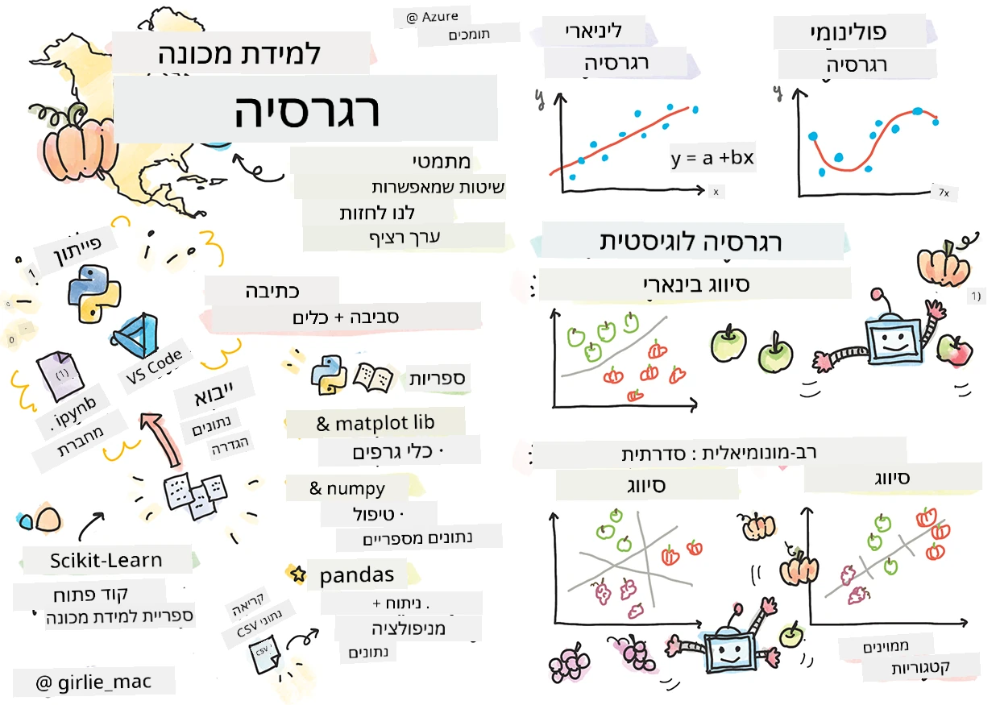
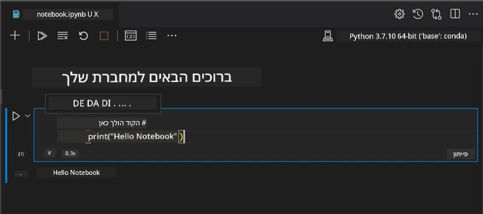
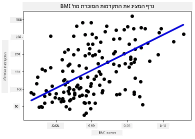

# התחילו עם פייתון ו-Scikit-learn למודלי רגרסיה



> סקטצ'נוט מאת [Tomomi Imura](https://www.twitter.com/girlie_mac)

## [מבחן טרום-הרצאה](https://ff-quizzes.netlify.app/en/ml/)

> ### [שיעור זה זמין ב-R!](../../../../2-Regression/1-Tools/solution/R/lesson_1.html)

## مقدّمة

בארבעת השיעורים האלה תגלה כיצד לבנות מודלי רגרסיה. נדון במה הם מיועדים בקרוב. אבל לפני שתגשים משהו, ודא שיש לך את הכלים המתאימים להתחלת התהליך!

בשיעור זה תלמד כיצד:

- להגדיר את המחשב שלך למשימות למידת מכונה מקומיות.
- לעבוד עם פנקסי Jupyter.
- להשתמש ב-Scikit-learn, כולל התקנה.
- לחקור את הרגרסיה הליניארית באמצעות תרגיל מעשי.

## התקנות והגדרות

[](https://youtu.be/-DfeD2k2Kj0 "ML למתחילים - התקן את הכלים שלך כדי לבנות מודלי למידת מכונה")

> 🎥 לחץ על התמונה למעלה לסרטון קצר שמראה כיצד להגדיר את המחשב ללמידת מכונה.

1. **התקן את פייתון**. ודא ש-[Python](https://www.python.org/downloads/) מותקן על המחשב שלך. תשתמש ב-Python עבור משימות רבות במדעי הנתונים ולמידת מכונה. רוב המחשבים כבר כוללים התקנת Python. יש גם חבילות קידוד [Python](https://code.visualstudio.com/learn/educators/installers?WT.mc_id=academic-77952-leestott) שימושיות להקלת ההתקנה עבור חלק מהמשתמשים.

   עם זאת, שימושים שונים של Python דורשים גרסאות שונות של התוכנה. לכן, כדאי להשתמש בסביבת עבודה וירטואלית ([virtual environment](https://docs.python.org/3/library/venv.html)).

2. **התקן את Visual Studio Code**. ודא שיש לך את Visual Studio Code מותקן על המחשב שלך. עקוב אחר ההוראות ל-[התקנת Visual Studio Code](https://code.visualstudio.com/) להתקנה בסיסית. תלמד להשתמש ב-Python בתוך Visual Studio Code בקורס זה, אז כדאי לחדד את הידע שלך כיצד [להגדיר Visual Studio Code](https://docs.microsoft.com/learn/modules/python-install-vscode?WT.mc_id=academic-77952-leestott) לפיתוח Python.

   > הכירו את Python באמצעות עבודה עם אוסף זה של [מודולים ללמידה](https://docs.microsoft.com/users/jenlooper-2911/collections/mp1pagggd5qrq7?WT.mc_id=academic-77952-leestott)
   >
   > [](https://youtu.be/yyQM70vi7V8 "הגדר Python עם Visual Studio Code")
   >
   > 🎥 לחץ על התמונה למעלה לסרטון: שימוש ב-Python בתוך VS Code.

3. **התקן את Scikit-learn**, על ידי עקיבה אחרי [הוראות אלה](https://scikit-learn.org/stable/install.html). מכיוון שעליך לוודא שאתה משתמש ב-Python 3, מומלץ שתשתמש בסביבה וירטואלית. שים לב, אם אתה מתקין את הספרייה הזו על מחשב M1 של Mac, יש הוראות מיוחדות בדף המקושר לעיל.

1. **התקן את Jupyter Notebook**. תצטרך [להתקין את חבילת Jupyter](https://pypi.org/project/jupyter/).

## סביבת הפיתוח שלך ללמידת מכונה

תשתמש ב-**פנקסים (notebooks)** לפיתוח קוד פייתון ולבניית מודלי למידת מכונה. קובץ מסוג זה הוא כלי נפוץ למדעני נתונים, וניתן לזהות אותם לפי הסיומת שלהם `.ipynb`.

פנקסים הם סביבה אינטראקטיבית שמאפשרת למפתח גם לקודד וגם להוסיף הערות ולכתוב תיעוד סביב הקוד, דבר שעוזר מאוד בפרויקטים ניסיוניים או מחקריים.

[](https://youtu.be/7E-jC8FLA2E "ML למתחילים - התקן פנקסי Jupyter כדי להתחיל לבנות מודלי רגרסיה")

> 🎥 לחץ על התמונה למעלה לסרטון קצר שמראה את התרגיל.

### תרגיל - עבודה עם פנקס

בתיקייה זו תמצא את הקובץ _notebook.ipynb_.

1. פתח את הקובץ _notebook.ipynb_ ב-Visual Studio Code.

   יופעל שרת Jupyter עם פייתון 3+. תמצא אזורים בפנקס שניתן `להריץ`, קטעי קוד. אתה יכול להריץ קוד על ידי בחירת האייקון שנראה כמו כפתור הפעלה.

1. בחר באייקון `md` והוסף קצת מרקדאון, עם הטקסט הבא **# Welcome to your notebook**.

   לאחר מכן, הוסף קצת קוד פייתון.

1. הקלד **print('hello notebook')** בקטע הקוד.
1. בחר בחץ כדי להריץ את הקוד.

   תראה את ההצהרה המודפסת:

    ```output
    hello notebook
    ```



אתה יכול לסרוג את הקוד שלך עם הערות לתיעוד פנקס עצמאי.

✅ חשוב לרגע איך הסביבה של מפתח ווב שונה מאוד מזו של מדען נתונים.

## התחלת עבודה עם Scikit-learn

כעת שפייתון מוגדר במחשב המקומי שלך, ואתה רגיל עם פנקסי Jupyter, נעבור להיות נוחים גם עם Scikit-learn (מבוטא `sci` כמו במילה `science`). Scikit-learn מציעה [API נרחב](https://scikit-learn.org/stable/modules/classes.html#api-ref) כדי לעזור לך לבצע משימות ML.

בהתאם ל-[אתר שלהם](https://scikit-learn.org/stable/getting_started.html), "Scikit-learn היא ספריית קוד פתוח ללמידת מכונה שתומכת בלמידה מפוקחת ובלמידה לא מפוקחת. היא גם מספקת כלים שונים להתאמת מודלים, טרום-עיבוד נתונים, בחירת מודלים והערכה, ורבות אחרות."

בקורס זה תשתמש ב-Scikit-learn וכלים אחרים לבניית מודלי למידת מכונה לביצוע מה שאנו קוראים 'משימות למידת מכונה מסורתיות'. הימנענו במכוון מרשתות עצביות ולמידה עמוקה, שכן הם מטופלים טוב יותר בקורס הקרוב שלנו 'AI למתחילים'.

Scikit-learn מקלה על בניית מודלים והערכתם לשימוש. היא מתמקדת בעיקר בשימוש בנתונים מספריים וכוללת כמה מערכי נתונים מוכנים לשימוש ככלי למידה. היא כוללת גם מודלים מוכנים שמאפשרים לתלמידים לנסות. בוא נחקור תחילה את תהליך טעינת נתונים מוכנים לשימוש ושימוש באסטרטגיה מובנית למודל ML ראשון עם Scikit-learn עם נתונים בסיסיים.

## תרגיל - פנקס Scikit-learn הראשון שלך

> מדריך זה הושפע מ-[דוגמת הרגרסיה הליניארית](https://scikit-learn.org/stable/auto_examples/linear_model/plot_ols.html#sphx-glr-auto-examples-linear-model-plot-ols-py) באתר Scikit-learn.


[](https://youtu.be/2xkXL5EUpS0 "ML למתחילים - פרויקט הרגרסיה הליניארית הראשון שלך בפייתון")

> 🎥 לחץ על התמונה למעלה לסרטון קצר שמראה תרגיל זה.

בקובץ _notebook.ipynb_ המשויך לשיעור זה, נקה את כל התאים על ידי לחיצה על אייקון פח האשפה.

בחלק זה תעבוד עם מערך נתונים קטן על סוכרת שנבנה בתוך Scikit-learn למטרות למידה. דמיין שאתה רוצה לבדוק טיפול לחולי סוכרת. מודלי למידת מכונה עשויים לעזור לך לקבוע אילו מטופלים יגיבו טוב יותר לטיפול, בהתבסס על שילובים של משתנים. אפילו מודל רגרסיה בסיסי, כשהוא מוצג, עשוי להראות מידע על משתנים שיעזור לך לארגן ניסויים קליניים תיאורטיים.

✅ יש הרבה סוגים של שיטות רגרסיה, ואיזו תבחר תלוי בתוצאה שאתה מחפש. אם אתה רוצה לנבא את הגובה הסביר לאדם בגיל מסוים, תשתמש ברגרסיה ליניארית, כי אתה מחפש **ערך מספרי**. אם אתה מעוניין לגלות האם סוג מטבח מוגדר כצמחוני או לא, אתה מחפש **שייכות קטגוריאלית** ולכן תשתמש בלוגיסטית. תלמד על רגרסיה לוגיסטית מאוחר יותר. חשוב קצת על שאלות שאתה יכול לשאול את הנתונים ואיזו שיטה מתאימה יותר.

בוא נתחיל במשימה הזו.

### ייבוא ספריות

למשימה הזו נייבא כמה ספריות:

- **matplotlib**. זהו [כלי גרפים](https://matplotlib.org/) שימושי ואנו נשתמש בו ליצירת גרף קווים.
- **numpy**. [numpy](https://numpy.org/doc/stable/user/whatisnumpy.html) היא ספרייה שימושית לניהול נתונים מספריים בפייתון.
- **sklearn**. זו ספריית [Scikit-learn](https://scikit-learn.org/stable/user_guide.html).

ייבא כמה ספריות שיעזרו במשימות שלך.

1. הוסף ייבואים על ידי הקלדת הקוד הבא:

   ```python
   import matplotlib.pyplot as plt
   import numpy as np
   from sklearn import datasets, linear_model, model_selection
   ```

   למעלה אתה מייבא את `matplotlib`, `numpy` ואת `datasets`, `linear_model` ו-`model_selection` מ-`sklearn`. `model_selection` משמש לחלוקת הנתונים לקבוצות אימון ובדיקה.

### מערך הנתונים של סוכרת

מערך הנתונים המובנה [diabetes dataset](https://scikit-learn.org/stable/datasets/toy_dataset.html#diabetes-dataset) כולל 442 דגימות מידע על סוכרת, עם 10 משתני תכונות, חלקם כוללים:

- גיל: גיל בשנים
- bmi: מדד מסת גוף
- לחץ דם: לחץ דם ממוצע
- s1 tc: תאי T (סוג של תאי דם לבנים)

✅ מערך זה כולל את המשתנה 'מין' כמשתנה חשוב למחקר סביב סוכרת. מערכות רפואיות רבות כוללות סיווג בינארי כזה. חשוב לחשוב כיצד קטגוריזציות כאלה עשויות להוציא חלקים מסוימים של אוכלוסייה מהטיפולים.

עכשיו, טען את הנתונים של X ו-y.

> 🎓 זכור, זו למידה מפוקחת, ונדרש משתנה מטרה מוכר בשם 'y'.

בתא קוד חדש, טען את מערך הנתונים של סוכרת על ידי קריאה ל-`load_diabetes()`. הפרמטר `return_X_y=True` מציין ש-`X` יהיה מטריצת נתונים, ו-`y` יהיה משתנה המטרה של הרגרסיה.

1. הוסף כמה פקודות הדפסה להראות את מימדי מטריצת הנתונים ואת האלמנט הראשון שלה:

    ```python
    X, y = datasets.load_diabetes(return_X_y=True)
    print(X.shape)
    print(X[0])
    ```

    מה שמוחזר הוא זוג ערכים (tuple). אתה מקצה את שני הערכים הראשונים של הזוג ל-`X` ול-`y` בהתאמה. למד עוד על [tuples](https://wikipedia.org/wiki/Tuple).

    ניתן לראות שמדובר ב-442 פריטים במערכי 10 אלמנטים:

    ```text
    (442, 10)
    [ 0.03807591  0.05068012  0.06169621  0.02187235 -0.0442235  -0.03482076
    -0.04340085 -0.00259226  0.01990842 -0.01764613]
    ```

    ✅ חשוב לחשוב על הקשר בין הנתונים למשתנה המטרה ברגרסיה. הרגרסיה הליניארית מנבאת קשרים בין תכונת X למשתנה המטרה y. האם תוכל למצוא את [המטרה](https://scikit-learn.org/stable/datasets/toy_dataset.html#diabetes-dataset) של מערך הסוכרת בתיעוד? מה מערך הנתונים מדגים, בהתחשב במטרה זו?

2. עכשיו בחר חלק ממערך הנתונים לציור על ידי בחירת העמודה השלישית. ניתן לעשות זאת באמצעות האופרטור `:` לבחירת כל השורות, ואז בחירת העמודה השלישית באמצעות האינדקס (2). אפשר גם לעצב את הנתונים כמערך דו-ממדי - כנדרש לציור - באמצעות `reshape(n_rows, n_columns)`. אם אחד הפרמטרים הוא -1, המימד המקביל מחושב אוטומטית.

   ```python
   X = X[:, 2]
   X = X.reshape((-1,1))
   ```

   ✅ בכל עת, הדפס את הנתונים כדי לבדוק את צורתם.

3. כעת כשיש לך נתונים מוכנים לציור, תראה אם מכונה יכולה לסייע לקבוע חלוקה הגיונית בין המספרים במערך זה. לשם כך, יש לחלק את הנתונים (X) ואת המשתנה המטרה (y) לקבוצות אימון ובדיקה. ל-Scikit-learn יש דרך פשוטה לעשות זאת; אתה יכול לחלק את הנתונים בנקודה נתונה.

   ```python
   X_train, X_test, y_train, y_test = model_selection.train_test_split(X, y, test_size=0.33)
   ```

4. עכשיו אתה מוכן לאמן את המודל שלך! טען את מודל הרגרסיה הליניארית ואמן אותו עם קבוצות האימון X ו-y באמצעות `model.fit()`:

    ```python
    model = linear_model.LinearRegression()
    model.fit(X_train, y_train)
    ```

    ✅ `model.fit()` היא פונקציה שתראה בהרבה ספריות ML כגון TensorFlow

5. לאחר מכן, צור חיזוי באמצעות נתוני הבדיקה, באמצעות הפונקציה `predict()`. היא תשמש לשרטוט קו בין קבוצות הנתונים.

    ```python
    y_pred = model.predict(X_test)
    ```

6. עכשיו הזמן להציג את הנתונים בגרף. Matplotlib הוא כלי מאוד שימושי למשימה זו. צור גרף פיזור של כל נתוני הבדיקה X ו-y, והשתמש בחיזוי כדי לשרטט קו במקום המתאים ביותר, בין קבוצות הנתונים של המודל.

    ```python
    plt.scatter(X_test, y_test,  color='black')
    plt.plot(X_test, y_pred, color='blue', linewidth=3)
    plt.xlabel('Scaled BMIs')
    plt.ylabel('Disease Progression')
    plt.title('A Graph Plot Showing Diabetes Progression Against BMI')
    plt.show()
    ```

   


   ✅ חשוב קצת על מה שקורה כאן. קו ישר עובר דרך נקודות נתונים קטנות רבות, אבל מה הוא בעצם עושה? האם אתה רואה כיצד אתה אמור להיות מסוגל להשתמש בקו הזה כדי לחזות היכן נקודת נתונים חדשה ובלתי נראית צריכה להתאים ביחס לציר ה- y של הגרף? נסה לנסח במילים את השימוש המעשי במודל זה.

מזל טוב, בנית את מודל הרגרסיה הליניארית הראשון שלך, יצרת באמצעותו תחזית והצגת אותה בגרף!

---
## 🚀אתגר

הצג משתנה שונה ממערכת הנתונים הזו. רמז: ערוך את השורה הזו: `X = X[:,2]`. בהתחשב במטרה של מערכת נתונים זו, מה אתה יכול לגלות על התקדמות הסוכרת כמחלה?
## [מבחן לאחר ההרצאה](https://ff-quizzes.netlify.app/en/ml/)

## סקירה ולימוד עצמי

במדריך זה עבדת עם רגרסיה ליניארית פשוטה, ולא עם רגרסיה חד-משתנית או רב-משתנית. קרא מעט על ההבדלים בין השיטות הללו, או צפה ב[וידאו הזה](https://www.coursera.org/lecture/quantifying-relationships-regression-models/linear-vs-nonlinear-categorical-variables-ai2Ef)

קרא עוד על מושג הרגרסיה וחשוב על אילו סוגי שאלות ניתן לענות באמצעות טכניקה זו. עשה את [המדריך הזה](https://docs.microsoft.com/learn/modules/train-evaluate-regression-models?WT.mc_id=academic-77952-leestott) כדי להעמיק את הבנתך.

## משימה

[מערכת נתונים שונה](assignment.md)

---

<!-- CO-OP TRANSLATOR DISCLAIMER START -->
**כתב ויתור**:
מסמך זה תורגם באמצעות שירות תרגום אוטומטי [Co-op Translator](https://github.com/Azure/co-op-translator). למרות שאנו שואפים לדיוק, יש לקחת בחשבון שתרגומים אוטומטיים עלולים להכיל שגיאות או אי-דיוקים. יש להחשיב את המסמך המקורי בשפתו הטבעית כמקור הסמכות. למידע קריטי מומלץ להשתמש בתרגום מקצועי על ידי מתרגם אדם. אנו לא אחראים לכל אי-הבנה או פירוש שגוי הנובע מהשימוש בתרגום זה.
<!-- CO-OP TRANSLATOR DISCLAIMER END -->