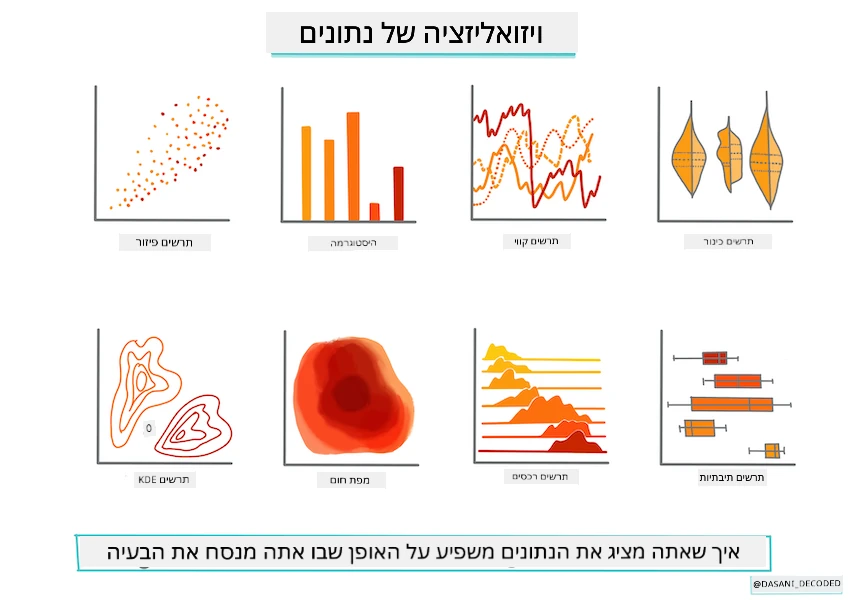
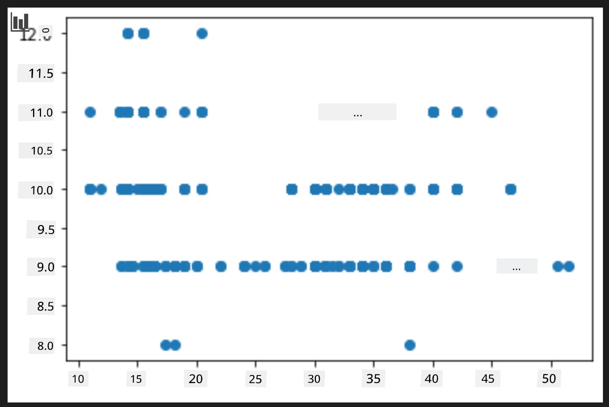
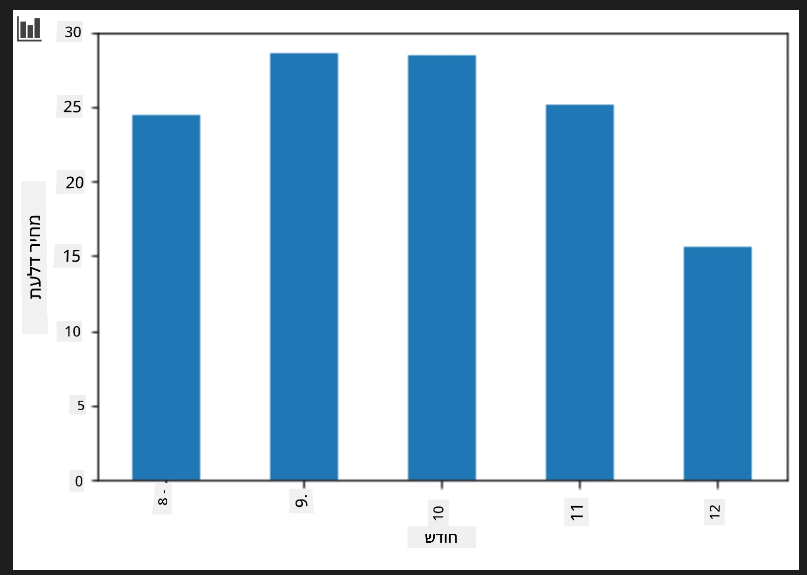
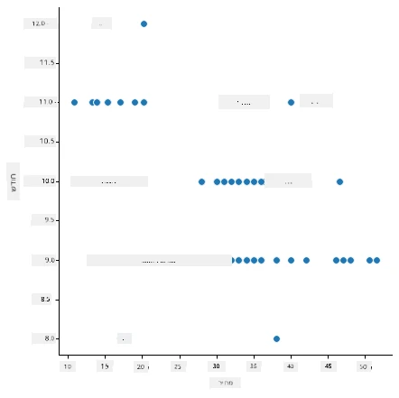
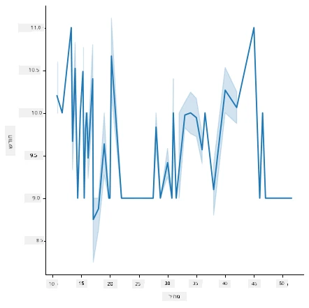
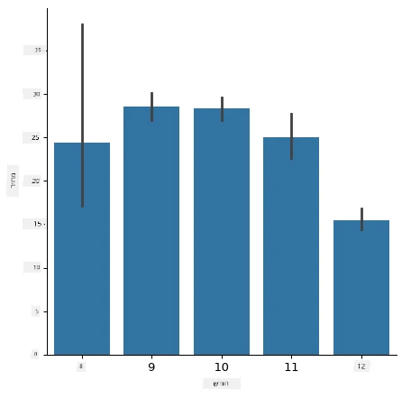
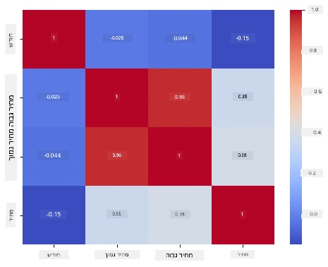

# לבנות מודל רגרסיה באמצעות Scikit-learn: להכין ול визуализировать נתונים



אינפוגרפיקה מאת [דאסאני מדיפאלי](https://twitter.com/dasani_decoded)

## [חידון מקדים להרצאה](https://ff-quizzes.netlify.app/en/ml/)

> ### [שיעור זה זמין גם ב-R!](../../../../2-Regression/2-Data/solution/R/lesson_2.html)

## מבוא

עכשיו כשאתה מוכן עם הכלים שאתה צריך כדי להתחיל להתמודד עם בניית מודל למידת מכונה עם Scikit-learn, אתה מוכן להתחיל לשאול שאלות לגבי הנתונים שלך. כשהינך עובד עם נתונים ומיישם פתרונות למידת מכונה, חשוב מאוד להבין איך לשאול את השאלה הנכונה כדי לפתוח כראוי את הפוטנציאל של קבוצת הנתונים שלך.

בשיעור זה תלמד:

- איך להכין את הנתונים שלך לבניית מודל.
- איך להשתמש ב-Matplotlib לוויזואליזציית נתונים.
- איך להשתמש ב-Seaborn לוויזואליזציית נתונים יותר הבעה.

## לשאול את השאלה הנכונה בנוגע לנתונים שלך

השאלה שאתה צריך לקבל עליה תשובה תכתיב איזה סוג של אלגוריתמי למידת מכונה תשתמש. ואיכות התשובה שתקבל תלויה במידה רבה בטבע הנתונים שלך.

עיין ב-[הנתונים](https://github.com/microsoft/ML-For-Beginners/blob/main/2-Regression/data/US-pumpkins.csv) שסופקו לשיעור זה. תוכל לפתוח את קובץ ה-.csv הזה ב-VS Code. מבט מהיר מראה מיד שיש רווחים וערבוב של מחרוזות ונתונים מספריים. יש גם עמודה מוזרה שנקראת 'Package' שבה הנתונים הם תערובת בין 'שקים', 'מכלים' וערכים אחרים. הנתונים, למעשה, מעט מבולגנים.

[](https://youtu.be/5qGjczWTrDQ "למידת מכונה למתחילים - איך לנתח ולנקות קבוצת נתונים")

> 🎥 לחץ על התמונה למעלה לסרטון קצר שעובר על הכנת הנתונים לשיעור זה.

למעשה, אינו נפוץ לקבל קבוצת נתונים שמוכנה להשתמש בה מלאה כדי ליצור מודל למידת מכונה מתוך הקופסה. בשיעור זה תלמד איך להכין קבוצת נתונים גולמית באמצעות ספריות פייתון סטנדרטיות. בנוסף, תלמד טכניקות שונות כדי להמחיש את הנתונים.

## מקרה בוחן: "שוק הדלעות"

בתיקיה זו תמצא קובץ .csv בתיקיה ראשית `data` בשם [US-pumpkins.csv](https://github.com/microsoft/ML-For-Beginners/blob/main/2-Regression/data/US-pumpkins.csv) הכולל 1757 שורות של נתונים על שוק הדלעות, מסווג לפי קבוצות לפי עיר. אלה נתונים גולמיים שהופקו מדוחות סטנדרטיים של שוקי המסחרי ייחודיים [Specialty Crops Terminal Markets Standard Reports](https://www.marketnews.usda.gov/mnp/fv-report-config-step1?type=termPrice) שמופצים על ידי משרד החקלאות של ארצות הברית.

### הכנת הנתונים

נתונים אלה הם ברשות הציבור. ניתן להורידם בקבצים נפרדים רבים, לכל עיר בנפרד, מאתר USDA. כדי למנוע יותר מדי קבצים נפרדים, איחדנו את כל הנתונים של הערים לטבלת נתונים אחת, כך שכבר הכנו קצת את הנתונים. לאחר מכן, נבחן את הנתונים מקרוב.

### נתוני הדלעות - מסקנות מוקדמות

מה אתה מבחין בנתונים האלה? כבר ראית שיש תערובת של מחרוזות, מספרים, חללים וערכים מוזרים שצריך להבין אותם.

איזו שאלה אפשר לשאול את הנתונים האלה, באמצעות טכניקת רגרסיה? מה דעתך על "לחזות את מחיר דלעת למכירה בחודש מסוים". כשאתה מסתכל שוב על הנתונים, יש כמה שינויים שצריך לבצע כדי ליצור מבנה נתונים הנדרש למשימה.
## תרגיל - ניתוח נתוני דלעות

נשתמש ב-[Pandas](https://pandas.pydata.org/), (שמתייחס ל-'Python Data Analysis'), כלי מאוד שימושי לעיצוב נתונים, כדי לנתח ולהכין את נתוני הדלעות הללו.

### תחילה, בדוק אם חסרים תאריכים

תחילה תצטרך לנקוט צעדים כדי לבדוק תאריכים חסרים:

1. המר את התאריכים לפורמט חודש (מדובר בתאריכים אמריקאיים, אז הפורמט הוא `MM/DD/YYYY`).
2. הפק את החודש לעמודה חדשה.

פתח את קובץ _notebook.ipynb_ ב-Visual Studio Code וייבא את הגיליון הנתונים למערך נתונים חדש של Pandas.

1. השתמש בפונקציה `head()` כדי לצפות בחמש השורות הראשונות.

    ```python
    import pandas as pd
    pumpkins = pd.read_csv('../data/US-pumpkins.csv')
    pumpkins.head()
    ```

    ✅ איזו פונקציה תשתמש כדי לראות את חמש השורות האחרונות?

1. בדוק אם יש נתונים חסרים במערך הנתונים הנוכחי:

    ```python
    pumpkins.isnull().sum()
    ```

    ישנם נתונים חסרים, אך אולי זה לא יהיה משמעותי למשימה הנוכחית.

1. כדי להקל על העבודה עם מערך הנתונים שלך, בחר רק את העמודות שאתה צריך, באמצעות הפונקציה `loc` שמחלצת מהמערך המקורי קבוצה של שורות (כפרמטר ראשון) ועמודות (כפרמטר שני). הביטוי `:` במקרה זה אומר "כל השורות".

    ```python
    columns_to_select = ['Package', 'Low Price', 'High Price', 'Date']
    pumpkins = pumpkins.loc[:, columns_to_select]
    ```

### שנית, חשב את מחיר הדלעת הממוצע

חשוב כיצד לחשב את המחיר הממוצע לדלעת בחודש מסוים. אילו עמודות תבחר למשימה זו? רמז: תצטרך 3 עמודות.

פתרון: קח את הממוצע של עמודות `Low Price` ו-`High Price` כדי למלא את עמודת המחיר החדשה, והמר את עמודת התאריך כך שתציג רק את החודש. למזלינו, לפי הבדיקה הנ"ל, אין נתונים חסרים לגבי תאריכים או מחירים.

1. כדי לחשב את הממוצע, הוסף את הקוד הבא:

    ```python
    price = (pumpkins['Low Price'] + pumpkins['High Price']) / 2

    month = pd.DatetimeIndex(pumpkins['Date']).month

    ```

   ✅ ניתן להדפיס כל נתון שברצונך לבדוק באמצעות `print(month)`.

2. עכשיו, העתק את הנתונים שהומרו למערך נתונים חדש של Pandas:

    ```python
    new_pumpkins = pd.DataFrame({'Month': month, 'Package': pumpkins['Package'], 'Low Price': pumpkins['Low Price'],'High Price': pumpkins['High Price'], 'Price': price})
    ```

    הדפסת מערך הנתונים תראה לך קבוצת נתונים נקייה ומסודרת שעליה תוכל לבנות את מודל הרגרסיה החדש שלך.

### אבל חכה! יש משהו מוזר כאן

אם תסתכל על עמודת `Package`, דלעות נמכרות בהרכב שונה במידה רבה. חלק נמכרו במידות '1 1/9 בושהל'ות', וחלק במידות '1/2 בושהל'ות', חלק לדלעת בודדת, חלק לפי פאונד, וחלק בקופסאות גדולות ברוחבים משתנים.

> נראה כי דלעות מאוד קשות לשקילה בעקביות

בחינה מעמיקה של הנתונים המקוריים, מעניין שכל דבר עם `Unit of Sale` שווה ל-'EACH' או 'PER BIN' יש גם את סוג ה-`Package` לפי אינץ', לפי מכל, או 'לכל אחד'. נראה כי דלעות קשות מאוד לשקילה בעקביות, אז נסנן אותן על ידי בחירת רק דלעות שמכילות את המחרוזת 'bushel' בעמודת ה-`Package` שלהן.

1. הוסף פילטר בראש הקובץ, מתחת לייבוא ה-.csv ההתחלתי:

    ```python
    pumpkins = pumpkins[pumpkins['Package'].str.contains('bushel', case=True, regex=True)]
    ```

    אם תדפיס את הנתונים עכשיו, תוכל לראות שאתה מקבל רק את כ-415 השורות של נתוני דלעות לפי בושהל.

### אבל חכה! יש עוד משהו שצריך לעשות

האם שמת לב שכמות הבושהל משתנה בין שורה לשורה? אתה צריך לנרמל את התמחור כך שתראה את המחירים לפי בושהל, אז בצע כמה חישובים כדי לאחד את זה.

1. הוסף את השורות האלה אחרי בלוק יצירת מערך הנתונים new_pumpkins:

    ```python
    new_pumpkins.loc[new_pumpkins['Package'].str.contains('1 1/9'), 'Price'] = price/(1 + 1/9)

    new_pumpkins.loc[new_pumpkins['Package'].str.contains('1/2'), 'Price'] = price/(1/2)
    ```

✅ לפי [The Spruce Eats](https://www.thespruceeats.com/how-much-is-a-bushel-1389308), משקל הבושהל תלוי בסוג התוצרת, מאחר שזהו מדד נפח. "בושהל של עגבניות, למשל, אמור לשקול 56 פאונד... עלים וירקות תופסים יותר נפח עם פחות משקל, אז בושהל של תרד שוקל רק 20 פאונד." זה די מסובך! לא נטריד את עצמנו בהמרת בושהל לפאונד, במקום זאת נמחיר לפי בושהל. כל הלימוד הזה של בושהלים של דלעות מראה כמה חשוב להבין את טבע הנתונים שלך!

עכשיו, תוכל לנתח את התמחור ליחידה בהתבסס על מדידת הבושהל שלהם. אם תדפיס את הנתונים פעם נוספת, ניתן לראות כיצד זה מנורמל.

✅ האם שמת לב שדלעות שנמכרות בחצי בושהל יקרות מאוד? תוכל להבין למה? רמז: דלעות קטנות הרבה יותר יקרות מדלעות גדולות, כנראה בגלל שיש הרבה יותר מהן בבושהל, בהתחשב במקום הלא מנוצל שמכילה דלעת עוגה גדולה ומחוררת אחת.

## אסטרטגיות ויזואליזציה

חלק מתפקיד מדען הנתונים הוא להמחיש את איכות וטבע הנתונים שהם עובדים איתם. לשם כך, הם לעיתים יוצרים ויזואליזציות מעניינות, תרשימים, גרפים וטבלאות, המראים היבטים שונים של הנתונים. כך הם יכולים להראות בצורה ויזואלית קשרים ופערים שקשה לגלות בדרך אחרת.

[](https://youtu.be/SbUkxH6IJo0 "למידת מכונה למתחילים - איך להמחיש נתונים עם Matplotlib")

> 🎥 לחץ על התמונה למעלה לסרטון קצר שעובר על ויזואליזציית הנתונים לשיעור זה.

ויזואליזציות יכולות גם לעזור לקבוע את טכניקת למידת המכונה המתאימה ביותר לנתונים. תרשים פיזור שנראה עוקב אחר קו, למשל, מצביע שהנתונים הם מועמדים טובים לתרגיל רגרסיה ליניארית.

ספריית ויזואליזציית נתונים אחת שעובדת טוב במחברות Jupyter היא [Matplotlib](https://matplotlib.org/) (שכבר ראית בשיעור הקודם).

> השג יותר ניסיון בוויזואליזציות נתונים ב-[המדריכים האלה](https://docs.microsoft.com/learn/modules/explore-analyze-data-with-python?WT.mc_id=academic-77952-leestott).

## תרגיל - התנסה ב-Matplotlib

נסה ליצור כמה תרשימים בסיסיים כדי להציג את מערך הנתונים החדש שיצרת זה עתה. מה תרשים קו בסיסי יציג?

1. ייבא את Matplotlib בראש הקובץ, מתחת לייבוא Pandas:

    ```python
    import matplotlib.pyplot as plt
    ```

1. הרץ מחדש את כל המחברת לרענון.
1. בתחתית המחברת, הוסף תא כדי לצייר את הנתונים כ-box plot:

    ```python
    price = new_pumpkins.Price
    month = new_pumpkins.Month
    plt.scatter(price, month)
    plt.show()
    ```

    

    האם תרשים זה שימושי? האם משהו בו מפתיע אותך?

    זה אינו שימושי במיוחד כי כל מה שהוא עושה הוא להציג את הנתונים שלך כהתפרסות נקודות בחודש נתון.

### להפוך אותו לשימושי

כדי שתרשימים יציגו נתונים שימושיים, בדרך כלל צריך לקבץ את הנתונים בצורה מסוימת. בוא ננסה ליצור תרשים שבו ציר ה-y מראה את החודשים והנתונים מראים את התפלגות הנתונים.

1. הוסף תא ליצירת תרשים עמודות מקובץ:

    ```python
    new_pumpkins.groupby(['Month'])['Price'].mean().plot(kind='bar')
    plt.ylabel("Pumpkin Price")
    ```

    

    זו ויזואליזציית נתונים שימושית יותר! נראה שהיא מצביעה שהמחיר הכי גבוה לדלעות הוא בספטמבר ואוקטובר. האם זה עונה על הציפייה שלך? למה או למה לא?

## תרגיל - התנסה ב-Seaborn

Matplotlib עוצמתי, אבל לפעמים נדרש הרבה קוד כדי ליצור תרשים מחודד. [Seaborn](https://seaborn.pydata.org/) היא ספרייה שבנויה _על גבי_ Matplotlib שמיועדת לוויזואליזציית נתונים סטטיסטית. היא עובדת ישירות עם מערכי הנתונים של Pandas, מיישמת סגנונות ברירת מחדל מושכים, ומאפשרת ליצור תרשימים אינפורמטיביים בפחות קוד. מכיוון ש-Seaborn מחזירה אובייקטים של Matplotlib, עדיין אפשר להשתמש בכל מה שכבר יודעים על Matplotlib כדי לכוונן את התוצאה.

> אם עדיין לא התקנת את Seaborn, התקן אותה באמצעות `pip install seaborn`.

1. ייבא את Seaborn בראש המחברת, מתחת ליבואים האחרים. נהוג לייבא אותה כ-`sns`:

    ```python
    import seaborn as sns
    ```

### תרשימי פיזור להראות קשרים

חלק גדול מחקר הנתונים לפני בניית מודל הוא חיפוש _קשרים_ בין משתנים. [תרשים פיזור](https://en.wikipedia.org/wiki/Scatter_plot) הוא אחד הכלים הטובים לכך: אם הנקודות נראות מעקבות אחר קו, שני המשתנים עשויים להיות מתואמים, וזה סימן טוב שמודל רגרסיה ליניארית יכול לעבוד.

1. צור מחדש את תרשים פיזור המחיר-לחודש מהפעם הקודמת, הפעם באמצעות [`relplot()`](https://seaborn.pydata.org/generated/seaborn.relplot.html) של Seaborn (תרשים יחסי), שעובד ישירות עם עמודות מערך הנתונים שלך:

    ```python
    sns.relplot(x="Price", y="Month", data=new_pumpkins)
    ```

    

    שים לב כיצד מעבירים את _שמות העמודות_ ואת מערך הנתונים, ו-Seaborn מטפל בתוויות הצירים בשבילך.

2. אפשר לעבור לתרשים קו על ידי העברת `kind="line"`. Seaborn אפילו מציירת רצועה מוצללת שמציגה את תחום האמון סביב הקו:

    ```python
    sns.relplot(x="Price", y="Month", kind="line", data=new_pumpkins)
    ```

    

    הנתונים הספציפיים האלה די רעשניים, אז תרשים קו לא הבחירה הברורה ביותר כאן — אבל הוא מראה כמה קל לשנות סוגי תרשימים ב-Seaborn.

### תרשימי עמודות להראות התפלגויות


קודם סידרת את הנתונים בעצמך כדי ליצור תרשים עמודות עם Matplotlib. הפונקציה [`catplot()`](https://seaborn.pydata.org/generated/seaborn.catplot.html) (תרשים קטגורי) של Seaborn יכולה לבצע את הסידור והאגרגציה עבורך. כבררת מחדל `kind="bar"` מציגה את הממוצע של כל קטגוריה יחד עם קו שחור המציין את מרווח האמון.

1. צור תרשים עמודות של מחיר ממוצע לכל חודש:

    ```python
    sns.catplot(x="Month", y="Price", data=new_pumpkins, kind="bar")
    ```

    

    זה מאשר את מה שראית עם Matplotlib — המחירים בשיא סביב ספטמבר ואוקטובר — אך Seaborn גם ממחיש כמה המחיר _משתנה_ בתוך כל חודש.

### מפות חום להראות קורלציות

תרשימי פיזור משווים שני משתנים בכל פעם. כשיש לך כמה עמודות מספריות, [מפת חום](https://en.wikipedia.org/wiki/Heat_map) מאפשרת לך לראות את עוצמת הקשר בין _כל_ זוג עמודות בבת אחת. זהו דרך נפוצה לזהות אילו תכונות קשורות ביותר לפני שבוחרים מה להכניס למודל (ואותו סוג תרשים משמש לאחר מכן להצגת מטריצות בילבול במיון).

1. בנה מטריצת קורלציה עם Pandas, ואז צייר אותה עם [`heatmap()`](https://seaborn.pydata.org/generated/seaborn.heatmap.html) של Seaborn. האפשרות `annot=True` מדפיסה את ערכי הקורלציה בכל תא:

    ```python
    correlations = new_pumpkins[['Month', 'Low Price', 'High Price', 'Price']].corr()
    sns.heatmap(correlations, annot=True, cmap="coolwarm")
    ```

    

    ערכים הקרובים ל-`1` (או `-1`) מצביעים על כך שהעמודות קשורות _בקו ישר_ בצורה חזקה. שים לב כיצד `Low Price` ו-`High Price` כמעט מושלמות בקורלציה ביניהן. מצד שני, `Month` מציגה קורלציה ליניארית חלשה למחיר — למרות שתרשים העמודות לעיל חשף שיא עונתי ברור בספטמבר ואוקטובר. זו מוסכמה חשובה: מקדם הקורלציה מודד רק קשרים _בקו ישר_, ולכן הוא עלול לפספס תבניות עונתיות או לא ליניאריות. ✅ מדוע כדאי להסתכל הן על מפת חום *והן* על תרשימים כמו תרשים העמודות לפני שקובעים אילו עמודות להשתמש בהם?

### Matplotlib או Seaborn?

שתי הספריות שכדאי להכיר:

- **Matplotlib** נותנת לך שליטה מדויקת על כל אלמנט בתרשים והיא הבסיס שעליו כמעט כל ספריית דיווח בפייתון מבוססת.
- **Seaborn** מספקת פונקציות ברמת אבחנה גבוהה יותר וערכות ברירת מחדל אטרקטיביות לתרשימים סטטיסטיים, עובדת ישירות עם dataframes, ולעיתים מהירה יותר לניתוח נתונים חקרני.

זרימת עבודה נפוצה היא להשתמש ב-Seaborn כדי לחקור את הנתונים במהירות, ואז לעבור ל-Matplotlib כשצריך להתאים את הפרטים.

---

## 🚀אתגר

חקור את סוגי הויזואליזציה השונים ש-Matplotlib ו-Seaborn מציעים. אילו סוגים מתאימים ביותר לבעיות רגרסיה?

## [חידון לאחר ההרצאה](https://ff-quizzes.netlify.app/en/ml/)

## סקירה ולימוד עצמי

עיין בדרכים הרבות להמחיש נתונים. ערוך רשימה של ספריות שונות הזמינות וציין אילו טובות למשימות שונות, למשל ויזואליזציות דו-ממדיות לעומת תלת-ממדיות. מה גילית?

## משימה

[חקירת ויזואליזציה](assignment.md)

---

<!-- CO-OP TRANSLATOR DISCLAIMER START -->
**כתב ויתור**:
מסמך זה תורגם באמצעות שירות תרגום אוטומטי [Co-op Translator](https://github.com/Azure/co-op-translator). למרות שאנו שואפים לדיוק, יש לקחת בחשבון שתרגומים אוטומטיים עלולים להכיל שגיאות או אי-דיוקים. יש להחשיב את המסמך המקורי בשפתו הטבעית כמקור הסמכות. למידע קריטי מומלץ להשתמש בתרגום מקצועי על ידי מתרגם אדם. אנו לא אחראים לכל אי-הבנה או פירוש שגוי הנובע מהשימוש בתרגום זה.
<!-- CO-OP TRANSLATOR DISCLAIMER END -->