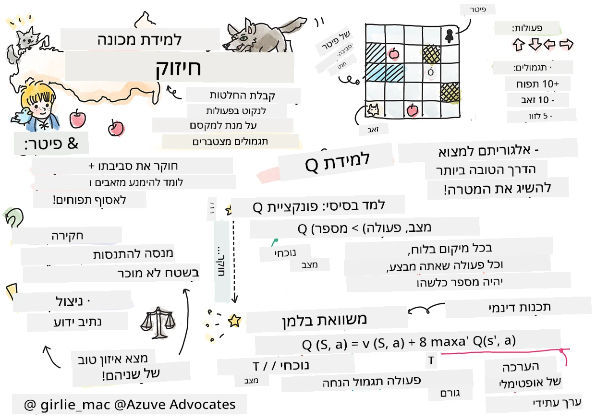
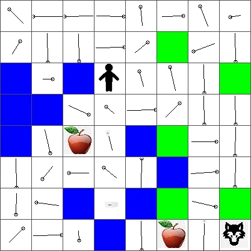

# מבוא ללמידת חיזוק ו-Q-Learning


> בישול של [Tomomi Imura](https://www.twitter.com/girlie_mac)

למידת חיזוק כוללת שלושה מושגים חשובים: הסוכן, כמה מצבים, וקבוצת פעולות לכל מצב. על ידי ביצוע פעולה במצב מסוים, מוענק לסוכן תגמול. שוב דמיינו את משחק המחשב סופר מריו. אתה מריו, אתה ברמת משחק, עומד ליד קצה צוק. מעליך יש מטבע. אתה בתור מריו, ברמת משחק, במיקום מסוים ... זה המצב שלך. הזזה צעד אחד ימינה (פעולה) תגרום לך ליפול מהקצה, וזו תיתן לך ציון מספרי נמוך. עם זאת, לחיצה על כפתור הקפיצה תאפשר לך לצבור נקודה ותישאר בחיים. זו תוצאה חיובית והיא צריכה להעניק ציון מספרי חיובי.

באמצעות למידת חיזוק וסימולטור (המשחק), ניתן ללמוד כיצד לשחק במשחק בכדי למקסם את התגמול שהוא הישרדות וצבירת נקודות מרביות.

[](https://www.youtube.com/watch?v=lDq_en8RNOo)

> 🎥 לחצו על התמונה למעלה כדי לשמוע את דימיטרי מדבר על למידת חיזוק

## [בחן טרם ההרצאה](https://ff-quizzes.netlify.app/en/ml/)

## תנאים מוקדמים והתקנה

בשיעור זה ננסה קוד בפייתון. עליך להיות מסוגל להריץ את קוד מחברת Jupyter של שיעור זה, במחשב שלך או בענן כלשהו.

ניתן לפתוח את [מחברת השיעור](https://github.com/microsoft/ML-For-Beginners/blob/main/8-Reinforcement/1-QLearning/notebook.ipynb) ולעבור דרכה לבנייה.

> **הערה:** אם אתה פותח את הקוד מהענן, עליך גם להוריד את קובץ [`rlboard.py`](https://github.com/microsoft/ML-For-Beginners/blob/main/8-Reinforcement/1-QLearning/rlboard.py) המשמש בקוד המחברת. הוסף אותו לאותה תיקייה של המחברת.

## מבוא

בשיעור זה נחקור את עולמו של **[פיטר והזאב](https://en.wikipedia.org/wiki/Peter_and_the_Wolf)**, בהשראת סיפור מוסיקלי מאת קומפוזיטור רוסי, [סרגיי פרוקופייב](https://en.wikipedia.org/wiki/Sergei_Prokofiev). נשתמש ב**למידת חיזוק** כדי לאפשר לפיטר לחקור את הסביבה שלו, לאסוף תפוחים טעימים ולהימנע מפגישה עם הזאב.

**למידת חיזוק** (RL) היא טכניקת למידה שמאפשרת לנו ללמוד התנהגות אופטימלית של **סוכן** בסביבה מסוימת על ידי הרצת ניסויים רבים. לסוכן בסביבה זו אמור להיות **מטרה**, המוגדרת על ידי **פונקציית תגמול**.

## הסביבה

לצורך פשטות, נחשיב את עולמו של פיטר כלוח מרובע בגודל `width` x `height`, כך:


כל תא בלוח זה יכול להיות:

* **קרקע**, שעליה פיטר ויצורים אחרים יכולים ללכת.
* **מים**, שעליהם כמובן אי אפשר ללכת.
* **עץ** או **דשא**, מקום למנוחה.
* **תפוח**, המייצג משהו שפיטר ישמח למצוא כדי להאכיל את עצמו.
* **זאב**, שהוא מסוכן ויש להימנע ממנו.

יש מודול פייתון נפרד, [`rlboard.py`](https://github.com/microsoft/ML-For-Beginners/blob/main/8-Reinforcement/1-QLearning/rlboard.py), שמכיל את הקוד לעבודה עם הסביבה הזו. מכיוון שקוד זה אינו חשוב להבנת המושגים שלנו, נייבא את המודול ונשתמש בו כדי ליצור את לוח הדוגמה (בלוק קוד 1):

```python
from rlboard import *

width, height = 8,8
m = Board(width,height)
m.randomize(seed=13)
m.plot()
```

קוד זה אמור להדפיס תמונה של הסביבה הדומה לזו למעלה.

## פעולות ומדיניות

בדוגמה שלנו, המטרה של פיטר היא למצוא תפוח, תוך הימנעות מהזאב וממכשולים אחרים. לשם כך, הוא יכול פשוט ללכת סביב עד שימצא תפוח.

לכן, בכל מיקום, הוא יכול לבחור בין הפעולות הבאות: למעלה, למטה, שמאלה וימינה.

נגדיר את הפעולות הללו כמילון, ונתאים אותן לזוגות של שינויים מתאימים בקואורדינטות. לדוגמה, הליכה ימינה (`R`) תתאים לזוג `(1,0)`. (בלוק קוד 2):

```python
actions = { "U" : (0,-1), "D" : (0,1), "L" : (-1,0), "R" : (1,0) }
action_idx = { a : i for i,a in enumerate(actions.keys()) }
```

לסיכום, האסטרטגיה והמטרה של התסריט הם כדלקמן:

- **האסטראטגיה**, של הסוכן שלנו (פיטר) מוגדרת על ידי מה שנקרא **מדיניות**. מדיניות היא פונקציה שמחזירה את הפעולה בכל מצב נתון. במקרה שלנו, המצב של הבעיה מיוצג על ידי הלוח, כולל המיקום הנוכחי של השחקן.

- **המטרה**, של למידת החיזוק היא בסופו של דבר ללמוד מדיניות טובה שתאפשר לנו לפתור את הבעיה ביעילות. עם זאת, כבסיס, נחשוב על המדיניות הפשוטה ביותר המכונה **הליכה אקראית**.

## הליכה אקראית

בואו קודם נפתור את הבעיה שלנו על ידי יישום אסטרטגיית הליכה אקראית. בהליכה אקראית נבחר אקראית את הפעולה הבאה מתוך הפעולות המותרות, עד שנגיע לתפוח (בלוק קוד 3).

1. יישם את ההליכה האקראית עם הקוד למטה:

    ```python
    def random_policy(m):
        return random.choice(list(actions))
    
    def walk(m,policy,start_position=None):
        n = 0 # מספר הצעדים
        # קבע מיקום התחלתי
        if start_position:
            m.human = start_position 
        else:
            m.random_start()
        while True:
            if m.at() == Board.Cell.apple:
                return n # הצלחה!
            if m.at() in [Board.Cell.wolf, Board.Cell.water]:
                return -1 # נאכל על ידי זאב או שט בלבול
            while True:
                a = actions[policy(m)]
                new_pos = m.move_pos(m.human,a)
                if m.is_valid(new_pos) and m.at(new_pos)!=Board.Cell.water:
                    m.move(a) # בצע את התנועה בפועל
                    break
            n+=1
    
    walk(m,random_policy)
    ```

    הקריאה ל-`walk` אמורה להחזיר את אורך המסלול המתאים, שיכול להשתנות בין ריצה לריצה.

1. הרץ את ניסוי ההליכה מספר פעמים (נאמר 100), והדפיס את הסטטיסטיקות המתקבלות (בלוק קוד 4):

    ```python
    def print_statistics(policy):
        s,w,n = 0,0,0
        for _ in range(100):
            z = walk(m,policy)
            if z<0:
                w+=1
            else:
                s += z
                n += 1
        print(f"Average path length = {s/n}, eaten by wolf: {w} times")
    
    print_statistics(random_policy)
    ```

    יש לשים לב שאורך הממוצע של מסלול הוא בין 30 ל-40 צעדים, שזה די הרבה, בהתחשב בכך שהמרחק הממוצע לתפוח הקרוב הוא כ-5-6 צעדים.

    ניתן גם לראות כיצד נראית התנועה של פיטר במהלך ההליכה האקראית:

    

## פונקציית תגמול

כדי להפוך את המדיניות שלנו לחכמה יותר, עלינו להבין אילו מהלכים "טובים יותר" מאחרים. לשם כך, עלינו להגדיר את המטרה שלנו.

המטרה יכולה להיות מוגדרת במונחים של **פונקציית תגמול**, אשר תחזיר ערך ניקוד עבור כל מצב. ככל שהמספר גבוה יותר, פונקציית התגמול טובה יותר. (בלוק קוד 5)

```python
move_reward = -0.1
goal_reward = 10
end_reward = -10

def reward(m,pos=None):
    pos = pos or m.human
    if not m.is_valid(pos):
        return end_reward
    x = m.at(pos)
    if x==Board.Cell.water or x == Board.Cell.wolf:
        return end_reward
    if x==Board.Cell.apple:
        return goal_reward
    return move_reward
```

דבר מעניין לגבי פונקציות תגמול הוא שבמרבית המקרים, *ניתן לנו תגמול משמעותי רק בסוף המשחק*. משמעות הדבר היא שהאלגוריתם שלנו צריך איכשהו לזכור צעדים "טובים" שהובילו לתגמול חיובי בסוף, ולהגביר את משמעותם. באופן דומה, כל המהלכים שבהם התוצאות רעות צריכים להיות מ discouraged.

## Q-Learning

אלגוריתם שנדון כאן נקרא **Q-Learning**. באלגוריתם זה, המדיניות מוגדרת על ידי פונקציה (או מבנה נתונים) שנקרא **טבלת Q**. היא רושמת את "האיכות" של כל פעולות בכל מצב נתון.

היא נקראת טבלת Q כי לרוב נוח לייצגה כמטבלה, או מערך רב-ממדי. כיוון שלוח שלנו בגודל `width` x `height`, נוכל לייצג את טבלת Q באמצעות מערך numpy בצורת `width` x `height` x `len(actions)`: (בלוק קוד 6)

```python
Q = np.ones((width,height,len(actions)),dtype=np.float)*1.0/len(actions)
```

שימו לב שאנו מאתחלים את כל הערכים בטבלת Q בערך שווה, במקרה שלנו - 0.25. זה מתאים למדיניות "הליכה אקראית", מכיוון שכל המהלכים בכל מצב הם באותה מידה טובים. ניתן להעביר את טבלת Q לפונקציית `plot` כדי להמחיש את הטבלה על הלוח: `m.plot(Q)`.


במרכז כל תא יש "חץ" שמצביע על הכיוון המועדף לתנועה. כיוון שכל הכיוונים שווים, מוצג נקודה.

עכשיו עלינו להריץ את הסימולציה, לחקור את הסביבה שלנו, וללמוד התפלגות טובה יותר של ערכי טבלת Q, שתאפשר לנו למצוא את הדרך לתפוח מהר יותר.

## מהות Q-Learning: משוואת בלמן

ברגע שנתחיל לזוז, כל פעולה תקבל תגמול מתאים, כלומר נוכל תיאורטית לבחור את הפעולה הבאה על בסיס התגמול המיידי הגבוה ביותר. אולם ברוב המצבים, המהלך לא ישיג את מטרתנו של להגיע לתפוח, ולכן איננו יכולים להחליט מייד איזה כיוון הוא טוב יותר.

> זכרו שזה לא התוצאה המיידית שחשובה, אלא התוצאה הסופית, שנקבל בסוף הסימולציה.

על מנת להתחשב בתגמול המאוחר הזה, עלינו להשתמש בעקרונות **[תכנות דינמי](https://en.wikipedia.org/wiki/Dynamic_programming)**, שמאפשרים לנו לחשוב על בעיה באופן רקורסיבי.

נניח שאנו כעת במצב *s*, ואנו רוצים לעבור למצב הבא *s'*. באמצעות המעבר נקבל את התגמול המיידי *r(s,a)*, המוגדר על ידי פונקציית התגמול, בתוספת תגמול עתידי כלשהו. אם נניח שטבלת Q שלנו משקפת נכונה את "המשיכה" של כל פעולה, אז במצב *s'* נבחר פעולה *a* המתאימה לערך המקסימלי של *Q(s',a')*. לכן, התגמול העתידי הטוב ביותר שנוכל לקבל במצב *s* יוגדר כ-`max`<sub>a'</sub>*Q(s',a')* (מקסימום מחושב על כל הפעולות האפשריות *a'* במצב *s'*).

נוסחת בלמן לחישוב ערך טבלת Q במצב *s*, עבור פעולה *a*, היא:


כאן γ הוא מה שנקרא **מקדם הנחה** שקובע עד כמה יש להעדיף את התגמול הנוכחי על פני תגמול עתידי ולהפך.

## אלגוריתם למידה

בהתבסס על המשוואה שלמעלה, נכתוב כעת קוד מזויף לאלגוריתם הלמידה שלנו:

* אתחל את טבלת Q עם ערכים שווים לכל המצבים והפעולות
* הגדר שיעור למידה α ← 1
* חזור על הסימולציה מספר פעמים
   1. התחל במיקום אקראי
   1. חזור
        1. בחר פעולה *a* במצב *s*
        2. בצע את הפעולה על ידי מעבר למצב חדש *s'*
        3. אם נתקלת בתנאי סוף משחק, או שהתגמול הכולל קטן מדי - יצא מהסימולציה  
        4. חשב תגמול *r* במצב החדש
        5. עדכן את פונקציית Q לפי משוואת בלמן: *Q(s,a)* ← *(1-α)Q(s,a)+α(r+γ max<sub>a'</sub>Q(s',a'))*
        6. *s* ← *s'*
        7. עדכן את התגמול הכולל והקטן את α.

## ניצול מול חקר

באלגוריתם שלעיל לא ציינו בדיוק כיצד לבחור פעולה בשלב 2.1. אם נבחר את הפעולה באופן אקראי, נחקור אקראית את הסביבה, ויש סיכוי גבוה שנמות לעיתים קרובות ונבדוק אזורים שאליהם בדרך כלל לא היינו הולכים. גישה חלופית תהיה **לנצל** את ערכי טבלת Q שכבר ידועים, ובכך לבחור את הפעולה הטובה ביותר (עם ערך טבלת Q גבוה יותר) במצב *s*. עם זאת, זה ימנע מאיתנו לחקור מצבים אחרים, וקיים סיכוי שלא נמצא את הפתרון האופטימלי.

לכן, הגישה הטובה ביותר היא ליצור איזון בין חקר לניצול. זה יכול להיעשות על ידי בחירת הפעולה במצב *s* עם הסתברויות פרופורציונליות לערכים בטבלת Q. בתחילה, כאשר ערכי טבלת Q כולם זהים, זה יתאים לבחירה אקראית, אך ככל שנלמד יותר על הסביבה שלנו, נהיה יותר סבירים לעקוב אחרי המסלול האופטימלי תוך מתן אפשרות לסוכן לבחור את הנתיב הלא נבדק מדי פעם.

## יישום בפייתון

אנו מוכנים כעת ליישם את אלגוריתם הלמידה. לפני כן, אנו צריכים פונקציה שתמיר מספרים שרירותיים בטבלת Q לווקטור של הסתברויות עבור הפעולות המתאימות.

1. צור פונקציה `probs()`:

    ```python
    def probs(v,eps=1e-4):
        v = v-v.min()+eps
        v = v/v.sum()
        return v
    ```

    אנו מוסיפים כמה `eps` לווקטור המקורי כדי להימנע מחלוקה באפס במקרה הראשוני, כאשר כל רכיבי הווקטור זהים.

הרץ את אלגוריתם הלמידה לאורך 5000 ניסויים, המכונים גם ** epochs **: (בלוק קוד 8)
```python
    for epoch in range(5000):
    
        # בחר נקודה התחלתית
        m.random_start()
        
        # התחל לנוע
        n=0
        cum_reward = 0
        while True:
            x,y = m.human
            v = probs(Q[x,y])
            a = random.choices(list(actions),weights=v)[0]
            dpos = actions[a]
            m.move(dpos,check_correctness=False) # אנו מאפשרים לשחקן לזוז מחוץ ללוח, מה שמסיים את הפרק
            r = reward(m)
            cum_reward += r
            if r==end_reward or cum_reward < -1000:
                lpath.append(n)
                break
            alpha = np.exp(-n / 10e5)
            gamma = 0.5
            ai = action_idx[a]
            Q[x,y,ai] = (1 - alpha) * Q[x,y,ai] + alpha * (r + gamma * Q[x+dpos[0], y+dpos[1]].max())
            n+=1
```

לאחר ביצוע האלגוריתם, טבלת Q אמורה להתעדכן בערכים המגדירים את המשיכה של פעולות שונות בכל שלב. נוכל לנסות להמחיש את טבלת Q על ידי ציור וקטור בכל תא שיצביע בכיוון הרצוי לתנועה. לצורך פשטות, אנו מציירים מעגל קטן במקום ראש חץ.



## בדיקת המדיניות

מכיוון שטבלת Q מפרטת את ה"משיכה" של כל פעולה בכל מצב, קל לשימוש בה כדי להגדיר ניווט יעיל בעולם שלנו. בפשטות, ניתן לבחור את הפעולה המתאימה לערך הגבוה ביותר בטבלת Q: (בלוק קוד 9)

```python
def qpolicy_strict(m):
        x,y = m.human
        v = probs(Q[x,y])
        a = list(actions)[np.argmax(v)]
        return a

walk(m,qpolicy_strict)
```


> אם תנסו את הקוד למעלה מספר פעמים, ייתכן שתבחינו שברגעים מסוימים הוא "נתקע", ותצטרכו ללחוץ על כפתור העצור במחברת כדי להפסיק אותו. זה קורה מאחר שיכולות להיות מצבים בהם שני המצבים "מצביעים" זה על זה מבחינת ערך Q אופטימלי, ובמקרה כזה הסוכנים מוצאים את עצמם נעים בין אותם מצבים ללא הגבלה.

## 🚀אתגר

> **משימה 1:** שנו את פונקציית `walk` כך שתמנע מהאורך המקסימלי של המסלול לעבור מספר מסוים של צעדים (נניח, 100), וצפו בקוד למעלה מחזיר ערך זה מעת לעת.

> **משימה 2:** שנו את פונקציית `walk` כך שהיא לא תחזור למקומות בהם כבר הייתה בעבר. זה ימנע מ-`walk` להיכנס ללופים, אולם הסוכן עדיין עלול להיתקע במקום ממנו הוא לא יכול להיחלץ.

## ניווט

מדיניות ניווט טובה יותר תהיה זו שהשתמשנו בה בזמן האימון, שמשלבת ניצול וחיפוש. במדיניות זו נבחר כל פעולה עם הסתברות מסוימת, בפרופורציה לערכים בטבלת Q. אסטרטגיה זו יכולה עדיין לגרום לסוכן לחזור למקום שכבר חקר, אבל, כפי שרואים מהקוד למטה, היא מביאה לאורך ממוצע קצר מאוד למסלול למיקום הרצוי (זכרו ש-`print_statistics` מפעילה את הסימולציה 100 פעמים): (בלוק קוד 10)

```python
def qpolicy(m):
        x,y = m.human
        v = probs(Q[x,y])
        a = random.choices(list(actions),weights=v)[0]
        return a

print_statistics(qpolicy)
```

לאחר הרצת הקוד הזה, אתם אמורים לקבל אורך מסלול ממוצע קטן בהרבה מאשר קודם, בתחום של 3-6.

## חקירת תהליך הלמידה

כפי שציינו, תהליך הלמידה הוא איזון בין חקר למידת הידע שנצבר אודות מבנה מרחב הבעיה. ראינו שהתוצאות של הלמידה (היכולת לעזור לסוכן למצוא מסלול קצר למטרה) השתפרו, אך מעניין גם לעקוב כיצד אורך המסלול הממוצע מתנהג במהלך תהליך הלמידה:


את תהליך הלמידה ניתן לסכם כך:

- **אורך המסלול הממוצע עולה**. מה שאנחנו רואים כאן הוא שבתתחילה, אורך המסלול הממוצע עולה. זה ככל הנראה נובע מכך שכאשר איננו יודעים דבר על הסביבה, אנחנו עלולים להיכנס למצבים לא טובים, כמו מים או זאב. ככל שלומדים יותר ומתחילים להשתמש בידע זה, ניתן לחקור את הסביבה לאורך זמן רב יותר, אך עדיין אנו לא יודעים היטב איפה התפוחים נמצאים.

- **אורך המסלול מתקצר ככל שמלמדים יותר**. ברגע שלומדים מספיק, הסוכן מצליח להשיג את המטרה ביתר קלות, ואורך המסלול מתחיל להתקצר. עם זאת, אנחנו עדיין פתוחים לחקר, ולכן לעיתים הולכים עם סיבוב מהמסלול הטוב ביותר ובודקים אופציות חדשות, מה שגורם לאורך המסלול להיות ארוך יותר מהאופטימלי.

- **אורך המסלול עולה בפתאומיות**. בנוסף אנחנו מבחינים בגרף שכמה פעמים האורך עלה בפתאומיות. זה מצביע על אופיו האקראי של התהליך, ועל כך שבנקודה מסוימת יכול להתקלקל טבלת ה-Q על ידי כתיבה מחדש של ערכים חדשים. יש להפחית זאת ככל הניתן על ידי הקטנת קצב הלמידה (לדוגמה, לקראת סוף האימון, אנו מעדכנים את ערכי טבלת ה-Q על ידי ערך קטן בלבד).

בסך הכול, חשוב לזכור שהצלחת ותוצאות תהליך הלמידה תלויות במידה רבה בפרמטרים כמו קצב הלמידה, דעיכת קצב הלמידה, וגורם ההנחה. אלו קרויים לעיתים **היפרפרמטרים**, כדי להבדיל אותם מ-**פרמטרים**, אותם אנו עושים אופטימיזציה במהלך האימון (לדוגמה, ערכי טבלת ה-Q). תהליך מציאת ערכי ההיפרפרמטר הטובים נקרא **אופטימיזציית היפרפרמטרים**, ומגיע לו נושא נפרד.

## [חידון לאחר ההרצאה](https://ff-quizzes.netlify.app/en/ml/)

## מטלה
[עולם יותר ריאליסטי](assignment.md)

---

<!-- CO-OP TRANSLATOR DISCLAIMER START -->
**כתב ויתור**:
מסמך זה תורגם באמצעות שירות תרגום אוטומטי [Co-op Translator](https://github.com/Azure/co-op-translator). למרות שאנו שואפים לדיוק, יש לקחת בחשבון שתרגומים אוטומטיים עלולים להכיל שגיאות או אי-דיוקים. יש להחשיב את המסמך המקורי בשפתו הטבעית כמקור הסמכות. למידע קריטי מומלץ להשתמש בתרגום מקצועי על ידי מתרגם אדם. אנו לא אחראים לכל אי-הבנה או פירוש שגוי הנובע מהשימוש בתרגום זה.
<!-- CO-OP TRANSLATOR DISCLAIMER END -->