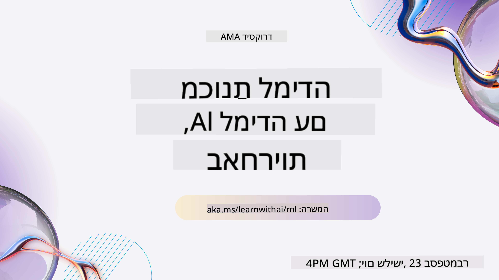
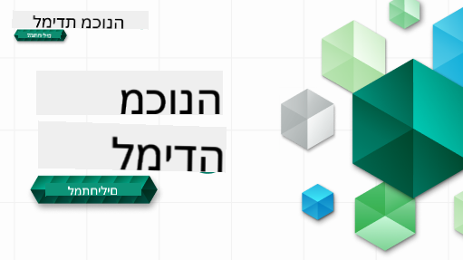

<!--
CO_OP_TRANSLATOR_METADATA:
{
  "original_hash": "7a13afb3674838f557d61f8d67e4d5f8",
  "translation_date": "2025-10-24T09:14:42+00:00",
  "source_file": "README.md",
  "language_code": "he"
}
-->
  
  
  
  
  

  
  
  

### 🌐 תמיכה רב-שפתית  

#### נתמך באמצעות GitHub Action (אוטומטי ותמיד מעודכן)  

[ערבית](../ar/README.md) | [בנגלית](../bn/README.md) | [בולגרית](../bg/README.md) | [בורמזית (מיאנמר)](../my/README.md) | [סינית (פשוטה)](../zh/README.md) | [סינית (מסורתית, הונג קונג)](../hk/README.md) | [סינית (מסורתית, מקאו)](../mo/README.md) | [סינית (מסורתית, טייוואן)](../tw/README.md) | [קרואטית](../hr/README.md) | [צ'כית](../cs/README.md) | [דנית](../da/README.md) | [הולנדית](../nl/README.md) | [אסטונית](../et/README.md) | [פינית](../fi/README.md) | [צרפתית](../fr/README.md) | [גרמנית](../de/README.md) | [יוונית](../el/README.md) | [עברית](./README.md) | [הינדית](../hi/README.md) | [הונגרית](../hu/README.md) | [אינדונזית](../id/README.md) | [איטלקית](../it/README.md) | [יפנית](../ja/README.md) | [קוריאנית](../ko/README.md) | [ליטאית](../lt/README.md) | [מלאית](../ms/README.md) | [מרטהי](../mr/README.md) | [נפאלית](../ne/README.md) | [נורווגית](../no/README.md) | [פרסית (פארסי)](../fa/README.md) | [פולנית](../pl/README.md) | [פורטוגזית (ברזיל)](../br/README.md) | [פורטוגזית (פורטוגל)](../pt/README.md) | [פונג'בית (גורמוקי)](../pa/README.md) | [רומנית](../ro/README.md) | [רוסית](../ru/README.md) | [סרבית (קירילית)](../sr/README.md) | [סלובקית](../sk/README.md) | [סלובנית](../sl/README.md) | [ספרדית](../es/README.md) | [סוואהילית](../sw/README.md) | [שוודית](../sv/README.md) | [טאגאלוג (פיליפינית)](../tl/README.md) | [טמילית](../ta/README.md) | [תאית](../th/README.md) | [טורקית](../tr/README.md) | [אוקראינית](../uk/README.md) | [אורדו](../ur/README.md) | [וייטנאמית](../vi/README.md)  

#### הצטרפו לקהילה שלנו  

  

יש לנו סדרת לימוד עם AI ב-Discord, למדו עוד והצטרפו אלינו ב-[סדרת לימוד עם AI](https://aka.ms/learnwithai/discord) בין 18 ל-30 בספטמבר, 2025. תקבלו טיפים וטריקים לשימוש ב-GitHub Copilot למדעי הנתונים.  

  

# למידת מכונה למתחילים - תוכנית לימודים  

> 🌍 טיילו ברחבי העולם בזמן שאנחנו חוקרים למידת מכונה דרך תרבויות העולם 🌍  

מומחי הענן במיקרוסופט שמחים להציע תוכנית לימודים בת 12 שבועות ו-26 שיעורים על **למידת מכונה**. בתוכנית זו תלמדו על מה שמכונה לעיתים **למידת מכונה קלאסית**, תוך שימוש בעיקר בספריית Scikit-learn והימנעות מלמידה עמוקה, שמכוסה בתוכנית הלימודים שלנו [AI למתחילים](https://aka.ms/ai4beginners). שלבו את השיעורים הללו עם תוכנית הלימודים שלנו ['מדעי הנתונים למתחילים'](https://aka.ms/ds4beginners), גם כן!  

טיילו איתנו ברחבי העולם כשאנחנו מיישמים את הטכניקות הקלאסיות הללו על נתונים מאזורים שונים בעולם. כל שיעור כולל מבחנים לפני ואחרי השיעור, הוראות כתובות להשלמת השיעור, פתרון, משימה ועוד. הפדגוגיה מבוססת הפרויקטים שלנו מאפשרת לכם ללמוד תוך כדי בנייה, דרך מוכחת להטמעת מיומנויות חדשות.  

**✍️ תודה רבה למחברים שלנו** ג'ן לופר, סטיבן האוול, פרנצ'סקה לזארי, טומומי אימורה, קסי ברוויו, דמיטרי סושניקוב, כריס נורינג, אנירבן מוקרג'י, אורנלה אלטוניאן, רות יעקובו ואיימי בויד  

**🎨 תודה גם למאיירים שלנו** טומומי אימורה, דאסאני מדיפאלי וג'ן לופר  

**🙏 תודה מיוחדת 🙏 למחברי, מבקרי ותורמי התוכן של שגרירי הסטודנטים של מיקרוסופט**, במיוחד רישיט דגלי, מוחמד סאקיב חאן אינאן, רוהן ראג', אלכסנדרו פטרסקו, אבישק ג'ייסוואל, נאורין טבאסום, יואן סמואילה וסניגדה אגרוואל  

**🤩 תודה מיוחדת לשגרירי הסטודנטים של מיקרוסופט אריק וונג'או, ג'סלין סונדהי ווידושי גופטה על שיעורי ה-R שלנו!**  

# התחלת העבודה  

עקבו אחר השלבים הבאים:  
1. **צרו Fork למאגר**: לחצו על כפתור "Fork" בפינה הימנית העליונה של עמוד זה.  
2. **שכפלו את המאגר**: `git clone https://github.com/microsoft/ML-For-Beginners.git`  

> [מצאו את כל המשאבים הנוספים לקורס זה באוסף Microsoft Learn שלנו](https://learn.microsoft.com/en-us/collections/qrqzamz1nn2wx3?WT.mc_id=academic-77952-bethanycheum)  

> 🔧 **זקוקים לעזרה?** בדקו את [מדריך פתרון הבעיות שלנו](TROUBLESHOOTING.md) לפתרונות לבעיות נפוצות בהתקנה, הגדרה והרצת שיעורים.  

**[סטודנטים](https://aka.ms/student-page)**, כדי להשתמש בתוכנית הלימודים הזו, צרו Fork למאגר כולו לחשבון GitHub שלכם והשלימו את התרגילים בעצמכם או בקבוצה:  

- התחילו עם מבחן לפני השיעור.  
- קראו את השיעור והשלימו את הפעילויות, עצרו והרהרו בכל בדיקת ידע.  
- נסו ליצור את הפרויקטים על ידי הבנת השיעורים במקום להריץ את קוד הפתרון; עם זאת, קוד זה זמין בתיקיות `/solution` בכל שיעור מבוסס פרויקט.  
- עשו את המבחן לאחר השיעור.  
- השלימו את האתגר.  
- השלימו את המשימה.  
- לאחר השלמת קבוצת שיעורים, בקרו ב-[לוח הדיונים](https://github.com/microsoft/ML-For-Beginners/discussions) ו"למדו בקול רם" על ידי מילוי מדד PAT המתאים. 'PAT' הוא כלי הערכת התקדמות שהוא מדד שאתם ממלאים כדי לקדם את הלמידה שלכם. תוכלו גם להגיב ל-PATs אחרים כדי שנלמד יחד.  

> ללימוד נוסף, אנו ממליצים לעקוב אחר [מודולים ונתיבי לימוד של Microsoft Learn](https://docs.microsoft.com/en-us/users/jenlooper-2911/collections/k7o7tg1gp306q4?WT.mc_id=academic-77952-leestott).  

**מורים**, כללנו [כמה הצעות](for-teachers.md) כיצד להשתמש בתוכנית הלימודים הזו.  

---

## סרטוני הדרכה  

חלק מהשיעורים זמינים כסרטונים קצרים. תוכלו למצוא את כולם בתוך השיעורים, או ב-[רשימת ההשמעה של ML למתחילים בערוץ YouTube של Microsoft Developer](https://aka.ms/ml-beginners-videos) על ידי לחיצה על התמונה למטה.  

  

---

## הכירו את הצוות  

  

**Gif מאת** [Mohit Jaisal](https://linkedin.com/in/mohitjaisal)  

> 🎥 לחצו על התמונה למעלה לסרטון על הפרויקט והאנשים שיצרו אותו!  

---

## פדגוגיה  

בחרנו בשני עקרונות פדגוגיים בעת בניית תוכנית הלימודים הזו: להבטיח שהיא תהיה **מבוססת פרויקטים** ושתכלול **מבחנים תכופים**. בנוסף, לתוכנית הלימודים יש **נושא משותף** שמעניק לה לכידות.  

על ידי הבטחת התאמת התוכן לפרויקטים, התהליך נעשה יותר מרתק עבור סטודנטים ושימור המושגים יוגבר. בנוסף, מבחן בעל סיכון נמוך לפני השיעור מכוון את כוונת הסטודנט ללימוד נושא, בעוד מבחן שני לאחר השיעור מבטיח שימור נוסף. תוכנית הלימודים הזו תוכננה להיות גמישה ומהנה וניתן לקחת אותה בשלמותה או בחלקים. הפרויקטים מתחילים קטנים והופכים מורכבים יותר לקראת סוף מחזור 12 השבועות. תוכנית הלימודים כוללת גם פוסט-סקריפט על יישומים אמיתיים של ML, שניתן להשתמש בו כקרדיט נוסף או כבסיס לדיון.  

> מצאו את [קוד ההתנהגות](CODE_OF_CONDUCT.md), [תרומה](CONTRIBUTING.md), [תרגום](TRANSLATIONS.md), ו[פתרון בעיות](TROUBLESHOOTING.md) שלנו. נשמח לקבל את המשוב הבונה שלכם!  

## כל שיעור כולל  

- סקיצה אופציונלית  
- סרטון משלים אופציונלי  
- סרטון הדרכה (חלק מהשיעורים בלבד)  
- [מבחן חימום לפני השיעור](https://ff-quizzes.netlify.app/en/ml/)  
- שיעור כתוב  
- עבור שיעורים מבוססי פרויקט, מדריכים שלב אחר שלב כיצד לבנות את הפרויקט  
- בדיקות ידע  
- אתגר  
- קריאה משלימה  
- משימה  
- [מבחן לאחר השיעור](https://ff-quizzes.netlify.app/en/ml/)  

> **הערה לגבי שפות**: שיעורים אלו נכתבים בעיקר ב-Python, אך רבים זמינים גם ב-R. כדי להשלים שיעור ב-R, עברו לתיקיית `/solution` וחפשו שיעורי R. הם כוללים סיומת .rmd שמייצגת קובץ **R Markdown** שניתן להגדירו בפשטות כהטמעה של `קטעי קוד` (של R או שפות אחרות) ו`כותרת YAML` (שמנחה כיצד לעצב פלטים כמו PDF) בתוך `מסמך Markdown`. כך, הוא משמש כמסגרת כתיבה לדוגמה למדעי הנתונים מכיוון שהוא מאפשר לכם לשלב את הקוד שלכם, הפלט שלו והמחשבות שלכם על ידי כתיבתם ב-Markdown. יתרה מכך, ניתן לעבד מסמכי R Markdown לפורמטים כמו PDF, HTML או Word.  

> **הערה לגבי מבחנים**: כל המבחנים נמצאים בתיקיית [Quiz App](../../quiz-app), עבור 52 מבחנים בסך הכל, כל אחד עם שלוש שאלות. הם מקושרים מתוך השיעורים אך ניתן להריץ את אפליקציית המבחנים באופן מקומי; עקבו אחר ההוראות בתיקיית `quiz-app` כדי לארח באופן מקומי או לפרוס ל-Azure.  

| מספר שיעור |                             נושא                              |                   קבוצת שיעורים                   | מטרות למידה                                                                                                             |                                                              שיעור מקושר                                                               |                        מחבר                        |  
| :-----------: | :------------------------------------------------------------: | :-------------------------------------------------: | ------------------------------------------------------------------------------------------------------------------------------- | :--------------------------------------------------------------------------------------------------------------------------------------: | :--------------------------------------------------: |  
|      01       |                מבוא ללמידת מכונה                |      [Introduction](1-Introduction/README.md)       | למדו את המושגים הבסיסיים מאחורי למידת מכונה                                                                                |                                             [Lesson](1-Introduction/1-intro-to-ML/README.md)                                             |                       מוחמד                       |
|      02       |                ההיסטוריה של למידת מכונה                 |      [Introduction](1-Introduction/README.md)       | למדו את ההיסטוריה שמאחורי התחום הזה                                                                                         |                                            [Lesson](1-Introduction/2-history-of-ML/README.md)                                            |                     ג'ן ואיימי                      |
|      03       |                 הוגנות ולמידת מכונה                  |      [Introduction](1-Introduction/README.md)       | מהם הנושאים הפילוסופיים החשובים סביב הוגנות שעל התלמידים לשקול בעת בניית והפעלת מודלים של למידת מכונה? |                                              [Lesson](1-Introduction/3-fairness/README.md)                                               |                        טומומי                        |
|      04       |                טכניקות ללמידת מכונה                 |      [Introduction](1-Introduction/README.md)       | אילו טכניקות חוקרי למידת מכונה משתמשים כדי לבנות מודלים של למידת מכונה?                                                                       |                                          [Lesson](1-Introduction/4-techniques-of-ML/README.md)                                           |                    כריס וג'ן                     |
|      05       |                   מבוא לרגרסיה                   |        [Regression](2-Regression/README.md)         | התחילו עם Python ו-Scikit-learn עבור מודלים של רגרסיה                                                                  |         [Python](2-Regression/1-Tools/README.md) • [R](../../2-Regression/1-Tools/solution/R/lesson_1.html)         |      ג'ן • אריק ונג'או       |
|      06       |                מחירי דלעת בצפון אמריקה 🎃                |        [Regression](2-Regression/README.md)         | ויזואליזציה וניקוי נתונים כהכנה ללמידת מכונה                                                                                  |          [Python](2-Regression/2-Data/README.md) • [R](../../2-Regression/2-Data/solution/R/lesson_2.html)          |      ג'ן • אריק ונג'או       |
|      07       |                מחירי דלעת בצפון אמריקה 🎃                |        [Regression](2-Regression/README.md)         | בניית מודלים של רגרסיה ליניארית ופולינומית                                                                                   |        [Python](2-Regression/3-Linear/README.md) • [R](../../2-Regression/3-Linear/solution/R/lesson_3.html)        |      ג'ן ודמיטרי • אריק ונג'או       |
|      08       |                מחירי דלעת בצפון אמריקה 🎃                |        [Regression](2-Regression/README.md)         | בניית מודל רגרסיה לוגיסטית                                                                                               |     [Python](2-Regression/4-Logistic/README.md) • [R](../../2-Regression/4-Logistic/solution/R/lesson_4.html)      |      ג'ן • אריק ונג'או       |
|      09       |                          אפליקציית אינטרנט 🔌                          |           [Web App](3-Web-App/README.md)            | בניית אפליקציית אינטרנט לשימוש במודל שלכם                                                                                       |                                                 [Python](3-Web-App/1-Web-App/README.md)                                                  |                         ג'ן                          |
|      10       |                 מבוא לסיווג                 |    [Classification](4-Classification/README.md)     | ניקוי, הכנה וויזואליזציה של הנתונים שלכם; מבוא לסיווג                                                            | [Python](4-Classification/1-Introduction/README.md) • [R](../../4-Classification/1-Introduction/solution/R/lesson_10.html)  | ג'ן וקאסי • אריק ונג'או |
|      11       |             מטבחים אסיאתיים והודיים טעימים 🍜             |    [Classification](4-Classification/README.md)     | מבוא למסווגים                                                                                                     | [Python](4-Classification/2-Classifiers-1/README.md) • [R](../../4-Classification/2-Classifiers-1/solution/R/lesson_11.html) | ג'ן וקאסי • אריק ונג'או |
|      12       |             מטבחים אסיאתיים והודיים טעימים 🍜             |    [Classification](4-Classification/README.md)     | מסווגים נוספים                                                                                                                | [Python](4-Classification/3-Classifiers-2/README.md) • [R](../../4-Classification/3-Classifiers-2/solution/R/lesson_12.html) | ג'ן וקאסי • אריק ונג'או |
|      13       |             מטבחים אסיאתיים והודיים טעימים 🍜             |    [Classification](4-Classification/README.md)     | בניית אפליקציית אינטרנט ממליצה באמצעות המודל שלכם                                                                                    |                                              [Python](4-Classification/4-Applied/README.md)                                              |                         ג'ן                          |
|      14       |                   מבוא לקיבוץ                   |        [Clustering](5-Clustering/README.md)         | ניקוי, הכנה וויזואליזציה של הנתונים שלכם; מבוא לקיבוץ                                                                |         [Python](5-Clustering/1-Visualize/README.md) • [R](../../5-Clustering/1-Visualize/solution/R/lesson_14.html)         |      ג'ן • אריק ונג'או       |
|      15       |              חקר טעמי מוזיקה ניגרית 🎧              |        [Clustering](5-Clustering/README.md)         | חקר שיטת קיבוץ K-Means                                                                                           |           [Python](5-Clustering/2-K-Means/README.md) • [R](../../5-Clustering/2-K-Means/solution/R/lesson_15.html)           |      ג'ן • אריק ונג'או       |
|      16       |        מבוא לעיבוד שפה טבעית ☕️         |   [Natural language processing](6-NLP/README.md)    | למדו את הבסיסים של עיבוד שפה טבעית על ידי בניית בוט פשוט                                                                             |                                             [Python](6-NLP/1-Introduction-to-NLP/README.md)                                              |                       סטיבן                        |
|      17       |                      משימות נפוצות בעיבוד שפה טבעית ☕️                      |   [Natural language processing](6-NLP/README.md)    | העמיקו את הידע שלכם בעיבוד שפה טבעית על ידי הבנת משימות נפוצות הנדרשות בעת התמודדות עם מבני שפה                          |                                                    [Python](6-NLP/2-Tasks/README.md)                                                     |                       סטיבן                        |
|      18       |             תרגום וניתוח רגשות ♥️              |   [Natural language processing](6-NLP/README.md)    | תרגום וניתוח רגשות עם ג'יין אוסטן                                                                             |                                            [Python](6-NLP/3-Translation-Sentiment/README.md)                                             |                       סטיבן                        |
|      19       |                  מלונות רומנטיים באירופה ♥️                  |   [Natural language processing](6-NLP/README.md)    | ניתוח רגשות עם ביקורות על מלונות 1                                                                                         |                                               [Python](6-NLP/4-Hotel-Reviews-1/README.md)                                                |                       סטיבן                        |
|      20       |                  מלונות רומנטיים באירופה ♥️                  |   [Natural language processing](6-NLP/README.md)    | ניתוח רגשות עם ביקורות על מלונות 2                                                                                         |                                               [Python](6-NLP/5-Hotel-Reviews-2/README.md)                                                |                       סטיבן                        |
|      21       |            מבוא לחיזוי סדרות זמן             |        [Time series](7-TimeSeries/README.md)        | מבוא לחיזוי סדרות זמן                                                                                         |                                             [Python](7-TimeSeries/1-Introduction/README.md)                                              |                      פרנצ'סקה                       |
|      22       | ⚡️ שימוש בכוח בעולם ⚡️ - חיזוי סדרות זמן עם ARIMA |        [Time series](7-TimeSeries/README.md)        | חיזוי סדרות זמן עם ARIMA                                                                                              |                                                 [Python](7-TimeSeries/2-ARIMA/README.md)                                                 |                      פרנצ'סקה                       |
|      23       |  ⚡️ שימוש בכוח בעולם ⚡️ - חיזוי סדרות זמן עם SVR  |        [Time series](7-TimeSeries/README.md)        | חיזוי סדרות זמן עם Support Vector Regressor                                                                           |                                                  [Python](7-TimeSeries/3-SVR/README.md)                                                  |                       אנירבן                        |
|      24       |             מבוא ללמידת חיזוק             | [Reinforcement learning](8-Reinforcement/README.md) | מבוא ללמידת חיזוק עם Q-Learning                                                                          |                                             [Python](8-Reinforcement/1-QLearning/README.md)                                              |                        דמיטרי                        |
|      25       |                 עזרו לפיטר להימנע מהזאב! 🐺                  | [Reinforcement learning](8-Reinforcement/README.md) | למידת חיזוק Gym                                                                                                      |                                                [Python](8-Reinforcement/2-Gym/README.md)                                                 |                        דמיטרי                        |
|  Postscript   |            תרחישים ויישומים של למידת מכונה בעולם האמיתי            |      [ML in the Wild](9-Real-World/README.md)       | יישומים מעניינים ומגלים של למידת מכונה קלאסית                                                               |                                             [Lesson](9-Real-World/1-Applications/README.md)                                              |                         צוות                         |
|  Postscript   |            ניפוי שגיאות במודלים של למידת מכונה באמצעות לוח מחוונים RAI          |      [ML in the Wild](9-Real-World/README.md)       | ניפוי שגיאות במודלים של למידת מכונה באמצעות רכיבי לוח מחוונים של AI אחראי                                                              |                                             [Lesson](9-Real-World/2-Debugging-ML-Models/README.md)                                              |                         רות יעקובו                       |

> [מצאו את כל המשאבים הנוספים לקורס זה באוסף Microsoft Learn שלנו](https://learn.microsoft.com/en-us/collections/qrqzamz1nn2wx3?WT.mc_id=academic-77952-bethanycheum)

## גישה לא מקוונת

ניתן להפעיל את התיעוד הזה לא מקוון באמצעות [Docsify](https://docsify.js.org/#/). עשו Fork למאגר זה, [התקינו את Docsify](https://docsify.js.org/#/quickstart) במחשב המקומי שלכם, ואז בתיקיית השורש של מאגר זה, הקלידו `docsify serve`. האתר יוגש על פורט 3000 ב-localhost שלכם: `localhost:3000`.

## PDFs

מצאו קובץ PDF של תוכנית הלימודים עם קישורים [כאן](https://microsoft.github.io/ML-For-Beginners/pdf/readme.pdf).

## 🎒 קורסים נוספים 

הצוות שלנו מייצר קורסים נוספים! בדקו:

<!-- CO-OP TRANSLATOR OTHER COURSES START -->
### Azure / Edge / MCP / Agents

---
 
### סדרת AI גנרטיבי

[-9333EA?style=for-the-badge&labelColor=E5E7EB&color=9333EA)](https://github.com/microsoft/Generative-AI-for-beginners-dotnet?WT.mc_id=academic-105485-koreyst)
[-C084FC?style=for-the-badge&labelColor=E5E7EB&color=C084FC)](https://github.com/microsoft/generative-ai-for-beginners-java?WT.mc_id=academic-105485-koreyst)
[-E879F9?style=for-the-badge&labelColor=E5E7EB&color=E879F9)](https://github.com/microsoft/generative-ai-with-javascript?WT.mc_id=academic-105485-koreyst)

---
 
### למידה בסיסית
  
  
  
  
  
  
  

---

### סדרת Copilot  
  
  
  

## קבלת עזרה  

אם אתם נתקעים או יש לכם שאלות על בניית אפליקציות AI, הצטרפו:  

  

אם יש לכם משוב על מוצרים או נתקלתם בשגיאות במהלך הבנייה, בקרו:  

  

---

**הצהרת אחריות**:  
מסמך זה תורגם באמצעות שירות תרגום AI [Co-op Translator](https://github.com/Azure/co-op-translator). למרות שאנו שואפים לדיוק, יש לקחת בחשבון שתרגומים אוטומטיים עשויים להכיל שגיאות או אי דיוקים. המסמך המקורי בשפתו המקורית צריך להיחשב כמקור סמכותי. עבור מידע קריטי, מומלץ להשתמש בתרגום מקצועי אנושי. איננו אחראים לאי הבנות או לפרשנויות שגויות הנובעות משימוש בתרגום זה.