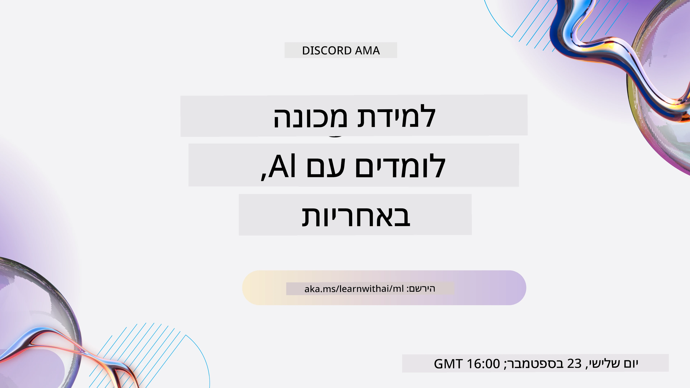
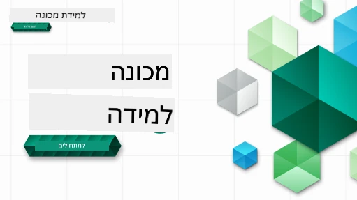

[](https://github.com/microsoft/ML-For-Beginners/blob/master/LICENSE)
[](https://GitHub.com/microsoft/ML-For-Beginners/graphs/contributors/)
[](https://GitHub.com/microsoft/ML-For-Beginners/issues/)
[](https://GitHub.com/microsoft/ML-For-Beginners/pulls/)
[](http://makeapullrequest.com)

[](https://GitHub.com/microsoft/ML-For-Beginners/watchers/)
[](https://GitHub.com/microsoft/ML-For-Beginners/network/)
[](https://GitHub.com/microsoft/ML-For-Beginners/stargazers/)

### 🌐 תמיכה בריבוי שפות

#### נתמך באמצעות פעולה של GitHub (מאורגן אוטומטית ותמיד מעודכן)

<!-- CO-OP TRANSLATOR LANGUAGES TABLE START -->
[ערבית](../ar/README.md) | [בנגלית](../bn/README.md) | [בולגרית](../bg/README.md) | [בורמזית (מיאנמר)](../my/README.md) | [סינית (פשוטה)](../zh-CN/README.md) | [סינית (מסורתית, הונג קונג)](../zh-HK/README.md) | [סינית (מסורתית, מקאו)](../zh-MO/README.md) | [סינית (מסורתית, טייוואן)](../zh-TW/README.md) | [קרואטית](../hr/README.md) | [צ'כית](../cs/README.md) | [דנית](../da/README.md) | [הולנדית](../nl/README.md) | [אסטונית](../et/README.md) | [פינית](../fi/README.md) | [צרפתית](../fr/README.md) | [גרמנית](../de/README.md) | [יוונית](../el/README.md) | [עברית](./README.md) | [הינדי](../hi/README.md) | [הונגרית](../hu/README.md) | [אינדונזית](../id/README.md) | [איטלקית](../it/README.md) | [יפנית](../ja/README.md) | [קנאדה](../kn/README.md) | [חמר](../km/README.md) | [קוריאנית](../ko/README.md) | [ליטאית](../lt/README.md) | [מלאית](../ms/README.md) | [מלאיאלאם](../ml/README.md) | [מרטהי](../mr/README.md) | [נפאלית](../ne/README.md) | [פיג'ין ניגרי](../pcm/README.md) | [נורווגית](../no/README.md) | [פרסית (פרסי)](../fa/README.md) | [פולנית](../pl/README.md) | [פורטוגזית (ברזיל)](../pt-BR/README.md) | [פורטוגזית (פורטוגל)](../pt-PT/README.md) | [פונג'אבית (גורמוכי)](../pa/README.md) | [רומנית](../ro/README.md) | [רוסית](../ru/README.md) | [סרבית (קירילית)](../sr/README.md) | [סלובקית](../sk/README.md) | [סלובנית](../sl/README.md) | [ספרדית](../es/README.md) | [סווהילית](../sw/README.md) | [שוודית](../sv/README.md) | [טאגאלוג (פיליפינית)](../tl/README.md) | [טמילית](../ta/README.md) | [טלווגו](../te/README.md) | [תאית](../th/README.md) | [טורקית](../tr/README.md) | [אוקראינית](../uk/README.md) | [אורדו](../ur/README.md) | [וייטנאמית](../vi/README.md)

> **מעוניינים לשכפל מקומית?**
>
> מאגר זה כולל 50+ תרגומים לשפות שמגדילים משמעותית את גודל ההורדה. לשכפל ללא תרגומים, השתמשו בביצוע Sparse checkout:
>
> **Bash / macOS / Linux:**
> ```bash
> git clone --filter=blob:none --sparse https://github.com/microsoft/ML-For-Beginners.git
> cd ML-For-Beginners
> git sparse-checkout set --no-cone '/*' '!translations' '!translated_images'
> ```
>
> **CMD (Windows):**
> ```cmd
> git clone --filter=blob:none --sparse https://github.com/microsoft/ML-For-Beginners.git
> cd ML-For-Beginners
> git sparse-checkout set --no-cone "/*" "!translations" "!translated_images"
> ```
>
> כך תקבלו את כל מה שצריך כדי לסיים את הקורס עם הורדה מהירה בהרבה.
<!-- CO-OP TRANSLATOR LANGUAGES TABLE END -->

#### הצטרפו לקהילה שלנו

[](https://discord.gg/nTYy5BXMWG)

יש לנו סדרת למידה עם בינה מלאכותית ב-Discord שממשיכה, למדו עוד והצטרפו אלינו בסדרת [Learn with AI Series](https://aka.ms/learnwithai/discord) מ-18 עד 30 ספטמבר 2025. תקבלו טיפים וטריקים לשימוש ב-GitHub Copilot למדעי הנתונים.



# למידת מכונה למתחילים - תוכנית לימודים

> 🌍 טוסו ברחבי העולם כשאנחנו חוקרים למידת מכונה דרך תרבויות עולם שונות 🌍

צוות Cloud Advocates במיקרוסופט שמח להציע תוכנית לימודים של 12 שבועות, 26 שיעורים, בנושא **למידת מכונה**. בתוכנית זו תלמדו על מה שמכונה לפעמים **למידת מכונה קלאסית**, כאשר משתמשים בעיקר בספריית Scikit-learn ומיד נימנע מלמידה עמוקה, הנלמדת בתוכנית שלנו [AI for Beginners' curriculum](https://aka.ms/ai4beginners). אפשר לשלב שיעורים אלו גם עם תוכנית ה-['Data Science for Beginners'](https://aka.ms/ds4beginners) שלנו!

טיילו איתנו ברחבי העולם כשאנחנו מיישמים את הטכניקות הקלאסיות הללו על נתונים מאזורים רבים בעולם. כל שיעור כולל מבחנים לפני ואחרי השיעור, הוראות כתובות לסיום השיעור, פתרון, משימה, ועוד. הפדגוגיה המבוססת פרויקטים שלנו מאפשרת לכם ללמוד תוך כדי בנייה, דרך מוכחת שיכולות חדשות "ידבקו".

**✍️ תודה ענקית למחברים שלנו** ג'ן לופר, סטיבן האול, פרנססקה לזֶרִי, טומומי אימורה, קסי בריוויו, דמיטרי סושניקוב, כריס נורינג, אנירבן מוקֶ'רְג'י, אורנלה אלטוניאן, רות יאקובו ואיימי בויד

**🎨 תודה גם למאיירים שלנו** טומומי אימורה, דסאני מדיפאלי, וג'ן לופר

**🙏 תודה מיוחדת 🙏 למחברי השגרירים הסטודנטים של מיקרוסופט, הסוקרים ותורמי התוכן שלנו**, בין היתר רישיט דג'לי, מוחמד סאכיב חאן אינאן, רוהאן ראג', אלכסנדרו פטרסקו, אבישק ג'ייסוואל, נאורין טאבאסום, יואן סמויאלה, וסניגדה אגרוואל

**🤩 תודה מיוחדת לשגרירי הסטודנטים של מיקרוסופט אריק ואנג'או, ג'סלין סונדי, ווידושי גופטה על שיעורי R שלנו!**

# התחלה

עקבו אחר השלבים הבאים:
1. **פיצלו את המאגר**: לחצו על כפתור "Fork" בפינה הימנית העליונה של דף זה.
2. **שכפלו את המאגר**:   `git clone https://github.com/microsoft/ML-For-Beginners.git`

> 💡 **טיפ התחלה מהירה:** רוצים להתחיל בדפדפן מבלי להגדיר פייתון מקומית? השתמשו ב-[GitHub Codespaces](https://github.com/features/codespaces) ליצירת סביבת פיתוח בענן עבור הפיצול שלכם. פתחו את תפריט **Code** הירוק, בחרו **Codespaces**, וצרו codespace; התקינו את התלויות הדרושות לכל שיעור כנדרש.

> [מצאו את כל המשאבים הנוספים לקורס זה באוסף Microsoft Learn שלנו](https://learn.microsoft.com/en-us/collections/qrqzamz1nn2wx3?WT.mc_id=academic-77952-bethanycheum)

> 🔧 **צריכים עזרה?** בדקו את [מדריך פתרון בעיות](TROUBLESHOOTING.md) למענה על בעיות נפוצות בהתקנה, הגדרה והרצת שיעורים.


**[סטודנטים](https://aka.ms/student-page)**, כדי להשתמש בתוכנית הלימודים הזו, פיצלו את כל המאגר לחשבון GitHub שלכם ושלמו את התרגילים לבד או בקבוצה:

- התחילו במבחן טרום-ההרצאה.
- קראו את ההרצאה וסיימו את הפעילויות, הפסקו והרהרו בכל בדיקת ידע.
- נסו ליצור את הפרויקטים על ידי הבנה את השיעורים במקום להריץ את קוד הפתרון; עם זאת הקוד זמין בתיקיות `/solution` בכל שיעור ממוקד פרויקט.
- עברו מבחן לאחר ההרצאה.
- השלימו את האתגר.
- השלימו את המשימה.
- לאחר השלמת קבוצת שיעורים, בקרו ב-[לוח הדיונים](https://github.com/microsoft/ML-For-Beginners/discussions) ו"למדו בקול רם" על ידי מילוי הטופס PAT המתאים. 'PAT' הוא כלי הערכת התקדמות שהוא טופס שאתם ממלאים כדי לקדם את הלמידה שלכם. תוכלו גם להגיב לטפסי PAT אחרים כדי שנלמד יחד.

> ללימוד נוסף, אנו ממליצים לעקוב אחר אלה [מודולי Microsoft Learn](https://docs.microsoft.com/en-us/users/jenlooper-2911/collections/k7o7tg1gp306q4?WT.mc_id=academic-77952-leestott) ונתיבי למידה.

**מורים**, כללנו [כמה הצעות](for-teachers.md) לגבי השימוש בתוכנית הלימודים הזו.

---

## וידאו להליכה צעד-אחר-צעד

חלק מהשיעורים זמינים כוידאו קצר. ניתן למצוא את כולם בשיעורים עצמם, או ברשימת ההשמעה [ML for Beginners ב-Chanel YouTube של מיקרוסופט למפתחים](https://aka.ms/ml-beginners-videos) על ידי לחיצה על התמונה למטה.

[](https://aka.ms/ml-beginners-videos)

---

## הכירו את הצוות

[](https://youtu.be/Tj1XWrDSYJU)

**גיף מאת** [Mohit Jaisal](https://linkedin.com/in/mohitjaisal)

> 🎥 לחצו על התמונה למעלה לצפייה בסרטון על הפרויקט ועל האנשים שיצרו אותו!

---

## פדגוגיה

בחרנו שני עקרונות פדגוגיים בעת בניית תוכנית הלימודים הזו: הבטחה שהתוכנית היא פרויקט-מבוסס ולאפשר קיום מבחנים תכופים. בנוסף, לתוכנית יש נושא משותף כדי לתת לה קוהרנטיות.

על ידי התאמת התוכן לפרויקטים, התהליך הופך למענין יותר לסטודנטים והחזקת הידע תוגבר. בנוסף, מבחן בעל סיכון נמוך לפני כיתה מייצב את כוונת הסטודנט ללמידת הנושא, ומבחן שני לאחר הכיתה מוודא החזקה נוספת. התוכנית מעוצבת להיות גמישה ומהנה וניתנת ללמידה בשלמותה או בחלקים. הפרויקטים מתחילים קטנים והופכים למורכבים יותר עד סוף מחזור 12 השבועות. תוכנית זו כוללת גם פוסט-סקריפט על יישומים מעשיים של למידת מכונה, שניתן להשתמש בו כנקודות נוספות או בסיס לדיון.

> מצאו את [קוד ההתנהגות שלנו](CODE_OF_CONDUCT.md), [תרומה](CONTRIBUTING.md), [תרגומים](..), ו[מדריך פתרון בעיות](TROUBLESHOOTING.md). נשמח לקבל את המשוב הבונה שלכם!

## כל שיעור כולל

- הערת סקיצה אופציונלית
- וידאו משלימה אופציונלי
- סיור וידאו (בחלק מהשיעורים בלבד)
- [מבחן חימום לפני ההרצאה](https://ff-quizzes.netlify.app/en/ml/)
- שיעור כתוב
- לשיעורים מבוססי פרויקט, מדריכים שלב-אחר-שלב על בניית הפרויקט
- בדיקות ידע
- אתגר
- קריאה משלימה
- משימה
- [מבחן אחרי ההרצאה](https://ff-quizzes.netlify.app/en/ml/)

> **הערה על שפות:** שיעורים אלו כתובים בעיקר בפייתון, אך רבים מהם זמינים גם ב-R. להשלמת שיעור ב-R, גשו לתיקיית `/solution` וחפשו שיעורי R. הם כוללים סיומת .rmd המייצגת קובץ **R Markdown** שניתן להגדרה פשוטה כהטמעת `חתיכות קוד` (של R או שפות אחרות) ו`כותרת YAML` (המדריכה כיצד לעצב תוצרי פלט כמו PDF) בתוך מסמך `Markdown`. כך הוא משמש כמסגרת מחברת מוכרת למדע הנתונים המאפשרת לשלב בין הקוד שלכם, הפלט שלו, והמחשבות שלכם על ידי כתיבתן ב-Markdown. יתרה מכך, קבצי R Markdown ניתנים להמרה לפורמטים כגון PDF, HTML, או Word.

> **הערה על מבחנים:** כל המבחנים נמצאים בתיקיית [Quiz App](../../quiz-app), הכוללת 52 מבחנים בסך הכל, כל אחד עם שלוש שאלות. הם מקושרים מתוך השיעורים אך את אפליקציית המבחנים ניתן להריץ מקומית; עקבו אחרי ההנחיות בתיקיית `quiz-app` לאירוח מקומי או פריסה ל-Azure.

| מספר השיעור |                             נושא                              |                   קיבוץ שיעורים                   | מטרות למידה                                                                                                             |                                                              שיעור מקושר                                                               |                        מחבר                        |
| :-----------: | :------------------------------------------------------------: | :-------------------------------------------------: | ------------------------------------------------------------------------------------------------------------------------------- | :--------------------------------------------------------------------------------------------------------------------------------------: | :--------------------------------------------------: |
|      01       |                מבוא ללמידת מכונה                |      [הקדמה](1-Introduction/README.md)       | ללמוד את המושגים הבסיסיים שמאחורי למידת מכונה                                                                                |                                             [שיעור](1-Introduction/1-intro-to-ML/README.md)                                             |                       מוחמד                       |
|      02       |                ההיסטוריה של למידת מכונה                 |      [הקדמה](1-Introduction/README.md)       | ללמוד את ההיסטוריה העומדת מאחורי תחום זה                                                                                         |                                            [שיעור](1-Introduction/2-history-of-ML/README.md)                                            |                     ג'ן ואיימי                      |
|      03       |                 הוגנות ולמידת מכונה                  |      [הקדמה](1-Introduction/README.md)       | מהם הנושאים הפילוסופיים החשובים סביב הוגנות שעל הסטודנטים לקחת בחשבון בעת בנייה ויישום של מודלי למידת מכונה? |                                              [שיעור](1-Introduction/3-fairness/README.md)                                               |                        טומומי                        |
|      04       |                טכניקות ללמידת מכונה                 |      [הקדמה](1-Introduction/README.md)       | אילו טכניקות חוקרי למידה מכונה משתמשים כדי לבנות מודלים?                                                                       |                                          [שיעור](1-Introduction/4-techniques-of-ML/README.md)                                           |                    כריס וג'ן                     |
|      05       |                   מבוא לרגרסיה                   |        [רגרסיה](2-Regression/README.md)         | התחילו עם Python ו-Scikit-learn למודלי רגרסיה                                                                  |         [Python](2-Regression/1-Tools/README.md) • [R](../../2-Regression/1-Tools/solution/R/lesson_1.html)         |      ג'ן • אריק וואנג'או       |
|      06       |                מחירי דלעות בצפון אמריקה 🎃                |        [רגרסיה](2-Regression/README.md)         | להמחיש ולנקות נתונים כהכנה ללמידת מכונה                                                                                  |          [Python](2-Regression/2-Data/README.md) • [R](../../2-Regression/2-Data/solution/R/lesson_2.html)          |      ג'ן • אריק וואנג'או       |
|      07       |                מחירי דלעות בצפון אמריקה 🎃                |        [רגרסיה](2-Regression/README.md)         | לבנות מודלי רגרסיה ליניארית ופולינומית                                                                                   |        [Python](2-Regression/3-Linear/README.md) • [R](../../2-Regression/3-Linear/solution/R/lesson_3.html)        |      ג'ן ודמיטרי • אריק וואנג'או       |
|      08       |                מחירי דלעות בצפון אמריקה 🎃                |        [רגרסיה](2-Regression/README.md)         | לבנות מודל רגרסיה לוגיסטית                                                                                               |     [Python](2-Regression/4-Logistic/README.md) • [R](../../2-Regression/4-Logistic/solution/R/lesson_4.html)      |      ג'ן • אריק וואנג'או       |
|      09       |                          אפליקציית רשת 🔌                          |           [אפליקציית רשת](3-Web-App/README.md)            | לבנות אפליקציית רשת לשימוש במודל שאומן                                                                                       |                                                 [Python](3-Web-App/1-Web-App/README.md)                                                  |                         ג'ן                          |
|      10       |                 מבוא למיון                 |    [סיווג](4-Classification/README.md)     | לנקות, להכין ולהמחיש את הנתונים; מבוא למיון                                                            | [Python](4-Classification/1-Introduction/README.md) • [R](../../4-Classification/1-Introduction/solution/R/lesson_10.html)  | ג'ן וקסי • אריק וואנג'או |
|      11       |             מטבח אסייתי והודי טעים 🍜             |    [סיווג](4-Classification/README.md)     | מבוא למסווגים                                                                                                     | [Python](4-Classification/2-Classifiers-1/README.md) • [R](../../4-Classification/2-Classifiers-1/solution/R/lesson_11.html) | ג'ן וקסי • אריק וואנג'או |
|      12       |             מטבח אסייתי והודי טעים 🍜             |    [סיווג](4-Classification/README.md)     | מסווגים נוספים                                                                                                                | [Python](4-Classification/3-Classifiers-2/README.md) • [R](../../4-Classification/3-Classifiers-2/solution/R/lesson_12.html) | ג'ן וקסי • אריק וואנג'או |
|      13       |             מטבח אסייתי והודי טעים 🍜             |    [סיווג](4-Classification/README.md)     | לבנות אפליקציית רשת מומלצת באמצעות המודל                                                                                     |                                              [Python](4-Classification/4-Applied/README.md)                                              |                         ג'ן                          |
|      14       |                   מבוא לאשכולות                   |        [אשכולות](5-Clustering/README.md)         | לנקות, להכין ולהמחיש את הנתונים; מבוא לאשכולות                                                                |         [Python](5-Clustering/1-Visualize/README.md) • [R](../../5-Clustering/1-Visualize/solution/R/lesson_14.html)         |      ג'ן • אריק וואנג'או       |
|      15       |              חקר טעמי המוזיקה בניגריה 🎧              |        [אשכולות](5-Clustering/README.md)         | חקור את שיטת האשכולות K-Means                                                                                           |           [Python](5-Clustering/2-K-Means/README.md) • [R](../../5-Clustering/2-K-Means/solution/R/lesson_15.html)           |      ג'ן • אריק וואנג'או       |
|      16       |        מבוא לעיבוד שפה טבעית ☕️         |   [עיבוד שפה טבעית](6-NLP/README.md)    | למד את היסודות של NLP על ידי בניית בוט פשוט                                                                             |                                             [Python](6-NLP/1-Introduction-to-NLP/README.md)                                              |                       סטיבן                        |
|      17       |                      משימות NLP נפוצות ☕️                      |   [עיבוד שפה טבעית](6-NLP/README.md)    | העמק את הידע שלך ב-NLP על ידי הבנת משימות נפוצות הנדרשות בעבודה עם מבני שפה                          |                                                    [Python](6-NLP/2-Tasks/README.md)                                                     |                       סטיבן                        |
|      18       |             תרגום וניתוח סנטימנט ♥️              |   [עיבוד שפה טבעית](6-NLP/README.md)    | תרגום וניתוח סנטימנט עם ג'יין אוסטן                                                                             |                                            [Python](6-NLP/3-Translation-Sentiment/README.md)                                             |                       סטיבן                        |
|      19       |                  בתי מלון רומנטיים באירופה ♥️                  |   [עיבוד שפה טבעית](6-NLP/README.md)    | ניתוח סנטימנט עם ביקורות על בתי מלון 1                                                                                         |                                               [Python](6-NLP/4-Hotel-Reviews-1/README.md)                                                |                       סטיבן                        |
|      20       |                  בתי מלון רומנטיים באירופה ♥️                  |   [עיבוד שפה טבעית](6-NLP/README.md)    | ניתוח סנטימנט עם ביקורות על בתי מלון 2                                                                                         |                                               [Python](6-NLP/5-Hotel-Reviews-2/README.md)                                                |                       סטיבן                        |
|      21       |            מבוא לחיזוי סדרות זמן             |        [סדרות זמן](7-TimeSeries/README.md)        | מבוא לחיזוי סדרות זמן                                                                                         |                                             [Python](7-TimeSeries/1-Introduction/README.md)                                              |                      פרנצ'סקה                       |
|      22       | ⚡️ שימוש עולמי בחשמל ⚡️ - חיזוי סדרות זמן עם ARIMA |        [סדרות זמן](7-TimeSeries/README.md)        | חיזוי סדרות זמן עם ARIMA                                                                                              |                                                 [Python](7-TimeSeries/2-ARIMA/README.md)                                                 |                      פרנצ'סקה                       |
|      23       |  ⚡️ שימוש עולמי בחשמל ⚡️ - חיזוי סדרות זמן עם SVR  |        [סדרות זמן](7-TimeSeries/README.md)        | חיזוי סדרות זמן עם מתאם וקטורים תמיכה                                                                           |                                                  [Python](7-TimeSeries/3-SVR/README.md)                                                  |                       אנירבן                        |
|      24       |             מבוא ללמידה מחזקת             | [למידה מחזקת](8-Reinforcement/README.md) | מבוא ללמידה מחזקת עם Q-Learning                                                                          |                                             [Python](8-Reinforcement/1-QLearning/README.md)                                              |                        דמיטרי                        |
|      25       |                 עזור לפיטר להמנע מהזאב! 🐺                  | [למידה מחזקת](8-Reinforcement/README.md) | למידה מחזקת עם Gym                                                                                                      |                                                [Python](8-Reinforcement/2-Gym/README.md)                                                 |                        דמיטרי                        |
|  פוסטסקריפט   |            תרחישי למידת מכונה בעולם האמיתי ויישומים            |      [ML ביער](9-Real-World/README.md)       | יישומים מעניינים וחושפניים של למידת מכונה קלאסית                                                               |                                             [שיעור](9-Real-World/1-Applications/README.md)                                              |                         הצוות                         |
|  פוסטסקריפט   |            איתור תקלות בדגם למידת מכונה באמצעות לוח בקרה RAI            |      [ML ביער](9-Real-World/README.md)       | איתור תקלות במודלי למידת מכונה באמצעות רכיבי לוח הבקרה של Responsible AI                                                              |                                             [שיעור](9-Real-World/2-Debugging-ML-Models/README.md)                                              |                     רות יעקובו                      |

> [מצא את כל המשאבים הנוספים לקורס זה באוסף Microsoft Learn שלנו](https://learn.microsoft.com/en-us/collections/qrqzamz1nn2wx3?WT.mc_id=academic-77952-bethanycheum)

## גישה לא מקוונת

ניתן להריץ את התיעוד הזה באופן לא מקוון באמצעות [Docsify](https://docsify.js.org/#/). פצל את המאגר הזה, [התקן את Docsify](https://docsify.js.org/#/quickstart) במחשב המקומי שלך, ואז בתיקיית השורש של המאגר, הקלד `docsify serve`. האתר יוגש על פורט 3000 ב-localhost שלך: `localhost:3000`.

## קבצי PDF

מצא קובץ PDF של תוכנית הלימודים עם קישורים [כאן](https://microsoft.github.io/ML-For-Beginners/pdf/readme.pdf).


## 🎒 קורסים אחרים

הצוות שלנו מייצר קורסים נוספים! בדוק:

<!-- CO-OP TRANSLATOR OTHER COURSES START -->
### LangChain
[](https://aka.ms/langchain4j-for-beginners)
[](https://aka.ms/langchainjs-for-beginners?WT.mc_id=m365-94501-dwahlin)
[](https://github.com/microsoft/langchain-for-beginners?WT.mc_id=m365-94501-dwahlin)
---

### Azure / Edge / MCP / סוכנים
[](https://github.com/microsoft/AZD-for-beginners?WT.mc_id=academic-105485-koreyst)
[](https://github.com/microsoft/edgeai-for-beginners?WT.mc_id=academic-105485-koreyst)
[](https://github.com/microsoft/mcp-for-beginners?WT.mc_id=academic-105485-koreyst)
[](https://github.com/microsoft/ai-agents-for-beginners?WT.mc_id=academic-105485-koreyst)

---
 
### סדרת AI יצרני
[](https://github.com/microsoft/generative-ai-for-beginners?WT.mc_id=academic-105485-koreyst)
[-9333EA?style=for-the-badge&labelColor=E5E7EB&color=9333EA)](https://github.com/microsoft/Generative-AI-for-beginners-dotnet?WT.mc_id=academic-105485-koreyst)
[-C084FC?style=for-the-badge&labelColor=E5E7EB&color=C084FC)](https://github.com/microsoft/generative-ai-for-beginners-java?WT.mc_id=academic-105485-koreyst)
[-E879F9?style=for-the-badge&labelColor=E5E7EB&color=E879F9)](https://github.com/microsoft/generative-ai-with-javascript?WT.mc_id=academic-105485-koreyst)

---
 
### הלמידה המרכזית
[](https://aka.ms/ml-beginners?WT.mc_id=academic-105485-koreyst)
[](https://aka.ms/datascience-beginners?WT.mc_id=academic-105485-koreyst)
[](https://aka.ms/ai-beginners?WT.mc_id=academic-105485-koreyst)
[](https://github.com/microsoft/Security-101?WT.mc_id=academic-96948-sayoung)
[](https://aka.ms/webdev-beginners?WT.mc_id=academic-105485-koreyst)
[](https://aka.ms/iot-beginners?WT.mc_id=academic-105485-koreyst)
[](https://github.com/microsoft/xr-development-for-beginners?WT.mc_id=academic-105485-koreyst)

---
 
### סדרת Copilot
[](https://aka.ms/GitHubCopilotAI?WT.mc_id=academic-105485-koreyst)
[](https://github.com/microsoft/mastering-github-copilot-for-dotnet-csharp-developers?WT.mc_id=academic-105485-koreyst)
[](https://github.com/microsoft/CopilotAdventures?WT.mc_id=academic-105485-koreyst)
<!-- CO-OP TRANSLATOR OTHER COURSES END -->

## לקבלת עזרה

אם נתקלת בבלבול או יש לך שאלות בזמן למידת למידת מכונה או בניית יישומי AI, אל תדאג — עזרה זמינה.

תוכל להצטרף לדיונים עם לומדים ומפתחים אחרים, לשאול שאלות, ולשתף רעיונות עם הקהילה.

- הצטרף לקהילה לשאול שאלות וללמוד עם אחרים
- לדון במושגי למידת מכונה וברעיונות לפרויקטים
- לקבל הנחיות ממפתחים מנוסים

קהילה תומכת היא דרך מצוינת לפתח את הכישורים שלך ולפתור בעיות במהירות.

[קהילת Discord של Microsoft Foundry](https://discord.gg/nTYy5BXMWG)

אם אתה נתקל בבאגים, שגיאות, או יש לך הצעות לשיפורים, תוכל גם לפתוח **בעיה** במאגר זה כדי לדווח על הבעיה.

למשוב על המוצר או לחיפוש פוסטים קיימים בקהילה, בקר בפורום המפתחים:

[](https://aka.ms/foundry/forum)

## טיפים נוספים ללמידה

- סקור פנקסים אחרי כל שיעור להבנה טובה יותר.
- תרגל יישום אלגוריתמים בעצמך.
- חקור מערכי נתונים מהעולם האמיתי באמצעות המושגים שלמדת.

---

<!-- CO-OP TRANSLATOR DISCLAIMER START -->
**כתב ויתור**:
מסמך זה תורגם באמצעות שירות תרגום אוטומטי [Co-op Translator](https://github.com/Azure/co-op-translator). למרות שאנו שואפים לדיוק, יש לקחת בחשבון שתרגומים אוטומטיים עלולים להכיל שגיאות או אי-דיוקים. יש להחשיב את המסמך המקורי בשפתו הטבעית כמקור הסמכות. למידע קריטי מומלץ להשתמש בתרגום מקצועי על ידי מתרגם אדם. אנו לא אחראים לכל אי-הבנה או פירוש שגוי הנובע מהשימוש בתרגום זה.
<!-- CO-OP TRANSLATOR DISCLAIMER END -->