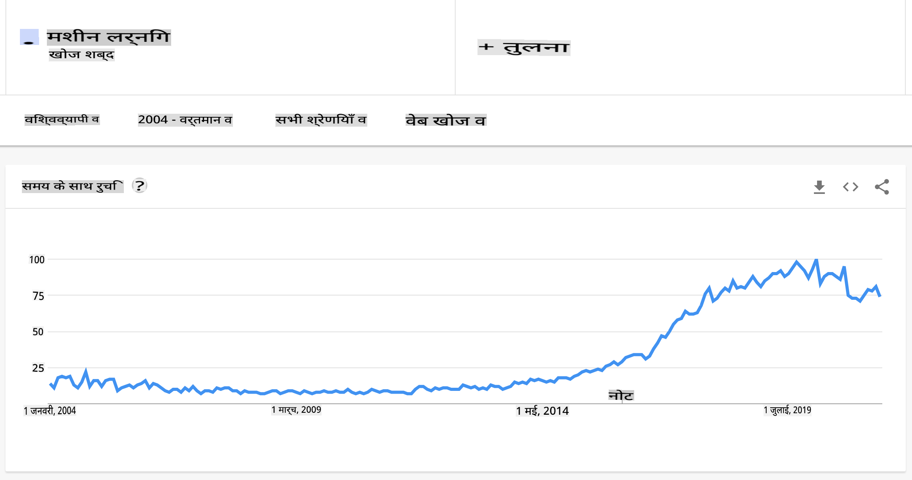

# मशीन लर्निंग का परिचय

## [प्रारंभिक क्विज़](https://gray-sand-07a10f403.1.azurestaticapps.net/quiz/1/)

---

> 🎥 इस पाठ के माध्यम से काम करने के लिए ऊपर दी गई छवि पर क्लिक करें।

क्लासिकल मशीन लर्निंग के इस कोर्स में आपका स्वागत है! चाहे आप इस विषय में बिल्कुल नए हों, या एक अनुभवी एमएल प्रैक्टिशनर हों जो किसी क्षेत्र में सुधार करना चाहते हैं, हम आपके शामिल होने से खुश हैं! हम आपके एमएल अध्ययन के लिए एक दोस्ताना लॉन्चिंग स्थान बनाना चाहते हैं और आपके [प्रतिक्रिया](https://github.com/microsoft/ML-For-Beginners/discussions) का मूल्यांकन, प्रतिक्रिया और समावेश करने में खुशी होगी।

> 🎥 एक वीडियो के लिए ऊपर दी गई छवि पर क्लिक करें: एमआईटी के जॉन गुट्टाग मशीन लर्निंग का परिचय देते हैं

---
## मशीन लर्निंग के साथ शुरुआत

इस पाठ्यक्रम को शुरू करने से पहले, आपको अपने कंप्यूटर को सेट अप और नोटबुक्स को लोकली चलाने के लिए तैयार करना होगा।

- **इन वीडियो के साथ अपने मशीन को कॉन्फ़िगर करें**। अपने सिस्टम में [Python को इंस्टॉल कैसे करें](https://youtu.be/CXZYvNRIAKM) और विकास के लिए [टेक्स्ट एडिटर सेटअप कैसे करें](https://youtu.be/EU8eayHWoZg) सीखने के लिए निम्नलिखित लिंक का उपयोग करें।
- **Python सीखें**। यह भी अनुशंसित है कि आप [Python](https://docs.microsoft.com/learn/paths/python-language/?WT.mc_id=academic-77952-leestott) की एक बुनियादी समझ रखें, एक प्रोग्रामिंग भाषा जो डेटा वैज्ञानिकों के लिए उपयोगी है और जिसे हम इस कोर्स में उपयोग करते हैं।
- **Node.js और JavaScript सीखें**। हम इस कोर्स में कुछ बार वेब ऐप्स बनाते समय JavaScript का भी उपयोग करते हैं, इसलिए आपको [node](https://nodejs.org) और [npm](https://www.npmjs.com/) को इंस्टॉल करने की आवश्यकता होगी, साथ ही [Visual Studio Code](https://code.visualstudio.com/) को Python और JavaScript विकास दोनों के लिए उपलब्ध रखना होगा।
- **GitHub खाता बनाएं**। चूंकि आपने हमें [GitHub](https://github.com) पर पाया है, आपके पास पहले से एक खाता हो सकता है, लेकिन अगर नहीं है, तो एक खाता बनाएं और फिर इस पाठ्यक्रम को अपने उपयोग के लिए फोर्क करें। (हमें एक स्टार देने में भी संकोच न करें 😊)
- **Scikit-learn को एक्सप्लोर करें**। [Scikit-learn](https://scikit-learn.org/stable/user_guide.html) से परिचित हों, एक सेट एमएल लाइब्रेरीज़ जो हम इन पाठों में संदर्भित करते हैं।

---
## मशीन लर्निंग क्या है?

'मशीन लर्निंग' शब्द आज के सबसे लोकप्रिय और अक्सर उपयोग किए जाने वाले शब्दों में से एक है। यह एक महत्वपूर्ण संभावना है कि आपने इस शब्द को कम से कम एक बार सुना होगा यदि आप किसी प्रकार की प्रौद्योगिकी से परिचित हैं, चाहे आप किसी भी क्षेत्र में काम करते हों। हालांकि, मशीन लर्निंग की यांत्रिकी अधिकांश लोगों के लिए एक रहस्य है। एक मशीन लर्निंग शुरुआती के लिए, विषय कभी-कभी भारी महसूस हो सकता है। इसलिए, यह समझना महत्वपूर्ण है कि मशीन लर्निंग वास्तव में क्या है, और इसे व्यावहारिक उदाहरणों के माध्यम से चरण-दर-चरण सीखना है।

---
## प्रचार वक्र

> गूगल ट्रेंड्स 'मशीन लर्निंग' शब्द के हाल के 'प्रचार वक्र' को दिखाता है

---
## एक रहस्यमय ब्रह्मांड

हम एक ऐसे ब्रह्मांड में रहते हैं जो आकर्षक रहस्यों से भरा हुआ है। महान वैज्ञानिक जैसे स्टीफन हॉकिंग, अल्बर्ट आइंस्टीन, और कई अन्य ने हमारे चारों ओर की दुनिया के रहस्यों को उजागर करने वाली महत्वपूर्ण जानकारी खोजने के लिए अपना जीवन समर्पित कर दिया है। यह सीखने की मानवीय स्थिति है: एक मानव बच्चा नई चीजें सीखता है और जैसे-जैसे वह वयस्कता की ओर बढ़ता है, अपने विश्व की संरचना को उजागर करता है।

---
## बच्चे का मस्तिष्क

एक बच्चे का मस्तिष्क और इंद्रियां अपने परिवेश के तथ्यों को समझते हैं और धीरे-धीरे जीवन के छिपे हुए पैटर्न को सीखते हैं जो बच्चे को सीखे गए पैटर्न की पहचान करने के लिए तार्किक नियम बनाने में मदद करते हैं। मानव मस्तिष्क की सीखने की प्रक्रिया मनुष्यों को इस दुनिया का सबसे परिष्कृत जीवित प्राणी बनाती है। छिपे हुए पैटर्न की खोज करके लगातार सीखना और फिर उन पैटर्न पर नवाचार करना हमें हमारे जीवनकाल में खुद को बेहतर बनाने में सक्षम बनाता है। यह सीखने की क्षमता और विकसित होने की क्षमता एक अवधारणा से संबंधित है जिसे [मस्तिष्क की प्लास्टिसिटी](https://www.simplypsychology.org/brain-plasticity.html) कहा जाता है। सतही तौर पर, हम मानव मस्तिष्क की सीखने की प्रक्रिया और मशीन लर्निंग की अवधारणाओं के बीच कुछ प्रेरणादायक समानताएं खींच सकते हैं।

---
## मानव मस्तिष्क

[मानव मस्तिष्क](https://www.livescience.com/29365-human-brain.html) वास्तविक दुनिया से चीजों को समझता है, समझी गई जानकारी को संसाधित करता है, तार्किक निर्णय लेता है, और परिस्थितियों के आधार पर कुछ कार्य करता है। इसे हम बुद्धिमानी से व्यवहार करना कहते हैं। जब हम बुद्धिमान व्यवहार प्रक्रिया की नकल को एक मशीन में प्रोग्राम करते हैं, तो इसे कृत्रिम बुद्धिमत्ता (AI) कहा जाता है।

---
## कुछ शब्दावली

हालांकि शब्दों को भ्रमित किया जा सकता है, मशीन लर्निंग (ML) कृत्रिम बुद्धिमत्ता का एक महत्वपूर्ण उपसमूह है। **एमएल का संबंध विशेष एल्गोरिदम का उपयोग करके महत्वपूर्ण जानकारी को उजागर करने और समझी गई डेटा से छिपे हुए पैटर्न को खोजने से है ताकि तार्किक निर्णय लेने की प्रक्रिया को प्रमाणित किया जा सके**।

---
## एआई, एमएल, डीप लर्निंग

> एआई, एमएल, डीप लर्निंग, और डेटा साइंस के बीच संबंधों को दिखाने वाला एक आरेख। [Jen Looper](https://twitter.com/jenlooper) द्वारा प्रेरित [इस ग्राफिक](https://softwareengineering.stackexchange.com/questions/366996/distinction-between-ai-ml-neural-networks-deep-learning-and-data-mining) से प्रेरित इन्फोग्राफिक

---
## कवर करने के लिए अवधारणाएँ

इस पाठ्यक्रम में, हम केवल मशीन लर्निंग की मुख्य अवधारणाओं को कवर करेंगे जो एक शुरुआती को जानना चाहिए। हम मुख्य रूप से Scikit-learn का उपयोग करके 'क्लासिकल मशीन लर्निंग' को कवर करेंगे, एक उत्कृष्ट लाइब्रेरी जिसका उपयोग कई छात्र बुनियादी बातों को सीखने के लिए करते हैं। कृत्रिम बुद्धिमत्ता या डीप लर्निंग की व्यापक अवधारणाओं को समझने के लिए, मशीन लर्निंग का एक मजबूत बुनियादी ज्ञान अपरिहार्य है, और इसलिए हम इसे यहां पेश करना चाहेंगे।

---
## इस कोर्स में आप सीखेंगे:

- मशीन लर्निंग की मुख्य अवधारणाएँ
- एमएल का इतिहास
- एमएल और निष्पक्षता
- प्रतिगमन एमएल तकनीकें
- वर्गीकरण एमएल तकनीकें
- क्लस्टरिंग एमएल तकनीकें
- प्राकृतिक भाषा प्रसंस्करण एमएल तकनीकें
- समय श्रृंखला पूर्वानुमान एमएल तकनीकें
- सुदृढीकरण सीखना
- एमएल के वास्तविक दुनिया के अनुप्रयोग

---
## हम क्या कवर नहीं करेंगे

- डीप लर्निंग
- न्यूरल नेटवर्क्स
- एआई

बेहतर सीखने के अनुभव के लिए, हम न्यूरल नेटवर्क्स, 'डीप लर्निंग' - न्यूरल नेटवर्क्स का उपयोग करके कई-स्तरीय मॉडल-निर्माण - और एआई की जटिलताओं से बचेंगे, जिसे हम एक अलग पाठ्यक्रम में चर्चा करेंगे। हम एक आगामी डेटा साइंस पाठ्यक्रम भी पेश करेंगे जो इस बड़े क्षेत्र के उस पहलू पर ध्यान केंद्रित करेगा।

---
## मशीन लर्निंग क्यों पढ़ें?

मशीन लर्निंग, सिस्टम दृष्टिकोण से, डेटा से छिपे हुए पैटर्न को सीखने के लिए स्वचालित सिस्टम बनाने के रूप में परिभाषित किया गया है ताकि बुद्धिमान निर्णय लेने में मदद मिल सके।

यह प्रेरणा ढीली तौर पर इस बात से प्रेरित है कि मानव मस्तिष्क बाहरी दुनिया से प्राप्त डेटा के आधार पर कुछ चीजें कैसे सीखता है।

✅ एक मिनट के लिए सोचें कि एक व्यवसाय हार्ड-कोडेड नियम-आधारित इंजन बनाने के बजाय मशीन लर्निंग रणनीतियों का उपयोग क्यों करना चाहेगा।

---
## मशीन लर्निंग के अनुप्रयोग

मशीन लर्निंग के अनुप्रयोग अब लगभग हर जगह हैं, और हमारे समाजों के चारों ओर बहने वाले डेटा के रूप में सर्वव्यापी हैं, जो हमारे स्मार्ट फोन, जुड़े हुए उपकरणों और अन्य प्रणालियों द्वारा उत्पन्न होते हैं। अत्याधुनिक मशीन लर्निंग एल्गोरिदम की अपार संभावनाओं को देखते हुए, शोधकर्ता उनके क्षमता का पता लगा रहे हैं कि वे बहुआयामी और बहु-विषयक वास्तविक जीवन की समस्याओं को सकारात्मक परिणामों के साथ हल करने में सक्षम हैं।

---
## लागू एमएल के उदाहरण

**आप कई तरीकों से मशीन लर्निंग का उपयोग कर सकते हैं**:

- एक रोगी के चिकित्सा इतिहास या रिपोर्ट से बीमारी की संभावना की भविष्यवाणी करने के लिए।
- मौसम की घटनाओं की भविष्यवाणी करने के लिए मौसम डेटा का लाभ उठाने के लिए।
- एक पाठ की भावना को समझने के लिए।
- प्रचार के प्रसार को रोकने के लिए नकली समाचारों का पता लगाने के लिए।

वित्त, अर्थशास्त्र, पृथ्वी विज्ञान, अंतरिक्ष अन्वेषण, बायोमेडिकल इंजीनियरिंग, संज्ञानात्मक विज्ञान, और यहां तक कि मानविकी के क्षेत्र भी अपने डोमेन की कठिन, डेटा-प्रसंस्करण भारी समस्याओं को हल करने के लिए मशीन लर्निंग को अनुकूलित कर चुके हैं।

---
## निष्कर्ष

मशीन लर्निंग वास्तविक दुनिया या उत्पन्न डेटा से महत्वपूर्ण अंतर्दृष्टि खोजने के द्वारा पैटर्न-खोज की प्रक्रिया को स्वचालित करता है। इसने व्यापार, स्वास्थ्य, और वित्तीय अनुप्रयोगों में, अन्य क्षेत्रों में, खुद को अत्यधिक मूल्यवान साबित किया है।

निकट भविष्य में, किसी भी डोमेन के लोगों के लिए मशीन लर्निंग की बुनियादी बातों को समझना एक आवश्यकता बनने जा रहा है क्योंकि इसका व्यापक रूप से अपनाया जा रहा है।

---
# 🚀 चुनौती

कागज पर या [Excalidraw](https://excalidraw.com/) जैसे ऑनलाइन ऐप का उपयोग करके, एआई, एमएल, डीप लर्निंग, और डेटा साइंस के बीच अंतर को समझने के लिए अपना स्केच बनाएं। कुछ समस्याओं के विचार जोड़ें जो इन तकनीकों में से प्रत्येक के हल करने के लिए अच्छे हैं।

# [पाठ के बाद का क्विज़](https://gray-sand-07a10f403.1.azurestaticapps.net/quiz/2/)

---
# समीक्षा और आत्म अध्ययन

क्लाउड में एमएल एल्गोरिदम के साथ कैसे काम कर सकते हैं, यह जानने के लिए इस [लर्निंग पाथ](https://docs.microsoft.com/learn/paths/create-no-code-predictive-models-azure-machine-learning/?WT.mc_id=academic-77952-leestott) का पालन करें।

एमएल की मूल बातें के बारे में सीखने के लिए इस [लर्निंग पाथ](https://docs.microsoft.com/learn/modules/introduction-to-machine-learning/?WT.mc_id=academic-77952-leestott) को लें।

---
# असाइनमेंट

[शुरू करें](assignment.md)

**अस्वीकरण**:
यह दस्तावेज़ मशीन-आधारित एआई अनुवाद सेवाओं का उपयोग करके अनुवादित किया गया है। जबकि हम सटीकता के लिए प्रयासरत हैं, कृपया ध्यान दें कि स्वचालित अनुवादों में त्रुटियाँ या गलतियाँ हो सकती हैं। मूल दस्तावेज़ को उसकी मूल भाषा में प्रामाणिक स्रोत माना जाना चाहिए। महत्वपूर्ण जानकारी के लिए, पेशेवर मानव अनुवाद की सिफारिश की जाती है। इस अनुवाद के उपयोग से उत्पन्न किसी भी गलतफहमी या गलत व्याख्या के लिए हम जिम्मेदार नहीं हैं।