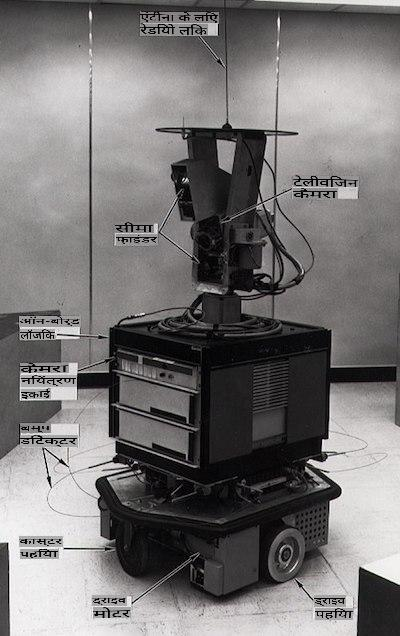
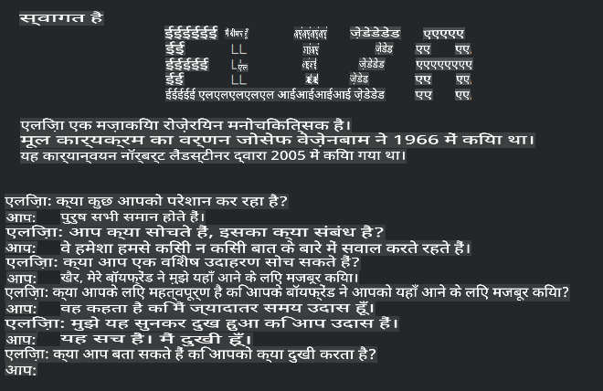

# मशीन लर्निंग का इतिहास

> स्केच नोट [Tomomi Imura](https://www.twitter.com/girlie_mac) द्वारा

## [व्याख्यान से पहले का क्विज़](https://gray-sand-07a10f403.1.azurestaticapps.net/quiz/3/)

---

> 🎥 इस पाठ के माध्यम से काम करने के लिए ऊपर दी गई छवि पर क्लिक करें।

इस पाठ में, हम मशीन लर्निंग और कृत्रिम बुद्धिमत्ता के इतिहास में प्रमुख मील के पत्थरों पर चर्चा करेंगे।

कृत्रिम बुद्धिमत्ता (AI) के क्षेत्र का इतिहास मशीन लर्निंग के इतिहास से जुड़ा हुआ है, क्योंकि ML को आधार देने वाले एल्गोरिदम और कम्प्यूटेशनल प्रगति ने AI के विकास में योगदान दिया। यह याद रखना उपयोगी है कि, जबकि ये क्षेत्र 1950 के दशक में विशिष्ट अनुसंधान क्षेत्रों के रूप में क्रिस्टलाइज होने लगे थे, महत्वपूर्ण [एल्गोरिदमिक, सांख्यिकीय, गणितीय, कम्प्यूटेशनल और तकनीकी खोजें](https://wikipedia.org/wiki/Timeline_of_machine_learning) इस युग से पहले और साथ ही साथ हुई थीं। वास्तव में, लोग इन प्रश्नों के बारे में [सैकड़ों वर्षों](https://wikipedia.org/wiki/History_of_artificial_intelligence) से सोचते आ रहे हैं: यह लेख 'सोचने वाली मशीन' के विचार की ऐतिहासिक बौद्धिक नींव पर चर्चा करता है।

---
## उल्लेखनीय खोजें

- 1763, 1812 [बेयस प्रमेय](https://wikipedia.org/wiki/Bayes%27_theorem) और इसके पूर्ववर्ती। यह प्रमेय और इसके अनुप्रयोग अनुमान का आधार बनाते हैं, जो पूर्व ज्ञान के आधार पर किसी घटना के घटित होने की संभावना का वर्णन करते हैं।
- 1805 [लीस्ट स्क्वेयर थ्योरी](https://wikipedia.org/wiki/Least_squares) फ्रांसीसी गणितज्ञ एड्रियन-मैरी लेजेंड्रे द्वारा। यह सिद्धांत, जिसके बारे में आप हमारे रिग्रेशन यूनिट में जानेंगे, डेटा फिटिंग में मदद करता है।
- 1913 [मार्कोव चेन](https://wikipedia.org/wiki/Markov_chain), जिसका नाम रूसी गणितज्ञ आंद्रे मार्कोव के नाम पर रखा गया है, एक पूर्व स्थिति के आधार पर संभावित घटनाओं की अनुक्रम का वर्णन करने के लिए उपयोग किया जाता है।
- 1957 [परसेप्ट्रॉन](https://wikipedia.org/wiki/Perceptron) एक प्रकार का रैखिक वर्गीकरणकर्ता है जिसका आविष्कार अमेरिकी मनोवैज्ञानिक फ्रैंक रोसेनब्लाट ने किया था और जो गहन शिक्षा में प्रगति का आधार बनता है।

---

- 1967 [निकटतम पड़ोसी](https://wikipedia.org/wiki/Nearest_neighbor) एक एल्गोरिदम है जिसे मूल रूप से मार्गों को मैप करने के लिए डिज़ाइन किया गया था। एमएल संदर्भ में इसका उपयोग पैटर्न का पता लगाने के लिए किया जाता है।
- 1970 [बैकप्रोपेगेशन](https://wikipedia.org/wiki/Backpropagation) का उपयोग [फीडफॉरवर्ड न्यूरल नेटवर्क](https://wikipedia.org/wiki/Feedforward_neural_network) को प्रशिक्षित करने के लिए किया जाता है।
- 1982 [रिकरंट न्यूरल नेटवर्क](https://wikipedia.org/wiki/Recurrent_neural_network) कृत्रिम न्यूरल नेटवर्क हैं जो फीडफॉरवर्ड न्यूरल नेटवर्क से प्राप्त होते हैं और अस्थायी ग्राफ़ बनाते हैं।

✅ थोड़ा शोध करें। एमएल और एआई के इतिहास में कौन सी अन्य तिथियाँ महत्वपूर्ण हैं?

---
## 1950: सोचने वाली मशीनें

एलन ट्यूरिंग, एक वास्तव में उल्लेखनीय व्यक्ति जिन्हें [2019 में जनता द्वारा](https://wikipedia.org/wiki/Icons:_The_Greatest_Person_of_the_20th_Century) 20वीं सदी के सबसे महान वैज्ञानिक के रूप में वोट दिया गया, को 'सोचने वाली मशीन' की अवधारणा की नींव रखने में मदद करने का श्रेय दिया जाता है। उन्होंने इस अवधारणा के लिए ठोस प्रमाण की आवश्यकता और नकारात्मक विचारों से निपटने के लिए [ट्यूरिंग टेस्ट](https://www.bbc.com/news/technology-18475646) बनाया, जिसे आप हमारे एनएलपी पाठों में अन्वेषित करेंगे।

---
## 1956: डार्टमाउथ समर रिसर्च प्रोजेक्ट

"कृत्रिम बुद्धिमत्ता पर डार्टमाउथ समर रिसर्च प्रोजेक्ट कृत्रिम बुद्धिमत्ता के क्षेत्र के लिए एक महत्वपूर्ण घटना थी," और यहीं पर 'कृत्रिम बुद्धिमत्ता' शब्द गढ़ा गया ([स्रोत](https://250.dartmouth.edu/highlights/artificial-intelligence-ai-coined-dartmouth))।

> सीखने या बुद्धिमत्ता की किसी भी अन्य विशेषता के हर पहलू को सैद्धांतिक रूप से इतनी सटीकता से वर्णित किया जा सकता है कि एक मशीन को इसे अनुकरण करने के लिए बनाया जा सकता है।

---

मुख्य शोधकर्ता, गणित के प्रोफेसर जॉन मैकार्थी ने "इस अनुमान के आधार पर आगे बढ़ने की उम्मीद की कि सीखने या बुद्धिमत्ता की किसी भी अन्य विशेषता के हर पहलू को सैद्धांतिक रूप से इतनी सटीकता से वर्णित किया जा सकता है कि एक मशीन को इसे अनुकरण करने के लिए बनाया जा सकता है।" प्रतिभागियों में इस क्षेत्र के एक अन्य प्रमुख व्यक्ति, मार्विन मिंस्की भी शामिल थे।

इस कार्यशाला का श्रेय कई चर्चाओं को शुरू करने और प्रोत्साहित करने के लिए दिया जाता है, जिसमें "प्रतीकात्मक तरीकों का उदय, सीमित डोमेन पर केंद्रित सिस्टम (प्रारंभिक विशेषज्ञ सिस्टम), और डिडक्टिव सिस्टम बनाम इंडक्टिव सिस्टम" शामिल हैं। ([स्रोत](https://wikipedia.org/wiki/Dartmouth_workshop))।

---
## 1956 - 1974: "स्वर्णिम वर्ष"

1950 के दशक से लेकर 70 के दशक के मध्य तक, एआई से कई समस्याओं को हल करने की उम्मीद में बहुत आशावाद था। 1967 में, मार्विन मिंस्की ने आत्मविश्वास से कहा कि "एक पीढ़ी के भीतर ... 'कृत्रिम बुद्धिमत्ता' बनाने की समस्या काफी हद तक हल हो जाएगी।" (मिंस्की, मार्विन (1967), कम्प्यूटेशन: फाइनाइट और इनफिनाइट मशीनें, एंगलवुड क्लिफ्स, एन.जे.: प्रेंटिस-हॉल)

प्राकृतिक भाषा प्रसंस्करण अनुसंधान फल-फूल रहा था, खोज को परिष्कृत और अधिक शक्तिशाली बनाया गया, और 'माइक्रो-वर्ल्ड्स' की अवधारणा बनाई गई, जहां साधारण कार्यों को सादा भाषा निर्देशों का उपयोग करके पूरा किया गया।

---

अनुसंधान को सरकारी एजेंसियों द्वारा अच्छी तरह से वित्त पोषित किया गया था, कम्प्यूटेशन और एल्गोरिदम में प्रगति हुई, और बुद्धिमान मशीनों के प्रोटोटाइप बनाए गए। इनमें से कुछ मशीनें शामिल हैं:

* [शेकी द रोबोट](https://wikipedia.org/wiki/Shakey_the_robot), जो कार्यों को 'बुद्धिमानी से' करने के लिए निर्णय ले सकता था।

    
    > 1972 में शेकी

---

* एलिजा, एक प्रारंभिक 'चैटरबॉट', लोगों से बात कर सकता था और एक आदिम 'चिकित्सक' के रूप में कार्य कर सकता था। आप एनएलपी पाठों में एलिजा के बारे में और जानेंगे।

    
    > एलिजा का एक संस्करण, एक चैटबॉट

---

* "ब्लॉक्स वर्ल्ड" एक माइक्रो-वर्ल्ड का उदाहरण था जहां ब्लॉक्स को स्टैक और सॉर्ट किया जा सकता था, और मशीनों को निर्णय लेना सिखाने के प्रयोग किए जा सकते थे। [SHRDLU](https://wikipedia.org/wiki/SHRDLU) जैसी लाइब्रेरी के साथ निर्मित प्रगति ने भाषा प्रसंस्करण को आगे बढ़ाने में मदद की।

    

    > 🎥 वीडियो के लिए ऊपर दी गई छवि पर क्लिक करें: SHRDLU के साथ ब्लॉक्स वर्ल्ड

---
## 1974 - 1980: "एआई विंटर"

1970 के दशक के मध्य तक, यह स्पष्ट हो गया था कि 'बुद्धिमान मशीनें' बनाने की जटिलता को कम करके आंका गया था और उपलब्ध कम्प्यूट पावर को देखते हुए इसकी संभावनाओं को बढ़ा-चढ़ा कर पेश किया गया था। वित्त पोषण सूख गया और क्षेत्र में विश्वास धीमा हो गया। कुछ मुद्दे जिन्होंने विश्वास को प्रभावित किया उनमें शामिल थे:
---
- **सीमाएँ**. कम्प्यूट पावर बहुत सीमित थी।
- **कॉम्बिनेटोरियल विस्फोट**. कंप्यूटरों से अधिक मांग की जाने पर प्रशिक्षित किए जाने वाले मापदंडों की मात्रा तेजी से बढ़ गई, बिना कम्प्यूट पावर और क्षमता के समानांतर विकास के।
- **डेटा की कमी**. परीक्षण, विकास और एल्गोरिदम को परिष्कृत करने की प्रक्रिया में डेटा की कमी बाधा उत्पन्न कर रही थी।
- **क्या हम सही प्रश्न पूछ रहे हैं?**. जिन प्रश्नों को पूछा जा रहा था, वे ही सवालों के घेरे में आने लगे। शोधकर्ताओं ने अपने दृष्टिकोणों के बारे में आलोचना का सामना करना शुरू किया:
  - ट्यूरिंग परीक्षणों पर 'चीनी कक्ष सिद्धांत' के माध्यम से प्रश्न उठाए गए, जिसमें कहा गया था कि, "एक डिजिटल कंप्यूटर को प्रोग्राम करना भाषा को समझने का आभास दे सकता है, लेकिन वास्तविक समझ उत्पन्न नहीं कर सकता।" ([स्रोत](https://plato.stanford.edu/entries/chinese-room/))
  - समाज में "चिकित्सक" एलिजा जैसी कृत्रिम बुद्धिमत्ता को पेश करने के नैतिकता पर सवाल उठाया गया।

---

इसी समय, विभिन्न एआई विचारधाराओं का गठन होने लगा। ["स्क्रफी" बनाम "नीट एआई"](https://wikipedia.org/wiki/Neats_and_scruffies) प्रथाओं के बीच एक द्वैतता स्थापित की गई। _स्क्रफी_ प्रयोगशालाएं घंटों तक प्रोग्रामों को तब तक समायोजित करती रहीं जब तक उन्हें वांछित परिणाम नहीं मिल गए। _नीट_ प्रयोगशालाएं "तर्क और औपचारिक समस्या समाधान पर केंद्रित थीं"। एलिजा और SHRDLU प्रसिद्ध _स्क्रफी_ सिस्टम थे। 1980 के दशक में, जब एमएल सिस्टम को पुनरुत्पादन योग्य बनाने की मांग उभरी, तो _नीट_ दृष्टिकोण ने धीरे-धीरे प्रमुखता प्राप्त की क्योंकि इसके परिणाम अधिक व्याख्यात्मक हैं।

---
## 1980 के दशक के विशेषज्ञ सिस्टम

जैसे-जैसे क्षेत्र बढ़ता गया, इसका व्यवसाय के लिए लाभ स्पष्ट होता गया, और 1980 के दशक में 'विशेषज्ञ सिस्टम' का प्रसार भी हुआ। "विशेषज्ञ सिस्टम कृत्रिम बुद्धिमत्ता (एआई) सॉफ़्टवेयर के पहले वास्तव में सफल रूपों में से थे।" ([स्रोत](https://wikipedia.org/wiki/Expert_system))।

इस प्रकार की प्रणाली वास्तव में _हाइब्रिड_ है, जिसमें आंशिक रूप से व्यापार आवश्यकताओं को परिभाषित करने वाला एक नियम इंजन, और एक अनुमान इंजन शामिल है जो नए तथ्यों को निष्कर्षित करने के लिए नियम प्रणाली का लाभ उठाता है।

इस युग में न्यूरल नेटवर्क पर भी बढ़ती ध्यान दी गई।

---
## 1987 - 1993: एआई 'चिल'

विशिष्ट विशेषज्ञ सिस्टम हार्डवेयर का प्रसार दुर्भाग्यवश बहुत विशिष्ट हो जाने का प्रभाव था। व्यक्तिगत कंप्यूटरों का उदय भी इन बड़े, विशिष्ट, केंद्रीकृत प्रणालियों के साथ प्रतिस्पर्धा कर रहा था। कंप्यूटिंग का लोकतंत्रीकरण शुरू हो गया था, और इसने अंततः बड़े डेटा के आधुनिक विस्फोट का मार्ग प्रशस्त किया।

---
## 1993 - 2011

इस युग ने एमएल और एआई के लिए उन समस्याओं को हल करने के लिए एक नए युग की शुरुआत की जो पहले डेटा और कम्प्यूट पावर की कमी के कारण उत्पन्न हुई थीं। डेटा की मात्रा तेजी से बढ़ने लगी और अधिक व्यापक रूप से उपलब्ध होने लगी, बेहतर और बदतर दोनों के लिए, विशेष रूप से 2007 के आसपास स्मार्टफोन के आगमन के साथ। कम्प्यूट पावर तेजी से बढ़ी, और एल्गोरिदम के साथ विकसित हुई। क्षेत्र ने परिपक्वता प्राप्त करना शुरू किया क्योंकि पिछले दिनों की स्वतंत्रता एक सच्चे अनुशासन में क्रिस्टलाइज होने लगी।

---
## अब

आज मशीन लर्निंग और एआई हमारे जीवन के लगभग हर हिस्से को छूते हैं। यह युग इन एल्गोरिदम के मानव जीवन पर संभावित प्रभावों और जोखिमों की सावधानीपूर्वक समझ की मांग करता है। जैसा कि माइक्रोसॉफ्ट के ब्रैड स्मिथ ने कहा है, "सूचना प्रौद्योगिकी ऐसे मुद्दे उठाती है जो गोपनीयता और अभिव्यक्ति की स्वतंत्रता जैसे मौलिक मानवाधिकारों के संरक्षण के मूल में जाते हैं। ये मुद्दे उन तकनीकी कंपनियों के लिए जिम्मेदारी बढ़ाते हैं जो इन उत्पादों का निर्माण करती हैं। हमारे विचार में, वे विचारशील सरकारी विनियमन और स्वीकार्य उपयोगों के आसपास मानदंडों के विकास के लिए भी कहते हैं" ([स्रोत](https://www.technologyreview.com/2019/12/18/102365/the-future-of-ais-impact-on-society/))।

---

यह देखना बाकी है कि भविष्य क्या रखता है, लेकिन इन कंप्यूटर सिस्टम और वे सॉफ़्टवेयर और एल्गोरिदम को समझना महत्वपूर्ण है जो वे चलाते हैं। हमें उम्मीद है कि यह पाठ्यक्रम आपको बेहतर समझ हासिल करने में मदद करेगा ताकि आप स्वयं निर्णय ले सकें।

> 🎥 वीडियो के लिए ऊपर दी गई छवि पर क्लिक करें: यान लेकुन इस व्याख्यान में डीप लर्निंग के इतिहास पर चर्चा करते हैं

---
## 🚀चुनौती

इन ऐतिहासिक क्षणों में से किसी एक में गहराई से अध्ययन करें और उनके पीछे के लोगों के बारे में अधिक जानें। वहाँ दिलचस्प पात्र हैं, और कोई भी वैज्ञानिक खोज कभी भी सांस्कृतिक निर्वात में नहीं बनाई गई थी। आप क्या खोजते हैं?

## [व्याख्यान के बाद का क्विज़](https://gray-sand-07a10f403.1.azurestaticapps.net/quiz/4/)

---
## समीक्षा और स्व-अध्ययन

यहां देखने और सुनने के लिए आइटम हैं:

[यह पॉडकास्ट जहां एमी बॉयड एआई के विकास पर चर्चा करती हैं](http://runasradio.com/Shows/Show/739)

---

## असाइनमेंट

[एक टाइमलाइन बनाएं](assignment.md)

**अस्वीकरण**:
यह दस्तावेज़ मशीन आधारित एआई अनुवाद सेवाओं का उपयोग करके अनुवादित किया गया है। जबकि हम सटीकता के लिए प्रयास करते हैं, कृपया ध्यान दें कि स्वचालित अनुवादों में त्रुटियाँ या गलतियाँ हो सकती हैं। अपनी मूल भाषा में मूल दस्तावेज़ को आधिकारिक स्रोत माना जाना चाहिए। महत्वपूर्ण जानकारी के लिए, पेशेवर मानव अनुवाद की सिफारिश की जाती है। इस अनुवाद के उपयोग से उत्पन्न किसी भी गलतफहमी या गलत व्याख्या के लिए हम उत्तरदायी नहीं हैं।