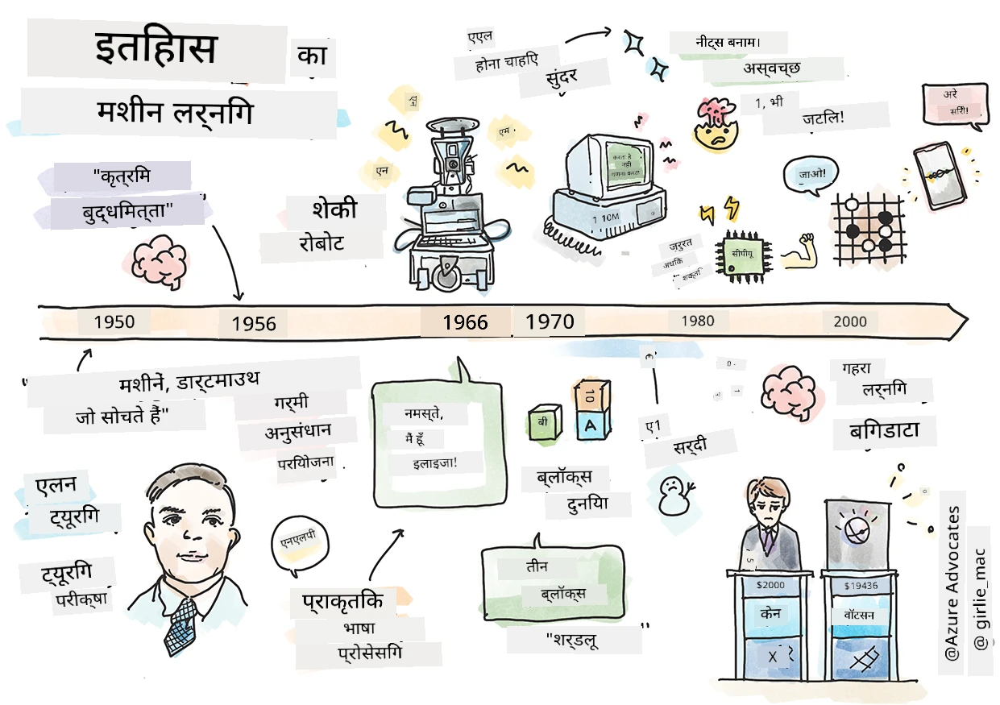
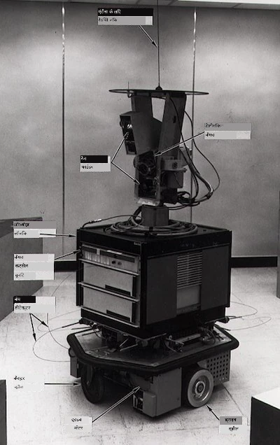
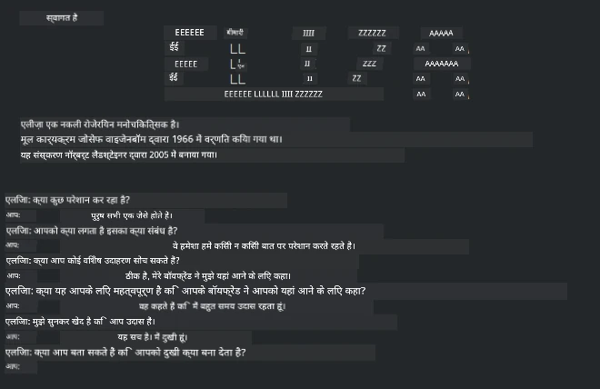

# मशीन लर्निंग का इतिहास

> स्केचनोट द्वारा [टोमोमी इमुरा](https://www.twitter.com/girlie_mac)

## [पूर्व-व्याख्यान क्विज़](https://ff-quizzes.netlify.app/en/ml/)

---

> 🎥 इस पाठ के माध्यम से काम करने वाले एक छोटे वीडियो के लिए ऊपर की छवि पर क्लिक करें।

इस पाठ में, हम मशीन लर्निंग और कृत्रिम बुद्धिमत्ता के इतिहास के प्रमुख मील के पत्थरों के माध्यम से चलेंगे।

कृत्रिम बुद्धिमत्ता (एआई) के क्षेत्र के रूप में इतिहास मशीन लर्निंग के इतिहास के साथ गहराई से जुड़ा हुआ है, क्योंकि एमएल के आधारभूत एल्गोरिदम और कम्प्यूटेशनल प्रगति ने एआई के विकास में योगदान दिया। यह ध्यान रखना उपयोगी है कि जबकि ये क्षेत्र अलग-अलग अनुसंधान क्षेत्रों के रूप में 1950 के दशक में निर्मित होने लगे, महत्वपूर्ण [एल्गोरिद्मिक, सांख्यिकीय, गणितीय, कम्प्यूटेशनल और तकनीकी खोजें](https://wikipedia.org/wiki/Timeline_of_machine_learning) इस युग से पहले के थे और ओवरलैप भी करती थीं। वास्तव में, लोग इन प्रश्नों के बारे में [सैकड़ों वर्षों से सोच रहे हैं](https://wikipedia.org/wiki/History_of_artificial_intelligence): यह लेख 'सोचने वाली मशीन' की अवधारणा के ऐतिहासिक बौद्धिक नींवों पर चर्चा करता है।

---
## उल्लेखनीय खोजें

- 1763, 1812 [बेस प्रमेय](https://wikipedia.org/wiki/Bayes%27_theorem) और इसके पूर्ववर्ती। यह प्रमेय और इसके अनुप्रयोग अनुमान के आधार हैं, जो किसी घटना के घटित होने की संभावना को पूर्व ज्ञान के आधार पर बताते हैं।
- 1805 फ्रांसीसी गणितज्ञ एड्रियन-मरी लेजेंड्रे द्वारा [लीस्ट स्क्वायर थ्योरी](https://wikipedia.org/wiki/Least_squares)। यह थ्योरी, जिसे आप हमारे रिग्रेशन यूनिट में सीखेंगे, डेटा फिटिंग में मदद करती है।
- 1913 [मार्कोव चेन](https://wikipedia.org/wiki/Markov_chain), जिसका नाम रूसी गणितज्ञ एंड्रे मार्कोव के नाम पर रखा गया है, एक पिछले राज्य के आधार पर संभावित घटनाओं के अनुक्रम को वर्णित करता है।
- 1957 [पर्सेप्ट्रॉन](https://wikipedia.org/wiki/Perceptron) एक प्रकार का रेखीय वर्गीकर्ता है जिसे अमेरिकी मनोवैज्ञानिक फ्रैंक रोसेंब्लाट ने आविष्कार किया था, जो डीप लर्निंग की प्रगति का आधार है।

---

- 1967 [नियरस्ट नेबर](https://wikipedia.org/wiki/Nearest_neighbor) एक एल्गोरिदम है जिसे मूल रूप से रास्ते मैप करने के लिए डिज़ाइन किया गया था। एमएल संदर्भ में इसका उपयोग पैटर्न पहचानने के लिए किया जाता है।
- 1970 [बैकप्रोपेगेशन](https://wikipedia.org/wiki/Backpropagation) का उपयोग [फीडफॉरवर्ड न्यूरल नेटवर्क्स](https://wikipedia.org/wiki/Feedforward_neural_network) को प्रशिक्षण देने के लिए किया जाता है।
- 1982 [रिकरंट न्यूरल नेटवर्क्स](https://wikipedia.org/wiki/Recurrent_neural_network) कृत्रिम न्यूरल नेटवर्क्स हैं जो फीडफॉरवर्ड न्यूरल नेटवर्क्स से व्युत्पन्न हैं और कालक्रमिक ग्राफ बनाते हैं।

✅ थोड़ा शोध करें। मशीन लर्निंग और एआई के इतिहास में किन अन्य तारीखों को निर्णायक माना जाता है?

---
## 1950: सोचने वाली मशीनें

एलन ट्यूरिंग, एक वास्तव में उल्लेखनीय व्यक्ति जिन्हें [2019 में जनता द्वारा](https://wikipedia.org/wiki/Icons:_The_Greatest_Person_of_the_20th_Century) 20वीं सदी के महानतम वैज्ञानिक के रूप में चुना गया, को 'सोच सकने वाली मशीन' की अवधारणा की नींव रखने में मदद करने का श्रेय दिया जाता है। उन्होंने नकारने वालों और इस अवधारणा के लिए अपनी आत्मसाक्ष्यात्मक साक्ष्य की आवश्यकता से जूझते हुए [ट्यूरिंग टेस्ट](https://www.bbc.com/news/technology-18475646) बनाया, जिसे आप हमारे एनएलपी पाठों में खोजेंगे।

---
## 1956: डार्टमाउथ समर रिसर्च प्रोजेक्ट

"कृत्रिम बुद्धिमत्ता पर डार्टमाउथ समर रिसर्च प्रोजेक्ट कृत्रिम बुद्धिमत्ता के क्षेत्र के लिए एक महत्वपूर्ण घटना थी," और यहां 'कृत्रिम बुद्धिमत्ता' शब्द पहली बार गढ़ा गया था ([स्रोत](https://250.dartmouth.edu/highlights/artificial-intelligence-ai-coined-dartmouth))।

> सीखने के हर पहलू या बुद्धिमत्ता के किसी अन्य गुण को इस तरह इतनी सटीकता से वर्णित किया जा सकता है कि इसे अनुकरण करने के लिए एक मशीन बनाई जा सके।

---

मुख्य शोधकर्ता, गणित के प्रोफेसर जॉन मैकार्थी, यह आशा रखते थे कि "यह अनुमान लगाते हुए कि सीखने का हर पहलू या बुद्धिमत्ता का कोई अन्य गुण इस तरह से सटीक रूप से वर्णित किया जा सकता है कि एक मशीन इसे अनुकरण कर सके," शोध को आगे बढ़ाएंगे। प्रतिभागियों में इस क्षेत्र के एक अन्य प्रसिद्ध व्यक्ति मार्विन मिंस्की भी शामिल थे।

यह कार्यशाला "प्रतीकात्मक विधियों के उदय, सीमित डोमेन पर केंद्रित प्रणालियों (प्रारंभिक विशेषज्ञ प्रणालियाँ), और तार्किक प्रणालियों के मुकाबले अनुक्रियात्मक प्रणालियों" सहित कई चर्चाओं को प्रेरित और प्रोत्साहित करने के लिए जानी जाती है। ([स्रोत](https://wikipedia.org/wiki/Dartmouth_workshop))।

---
## 1956 - 1974: "स्वर्ण काल"

1950 के दशक से मध्य '70 के दशक तक, एआई के कई समस्याओं को हल करने की आशा में आशावाद उच्च था। 1967 में, मार्विन मिंस्की ने आत्मविश्वास से कहा कि "एक पीढ़ी के भीतर ... 'कृत्रिम बुद्धिमत्ता' बनाने की समस्या काफी हद तक हल हो जाएगी।" (मिंस्की, मार्विन (1967), कंप्यूटेशन: फिनाइट एंड इनफिनिट मशीन, ऐंगलवुड क्लिफ्स, एन.जे.: प्रेंटिस-हाल)

प्राकृतिक भाषा प्रक्रिया अनुसंधान फल-फूल रहा था, खोज को परिष्कृत और अधिक शक्तिशाली बनाया गया, और 'माइक्रो-वर्ल्ड्स' की अवधारणा बनाई गई, जहां सरल कार्य सादे भाषा निर्देशों द्वारा पूरे किए गए।

---

शोध को सरकारी एजेंसियों द्वारा अच्छी तरह से वित्त पोषित किया गया, कम्प्यूटेशन और एल्गोरिदम में प्रगति हुई, और बुद्धिमान मशीनों के प्रोटोटाइप बनाए गए। इन मशीनों में से कुछ हैं:

* [शेकी रॉबोट](https://wikipedia.org/wiki/Shakey_the_robot), जो चालाकी से काम करने और निर्णय लेने में सक्षम था।

    
    > 1972 में शेकी

---

* एलिजा, एक प्रारंभिक 'चैटरबॉट', लोगों से बात कर सकती थी और एक प्राथमिक 'थेरेपिस्ट' की तरह कार्य कर सकती थी। आप एनएलपी पाठों में एलिजा के बारे में और जानेंगे।

    
    > एलिजा का एक संस्करण, एक चैटबॉट

---

* "ब्लॉक्स वर्ल्ड" एक माइक्रो-वर्ल्ड का उदाहरण था जहां ब्लॉकों को स्टैक और सॉर्ट किया जा सकता था, और मशीनों को निर्णय लेने के लिए प्रशिक्षित करने के प्रयोग किए जा सकते थे। [SHRDLU](https://wikipedia.org/wiki/SHRDLU) जैसी लाइब्रेरी के साथ विकसित प्रगति ने भाषा प्रसंस्करण को गति दी।

    

    > 🎥 वीडियो के लिए ऊपर की छवि पर क्लिक करें: SHRDLU के साथ ब्लॉक्स वर्ल्ड

---
## 1974 - 1980: "एआई विंटर"

मध्य 1970 के दशक तक यह स्पष्ट हो गया था कि 'बुद्धिमान मशीनें' बनाने की जटिलता को कम आंका गया था और उपलब्ध कंप्यूटिंग पावर के कारण इसकी उम्मीदों को बढ़ा-चढ़ा कर बताया गया था। वित्तपोषण खत्म हो गया और क्षेत्र में विश्वास कम हो गया। कुछ मुद्दों ने विश्वास को प्रभावित किया जिनमें शामिल थे:
---
- **सीमाएं**। कम्प्यूटिंग पावर बहुत सीमित था।
- **संयोजनात्मक विस्फोट**। कंप्यूटर से अधिक अपेक्षाएँ बढ़ने के साथ प्रशिक्षण के लिए आवश्यक पैरामीटर की संख्या तेजी से बढ़ी, बिना कंप्यूटिंग क्षमता के समानांतर विकास के।
- **डाटा की कमी**। परीक्षण, विकास और एल्गोरिदम सुधार प्रक्रिया को रोकने वाले डेटा की कमी थी।
- **क्या हम सही सवाल पूछ रहे हैं?**। पूछे जा रहे सवालों पर ही सवाल उठने लगे। शोधकर्ता अपनी विधियों पर आलोचना झेलने लगे:
  - ट्यूरिंग टेस्ट को 'चीनी रूम थ्योरी' जैसे विचारों के माध्यम से सवालों के घेरे में लाया गया, जिससे यह सिद्धांत दिया गया कि "डिजिटल कंप्यूटर को प्रोग्राम करने से वह भाषा को समझता हुआ प्रतीत हो सकता है पर असली समझ पैदा नहीं कर सकता।" ([स्रोत](https://plato.stanford.edu/entries/chinese-room/))
  - कृत्रिम बुद्धिमत्ता जैसे "थेरेपिस्ट" एलिजा को समाज में लाने की नैतिकता पर प्रश्न उठे।

---

इसी समय, विभिन्न AI विचारधाराओं का गठन होने लगा। ["अनाड़ी" बनाम "सुगठित AI"](https://wikipedia.org/wiki/Neats_and_scruffies) की द्वैतता स्थापित हुई। _अनाड़ी_ प्रयोगशालाएं घंटों प्रोग्रामों को समायोजित करती थीं जब तक वांछित परिणाम न मिल जाएं। _सुगठित_ प्रयोगशालाएं "तर्क और औपचारिक समस्या समाधान पर ध्यान केंद्रित करती थीं"। एलिजा और SHRDLU प्रसिद्ध _अनाड़ी_ प्रणालियां थीं। 1980 के दशक में, जब एमएल प्रणालियों को पुनरुत्पाद्य बनाने की मांग आई, तो _सुगठित_ दृष्टिकोण ने धीरे-धीरे बढ़त ली क्योंकि इसके परिणाम अधिक समझाने योग्य थे।

---
## 1980 का दशक: एक्सपर्ट सिस्टम्स

क्षेत्र के विकास के साथ, इसका व्यवसाय के लिए लाभ अधिक स्पष्ट हुआ, और 1980 के दशक में 'विशेषज्ञ प्रणाली' का प्रसार हुआ। "विशेषज्ञ प्रणाली कृत्रिम बुद्धिमत्ता (AI) सॉफ्टवेयर के पहले वास्तव में सफल रूपों में से थीं।" ([स्रोत](https://wikipedia.org/wiki/Expert_system))

इस तरह की प्रणाली वास्तव में _संकर_ होती है, जिसमें आंशिक रूप से एक नियम इंजन होता है जो व्यापार आवश्यकताओं को परिभाषित करता है, और एक निष्कर्ष इंजन जो नए तथ्य निकालने के लिए नियम प्रणाली का उपयोग करता है।

इस युग में न्यूरल नेटवर्क्स पर बढ़ती ध्यान भी देखा गया।

---
## 1987 - 1993: AI 'शांत अवधि'

विशेषज्ञ प्रणालियों के हार्डवेयर की वृद्धि ने उन्हें बहुत विशेषज्ञ बना दिया। पर्सनल कंप्यूटर का उदय भी इन बड़े, विशेषज्ञ, केंद्रीकृत प्रणालियों के साथ प्रतिस्पर्धा करने लगा। कंप्यूटिंग का लोकतंत्रीकरण शुरू हो चुका था, और यह अंततः बड़े डेटा के आधुनिक विस्फोट के लिए मार्ग प्रशस्त करता है।

---
## 1993 - 2011

इस युग में मशीन लर्निंग और एआई के लिए वह नया दौर आया जब वे उन समस्याओं को हल कर सके जो पहले डेटा और कम्प्यूटिंग शक्ति की कमी के कारण उत्पन्न हुई थीं। डेटा की मात्रा तेजी से बढ़ने लगी और व्यापक रूप से उपलब्ध हो गई, खासकर 2007 के आसपास स्मार्टफोन के आगमन के साथ। कम्प्यूटिंग पावर तेजी से बढ़ा, और एल्गोरिदम के साथ-साथ विकसित हुए। क्षेत्र ने परिपक्वता प्राप्त करना शुरू किया और बीते स्वतंत्र दिनों ने एक सच्चे अनुशासन का रूप लेना शुरू किया।

---
## अब

आज मशीन लर्निंग और एआई हमारे जीवन के लगभग हर हिस्से को छूते हैं। यह युग इन एल्गोरिदम के मानव जीवन पर जोखिमों और संभावित प्रभावों की सावधानीपूर्वक समझ की मांग करता है। माइक्रोसॉफ्ट के ब्रैड स्मिथ ने कहा है, "सूचना प्रौद्योगिकी उन मुद्दों को उठाती है जो मौलिक मानव अधिकार सुरक्षा जैसे गोपनीयता और अभिव्यक्ति की स्वतंत्रता के दिल से जुड़े हैं। ये मुद्दे उन तकनीकी कंपनियों के लिए जिम्मेदारी बढ़ाते हैं जो इन उत्पादों का निर्माण करती हैं। हमारे दृष्टिकोण में, ये सोच-समझकर सरकारी विनियमन और स्वीकार्य उपयोगों के आसपास मानदंडों के विकास की मांग करते हैं।" ([स्रोत](https://www.technologyreview.com/2019/12/18/102365/the-future-of-ais-impact-on-society/))

---

यह देखा जाना बाकी है कि भविष्य क्या लेकर आता है, लेकिन यह महत्वपूर्ण है कि हम इन कंप्यूटर सिस्टमों और उनके द्वारा चलाए जाने वाले सॉफ्टवेयर तथा एल्गोरिदम को समझें। हमें उम्मीद है कि यह पाठ्यक्रम आपको बेहतर समझ हासिल करने में मदद करेगा ताकि आप स्वयं निर्णय ले सकें।

> 🎥 वीडियो के लिए ऊपर की छवि पर क्लिक करें: यान लेकुन इस व्याख्यान में डीप लर्निंग के इतिहास पर चर्चा करते हैं

---
## 🚀चुनौती

इनमें से किसी एक ऐतिहासिक क्षण में गहराई से जानकारी जुटाएं और उनके पीछे के लोगों के बारे में और जानें। आकर्षक किरदार हैं, और कोई भी वैज्ञानिक खोज कभी सांस्कृतिक शून्य में उत्पन्न नहीं हुई। आप क्या खोजते हैं?

## [पश्चात-व्याख्यान क्विज़](https://ff-quizzes.netlify.app/en/ml/)

---
## समीक्षा और स्व-अध्ययन

देखने और सुनने के लिए ये आइटम हैं:

[यह पॉडकास्ट जहाँ एमी बॉयड AI के विकास पर चर्चा करती हैं](http://runasradio.com/Shows/Show/739)

---

## असाइनमेंट

[एक टाइमलाइन बनाएँ](assignment.md)

---

<!-- CO-OP TRANSLATOR DISCLAIMER START -->
**अस्वीकरण**:
इस दस्तावेज़ का अनुवाद AI अनुवाद सेवा [Co-op Translator](https://github.com/Azure/co-op-translator) का उपयोग करके किया गया है। जबकि हम सटीकता के लिए प्रयास करते हैं, कृपया ध्यान दें कि स्वचालित अनुवादों में त्रुटियाँ या अशुद्धियाँ हो सकती हैं। मूल दस्तावेज़ अपनी मूल भाषा में ही प्रामाणिक स्रोत माना जाना चाहिए। महत्वपूर्ण जानकारी के लिए, पेशेवर मानव अनुवाद की सिफारिश की जाती है। इस अनुवाद के उपयोग से उत्पन्न किसी भी गलतफहमी या गलत व्याख्या के लिए हम उत्तरदायी नहीं हैं।
<!-- CO-OP TRANSLATOR DISCLAIMER END -->