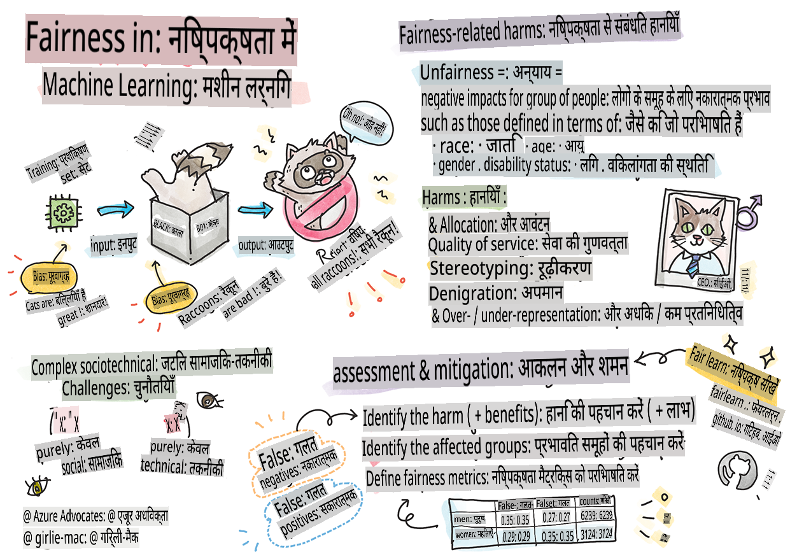

# जिम्मेदार AI के साथ मशीन लर्निंग समाधान बनाना

> स्केच नोट द्वारा [Tomomi Imura](https://www.twitter.com/girlie_mac)

## [पूर्व-व्याख्यान क्विज़](https://gray-sand-07a10f403.1.azurestaticapps.net/quiz/5/)

## परिचय

इस पाठ्यक्रम में, आप जानेंगे कि मशीन लर्निंग कैसे और किस प्रकार हमारे दैनिक जीवन को प्रभावित कर रही है। आज भी, सिस्टम और मॉडल स्वास्थ्य देखभाल निदान, ऋण स्वीकृति या धोखाधड़ी का पता लगाने जैसे दैनिक निर्णय लेने के कार्यों में शामिल हैं। इसलिए, यह महत्वपूर्ण है कि ये मॉडल अच्छे से काम करें और विश्वसनीय परिणाम प्रदान करें। जैसे किसी भी सॉफ्टवेयर एप्लिकेशन में, AI सिस्टम भी उम्मीदों को पूरा करने में असफल हो सकते हैं या अवांछित परिणाम दे सकते हैं। यही कारण है कि AI मॉडल के व्यवहार को समझना और समझाना आवश्यक है।

कल्पना करें कि जब आप इन मॉडलों को बनाने के लिए जिस डेटा का उपयोग कर रहे हैं उसमें कुछ जनसांख्यिकी की कमी हो, जैसे कि जाति, लिंग, राजनीतिक दृष्टिकोण, धर्म, या अनुपातहीन रूप से कुछ जनसांख्यिकी का प्रतिनिधित्व करता हो। क्या होगा जब मॉडल के आउटपुट को किसी जनसांख्यिकी के पक्ष में व्याख्या की जाती है? एप्लिकेशन के लिए इसका परिणाम क्या होगा? इसके अलावा, जब मॉडल का प्रतिकूल परिणाम होता है और यह लोगों के लिए हानिकारक होता है, तो क्या होता है? AI सिस्टम के व्यवहार के लिए कौन जिम्मेदार है? ये कुछ सवाल हैं जिन्हें हम इस पाठ्यक्रम में खोजेंगे।

इस पाठ में, आप:

- मशीन लर्निंग में निष्पक्षता और निष्पक्षता-संबंधित हानियों के महत्व के बारे में जागरूकता बढ़ाएंगे।
- विश्वसनीयता और सुरक्षा सुनिश्चित करने के लिए अपवादों और असामान्य परिदृश्यों की जांच करने के अभ्यास से परिचित होंगे।
- समावेशी सिस्टम डिज़ाइन करके सभी को सशक्त बनाने की आवश्यकता को समझेंगे।
- डेटा और लोगों की गोपनीयता और सुरक्षा की रक्षा करने के महत्व का अन्वेषण करेंगे।
- AI मॉडल के व्यवहार को समझाने के लिए एक ग्लास बॉक्स दृष्टिकोण के महत्व को देखेंगे।
- यह समझेंगे कि AI सिस्टम में विश्वास बनाने के लिए जवाबदेही कैसे महत्वपूर्ण है।

## आवश्यकताएं

एक आवश्यकतानुसार, कृपया "जिम्मेदार AI सिद्धांत" सीख पथ को पूरा करें और नीचे दिए गए वीडियो को देखें:

जिम्मेदार AI के बारे में अधिक जानने के लिए इस [लर्निंग पाथ](https://docs.microsoft.com/learn/modules/responsible-ai-principles/?WT.mc_id=academic-77952-leestott) का अनुसरण करें।

> 🎥 ऊपर की छवि पर क्लिक करें एक वीडियो के लिए: Microsoft का जिम्मेदार AI के प्रति दृष्टिकोण

## निष्पक्षता

AI सिस्टम को सभी के साथ निष्पक्षता से पेश आना चाहिए और समान समूहों के लोगों को अलग-अलग तरीके से प्रभावित करने से बचना चाहिए। उदाहरण के लिए, जब AI सिस्टम चिकित्सा उपचार, ऋण आवेदन या रोजगार पर मार्गदर्शन प्रदान करते हैं, तो उन्हें समान लक्षणों, वित्तीय परिस्थितियों या पेशेवर योग्यताओं वाले सभी लोगों को समान सिफारिशें देनी चाहिए। हम में से प्रत्येक व्यक्ति के पास विरासत में मिली पूर्वाग्रह होती है जो हमारे निर्णयों और कार्यों को प्रभावित करती है। ये पूर्वाग्रह उस डेटा में स्पष्ट हो सकते हैं जिसका हम AI सिस्टम को प्रशिक्षित करने के लिए उपयोग करते हैं। ऐसा हेरफेर कभी-कभी अनजाने में हो सकता है। डेटा में पूर्वाग्रह कब प्रस्तुत कर रहे हैं, इसे जानबूझकर समझना अक्सर कठिन होता है।

**“अन्याय”** में एक समूह के लोगों के लिए नकारात्मक प्रभाव, या “हानियां” शामिल हैं, जैसे कि जाति, लिंग, आयु या विकलांगता स्थिति के संदर्भ में परिभाषित। मुख्य निष्पक्षता-संबंधित हानियों को निम्नलिखित प्रकारों में वर्गीकृत किया जा सकता है:

- **आवंटन**, यदि उदाहरण के लिए एक लिंग या जातीयता को दूसरे पर प्राथमिकता दी जाती है।
- **सेवा की गुणवत्ता**। यदि आप डेटा को एक विशिष्ट परिदृश्य के लिए प्रशिक्षित करते हैं लेकिन वास्तविकता बहुत अधिक जटिल है, तो यह खराब प्रदर्शन करने वाली सेवा की ओर ले जाता है। उदाहरण के लिए, एक हाथ साबुन डिस्पेंसर जो गहरे रंग की त्वचा वाले लोगों को पहचानने में सक्षम नहीं लगता था। [संदर्भ](https://gizmodo.com/why-cant-this-soap-dispenser-identify-dark-skin-1797931773)
- **निंदा**। किसी चीज़ या किसी को अनुचित तरीके से आलोचना और लेबल करना। उदाहरण के लिए, एक छवि लेबलिंग तकनीक ने कुख्यात रूप से गहरे रंग की त्वचा वाले लोगों की छवियों को गोरिल्ला के रूप में गलत लेबल किया।
- **अधिक या कम प्रतिनिधित्व**। विचार यह है कि एक निश्चित समूह को एक निश्चित पेशे में नहीं देखा जाता है, और कोई भी सेवा या कार्य जो इसे बढ़ावा देना जारी रखता है, वह हानि में योगदान दे रहा है।
- **रूढ़िवादिता**। एक दिए गए समूह को पूर्व-निर्धारित गुणों के साथ जोड़ना। उदाहरण के लिए, अंग्रेजी और तुर्की के बीच एक भाषा अनुवाद प्रणाली में लिंग से जुड़े शब्दों के कारण गलतियाँ हो सकती हैं।

> तुर्की में अनुवाद

> अंग्रेजी में अनुवाद

AI सिस्टम को डिजाइन और परीक्षण करते समय, हमें यह सुनिश्चित करने की आवश्यकता है कि AI निष्पक्ष है और पूर्वाग्रहपूर्ण या भेदभावपूर्ण निर्णय लेने के लिए प्रोग्राम नहीं किया गया है, जिन्हें मनुष्यों को भी लेने की अनुमति नहीं है। AI और मशीन लर्निंग में निष्पक्षता सुनिश्चित करना एक जटिल सामाजिक-तकनीकी चुनौती बनी हुई है।

### विश्वसनीयता और सुरक्षा

विश्वास बनाने के लिए, AI सिस्टम को सामान्य और अप्रत्याशित परिस्थितियों में विश्वसनीय, सुरक्षित और सुसंगत होना चाहिए। यह जानना महत्वपूर्ण है कि AI सिस्टम विभिन्न स्थितियों में कैसे व्यवहार करेंगे, विशेष रूप से जब वे अपवाद होते हैं। AI समाधान बनाते समय, उन परिस्थितियों की एक विस्तृत विविधता को संभालने पर ध्यान केंद्रित करने की आवश्यकता होती है जिनका AI समाधान सामना करेगा। उदाहरण के लिए, एक स्व-चालित कार को लोगों की सुरक्षा को शीर्ष प्राथमिकता के रूप में रखना चाहिए। परिणामस्वरूप, कार को शक्ति देने वाले AI को सभी संभावित परिदृश्यों पर विचार करना चाहिए जिनका कार सामना कर सकती है, जैसे रात, तूफान या बर्फबारी, सड़क पर दौड़ते हुए बच्चे, पालतू जानवर, सड़क निर्माण आदि। AI सिस्टम कितनी अच्छी तरह से एक विस्तृत श्रृंखला की स्थितियों को विश्वसनीय और सुरक्षित तरीके से संभाल सकता है, यह उस स्तर को दर्शाता है जिसे डेटा वैज्ञानिक या AI डेवलपर ने सिस्टम के डिजाइन या परीक्षण के दौरान विचार किया था।

> [🎥 वीडियो के लिए यहां क्लिक करें: ](https://www.microsoft.com/videoplayer/embed/RE4vvIl)

### समावेशिता

AI सिस्टम को सभी को संलग्न और सशक्त बनाने के लिए डिज़ाइन किया जाना चाहिए। AI सिस्टम को डिजाइन और कार्यान्वित करते समय, डेटा वैज्ञानिक और AI डेवलपर्स सिस्टम में संभावित बाधाओं की पहचान करते हैं और उन्हें संबोधित करते हैं जो अनजाने में लोगों को बाहर कर सकते हैं। उदाहरण के लिए, दुनिया भर में 1 बिलियन लोग विकलांगता के साथ हैं। AI की प्रगति के साथ, वे अपनी दैनिक जिंदगी में अधिक आसानी से विभिन्न प्रकार की जानकारी और अवसरों तक पहुंच सकते हैं। बाधाओं को संबोधित करके, यह नवाचार और बेहतर अनुभवों के साथ AI उत्पादों के विकास के अवसर पैदा करता है जो सभी के लिए लाभकारी होते हैं।

> [🎥 वीडियो के लिए यहां क्लिक करें: AI में समावेशिता](https://www.microsoft.com/videoplayer/embed/RE4vl9v)

### सुरक्षा और गोपनीयता

AI सिस्टम को सुरक्षित और लोगों की गोपनीयता का सम्मान करना चाहिए। लोग उन सिस्टमों पर कम विश्वास करते हैं जो उनकी गोपनीयता, जानकारी या जीवन को जोखिम में डालते हैं। मशीन लर्निंग मॉडल को प्रशिक्षित करते समय, हम सबसे अच्छे परिणाम प्राप्त करने के लिए डेटा पर निर्भर होते हैं। ऐसा करते समय, डेटा की उत्पत्ति और अखंडता पर विचार करना आवश्यक है। उदाहरण के लिए, क्या डेटा उपयोगकर्ता द्वारा प्रस्तुत किया गया था या सार्वजनिक रूप से उपलब्ध था? इसके बाद, डेटा के साथ काम करते समय, यह महत्वपूर्ण है कि AI सिस्टम को गोपनीय जानकारी की रक्षा करने और हमलों का प्रतिरोध करने के लिए विकसित किया जाए। जैसे-जैसे AI अधिक प्रचलित हो रहा है, गोपनीयता की रक्षा और महत्वपूर्ण व्यक्तिगत और व्यावसायिक जानकारी की सुरक्षा अधिक महत्वपूर्ण और जटिल हो रही है। गोपनीयता और डेटा सुरक्षा के मुद्दों को AI के लिए विशेष रूप से करीब ध्यान देने की आवश्यकता होती है क्योंकि डेटा तक पहुंच AI सिस्टम के लिए लोगों के बारे में सटीक और सूचित पूर्वानुमान और निर्णय लेने के लिए आवश्यक होती है।

> [🎥 वीडियो के लिए यहां क्लिक करें: AI में सुरक्षा](https://www.microsoft.com/videoplayer/embed/RE4voJF)

- उद्योग के रूप में हमने गोपनीयता और सुरक्षा में महत्वपूर्ण प्रगति की है, जिसे GDPR (जनरल डेटा प्रोटेक्शन रेगुलेशन) जैसी विनियमों द्वारा काफी हद तक प्रेरित किया गया है।
- फिर भी AI सिस्टम के साथ हमें व्यक्तिगत डेटा की अधिक आवश्यकता को स्वीकार करना चाहिए ताकि सिस्टम अधिक व्यक्तिगत और प्रभावी हो सकें – और गोपनीयता।
- जैसे इंटरनेट के साथ जुड़े कंप्यूटरों के जन्म के साथ, हम AI से संबंधित सुरक्षा मुद्दों की संख्या में भी भारी वृद्धि देख रहे हैं।
- साथ ही, हमने देखा है कि सुरक्षा में सुधार के लिए AI का उपयोग किया जा रहा है। उदाहरण के लिए, अधिकांश आधुनिक एंटी-वायरस स्कैनर आज AI ह्यूरिस्टिक्स द्वारा संचालित होते हैं।
- हमें यह सुनिश्चित करने की आवश्यकता है कि हमारे डेटा विज्ञान प्रक्रियाएं नवीनतम गोपनीयता और सुरक्षा प्रथाओं के साथ सामंजस्यपूर्ण रूप से मिश्रित हों।

### पारदर्शिता

AI सिस्टम को समझने योग्य होना चाहिए। पारदर्शिता का एक महत्वपूर्ण हिस्सा AI सिस्टम और उनके घटकों के व्यवहार को समझाना है। AI सिस्टम की समझ में सुधार के लिए यह आवश्यक है कि हितधारक यह समझें कि वे कैसे और क्यों काम करते हैं ताकि वे संभावित प्रदर्शन मुद्दों, सुरक्षा और गोपनीयता चिंताओं, पूर्वाग्रहों, बहिष्करण प्रथाओं, या अनपेक्षित परिणामों की पहचान कर सकें। हम यह भी मानते हैं कि जो लोग AI सिस्टम का उपयोग करते हैं उन्हें यह ईमानदारी और स्पष्टता से बताना चाहिए कि वे कब, क्यों, और कैसे उनका उपयोग करते हैं। साथ ही उन सिस्टमों की सीमाओं को भी स्पष्ट करना चाहिए जो वे उपयोग करते हैं। उदाहरण के लिए, यदि एक बैंक अपने उपभोक्ता ऋण निर्णयों का समर्थन करने के लिए AI सिस्टम का उपयोग करता है, तो यह महत्वपूर्ण है कि परिणामों की जांच की जाए और यह समझा जाए कि कौन सा डेटा सिस्टम की सिफारिशों को प्रभावित करता है। सरकारें उद्योगों में AI को विनियमित करना शुरू कर रही हैं, इसलिए डेटा वैज्ञानिकों और संगठनों को यह बताना चाहिए कि क्या AI सिस्टम नियामक आवश्यकताओं को पूरा करता है, विशेष रूप से जब एक अवांछनीय परिणाम होता है।

> [🎥 वीडियो के लिए यहां क्लिक करें: AI में पारदर्शिता](https://www.microsoft.com/videoplayer/embed/RE4voJF)

- क्योंकि AI सिस्टम इतने जटिल हैं, यह समझना मुश्किल है कि वे कैसे काम करते हैं और परिणामों की व्याख्या कैसे करें।
- इस समझ की कमी इन सिस्टमों के प्रबंधन, संचालन, और दस्तावेज़ीकरण को प्रभावित करती है।
- इस समझ की कमी सबसे महत्वपूर्ण रूप से उन निर्णयों को प्रभावित करती है जो इन सिस्टमों द्वारा उत्पन्न परिणामों का उपयोग करके किए जाते हैं।

### जवाबदेही

AI सिस्टम को डिजाइन और तैनात करने वाले लोगों को अपने सिस्टम के संचालन के लिए जवाबदेह होना चाहिए। जवाबदेही की आवश्यकता विशेष रूप से संवेदनशील उपयोग तकनीकों जैसे चेहरे की पहचान के साथ महत्वपूर्ण है। हाल ही में, चेहरे की पहचान तकनीक की मांग बढ़ रही है, विशेष रूप से कानून प्रवर्तन संगठनों से जो इस तकनीक की संभावनाओं को लापता बच्चों को खोजने जैसे उपयोगों में देखते हैं। हालांकि, ये तकनीकें संभावित रूप से एक सरकार द्वारा अपने नागरिकों की मौलिक स्वतंत्रताओं को खतरे में डाल सकती हैं, जैसे कि विशिष्ट व्यक्तियों की निरंतर निगरानी को सक्षम करना। इसलिए, डेटा वैज्ञानिकों और संगठनों को अपने AI सिस्टम के व्यक्तियों या समाज पर प्रभाव के लिए जिम्मेदार होना चाहिए।

> 🎥 ऊपर की छवि पर क्लिक करें एक वीडियो के लिए: चेहरे की पहचान के माध्यम से बड़े पैमाने पर निगरानी की चेतावनी

अंततः हमारी पीढ़ी के लिए सबसे बड़े सवालों में से एक, जो AI को समाज में ला रही है, यह है कि कैसे यह सुनिश्चित किया जाए कि कंप्यूटर लोगों के प्रति जवाबदेह बने रहेंगे और यह सुनिश्चित किया जाए कि कंप्यूटर डिजाइन करने वाले लोग सभी के प्रति जवाबदेह बने रहें।

## प्रभाव मूल्यांकन

मशीन लर्निंग मॉडल को प्रशिक्षित करने से पहले, यह समझने के लिए एक प्रभाव मूल्यांकन करना महत्वपूर्ण है कि AI सिस्टम का उद्देश्य क्या है; इसका इरादा उपयोग क्या है; यह कहां तैनात किया जाएगा; और सिस्टम के साथ कौन बातचीत करेगा। ये समीक्षक या परीक्षकों के लिए सहायक होते हैं जो सिस्टम का मूल्यांकन करते समय संभावित जोखिमों और अपेक्षित परिणामों की पहचान करने के लिए विचार करने वाले कारकों को जानने में सहायक होते हैं।

प्रभाव मूल्यांकन करते समय निम्नलिखित क्षेत्रों पर ध्यान केंद्रित करें:

* **व्यक्तियों पर प्रतिकूल प्रभाव**। किसी भी प्रतिबंध या आवश्यकताओं, असमर्थित उपयोग या किसी भी ज्ञात सीमाओं से अवगत होना जो सिस्टम के प्रदर्शन को बाधित कर सकते हैं, यह सुनिश्चित करने के लिए महत्वपूर्ण है कि सिस्टम का उपयोग इस तरह से नहीं किया जाए जिससे व्यक्तियों को नुकसान हो।
* **डेटा आवश्यकताएं**। सिस्टम डेटा का उपयोग कैसे और कहां करेगा, इसे समझने से समीक्षकों को किसी भी डेटा आवश्यकताओं का पता लगाने में मदद मिलती है जिनके प्रति आपको सावधान रहना चाहिए (जैसे, GDPR या HIPPA डेटा विनियम)। इसके अलावा, यह जांचें कि प्रशिक्षण के लिए डेटा का स्रोत या मात्रा पर्याप्त है या नहीं।
* **प्रभाव का सारांश**। सिस्टम का उपयोग करने से उत्पन्न होने वाली संभावित हानियों की सूची एकत्र करें। ML जीवनचक्र के दौरान, यह समीक्षा करें कि पहचानी गई समस्याओं को कम किया गया है या संबोधित किया गया है।
* **छह मुख्य सिद्धांतों के लिए लागू लक्ष्य**। प्रत्येक सिद्धांत के लक्ष्यों का आकलन करें कि क्या वे मिले हैं और यदि कोई अंतराल हैं।

## जिम्मेदार AI के साथ डीबगिंग

किसी सॉफ्टवेयर एप्लिकेशन को डीबग करने की तरह, AI सिस्टम को डीबग करना सिस्टम में समस्याओं की पहचान करने और उन्हें हल करने की एक आवश्यक प्रक्रिया है। कई कारक हो सकते हैं जो मॉडल के अपेक्षित या जिम्मेदार तरीके से प्रदर्शन न करने को प्रभावित करते हैं। अधिकांश पारंपरिक मॉडल प्रदर्शन मेट्रिक्स मॉडल के प्रदर्शन के मात्रात्मक समुच्चय होते हैं, जो जिम्मेदार AI सिद्धांतों का उल्लंघन कैसे करते हैं, इसका विश्लेषण करने के लिए पर्याप्त नहीं होते। इसके अलावा, एक मशीन लर्निंग मॉडल एक ब्लैक बॉक्स है जो यह समझना मुश्किल बनाता है कि इसके परिणामों को क्या प्रेरित करता है या जब यह गलती करता है तो स्पष्टीकरण प्रदान करता है। इस पाठ्यक्रम में आगे, हम जिम्मेदार AI डैशबोर्ड का उपयोग करके AI सिस्टम को डीबग करना सीखेंगे। डैशबोर्ड डेटा वैज्ञानिकों और AI डेवलपर्स के लिए एक समग्र उपकरण प्रदान करता है:

* **त्रुटि विश्लेषण**। मॉडल की त्रुटि वितरण की पहचान करने के लिए जो सिस्टम की निष्पक्षता या विश्वसनीयता को प्रभावित कर सकता है।
* **मॉडल अवलोकन**। यह पता लगाने के लिए कि डेटा समूहों के प्रदर्शन में कहां असमानताएं हैं।
* **डेटा विश्लेषण**। डेटा वितरण को समझने के लिए और डेटा में किसी भी संभावित पूर्वाग्रह की पहचान करने के लिए जो निष्पक्षता, समावेशिता और विश्वसनीयता मुद्दों का कारण बन सकता है।
* **मॉडल व्याख्या**। यह समझने के लिए कि मॉडल की भविष्यवाणियों को क्या प्रभावित करता है। यह मॉडल के व्यवहार को समझाने में मदद करता है, जो पारदर्शिता और जवाबदेही के लिए महत्वपूर्ण है।

## 🚀 चुनौती

हानियों को पहले स्थान पर प्रस्तुत होने से रोकने के लिए, हमें:

- सिस्टम पर काम करने वाले लोगों के बीच विविध पृष्ठभूमि और दृष्टिकोण होने चाहिए।
- हमारे समाज की विविधता को दर्शाने वाले डेटा सेटों में निवेश करना चाहिए।
- मशीन लर्निंग जीवनचक्र के दौरान जिम्मेदार AI का पता लगाने और सुधारने के लिए बेहतर तरीकों का विकास करना चाहिए।

वास्तविक जीवन के परिदृश्यों के बारे में सोचें जहां मॉडल की अविश्वसनीयता मॉडल-निर्माण और उपयोग में स्पष्ट है। और क्या विचार करना चाहिए?

## [पोस्ट-व्याख्यान क्विज़](https://gray-sand-07a10f403.1.azurestaticapps.net/quiz/6/)
## समीक्षा और स्व

**अस्वीकरण**:
इस दस्तावेज़ का अनुवाद मशीन-आधारित एआई अनुवाद सेवाओं का उपयोग करके किया गया है। जबकि हम सटीकता के लिए प्रयास करते हैं, कृपया ध्यान दें कि स्वचालित अनुवादों में त्रुटियाँ या अशुद्धियाँ हो सकती हैं। मूल दस्तावेज़ को उसकी मूल भाषा में प्रामाणिक स्रोत माना जाना चाहिए। महत्वपूर्ण जानकारी के लिए, पेशेवर मानव अनुवाद की सिफारिश की जाती है। इस अनुवाद के उपयोग से उत्पन्न किसी भी गलतफहमी या गलत व्याख्या के लिए हम उत्तरदायी नहीं हैं।