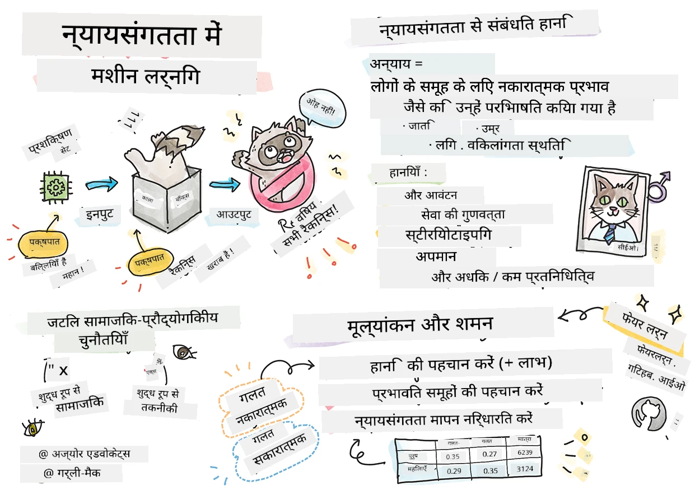

# जिम्मेदार AI के साथ मशीन लर्निंग समाधानों का निर्माण
 

> स्केचनोट द्वारा [Tomomi Imura](https://www.twitter.com/girlie_mac)

## [प्री-लेक्चर क्विज़](https://ff-quizzes.netlify.app/en/ml/)
 
## परिचय

इस पाठ्यक्रम में, आप खोज शुरू करेंगे कि मशीन लर्निंग हमारे दैनिक जीवन को कैसे प्रभावित कर रही है और कर सकती है। अभी भी, प्रणालियाँ और मॉडल रोज़मर्रा के निर्णय लेने के कार्यों में शामिल हैं, जैसे स्वास्थ्य देखभाल निदान, ऋण स्वीकृतियां या धोखाधड़ी का पता लगाना। इसलिए, यह महत्वपूर्ण है कि ये मॉडल विश्वसनीय परिणाम प्रदान करने के लिए अच्छी तरह से काम करें। किसी भी सॉफ़्टवेयर एप्लिकेशन की तरह, AI सिस्टम अपेक्षाओं पर खरे नहीं उतर सकते या अवांछित परिणामों का कारण बन सकते हैं। इसलिए, AI मॉडल के व्यवहार को समझना और समझाना आवश्यक है।

कल्पना कीजिए कि जब आप जिन डेटा का उपयोग इन मॉडलों के निर्माण के लिए कर रहे हैं, उनमें कुछ जनसांख्यिकी जैसे जाति, लिंग, राजनीतिक दृष्टिकोण, धर्म की कमी हो, या वे असंतुलित रूप से कुछ जनसांख्यिकीय समूहों का प्रतिनिधित्व करते हों। जब मॉडल का आउटपुट किसी जनसांख्यिकीय पक्षपात को प्रोत्साहित करता है तो क्या होता है? आवेदन के लिए इसका क्या परिणाम है? इसके अलावा, जब मॉडल का परिणाम प्रतिकूल होता है और लोगों के लिए हानिकारक होता है, तो क्या होता है? AI सिस्टम के व्यवहार के लिए कौन जिम्मेदार है? ये कुछ प्रश्न हैं जिनका हम इस पाठ्यक्रम में पता लगाएंगे।

इस पाठ में, आप:

- मशीन लर्निंग में निष्पक्षता के महत्व और निष्पक्षता-संबंधी हानियों के बारे में जागरूकता बढ़ाएंगे।
- विश्वसनीयता और सुरक्षा सुनिश्चित करने के लिए अपवादों और असामान्य परिदृश्यों की खोज के अभ्यास से परिचित होंगे।
- समावेशी सिस्टम डिजाइन करके सभी को सशक्त बनाने की आवश्यकता को समझेंगे।
- डेटा और लोगों की गोपनीयता और सुरक्षा की रक्षा के महत्व की जांच करेंगे।
- AI मॉडलों के व्यवहार को समझाने के लिए ग्लास बॉक्स दृष्टिकोण की आवश्यकता को देखेंगे।
- AI सिस्टमों में भरोसा बनाने के लिए जवाबदेही के महत्व के प्रति सावधान रहना सीखेंगे।

## पूर्वापेक्षा

पूर्वापेक्षा के रूप में, कृपया "Responsible AI Principles" लर्न पाथ लें और नीचे दिए गए वीडियो को देखें:

जिम्मेदार AI के बारे में अधिक जानने के लिए इस [लर्निंग पाथ](https://docs.microsoft.com/learn/modules/responsible-ai-principles/?WT.mc_id=academic-77952-leestott) का अनुसरण करें

> 🎥 ऊपर छवि पर क्लिक करें वीडियो के लिए: Microsoft का Responsible AI के प्रति दृष्टिकोण

## निष्पक्षता

AI सिस्टम सभी के साथ निष्पक्ष व्यवहार करें और समान समूहों के लोगों के साथ भिन्न तरीकों से प्रभाव न डालें। उदाहरण के लिए, जब AI सिस्टम चिकित्सा उपचार, ऋण आवेदन या रोजगार पर मार्गदर्शन प्रदान करते हैं, तो वे समान लक्षण, वित्तीय परिस्थितियाँ या व्यावसायिक योग्यताओं वाले सभी को समान सिफारिशें करें। हममें से प्रत्येक मनुष्य विरासत में मिली पूर्वाग्रह लेकर चलता है, जो हमारे निर्णयों और कार्यों को प्रभावित करता है। ये पूर्वाग्रह उस डेटा में स्पष्ट हो सकते हैं जिसका हम AI सिस्टम के प्रशिक्षण के लिए उपयोग करते हैं। कभी-कभी ऐसा अनजाने में होता है। यह जानना अक्सर कठिन होता है कि आप डेटा में कब पूर्वाग्रह लाकर उसे प्रभावित कर रहे हैं।

**"अन्याय"** नकारात्मक प्रभावों या "हानियों" को दर्शाता है, जो किसी समूह के लिए हो सकती हैं, जैसे जाति, लिंग, उम्र या विकलांगता स्थिति के संदर्भ में परिभाषित। मुख्य निष्पक्षता-संबंधी हानियाँ निम्नलिखित प्रकार से वर्गीकृत की जा सकती हैं:

- **आवंटन**, यदि उदाहरण के लिए कोई लिंग या जातीयता दूसरे की तुलना में अधिक पसंद की जाए।
- **सेवा की गुणवत्ता**। अगर आप किसी विशेष परिदृश्य के लिए डेटा का प्रशिक्षण करते हैं लेकिन वास्तविकता अधिक जटिल है, तो यह खराब प्रदर्शन वाली सेवा को जन्म देता है। उदाहरण के लिए, एक हाथ धोने का साबुन डिस्पेंसर जो गहरे रंग की त्वचा वाले लोगों को महसूस नहीं कर पाता। [संदर्भ](https://gizmodo.com/why-cant-this-soap-dispenser-identify-dark-skin-1797931773)
- **अपमानजनक टिप्पणी**। किसी चीज़ या किसी के प्रति अन्यायपूर्ण आलोचना और लेबल लगाना। उदाहरण के लिए, एक इमेज लेबलिंग तकनीक ने कुख्यात रूप से गहरे रंग की त्वचा वाले लोगों की तस्वीरों को गोरिल्ला के रूप में गलत लेबल किया।
- **अधिप्रतिनिधित्व या अतिप्रतिनिधित्व**। धारणा यह है कि किसी निश्चित समूह को किसी पेशे में नहीं देखा जाता, और कोई भी सेवा या फ़ंक्शन जो इसे बढ़ावा देता है वह हानि का योगदान देता है।
- **स्टीरियोटाइपिंग**। किसी निर्दिष्ट समूह का पूर्व निर्धारित विशेषताओं के साथ जुड़ाव। उदाहरण के लिए, अंग्रेज़ी और तुर्की भाषा के बीच अनुवाद प्रणाली में ऐसे शब्दों के कारण गलतियां हो सकती हैं, जिनके लिंग से जुड़े पूर्वाग्रह होते हैं।

> तुर्की में अनुवाद

> अंग्रेज़ी में वापस अनुवाद

AI सिस्टम डिजाइन और परीक्षण करते समय, हमें यह सुनिश्चित करना चाहिए कि AI निष्पक्ष हो और पक्षपातपूर्ण या भेदभावपूर्ण निर्णय लेने के लिए प्रोग्राम न किया गया हो, जो मनुष्यों को भी निषिद्ध है। AI और मशीन लर्निंग में निष्पक्षता को गारंटीकृत करना एक जटिल सामाजिक-तकनीकी चुनौती है।

### विश्वसनीयता और सुरक्षा

भरोसा बनाने के लिए, AI सिस्टम विश्वसनीय, सुरक्षित और सामान्य तथा अप्रत्याशित परिस्थितियों में स्थिर होने चाहिए। यह जानना महत्वपूर्ण है कि AI सिस्टम विभिन्न परिस्थितियों में कैसे व्यवहार करेंगे, विशेषकर जब वे अपवाद(आउटलेयर) हों। AI समाधान बनाते समय, विभिन्न प्रकार की परिस्थितियों का सामना करने के तरीके पर पर्याप्त ध्यान देना आवश्यक है। उदाहरण के लिए, स्वचालित चलने वाली कार को लोगों की सुरक्षा सर्वोच्च प्राथमिकता देनी चाहिए। इसलिए, उस कार को चलाने वाले AI को सभी संभावित परिदृश्यों पर विचार करना चाहिए, जैसे रात, तूफान या हिमपात, सड़क पार करते बच्चे, पालतू जानवर, सड़क निर्माण आदि। AI सिस्टम कितनी अच्छी तरह से इन विभिन्न परिस्थितियों को विश्वसनीय और सुरक्षित तरीके से हैंडल कर सकता है, यह इस बात पर निर्भर करता है कि डेटा वैज्ञानिक या AI डेवलपर ने डिजाइन या परीक्षण के दौरान कितनी अच्छी तरह से पूर्वानुमान लगाया।

> [🎥 वीडियो के लिए यहाँ क्लिक करें: ](https://www.microsoft.com/videoplayer/embed/RE4vvIl)

### समावेशन

AI सिस्टम को इस तरह डिजाइन किया जाना चाहिए कि वे सभी को शामिल करें और सशक्त बनाएं। AI सिस्टम डिजाइन और क्रियान्वयन करते समय डेटा वैज्ञानिक और AI डेवलपर संभावित बाधाओं की पहचान कर उन्हें दूर करते हैं, जो अनजाने में लोगों को बाहर कर सकती हैं। उदाहरण के लिए, दुनिया भर में 1 अरब से अधिक लोग विकलांग हैं। AI के विकास के साथ, वे अपने दैनिक जीवन में आसानी से सूचना और अवसरों तक पहुंच सकते हैं। बाधाओं को दूर करके, बेहतर अनुभव के साथ AI उत्पाद विकसित करने और नवाचार के अवसर पैदा किए जा सकते हैं जो सभी के लिए लाभकारी हों।

> [🎥 AI में समावेशन के लिए यहाँ क्लिक करें वीडियो पर](https://www.microsoft.com/videoplayer/embed/RE4vl9v)

### सुरक्षा और गोपनीयता

AI सिस्टम सुरक्षित होने चाहिए और लोगों की गोपनीयता का सम्मान करना चाहिए। लोग ऐसे सिस्टम पर कम भरोसा करते हैं जो उनकी गोपनीयता, जानकारी या जीवन को खतरे में डालते हैं। मशीन लर्निंग मॉडल को प्रशिक्षित करते समय, हम सर्वोत्तम परिणाम पाने के लिए डेटा पर निर्भर करते हैं। ऐसा करते समय, डेटा की उत्पत्ति और अखंडता पर विचार करना आवश्यक है। उदाहरण के लिए, क्या डेटा उपयोगकर्ता द्वारा प्रस्तुत किया गया था या सार्वजनिक रूप से उपलब्ध था? अगला, डेटा के साथ काम करते समय, ऐसे AI सिस्टम विकसित करना महत्वपूर्ण है जो गोपनीय जानकारी की रक्षा कर सके और हमलों का सामना कर सके। जैसे-जैसे AI अधिक प्रचलित हो रहा है, गोपनीयता की सुरक्षा और महत्वपूर्ण व्यक्तिगत और व्यावसायिक जानकारी की सुरक्षा अधिक महत्वपूर्ण और जटिल होती जा रही है। गोपनीयता और डेटा सुरक्षा के मुद्दे AI के लिए विशेष रूप से ध्यान देने योग्य हैं क्योंकि AI सिस्टमों को लोगों के बारे में सटीक और सूचित पूर्वानुमान और निर्णय लेने के लिए डेटा तक पहुंच आवश्यक है।

> [🎥 AI में सुरक्षा के लिए यहाँ क्लिक करें वीडियो पर](https://www.microsoft.com/videoplayer/embed/RE4voJF)

- एक उद्योग के रूप में, हमने GDPR (General Data Protection Regulation) जैसे नियमों के चलते गोपनीयता और सुरक्षा में उल्लेखनीय प्रगति की है। 
- फिर भी AI सिस्टमों के साथ हमें अधिक व्यक्तिगत डेटा की आवश्यकता और गोपनीयता के बीच टकराव को स्वीकार करना होगा।
- ठीक वैसे ही जैसे इंटरनेट के साथ जुड़े कंप्यूटरों के जन्म के दौरान, AI से संबंधित सुरक्षा मुद्दों की संख्या में भी भारी वृद्धि देखी जा रही है।
- साथ ही, हमने देखा है कि सुरक्षा सुधारने के लिए AI का उपयोग किया जा रहा है। उदाहरण के लिए, अधिकांश आधुनिक एंटी-वायरस स्कैनर आज AI ह्यूरिस्टिक्स द्वारा संचालित हैं।
- हमें सुनिश्चित करना होगा कि हमारा डेटा साइंस प्रक्रियाएँ नवीनतम गोपनीयता और सुरक्षा प्रथाओं के साथ तालमेल में हों।

### पारदर्शिता
AI सिस्टम को समझने योग्य होना चाहिए। पारदर्शिता का एक महत्वपूर्ण हिस्सा AI सिस्टमों और उनके घटकों के व्यवहार की व्याख्या करना है। AI सिस्टमों की समझ में सुधार के लिए यह आवश्यक है कि हितधारक यह समझें कि वे कैसे और क्यों कार्य करते हैं ताकि वे संभावित प्रदर्शन समस्याओं, सुरक्षा और गोपनीयता चिंताओं, पूर्वाग्रह, बहिष्करण संबंधी प्रथाओं या अनपेक्षित परिणामों की पहचान कर सकें। हम यह भी मानते हैं कि जो लोग AI सिस्टमों का उपयोग करते हैं, उन्हें ईमानदार और स्पष्ट होना चाहिए कि वे कब, क्यों और कैसे इन्हें लागू करते हैं। साथ ही, जिन सिस्टमों का वे उपयोग करते हैं उनकी सीमाओं को समझाना भी आवश्यक है। उदाहरण के लिए, यदि कोई बैंक अपने उपभोक्ता ऋण निर्णयों का समर्थन करने के लिए AI सिस्टम का उपयोग करता है, तो परिणामों की जांच करना और यह समझना महत्वपूर्ण है कि कौन सा डेटा सिस्टम की सिफारिशों को प्रभावित करता है। सरकारें उद्योगों में AI को विनियमित करना शुरू कर रही हैं, इसलिए डेटा वैज्ञानिकों और संगठनों को यह समझाना होगा कि क्या कोई AI सिस्टम नियामक आवश्यकताओं को पूरा करता है, विशेष रूप से जब कोई अवांछित परिणाम होता है।

> [🎥 AI में पारदर्शिता के लिए यहाँ क्लिक करें वीडियो पर](https://www.microsoft.com/videoplayer/embed/RE4voJF)

- क्योंकि AI सिस्टम इतने जटिल हैं, यह समझना कठिन है कि वे कैसे काम करते हैं और परिणामों की व्याख्या कैसे करें।
- इस समझ के अभाव का प्रभाव इन सिस्टमों के प्रबंधन, संचालन और प्रलेखन पर पड़ता है।
- यह समझ के अभाव का सबसे महत्वपूर्ण प्रभाव उन निर्णयों पर पड़ता है जो इन सिस्टमों द्वारा उत्पन्न परिणामों के आधार पर लिए जाते हैं।

### जवाबदेही
 
वे लोग जो AI सिस्टम डिजाइन और तैनात करते हैं, उन्हें अपने सिस्टम के संचालन के लिए जवाबदेह होना चाहिए। जवाबदेही की आवश्यकता विशेष रूप से संवेदनशील उपयोग जैसी तकनीकों के साथ महत्वपूर्ण होती है जैसे चेहरे की पहचान। हाल ही में, कानून प्रवर्तन संगठनों की ओर से चेहरे की पहचान तकनीक की मांग बढ़ रही है, जो इससे खोए हुए बच्चों को खोजने जैसे उपयोग देखते हैं। हालांकि, ये तकनीकें संभावित रूप से सरकार द्वारा अपने नागरिकों की मौलिक स्वतंत्रताओं को जोखिम में डालने के लिए उपयोग की जा सकती हैं, उदाहरण के लिए, विशिष्ट व्यक्तियों की निरंतर निगरानी सक्षम करके। इसलिए, डेटा वैज्ञानिकों और संगठनों को जिम्मेदार होना चाहिए कि उनका AI सिस्टम व्यक्तियों या समाज पर कैसे प्रभाव डालता है।

> 🎥 ऊपर छवि पर क्लिक करें वीडियो के लिए: चेहरे की पहचान के जरिए व्यापक निगरानी की चेतावनियाँ

अंततः, हमारी पीढ़ी के लिए सबसे बड़ा सवाल यह है, जो AI को समाज में ला रही है, कि यह कैसे सुनिश्चित करें कि कंप्यूटर लोगों के प्रति जवाबदेह बने रहें और वे लोग जो कंप्यूटर डिजाइन करते हैं, वे सभी के प्रति जवाबदेह बने रहें।

## प्रभाव आकलन

मशीन लर्निंग मॉडल प्रशिक्षित करने से पहले, यह महत्वपूर्ण है कि प्रभाव आकलन किया जाए ताकि AI सिस्टम के उद्देश्य, इसके उपयोग क्षेत्र, कहां लागू किया जाएगा और कौन इस सिस्टम के साथ बातचीत करेगा, ये समझा जा सके। समीक्षा करने वाले या परीक्षणकर्ता यह जान पाते हैं कि संभावित जोखिम और अपेक्षित परिणामों की पहचान करते समय किन पहलुओं पर ध्यान देना है।

प्रभाव आकलन करते समय निम्न क्षेत्र ध्यान केंद्रित किए जाते हैं:

* **व्यक्तियों पर प्रतिकूल प्रभाव**। किसी भी प्रतिबंध, आवश्यकताओं, अनुचित उपयोग या ज्ञात सीमाओं के प्रति जागरूक रहना आवश्यक है ताकि यह सुनिश्चित किया जा सके कि सिस्टम का उपयोग ऐसे तरीके से न हो जो व्यक्तियों को हानि पहुंचाए।
* **डेटा आवश्यकताएँ**। यह समझना कि सिस्टम डेटा का उपयोग कैसे और कहां करेगा, समीक्षकों को डेटा आवश्यकताओं (जैसे, GDPR या HIPAA डेटा नियम) के प्रति जागरूक होने में सक्षम बनाता है। इसके अलावा, जांचें कि प्रशिक्षण के लिए स्रोत या डेटा की मात्रा पर्याप्त है या नहीं।
* **प्रभाव का सारांश**। सिस्टम के उपयोग से उत्पन्न होने वाली संभावित हानियों की सूची एकत्र करें। ML जीवनचक्र के दौरान, जाँचे कि पहचानी गई समस्याएँ कम या सुलझाई गई हैं या नहीं।
* छह प्रमुख सिद्धांतों में से प्रत्येक के लिए **लागू उद्देश्यों**। यह आकलन करें कि सिद्धांतों के लक्ष्य पूरे होते हैं या कोई अंतराल है।

## जिम्मेदार AI के साथ डिबगिंग

किसी सॉफ़्टवेयर एप्लिकेशन की तरह ही, AI सिस्टम की डिबगिंग आवश्यक प्रक्रिया है जो सिस्टम की समस्याओं की पहचान और समाधान करती है। कई ऐसे कारक होते हैं जो एक मॉडल को अपेक्षित या जिम्मेदार तरीके से प्रदर्शन न करने पर प्रभाव डालते हैं। अधिकांश पारंपरिक मॉडल प्रदर्शन मीट्रिक्स मॉडल के प्रदर्शन के मात्रात्मक सारांश हैं, जो यह विश्लेषण करने के लिए पर्याप्त नहीं हैं कि मॉडल जिम्मेदार AI सिद्धांतों का उल्लंघन कैसे करता है। इसके अलावा, एक मशीन लर्निंग मॉडल एक ब्लैक बॉक्स होता है जिससे यह समझना मुश्किल हो जाता है कि उसके परिणाम को क्या प्रेरित करता है या जब वह गलती करता है तो उसकी व्याख्या देना कठिन होता है। इस कोर्स के आगे के भाग में, हम जिम्मेदार AI डैशबोर्ड का उपयोग करना सीखेंगे जो AI सिस्टम डिबग करने में मदद करता है। यह डैशबोर्ड डेटा वैज्ञानिकों और AI डेवलपर्स के लिए एक समग्र उपकरण प्रदान करता है:

* **त्रुटि विश्लेषण**। मॉडल की त्रुटियों का वितरण पहचानने के लिए जो सिस्टम की निष्पक्षता या विश्वसनीयता प्रभावित कर सकते हैं।
* **मॉडल अवलोकन**। यह जानने के लिए कि डेटा समूहों के प्रदर्शन में कहाँ असमानताएं हैं।
* **डेटा विश्लेषण**। डेटा वितरण को समझने और ऐसे संभावित पूर्वाग्रह की पहचान करने के लिए जो निष्पक्षता, समावेशन और विश्वसनीयता से संबंधित समस्याएँ पैदा कर सकता है।
* **मॉडल व्याख्यात्मकता**। यह समझने के लिए कि मॉडल के पूर्वानुमानों को क्या प्रभावित करता है। यह मॉडल के व्यवहार को समझाने में मदद करता है, जो पारदर्शिता और जवाबदेही के लिए महत्वपूर्ण है।

## 🚀 चुनौती
 
हानियों को शुरू में ही रोकने के लिए, हमें:

- सिस्टम पर काम करने वाले लोगों के बीच पृष्ठभूमि और दृष्टिकोण में विविधता होनी चाहिए।
- ऐसे डेटासेट्स में निवेश करें जो हमारे समाज की विविधता को दर्शाते हों।
- मशीन लर्निंग जीवनचक्र के दौरान जिम्मेदार AI के किसी भी उल्लंघन का पता लगाने और सुधारने के लिए बेहतर विधियाँ विकसित करें।

वास्तविक जीवन के परिदृश्यों के बारे में सोचें जहाँ मॉडल की अविश्वसनीयता मॉडल निर्माण और उपयोग में स्पष्ट हो। हमें और क्या विचार करना चाहिए?

## [पोस्ट-लेक्चर क्विज़](https://ff-quizzes.netlify.app/en/ml/)

## पुनरावलोकन और स्व-अध्ययन 
 

इस पाठ में, आपने मशीन लर्निंग में निष्पक्षता और अन्याय के कुछ मूलभूत सिद्धांतों के बारे में सीखा है।  
 
इन विषयों में गहराई से जाने के लिए इस कार्यशाला को देखें: 

- जिम्मेदार एआई के प्रयास में: सिद्धांतों को अभ्यास में लाना, लेखक: बेस्मिरा नूशी, मेहरनूश सामेकी और अमित शर्मा

> 🎥 वीडियो के लिए ऊपर दिए गए चित्र पर क्लिक करें: RAI Toolbox: बेस्मिरा नूशी, मेहरनूश सामेकी, और अमित शर्मा द्वारा जिम्मेदार एआई के लिए एक ओपन-सोर्स फ्रेमवर्क

साथ ही, पढ़ें: 

- माइक्रोसॉफ्ट का RAI संसाधन केंद्र: [Responsible AI Resources – Microsoft AI](https://www.microsoft.com/ai/responsible-ai-resources?activetab=pivot1%3aprimaryr4) 

- माइक्रोसॉफ्ट का FATE अनुसंधान समूह: [FATE: Fairness, Accountability, Transparency, and Ethics in AI - Microsoft Research](https://www.microsoft.com/research/theme/fate/) 

RAI टूलबॉक्स: 

- [Responsible AI Toolbox GitHub repository](https://github.com/microsoft/responsible-ai-toolbox)

निष्पक्षता सुनिश्चित करने के लिए Azure Machine Learning के उपकरणों के बारे में पढ़ें:

- [Azure Machine Learning](https://docs.microsoft.com/azure/machine-learning/concept-fairness-ml?WT.mc_id=academic-77952-leestott) 

## असाइनमेंट

[RAI टूलबॉक्स खोजें](assignment.md)

---

<!-- CO-OP TRANSLATOR DISCLAIMER START -->
**अस्वीकरण**:
इस दस्तावेज़ का अनुवाद AI अनुवाद सेवा [Co-op Translator](https://github.com/Azure/co-op-translator) का उपयोग करके किया गया है। जबकि हम सटीकता के लिए प्रयास करते हैं, कृपया ध्यान दें कि स्वचालित अनुवादों में त्रुटियाँ या अशुद्धियाँ हो सकती हैं। मूल दस्तावेज़ अपनी मूल भाषा में ही प्रामाणिक स्रोत माना जाना चाहिए। महत्वपूर्ण जानकारी के लिए, पेशेवर मानव अनुवाद की सिफारिश की जाती है। इस अनुवाद के उपयोग से उत्पन्न किसी भी गलतफहमी या गलत व्याख्या के लिए हम उत्तरदायी नहीं हैं।
<!-- CO-OP TRANSLATOR DISCLAIMER END -->