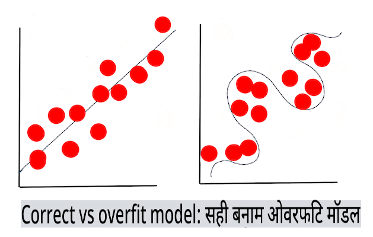

# मशीन लर्निंग की तकनीकें

मशीन लर्निंग मॉडल और उनके डेटा को बनाने, उपयोग करने और बनाए रखने की प्रक्रिया कई अन्य विकास वर्कफ़्लो से बहुत अलग है। इस पाठ में, हम इस प्रक्रिया को सरल बनाएंगे, और मुख्य तकनीकों का वर्णन करेंगे जिन्हें आपको जानने की आवश्यकता है। आप:

- उच्च स्तर पर मशीन लर्निंग के अंतर्निहित प्रक्रियाओं को समझेंगे।
- 'मॉडल', 'प्रेडिक्शन', और 'ट्रेनिंग डेटा' जैसे आधारभूत अवधारणाओं का अन्वेषण करेंगे।

## [पाठ से पहले की क्विज़](https://gray-sand-07a10f403.1.azurestaticapps.net/quiz/7/)

> 🎥 इस पाठ के माध्यम से काम करने के लिए ऊपर दी गई छवि पर क्लिक करें।

## परिचय

उच्च स्तर पर, मशीन लर्निंग (एमएल) प्रक्रियाओं को बनाने की कला कई चरणों में विभाजित होती है:

1. **प्रश्न तय करें**। अधिकांश एमएल प्रक्रियाएं एक प्रश्न पूछने से शुरू होती हैं जिसे एक साधारण कंडीशनल प्रोग्राम या नियम-आधारित इंजन द्वारा उत्तर नहीं दिया जा सकता। ये प्रश्न अक्सर डेटा के संग्रह के आधार पर भविष्यवाणियों के इर्द-गिर्द घूमते हैं।
2. **डेटा एकत्र करें और तैयार करें**। अपने प्रश्न का उत्तर देने के लिए, आपको डेटा की आवश्यकता होती है। आपके डेटा की गुणवत्ता और, कभी-कभी, मात्रा यह निर्धारित करेगी कि आप अपने प्रारंभिक प्रश्न का उत्तर कितनी अच्छी तरह दे सकते हैं। डेटा का विज़ुअलाइज़ेशन इस चरण का एक महत्वपूर्ण पहलू है। इस चरण में डेटा को प्रशिक्षण और परीक्षण समूह में विभाजित करना भी शामिल है ताकि एक मॉडल बनाया जा सके।
3. **प्रशिक्षण विधि चुनें**। आपके प्रश्न और आपके डेटा की प्रकृति के आधार पर, आपको यह चुनना होगा कि आप अपने डेटा को सर्वोत्तम रूप से प्रतिबिंबित करने और इसके खिलाफ सटीक भविष्यवाणी करने के लिए एक मॉडल को कैसे प्रशिक्षित करना चाहते हैं। यह आपके एमएल प्रक्रिया का वह हिस्सा है जिसके लिए विशिष्ट विशेषज्ञता की आवश्यकता होती है और अक्सर, काफी मात्रा में प्रयोग की आवश्यकता होती है।
4. **मॉडल को प्रशिक्षित करें**। अपने प्रशिक्षण डेटा का उपयोग करके, आप डेटा में पैटर्न को पहचानने के लिए विभिन्न एल्गोरिदम का उपयोग करके एक मॉडल को प्रशिक्षित करेंगे। मॉडल आंतरिक वज़नों का लाभ उठा सकता है जिन्हें डेटा के कुछ हिस्सों को दूसरों पर प्राथमिकता देने के लिए समायोजित किया जा सकता है ताकि एक बेहतर मॉडल बनाया जा सके।
5. **मॉडल का मूल्यांकन करें**। आप अपने एकत्र किए गए सेट से पहले कभी नहीं देखे गए डेटा (अपने परीक्षण डेटा) का उपयोग करके देखेंगे कि मॉडल कैसे प्रदर्शन कर रहा है।
6. **पैरामीटर ट्यूनिंग**। आपके मॉडल के प्रदर्शन के आधार पर, आप विभिन्न पैरामीटर या वेरिएबल का उपयोग करके प्रक्रिया को दोबारा कर सकते हैं जो मॉडल को प्रशिक्षित करने के लिए उपयोग किए गए एल्गोरिदम के व्यवहार को नियंत्रित करते हैं।
7. **भविष्यवाणी करें**। अपने मॉडल की सटीकता का परीक्षण करने के लिए नए इनपुट का उपयोग करें।

## कौन सा प्रश्न पूछना है

कंप्यूटर डेटा में छिपे पैटर्न की खोज करने में विशेष रूप से कुशल होते हैं। यह उपयोगिता उन शोधकर्ताओं के लिए बहुत सहायक होती है जिनके पास किसी दिए गए डोमेन के बारे में प्रश्न होते हैं जिन्हें एक शर्त-आधारित नियम इंजन बनाकर आसानी से उत्तर नहीं दिया जा सकता। उदाहरण के लिए, एक एक्चुरियल कार्य को देखते हुए, एक डेटा वैज्ञानिक धूम्रपान करने वालों बनाम गैर-धूम्रपान करने वालों की मृत्यु दर के आसपास हस्तनिर्मित नियम बना सकता है।

हालांकि, जब कई अन्य वेरिएबल को समीकरण में लाया जाता है, तो एक एमएल मॉडल पिछले स्वास्थ्य इतिहास के आधार पर भविष्य की मृत्यु दर की भविष्यवाणी करने में अधिक कुशल साबित हो सकता है। एक अधिक प्रसन्नता भरा उदाहरण हो सकता है कि किसी दिए गए स्थान में अप्रैल महीने के लिए मौसम की भविष्यवाणी करना जिसमें अक्षांश, देशांतर, जलवायु परिवर्तन, महासागर की निकटता, जेट स्ट्रीम के पैटर्न और अन्य डेटा शामिल हो।

✅ मौसम मॉडल पर यह [स्लाइड डेक](https://www2.cisl.ucar.edu/sites/default/files/2021-10/0900%20June%2024%20Haupt_0.pdf) मौसम विश्लेषण में एमएल के उपयोग के लिए एक ऐतिहासिक परिप्रेक्ष्य प्रदान करता है।

## मॉडल बनाने से पहले के कार्य

अपने मॉडल को बनाना शुरू करने से पहले, आपको कई कार्यों को पूरा करना होगा। अपने प्रश्न का परीक्षण करने और एक मॉडल की भविष्यवाणियों के आधार पर एक परिकल्पना बनाने के लिए, आपको कई तत्वों की पहचान और कॉन्फ़िगर करने की आवश्यकता है।

### डेटा

किसी भी प्रकार की निश्चितता के साथ अपने प्रश्न का उत्तर देने के लिए, आपको सही प्रकार के पर्याप्त डेटा की आवश्यकता होती है। इस समय आपको दो चीजें करनी होंगी:

- **डेटा एकत्र करें**। डेटा विश्लेषण में निष्पक्षता पर पिछले पाठ को ध्यान में रखते हुए, अपने डेटा को सावधानी से एकत्र करें। इस डेटा के स्रोतों, इसके अंतर्निहित पूर्वाग्रहों के बारे में जागरूक रहें और इसके स्रोत का दस्तावेज़ीकरण करें।
- **डेटा तैयार करें**। डेटा तैयारी प्रक्रिया में कई चरण होते हैं। यदि डेटा विविध स्रोतों से आता है, तो आपको डेटा को संकलित और सामान्यीकृत करने की आवश्यकता हो सकती है। आप विभिन्न तरीकों से डेटा की गुणवत्ता और मात्रा में सुधार कर सकते हैं जैसे कि स्ट्रिंग्स को नंबरों में बदलना (जैसा कि हम [क्लस्टरिंग](../../5-Clustering/1-Visualize/README.md) में करते हैं)। आप मूल डेटा के आधार पर नया डेटा भी उत्पन्न कर सकते हैं (जैसा कि हम [क्लासिफिकेशन](../../4-Classification/1-Introduction/README.md) में करते हैं)। आप डेटा को साफ और संपादित कर सकते हैं (जैसा कि हम [वेब ऐप](../../3-Web-App/README.md) पाठ से पहले करेंगे)। अंत में, आप इसे यादृच्छिक और शफल भी कर सकते हैं, आपके प्रशिक्षण तकनीकों के आधार पर।

✅ अपने डेटा को एकत्र और संसाधित करने के बाद, यह देखने के लिए एक क्षण लें कि क्या इसका आकार आपको अपने इच्छित प्रश्न को संबोधित करने की अनुमति देगा। यह हो सकता है कि डेटा आपके दिए गए कार्य में अच्छा प्रदर्शन न करे, जैसा कि हम अपने [क्लस्टरिंग](../../5-Clustering/1-Visualize/README.md) पाठों में खोजते हैं!

### फीचर्स और टारगेट

एक [फीचर](https://www.datasciencecentral.com/profiles/blogs/an-introduction-to-variable-and-feature-selection) आपके डेटा की एक मापने योग्य संपत्ति है। कई डेटा सेट में इसे 'तारीख', 'आकार' या 'रंग' जैसे कॉलम हेडिंग के रूप में व्यक्त किया जाता है। आपका फीचर वेरिएबल, जिसे आमतौर पर कोड में `X` के रूप में दर्शाया जाता है, इनपुट वेरिएबल का प्रतिनिधित्व करता है जिसका उपयोग मॉडल को प्रशिक्षित करने के लिए किया जाएगा।

एक टारगेट वह चीज़ है जिसे आप भविष्यवाणी करने की कोशिश कर रहे हैं। टारगेट, जिसे आमतौर पर कोड में `y` के रूप में दर्शाया जाता है, उस प्रश्न का उत्तर दर्शाता है जिसे आप अपने डेटा से पूछने की कोशिश कर रहे हैं: दिसंबर में कौन से **रंग** के कद्दू सबसे सस्ते होंगे? सैन फ्रांसिस्को में, कौन से पड़ोस में सबसे अच्छी रियल एस्टेट **कीमत** होगी? कभी-कभी टारगेट को लेबल एट्रिब्यूट के रूप में भी संदर्भित किया जाता है।

### अपने फीचर वेरिएबल का चयन करना

🎓 **फीचर चयन और फीचर एक्सट्रैक्शन** जब आप एक मॉडल बना रहे होते हैं तो आप कैसे जानते हैं कि कौन सा वेरिएबल चुनना है? आप शायद फीचर चयन या फीचर एक्सट्रैक्शन की प्रक्रिया से गुजरेंगे ताकि सबसे प्रदर्शनकारी मॉडल के लिए सही वेरिएबल चुने जा सकें। हालांकि, वे एक ही चीज़ नहीं हैं: "फीचर एक्सट्रैक्शन मूल फीचर्स के फ़ंक्शन्स से नए फीचर्स बनाता है, जबकि फीचर चयन फीचर्स का एक उपसमूह लौटाता है।" ([स्रोत](https://wikipedia.org/wiki/Feature_selection))

### अपने डेटा को विज़ुअलाइज़ करें

डेटा वैज्ञानिक के टूलकिट का एक महत्वपूर्ण पहलू डेटा को विज़ुअलाइज़ करने की शक्ति है, जिसमें कई उत्कृष्ट लाइब्रेरी जैसे Seaborn या MatPlotLib शामिल हैं। अपने डेटा को दृश्य रूप में प्रस्तुत करने से आपको छिपे हुए संबंधों का पता लगाने में मदद मिल सकती है जिन्हें आप लाभ उठा सकते हैं। आपके विज़ुअलाइज़ेशन आपको पूर्वाग्रह या असंतुलित डेटा का भी पता लगाने में मदद कर सकते हैं (जैसा कि हम [क्लासिफिकेशन](../../4-Classification/2-Classifiers-1/README.md) में खोजते हैं)।

### अपने डेटासेट को विभाजित करें

प्रशिक्षण से पहले, आपको अपने डेटासेट को असमान आकार के दो या अधिक भागों में विभाजित करने की आवश्यकता है जो डेटा का अच्छी तरह से प्रतिनिधित्व करते हैं।

- **प्रशिक्षण**। डेटासेट का यह हिस्सा आपके मॉडल को प्रशिक्षित करने के लिए फिट होता है। यह सेट मूल डेटासेट का अधिकांश भाग बनाता है।
- **परीक्षण**। एक परीक्षण डेटासेट डेटा का एक स्वतंत्र समूह है, जो अक्सर मूल डेटा से एकत्र किया जाता है, जिसे आप निर्मित मॉडल के प्रदर्शन की पुष्टि करने के लिए उपयोग करते हैं।
- **मान्यकरण**। एक मान्यकरण सेट उदाहरणों का एक छोटा स्वतंत्र समूह है जिसका उपयोग आप मॉडल के हाइपरपैरामीटर्स या आर्किटेक्चर को ट्यून करने के लिए करते हैं ताकि मॉडल में सुधार किया जा सके। आपके डेटा के आकार और आपके पूछे गए प्रश्न के आधार पर, आपको इस तीसरे सेट को बनाने की आवश्यकता नहीं हो सकती (जैसा कि हम [टाइम सीरीज़ फोरकास्टिंग](../../7-TimeSeries/1-Introduction/README.md) में नोट करते हैं)।

## एक मॉडल बनाना

अपने प्रशिक्षण डेटा का उपयोग करके, आपका लक्ष्य विभिन्न एल्गोरिदम का उपयोग करके एक मॉडल या आपके डेटा का एक सांख्यिकीय प्रतिनिधित्व बनाना है ताकि इसे **प्रशिक्षित** किया जा सके। एक मॉडल को प्रशिक्षण देना इसे डेटा के संपर्क में लाता है और इसे खोजे गए पैटर्न के बारे में धारणाएं बनाने, मान्य करने और स्वीकार करने या अस्वीकार करने की अनुमति देता है।

### एक प्रशिक्षण विधि तय करें

आपके प्रश्न और आपके डेटा की प्रकृति के आधार पर, आप इसे प्रशिक्षित करने के लिए एक विधि चुनेंगे। [Scikit-learn के दस्तावेज़](https://scikit-learn.org/stable/user_guide.html) के माध्यम से कदम बढ़ाते हुए - जिसका हम इस कोर्स में उपयोग करते हैं - आप एक मॉडल को प्रशिक्षित करने के कई तरीके खोज सकते हैं। आपके अनुभव के आधार पर, आपको सबसे अच्छा मॉडल बनाने के लिए कई अलग-अलग तरीकों को आज़माना पड़ सकता है। आप एक ऐसी प्रक्रिया से गुजरने की संभावना रखते हैं जिसमें डेटा वैज्ञानिक मॉडल के प्रदर्शन का मूल्यांकन करते हैं, इसे अनदेखे डेटा को खिलाते हैं, सटीकता, पूर्वाग्रह और अन्य गुणवत्ता-घटाने वाले मुद्दों की जांच करते हैं, और हाथ में कार्य के लिए सबसे उपयुक्त प्रशिक्षण विधि का चयन करते हैं।

### एक मॉडल को प्रशिक्षित करें

अपने प्रशिक्षण डेटा के साथ सशस्त्र, आप इसे 'फिट' करने के लिए तैयार हैं ताकि एक मॉडल बनाया जा सके। आप देखेंगे कि कई एमएल लाइब्रेरी में आप कोड 'model.fit' पाएंगे - यह उस समय है जब आप अपने फीचर वेरिएबल को मानों की एक सरणी (आमतौर पर 'X') और एक टारगेट वेरिएबल (आमतौर पर 'y') के रूप में भेजते हैं।

### मॉडल का मूल्यांकन करें

एक बार प्रशिक्षण प्रक्रिया पूरी हो जाने के बाद (एक बड़े मॉडल को प्रशिक्षित करने के लिए कई पुनरावृत्तियों, या 'एपोक्स' लग सकते हैं), आप परीक्षण डेटा का उपयोग करके मॉडल की गुणवत्ता का मूल्यांकन करने में सक्षम होंगे ताकि इसके प्रदर्शन का मूल्यांकन किया जा सके। यह डेटा मूल डेटा का एक उपसमूह है जिसे मॉडल ने पहले कभी विश्लेषण नहीं किया है। आप अपने मॉडल की गुणवत्ता के बारे में मेट्रिक्स की एक तालिका प्रिंट कर सकते हैं।

🎓 **मॉडल फिटिंग**

मशीन लर्निंग के संदर्भ में, मॉडल फिटिंग उस मॉडल के अंतर्निहित फ़ंक्शन की सटीकता को संदर्भित करता है क्योंकि यह डेटा का विश्लेषण करने का प्रयास करता है जिससे यह परिचित नहीं है।

🎓 **अंडरफिटिंग** और **ओवरफिटिंग** सामान्य समस्याएं हैं जो मॉडल की गुणवत्ता को घटाती हैं, क्योंकि मॉडल या तो पर्याप्त रूप से फिट नहीं होता है या बहुत अच्छी तरह से फिट होता है। यह मॉडल को या तो अपने प्रशिक्षण डेटा के साथ बहुत अधिक या बहुत ढीले तरीके से संरेखित भविष्यवाणियां करने का कारण बनता है। एक ओवरफिट मॉडल प्रशिक्षण डेटा को बहुत अच्छी तरह से भविष्यवाणी करता है क्योंकि इसने डेटा के विवरण और शोर को बहुत अच्छी तरह से सीखा है। एक अंडरफिट मॉडल सटीक नहीं है क्योंकि यह न तो अपने प्रशिक्षण डेटा का सही तरीके से विश्लेषण कर सकता है और न ही डेटा जिसे इसने अभी तक 'देखा' नहीं है।

> [Jen Looper](https://twitter.com/jenlooper) द्वारा इन्फोग्राफिक

## पैरामीटर ट्यूनिंग

एक बार आपका प्रारंभिक प्रशिक्षण पूरा हो जाने के बाद, मॉडल की गुणवत्ता का अवलोकन करें और इसके 'हाइपरपैरामीटर्स' को ट्वीक करके इसे सुधारने पर विचार करें। इस प्रक्रिया के बारे में और पढ़ें [दस्तावेज़ में](https://docs.microsoft.com/en-us/azure/machine-learning/how-to-tune-hyperparameters?WT.mc_id=academic-77952-leestott)।

## भविष्यवाणी

यह वह क्षण है जब आप अपने मॉडल की सटीकता का परीक्षण करने के लिए पूरी तरह से नए डेटा का उपयोग कर सकते हैं। एक 'एप्लाइड' एमएल सेटिंग में, जहां आप उत्पादन में मॉडल का उपयोग करने के लिए वेब संपत्तियों का निर्माण कर रहे हैं, इस प्रक्रिया में एक वेरिएबल सेट करने और मॉडल को इन्फेरेंस या मूल्यांकन के लिए भेजने के लिए उपयोगकर्ता इनपुट (उदाहरण के लिए एक बटन दबाना) एकत्र करना शामिल हो सकता है।

इन पाठों में, आप यह जानेंगे कि इन चरणों का उपयोग कैसे करें - डेटा वैज्ञानिक के सभी इशारों और अधिक के रूप में तैयार करने, बनाने, परीक्षण करने, मूल्यांकन करने और भविष्यवाणी करने के लिए, जैसे-जैसे आप 'फुल स्टैक' एमएल इंजीनियर बनने की अपनी यात्रा में आगे बढ़ते हैं।

---

## 🚀चुनौती

एक फ्लो चार्ट बनाएं जो एक एमएल प्रैक्टिशनर के चरणों को दर्शाता है। आप इस प्रक्रिया में अभी खुद को कहां देखते हैं? आपको कहां कठिनाई का सामना करने की संभावना है? आपको क्या आसान लगता है?

## [पाठ के बाद की क्विज़](https://gray-sand-07a10f403.1.azurestaticapps.net/quiz/8/)

## समीक्षा और स्व-अध्ययन

ऑनलाइन खोजें डेटा वैज्ञानिकों के साक्षात्कार जो अपने दैनिक कार्य पर चर्चा करते हैं। यहाँ एक [साक्षात्कार](https://www.youtube.com/watch?v=Z3IjgbbCEfs) है।

## असाइनमेंट

[एक डेटा वैज्ञानिक का साक्षात्कार लें](assignment.md)

**अस्वीकरण**:
यह दस्तावेज़ मशीन-आधारित एआई अनुवाद सेवाओं का उपयोग करके अनुवादित किया गया है। जबकि हम सटीकता के लिए प्रयास करते हैं, कृपया ध्यान दें कि स्वचालित अनुवाद में त्रुटियाँ या अशुद्धियाँ हो सकती हैं। इसकी मूल भाषा में मूल दस्तावेज़ को आधिकारिक स्रोत माना जाना चाहिए। महत्वपूर्ण जानकारी के लिए, पेशेवर मानव अनुवाद की सिफारिश की जाती है। इस अनुवाद के उपयोग से उत्पन्न किसी भी गलतफहमी या गलत व्याख्या के लिए हम उत्तरदायी नहीं हैं।