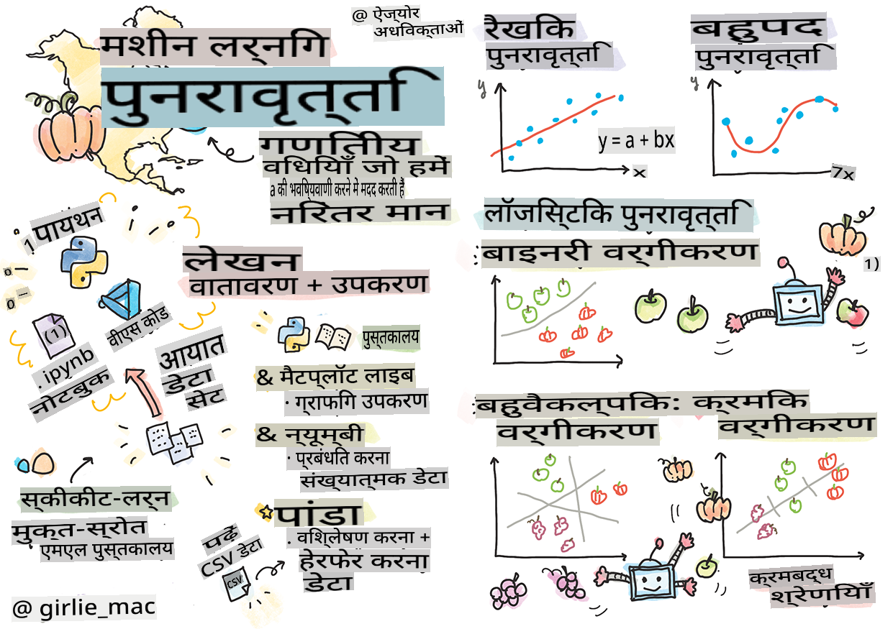
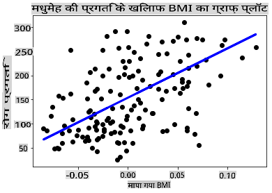

# Python और Scikit-learn के साथ Regression Models की शुरुआत करें



> Sketchnote [Tomomi Imura](https://www.twitter.com/girlie_mac) द्वारा

## [Pre-lecture quiz](https://gray-sand-07a10f403.1.azurestaticapps.net/quiz/9/)

> ### [यह पाठ R में उपलब्ध है!](../../../../2-Regression/1-Tools/solution/R/lesson_1.html)

## परिचय

इन चार पाठों में, आप जानेंगे कि regression models कैसे बनाते हैं। हम जल्द ही चर्चा करेंगे कि ये क्या होते हैं। लेकिन इससे पहले कि आप कुछ भी करें, यह सुनिश्चित करें कि आपके पास सही उपकरण हैं ताकि आप प्रक्रिया शुरू कर सकें!

इस पाठ में, आप सीखेंगे कि कैसे:

- अपने कंप्यूटर को स्थानीय मशीन लर्निंग कार्यों के लिए कॉन्फ़िगर करें।
- Jupyter notebooks के साथ काम करें।
- Scikit-learn का उपयोग करें, जिसमें इंस्टॉलेशन भी शामिल है।
- एक hands-on exercise के साथ linear regression का अन्वेषण करें।

## इंस्टॉलेशन और कॉन्फ़िगरेशन

[](https://youtu.be/-DfeD2k2Kj0 "ML for beginners - मशीन लर्निंग मॉडल बनाने के लिए अपने उपकरण सेट करें")

> 🎥 ऊपर दी गई छवि पर क्लिक करें अपने कंप्यूटर को ML के लिए कॉन्फ़िगर करने के लिए एक छोटे वीडियो के लिए।

1. **Python इंस्टॉल करें**। सुनिश्चित करें कि [Python](https://www.python.org/downloads/) आपके कंप्यूटर पर इंस्टॉल है। आप Python का उपयोग कई डेटा विज्ञान और मशीन लर्निंग कार्यों के लिए करेंगे। अधिकांश कंप्यूटर सिस्टम पहले से ही एक Python इंस्टॉलेशन शामिल करते हैं। कुछ उपयोगकर्ताओं के लिए सेटअप को आसान बनाने के लिए उपयोगी [Python Coding Packs](https://code.visualstudio.com/learn/educators/installers?WT.mc_id=academic-77952-leestott) भी उपलब्ध हैं।

   हालांकि, Python के कुछ उपयोगों के लिए सॉफ़्टवेयर का एक संस्करण आवश्यक होता है, जबकि अन्य के लिए एक अलग संस्करण की आवश्यकता होती है। इस कारण से, एक [virtual environment](https://docs.python.org/3/library/venv.html) में काम करना उपयोगी है।

2. **Visual Studio Code इंस्टॉल करें**। सुनिश्चित करें कि Visual Studio Code आपके कंप्यूटर पर इंस्टॉल है। [Visual Studio Code इंस्टॉल करने के लिए](https://code.visualstudio.com/) इन निर्देशों का पालन करें। आप इस कोर्स में Visual Studio Code में Python का उपयोग करने जा रहे हैं, इसलिए आपको [Visual Studio Code को Python विकास के लिए कॉन्फ़िगर करने](https://docs.microsoft.com/learn/modules/python-install-vscode?WT.mc_id=academic-77952-leestott) के बारे में जानकारी होनी चाहिए।

   > Python के साथ आरामदायक होने के लिए इस [Learn modules](https://docs.microsoft.com/users/jenlooper-2911/collections/mp1pagggd5qrq7?WT.mc_id=academic-77952-leestott) संग्रह को काम करके देखें
   >
   > [](https://youtu.be/yyQM70vi7V8 "Visual Studio Code के साथ Python सेटअप करें")
   >
   > 🎥 ऊपर दी गई छवि पर क्लिक करें: VS Code में Python का उपयोग करने के लिए एक वीडियो।

3. **Scikit-learn इंस्टॉल करें**, इन [निर्देशों](https://scikit-learn.org/stable/install.html) का पालन करके। चूंकि आपको यह सुनिश्चित करने की आवश्यकता है कि आप Python 3 का उपयोग कर रहे हैं, यह अनुशंसा की जाती है कि आप एक virtual environment का उपयोग करें। ध्यान दें, यदि आप इस लाइब्रेरी को M1 Mac पर इंस्टॉल कर रहे हैं, तो ऊपर दिए गए पेज पर विशेष निर्देश हैं।

1. **Jupyter Notebook इंस्टॉल करें**। आपको [Jupyter package इंस्टॉल करना](https://pypi.org/project/jupyter/) होगा।

## आपका ML लेखन वातावरण

आप अपने Python कोड को विकसित करने और मशीन लर्निंग मॉडल बनाने के लिए **notebooks** का उपयोग करेंगे। इस प्रकार की फ़ाइल डेटा वैज्ञानिकों के लिए एक सामान्य उपकरण है, और इन्हें उनके प्रत्यय या एक्सटेंशन `.ipynb` द्वारा पहचाना जा सकता है।

Notebooks एक इंटरैक्टिव वातावरण हैं जो डेवलपर को कोड और नोट्स दोनों जोड़ने और कोड के चारों ओर दस्तावेज़ लिखने की अनुमति देते हैं, जो प्रयोगात्मक या अनुसंधान-उन्मुख परियोजनाओं के लिए काफी सहायक होता है।

[](https://youtu.be/7E-jC8FLA2E "ML for beginners - Jupyter Notebooks सेट करें ताकि regression models बनाना शुरू कर सकें")

> 🎥 ऊपर दी गई छवि पर क्लिक करें इस अभ्यास को करने के लिए एक छोटे वीडियो के लिए।

### अभ्यास - एक notebook के साथ काम करें

इस फ़ोल्डर में, आपको _notebook.ipynb_ फ़ाइल मिलेगी।

1. Visual Studio Code में _notebook.ipynb_ खोलें।

   एक Jupyter सर्वर Python 3+ के साथ शुरू होगा। आपको notebook के क्षेत्रों में `run` कोड के टुकड़े मिलेंगे। आप एक कोड ब्लॉक चला सकते हैं, प्ले बटन जैसे दिखने वाले आइकन का चयन करके।

1. `md` आइकन का चयन करें और थोड़ा मार्कडाउन जोड़ें, और निम्नलिखित पाठ **# Welcome to your notebook** जोड़ें।

   अगला, कुछ Python कोड जोड़ें।

1. कोड ब्लॉक में **print('hello notebook')** टाइप करें।
1. कोड चलाने के लिए तीर का चयन करें।

   आपको प्रिंट किया हुआ बयान देखना चाहिए:

    ```output
    hello notebook
    ```


आप अपने कोड को टिप्पणियों के साथ इंटरलीफ कर सकते हैं ताकि notebook को स्वयं-प्रलेखित किया जा सके।

✅ एक मिनट के लिए सोचें कि एक वेब डेवलपर का कार्य वातावरण डेटा वैज्ञानिक के कार्य वातावरण से कितना अलग है।

## Scikit-learn के साथ शुरू करें

अब जब Python आपके स्थानीय वातावरण में सेट हो गया है, और आप Jupyter notebooks के साथ सहज हैं, तो चलिए Scikit-learn के साथ भी उतने ही सहज होते हैं (इसे `sci` as in `science` उच्चारित करें)। Scikit-learn आपको ML कार्य करने में मदद करने के लिए एक [विस्तृत API](https://scikit-learn.org/stable/modules/classes.html#api-ref) प्रदान करता है।

उनकी [वेबसाइट](https://scikit-learn.org/stable/getting_started.html) के अनुसार, "Scikit-learn एक ओपन सोर्स मशीन लर्निंग लाइब्रेरी है जो सुपरवाइज्ड और अनसुपरवाइज्ड लर्निंग का समर्थन करती है। यह मॉडल फिटिंग, डेटा प्रीप्रोसेसिंग, मॉडल चयन और मूल्यांकन के लिए विभिन्न उपकरण भी प्रदान करती है, और कई अन्य उपयोगिताओं।"

इस कोर्स में, आप Scikit-learn और अन्य उपकरणों का उपयोग करेंगे ताकि आप मशीन लर्निंग मॉडल बना सकें जिन्हें हम 'पारंपरिक मशीन लर्निंग' कार्य कहते हैं। हमने जानबूझकर न्यूरल नेटवर्क और डीप लर्निंग से परहेज किया है, क्योंकि उन्हें हमारे आगामी 'AI for Beginners' पाठ्यक्रम में बेहतर कवर किया गया है।

Scikit-learn मॉडल बनाना और उनका मूल्यांकन करना सरल बनाता है। यह मुख्य रूप से संख्यात्मक डेटा का उपयोग करने पर केंद्रित है और कई तैयार किए गए डेटासेट प्रदान करता है जो सीखने के उपकरण के रूप में उपयोग किए जा सकते हैं। इसमें छात्रों के लिए आज़माने के लिए प्री-बिल्ट मॉडल भी शामिल हैं। चलिए प्रीपैकेज्ड डेटा को लोड करने की प्रक्रिया का अन्वेषण करते हैं और कुछ बुनियादी डेटा के साथ Scikit-learn के पहले ML मॉडल का उपयोग करते हैं।

## अभ्यास - आपका पहला Scikit-learn notebook

> यह ट्यूटोरियल Scikit-learn की वेबसाइट पर [linear regression example](https://scikit-learn.org/stable/auto_examples/linear_model/plot_ols.html#sphx-glr-auto-examples-linear-model-plot-ols-py) से प्रेरित था।

[](https://youtu.be/2xkXL5EUpS0 "ML for beginners - Python में आपका पहला Linear Regression प्रोजेक्ट")

> 🎥 ऊपर दी गई छवि पर क्लिक करें इस अभ्यास को करने के लिए एक छोटे वीडियो के लिए।

इस पाठ से संबंधित _notebook.ipynb_ फ़ाइल में, सभी सेल्स को 'trash can' आइकन दबाकर साफ़ करें।

इस खंड में, आप एक छोटे डेटासेट के साथ काम करेंगे जो Scikit-learn में सीखने के उद्देश्यों के लिए बनाया गया है। कल्पना करें कि आप मधुमेह रोगियों के लिए एक उपचार का परीक्षण करना चाहते थे। मशीन लर्निंग मॉडल आपको यह निर्धारित करने में मदद कर सकते हैं कि कौन से रोगी उपचार का बेहतर उत्तर देंगे, चर के संयोजन के आधार पर। यहां तक कि एक बहुत ही बुनियादी regression model, जब दृश्यीकृत किया जाता है, तो चर के बारे में जानकारी दिखा सकता है जो आपको अपने सैद्धांतिक क्लिनिकल परीक्षणों को व्यवस्थित करने में मदद कर सकता है।

✅ कई प्रकार के regression methods होते हैं, और आप किसे चुनते हैं यह आपके उत्तर पर निर्भर करता है। यदि आप किसी दिए गए उम्र के व्यक्ति के लिए संभावित ऊंचाई की भविष्यवाणी करना चाहते हैं, तो आप linear regression का उपयोग करेंगे, क्योंकि आप एक **संख्यात्मक मान** की तलाश कर रहे हैं। यदि आप यह जानने में रुचि रखते हैं कि किसी प्रकार के भोजन को शाकाहारी माना जाना चाहिए या नहीं, तो आप एक **श्रेणी असाइनमेंट** की तलाश कर रहे हैं, इसलिए आप logistic regression का उपयोग करेंगे। आप बाद में logistic regression के बारे में अधिक जानेंगे। कुछ प्रश्नों के बारे में सोचें जो आप डेटा से पूछ सकते हैं, और इनमें से कौन सी विधियाँ अधिक उपयुक्त होंगी।

आइए इस कार्य पर शुरुआत करें।

### लाइब्रेरीज़ इंपोर्ट करें

इस कार्य के लिए हम कुछ लाइब्रेरीज़ इंपोर्ट करेंगे:

- **matplotlib**। यह एक उपयोगी [ग्राफिंग टूल](https://matplotlib.org/) है और हम इसका उपयोग एक लाइन प्लॉट बनाने के लिए करेंगे।
- **numpy**। [numpy](https://numpy.org/doc/stable/user/whatisnumpy.html) Python में संख्यात्मक डेटा को संभालने के लिए एक उपयोगी लाइब्रेरी है।
- **sklearn**। यह [Scikit-learn](https://scikit-learn.org/stable/user_guide.html) लाइब्रेरी है।

अपने कार्यों में मदद के लिए कुछ लाइब्रेरीज़ इंपोर्ट करें।

1. निम्नलिखित कोड टाइप करके इंपोर्ट जोड़ें:

   ```python
   import matplotlib.pyplot as plt
   import numpy as np
   from sklearn import datasets, linear_model, model_selection
   ```

   ऊपर आप `matplotlib`, `numpy` and you are importing `datasets`, `linear_model` and `model_selection` from `sklearn`. `model_selection` is used for splitting data into training and test sets.

### The diabetes dataset

The built-in [diabetes dataset](https://scikit-learn.org/stable/datasets/toy_dataset.html#diabetes-dataset) includes 442 samples of data around diabetes, with 10 feature variables, some of which include:

- age: age in years
- bmi: body mass index
- bp: average blood pressure
- s1 tc: T-Cells (a type of white blood cells)

✅ This dataset includes the concept of 'sex' as a feature variable important to research around diabetes. Many medical datasets include this type of binary classification. Think a bit about how categorizations such as this might exclude certain parts of a population from treatments.

Now, load up the X and y data.

> 🎓 Remember, this is supervised learning, and we need a named 'y' target.

In a new code cell, load the diabetes dataset by calling `load_diabetes()`. The input `return_X_y=True` signals that `X` will be a data matrix, and `y` को इंपोर्ट कर रहे हैं जो regression target होगा।

1. डेटा मैट्रिक्स के आकार और इसके पहले तत्व को दिखाने के लिए कुछ प्रिंट कमांड जोड़ें:

    ```python
    X, y = datasets.load_diabetes(return_X_y=True)
    print(X.shape)
    print(X[0])
    ```

    जो प्रतिक्रिया आपको मिल रही है, वह एक टपल है। आप जो कर रहे हैं वह टपल के पहले दो मानों को `X` and `y` को सौंपना है। [टपल्स के बारे में](https://wikipedia.org/wiki/Tuple) और जानें।

    आप देख सकते हैं कि इस डेटा में 442 आइटम हैं जो 10 तत्वों की सरणियों में आकारित हैं:

    ```text
    (442, 10)
    [ 0.03807591  0.05068012  0.06169621  0.02187235 -0.0442235  -0.03482076
    -0.04340085 -0.00259226  0.01990842 -0.01764613]
    ```

    ✅ डेटा और regression target के बीच के संबंध के बारे में सोचें। Linear regression फीचर X और टारगेट वेरिएबल y के बीच संबंधों की भविष्यवाणी करता है। क्या आप दस्तावेज़ में मधुमेह डेटासेट के लिए [target](https://scikit-learn.org/stable/datasets/toy_dataset.html#diabetes-dataset) पा सकते हैं? इस डेटासेट का लक्ष्य क्या है, यह डेटा क्या प्रदर्शित कर रहा है?

2. इसके बाद, इस डेटासेट के एक हिस्से का चयन करें जिसे तीसरे कॉलम का चयन करके प्लॉट किया जा सकता है। आप `:` operator to select all rows, and then selecting the 3rd column using the index (2). You can also reshape the data to be a 2D array - as required for plotting - by using `reshape(n_rows, n_columns)` का उपयोग करके ऐसा कर सकते हैं। यदि पैरामीटर में से एक -1 है, तो संबंधित आयाम स्वचालित रूप से गणना किया जाता है।

   ```python
   X = X[:, 2]
   X = X.reshape((-1,1))
   ```

   ✅ किसी भी समय, डेटा का आकार जांचने के लिए इसे प्रिंट करें।

3. अब जब आपके पास प्लॉट करने के लिए डेटा तैयार है, तो आप देख सकते हैं कि क्या एक मशीन इस डेटासेट में संख्याओं के बीच एक तार्किक विभाजन निर्धारित करने में मदद कर सकती है। ऐसा करने के लिए, आपको डेटा (X) और टारगेट (y) दोनों को परीक्षण और प्रशिक्षण सेटों में विभाजित करना होगा। Scikit-learn में इसे करने का एक सरल तरीका है; आप अपने परीक्षण डेटा को एक दिए गए बिंदु पर विभाजित कर सकते हैं।

   ```python
   X_train, X_test, y_train, y_test = model_selection.train_test_split(X, y, test_size=0.33)
   ```

4. अब आप अपने मॉडल को प्रशिक्षित करने के लिए तैयार हैं! Linear regression मॉडल लोड करें और अपने X और y प्रशिक्षण सेटों के साथ इसे `model.fit()` का उपयोग करके प्रशिक्षित करें:

    ```python
    model = linear_model.LinearRegression()
    model.fit(X_train, y_train)
    ```

    ✅ `model.fit()` is a function you'll see in many ML libraries such as TensorFlow

5. Then, create a prediction using test data, using the function `predict()`। इसका उपयोग डेटा समूहों के बीच लाइन खींचने के लिए किया जाएगा

    ```python
    y_pred = model.predict(X_test)
    ```

6. अब डेटा को एक प्लॉट में दिखाने का समय है। Matplotlib इस कार्य के लिए एक बहुत उपयोगी उपकरण है। सभी X और y परीक्षण डेटा का एक scatterplot बनाएं, और मॉडल के डेटा समूहों के बीच सबसे उपयुक्त स्थान पर एक लाइन खींचने के लिए भविष्यवाणी का उपयोग करें।

    ```python
    plt.scatter(X_test, y_test,  color='black')
    plt.plot(X_test, y_pred, color='blue', linewidth=3)
    plt.xlabel('Scaled BMIs')
    plt.ylabel('Disease Progression')
    plt.title('A Graph Plot Showing Diabetes Progression Against BMI')
    plt.show()
    ```

   

   ✅ यहाँ क्या हो रहा है इसके बारे में सोचें। कई छोटे डेटा बिंदुओं के माध्यम से एक सीधी रेखा चल रही है, लेकिन यह वास्तव में क्या कर रही है? क्या आप देख सकते हैं कि आपको इस रेखा का उपयोग करके एक नया, अनदेखा डेटा बिंदु प्लॉट के y अक्ष के संबंध में कहां फिट होना चाहिए, यह भविष्यवाणी करने में सक्षम होना चाहिए? इस मॉडल के व्यावहारिक उपयोग को शब्दों में डालने का प्रयास करें।

बधाई हो, आपने अपना पहला linear regression model बनाया, इसके साथ एक भविष्यवाणी बनाई, और इसे एक प्लॉट में प्रदर्शित किया!

---
## 🚀चुनौती

इस डेटासेट से एक अलग वेरिएबल को प्लॉट करें। संकेत: इस पंक्ति को संपादित करें: `X = X[:,2]`। इस डेटासेट के लक्ष्य को देखते हुए, आप मधुमेह के एक रोग के रूप में प्रगति के बारे में क्या खोज सकते हैं?
## [Post-lecture quiz](https://gray-sand-07a10f403.1.azurestaticapps.net/quiz/10/)

## समीक्षा और आत्म-अध्ययन

इस ट्यूटोरियल में, आपने सरल linear regression के साथ काम किया, बजाय univariate या multiple linear regression के। इन तरीकों के बीच के अंतर के बारे में थोड़ा पढ़ें, या [इस वीडियो](https://www.coursera.org/lecture/quantifying-relationships-regression-models/linear-vs-nonlinear-categorical-variables-ai2Ef) को देखें

regression की अवधारणा के बारे में और पढ़ें और सोचें कि इस तकनीक द्वारा किन प्रकार के प्रश्नों का उत्तर दिया जा सकता है। अपनी समझ को गहरा करने के लिए इस [ट्यूटोरियल](https://docs.microsoft.com/learn/modules/train-evaluate-regression-models?WT.mc_id=academic-77952-leestott) को लें।

## असाइनमेंट

[एक अलग डेटासेट](assignment.md)

**अस्वीकरण**:
यह दस्तावेज़ मशीन आधारित एआई अनुवाद सेवाओं का उपयोग करके अनुवादित किया गया है। जबकि हम सटीकता के लिए प्रयास करते हैं, कृपया ध्यान दें कि स्वचालित अनुवादों में त्रुटियाँ या गलतियाँ हो सकती हैं। मूल भाषा में मूल दस्तावेज़ को प्रामाणिक स्रोत माना जाना चाहिए। महत्वपूर्ण जानकारी के लिए, पेशेवर मानव अनुवाद की सिफारिश की जाती है। इस अनुवाद के उपयोग से उत्पन्न किसी भी गलतफहमी या गलत व्याख्या के लिए हम उत्तरदायी नहीं हैं।