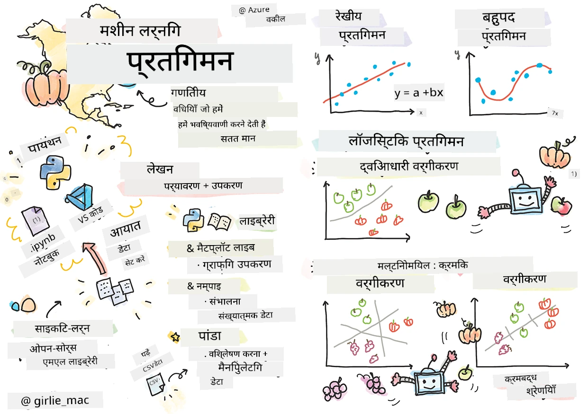
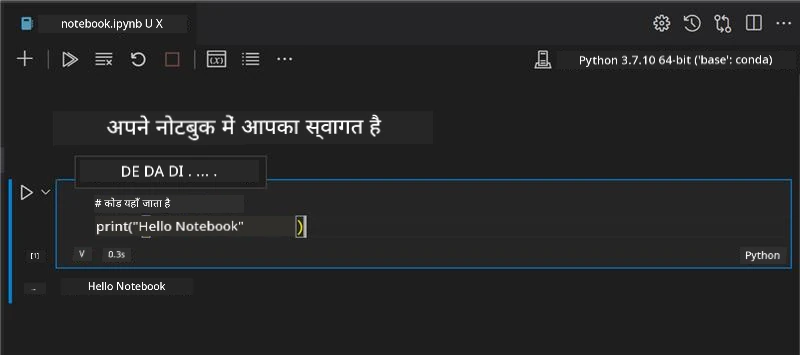
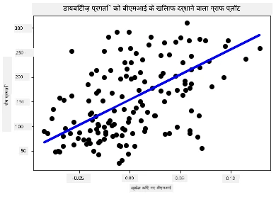

# रिग्रेशन मॉडल्स के लिए पाइथन और साइकीट-लर्न के साथ शुरुआत करें



> स्केचनोट द्वारा [तोमौमी इमूरा](https://www.twitter.com/girlie_mac)

## [प्री-लेक्चर क्विज़](https://ff-quizzes.netlify.app/en/ml/)

> ### [यह पाठ R में भी उपलब्ध है!](../../../../2-Regression/1-Tools/solution/R/lesson_1.html)

## परिचय

इन चार पाठों में, आप सीखेंगे कि रिग्रेशन मॉडल कैसे बनाएं। हम थोड़ी देर में चर्चा करेंगे कि ये क्या हैं। लेकिन इससे पहले कि आप कुछ भी करें, सुनिश्चित करें कि आपके पास प्रक्रिया शुरू करने के लिए सही उपकरण हैं!

इस पाठ में, आप सीखेंगे कि कैसे:

- अपने कंप्यूटर को स्थानीय मशीन लर्निंग कार्यों के लिए कॉन्फ़िगर करें।
- जुपिटर नोटबुक्स के साथ काम करें।
- साइकीट-लर्न का उपयोग करें, इंस्टॉलेशन सहित।
- एक हैंड्स-ऑन अभ्यास के साथ लीनियर रिग्रेशन का अन्वेषण करें।

## इंस्टॉलेशन और कॉन्फ़िगरेशन

[](https://youtu.be/-DfeD2k2Kj0 "शुरुआती के लिए एमएल - मशीन लर्निंग मॉडल बनाने के लिए अपने उपकरण तैयार करें")

> 🎥 ऊपर दिए गए चित्र पर क्लिक करें एक लघु वीडियो के लिए, जो आपके कंप्यूटर को एमएल के लिए कॉन्फ़िगर करने की प्रक्रिया दिखाता है।

1. **पायथन इंस्टॉल करें**। सुनिश्चित करें कि [पायथन](https://www.python.org/downloads/) आपके कंप्यूटर पर इंस्टॉल है। आप कई डेटा साइंस और मशीन लर्निंग कार्यों के लिए पायथन का उपयोग करेंगे। अधिकांश कंप्यूटर सिस्टम में पहले से पायथन इंस्टॉल होता है। कुछ उपयोगकर्ताओं के लिए सेटअप को आसान बनाने के लिए उपयोगी [पायथन कोडिंग पैक्स](https://code.visualstudio.com/learn/educators/installers?WT.mc_id=academic-77952-leestott) भी उपलब्ध हैं।

   पायथन के कुछ उपयोग एक सॉफ्टवेयर संस्करण की मांग करते हैं, जबकि दूसरे उपयोग किसी भिन्न संस्करण की। इसलिए, एक [वर्चुअल एन्वायरनमेंट](https://docs.python.org/3/library/venv.html) के भीतर काम करना उपयोगी होता है।

2. **विज़ुअल स्टूडियो कोड इंस्टॉल करें**। सुनिश्चित करें कि आपके कंप्यूटर पर विज़ुअल स्टूडियो कोड इंस्टॉल है। बुनियादी इंस्टॉलेशन के लिए इन निर्देशों का पालन करें [विज़ुअल स्टूडियो कोड इंस्टॉल करें](https://code.visualstudio.com/)। इस पाठ्यक्रम में आप विज़ुअल स्टूडियो कोड में पायथन का उपयोग करेंगे, इसलिए आप सीख सकते हैं कि कैसे [विज़ुअल स्टूडियो कोड को पायथन विकास के लिए कॉन्फ़िगर करें](https://docs.microsoft.com/learn/modules/python-install-vscode?WT.mc_id=academic-77952-leestott)।

   > इस संग्रह के माध्यम से काम करके पायथन के साथ सहज हो जाएं [लर्न मॉड्यूल्स](https://docs.microsoft.com/users/jenlooper-2911/collections/mp1pagggd5qrq7?WT.mc_id=academic-77952-leestott)
   >
   > [](https://youtu.be/yyQM70vi7V8 "विज़ुअल स्टूडियो कोड के साथ पायथन सेटअप करें")
   >
   > 🎥 ऊपर दिए गए चित्र पर क्लिक करें एक वीडियो के लिए: VS कोड में पायथन का उपयोग करना।

3. **साइकीट-लर्न इंस्टॉल करें**, इन [निर्देशों](https://scikit-learn.org/stable/install.html) का पालन करते हुए। चूंकि आपको पायथन 3 का उपयोग सुनिश्चित करना है, इसलिए वर्चुअल एन्वायरनमेंट का उपयोग करने की सलाह दी जाती है। ध्यान दें, अगर आप इसे M1 Mac पर इंस्टॉल कर रहे हैं, तो ऊपर दिए लिंक पर विशेष निर्देश हैं।

1. **जुपिटर नोटबुक इंस्टॉल करें**। आपको [जुपिटर पैकेज इंस्टॉल करना](https://pypi.org/project/jupyter/) होगा।

## आपका एमएल लेखन वातावरण

आप **नोटबुक्स** का उपयोग करेंगे अपने पायथन कोड का विकास करने और मशीन लर्निंग मॉडल बनाने के लिए। इस प्रकार की फाइल डेटा वैज्ञानिकों के लिए एक सामान्य उपकरण है, और इन्हें उनकी प्रत्यय या एक्सटेंशन `.ipynb` से पहचाना जा सकता है।

नोटबुक्स एक इंटरैक्टिव वातावरण हैं जो डेवलपर को कोड लिखने के साथ ही उसके आसपास नोट्स और दस्तावेज़ भी जोड़ने की अनुमति देते हैं, जो प्रयोगात्मक या शोध-उन्मुख परियोजनाओं के लिए बहुत सहायक होता है।

[](https://youtu.be/7E-jC8FLA2E "शुरुआती के लिए एमएल - रिग्रेशन मॉडल बनाने के लिए जुपिटर नोटबुक सेटअप करें")

> 🎥 ऊपर दिए गए चित्र पर क्लिक करें इस अभ्यास के माध्यम से एक लघु वीडियो के लिए।

### अभ्यास - एक नोटबुक के साथ काम करें

इस फ़ोल्डर में, आपको फाइल _notebook.ipynb_ मिलेगी।

1. विज़ुअल स्टूडियो कोड में _notebook.ipynb_ खोलें।

   एक जुपिटर सर्वर पायथन 3+ के साथ शुरू हो जाएगा। आपको नोटबुक के ऐसे भाग मिलेंगे जिन्हें `run` किया जा सकता है, कोड के टुकड़े। आप किसी कोड ब्लॉक को चलाने के लिए उस आइकन का चयन कर सकते हैं जो प्ले बटन जैसा दिखता है।

1. `md` आइकन चुनें और थोड़ा मार्कडाउन जोड़ें, साथ ही निम्नलिखित टेक्स्ट **# Welcome to your notebook**।

   इसके बाद कुछ पायथन कोड जोड़ें।

1. कोड ब्लॉक में टाइप करें **print('hello notebook')**।
1. कोड चलाने के लिए ऊपर तीर दबाएं।

   आपको मुद्रित कथन दिखाई देना चाहिए:

    ```output
    hello notebook
    ```



आप अपने कोड के बीच टिप्पणियां (comments) जोड़ सकते हैं ताकि नोटबुक स्वयं दस्तावेज़ हो जाए।

✅ एक मिनट सोचिए, एक वेब डेवलपर का कार्य वातावरण डेटा वैज्ञानिक के कार्य वातावरण से कितना भिन्न होता है।

## साइकीट-लर्न के साथ शुरुआत और चलाना

अब जब पाइथन आपके लोकल वातावरण में सेटअप हो चुका है, और आप जुपिटर नोटबुक्स के साथ आरामदायक हैं, आइए साइकीट-लर्न (उच्चारण: `sci` जैसा `science`) के साथ भी सहज हो जाएं। साइकीट-लर्न एक [विस्तृत API](https://scikit-learn.org/stable/modules/classes.html#api-ref) प्रदान करता है जो आपको एमएल कार्य करने में मदद करता है।

उनकी [वेबसाइट](https://scikit-learn.org/stable/getting_started.html) के अनुसार, "साइकीट-लर्न एक ओपन सोर्स मशीन लर्निंग लाइब्रेरी है जो सुपरवाइज्ड और अनसुपरवाइज्ड लर्निंग का समर्थन करती है। यह मॉडल फिटिंग, डेटा प्रीप्रोसेसिंग, मॉडल चयन और मूल्यांकन, और कई अन्य उपयोगिताओं के लिए विभिन्न टूल भी प्रदान करता है।"

इस कोर्स में, आप मशीन लर्निंग मॉडल बनाने के लिए साइकीट-लर्न और अन्य टूल का उपयोग करेंगे, जिन्हें हम 'पारंपरिक मशीन लर्निंग' कार्य कहते हैं। हमने जानबूझकर न्यूरल नेटवर्क और डीप लर्निंग से बचाव किया है क्योंकि वे हमारे आगामी 'बिगिनर्स के लिए एआई' पाठ्यक्रम में बेहतर कवर किए जाएंगे।

साइकीट-लर्न मॉडल बनाने और उनका मूल्यांकन करने को सरल बनाता है। यह मुख्य रूप से संख्यात्मक डेटा का उपयोग करता है और सीखने के लिए कुछ पहले से बने डेटासेट भी शामिल करता है। इसमें विद्यार्थियों के प्रयोग के लिए पूर्वनिर्मित मॉडल भी शामिल हैं। आइए पहले कुछ बुनियादी डेटा के साथ प्रीपैकेज्ड डेटा लोड करने और एक अंतर्निर्मित एस्टीमेटर का उपयोग करके पहला ML मॉडल बनाने की प्रक्रिया देखें।

## अभ्यास - आपका पहला साइकीट-लर्न नोटबुक

> यह ट्यूटोरियल साइकीट-लर्न की वेबसाइट पर [लीनियर रिग्रेशन उदाहरण](https://scikit-learn.org/stable/auto_examples/linear_model/plot_ols.html#sphx-glr-auto-examples-linear-model-plot-ols-py) से प्रेरित है।


[](https://youtu.be/2xkXL5EUpS0 "शुरुआती के लिए एमएल - पाइथन में आपका पहला लीनियर रिग्रेशन प्रोजेक्ट")

> 🎥 ऊपर दिए गए चित्र पर क्लिक करें इस अभ्यास के माध्यम से एक लघु वीडियो के लिए।

_notebook.ipynb_ फ़ाइल में, इस पाठ से संबंधित, सभी सेल को 'ट्रैश कैन' आइकन दबाकर साफ़ करें।

इस अनुभाग में, आप स्किकट-लर्न में सीखने के उद्देश्य से बने मधुमेह (डायबिटीज) के एक छोटे डेटासेट के साथ काम करेंगे। कल्पना करें कि आप मधुमेह रोगियों के लिए एक उपचार जांचना चाहते हैं। मशीन लर्निंग मॉडल मदद कर सकते हैं यह निर्धारित करने में कि कौन से रोगी उपचार पर बेहतर प्रतिक्रिया देंगे, विभिन्न वेरिएबल्स के संयोजन के आधार पर। एक बहुत ही बुनियादी रिग्रेशन मॉडल भी, जब विज़ुअलाइज़ किया जाए, तो उन वेरिएबल्स के बारे में जानकारी दे सकता है जो चिकित्सीय परीक्षणों की योजना बनाने में मदद कर सकते हैं।

✅ कई प्रकार के रिग्रेशन तरीकों होते हैं, और कौन सा चुनना है यह आपके प्रश्न के उत्तर पर निर्भर करता है। यदि आप किसी व्यक्ति की उम्र के अनुसार उसकी संभावित ऊंचाई का पूर्वानुमान लगाना चाहते हैं, तो आप लीनियर रिग्रेशन का उपयोग करेंगे, क्योंकि आप एक **संख्यात्मक मान** तलाश रहे हैं। यदि आप पता लगाना चाहते हैं कि कोई भोजन शाकाहारी (वेजन) माना जाना चाहिए या नहीं, तो आप **श्रेणी निर्धारण** तलाश रहे हैं इसलिए आप लॉजिस्टिक रिग्रेशन का उपयोग करेंगे। आप लॉजिस्टिक रिग्रेशन के बारे में बाद में अधिक जानेंगे। डेटा से पूछे जाने वाले कुछ प्रश्नों के बारे में सोचें और कौन सा तरीका अधिक उपयुक्त होगा।

आइए इस कार्य को शुरू करें।

### पुस्तकालयों का इम्पोर्ट करें

इस कार्य के लिए हम कुछ पुस्तकालय इम्पोर्ट करेंगे:

- **matplotlib**। यह एक उपयोगी [ग्राफिंग टूल](https://matplotlib.org/) है और हम इसे लाइन प्लॉट बनाने के लिए उपयोग करेंगे।
- **numpy**। [numpy](https://numpy.org/doc/stable/user/whatisnumpy.html) पाइथन में संख्यात्मक डेटा संभालने के लिए उपयोगी पुस्तकालय है।
- **sklearn**। यह [साइकीट-लर्न](https://scikit-learn.org/stable/user_guide.html) पुस्तकालय है।

अपने कार्यों में सहायता के लिए कुछ लाइब्रेरी आयात करें।

1. निम्न कोड टाइप करके आयात जोड़ें:

   ```python
   import matplotlib.pyplot as plt
   import numpy as np
   from sklearn import datasets, linear_model, model_selection
   ```

   ऊपर आप `matplotlib`, `numpy` आयात कर रहे हैं और `sklearn` से `datasets`, `linear_model` और `model_selection` आयात कर रहे हैं। `model_selection` का उपयोग डेटा को प्रशिक्षण और परीक्षण सेटों में विभाजित करने के लिए किया जाता है।

### मधुमेह डेटासेट

अंतर्निर्मित [मधुमेह डेटासेट](https://scikit-learn.org/stable/datasets/toy_dataset.html#diabetes-dataset) में मधुमेह से संबंधित 442 नमूने होते हैं, जिनमें 10 फीचर चर होते हैं, जिनमें से कुछ हैं:

- उम्र: वर्षों में उम्र
- bmi: बॉडी मास इंडेक्स
- bp: औसत रक्तचाप
- s1 tc: T-सेल्स (सफेद रक्त कोशिकाओं का एक प्रकार)

✅ इस डेटासेट में 'लिंग' का विचार एक फीचर चर के रूप में शामिल है, जो मधुमेह अनुसंधान के लिए महत्वपूर्ण है। कई चिकित्सा डेटासेट में इस प्रकार की द्विआधारी श्रेणीकरण शामिल होती है। इस तरह की श्रेणीबद्धता इसे ध्यान में रखते हुए सोचें कि कैसे यह जनसंख्या के कुछ हिस्सों को उपचारों से बाहर कर सकती है।

अब, X और y डेटा लोड करें।

> 🎓 याद रखें, यह सुपरवाइज्ड लर्निंग है, और हमें 'y' टारगेट चाहिए।

नई कोड सेल में, मधुमेह डेटासेट को `load_diabetes()` कॉल करके लोड करें। इनपुट `return_X_y=True` से संकेत मिलता है कि `X` डेटा मैट्रिक्स होगा, और `y` रिग्रेशन टारगेट होगा।

1. डेटा मैट्रिक्स के आकार और उसके पहले तत्व को दिखाने के लिए कुछ प्रिंट कमांड जोड़ें:

    ```python
    X, y = datasets.load_diabetes(return_X_y=True)
    print(X.shape)
    print(X[0])
    ```

    आपको जो प्रतिक्रिया मिल रही है वह एक टपल है। आप टपल के पहले दो मानों को क्रमशः `X` और `y` को सौंप रहे हैं। टपल के बारे में अधिक जानें [यहां](https://wikipedia.org/wiki/Tuple)।

    आप देख सकते हैं कि इस डेटा में 442 आइटम हैं जो 10 तत्वों वाले एरे में आकारित हैं:

    ```text
    (442, 10)
    [ 0.03807591  0.05068012  0.06169621  0.02187235 -0.0442235  -0.03482076
    -0.04340085 -0.00259226  0.01990842 -0.01764613]
    ```

    ✅ डेटा और रिग्रेशन टारगेट के बीच संबंध के बारे में थोड़ा सोचें। लीनियर रिग्रेशन फीचर X और टारगेट वेरिएबल y के बीच संबंध की भविष्यवाणी करता है। क्या आप मधुमेह डेटासेट के लिए [टारगेट](https://scikit-learn.org/stable/datasets/toy_dataset.html#diabetes-dataset) को डॉक्यूमेंटेशन में देख सकते हैं? यह डेटासेट उस टारगेट के आधार पर क्या प्रदर्शित कर रहा है?

2. अगला, इस डेटासेट का एक हिस्सा प्लॉट करने के लिए 3री कॉलम चुनें। आप `:` ऑपरेटर का उपयोग करके सभी पंक्तियां चुन सकते हैं, फिर इंडेक्स (2) द्वारा तीसरी कॉलम चुन सकते हैं। इसके अलावा, प्लॉटिंग के लिए आवश्यक 2D एरे में डेटा को `reshape(n_rows, n_columns)` का उपयोग करके पुनः आकारित कर सकते हैं। यदि कोई पैरामीटर -1 है, तो संबंधित आयाम स्वचालित रूप से गणना किया जाएगा।

   ```python
   X = X[:, 2]
   X = X.reshape((-1,1))
   ```

   ✅ किसी भी समय, डेटा का आकार जांचने के लिए प्रिंट करें।

3. अब जब आपके पास प्लॉट करने के लिए डेटा तैयार है, तो देखें कि क्या मशीन इस डेटासेट के नंबरों के बीच तार्किक विभाजन करने में मदद कर सकती है। इसके लिए, आपको दोनों डेटा (X) और टारगेट (y) को परीक्षण और प्रशिक्षण सेटों में विभाजित करना होगा। साइकीट-लर्न के पास इसे करने का सरल तरीका है; आप अपने परीक्षण डेटा को एक दिए गए बिंदु पर विभाजित कर सकते हैं।

   ```python
   X_train, X_test, y_train, y_test = model_selection.train_test_split(X, y, test_size=0.33)
   ```

4. अब आप अपने मॉडल को प्रशिक्षित करने के लिए तैयार हैं! लाइनियर रिग्रेशन मॉडल लोड करें और अपने X और y प्रशिक्षण सेट का उपयोग करके `model.fit()` के साथ प्रशिक्षित करें:

    ```python
    model = linear_model.LinearRegression()
    model.fit(X_train, y_train)
    ```

    ✅ `model.fit()` एक फ़ंक्शन है जिसे आप कई एमएल लाइब्रेरियों जैसे TensorFlow में भी देखेंगे।

5. फिर, परीक्षण डेटा का उपयोग करके भविष्यवाणी बनाएं, `predict()` फ़ंक्शन का उपयोग करके। इसका उपयोग मॉडल के डेटा समूहों के बीच लाइन खींचने के लिए किया जाएगा।

    ```python
    y_pred = model.predict(X_test)
    ```

6. अब डेटा को प्लॉट में दिखाने का समय है। मैटप्लॉटलिब इस कार्य के लिए एक बहुत उपयोगी उपकरण है। सभी X और y टेस्ट डेटा का एक स्कैटरप्लॉट बनाएं, और मॉडल के डेटा समूहों के बीच सबसे उपयुक्त जगह पर लाइन खींचने के लिए भविष्यवाणी का उपयोग करें।

    ```python
    plt.scatter(X_test, y_test,  color='black')
    plt.plot(X_test, y_pred, color='blue', linewidth=3)
    plt.xlabel('Scaled BMIs')
    plt.ylabel('Disease Progression')
    plt.title('A Graph Plot Showing Diabetes Progression Against BMI')
    plt.show()
    ```

   


   ✅ यहाँ जो हो रहा है उसके बारे में थोड़ा सोचें। एक सीधी रेखा कई छोटे डेटा बिंदुओं से होकर गुजर रही है, लेकिन यह वास्तव में क्या कर रही है? क्या आप देख सकते हैं कि आपको इस रेखा का उपयोग कैसे करना चाहिए ताकि यह अनुमान लगाया जा सके कि एक नया, अब तक न देखा गया डेटा पॉइंट प्लॉट के y अक्ष के सापेक्ष कहाँ फिट होना चाहिए? इस मॉडल के व्यावहारिक उपयोग को शब्दों में व्यक्त करने की कोशिश करें।

बधाई हो, आपने अपना पहला लीनियर रिग्रेशन मॉडल बनाया, इसके साथ एक पूर्वानुमान बनाया, और इसे एक प्लॉट में प्रदर्शित किया!

---
## 🚀चुनौती

इस डेटासेट से एक अलग चर को प्लॉट करें। सलाह: इस लाइन को संपादित करें: `X = X[:,2]`। इस डेटासेट के लक्ष्य के आधार पर, आप मधुमेह को एक रोग के रूप में प्रगति के बारे में क्या खोजने में सक्षम हैं?
## [पाठ-पर्याप्ति क्विज़](https://ff-quizzes.netlify.app/en/ml/)

## पुनरावलोकन और स्व-अध्ययन

इस ट्यूटोरियल में, आपने सरल लीनियर रिग्रेशन के साथ काम किया, न कि एकविवरणीय या बहुविवरणीय लीनियर रिग्रेशन के साथ। इन तरीकों के बीच के अंतर के बारे में थोड़ा पढ़ें, या इस [वीडियो](https://www.coursera.org/lecture/quantifying-relationships-regression-models/linear-vs-nonlinear-categorical-variables-ai2Ef) को देखें।

रिग्रेशन की अवधारणा के बारे में अधिक पढ़ें और सोचें कि इस तकनीक से किस तरह के प्रश्नों का उत्तर दिया जा सकता है। अपनी समझ को गहरा करने के लिए यह [ट्यूटोरियल](https://docs.microsoft.com/learn/modules/train-evaluate-regression-models?WT.mc_id=academic-77952-leestott) लें।

## असाइनमेंट

[एक अलग डेटासेट](assignment.md)

---

<!-- CO-OP TRANSLATOR DISCLAIMER START -->
**अस्वीकरण**:
इस दस्तावेज़ का अनुवाद AI अनुवाद सेवा [Co-op Translator](https://github.com/Azure/co-op-translator) का उपयोग करके किया गया है। जबकि हम सटीकता के लिए प्रयास करते हैं, कृपया ध्यान दें कि स्वचालित अनुवादों में त्रुटियाँ या अशुद्धियाँ हो सकती हैं। मूल दस्तावेज़ अपनी मूल भाषा में ही प्रामाणिक स्रोत माना जाना चाहिए। महत्वपूर्ण जानकारी के लिए, पेशेवर मानव अनुवाद की सिफारिश की जाती है। इस अनुवाद के उपयोग से उत्पन्न किसी भी गलतफहमी या गलत व्याख्या के लिए हम उत्तरदायी नहीं हैं।
<!-- CO-OP TRANSLATOR DISCLAIMER END -->