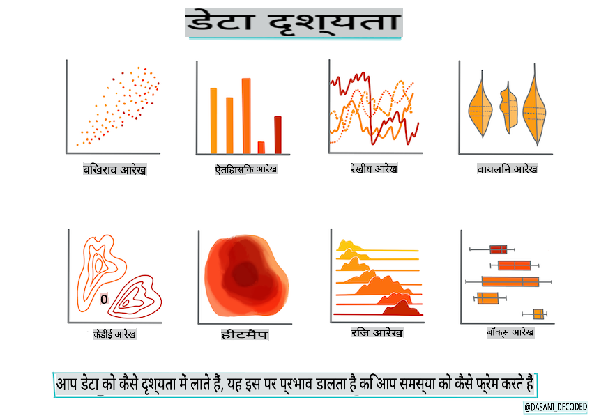
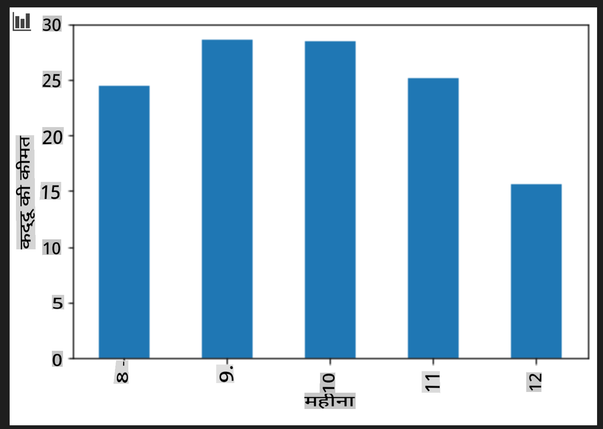

# Scikit-learn का उपयोग करके एक रिग्रेशन मॉडल बनाएं: डेटा तैयार करें और विज़ुअलाइज़ करें



इंफोग्राफिक द्वारा [Dasani Madipalli](https://twitter.com/dasani_decoded)

## [Pre-lecture quiz](https://gray-sand-07a10f403.1.azurestaticapps.net/quiz/11/)

> ### [यह पाठ R में उपलब्ध है!](../../../../2-Regression/2-Data/solution/R/lesson_2.html)

## परिचय

अब जब आपके पास Scikit-learn के साथ मशीन लर्निंग मॉडल बनाने के लिए आवश्यक उपकरण हैं, तो आप अपने डेटा से सवाल पूछने के लिए तैयार हैं। जब आप डेटा के साथ काम करते हैं और एमएल समाधान लागू करते हैं, तो सही सवाल पूछना बहुत महत्वपूर्ण होता है ताकि आप अपने डेटा सेट की संभावनाओं को सही ढंग से खोल सकें।

इस पाठ में, आप सीखेंगे:

- अपने डेटा को मॉडल-बिल्डिंग के लिए कैसे तैयार करें।
- डेटा विज़ुअलाइज़ेशन के लिए Matplotlib का उपयोग कैसे करें।

## अपने डेटा से सही सवाल पूछना

आपको किस सवाल का जवाब चाहिए, यह निर्धारित करेगा कि आप किस प्रकार के एमएल एल्गोरिदम का उपयोग करेंगे। और आपको जो उत्तर मिलेगा, उसकी गुणवत्ता काफी हद तक आपके डेटा की प्रकृति पर निर्भर करेगी।

इस पाठ के लिए प्रदान किए गए [डेटा](https://github.com/microsoft/ML-For-Beginners/blob/main/2-Regression/data/US-pumpkins.csv) को देखें। आप इस .csv फ़ाइल को VS Code में खोल सकते हैं। एक त्वरित नज़र से तुरंत पता चलता है कि इसमें खाली स्थान और स्ट्रिंग और न्यूमेरिक डेटा का मिश्रण है। इसमें 'Package' नाम का एक अजीब कॉलम भी है जहाँ डेटा 'sacks', 'bins' और अन्य मानों के बीच का मिश्रण है। वास्तव में, डेटा थोड़ा बिखरा हुआ है।

[](https://youtu.be/5qGjczWTrDQ "ML for beginners - How to Analyze and Clean a Dataset")

> 🎥 इस पाठ के लिए डेटा तैयार करने के लिए ऊपर की छवि पर क्लिक करें।

वास्तव में, ऐसा बहुत कम होता है कि आपको एक ऐसा डेटा सेट मिलता है जो पूरी तरह से तैयार हो ताकि आप तुरंत एक एमएल मॉडल बना सकें। इस पाठ में, आप मानक पायथन लाइब्रेरी का उपयोग करके एक कच्चे डेटा सेट को तैयार करना सीखेंगे। आप डेटा को विज़ुअलाइज़ करने की विभिन्न तकनीकों को भी सीखेंगे।

## केस स्टडी: 'कद्दू का बाजार'

इस फोल्डर में आपको रूट `data` फोल्डर में एक .csv फ़ाइल मिलेगी जिसका नाम [US-pumpkins.csv](https://github.com/microsoft/ML-For-Beginners/blob/main/2-Regression/data/US-pumpkins.csv) है जिसमें कद्दू के बाजार के बारे में 1757 लाइनें डेटा शामिल हैं, जो शहर के अनुसार समूहित हैं। यह डेटा संयुक्त राज्य अमेरिका के कृषि विभाग द्वारा वितरित [Specialty Crops Terminal Markets Standard Reports](https://www.marketnews.usda.gov/mnp/fv-report-config-step1?type=termPrice) से निकाला गया कच्चा डेटा है।

### डेटा तैयार करना

यह डेटा सार्वजनिक डोमेन में है। इसे USDA वेबसाइट से कई अलग-अलग फाइलों में, प्रति शहर, डाउनलोड किया जा सकता है। बहुत अधिक अलग-अलग फाइलों से बचने के लिए, हमने सभी शहरों के डेटा को एक स्प्रेडशीट में संयोजित कर दिया है, इस प्रकार हमने पहले ही डेटा को थोड़ा _तैयार_ कर लिया है। अब, आइए डेटा पर करीब से नज़र डालें।

### कद्दू डेटा - प्रारंभिक निष्कर्ष

आप इस डेटा के बारे में क्या देखते हैं? आपने पहले ही देखा कि इसमें स्ट्रिंग, नंबर, खाली स्थान और अजीब मानों का मिश्रण है जिसे आपको समझना होगा।

आप रिग्रेशन तकनीक का उपयोग करके इस डेटा से कौन सा सवाल पूछ सकते हैं? "एक दिए गए महीने के दौरान बिक्री के लिए कद्दू की कीमत की भविष्यवाणी करें" के बारे में क्या? डेटा को फिर से देखते हुए, डेटा संरचना बनाने के लिए कुछ परिवर्तन करने की आवश्यकता है।

## अभ्यास - कद्दू डेटा का विश्लेषण करें

आइए [Pandas](https://pandas.pydata.org/) का उपयोग करें, (जिसका नाम `Python Data Analysis` है) एक उपकरण जो डेटा को आकार देने के लिए बहुत उपयोगी है, कद्दू डेटा का विश्लेषण और तैयारी करने के लिए।

### सबसे पहले, गायब तारीखों की जाँच करें

आपको पहले गायब तारीखों की जाँच करने के लिए कदम उठाने होंगे:

1. तारीखों को महीने के प्रारूप में बदलें (ये अमेरिकी तारीखें हैं, इसलिए प्रारूप `MM/DD/YYYY` है)।
2. महीने को एक नए कॉलम में निकालें।

Visual Studio Code में _notebook.ipynb_ फ़ाइल खोलें और स्प्रेडशीट को एक नए Pandas डेटा फ्रेम में इंपोर्ट करें।

1. पहले पाँच पंक्तियों को देखने के लिए `head()` फ़ंक्शन का उपयोग करें।

    ```python
    import pandas as pd
    pumpkins = pd.read_csv('../data/US-pumpkins.csv')
    pumpkins.head()
    ```

    ✅ अंतिम पाँच पंक्तियों को देखने के लिए आप किस फ़ंक्शन का उपयोग करेंगे?

1. जाँच करें कि वर्तमान डेटा फ्रेम में कोई गायब डेटा है या नहीं:

    ```python
    pumpkins.isnull().sum()
    ```

    गायब डेटा है, लेकिन शायद यह वर्तमान कार्य के लिए महत्वपूर्ण नहीं है।

1. अपने डेटा फ्रेम को काम करने के लिए आसान बनाने के लिए, केवल उन कॉलमों का चयन करें जिनकी आपको आवश्यकता है, `loc` function which extracts from the original dataframe a group of rows (passed as first parameter) and columns (passed as second parameter). The expression `:` का उपयोग करके। नीचे दिए गए मामले में इसका अर्थ है "सभी पंक्तियाँ"।

    ```python
    columns_to_select = ['Package', 'Low Price', 'High Price', 'Date']
    pumpkins = pumpkins.loc[:, columns_to_select]
    ```

### दूसरा, कद्दू की औसत कीमत निर्धारित करें

सोचें कि एक दिए गए महीने में कद्दू की औसत कीमत कैसे निर्धारित करें। इस कार्य के लिए आप कौन से कॉलम चुनेंगे? संकेत: आपको 3 कॉलमों की आवश्यकता होगी।

समाधान: `Low Price` and `High Price` कॉलमों का औसत लें और नए Price कॉलम को पॉप्युलेट करें, और Date कॉलम को केवल महीने दिखाने के लिए बदलें। सौभाग्य से, ऊपर की जाँच के अनुसार, तारीखों या कीमतों के लिए कोई गायब डेटा नहीं है।

1. औसत की गणना करने के लिए, निम्न कोड जोड़ें:

    ```python
    price = (pumpkins['Low Price'] + pumpkins['High Price']) / 2

    month = pd.DatetimeIndex(pumpkins['Date']).month

    ```

   ✅ `print(month)` का उपयोग करके किसी भी डेटा को चेक करने के लिए स्वतंत्र महसूस करें।

2. अब, अपने कनवर्टेड डेटा को एक नए Pandas डेटा फ्रेम में कॉपी करें:

    ```python
    new_pumpkins = pd.DataFrame({'Month': month, 'Package': pumpkins['Package'], 'Low Price': pumpkins['Low Price'],'High Price': pumpkins['High Price'], 'Price': price})
    ```

    अपने डेटा फ्रेम को प्रिंट करने से आपको एक साफ, व्यवस्थित डेटा सेट दिखाई देगा जिस पर आप अपना नया रिग्रेशन मॉडल बना सकते हैं।

### लेकिन रुको! यहाँ कुछ अजीब है

यदि आप `Package` column, pumpkins are sold in many different configurations. Some are sold in '1 1/9 bushel' measures, and some in '1/2 bushel' measures, some per pumpkin, some per pound, and some in big boxes with varying widths.

> Pumpkins seem very hard to weigh consistently

Digging into the original data, it's interesting that anything with `Unit of Sale` equalling 'EACH' or 'PER BIN' also have the `Package` type per inch, per bin, or 'each'. Pumpkins seem to be very hard to weigh consistently, so let's filter them by selecting only pumpkins with the string 'bushel' in their `Package` कॉलम को देखते हैं।

1. फ़ाइल के शीर्ष पर, प्रारंभिक .csv इंपोर्ट के तहत एक फ़िल्टर जोड़ें:

    ```python
    pumpkins = pumpkins[pumpkins['Package'].str.contains('bushel', case=True, regex=True)]
    ```

    यदि आप अब डेटा प्रिंट करते हैं, तो आप देख सकते हैं कि आपको केवल 415 या इतने डेटा पंक्तियाँ मिल रही हैं जिनमें कद्दू बाय द बसल है।

### लेकिन रुको! एक और चीज़ करनी है

क्या आपने देखा कि बसल राशि प्रति पंक्ति भिन्न होती है? आपको मूल्य निर्धारण को सामान्य करने की आवश्यकता है ताकि आप बसल के अनुसार मूल्य दिखा सकें, इसलिए इसे मानकीकृत करने के लिए कुछ गणना करें।

1. नई_pumpkins डेटा फ्रेम बनाने वाले ब्लॉक के बाद इन पंक्तियों को जोड़ें:

    ```python
    new_pumpkins.loc[new_pumpkins['Package'].str.contains('1 1/9'), 'Price'] = price/(1 + 1/9)

    new_pumpkins.loc[new_pumpkins['Package'].str.contains('1/2'), 'Price'] = price/(1/2)
    ```

✅ [The Spruce Eats](https://www.thespruceeats.com/how-much-is-a-bushel-1389308) के अनुसार, एक बसल का वजन उत्पाद के प्रकार पर निर्भर करता है, क्योंकि यह एक मात्रा माप है। "उदाहरण के लिए, टमाटरों का एक बसल 56 पाउंड का होता है... पत्तियां और साग अधिक जगह लेते हैं और वजन कम होता है, इसलिए पालक का एक बसल केवल 20 पाउंड का होता है।" यह सब काफी जटिल है! चलिए बसल-टू-पाउंड रूपांतरण के साथ परेशान नहीं होते हैं, और इसके बजाय बसल के हिसाब से मूल्य निर्धारण करते हैं। हालांकि, कद्दू के बसल का यह अध्ययन दिखाता है कि आपके डेटा की प्रकृति को समझना कितना महत्वपूर्ण है!

अब, आप उनके बसल माप के आधार पर प्रति यूनिट मूल्य का विश्लेषण कर सकते हैं। यदि आप डेटा को एक बार फिर से प्रिंट करते हैं, तो आप देख सकते हैं कि यह कैसे मानकीकृत है।

✅ क्या आपने देखा कि आधे बसल के हिसाब से बेचे जाने वाले कद्दू बहुत महंगे हैं? क्या आप इसका कारण समझ सकते हैं? संकेत: छोटे कद्दू बड़े कद्दू की तुलना में बहुत महंगे होते हैं, शायद इसलिए कि एक बसल में इतने अधिक छोटे कद्दू होते हैं, एक बड़े खोखले पाई कद्दू द्वारा लिए गए खाली स्थान को देखते हुए।

## विज़ुअलाइज़ेशन रणनीतियाँ

डेटा वैज्ञानिक का एक हिस्सा यह दिखाना होता है कि वे जिस डेटा के साथ काम कर रहे हैं उसकी गुणवत्ता और प्रकृति क्या है। ऐसा करने के लिए, वे अक्सर दिलचस्प विज़ुअलाइज़ेशन, या प्लॉट्स, ग्राफ़, और चार्ट बनाते हैं, जो डेटा के विभिन्न पहलुओं को दिखाते हैं। इस तरह, वे दृश्य रूप से संबंधों और अंतरालों को दिखा सकते हैं जो अन्यथा खोजने में कठिन होते हैं।

[](https://youtu.be/SbUkxH6IJo0 "ML for beginners - How to Visualize Data with Matplotlib")

> 🎥 इस पाठ के डेटा को विज़ुअलाइज़ करने के लिए ऊपर की छवि पर क्लिक करें।

विज़ुअलाइज़ेशन यह निर्धारित करने में भी मदद कर सकते हैं कि कौन सी मशीन लर्निंग तकनीक डेटा के लिए सबसे उपयुक्त है। उदाहरण के लिए, एक स्कैटरप्लॉट जो एक रेखा का अनुसरण करता हुआ प्रतीत होता है, यह इंगित करता है कि डेटा एक रैखिक रिग्रेशन अभ्यास के लिए एक अच्छा उम्मीदवार है।

एक डेटा विज़ुअलाइज़ेशन लाइब्रेरी जो Jupyter नोटबुक में अच्छी तरह से काम करती है वह है [Matplotlib](https://matplotlib.org/) (जो आपने पिछले पाठ में भी देखा था)।

> डेटा विज़ुअलाइज़ेशन के साथ और अधिक अनुभव प्राप्त करें [इन ट्यूटोरियल्स](https://docs.microsoft.com/learn/modules/explore-analyze-data-with-python?WT.mc_id=academic-77952-leestott) में।

## अभ्यास - Matplotlib के साथ प्रयोग करें

कुछ बुनियादी प्लॉट्स बनाने का प्रयास करें ताकि आप नए डेटा फ्रेम को प्रदर्शित कर सकें जो आपने अभी बनाया है। एक बुनियादी लाइन प्लॉट क्या दिखाएगा?

1. फ़ाइल के शीर्ष पर, Pandas इंपोर्ट के तहत Matplotlib इंपोर्ट करें:

    ```python
    import matplotlib.pyplot as plt
    ```

1. पूरे नोटबुक को रीफ्रेश करने के लिए पुनः चलाएँ।
1. नोटबुक के नीचे, डेटा को बॉक्स के रूप में प्लॉट करने के लिए एक सेल जोड़ें:

    ```python
    price = new_pumpkins.Price
    month = new_pumpkins.Month
    plt.scatter(price, month)
    plt.show()
    ```

    

    क्या यह एक उपयोगी प्लॉट है? क्या इसके बारे में कुछ आपको आश्चर्यचकित करता है?

    यह विशेष रूप से उपयोगी नहीं है क्योंकि यह केवल आपके डेटा को एक दिए गए महीने में बिंदुओं के प्रसार के रूप में प्रदर्शित करता है।

### इसे उपयोगी बनाएं

उपयोगी डेटा प्रदर्शित करने के लिए चार्ट्स को आमतौर पर किसी न किसी तरह से डेटा को समूहबद्ध करने की आवश्यकता होती है। आइए एक ऐसा प्लॉट बनाते हैं जहाँ y अक्ष महीनों को दिखाता है और डेटा वितरण को प्रदर्शित करता है।

1. एक सेल जोड़ें ताकि एक समूहित बार चार्ट बनाया जा सके:

    ```python
    new_pumpkins.groupby(['Month'])['Price'].mean().plot(kind='bar')
    plt.ylabel("Pumpkin Price")
    ```

    

    यह एक अधिक उपयोगी डेटा विज़ुअलाइज़ेशन है! ऐसा लगता है कि कद्दू की सबसे अधिक कीमत सितंबर और अक्टूबर में होती है। क्या यह आपकी अपेक्षा के अनुरूप है? क्यों या क्यों नहीं?

---

## 🚀चुनौती

Matplotlib द्वारा पेश किए गए विभिन्न प्रकार के विज़ुअलाइज़ेशन का अन्वेषण करें। कौन से प्रकार रिग्रेशन समस्याओं के लिए सबसे उपयुक्त हैं?

## [Post-lecture quiz](https://gray-sand-07a10f403.1.azurestaticapps.net/quiz/12/)

## समीक्षा और स्व-अध्ययन

डेटा को विज़ुअलाइज़ करने के कई तरीकों पर एक नज़र डालें। उपलब्ध विभिन्न लाइब्रेरी की एक सूची बनाएं और ध्यान दें कि कौन से प्रकार के कार्यों के लिए सबसे अच्छे हैं, उदाहरण के लिए 2D विज़ुअलाइज़ेशन बनाम 3D विज़ुअलाइज़ेशन। आप क्या खोजते हैं?

## असाइनमेंट

[विज़ुअलाइज़ेशन का अन्वेषण](assignment.md)

**अस्वीकरण**:
यह दस्तावेज़ मशीन-आधारित एआई अनुवाद सेवाओं का उपयोग करके अनुवादित किया गया है। जबकि हम सटीकता के लिए प्रयास करते हैं, कृपया ध्यान दें कि स्वचालित अनुवादों में त्रुटियाँ या अशुद्धियाँ हो सकती हैं। मूल दस्तावेज़ को उसकी मूल भाषा में प्रामाणिक स्रोत माना जाना चाहिए। महत्वपूर्ण जानकारी के लिए, पेशेवर मानव अनुवाद की सिफारिश की जाती है। इस अनुवाद के उपयोग से उत्पन्न किसी भी गलतफहमी या गलत व्याख्या के लिए हम उत्तरदायी नहीं हैं।