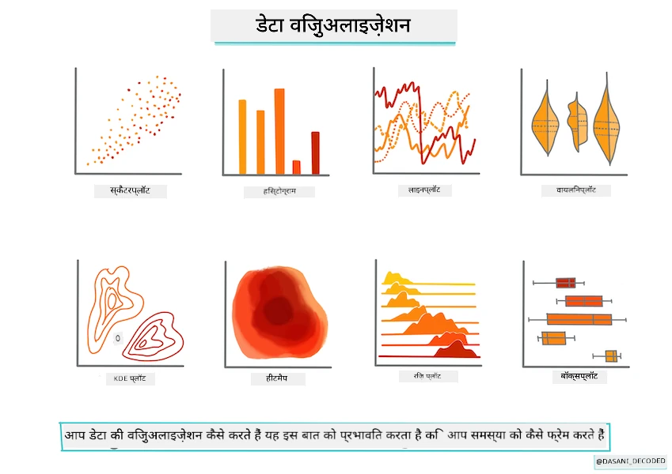
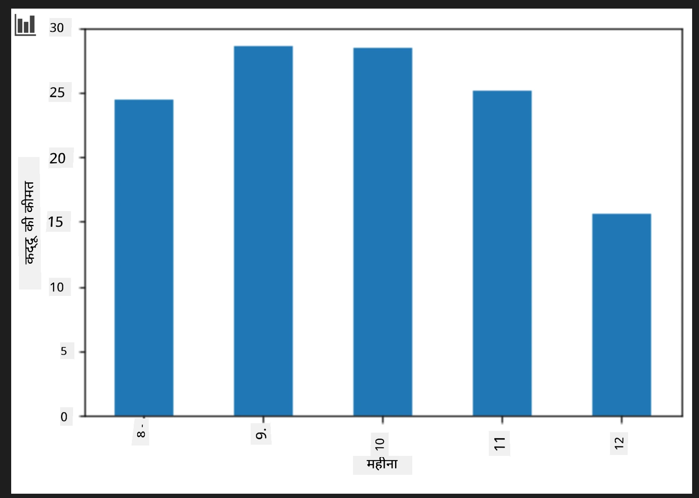
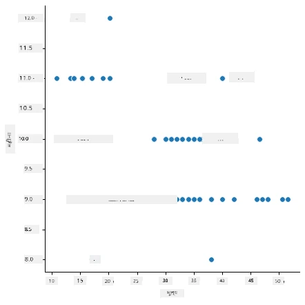
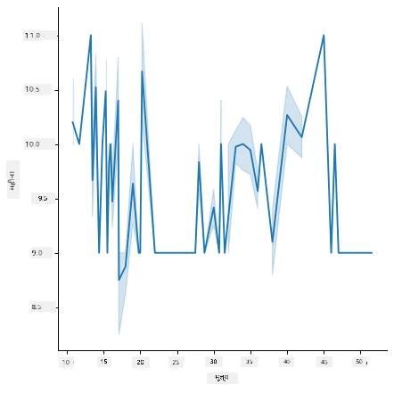
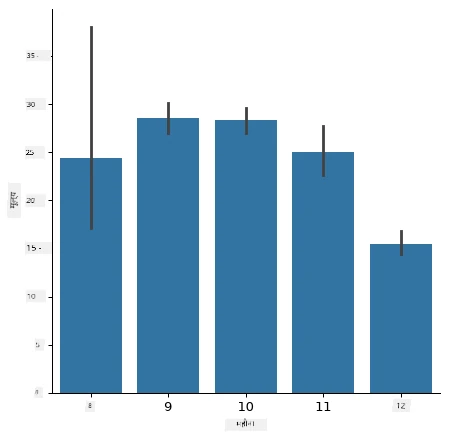
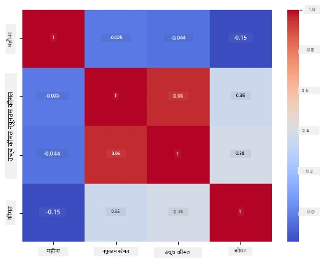

# Scikit-learn का उपयोग करके एक रिग्रेशन मॉडल बनाएं: डेटा तैयार करें और विज़ुअलाईज़ करें



इन्फोग्राफिक द्वारा [Dasani Madipalli](https://twitter.com/dasani_decoded)

## [प्रि-लेक्चर क्विज़](https://ff-quizzes.netlify.app/en/ml/)

> ### [यह पाठ R में उपलब्ध है!](../../../../2-Regression/2-Data/solution/R/lesson_2.html)

## परिचय

अब जब आप Scikit-learn के साथ मशीन लर्निंग मॉडल निर्माण शुरू करने के लिए आवश्यक टूल्स के साथ तैयार हैं, तो आप अपने डेटा से प्रश्न पूछना शुरू करने के लिए तैयार हैं। डेटा के साथ काम करते समय और एमएल समाधान लागू करते समय, यह बहुत महत्वपूर्ण है कि सही प्रश्न पूछें ताकि आप अपने डेटासेट की संभावनाओं को सही तरीके से खोल सकें।

इस पाठ में, आप सीखेंगे:

- मॉडल बनाने के लिए अपने डेटा को कैसे तैयार करें।
- डेटा विज़ुअलाईज़ेशन के लिए Matplotlib का उपयोग कैसे करें।
- अधिक अभिव्यक्तिपूर्ण डेटा विज़ुअलाईज़ेशन के लिए Seaborn का उपयोग कैसे करें।

## अपने डेटा से सही प्रश्न पूछना

जिस प्रश्न का आपको उत्तर चाहिए वह निर्धारित करेगा कि आप कौन सा प्रकार का एमएल एल्गोरिदम उपयोग करेंगे। और आपको जो उत्तर मिलता है उसकी गुणवत्ता आपके डेटा के स्वभाव पर भारी निर्भर करेगी।

इस पाठ के लिए प्रदान किए गए [डेटा](https://github.com/microsoft/ML-For-Beginners/blob/main/2-Regression/data/US-pumpkins.csv) पर एक नजर डालें। आप इस .csv फ़ाइल को VS कोड में खोल सकते हैं। एक त्वरित अवलोकन से पता चलता है कि वहाँ रिक्त स्थान हैं और स्ट्रिंग्स और संख्यात्मक डेटा का मिश्रण है। एक अजीब कॉलम 'Package' भी है जहाँ डेटा 'sacks', 'bins' और अन्य मानों का मिश्रण है। वास्तव में, डेटा थोड़ा अस्त-व्यस्त है।

[](https://youtu.be/5qGjczWTrDQ "शुरुआती लोगों के लिए एमएल - डेटा सेट को कैसे विश्लेषण और साफ़ करें")

> 🎥 इस पाठ के लिए डेटा तैयार करने के काम को दर्शाते एक छोटे वीडियो के लिए ऊपर की छवि पर क्लिक करें।

वास्तव में, यह बहुत आम नहीं है कि आपको एक ऐसा डेटासेट दिया जाए जो तुरंत उपयोग के लिए पूरी तरह से तैयार हो ताकि आप एमएल मॉडल बना सकें। इस पाठ में, आप मानक पायथन लाइब्रेरीज का उपयोग करके एक कच्चे डेटासेट को कैसे तैयार करें, यह सीखेंगे। आप डेटा विज़ुअलाईज़ेशन की विभिन्न तकनीकों के बारे में भी जानेंगे।

## केस स्टडी: 'कद्दू बाजार'

इस फ़ोल्डर में आपको रूट `data` फ़ोल्डर में [US-pumpkins.csv](https://github.com/microsoft/ML-For-Beginners/blob/main/2-Regression/data/US-pumpkins.csv) नाम की एक .csv फ़ाइल मिलेगी जिसमें कद्दुओं के बाजार के बारे में 1757 पंक्तियाँ हैं, जिन्हें शहरों द्वारा समूहित किया गया है। यह कच्चा डेटा संयुक्त राज्य कृषि विभाग द्वारा वितरित [Specialty Crops Terminal Markets Standard Reports](https://www.marketnews.usda.gov/mnp/fv-report-config-step1?type=termPrice) से निकाला गया है।

### डेटा की तैयारी

यह डेटा सार्वजनिक क्षेत्र में है। इसे USDA वेबसाइट से शहर के अनुसार कई अलग-अलग फ़ाइलों में डाउनलोड किया जा सकता है। बहुत सारी अलग-अलग फ़ाइलों से बचने के लिए, हमने सभी शहरों का डेटा एक स्प्रेडशीट में संयोजित किया है, इसलिए हमने डेटा को थोड़ा _तैयार_ किया हुआ है। अब, आइए डेटा को करीब से देखें।

### कद्दू डेटा - प्रारंभिक निष्कर्ष

आप इस डेटा के बारे में क्या नोटिस करते हैं? आपने पहले ही देखा है कि इसमें स्ट्रिंग्स, संख्याएँ, रिक्त स्थान और अजीब मानों का मिश्रण है जिन्हें आपको समझना है।

आप इस डेटा से रिग्रेशन तकनीक का उपयोग करते हुए क्या प्रश्न पूछ सकते हैं? जैसे कि "किसी दिए गए महीने में बिक्री के लिए कद्दू का मूल्य अनुमानित करें"। डेटा को पुनः देखने पर, कुछ बदलाव करने होंगे ताकि इस कार्य के लिए आवश्यक डेटा संरचना बन सके।
## अभ्यास - कद्दू डेटा का विश्लेषण करें

चलिए [Pandas](https://pandas.pydata.org/) का उपयोग करते हैं, (नाम का अर्थ है `Python Data Analysis`) जो डेटा को आकार देने के लिए बहुत उपयोगी टूल है, इस कद्दू डेटा का विश्लेषण और तैयारी करने के लिए।

### पहले, गायब तारीखें चेक करें

आपको सबसे पहले गायब तारीखों के लिए जांच करनी होगी:

1. तारीखों को महीने के प्रारूप में बदलें (ये अमेरिकी तारीखें हैं, इसलिए प्रारूप है `MM/DD/YYYY`)।
2. महीने को एक नए कॉलम में निकालें।

Visual Studio Code में _notebook.ipynb_ फ़ाइल खोलें और स्प्रेडशीट को नए Pandas dataframe में इंपोर्ट करें।

1. `head()` फ़ंक्शन का उपयोग करके पहले पाँच पंक्तियों को देखें।

    ```python
    import pandas as pd
    pumpkins = pd.read_csv('../data/US-pumpkins.csv')
    pumpkins.head()
    ```

    ✅ अंतिम पाँच पंक्तियाँ देखने के लिए कौन सा फ़ंक्शन उपयोग करेंगे?

1. जांचें कि वर्तमान dataframe में कोई गायब डेटा है या नहीं:

    ```python
    pumpkins.isnull().sum()
    ```

    कुछ डेटा गायब है, लेकिन शायद यह कार्य के लिए मायने नहीं रखेगा।

1. अपने dataframe के साथ काम करना आसान बनाने के लिए, केवल आवश्यक कॉलम चुनें, `loc` फ़ंक्शन का उपयोग करके जो मूल dataframe से पंक्तियों (पहला पैरामीटर) और कॉलमों (दूसरा पैरामीटर) का समूह निकालता है। नीचे के उदाहरण में `:` का अर्थ है "सभी पंक्तियाँ"।

    ```python
    columns_to_select = ['Package', 'Low Price', 'High Price', 'Date']
    pumpkins = pumpkins.loc[:, columns_to_select]
    ```

### दूसरा, कद्दू का औसत मूल्य निर्धारित करें

सोचें कि किसी दिए गए महीने में कद्दू का औसत मूल्य कैसे पाएँ। इस कार्य के लिए आप कौन से कॉलम चुनेंगे? संकेत: आपको 3 कॉलम चाहिए होंगे।

समाधान: `Low Price` और `High Price` कॉलमों का औसत लेकर नए Price कॉलम में भरें, और Date कॉलम को केवल महीने तक सीमित करें। सौभाग्य से ऊपर की जांच के अनुसार, तारीखों या कीमतों के लिए कोई गायब डेटा नहीं है।

1. औसत निकालने के लिए निम्न कोड जोड़ें:

    ```python
    price = (pumpkins['Low Price'] + pumpkins['High Price']) / 2

    month = pd.DatetimeIndex(pumpkins['Date']).month

    ```

   ✅ अपने डेटा को चेक करने के लिए `print(month)` से किसी भी डेटा को प्रिंट कर सकते हैं।

2. अब, अपने परिवर्तित डेटा को एक नए Pandas dataframe में कॉपी करें:

    ```python
    new_pumpkins = pd.DataFrame({'Month': month, 'Package': pumpkins['Package'], 'Low Price': pumpkins['Low Price'],'High Price': pumpkins['High Price'], 'Price': price})
    ```

    अपने dataframe को प्रिंट करने पर आपको एक साफ, व्यवस्थित डेटासेट मिलेगा जिस पर आप अपना नया रिग्रेशन मॉडल बना सकते हैं।

### लेकिन रुको! यहाँ कुछ अजीब है

यदि आप `Package` कॉलम देखें, तो कद्दू कई अलग-अलग आकारों में बेचे जाते हैं। कुछ '1 1/9 bushel' मापन में बेचे जाते हैं, कुछ '1/2 bushel' में, कुछ प्रति कद्दू, कुछ प्रति पाउंड, और कुछ बड़े डब्बों में जिनकी चौड़ाई भिन्न होती है।

> कद्दू को लगातार वजन करना बहुत कठिन लगता है

मूल डेटा को देखकर दिलचस्प बात यह है कि जिनका `Unit of Sale` 'EACH' या 'PER BIN' है, उनके `Package` प्रकार में भी प्रति इंच, प्रति बिन या 'each' होता है। कद्दू का लगातार वजन करना कठिन लगता है, इसलिए चलिए केवल उन कद्दुओं को फ़िल्टर करते हैं जिनके `Package` कॉलम में 'bushel' स्ट्रिंग है।

1. फ़ाइल की शुरुआत में, प्रारंभिक .csv इंपोर्ट के नीचे फ़िल्टर जोड़ें:

    ```python
    pumpkins = pumpkins[pumpkins['Package'].str.contains('bushel', case=True, regex=True)]
    ```

    यदि आप अब डेटा प्रिंट करते हैं, तो आप देखेंगे कि आप केवल लगभग 415 पंक्तियों को प्राप्त कर रहे हैं जिनमें bushel द्वारा कद्दू हैं।

### लेकिन रुको! एक और काम करना है

क्या आपने देखा कि bushel मात्रा प्रति पंक्ति भिन्न होती है? आपको मूल्य निर्धारण को सामान्यीकृत करना होगा ताकि आप मूल्य प्रति bushel दिखा सकें, इसलिए इसे मानकीकृत करने के लिए कुछ गणना करें।

1. नई_pumpkins dataframe बनाने वाले ब्लॉक के बाद ये लाइनें जोड़ें:

    ```python
    new_pumpkins.loc[new_pumpkins['Package'].str.contains('1 1/9'), 'Price'] = price/(1 + 1/9)

    new_pumpkins.loc[new_pumpkins['Package'].str.contains('1/2'), 'Price'] = price/(1/2)
    ```

✅ [The Spruce Eats](https://www.thespruceeats.com/how-much-is-a-bushel-1389308) के अनुसार, एक bushel का वजन उत्पाद के प्रकार पर निर्भर करता है, क्योंकि यह एक आयतन मापन है। "उदाहरण के लिए टमाटर के एक bushel का वजन 56 पाउंड होना चाहिए... पत्ते और हरी पत्तेदार सब्जियाँ अधिक जगह घेरती हैं लेकिन कम वजन होती है, इसलिए पालक के एक bushel का वजन केवल 20 पाउंड होता है।" यह सब काफी जटिल है! चलिए bushel को पाउंड में परिवर्तित करने की चिंता न करें, बल्कि bushel के हिसाब से मूल्य रखें। कद्दुओं के bushel के इस अध्ययन से ऐसा साबित होता है कि अपने डेटा की प्रकृति को समझना कितना महत्वपूर्ण है!

अब, आप उनके bushel मापन के आधार पर मूल्य निर्धारण का विश्लेषण कर सकते हैं। यदि आप डेटा को एक बार फिर से प्रिंट करें, तो आप देख सकते हैं कि यह कैसे मानकीकृत है।

✅ क्या आपने नोटिस किया कि आधे bushel में बेचे जाने वाले कद्दू बहुत महंगे हैं? क्या आप इसका कारण पता लगा सकते हैं? संकेत: छोटे कद्दू बड़े कद्दू से बहुत महंगे होते हैं, शायद इसलिए क्योंकि प्रति bushel उनमें कई अधिक होते हैं, जबकि एक बड़ा खोखला पाई कद्दू अधिक खाली जगह लेता है।

## विज़ुअलाइजेशन रणनीतियाँ

डेटा वैज्ञानिक की भूमिका का एक भाग यह दिखाना है कि वे जिस डेटा के साथ काम कर रहे हैं उसकी गुणवत्ता और प्रकृति कैसी है। इसके लिए, वे अक्सर रोचक विज़ुअलाइजेशन बनाते हैं, जैसे प्लॉट, ग्राफ़, और चार्ट, जो डेटा के विभिन्न पहलुओं को दिखाते हैं। इस तरह वे بصری रूप से रिश्तों और अंतर को दिखा पाते हैं जो अन्यथा पता लगाना कठिन होता है।

[](https://youtu.be/SbUkxH6IJo0 "शुरुआती लोगों के लिए एमएल - Matplotlib के साथ डेटा विज़ुअलाईज़ करें")

> 🎥 इस पाठ के लिए डेटा विज़ुअलाईज़ेशन पर एक छोटा वीडियो देखने के लिए ऊपर की छवि पर क्लिक करें।

विज़ुअलाइजेशन यह भी तय करने में मदद कर सकता है कि डेटा के लिए कौन सी मशीन लर्निंग तकनीक सबसे उपयुक्त है। उदाहरण के लिए, एक स्कैटरप्लॉट जो एक रेखा का पालन करता प्रतीत होता है, यह दर्शाता है कि डेटा एक रैखिक रिग्रेशन अभ्यास के लिए उपयुक्त हो सकता है।

एक डेटा विज़ुअलाईज़ेशन लाइब्रेरी जो Jupyter नोटबुक में अच्छी तरह काम करती है वह है [Matplotlib](https://matplotlib.org/) (जिसे आपने पिछले पाठ में भी देखा था)।

> [इन ट्यूटोरियल्स](https://docs.microsoft.com/learn/modules/explore-analyze-data-with-python?WT.mc_id=academic-77952-leestott) में डेटा विज़ुअलाईज़ेशन के साथ अधिक अनुभव प्राप्त करें।

## अभ्यास - Matplotlib के साथ प्रयोग करें

अभी बनाए गए नए dataframe को प्रदर्शित करने के लिए कुछ बुनियादी प्लॉट बनाने की कोशिश करें। एक बुनियादी लाइन प्लॉट क्या दिखाएगा?

1. फ़ाइल के शीर्ष पर, Pandas इंपोर्ट के नीचे Matplotlib इंपोर्ट करें:

    ```python
    import matplotlib.pyplot as plt
    ```

1. नोटबुक को संपूर्ण रूप से पुनः चलाएं।
1. नोटबुक के नीचे एक सेल जोड़ें जो डेटा को बॉक्स प्लॉट के रूप में प्रस्तुत करे:

    ```python
    price = new_pumpkins.Price
    month = new_pumpkins.Month
    plt.scatter(price, month)
    plt.show()
    ```

    

    क्या यह एक उपयोगी प्लॉट है? क्या इसमें कुछ आपको आश्चर्यचकित करता है?

    यह खास उपयोगी नहीं है क्योंकि यह केवल आपके डेटा को एक विस्तृत बिंदुओं के रूप में एक दिए गए महीने में दिखाता है।

### इसे उपयोगी बनाएं

उपयोगी डेटा चार्ट्स प्रदर्शित करने के लिए, आपको आम तौर पर डेटा को किसी तरह समूहित करना पड़ता है। चलिए एक ऐसा प्लॉट बनाने की कोशिश करें जहाँ y अक्ष महीनों को दिखाता है और डेटा वितरण को दर्शाता है।

1. एक सेल जोड़ें जो एक समूहित बार चार्ट बनाए:

    ```python
    new_pumpkins.groupby(['Month'])['Price'].mean().plot(kind='bar')
    plt.ylabel("Pumpkin Price")
    ```

    

    यह एक अधिक उपयोगी डेटा विज़ुअलाईज़ेशन है! यह दर्शाता है कि कद्दू के लिए उच्चतम कीमत सितंबर और अक्टूबर में होती है। क्या यह आपकी उम्मीद से मेल खाता है? क्यों या क्यों नहीं?

## अभ्यास - Seaborn के साथ प्रयोग करें

Matplotlib शक्तिशाली है, लेकिन एक चिकना चार्ट बनाने में काफी कोड लग सकता है। [Seaborn](https://seaborn.pydata.org/) एक लाइब्रेरी है जो Matplotlib के ऊपर बनी है और सांख्यिकीय डेटा विज़ुअलाईज़ेशन के लिए डिज़ाइन की गई है। यह सीधे Pandas dataframes के साथ काम करती है, आकर्षक डिफ़ॉल्ट शैलियाँ लागू करती है, और बहुत कम कोड के साथ सूचनात्मक प्लॉट बनाती है। चूंकि Seaborn Matplotlib ऑब्जेक्ट्स लौटाता है, आप Matplotlib के बारे में पहले से जो कुछ जानते हैं उसे परिणामों को बेहतर बनाने के लिए उपयोग कर सकते हैं।

> यदि आपके पास Seaborn पहले से इंस्टॉल नहीं है, तो इसे `pip install seaborn` से इंस्टॉल करें।

1. नोटबुक के शीर्ष पर अन्य इंपोर्ट्स के नीचे Seaborn इंपोर्ट करें। इसे सामान्यतः `sns` के रूप में इंपोर्ट किया जाता है:

    ```python
    import seaborn as sns
    ```

### रिश्तों को दिखाने के लिए स्कैटर प्लॉट्स

मॉडल बनाने से पहले डेटा का पता लगाने का एक बड़ा हिस्सा है चर के बीच _रिश्तों_ को देखना। [स्कैटर प्लॉट](https://en.wikipedia.org/wiki/Scatter_plot) इस उद्देश्य के लिए सबसे अच्छे उपकरणों में से एक है: यदि बिंदु किसी रेखा का अनुसरण करते हुए दिखें, तो दोनों चर सहसंबद्ध हो सकते हैं, जो कि एक संकेत है कि लाइनियर रिग्रेशन मॉडल काम कर सकता है।

1. पहले के मूल्य-से-महीना स्कैटर प्लॉट को फिर से बनाएं, लेकिन इस बार Seaborn के [`relplot()`](https://seaborn.pydata.org/generated/seaborn.relplot.html) (संबंधित प्लॉट) का उपयोग करते हुए, जो सीधे आपके dataframe के कॉलम के साथ काम करता है:

    ```python
    sns.relplot(x="Price", y="Month", data=new_pumpkins)
    ```

    

    ध्यान दें कि आप _कॉलम नाम_ और डेटा फ्रेम पास करते हैं, और Seaborn आपके लिए अक्ष लेबलों का ध्यान रखता है।

2. आप `kind="line"` पास करके इसे लाइन प्लॉट में बदल सकते हैं। Seaborn रेखा के चारों ओर विश्वास अंतराल दिखाने वाला एक छायांकित बैंड भी बनाता है:

    ```python
    sns.relplot(x="Price", y="Month", kind="line", data=new_pumpkins)
    ```

    

    यह विशेष डेटा काफी शोर युक्त है, इसलिए लाइन प्लॉट सबसे स्पष्ट विकल्प नहीं है - लेकिन यह दिखाता है कि आप आसानी से Seaborn में चार्ट प्रकार कैसे बदल सकते हैं।

### वितरण दिखाने के लिए बार चार्ट्स


पहले आपने Matplotlib के साथ बार चार्ट बनाने के लिए डेटा को हाथ से समूहित किया था। Seaborn का [`catplot()`](https://seaborn.pydata.org/generated/seaborn.catplot.html) (श्रेणीबद्ध प्लॉट) आपके लिए समूहण और एकत्रीकरण कर सकता है। डिफ़ॉल्ट रूप से `kind="bar"` प्रत्येक श्रेणी का औसत दिखाता है साथ ही एक काली रेखा जो विश्वास अंतराल को संकेत करती है।

1. प्रति महीने औसत मूल्य का बार चार्ट बनाएं:

    ```python
    sns.catplot(x="Month", y="Price", data=new_pumpkins, kind="bar")
    ```

    

    यह पुष्टि करता है जो आपने Matplotlib के साथ देखा था — कीमतें सितंबर और अक्टूबर के आसपास चरम पर होती हैं — लेकिन Seaborn यह भी दिखाता है कि प्रत्येक महीने के भीतर कीमत कितनी _वैरिएबल_ होती है।

### सहसंबंध दिखाने वाले हीटमैप्स

स्कैटर प्लॉट एक बार में दो चर की तुलना करते हैं। जब आपके पास कई संख्यात्मक कॉलम होते हैं, तब एक [हीटमैप](https://en.wikipedia.org/wiki/Heat_map) आपको एक साथ _हर_ कॉलम जोड़ी के बीच संबंध की ताकत देखने देता है। यह एक सामान्य तरीका है यह देखने का कि कौन से फीचर्स सबसे अधिक संबंधित हैं इससे पहले कि आप मॉडल में कौन से फीचर फीड करें (और समान प्रकार के चार्ट का उपयोग बाद में क्लासिफिकेशन में कॉन्फ्यूजन मैट्रिक्स दिखाने के लिए किया जाता है)।

1. Pandas के साथ एक सहसंबंध मैट्रिक्स बनाएं, फिर Seaborn के [`heatmap()`](https://seaborn.pydata.org/generated/seaborn.heatmap.html) के साथ इसे ड्रॉ करें। `annot=True` विकल्प प्रत्येक सेल पर सहसंबंध मान प्रिंट करता है:

    ```python
    correlations = new_pumpkins[['Month', 'Low Price', 'High Price', 'Price']].corr()
    sns.heatmap(correlations, annot=True, cmap="coolwarm")
    ```

    

    `1` (या `-1`) के करीब मान का अर्थ है कि कॉलम सशक्त रूप से _रेखीय_ संबंधित हैं। देखें कि कैसे `Low Price` और `High Price` लगभग पूरी तरह से संबंधित हैं। दूसरी ओर, `Month` केवल कमजोर रेखीय संबंध दिखाता है — भले ही उपर्युक्त बार चार्ट ने सितंबर और अक्टूबर में एक स्पष्ट मौसमी चरम को दिखाया हो। यह एक महत्वपूर्ण सबक है: सहसंबंध गुणांक केवल _सीधी_ रेखा वाले संबंधों को मापता है, इसलिए यह मौसमी या अन्यथा गैर-रेखीय पैटर्न को छिपा सकता है। ✅ यह उपयोगी क्यों है कि हीटमैप और बार चार्ट जैसे चार्ट दोनों को देखने के बाद यह तय करें कि कौन से कॉलम का उपयोग करना है?

### Matplotlib या Seaborn?

दोनों पुस्तकालय जानने योग्य हैं:

- **Matplotlib** आपको चार्ट के प्रत्येक तत्व पर सूक्ष्म नियंत्रण देता है और यह लगभग हर अन्य पायथन प्लॉटिंग लाइब्रेरी की नींव है।
- **Seaborn** उच्च-स्तरीय फ़ंक्शन और सांख्यिकीय चार्ट के लिए आकर्षक पूर्वनिर्धारित सेटिंग्स प्रदान करता है, सीधे डेटा फ्रेम के साथ काम करता है, और अन्वेषणात्मक डेटा विश्लेषण के लिए अक्सर तेज़ होता है।

एक सामान्य कार्यप्रवाह यह है कि आप जल्दी से अपने डेटा का पता लगाने के लिए Seaborn तक पहुंचें, फिर जब विवरण कस्टमाइज़ेशन की ज़रूरत हो तो Matplotlib का उपयोग करें।

---

## 🚀चुनौती

Matplotlib और Seaborn जो विभिन्न प्रकार के विज़ुअलाइज़ेशन प्रदान करते हैं उन्हें एक्सप्लोर करें। कौन से प्रकार सबसे उपयुक्त हैं रिग्रेशन समस्याओं के लिए?

## [पाठ-परिचय क्विज़](https://ff-quizzes.netlify.app/en/ml/)

## समीक्षा और स्व-अध्ययन

डेटा को विज़ुअलाइज़ करने के कई तरीकों को देखें। उपलब्ध विभिन्न लाइब्रेरी की सूची बनाएं और नोट करें कि कौन से कार्य के लिए सबसे उपयुक्त हैं, जैसे 2D विज़ुअलाइज़ेशन बनाम 3D विज़ुअलाइज़ेशन। आप क्या खोजते हैं?

## असाइनमेंट

[विज़ुअलाइज़ेशन की खोज](assignment.md)

---

<!-- CO-OP TRANSLATOR DISCLAIMER START -->
**अस्वीकरण**:
इस दस्तावेज़ का अनुवाद AI अनुवाद सेवा [Co-op Translator](https://github.com/Azure/co-op-translator) का उपयोग करके किया गया है। जबकि हम सटीकता के लिए प्रयास करते हैं, कृपया ध्यान दें कि स्वचालित अनुवादों में त्रुटियाँ या अशुद्धियाँ हो सकती हैं। मूल दस्तावेज़ अपनी मूल भाषा में ही प्रामाणिक स्रोत माना जाना चाहिए। महत्वपूर्ण जानकारी के लिए, पेशेवर मानव अनुवाद की सिफारिश की जाती है। इस अनुवाद के उपयोग से उत्पन्न किसी भी गलतफहमी या गलत व्याख्या के लिए हम उत्तरदायी नहीं हैं।
<!-- CO-OP TRANSLATOR DISCLAIMER END -->