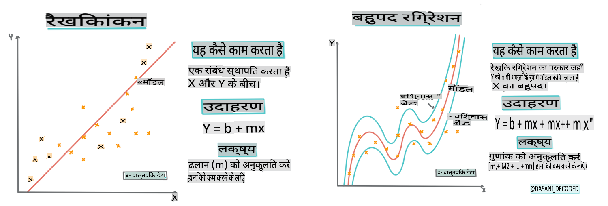
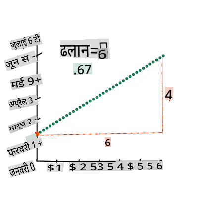
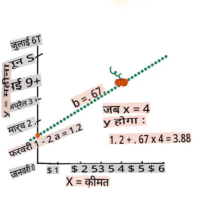

# Scikit-learn का उपयोग करके एक रिग्रेशन मॉडल बनाएं: रिग्रेशन के चार तरीके


> Infographic by [Dasani Madipalli](https://twitter.com/dasani_decoded)
## [Pre-lecture quiz](https://gray-sand-07a10f403.1.azurestaticapps.net/quiz/13/)

> ### [यह पाठ R में उपलब्ध है!](../../../../2-Regression/3-Linear/solution/R/lesson_3.html)
### परिचय

अब तक आपने इस पाठ में उपयोग किए जाने वाले कद्दू मूल्य निर्धारण डेटासेट से एकत्र किए गए नमूना डेटा के साथ रिग्रेशन क्या है, इसका पता लगाया है। आपने इसे Matplotlib का उपयोग करके भी विज़ुअलाइज़ किया है।

अब आप एमएल के लिए रिग्रेशन में गहराई से गोता लगाने के लिए तैयार हैं। जबकि विज़ुअलाइज़ेशन आपको डेटा को समझने की अनुमति देता है, मशीन लर्निंग की वास्तविक शक्ति _मॉडल प्रशिक्षण_ से आती है। मॉडल ऐतिहासिक डेटा पर प्रशिक्षित होते हैं ताकि डेटा निर्भरताओं को स्वचालित रूप से कैप्चर किया जा सके, और वे आपको नए डेटा के लिए परिणामों की भविष्यवाणी करने की अनुमति देते हैं, जिसे मॉडल ने पहले नहीं देखा है।

इस पाठ में, आप दो प्रकार के रिग्रेशन के बारे में अधिक जानेंगे: _बेसिक लीनियर रिग्रेशन_ और _पोलिनोमियल रिग्रेशन_, साथ ही इन तकनीकों के अंतर्निहित गणित के कुछ पहलू। ये मॉडल हमें विभिन्न इनपुट डेटा के आधार पर कद्दू की कीमतों की भविष्यवाणी करने की अनुमति देंगे।

[](https://youtu.be/CRxFT8oTDMg "ML for beginners - Understanding Linear Regression")

> 🎥 ऊपर दी गई छवि पर क्लिक करें लीनियर रिग्रेशन का एक संक्षिप्त वीडियो अवलोकन देखने के लिए।

> इस पाठ्यक्रम के दौरान, हम गणित का न्यूनतम ज्ञान मानते हैं और अन्य क्षेत्रों से आने वाले छात्रों के लिए इसे सुलभ बनाने का प्रयास करते हैं, इसलिए समझ में सहायता के लिए नोट्स, 🧮 कॉलआउट्स, आरेख और अन्य शिक्षण उपकरण देखें।

### आवश्यकताएँ

अब तक आपको कद्दू डेटा की संरचना से परिचित होना चाहिए जिसे हम जांच रहे हैं। आप इसे इस पाठ के _notebook.ipynb_ फ़ाइल में पहले से लोड और पहले से साफ़ कर सकते हैं। फ़ाइल में, कद्दू की कीमत एक नए डेटा फ्रेम में प्रति बुशल प्रदर्शित होती है। सुनिश्चित करें कि आप इन नोटबुक्स को Visual Studio Code के कर्नेल्स में चला सकते हैं।

### तैयारी

याद दिलाने के लिए, आप इस डेटा को लोड कर रहे हैं ताकि इससे सवाल पूछ सकें।

- कद्दू खरीदने का सबसे अच्छा समय कब है?
- एक मिनिएचर कद्दू के केस की कीमत कितनी हो सकती है?
- क्या मुझे उन्हें आधे-बुशल बास्केट में खरीदना चाहिए या 1 1/9 बुशल बॉक्स में?
आइए इस डेटा में और गहराई से जांच करें।

पिछले पाठ में, आपने एक Pandas डेटा फ्रेम बनाया और इसे मूल डेटासेट के एक हिस्से से आबाद किया, बुशल द्वारा मूल्य निर्धारण को मानकीकृत किया। ऐसा करने से, हालांकि, आप केवल लगभग 400 डेटा पॉइंट्स एकत्र करने में सक्षम थे और केवल पतझड़ के महीनों के लिए।

इस पाठ के साथ आने वाली नोटबुक में हमने जो डेटा पहले से लोड किया है, उस पर एक नज़र डालें। डेटा पहले से लोड है और एक प्रारंभिक बिखराव प्लॉट महीने के डेटा को दिखाने के लिए चार्ट किया गया है। हो सकता है कि हम इसे और अधिक साफ करके डेटा की प्रकृति के बारे में थोड़ी अधिक जानकारी प्राप्त कर सकें।

## एक लीनियर रिग्रेशन रेखा

जैसा कि आपने पाठ 1 में सीखा, लीनियर रिग्रेशन अभ्यास का लक्ष्य एक रेखा को प्लॉट करने में सक्षम होना है:

- **चर संबंध दिखाएं**। चर के बीच संबंध दिखाएं
- **भविष्यवाणियाँ करें**। यह भविष्यवाणी करें कि एक नया डेटा पॉइंट उस रेखा के संबंध में कहाँ गिर सकता है।

इस प्रकार की रेखा खींचने के लिए **लीस्ट-स्क्वेर्स रिग्रेशन** का उपयोग किया जाता है। 'लीस्ट-स्क्वेर्स' शब्द का अर्थ है कि रिग्रेशन रेखा के चारों ओर के सभी डेटा पॉइंट्स को वर्गाकार किया जाता है और फिर जोड़ा जाता है। आदर्श रूप से, वह अंतिम योग जितना संभव हो उतना छोटा होता है, क्योंकि हम कम संख्या में त्रुटियों, या `least-squares` चाहते हैं।

हम ऐसा इसलिए करते हैं क्योंकि हम एक ऐसी रेखा को मॉडल बनाना चाहते हैं जिसमें हमारे सभी डेटा पॉइंट्स से सबसे कम संचयी दूरी हो। हम उन्हें जोड़ने से पहले शब्दों को वर्गाकार भी करते हैं क्योंकि हम इसकी दिशा के बजाय इसके परिमाण से चिंतित हैं।

> **🧮 गणित दिखाएं**
> 
> इस रेखा को, जिसे _सबसे अच्छा फिट_ कहा जाता है, [एक समीकरण](https://en.wikipedia.org/wiki/Simple_linear_regression) द्वारा व्यक्त किया जा सकता है:
> 
> ```
> Y = a + bX
> ```
>
> `X` is the 'explanatory variable'. `Y` is the 'dependent variable'. The slope of the line is `b` and `a` is the y-intercept, which refers to the value of `Y` when `X = 0`. 
>
>
>
> First, calculate the slope `b`. Infographic by [Jen Looper](https://twitter.com/jenlooper)
>
> In other words, and referring to our pumpkin data's original question: "predict the price of a pumpkin per bushel by month", `X` would refer to the price and `Y` would refer to the month of sale. 
>
>
>
> Calculate the value of Y. If you're paying around $4, it must be April! Infographic by [Jen Looper](https://twitter.com/jenlooper)
>
> The math that calculates the line must demonstrate the slope of the line, which is also dependent on the intercept, or where `Y` is situated when `X = 0`.
>
> You can observe the method of calculation for these values on the [Math is Fun](https://www.mathsisfun.com/data/least-squares-regression.html) web site. Also visit [this Least-squares calculator](https://www.mathsisfun.com/data/least-squares-calculator.html) to watch how the numbers' values impact the line.

## Correlation

One more term to understand is the **Correlation Coefficient** between given X and Y variables. Using a scatterplot, you can quickly visualize this coefficient. A plot with datapoints scattered in a neat line have high correlation, but a plot with datapoints scattered everywhere between X and Y have a low correlation.

A good linear regression model will be one that has a high (nearer to 1 than 0) Correlation Coefficient using the Least-Squares Regression method with a line of regression.

✅ Run the notebook accompanying this lesson and look at the Month to Price scatterplot. Does the data associating Month to Price for pumpkin sales seem to have high or low correlation, according to your visual interpretation of the scatterplot? Does that change if you use more fine-grained measure instead of `Month`, eg. *day of the year* (i.e. number of days since the beginning of the year)?

In the code below, we will assume that we have cleaned up the data, and obtained a data frame called `new_pumpkins`, similar to the following:

ID | Month | DayOfYear | Variety | City | Package | Low Price | High Price | Price
---|-------|-----------|---------|------|---------|-----------|------------|-------
70 | 9 | 267 | PIE TYPE | BALTIMORE | 1 1/9 bushel cartons | 15.0 | 15.0 | 13.636364
71 | 9 | 267 | PIE TYPE | BALTIMORE | 1 1/9 bushel cartons | 18.0 | 18.0 | 16.363636
72 | 10 | 274 | PIE TYPE | BALTIMORE | 1 1/9 bushel cartons | 18.0 | 18.0 | 16.363636
73 | 10 | 274 | PIE TYPE | BALTIMORE | 1 1/9 bushel cartons | 17.0 | 17.0 | 15.454545
74 | 10 | 281 | PIE TYPE | BALTIMORE | 1 1/9 bushel cartons | 15.0 | 15.0 | 13.636364

> The code to clean the data is available in [`notebook.ipynb`](../../../../2-Regression/3-Linear/notebook.ipynb). We have performed the same cleaning steps as in the previous lesson, and have calculated `DayOfYear` कॉलम का उपयोग करके निम्नलिखित अभिव्यक्ति के साथ:

```python
day_of_year = pd.to_datetime(pumpkins['Date']).apply(lambda dt: (dt-datetime(dt.year,1,1)).days)
```

अब जब आपके पास लीनियर रिग्रेशन के पीछे के गणित की समझ है, तो आइए एक रिग्रेशन मॉडल बनाएं यह देखने के लिए कि हम कौन सा कद्दू पैकेज सबसे अच्छी कद्दू कीमतों के साथ भविष्यवाणी कर सकते हैं। कोई व्यक्ति जो छुट्टी के कद्दू पैच के लिए कद्दू खरीद रहा है, वह इस जानकारी को कद्दू पैच के लिए कद्दू पैकेजों की खरीद को अनुकूलित करने के लिए उपयोग करना चाह सकता है।

## सहसंबंध की तलाश में

[](https://youtu.be/uoRq-lW2eQo "ML for beginners - Looking for Correlation: The Key to Linear Regression")

> 🎥 ऊपर दी गई छवि पर क्लिक करें सहसंबंध का एक संक्षिप्त वीडियो अवलोकन देखने के लिए।

पिछले पाठ से आपने शायद देखा है कि विभिन्न महीनों के लिए औसत कीमत इस प्रकार दिखती है:


यह सुझाव देता है कि कुछ सहसंबंध होना चाहिए, और हम `Month` and `Price`, or between `DayOfYear` and `Price`. Here is the scatter plot that shows the latter relationship:

 

Let's see if there is a correlation using the `corr` फ़ंक्शन का उपयोग करके `Month` and `Price` के बीच संबंध की भविष्यवाणी करने के लिए लीनियर रिग्रेशन मॉडल को प्रशिक्षित करने का प्रयास कर सकते हैं:

```python
print(new_pumpkins['Month'].corr(new_pumpkins['Price']))
print(new_pumpkins['DayOfYear'].corr(new_pumpkins['Price']))
```

ऐसा लगता है कि सहसंबंध काफी छोटा है, -0.15 `Month` and -0.17 by the `DayOfMonth`, but there could be another important relationship. It looks like there are different clusters of prices corresponding to different pumpkin varieties. To confirm this hypothesis, let's plot each pumpkin category using a different color. By passing an `ax` parameter to the `scatter` प्लॉटिंग फ़ंक्शन का उपयोग करके हम सभी पॉइंट्स को एक ही ग्राफ पर प्लॉट कर सकते हैं:

```python
ax=None
colors = ['red','blue','green','yellow']
for i,var in enumerate(new_pumpkins['Variety'].unique()):
    df = new_pumpkins[new_pumpkins['Variety']==var]
    ax = df.plot.scatter('DayOfYear','Price',ax=ax,c=colors[i],label=var)
```

 

हमारी जांच से पता चलता है कि विविधता का वास्तविक बिक्री तिथि की तुलना में समग्र मूल्य पर अधिक प्रभाव है। हम इसे एक बार ग्राफ के साथ देख सकते हैं:

```python
new_pumpkins.groupby('Variety')['Price'].mean().plot(kind='bar')
```

 

आइए फिलहाल केवल एक कद्दू की किस्म, 'पाई प्रकार', पर ध्यान केंद्रित करें और देखें कि तारीख का मूल्य पर क्या प्रभाव पड़ता है:

```python
pie_pumpkins = new_pumpkins[new_pumpkins['Variety']=='PIE TYPE']
pie_pumpkins.plot.scatter('DayOfYear','Price') 
```
 

यदि हम अब `Price` and `DayOfYear` using `corr` function, we will get something like `-0.27` के बीच सहसंबंध की गणना करते हैं - जिसका अर्थ है कि भविष्यवाणी मॉडल को प्रशिक्षित करना समझ में आता है।

> एक लीनियर रिग्रेशन मॉडल को प्रशिक्षित करने से पहले, यह सुनिश्चित करना महत्वपूर्ण है कि हमारा डेटा साफ़ है। लीनियर रिग्रेशन लापता मूल्यों के साथ अच्छी तरह से काम नहीं करता है, इसलिए सभी खाली कोशिकाओं से छुटकारा पाना समझ में आता है:

```python
pie_pumpkins.dropna(inplace=True)
pie_pumpkins.info()
```

एक और दृष्टिकोण यह होगा कि उन खाली मूल्यों को संबंधित कॉलम से औसत मानों से भर दिया जाए।

## सरल लीनियर रिग्रेशन

[](https://youtu.be/e4c_UP2fSjg "ML for beginners - Linear and Polynomial Regression using Scikit-learn")

> 🎥 ऊपर दी गई छवि पर क्लिक करें लीनियर और पोलिनोमियल रिग्रेशन का एक संक्षिप्त वीडियो अवलोकन देखने के लिए।

हमारे लीनियर रिग्रेशन मॉडल को प्रशिक्षित करने के लिए, हम **Scikit-learn** लाइब्रेरी का उपयोग करेंगे।

```python
from sklearn.linear_model import LinearRegression
from sklearn.metrics import mean_squared_error
from sklearn.model_selection import train_test_split
```

हम इनपुट मानों (फीचर्स) और अपेक्षित आउटपुट (लेबल) को अलग-अलग numpy arrays में अलग करके शुरू करते हैं:

```python
X = pie_pumpkins['DayOfYear'].to_numpy().reshape(-1,1)
y = pie_pumpkins['Price']
```

> ध्यान दें कि हमें इनपुट डेटा पर `reshape` करना पड़ा ताकि लीनियर रिग्रेशन पैकेज इसे सही ढंग से समझ सके। लीनियर रिग्रेशन एक इनपुट के रूप में 2D-array की अपेक्षा करता है, जहां array की प्रत्येक पंक्ति इनपुट फीचर्स के वेक्टर के अनुरूप होती है। हमारे मामले में, चूंकि हमारे पास केवल एक इनपुट है - हमें आकार N×1 के साथ एक array की आवश्यकता है, जहां N डेटासेट का आकार है।

फिर, हमें डेटा को ट्रेन और टेस्ट डेटासेट्स में विभाजित करने की आवश्यकता है, ताकि हम प्रशिक्षण के बाद अपने मॉडल को मान्य कर सकें:

```python
X_train, X_test, y_train, y_test = train_test_split(X, y, test_size=0.2, random_state=0)
```

अंत में, वास्तविक लीनियर रिग्रेशन मॉडल को प्रशिक्षित करना केवल दो पंक्तियों का कोड लेता है। हम `LinearRegression` object, and fit it to our data using the `fit` मेथड को परिभाषित करते हैं:

```python
lin_reg = LinearRegression()
lin_reg.fit(X_train,y_train)
```

`LinearRegression` object after `fit`-ting contains all the coefficients of the regression, which can be accessed using `.coef_` property. In our case, there is just one coefficient, which should be around `-0.017`. It means that prices seem to drop a bit with time, but not too much, around 2 cents per day. We can also access the intersection point of the regression with Y-axis using `lin_reg.intercept_` - it will be around `21` हमारे मामले में, वर्ष की शुरुआत में कीमत को इंगित करता है।

यह देखने के लिए कि हमारा मॉडल कितना सटीक है, हम एक टेस्ट डेटासेट पर कीमतों की भविष्यवाणी कर सकते हैं, और फिर यह माप सकते हैं कि हमारी भविष्यवाणियाँ अपेक्षित मानों के कितने करीब हैं। यह मीन स्क्वायर एरर (MSE) मेट्रिक्स का उपयोग करके किया जा सकता है, जो अपेक्षित और भविष्यवाणी किए गए मूल्य के बीच सभी वर्गाकार अंतरों का औसत है।

```python
pred = lin_reg.predict(X_test)

mse = np.sqrt(mean_squared_error(y_test,pred))
print(f'Mean error: {mse:3.3} ({mse/np.mean(pred)*100:3.3}%)')
```

हमारी त्रुटि लगभग 2 अंक के आसपास लगती है, जो ~17% है। मॉडल गुणवत्ता का एक और संकेतक **निर्धारण का गुणांक** है, जिसे इस तरह से प्राप्त किया जा सकता है:

```python
score = lin_reg.score(X_train,y_train)
print('Model determination: ', score)
```
यदि मान 0 है, तो इसका मतलब है कि मॉडल इनपुट डेटा को ध्यान में नहीं रखता है, और *सबसे खराब लीनियर प्रेडिक्टर* के रूप में कार्य करता है, जो परिणाम का केवल एक औसत मान है। मान 1 का अर्थ है कि हम सभी अपेक्षित आउटपुट को पूरी तरह से भविष्यवाणी कर सकते हैं। हमारे मामले में, गुणांक लगभग 0.06 है, जो काफी कम है।

हम परीक्षण डेटा को रिग्रेशन लाइन के साथ प्लॉट भी कर सकते हैं ताकि यह बेहतर तरीके से देखा जा सके कि हमारे मामले में रिग्रेशन कैसे काम करता है:

```python
plt.scatter(X_test,y_test)
plt.plot(X_test,pred)
```


## पोलिनोमियल रिग्रेशन

लीनियर रिग्रेशन का एक और प्रकार पोलिनोमियल रिग्रेशन है। जबकि कभी-कभी चर के बीच एक लीनियर संबंध होता है - कद्दू का आकार जितना बड़ा होता है, कीमत उतनी ही अधिक होती है - कभी-कभी इन संबंधों को एक विमान या सीधी रेखा के रूप में प्लॉट नहीं किया जा सकता है।

✅ यहां [कुछ और उदाहरण](https://online.stat.psu.edu/stat501/lesson/9/9.8) हैं जिनमें पोलिनोमियल रिग्रेशन का उपयोग किया जा सकता है।

डेट और कीमत के बीच संबंध पर फिर से एक नज़र डालें। क्या यह बिखराव प्लॉट ऐसा लगता है कि इसे सीधे रेखा द्वारा विश्लेषित किया जाना चाहिए? क्या कीमतें नहीं बदल सकतीं? इस मामले में, आप पोलिनोमियल रिग्रेशन का प्रयास कर सकते हैं।

✅ पोलिनोमियल गणितीय अभिव्यक्तियाँ हैं जिनमें एक या अधिक चर और गुणांक शामिल हो सकते हैं

पोलिनोमियल रिग्रेशन एक घुमावदार रेखा बनाता है ताकि गैर-लीनियर डेटा को बेहतर तरीके से फिट किया जा सके। हमारे मामले में, यदि हम इनपुट डेटा में एक वर्गीय `DayOfYear` चर शामिल करते हैं, तो हमें अपने डेटा को एक परवलयिक वक्र के साथ फिट करने में सक्षम होना चाहिए, जिसमें वर्ष के एक निश्चित बिंदु पर न्यूनतम होगा।

Scikit-learn में विभिन्न डेटा प्रोसेसिंग चरणों को एक साथ संयोजित करने के लिए एक उपयोगी [pipeline API](https://scikit-learn.org/stable/modules/generated/sklearn.pipeline.make_pipeline.html?highlight=pipeline#sklearn.pipeline.make_pipeline) शामिल है। एक **pipeline** **अनुमानकों** की एक श्रृंखला है। हमारे मामले में, हम एक pipeline बनाएंगे जो पहले हमारे मॉडल में पोलिनोमियल फीचर्स जोड़ता है, और फिर रिग्रेशन को प्रशिक्षित करता है:

```python
from sklearn.preprocessing import PolynomialFeatures
from sklearn.pipeline import make_pipeline

pipeline = make_pipeline(PolynomialFeatures(2), LinearRegression())

pipeline.fit(X_train,y_train)
```

`PolynomialFeatures(2)` means that we will include all second-degree polynomials from the input data. In our case it will just mean `DayOfYear`<sup>2</sup>, but given two input variables X and Y, this will add X<sup>2</sup>, XY and Y<sup>2</sup>. We may also use higher degree polynomials if we want.

Pipelines can be used in the same manner as the original `LinearRegression` object, i.e. we can `fit` the pipeline, and then use `predict` to get the prediction results. Here is the graph showing test data, and the approximation curve:


Using Polynomial Regression, we can get slightly lower MSE and higher determination, but not significantly. We need to take into account other features!

> You can see that the minimal pumpkin prices are observed somewhere around Halloween. How can you explain this? 

🎃 Congratulations, you just created a model that can help predict the price of pie pumpkins. You can probably repeat the same procedure for all pumpkin types, but that would be tedious. Let's learn now how to take pumpkin variety into account in our model!

## Categorical Features

In the ideal world, we want to be able to predict prices for different pumpkin varieties using the same model. However, the `Variety` column is somewhat different from columns like `Month`, because it contains non-numeric values. Such columns are called **categorical**.

[](https://youtu.be/DYGliioIAE0 "ML for beginners - Categorical Feature Predictions with Linear Regression")

> 🎥 Click the image above for a short video overview of using categorical features.

Here you can see how average price depends on variety:


To take variety into account, we first need to convert it to numeric form, or **encode** it. There are several way we can do it:

* Simple **numeric encoding** will build a table of different varieties, and then replace the variety name by an index in that table. This is not the best idea for linear regression, because linear regression takes the actual numeric value of the index, and adds it to the result, multiplying by some coefficient. In our case, the relationship between the index number and the price is clearly non-linear, even if we make sure that indices are ordered in some specific way.
* **One-hot encoding** will replace the `Variety` column by 4 different columns, one for each variety. Each column will contain `1` if the corresponding row is of a given variety, and `0` अन्यथा। इसका मतलब है कि लीनियर रिग्रेशन में चार गुणांक होंगे, प्रत्येक कद्दू की किस्म के लिए एक, जो उस विशेष किस्म के लिए "शुरुआती कीमत" (या बल्कि "अतिरिक्त कीमत") के लिए जिम्मेदार है।

नीचे दिया गया कोड दिखाता है कि हम एक वेराइटी को कैसे वन-हॉट एन्कोड कर सकते हैं:

```python
pd.get_dummies(new_pumpkins['Variety'])
```

 ID | FAIRYTALE | MINIATURE | MIXED HEIRLOOM VARIETIES | PIE TYPE
----|-----------|-----------|--------------------------|----------
70 | 0 | 0 | 0 | 1
71 | 0 | 0 | 0 | 1
... | ... | ... | ... | ...
1738 | 0 | 1 | 0 | 0
1739 | 0 | 1 | 0 | 0
1740 | 0 | 1 | 0 | 0
1741 | 0 | 1 | 0 | 0
1742 | 0 | 1 | 0 | 0

वन-हॉट एन्कोड वेराइटी का उपयोग करके लीनियर रिग्रेशन को प्रशिक्षित करने के लिए, हमें बस `X` and `y` डेटा को सही ढंग से प्रारंभ करने की आवश्यकता है:

```python
X = pd.get_dummies(new_pumpkins['Variety'])
y = new_pumpkins['Price']
```

बाकी कोड वही है जो हमने लीनियर रिग्रेशन को प्रशिक्षित करने के लिए ऊपर उपयोग किया था। यदि आप इसे आजमाते हैं, तो आप देखेंगे कि मीन स्क्वायर एरर लगभग समान है, लेकिन हमें बहुत अधिक निर्धारण गुणांक (~77%) मिलता है। और अधिक सटीक भविष्यवाणियाँ प्राप्त करने के लिए, हम अधिक श्रेणीबद्ध फीचर्स को ध्यान में रख सकते हैं, साथ ही संख्यात्मक फीचर्स, जैसे `Month` or `DayOfYear`. To get one large array of features, we can use `join`:

```python
X = pd.get_dummies(new_pumpkins['Variety']) \
        .join(new_pumpkins['Month']) \
        .join(pd.get_dummies(new_pumpkins['City'])) \
        .join(pd.get_dummies(new_pumpkins['Package']))
y = new_pumpkins['Price']
```

यहां हम `City` and `Package` प्रकार को भी ध्यान में रखते हैं, जो हमें MSE 2.84 (10%) और निर्धारण 0.94 देता है!

## सब कुछ एक साथ रखना

सर्वश्रेष्ठ मॉडल बनाने के लिए, हम ऊपर दिए गए उदाहरण से संयुक्त (वन-हॉट एन्कोड श्रेणीबद्ध + संख्यात्मक) डेटा का उपयोग पोलिनोमियल रिग्रेशन के साथ कर सकते हैं। आपकी सुविधा के लिए यहां पूरा कोड दिया गया है:

```python
# set up training data
X = pd.get_dummies(new_pumpkins['Variety']) \
        .join(new_pumpkins['Month']) \
        .join(pd.get_dummies(new_pumpkins['City'])) \
        .join(pd.get_dummies(new_pumpkins['Package']))
y = new_pumpkins['Price']

# make train-test split
X_train, X_test, y_train, y_test = train_test_split(X, y, test_size=0.2, random_state=0)

# setup and train the pipeline
pipeline = make_pipeline(PolynomialFeatures(2), LinearRegression())
pipeline.fit(X_train,y_train)

# predict results for test data
pred = pipeline.predict(X_test)

# calculate MSE and determination
mse = np.sqrt(mean_squared_error(y_test,pred))
print(f'Mean error: {mse:3.3} ({mse/np.mean(pred)*100:3.3}%)')

score = pipeline.score(X_train,y_train)
print('Model determination: ', score)
```

यह हमें लगभग 97% का सर्वोत्तम निर्धारण गुणांक और MSE=2.23 (~8% भविष्यवाणी त्रुटि) देना चाहिए।

| मॉडल | MSE | निर्धारण |
|-------|-----|---------------|
| `DayOfYear@@INLINE_CODE

**अस्वीकरण**:
यह दस्तावेज़ मशीन-आधारित एआई अनुवाद सेवाओं का उपयोग करके अनुवादित किया गया है। जबकि हम सटीकता के लिए प्रयासरत हैं, कृपया ध्यान दें कि स्वचालित अनुवादों में त्रुटियाँ या अशुद्धियाँ हो सकती हैं। इसकी मूल भाषा में मूल दस्तावेज़ को प्राधिकृत स्रोत माना जाना चाहिए। महत्वपूर्ण जानकारी के लिए, पेशेवर मानव अनुवाद की सिफारिश की जाती है। इस अनुवाद के उपयोग से उत्पन्न किसी भी गलतफहमी या गलत व्याख्या के लिए हम उत्तरदायी नहीं हैं।