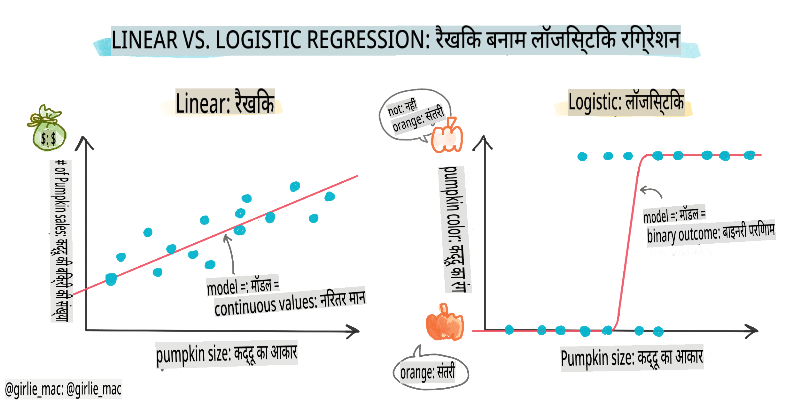
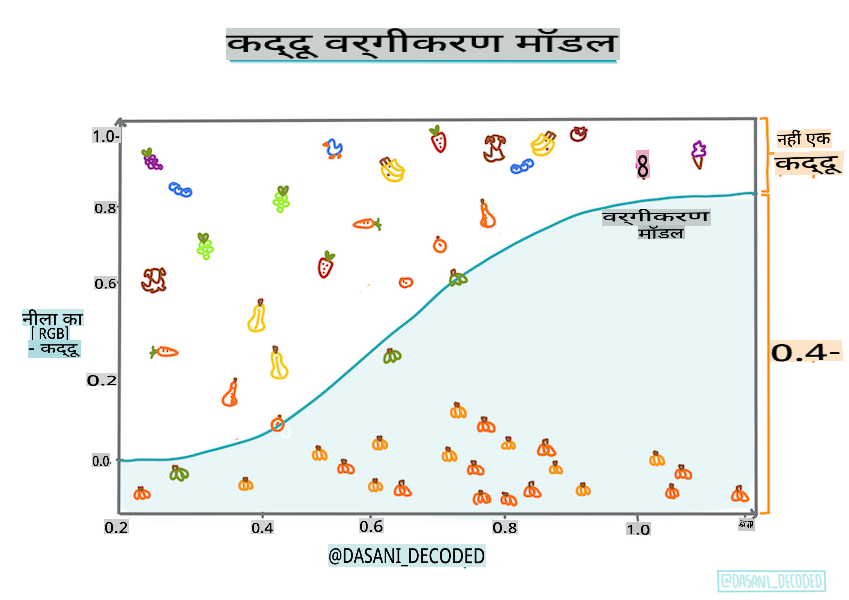
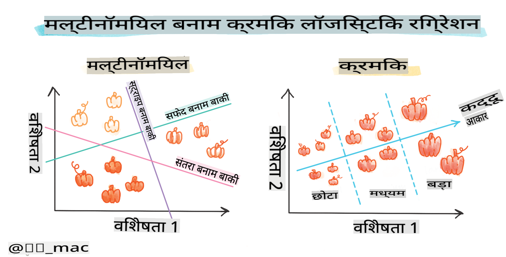
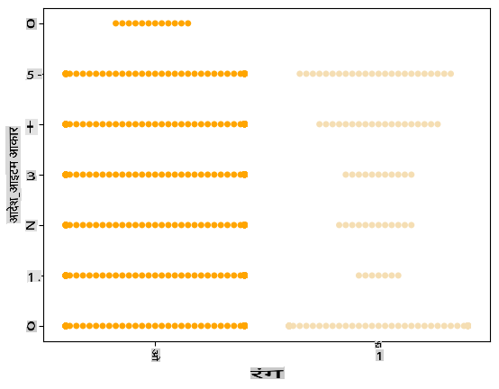
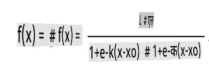

# श्रेणियों की भविष्यवाणी के लिए लॉजिस्टिक रिग्रेशन



## [प्री-लेक्चर क्विज़](https://gray-sand-07a10f403.1.azurestaticapps.net/quiz/15/)

> ### [यह पाठ R में उपलब्ध है!](../../../../2-Regression/4-Logistic/solution/R/lesson_4.html)

## परिचय

रिग्रेशन पर इस अंतिम पाठ में, जो कि एक बुनियादी _क्लासिक_ एमएल तकनीक है, हम लॉजिस्टिक रिग्रेशन पर नज़र डालेंगे। आप इस तकनीक का उपयोग बाइनरी श्रेणियों की भविष्यवाणी के लिए पैटर्न खोजने के लिए करेंगे। क्या यह कैंडी चॉकलेट है या नहीं? क्या यह बीमारी संक्रामक है या नहीं? क्या यह ग्राहक इस उत्पाद को चुनेगा या नहीं?

इस पाठ में, आप सीखेंगे:

- डेटा विज़ुअलाइज़ेशन के लिए एक नई लाइब्रेरी
- लॉजिस्टिक रिग्रेशन के तकनीकें

✅ इस प्रकार के रिग्रेशन के साथ काम करने की अपनी समझ को गहरा करें इस [Learn module](https://docs.microsoft.com/learn/modules/train-evaluate-classification-models?WT.mc_id=academic-77952-leestott) में

## पूर्वापेक्षा

कद्दू के डेटा के साथ काम करने के बाद, हम अब इस बात से परिचित हैं कि इसमें एक बाइनरी श्रेणी है जिसके साथ हम काम कर सकते हैं: `Color`.

आइए एक लॉजिस्टिक रिग्रेशन मॉडल बनाएं ताकि यह भविष्यवाणी की जा सके कि दिए गए कुछ वेरिएबल्स के आधार पर, _एक दिए गए कद्दू का रंग क्या होगा_ (नारंगी 🎃 या सफेद 👻)।

> हम रिग्रेशन के बारे में एक पाठ में बाइनरी क्लासिफिकेशन के बारे में क्यों बात कर रहे हैं? केवल भाषाई सुविधा के लिए, क्योंकि लॉजिस्टिक रिग्रेशन [वास्तव में एक क्लासिफिकेशन विधि](https://scikit-learn.org/stable/modules/linear_model.html#logistic-regression) है, हालांकि यह एक रैखिक आधारित है। डेटा को क्लासिफाई करने के अन्य तरीकों के बारे में जानें अगले पाठ समूह में।

## प्रश्न को परिभाषित करें

हमारे उद्देश्यों के लिए, हम इसे एक बाइनरी के रूप में व्यक्त करेंगे: 'सफेद' या 'न सफेद'। हमारे डेटा सेट में एक 'धारीदार' श्रेणी भी है लेकिन इसके कुछ उदाहरण ही हैं, इसलिए हम इसका उपयोग नहीं करेंगे। यह वैसे भी तब गायब हो जाता है जब हम डेटा सेट से शून्य मानों को हटा देते हैं।

> 🎃 मजेदार तथ्य, हम कभी-कभी सफेद कद्दुओं को 'भूत' कद्दू कहते हैं। इन्हें तराशना बहुत आसान नहीं होता, इसलिए ये नारंगी वाले जितने लोकप्रिय नहीं होते लेकिन ये देखने में बहुत अच्छे लगते हैं! तो हम अपने प्रश्न को इस प्रकार भी पुनःप्रारूपित कर सकते हैं: 'भूत' या 'न भूत'। 👻

## लॉजिस्टिक रिग्रेशन के बारे में

लॉजिस्टिक रिग्रेशन कुछ महत्वपूर्ण तरीकों से रैखिक रिग्रेशन से भिन्न है, जिसे आपने पहले सीखा था।

[](https://youtu.be/KpeCT6nEpBY "शुरुआती लोगों के लिए एमएल - मशीन लर्निंग क्लासिफिकेशन के लिए लॉजिस्टिक रिग्रेशन को समझना")

> 🎥 लॉजिस्टिक रिग्रेशन का संक्षिप्त वीडियो अवलोकन देखने के लिए ऊपर की छवि पर क्लिक करें।

### बाइनरी क्लासिफिकेशन

लॉजिस्टिक रिग्रेशन रैखिक रिग्रेशन जैसी विशेषताएं प्रदान नहीं करता। पूर्ववर्ती बाइनरी श्रेणी ("सफेद या न सफेद") के बारे में एक भविष्यवाणी प्रदान करता है जबकि बाद वाला निरंतर मानों की भविष्यवाणी करने में सक्षम है, उदाहरण के लिए, कद्दू की उत्पत्ति और कटाई के समय को देखते हुए, _इसकी कीमत कितनी बढ़ेगी_।


> इन्फोग्राफिक [दसानी मदीपल्ली](https://twitter.com/dasani_decoded) द्वारा

### अन्य क्लासिफिकेशन

लॉजिस्टिक रिग्रेशन के अन्य प्रकार भी हैं, जिनमें मल्टीनोमियल और ऑर्डिनल शामिल हैं:

- **मल्टीनोमियल**, जिसमें एक से अधिक श्रेणियां होती हैं - "नारंगी, सफेद, और धारीदार"।
- **ऑर्डिनल**, जिसमें क्रमबद्ध श्रेणियां होती हैं, उपयोगी होती हैं यदि हम अपने परिणामों को तार्किक रूप से क्रमबद्ध करना चाहते हैं, जैसे हमारे कद्दू जो एक सीमित संख्या में आकारों (मिनी, स्मॉल, मीडियम, लार्ज, एक्सएल, एक्सएक्सएल) द्वारा क्रमबद्ध होते हैं।



### वेरिएबल्स का सहसंबंध होना जरूरी नहीं है

याद रखें कि रैखिक रिग्रेशन अधिक सहसंबद्ध वेरिएबल्स के साथ बेहतर काम करता है? लॉजिस्टिक रिग्रेशन इसके विपरीत है - वेरिएबल्स का सहसंबंध होना जरूरी नहीं है। यह इस डेटा के लिए काम करता है जिसमें कुछ हद तक कमजोर सहसंबंध हैं।

### आपको बहुत सारा साफ डेटा चाहिए

लॉजिस्टिक रिग्रेशन अधिक डेटा का उपयोग करने पर अधिक सटीक परिणाम देगा; हमारा छोटा डेटा सेट इस कार्य के लिए आदर्श नहीं है, इसलिए इसे ध्यान में रखें।

[](https://youtu.be/B2X4H9vcXTs "शुरुआती लोगों के लिए एमएल - लॉजिस्टिक रिग्रेशन के लिए डेटा विश्लेषण और तैयारी")

> 🎥 लॉजिस्टिक रिग्रेशन के लिए डेटा तैयार करने का संक्षिप्त वीडियो अवलोकन देखने के लिए ऊपर की छवि पर क्लिक करें

✅ उन डेटा प्रकारों के बारे में सोचें जो लॉजिस्टिक रिग्रेशन के लिए उपयुक्त होंगे

## व्यायाम - डेटा को साफ करें

पहले, डेटा को थोड़ा साफ करें, शून्य मानों को हटाएं और केवल कुछ कॉलम चुनें:

1. निम्नलिखित कोड जोड़ें:

    ```python
  
    columns_to_select = ['City Name','Package','Variety', 'Origin','Item Size', 'Color']
    pumpkins = full_pumpkins.loc[:, columns_to_select]

    pumpkins.dropna(inplace=True)
    ```

    आप हमेशा अपने नए डेटा फ्रेम पर एक नज़र डाल सकते हैं:

    ```python
    pumpkins.info
    ```

### विज़ुअलाइज़ेशन - श्रेणीबद्ध प्लॉट

अब तक आपने [स्टार्टर नोटबुक](../../../../2-Regression/4-Logistic/notebook.ipynb) को कद्दू डेटा के साथ फिर से लोड कर लिया है और इसे इस प्रकार साफ कर लिया है कि इसमें कुछ वेरिएबल्स सहित एक डेटा सेट संरक्षित हो। आइए नोटबुक में डेटा फ्रेम को एक अलग लाइब्रेरी का उपयोग करके विज़ुअलाइज़ करें: [Seaborn](https://seaborn.pydata.org/index.html), जो पहले उपयोग की गई Matplotlib पर आधारित है।

Seaborn आपके डेटा को विज़ुअलाइज़ करने के कुछ शानदार तरीके प्रदान करता है। उदाहरण के लिए, आप श्रेणीबद्ध प्लॉट में `Variety` और `Color` के लिए डेटा के वितरण की तुलना कर सकते हैं।

1. एक श्रेणीबद्ध प्लॉट बनाएं `catplot` function, using our pumpkin data `pumpkins` का उपयोग करके, और प्रत्येक कद्दू श्रेणी (नारंगी या सफेद) के लिए एक रंग मैपिंग निर्दिष्ट करें:

    ```python
    import seaborn as sns
    
    palette = {
    'ORANGE': 'orange',
    'WHITE': 'wheat',
    }

    sns.catplot(
    data=pumpkins, y="Variety", hue="Color", kind="count",
    palette=palette, 
    )
    ```

    

    डेटा का अवलोकन करके, आप देख सकते हैं कि रंग डेटा का संबंध Variety से कैसा है।

    ✅ इस श्रेणीबद्ध प्लॉट को देखते हुए, आप कौन से दिलचस्प अन्वेषणों की कल्पना कर सकते हैं?

### डेटा पूर्व-प्रसंस्करण: फीचर और लेबल एन्कोडिंग
हमारे कद्दू डेटा सेट में इसके सभी कॉलम के लिए स्ट्रिंग मान होते हैं। श्रेणीबद्ध डेटा के साथ काम करना मनुष्यों के लिए सहज है लेकिन मशीनों के लिए नहीं। मशीन लर्निंग एल्गोरिदम संख्याओं के साथ अच्छा काम करते हैं। इसलिए एन्कोडिंग डेटा पूर्व-प्रसंस्करण चरण में एक बहुत महत्वपूर्ण कदम है, क्योंकि यह हमें श्रेणीबद्ध डेटा को संख्यात्मक डेटा में बदलने में सक्षम बनाता है, बिना किसी जानकारी को खोए। अच्छी एन्कोडिंग एक अच्छे मॉडल के निर्माण की ओर ले जाती है।

फीचर एन्कोडिंग के लिए दो मुख्य प्रकार के एन्कोडर होते हैं:

1. ऑर्डिनल एन्कोडर: यह ऑर्डिनल वेरिएबल्स के लिए अच्छी तरह से अनुकूल है, जो श्रेणीबद्ध वेरिएबल्स हैं जहां उनके डेटा का तार्किक क्रम होता है, जैसे हमारे डेटा सेट में `Item Size` कॉलम। यह एक मैपिंग बनाता है ताकि प्रत्येक श्रेणी को एक संख्या द्वारा दर्शाया जाए, जो कॉलम में श्रेणी का क्रम है।

    ```python
    from sklearn.preprocessing import OrdinalEncoder

    item_size_categories = [['sml', 'med', 'med-lge', 'lge', 'xlge', 'jbo', 'exjbo']]
    ordinal_features = ['Item Size']
    ordinal_encoder = OrdinalEncoder(categories=item_size_categories)
    ```

2. श्रेणीबद्ध एन्कोडर: यह नाममात्र वेरिएबल्स के लिए अच्छी तरह से अनुकूल है, जो श्रेणीबद्ध वेरिएबल्स हैं जहां उनके डेटा का तार्किक क्रम नहीं होता है, जैसे हमारे डेटा सेट में `Item Size` से भिन्न सभी फीचर्स। यह एक हॉट एन्कोडिंग है, जिसका अर्थ है कि प्रत्येक श्रेणी को एक बाइनरी कॉलम द्वारा दर्शाया जाता है: एन्कोडेड वेरिएबल उस Variety से संबंधित होने पर 1 के बराबर होता है और अन्यथा 0।

    ```python
    from sklearn.preprocessing import OneHotEncoder

    categorical_features = ['City Name', 'Package', 'Variety', 'Origin']
    categorical_encoder = OneHotEncoder(sparse_output=False)
    ```
फिर, `ColumnTransformer` का उपयोग कई एन्कोडर को एकल चरण में संयोजित करने और उन्हें उपयुक्त कॉलम पर लागू करने के लिए किया जाता है।

```python
    from sklearn.compose import ColumnTransformer
    
    ct = ColumnTransformer(transformers=[
        ('ord', ordinal_encoder, ordinal_features),
        ('cat', categorical_encoder, categorical_features)
        ])
    
    ct.set_output(transform='pandas')
    encoded_features = ct.fit_transform(pumpkins)
```
दूसरी ओर, लेबल को एन्कोड करने के लिए, हम scikit-learn `LabelEncoder` क्लास का उपयोग करते हैं, जो एक उपयोगिता क्लास है जो लेबल को सामान्यीकृत करने में मदद करता है ताकि उनमें केवल 0 और n_classes-1 (यहां, 0 और 1) के बीच मान हों।

```python
    from sklearn.preprocessing import LabelEncoder

    label_encoder = LabelEncoder()
    encoded_label = label_encoder.fit_transform(pumpkins['Color'])
```
एक बार जब हमने फीचर्स और लेबल को एन्कोड कर लिया, तो हम उन्हें एक नए डेटा फ्रेम `encoded_pumpkins` में मर्ज कर सकते हैं।

```python
    encoded_pumpkins = encoded_features.assign(Color=encoded_label)
```
✅ `Item Size` column?

### Analyse relationships between variables

Now that we have pre-processed our data, we can analyse the relationships between the features and the label to grasp an idea of how well the model will be able to predict the label given the features.
The best way to perform this kind of analysis is plotting the data. We'll be using again the Seaborn `catplot` function, to visualize the relationships between `Item Size`,  `Variety` और `Color` को श्रेणीबद्ध प्लॉट में बेहतर तरीके से प्लॉट करने के लिए एन्कोडेड `Item Size` column and the unencoded `Variety` कॉलम का उपयोग करेंगे।

```python
    palette = {
    'ORANGE': 'orange',
    'WHITE': 'wheat',
    }
    pumpkins['Item Size'] = encoded_pumpkins['ord__Item Size']

    g = sns.catplot(
        data=pumpkins,
        x="Item Size", y="Color", row='Variety',
        kind="box", orient="h",
        sharex=False, margin_titles=True,
        height=1.8, aspect=4, palette=palette,
    )
    g.set(xlabel="Item Size", ylabel="").set(xlim=(0,6))
    g.set_titles(row_template="{row_name}")
```


### स्वार्म प्लॉट का उपयोग करें

चूंकि रंग एक बाइनरी श्रेणी (सफेद या न) है, इसे विज़ुअलाइज़ेशन के लिए 'एक [विशेष दृष्टिकोण](https://seaborn.pydata.org/tutorial/categorical.html?highlight=bar)' की आवश्यकता होती है। इस श्रेणी के अन्य वेरिएबल्स के साथ संबंध को विज़ुअलाइज़ करने के अन्य तरीके भी हैं।

आप Seaborn प्लॉट्स के साथ वेरिएबल्स को साइड-बाय-साइड विज़ुअलाइज़ कर सकते हैं।

1. मानों के वितरण को दिखाने के लिए एक 'स्वार्म' प्लॉट का प्रयास करें:

    ```python
    palette = {
    0: 'orange',
    1: 'wheat'
    }
    sns.swarmplot(x="Color", y="ord__Item Size", data=encoded_pumpkins, palette=palette)
    ```

    

**सावधान रहें**: ऊपर का कोड एक चेतावनी उत्पन्न कर सकता है, क्योंकि seaborn इतनी मात्रा में डेटा पॉइंट्स को स्वार्म प्लॉट में प्रदर्शित करने में विफल हो सकता है। एक संभावित समाधान मार्कर के आकार को कम करना है, 'size' पैरामीटर का उपयोग करके। हालांकि, ध्यान दें कि यह प्लॉट की पठनीयता को प्रभावित करता है।

> **🧮 मुझे गणित दिखाओ**
>
> लॉजिस्टिक रिग्रेशन 'अधिकतम संभावना' की अवधारणा पर निर्भर करता है, [सिग्मॉइड फंक्शन्स](https://wikipedia.org/wiki/Sigmoid_function) का उपयोग करके। एक 'सिग्मॉइड फंक्शन' एक प्लॉट पर 'S' आकार की तरह दिखता है। यह एक मान लेता है और इसे 0 और 1 के बीच कहीं मैप करता है। इसका कर्व भी 'लॉजिस्टिक कर्व' कहलाता है। इसका सूत्र इस प्रकार दिखता है:
>
> 
>
> जहां सिग्मॉइड का मध्यबिंदु x के 0 बिंदु पर होता है, L कर्व का अधिकतम मान होता है, और k कर्व की तीव्रता होती है। यदि फंक्शन का परिणाम 0.5 से अधिक होता है, तो संबंधित लेबल को बाइनरी विकल्प के '1' वर्ग में दिया जाएगा। यदि नहीं, तो इसे '0' के रूप में वर्गीकृत किया जाएगा।

## अपना मॉडल बनाएं

Scikit-learn में इन बाइनरी क्लासिफिकेशन्स को खोजने के लिए एक मॉडल बनाना आश्चर्यजनक रूप से सीधा है।

[](https://youtu.be/MmZS2otPrQ8 "शुरुआती लोगों के लिए एमएल - डेटा के क्लासिफिकेशन के लिए लॉजिस्टिक रिग्रेशन")

> 🎥 एक रैखिक रिग्रेशन मॉडल बनाने का संक्षिप्त वीडियो अवलोकन देखने के लिए ऊपर की छवि पर क्लिक करें

1. उन वेरिएबल्स का चयन करें जिन्हें आप अपने क्लासिफिकेशन मॉडल में उपयोग करना चाहते हैं और `train_test_split()` को कॉल करके प्रशिक्षण और परीक्षण सेट को विभाजित करें:

    ```python
    from sklearn.model_selection import train_test_split
    
    X = encoded_pumpkins[encoded_pumpkins.columns.difference(['Color'])]
    y = encoded_pumpkins['Color']

    X_train, X_test, y_train, y_test = train_test_split(X, y, test_size=0.2, random_state=0)
    
    ```

2. अब आप अपने मॉडल को प्रशिक्षित कर सकते हैं, अपने प्रशिक्षण डेटा के साथ `fit()` को कॉल करके, और इसके परिणाम को प्रिंट कर सकते हैं:

    ```python
    from sklearn.metrics import f1_score, classification_report 
    from sklearn.linear_model import LogisticRegression

    model = LogisticRegression()
    model.fit(X_train, y_train)
    predictions = model.predict(X_test)

    print(classification_report(y_test, predictions))
    print('Predicted labels: ', predictions)
    print('F1-score: ', f1_score(y_test, predictions))
    ```

    अपने मॉडल के स्कोरबोर्ड पर एक नज़र डालें। यह बुरा नहीं है, यह देखते हुए कि आपके पास केवल लगभग 1000 पंक्तियों का डेटा है:

    ```output
                       precision    recall  f1-score   support
    
                    0       0.94      0.98      0.96       166
                    1       0.85      0.67      0.75        33
    
        accuracy                                0.92       199
        macro avg           0.89      0.82      0.85       199
        weighted avg        0.92      0.92      0.92       199
    
        Predicted labels:  [0 0 0 0 0 0 0 0 0 0 0 0 0 0 0 0 0 0 0 0 1 0 0 1 0 0 0 0 0 0 0 0 1 0 0 0 0
        0 0 0 0 0 1 0 1 0 0 1 0 0 0 0 0 1 0 1 0 1 0 1 0 0 0 0 0 0 0 0 0 0 0 0 0 0
        1 0 0 0 0 0 0 0 1 0 0 0 0 0 0 0 1 0 0 0 0 0 0 0 0 1 0 1 0 0 0 0 0 0 0 1 0
        0 0 0 0 0 0 0 0 0 0 0 0 0 0 0 0 0 0 0 0 0 1 0 0 0 0 0 0 0 0 1 0 0 0 1 1 0
        0 0 0 0 1 0 0 0 0 0 1 0 0 0 0 0 0 0 0 0 0 0 0 0 0 0 0 0 0 0 0 0 0 0 0 0 1
        0 0 0 1 0 0 0 0 0 0 0 0 1 1]
        F1-score:  0.7457627118644068
    ```

## एक भ्रम मैट्रिक्स के माध्यम से बेहतर समझ

जबकि आप ऊपर दिए गए आइटम्स को प्रिंट करके एक स्कोरबोर्ड रिपोर्ट [शर्तें](https://scikit-learn.org/stable/modules/generated/sklearn.metrics.classification_report.html?highlight=classification_report#sklearn.metrics.classification_report) प्राप्त कर सकते हैं, आप अपने मॉडल को एक [भ्रम मैट्रिक्स](https://scikit-learn.org/stable/modules/model_evaluation.html#confusion-matrix) का उपयोग करके अधिक आसानी से समझ सकते हैं जो हमें यह समझने में मदद करता है कि मॉडल कैसा प्रदर्शन कर रहा है।

> 🎓 एक '[भ्रम मैट्रिक्स](https://wikipedia.org/wiki/Confusion_matrix)' (या 'त्रुटि मैट्रिक्स') एक तालिका है जो आपके मॉडल के वास्तविक बनाम झूठे सकारात्मक और नकारात्मक को व्यक्त करती है, इस प्रकार भविष्यवाणियों की सटीकता का आकलन करती है।

1. एक भ्रम मैट्रिक्स का उपयोग करने के लिए, `confusion_matrix()` को कॉल करें:

    ```python
    from sklearn.metrics import confusion_matrix
    confusion_matrix(y_test, predictions)
    ```

    अपने मॉडल के भ्रम मैट्रिक्स पर एक नज़र डालें:

    ```output
    array([[162,   4],
           [ 11,  22]])
    ```

Scikit-learn में, भ्रम मैट्रिक्स की पंक्तियाँ (अक्ष 0) वास्तविक लेबल हैं और कॉलम (अक्ष 1) भविष्यवाणी किए गए लेबल हैं।

|       |   0   |   1   |
| :---: | :---: | :---: |
|   0   |  TN   |  FP   |
|   1   |  FN   |  TP   |

यहाँ क्या हो रहा है? मान लें कि हमारे मॉडल से कद्दू को दो बाइनरी श्रेणियों के बीच वर्गीकृत करने के लिए कहा जाता है, श्रेणी 'सफेद' और श्रेणी 'न-सफेद'।

- यदि आपका मॉडल कद्दू को न-सफेद के रूप में भविष्यवाणी करता है और यह वास्तव में श्रेणी 'न-सफेद' से संबंधित है, तो हम इसे एक सच्चा नकारात्मक कहते हैं, जो शीर्ष बाएँ संख्या द्वारा दिखाया गया है।
- यदि आपका मॉडल कद्दू को सफेद के रूप में भविष्यवाणी करता है और यह वास्तव में श्रेणी 'न-सफेद' से संबंधित है, तो हम इसे एक झूठा नकारात्मक कहते हैं, जो नीचे बाएँ संख्या द्वारा दिखाया गया है।
- यदि आपका मॉडल कद्दू को न-सफेद के रूप में भविष्यवाणी करता है और यह वास्तव में श्रेणी 'सफेद' से संबंधित है, तो हम इसे एक झूठा सकारात्मक कहते हैं, जो शीर्ष दाएँ संख्या द्वारा दिखाया गया है।
- यदि आपका मॉडल कद्दू को

**अस्वीकरण**:
इस दस्तावेज़ का अनुवाद मशीन-आधारित एआई अनुवाद सेवाओं का उपयोग करके किया गया है। जबकि हम सटीकता के लिए प्रयासरत हैं, कृपया ध्यान दें कि स्वचालित अनुवाद में त्रुटियाँ या अशुद्धियाँ हो सकती हैं। इसकी मूल भाषा में मूल दस्तावेज़ को प्राधिकृत स्रोत माना जाना चाहिए। महत्वपूर्ण जानकारी के लिए, पेशेवर मानव अनुवाद की सिफारिश की जाती है। इस अनुवाद के उपयोग से उत्पन्न किसी भी गलतफहमी या गलत व्याख्या के लिए हम उत्तरदायी नहीं हैं।