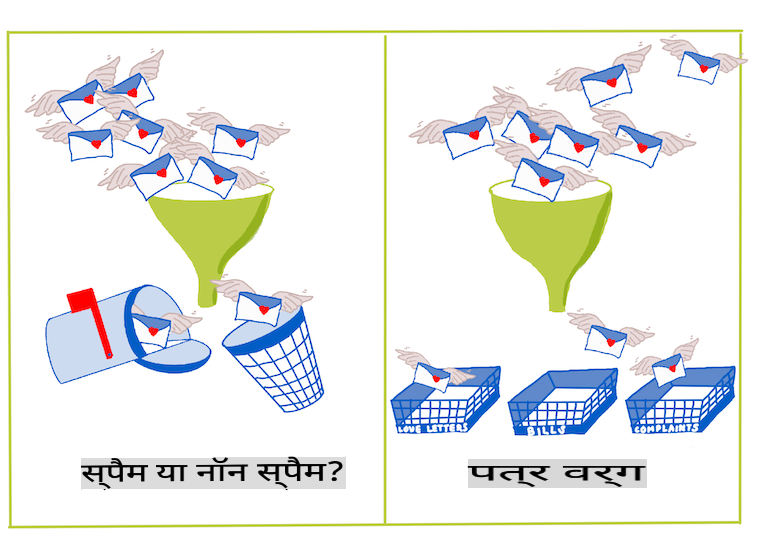
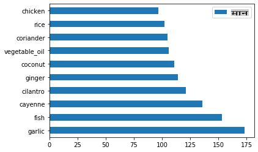
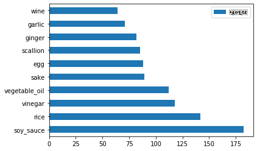
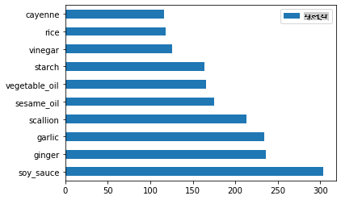
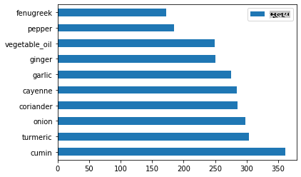
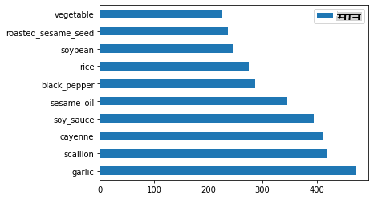

# वर्गीकरण का परिचय

इन चार पाठों में, आप क्लासिक मशीन लर्निंग के एक मौलिक फोकस - _वर्गीकरण_ का अन्वेषण करेंगे। हम एशिया और भारत के सभी शानदार व्यंजनों के बारे में एक डेटासेट का उपयोग करके विभिन्न वर्गीकरण एल्गोरिदम का उपयोग करेंगे। आशा है कि आप भूखे हैं!


> इन पाठों में पैन-एशियाई व्यंजनों का जश्न मनाएं! छवि [Jen Looper](https://twitter.com/jenlooper) द्वारा

वर्गीकरण [सुपरवाइज्ड लर्निंग](https://wikipedia.org/wiki/Supervised_learning) का एक रूप है जो प्रतिगमन तकनीकों के साथ बहुत कुछ समानता रखता है। यदि मशीन लर्निंग का सार यह है कि यह डेटा सेट्स का उपयोग करके चीजों के मान या नामों की भविष्यवाणी करता है, तो वर्गीकरण आमतौर पर दो समूहों में आता है: _बाइनरी वर्गीकरण_ और _मल्टीक्लास वर्गीकरण_।

[](https://youtu.be/eg8DJYwdMyg "वर्गीकरण का परिचय")

> 🎥 ऊपर की छवि पर क्लिक करें: MIT के John Guttag वर्गीकरण का परिचय देते हैं

याद रखें:

- **लिनियर रिग्रेशन** ने आपको चर के बीच संबंधों की भविष्यवाणी करने और यह सटीक भविष्यवाणी करने में मदद की कि एक नया डेटा पॉइंट उस रेखा के संबंध में कहाँ गिरेगा। तो, आप भविष्यवाणी कर सकते थे कि _सितंबर और दिसंबर में कद्दू की कीमत क्या होगी_।
- **लॉजिस्टिक रिग्रेशन** ने आपको "बाइनरी श्रेणियाँ" खोजने में मदद की: इस मूल्य बिंदु पर, _क्या यह कद्दू नारंगी है या नहीं_?

वर्गीकरण विभिन्न एल्गोरिदम का उपयोग करके यह निर्धारित करता है कि किसी डेटा पॉइंट का लेबल या वर्ग क्या हो सकता है। आइए इस व्यंजन डेटा के साथ काम करें और देखें कि क्या हम सामग्री के समूह का अवलोकन करके इसके मूल व्यंजन का निर्धारण कर सकते हैं।

## [प्री-लेक्चर क्विज़](https://gray-sand-07a10f403.1.azurestaticapps.net/quiz/19/)

> ### [यह पाठ R में भी उपलब्ध है!](../../../../4-Classification/1-Introduction/solution/R/lesson_10.html)

### परिचय

वर्गीकरण मशीन लर्निंग शोधकर्ता और डेटा वैज्ञानिक की मौलिक गतिविधियों में से एक है। एक बाइनरी मूल्य का बुनियादी वर्गीकरण ("क्या यह ईमेल स्पैम है या नहीं?") से लेकर जटिल छवि वर्गीकरण और कंप्यूटर दृष्टि का उपयोग करके विभाजन तक, डेटा को वर्गों में क्रमबद्ध करने और उससे प्रश्न पूछने में सक्षम होना हमेशा उपयोगी होता है।

इस प्रक्रिया को अधिक वैज्ञानिक तरीके से बताने के लिए, आपकी वर्गीकरण विधि एक भविष्यवाणी मॉडल बनाती है जो आपको इनपुट चर और आउटपुट चर के बीच संबंध को मैप करने में सक्षम बनाती है।



> वर्गीकरण एल्गोरिदम को संभालने के लिए बाइनरी बनाम मल्टीक्लास समस्याएं। इन्फोग्राफिक [Jen Looper](https://twitter.com/jenlooper) द्वारा

हमारे डेटा को साफ करने, उसे विज़ुअलाइज़ करने और हमारे एमएल कार्यों के लिए तैयार करने की प्रक्रिया शुरू करने से पहले, आइए जानें कि मशीन लर्निंग का उपयोग करके डेटा को वर्गीकृत करने के विभिन्न तरीके क्या हैं।

[सांख्यिकी](https://wikipedia.org/wiki/Statistical_classification) से व्युत्पन्न, क्लासिक मशीन लर्निंग का उपयोग करके वर्गीकरण सुविधाओं का उपयोग करता है, जैसे कि `smoker`, `weight`, और `age` यह निर्धारित करने के लिए कि _X बीमारी के विकास की संभावना_। एक सुपरवाइज्ड लर्निंग तकनीक के रूप में, जो आपने पहले किए गए रिग्रेशन अभ्यासों के समान है, आपका डेटा लेबल किया गया है और एमएल एल्गोरिदम उन लेबलों का उपयोग डेटासेट की श्रेणियों (या 'फीचर्स') को वर्गीकृत करने और उन्हें एक समूह या परिणाम में असाइन करने के लिए करते हैं।

✅ कल्पना करें कि आपके पास व्यंजनों के बारे में एक डेटासेट है। एक मल्टीक्लास मॉडल किस प्रकार के प्रश्नों का उत्तर दे सकता है? एक बाइनरी मॉडल किस प्रकार के प्रश्नों का उत्तर दे सकता है? यदि आप यह निर्धारित करना चाहते हैं कि कोई विशेष व्यंजन मेथी का उपयोग करता है या नहीं? या यदि आप यह देखना चाहते हैं कि, एक उपहार में स्टार ऐनीज़, आर्टिचोक, फूलगोभी, और हॉर्सरैडिश से भरी एक किराने की थैली प्राप्त करने पर, आप एक विशिष्ट भारतीय व्यंजन बना सकते हैं?

[](https://youtu.be/GuTeDbaNoEU "पागल रहस्यमय बास्केट")

> 🎥 ऊपर की छवि पर क्लिक करें। शो 'चॉप्ड' का पूरा आधार 'मिस्ट्री बास्केट' है जहां शेफ को कुछ यादृच्छिक सामग्री से कोई डिश बनानी होती है। निश्चित रूप से एक एमएल मॉडल ने मदद की होगी!

## हैलो 'क्लासिफायर'

इस व्यंजन डेटासेट से हम जो प्रश्न पूछना चाहते हैं वह वास्तव में एक **मल्टीक्लास प्रश्न** है, क्योंकि हमारे पास काम करने के लिए कई संभावित राष्ट्रीय व्यंजन हैं। सामग्री के एक बैच को देखते हुए, इन कई वर्गों में से कौन सा डेटा फिट होगा?

स्किट-लर्न विभिन्न प्रकार की समस्याओं को हल करने के लिए डेटा को वर्गीकृत करने के लिए कई अलग-अलग एल्गोरिदम प्रदान करता है। अगले दो पाठों में, आप इनमें से कई एल्गोरिदम के बारे में जानेंगे।

## अभ्यास - अपने डेटा को साफ और संतुलित करें

इस प्रोजेक्ट को शुरू करने से पहले पहला कार्य अपने डेटा को साफ और **संतुलित** करना है ताकि बेहतर परिणाम मिल सकें। इस फ़ोल्डर की रूट में खाली _notebook.ipynb_ फ़ाइल से प्रारंभ करें।

सबसे पहले जो इंस्टॉल करना है वह है [imblearn](https://imbalanced-learn.org/stable/)। यह एक स्किट-लर्न पैकेज है जो आपको डेटा को बेहतर संतुलित करने की अनुमति देगा (आप इस कार्य के बारे में एक मिनट में और जानेंगे)।

1. `imblearn` को इंस्टॉल करने के लिए, `pip install` चलाएँ, जैसे:

    ```python
    pip install imblearn
    ```

1. अपने डेटा को आयात करने और उसे विज़ुअलाइज़ करने के लिए आवश्यक पैकेज आयात करें, साथ ही `imblearn` से `SMOTE` भी आयात करें।

    ```python
    import pandas as pd
    import matplotlib.pyplot as plt
    import matplotlib as mpl
    import numpy as np
    from imblearn.over_sampling import SMOTE
    ```

    अब आप डेटा आयात करने के लिए तैयार हैं।

1. अगला कार्य डेटा आयात करना होगा:

    ```python
    df  = pd.read_csv('../data/cuisines.csv')
    ```

   `read_csv()` will read the content of the csv file _cusines.csv_ and place it in the variable `df` का उपयोग करना।

1. डेटा के आकार की जाँच करें:

    ```python
    df.head()
    ```

   पहली पाँच पंक्तियाँ इस प्रकार दिखती हैं:

    ```output
    |     | Unnamed: 0 | cuisine | almond | angelica | anise | anise_seed | apple | apple_brandy | apricot | armagnac | ... | whiskey | white_bread | white_wine | whole_grain_wheat_flour | wine | wood | yam | yeast | yogurt | zucchini |
    | --- | ---------- | ------- | ------ | -------- | ----- | ---------- | ----- | ------------ | ------- | -------- | --- | ------- | ----------- | ---------- | ----------------------- | ---- | ---- | --- | ----- | ------ | -------- |
    | 0   | 65         | indian  | 0      | 0        | 0     | 0          | 0     | 0            | 0       | 0        | ... | 0       | 0           | 0          | 0                       | 0    | 0    | 0   | 0     | 0      | 0        |
    | 1   | 66         | indian  | 1      | 0        | 0     | 0          | 0     | 0            | 0       | 0        | ... | 0       | 0           | 0          | 0                       | 0    | 0    | 0   | 0     | 0      | 0        |
    | 2   | 67         | indian  | 0      | 0        | 0     | 0          | 0     | 0            | 0       | 0        | ... | 0       | 0           | 0          | 0                       | 0    | 0    | 0   | 0     | 0      | 0        |
    | 3   | 68         | indian  | 0      | 0        | 0     | 0          | 0     | 0            | 0       | 0        | ... | 0       | 0           | 0          | 0                       | 0    | 0    | 0   | 0     | 0      | 0        |
    | 4   | 69         | indian  | 0      | 0        | 0     | 0          | 0     | 0            | 0       | 0        | ... | 0       | 0           | 0          | 0                       | 0    | 0    | 0   | 0     | 1      | 0        |
    ```

1. `info()` कॉल करके इस डेटा के बारे में जानकारी प्राप्त करें:

    ```python
    df.info()
    ```

    आपका आउटपुट इस प्रकार दिखता है:

    ```output
    <class 'pandas.core.frame.DataFrame'>
    RangeIndex: 2448 entries, 0 to 2447
    Columns: 385 entries, Unnamed: 0 to zucchini
    dtypes: int64(384), object(1)
    memory usage: 7.2+ MB
    ```

## अभ्यास - व्यंजनों के बारे में सीखना

अब काम अधिक दिलचस्प हो जाता है। आइए देखें कि डेटा का वितरण प्रत्येक व्यंजन के अनुसार कैसा है।

1. `barh()` कॉल करके डेटा को बार के रूप में प्लॉट करें:

    ```python
    df.cuisine.value_counts().plot.barh()
    ```

    

    व्यंजनों की संख्या सीमित है, लेकिन डेटा का वितरण असमान है। आप इसे ठीक कर सकते हैं! ऐसा करने से पहले, थोड़ा और अन्वेषण करें।

1. पता करें कि प्रत्येक व्यंजन के लिए कितना डेटा उपलब्ध है और इसे प्रिंट करें:

    ```python
    thai_df = df[(df.cuisine == "thai")]
    japanese_df = df[(df.cuisine == "japanese")]
    chinese_df = df[(df.cuisine == "chinese")]
    indian_df = df[(df.cuisine == "indian")]
    korean_df = df[(df.cuisine == "korean")]
    
    print(f'thai df: {thai_df.shape}')
    print(f'japanese df: {japanese_df.shape}')
    print(f'chinese df: {chinese_df.shape}')
    print(f'indian df: {indian_df.shape}')
    print(f'korean df: {korean_df.shape}')
    ```

    आउटपुट इस प्रकार दिखता है:

    ```output
    thai df: (289, 385)
    japanese df: (320, 385)
    chinese df: (442, 385)
    indian df: (598, 385)
    korean df: (799, 385)
    ```

## सामग्री की खोज

अब आप डेटा में गहराई से जा सकते हैं और जान सकते हैं कि प्रत्येक व्यंजन के लिए सामान्य सामग्री क्या हैं। आपको पुनरावर्ती डेटा को साफ करना चाहिए जो व्यंजनों के बीच भ्रम पैदा करता है, तो आइए इस समस्या के बारे में जानें।

1. एक फ़ंक्शन `create_ingredient()` बनाएं जो सामग्री का डेटा फ्रेम बनाए। यह फ़ंक्शन एक अनुपयोगी कॉलम को हटाकर और सामग्री को उनकी गिनती के अनुसार क्रमबद्ध करके शुरू होगा:

    ```python
    def create_ingredient_df(df):
        ingredient_df = df.T.drop(['cuisine','Unnamed: 0']).sum(axis=1).to_frame('value')
        ingredient_df = ingredient_df[(ingredient_df.T != 0).any()]
        ingredient_df = ingredient_df.sort_values(by='value', ascending=False,
        inplace=False)
        return ingredient_df
    ```

   अब आप इस फ़ंक्शन का उपयोग करके प्रत्येक व्यंजन के लिए शीर्ष दस सबसे लोकप्रिय सामग्री का अंदाजा लगा सकते हैं।

1. `create_ingredient()` and plot it calling `barh()` कॉल करें:

    ```python
    thai_ingredient_df = create_ingredient_df(thai_df)
    thai_ingredient_df.head(10).plot.barh()
    ```

    

1. जापानी डेटा के लिए भी ऐसा ही करें:

    ```python
    japanese_ingredient_df = create_ingredient_df(japanese_df)
    japanese_ingredient_df.head(10).plot.barh()
    ```

    

1. अब चीनी सामग्री के लिए:

    ```python
    chinese_ingredient_df = create_ingredient_df(chinese_df)
    chinese_ingredient_df.head(10).plot.barh()
    ```

    

1. भारतीय सामग्री को प्लॉट करें:

    ```python
    indian_ingredient_df = create_ingredient_df(indian_df)
    indian_ingredient_df.head(10).plot.barh()
    ```

    

1. अंत में, कोरियाई सामग्री को प्लॉट करें:

    ```python
    korean_ingredient_df = create_ingredient_df(korean_df)
    korean_ingredient_df.head(10).plot.barh()
    ```

    

1. अब, `drop()` कॉल करके उन सामान्य सामग्रियों को हटा दें जो विभिन्न व्यंजनों के बीच भ्रम पैदा करती हैं: 

   हर कोई चावल, लहसुन और अदरक से प्यार करता है!

    ```python
    feature_df= df.drop(['cuisine','Unnamed: 0','rice','garlic','ginger'], axis=1)
    labels_df = df.cuisine #.unique()
    feature_df.head()
    ```

## डेटासेट को संतुलित करें

अब जब आपने डेटा को साफ कर लिया है, तो इसे संतुलित करने के लिए [SMOTE](https://imbalanced-learn.org/dev/references/generated/imblearn.over_sampling.SMOTE.html) - "सिंथेटिक माइनॉरिटी ओवर-सैंपलिंग तकनीक" का उपयोग करें।

1. `fit_resample()` कॉल करें, यह रणनीति इंटरपोलेशन द्वारा नए नमूने उत्पन्न करती है।

    ```python
    oversample = SMOTE()
    transformed_feature_df, transformed_label_df = oversample.fit_resample(feature_df, labels_df)
    ```

    अपने डेटा को संतुलित करके, आपके पास इसे वर्गीकृत करने में बेहतर परिणाम होंगे। एक बाइनरी वर्गीकरण के बारे में सोचें। यदि आपके अधिकांश डेटा एक वर्ग के हैं, तो एक एमएल मॉडल उस वर्ग की अधिक बार भविष्यवाणी करेगा, सिर्फ इसलिए कि उसके लिए अधिक डेटा है। डेटा को संतुलित करना किसी भी विकृत डेटा को लेता है और इस असंतुलन को हटाने में मदद करता है।

1. अब आप सामग्री प्रति लेबल की संख्या की जाँच कर सकते हैं:

    ```python
    print(f'new label count: {transformed_label_df.value_counts()}')
    print(f'old label count: {df.cuisine.value_counts()}')
    ```

    आपका आउटपुट इस प्रकार दिखता है:

    ```output
    new label count: korean      799
    chinese     799
    indian      799
    japanese    799
    thai        799
    Name: cuisine, dtype: int64
    old label count: korean      799
    indian      598
    chinese     442
    japanese    320
    thai        289
    Name: cuisine, dtype: int64
    ```

    डेटा अच्छा और साफ है, संतुलित है, और बहुत स्वादिष्ट है! 

1. अंतिम चरण आपके संतुलित डेटा को, जिसमें लेबल और फीचर्स शामिल हैं, एक नए डेटा फ्रेम में सहेजना है जिसे एक फ़ाइल में निर्यात किया जा सकता है:

    ```python
    transformed_df = pd.concat([transformed_label_df,transformed_feature_df],axis=1, join='outer')
    ```

1. आप `transformed_df.head()` and `transformed_df.info()` का उपयोग करके डेटा पर एक और नज़र डाल सकते हैं। भविष्य के पाठों में उपयोग के लिए इस डेटा की एक प्रति सहेजें:

    ```python
    transformed_df.head()
    transformed_df.info()
    transformed_df.to_csv("../data/cleaned_cuisines.csv")
    ```

    यह ताज़ा CSV अब रूट डेटा फ़ोल्डर में पाई जा सकती है।

---

## 🚀चुनौती

इस पाठ्यक्रम में कई दिलचस्प डेटासेट शामिल हैं। `data` फ़ोल्डरों के माध्यम से खुदाई करें और देखें कि क्या कोई ऐसा डेटासेट है जो बाइनरी या मल्टी-क्लास वर्गीकरण के लिए उपयुक्त होगा? आप इस डेटासेट से कौन से प्रश्न पूछेंगे?

## [पोस्ट-लेक्चर क्विज़](https://gray-sand-07a10f403.1.azurestaticapps.net/quiz/20/)

## समीक्षा और आत्म-अध्ययन

SMOTE के API का अन्वेषण करें। इसे किस प्रकार के उपयोग मामलों के लिए सबसे अच्छा उपयोग किया जाता है? यह किन समस्याओं का समाधान करता है?

## असाइनमेंट

[वर्गीकरण विधियों का अन्वेषण करें](assignment.md)

**अस्वीकरण**:
इस दस्तावेज़ का अनुवाद मशीन-आधारित एआई अनुवाद सेवाओं का उपयोग करके किया गया है। जबकि हम सटीकता के लिए प्रयास करते हैं, कृपया ध्यान दें कि स्वचालित अनुवाद में त्रुटियाँ या अशुद्धियाँ हो सकती हैं। मूल दस्तावेज़ को उसकी मूल भाषा में प्रामाणिक स्रोत माना जाना चाहिए। महत्वपूर्ण जानकारी के लिए, पेशेवर मानव अनुवाद की सिफारिश की जाती है। इस अनुवाद के उपयोग से उत्पन्न किसी भी गलतफहमी या गलत व्याख्या के लिए हम उत्तरदायी नहीं हैं।