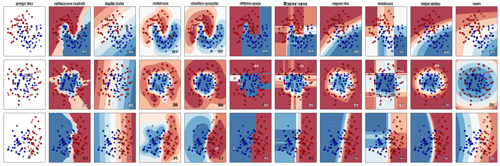
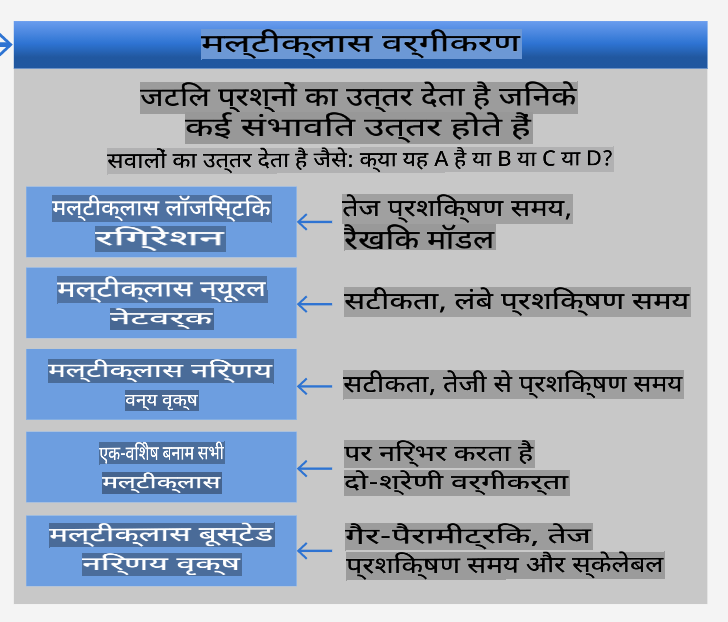
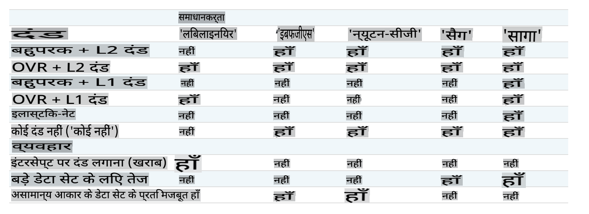

<!--
CO_OP_TRANSLATOR_METADATA:
{
  "original_hash": "9579f42e3ff5114c58379cc9e186a828",
  "translation_date": "2025-09-03T23:53:08+00:00",
  "source_file": "4-Classification/2-Classifiers-1/README.md",
  "language_code": "hi"
}
-->
# व्यंजन वर्गीकरणकर्ता 1

इस पाठ में, आप पिछले पाठ से सहेजे गए डेटा सेट का उपयोग करेंगे, जिसमें व्यंजनों से संबंधित संतुलित और साफ डेटा भरा हुआ है।

आप इस डेटा सेट का उपयोग विभिन्न वर्गीकरणकर्ताओं के साथ करेंगे ताकि _सामग्री के एक समूह के आधार पर किसी दिए गए राष्ट्रीय व्यंजन की भविष्यवाणी की जा सके_। ऐसा करते समय, आप यह भी जानेंगे कि वर्गीकरण कार्यों के लिए एल्गोरिदम का उपयोग कैसे किया जा सकता है।

## [पाठ-पूर्व प्रश्नोत्तरी](https://gray-sand-07a10f403.1.azurestaticapps.net/quiz/21/)
# तैयारी

यह मानते हुए कि आपने [पाठ 1](../1-Introduction/README.md) पूरा कर लिया है, सुनिश्चित करें कि इन चार पाठों के लिए रूट `/data` फ़ोल्डर में एक _cleaned_cuisines.csv_ फ़ाइल मौजूद है।

## अभ्यास - एक राष्ट्रीय व्यंजन की भविष्यवाणी करें

1. इस पाठ के _notebook.ipynb_ फ़ोल्डर में काम करते हुए, उस फ़ाइल को Pandas लाइब्रेरी के साथ आयात करें:

    ```python
    import pandas as pd
    cuisines_df = pd.read_csv("../data/cleaned_cuisines.csv")
    cuisines_df.head()
    ```

    डेटा इस प्रकार दिखता है:

|     | Unnamed: 0 | cuisine | almond | angelica | anise | anise_seed | apple | apple_brandy | apricot | armagnac | ... | whiskey | white_bread | white_wine | whole_grain_wheat_flour | wine | wood | yam | yeast | yogurt | zucchini |
| --- | ---------- | ------- | ------ | -------- | ----- | ---------- | ----- | ------------ | ------- | -------- | --- | ------- | ----------- | ---------- | ----------------------- | ---- | ---- | --- | ----- | ------ | -------- |
| 0   | 0          | indian  | 0      | 0        | 0     | 0          | 0     | 0            | 0       | 0        | ... | 0       | 0           | 0          | 0                       | 0    | 0    | 0   | 0     | 0      | 0        |
| 1   | 1          | indian  | 1      | 0        | 0     | 0          | 0     | 0            | 0       | 0        | ... | 0       | 0           | 0          | 0                       | 0    | 0    | 0   | 0     | 0      | 0        |
| 2   | 2          | indian  | 0      | 0        | 0     | 0          | 0     | 0            | 0       | 0        | ... | 0       | 0           | 0          | 0                       | 0    | 0    | 0   | 0     | 0      | 0        |
| 3   | 3          | indian  | 0      | 0        | 0     | 0          | 0     | 0            | 0       | 0        | ... | 0       | 0           | 0          | 0                       | 0    | 0    | 0   | 0     | 0      | 0        |
| 4   | 4          | indian  | 0      | 0        | 0     | 0          | 0     | 0            | 0       | 0        | ... | 0       | 0           | 0          | 0                       | 0    | 0    | 0   | 0     | 1      | 0        |
  

1. अब, और अधिक लाइब्रेरी आयात करें:

    ```python
    from sklearn.linear_model import LogisticRegression
    from sklearn.model_selection import train_test_split, cross_val_score
    from sklearn.metrics import accuracy_score,precision_score,confusion_matrix,classification_report, precision_recall_curve
    from sklearn.svm import SVC
    import numpy as np
    ```

1. X और y निर्देशांक को प्रशिक्षण के लिए दो डेटा फ्रेम में विभाजित करें। `cuisine` लेबल्स डेटा फ्रेम हो सकता है:

    ```python
    cuisines_label_df = cuisines_df['cuisine']
    cuisines_label_df.head()
    ```

    यह इस प्रकार दिखेगा:

    ```output
    0    indian
    1    indian
    2    indian
    3    indian
    4    indian
    Name: cuisine, dtype: object
    ```

1. `Unnamed: 0` कॉलम और `cuisine` कॉलम को हटा दें, `drop()` का उपयोग करते हुए। बाकी डेटा को ट्रेनिंग फीचर्स के रूप में सहेजें:

    ```python
    cuisines_feature_df = cuisines_df.drop(['Unnamed: 0', 'cuisine'], axis=1)
    cuisines_feature_df.head()
    ```

    आपके फीचर्स इस प्रकार दिखेंगे:

|      | almond | angelica | anise | anise_seed | apple | apple_brandy | apricot | armagnac | artemisia | artichoke |  ... | whiskey | white_bread | white_wine | whole_grain_wheat_flour | wine | wood |  yam | yeast | yogurt | zucchini |
| ---: | -----: | -------: | ----: | ---------: | ----: | -----------: | ------: | -------: | --------: | --------: | ---: | ------: | ----------: | ---------: | ----------------------: | ---: | ---: | ---: | ----: | -----: | -------: |
|    0 |      0 |        0 |     0 |          0 |     0 |            0 |       0 |        0 |         0 |         0 |  ... |       0 |           0 |          0 |                       0 |    0 |    0 |    0 |     0 |      0 |        0 | 0 |
|    1 |      1 |        0 |     0 |          0 |     0 |            0 |       0 |        0 |         0 |         0 |  ... |       0 |           0 |          0 |                       0 |    0 |    0 |    0 |     0 |      0 |        0 | 0 |
|    2 |      0 |        0 |     0 |          0 |     0 |            0 |       0 |        0 |         0 |         0 |  ... |       0 |           0 |          0 |                       0 |    0 |    0 |    0 |     0 |      0 |        0 | 0 |
|    3 |      0 |        0 |     0 |          0 |     0 |            0 |       0 |        0 |         0 |         0 |  ... |       0 |           0 |          0 |                       0 |    0 |    0 |    0 |     0 |      0 |        0 | 0 |
|    4 |      0 |        0 |     0 |          0 |     0 |            0 |       0 |        0 |         0 |         0 |  ... |       0 |           0 |          0 |                       0 |    0 |    0 |    0 |     0 |      1 |        0 | 0 |

अब आप अपने मॉडल को प्रशिक्षित करने के लिए तैयार हैं!

## अपने वर्गीकरणकर्ता का चयन करना

अब जब आपका डेटा साफ और प्रशिक्षण के लिए तैयार है, तो आपको यह तय करना होगा कि इस कार्य के लिए कौन सा एल्गोरिदम उपयोग करना है।

Scikit-learn वर्गीकरण को Supervised Learning के अंतर्गत वर्गीकृत करता है, और इस श्रेणी में आपको वर्गीकरण के कई तरीके मिलेंगे। [विविधता](https://scikit-learn.org/stable/supervised_learning.html) पहली नज़र में काफी भ्रमित कर सकती है। निम्नलिखित विधियों में सभी वर्गीकरण तकनीकें शामिल हैं:

- रैखिक मॉडल
- सपोर्ट वेक्टर मशीन
- स्टोकेस्टिक ग्रेडिएंट डिसेंट
- निकटतम पड़ोसी
- गॉसियन प्रक्रियाएं
- निर्णय वृक्ष
- समुच्चय विधियां (वोटिंग क्लासिफायर)
- मल्टीक्लास और मल्टीआउटपुट एल्गोरिदम (मल्टीक्लास और मल्टीलेबल वर्गीकरण, मल्टीक्लास-मल्टीआउटपुट वर्गीकरण)

> आप [न्यूरल नेटवर्क का उपयोग करके डेटा को वर्गीकृत](https://scikit-learn.org/stable/modules/neural_networks_supervised.html#classification) भी कर सकते हैं, लेकिन यह इस पाठ के दायरे से बाहर है।

### किस वर्गीकरणकर्ता का चयन करें?

तो, आपको कौन सा वर्गीकरणकर्ता चुनना चाहिए? अक्सर, कई विकल्पों को आजमाना और अच्छे परिणाम की तलाश करना एक तरीका होता है। Scikit-learn एक [साइड-बाय-साइड तुलना](https://scikit-learn.org/stable/auto_examples/classification/plot_classifier_comparison.html) प्रदान करता है, जिसमें KNeighbors, SVC, GaussianProcessClassifier, DecisionTreeClassifier, RandomForestClassifier, MLPClassifier, AdaBoostClassifier, GaussianNB और QuadraticDiscriminationAnalysis का एक बनाए गए डेटा सेट पर तुलना की जाती है, और परिणामों को विज़ुअलाइज़ किया जाता है:


> Scikit-learn के दस्तावेज़ों पर उत्पन्न प्लॉट

> AutoML इस समस्या को क्लाउड में इन तुलनाओं को चलाकर और आपके डेटा के लिए सबसे अच्छा एल्गोरिदम चुनने की अनुमति देकर आसानी से हल करता है। इसे [यहां आज़माएं](https://docs.microsoft.com/learn/modules/automate-model-selection-with-azure-automl/?WT.mc_id=academic-77952-leestott)

### एक बेहतर दृष्टिकोण

बेतरतीब ढंग से अनुमान लगाने से बेहतर तरीका यह है कि इस डाउनलोड करने योग्य [ML चीट शीट](https://docs.microsoft.com/azure/machine-learning/algorithm-cheat-sheet?WT.mc_id=academic-77952-leestott) के विचारों का पालन करें। यहां, हम पाते हैं कि हमारे मल्टीक्लास समस्या के लिए, हमारे पास कुछ विकल्प हैं:


> Microsoft के एल्गोरिदम चीट शीट का एक खंड, मल्टीक्लास वर्गीकरण विकल्पों का विवरण

✅ इस चीट शीट को डाउनलोड करें, इसे प्रिंट करें, और इसे अपनी दीवार पर लगाएं!

### तर्क

आइए देखें कि क्या हम अपनी बाधाओं को देखते हुए विभिन्न दृष्टिकोणों के माध्यम से तर्क कर सकते हैं:

- **न्यूरल नेटवर्क बहुत भारी हैं।** हमारे साफ लेकिन न्यूनतम डेटा सेट को देखते हुए, और यह तथ्य कि हम नोटबुक के माध्यम से स्थानीय रूप से प्रशिक्षण चला रहे हैं, न्यूरल नेटवर्क इस कार्य के लिए बहुत भारी हैं।
- **कोई दो-वर्ग वर्गीकरणकर्ता नहीं।** हम दो-वर्ग वर्गीकरणकर्ता का उपयोग नहीं करते हैं, इसलिए यह विकल्प बाहर हो जाता है।
- **निर्णय वृक्ष या लॉजिस्टिक रिग्रेशन काम कर सकते हैं।** एक निर्णय वृक्ष काम कर सकता है, या मल्टीक्लास डेटा के लिए लॉजिस्टिक रिग्रेशन।
- **मल्टीक्लास बूस्टेड निर्णय वृक्ष एक अलग समस्या हल करते हैं।** मल्टीक्लास बूस्टेड निर्णय वृक्ष गैर-पैरामीट्रिक कार्यों के लिए सबसे उपयुक्त हैं, जैसे रैंकिंग बनाने के लिए डिज़ाइन किए गए कार्य, इसलिए यह हमारे लिए उपयोगी नहीं है।

### Scikit-learn का उपयोग करना

हम अपने डेटा का विश्लेषण करने के लिए Scikit-learn का उपयोग करेंगे। हालांकि, Scikit-learn में लॉजिस्टिक रिग्रेशन का उपयोग करने के कई तरीके हैं। [पास करने के लिए पैरामीटर](https://scikit-learn.org/stable/modules/generated/sklearn.linear_model.LogisticRegression.html?highlight=logistic%20regressio#sklearn.linear_model.LogisticRegression) पर एक नज़र डालें।

मूल रूप से, दो महत्वपूर्ण पैरामीटर हैं - `multi_class` और `solver` - जिन्हें हमें निर्दिष्ट करना होगा, जब हम Scikit-learn से लॉजिस्टिक रिग्रेशन करने के लिए कहते हैं। `multi_class` मान एक निश्चित व्यवहार लागू करता है। सॉल्वर का मान यह निर्धारित करता है कि किस एल्गोरिदम का उपयोग करना है। सभी सॉल्वर को सभी `multi_class` मानों के साथ जोड़ा नहीं जा सकता।

दस्तावेज़ों के अनुसार, मल्टीक्लास मामले में, प्रशिक्षण एल्गोरिदम:

- **वन-वर्सेस-रेस्ट (OvR) योजना का उपयोग करता है**, यदि `multi_class` विकल्प `ovr` पर सेट है।
- **क्रॉस-एंट्रॉपी लॉस का उपयोग करता है**, यदि `multi_class` विकल्प `multinomial` पर सेट है। (वर्तमान में `multinomial` विकल्प केवल ‘lbfgs’, ‘sag’, ‘saga’ और ‘newton-cg’ सॉल्वर द्वारा समर्थित है।)

> 🎓 यहां 'योजना' 'ovr' (वन-वर्सेस-रेस्ट) या 'मल्टीनोमियल' हो सकती है। चूंकि लॉजिस्टिक रिग्रेशन वास्तव में बाइनरी वर्गीकरण का समर्थन करने के लिए डिज़ाइन किया गया है, ये योजनाएं इसे मल्टीक्लास वर्गीकरण कार्यों को बेहतर ढंग से संभालने की अनुमति देती हैं। [स्रोत](https://machinelearningmastery.com/one-vs-rest-and-one-vs-one-for-multi-class-classification/)

> 🎓 'सॉल्वर' को "अनुकूलन समस्या में उपयोग किए जाने वाले एल्गोरिदम" के रूप में परिभाषित किया गया है। [स्रोत](https://scikit-learn.org/stable/modules/generated/sklearn.linear_model.LogisticRegression.html?highlight=logistic%20regressio#sklearn.linear_model.LogisticRegression)

Scikit-learn इस तालिका की पेशकश करता है ताकि यह समझाया जा सके कि सॉल्वर विभिन्न प्रकार की डेटा संरचनाओं द्वारा प्रस्तुत विभिन्न चुनौतियों को कैसे संभालते हैं:



## अभ्यास - डेटा विभाजित करें

हम अपने पहले प्रशिक्षण परीक्षण के लिए लॉजिस्टिक रिग्रेशन पर ध्यान केंद्रित कर सकते हैं क्योंकि आपने हाल ही में पिछले पाठ में इसके बारे में सीखा था। 
अपने डेटा को `train_test_split()` को कॉल करके प्रशिक्षण और परीक्षण समूहों में विभाजित करें:

```python
X_train, X_test, y_train, y_test = train_test_split(cuisines_feature_df, cuisines_label_df, test_size=0.3)
```

## अभ्यास - लॉजिस्टिक रिग्रेशन लागू करें

चूंकि आप मल्टीक्लास मामले का उपयोग कर रहे हैं, आपको यह चुनना होगा कि कौन सी _योजना_ का उपयोग करना है और कौन सा _सॉल्वर_ सेट करना है। मल्टीक्लास सेटिंग और **liblinear** सॉल्वर के साथ LogisticRegression का उपयोग करके प्रशिक्षण लें।

1. एक लॉजिस्टिक रिग्रेशन बनाएं, जिसमें multi_class को `ovr` और सॉल्वर को `liblinear` पर सेट करें:

    ```python
    lr = LogisticRegression(multi_class='ovr',solver='liblinear')
    model = lr.fit(X_train, np.ravel(y_train))
    
    accuracy = model.score(X_test, y_test)
    print ("Accuracy is {}".format(accuracy))
    ```

    ✅ एक अलग सॉल्वर आज़माएं, जैसे `lbfgs`, जिसे अक्सर डिफ़ॉल्ट रूप से सेट किया जाता है।
ध्यान दें, जब आवश्यक हो तो अपने डेटा को समतल करने के लिए Pandas [`ravel`](https://pandas.pydata.org/pandas-docs/stable/reference/api/pandas.Series.ravel.html) फ़ंक्शन का उपयोग करें।
सटीकता **80%** से अधिक है!

1. आप इस मॉडल को एक डेटा की पंक्ति (#50) का परीक्षण करके देख सकते हैं:

    ```python
    print(f'ingredients: {X_test.iloc[50][X_test.iloc[50]!=0].keys()}')
    print(f'cuisine: {y_test.iloc[50]}')
    ```

    परिणाम प्रिंट होता है:

   ```output
   ingredients: Index(['cilantro', 'onion', 'pea', 'potato', 'tomato', 'vegetable_oil'], dtype='object')
   cuisine: indian
   ```

   ✅ एक अलग पंक्ति संख्या आज़माएं और परिणाम जांचें

1. गहराई में जाकर, आप इस भविष्यवाणी की सटीकता की जांच कर सकते हैं:

    ```python
    test= X_test.iloc[50].values.reshape(-1, 1).T
    proba = model.predict_proba(test)
    classes = model.classes_
    resultdf = pd.DataFrame(data=proba, columns=classes)
    
    topPrediction = resultdf.T.sort_values(by=[0], ascending = [False])
    topPrediction.head()
    ```

    परिणाम प्रिंट होता है - भारतीय व्यंजन इसका सबसे अच्छा अनुमान है, और संभावना भी अच्छी है:

    |          |        0 |
    | -------: | -------: |
    |   indian | 0.715851 |
    |  chinese | 0.229475 |
    | japanese | 0.029763 |
    |   korean | 0.017277 |
    |     thai | 0.007634 |

    ✅ क्या आप समझा सकते हैं कि मॉडल को क्यों पूरा यकीन है कि यह एक भारतीय व्यंजन है?

1. और अधिक जानकारी प्राप्त करने के लिए, एक वर्गीकरण रिपोर्ट प्रिंट करें, जैसा आपने रिग्रेशन पाठों में किया था:

    ```python
    y_pred = model.predict(X_test)
    print(classification_report(y_test,y_pred))
    ```

    |              | precision | recall | f1-score | support |
    | ------------ | --------- | ------ | -------- | ------- |
    | chinese      | 0.73      | 0.71   | 0.72     | 229     |
    | indian       | 0.91      | 0.93   | 0.92     | 254     |
    | japanese     | 0.70      | 0.75   | 0.72     | 220     |
    | korean       | 0.86      | 0.76   | 0.81     | 242     |
    | thai         | 0.79      | 0.85   | 0.82     | 254     |
    | accuracy     | 0.80      | 1199   |          |         |
    | macro avg    | 0.80      | 0.80   | 0.80     | 1199    |
    | weighted avg | 0.80      | 0.80   | 0.80     | 1199    |

## 🚀चुनौती

इस पाठ में, आपने अपने साफ किए गए डेटा का उपयोग करके एक मशीन लर्निंग मॉडल बनाया, जो सामग्री की एक श्रृंखला के आधार पर एक राष्ट्रीय व्यंजन की भविष्यवाणी कर सकता है। स्किकिट-लर्न द्वारा डेटा वर्गीकृत करने के लिए प्रदान किए गए कई विकल्पों को पढ़ने के लिए कुछ समय निकालें। 'सॉल्वर' की अवधारणा में गहराई से जाएं ताकि यह समझ सकें कि पर्दे के पीछे क्या होता है।

## [पाठ के बाद की क्विज़](https://gray-sand-07a10f403.1.azurestaticapps.net/quiz/22/)

## समीक्षा और स्व-अध्ययन

लॉजिस्टिक रिग्रेशन के पीछे गणित को [इस पाठ](https://people.eecs.berkeley.edu/~russell/classes/cs194/f11/lectures/CS194%20Fall%202011%20Lecture%2006.pdf) में और अधिक गहराई से समझें।  
## असाइनमेंट 

[सॉल्वर का अध्ययन करें](assignment.md)

---

**अस्वीकरण**:  
यह दस्तावेज़ AI अनुवाद सेवा [Co-op Translator](https://github.com/Azure/co-op-translator) का उपयोग करके अनुवादित किया गया है। जबकि हम सटीकता सुनिश्चित करने का प्रयास करते हैं, कृपया ध्यान दें कि स्वचालित अनुवाद में त्रुटियां या अशुद्धियां हो सकती हैं। मूल भाषा में उपलब्ध मूल दस्तावेज़ को प्रामाणिक स्रोत माना जाना चाहिए। महत्वपूर्ण जानकारी के लिए, पेशेवर मानव अनुवाद की सिफारिश की जाती है। इस अनुवाद के उपयोग से उत्पन्न किसी भी गलतफहमी या गलत व्याख्या के लिए हम जिम्मेदार नहीं हैं।