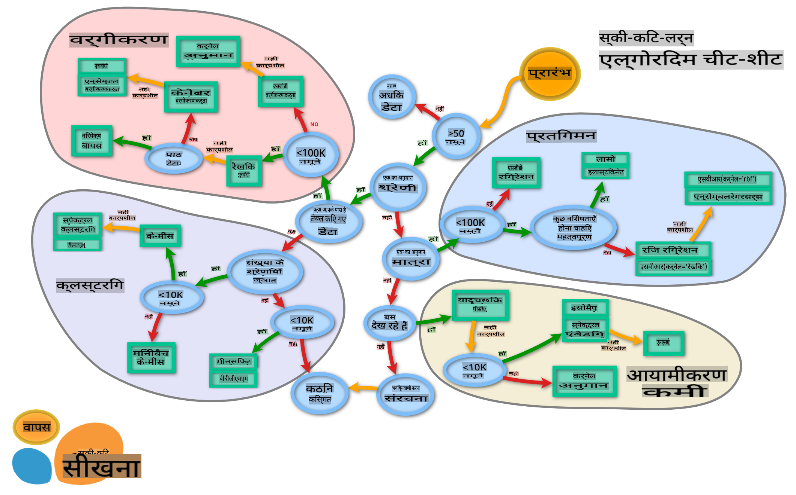

# क्यूज़ीन वर्गीकरणकर्ता 2

इस दूसरे वर्गीकरण पाठ में, आप संख्यात्मक डेटा को वर्गीकृत करने के और भी तरीके जानेंगे। आप यह भी सीखेंगे कि एक वर्गीकरणकर्ता को दूसरे पर चुनने के परिणाम क्या हो सकते हैं।

## [पाठ-पूर्व क्विज़](https://gray-sand-07a10f403.1.azurestaticapps.net/quiz/23/)

### पूर्वापेक्षा

हम मानते हैं कि आपने पिछले पाठों को पूरा कर लिया है और आपके पास आपके `data` फ़ोल्डर में _cleaned_cuisines.csv_ नामक एक साफ़ किया हुआ डेटासेट है, जो इस 4-पाठ वाले फ़ोल्डर की जड़ में है।

### तैयारी

हमने आपके _notebook.ipynb_ फ़ाइल को साफ़ किए गए डेटासेट के साथ लोड कर दिया है और इसे X और y डेटा फ्रेम में विभाजित कर दिया है, जो मॉडल निर्माण प्रक्रिया के लिए तैयार हैं।

## एक वर्गीकरण मानचित्र

पहले, आपने माइक्रोसॉफ्ट के चीट शीट का उपयोग करके डेटा को वर्गीकृत करने के विभिन्न विकल्पों के बारे में सीखा था। Scikit-learn एक समान, लेकिन अधिक विस्तृत चीट शीट प्रदान करता है जो आपके वर्गीकरणकर्ताओं (वर्गीकरणकर्ताओं के लिए एक और शब्द) को और अधिक संकीर्ण करने में मदद कर सकता है:


> टिप: [इस मानचित्र को ऑनलाइन देखें](https://scikit-learn.org/stable/tutorial/machine_learning_map/) और दस्तावेज़ पढ़ने के लिए रास्ते पर क्लिक करें।

### योजना

यह मानचित्र आपके डेटा की स्पष्ट समझ होने के बाद बहुत सहायक होता है, क्योंकि आप इसके रास्तों पर 'चल' सकते हैं और निर्णय ले सकते हैं:

- हमारे पास >50 नमूने हैं
- हम एक श्रेणी की भविष्यवाणी करना चाहते हैं
- हमारे पास लेबल किया हुआ डेटा है
- हमारे पास 100K से कम नमूने हैं
- ✨ हम एक Linear SVC चुन सकते हैं
- यदि यह काम नहीं करता है, क्योंकि हमारे पास संख्यात्मक डेटा है
    - हम ✨ KNeighbors Classifier आज़मा सकते हैं
      - यदि यह काम नहीं करता है, तो ✨ SVC और ✨ Ensemble Classifiers आज़माएं

यह अनुसरण करने के लिए एक बहुत ही सहायक मार्ग है।

## अभ्यास - डेटा विभाजित करें

इस मार्ग का अनुसरण करते हुए, हमें कुछ पुस्तकालयों को आयात करके शुरू करना चाहिए।

1. आवश्यक पुस्तकालयों को आयात करें:

    ```python
    from sklearn.neighbors import KNeighborsClassifier
    from sklearn.linear_model import LogisticRegression
    from sklearn.svm import SVC
    from sklearn.ensemble import RandomForestClassifier, AdaBoostClassifier
    from sklearn.model_selection import train_test_split, cross_val_score
    from sklearn.metrics import accuracy_score,precision_score,confusion_matrix,classification_report, precision_recall_curve
    import numpy as np
    ```

1. अपने प्रशिक्षण और परीक्षण डेटा को विभाजित करें:

    ```python
    X_train, X_test, y_train, y_test = train_test_split(cuisines_feature_df, cuisines_label_df, test_size=0.3)
    ```

## Linear SVC वर्गीकरणकर्ता

सपोर्ट-वेेक्टर क्लस्टरिंग (SVC) सपोर्ट-वेेक्टर मशीनों के परिवार का एक हिस्सा है (इनके बारे में नीचे और जानें)। इस विधि में, आप लेबल्स को क्लस्टर करने के लिए एक 'कर्नेल' चुन सकते हैं। 'C' पैरामीटर 'रेगुलराइजेशन' को संदर्भित करता है जो पैरामीटरों के प्रभाव को नियंत्रित करता है। कर्नेल [कई](https://scikit-learn.org/stable/modules/generated/sklearn.svm.SVC.html#sklearn.svm.SVC) में से एक हो सकता है; यहाँ हम इसे 'linear' पर सेट करते हैं ताकि हम linear SVC का लाभ उठा सकें। Probability डिफ़ॉल्ट रूप से 'false' है; यहाँ हम इसे 'true' पर सेट करते हैं ताकि संभाव्यता अनुमान प्राप्त कर सकें। हम रैंडम स्टेट को '0' पर सेट करते हैं ताकि डेटा को शफल किया जा सके और संभाव्यताओं को प्राप्त किया जा सके।

### अभ्यास - एक linear SVC लागू करें

क्लासिफ़ायरों की एक array बनाकर शुरू करें। हम परीक्षण करते समय इस array में क्रमशः जोड़ते जाएंगे।

1. एक Linear SVC के साथ शुरू करें:

    ```python
    C = 10
    # Create different classifiers.
    classifiers = {
        'Linear SVC': SVC(kernel='linear', C=C, probability=True,random_state=0)
    }
    ```

2. अपने मॉडल को Linear SVC का उपयोग करके प्रशिक्षित करें और एक रिपोर्ट प्रिंट करें:

    ```python
    n_classifiers = len(classifiers)
    
    for index, (name, classifier) in enumerate(classifiers.items()):
        classifier.fit(X_train, np.ravel(y_train))
    
        y_pred = classifier.predict(X_test)
        accuracy = accuracy_score(y_test, y_pred)
        print("Accuracy (train) for %s: %0.1f%% " % (name, accuracy * 100))
        print(classification_report(y_test,y_pred))
    ```

    परिणाम काफी अच्छा है:

    ```output
    Accuracy (train) for Linear SVC: 78.6% 
                  precision    recall  f1-score   support
    
         chinese       0.71      0.67      0.69       242
          indian       0.88      0.86      0.87       234
        japanese       0.79      0.74      0.76       254
          korean       0.85      0.81      0.83       242
            thai       0.71      0.86      0.78       227
    
        accuracy                           0.79      1199
       macro avg       0.79      0.79      0.79      1199
    weighted avg       0.79      0.79      0.79      1199
    ```

## K-Neighbors वर्गीकरणकर्ता

K-Neighbors "पड़ोसियों" परिवार का हिस्सा है, जिसका उपयोग पर्यवेक्षित और बिना पर्यवेक्षण दोनों प्रकार के शिक्षण के लिए किया जा सकता है। इस विधि में, एक पूर्वनिर्धारित संख्या के बिंदु बनाए जाते हैं और डेटा को इन बिंदुओं के चारों ओर एकत्र किया जाता है ताकि डेटा के लिए सामान्यीकृत लेबल की भविष्यवाणी की जा सके।

### अभ्यास - K-Neighbors वर्गीकरणकर्ता लागू करें

पिछला वर्गीकरणकर्ता अच्छा था और डेटा के साथ अच्छी तरह से काम किया, लेकिन शायद हम बेहतर सटीकता प्राप्त कर सकते हैं। एक K-Neighbors वर्गीकरणकर्ता आज़माएं।

1. अपने क्लासिफ़ायर array में एक लाइन जोड़ें (Linear SVC आइटम के बाद एक कॉमा जोड़ें):

    ```python
    'KNN classifier': KNeighborsClassifier(C),
    ```

    परिणाम थोड़ा खराब है:

    ```output
    Accuracy (train) for KNN classifier: 73.8% 
                  precision    recall  f1-score   support
    
         chinese       0.64      0.67      0.66       242
          indian       0.86      0.78      0.82       234
        japanese       0.66      0.83      0.74       254
          korean       0.94      0.58      0.72       242
            thai       0.71      0.82      0.76       227
    
        accuracy                           0.74      1199
       macro avg       0.76      0.74      0.74      1199
    weighted avg       0.76      0.74      0.74      1199
    ```

    ✅ [K-Neighbors](https://scikit-learn.org/stable/modules/neighbors.html#neighbors) के बारे में जानें

## सपोर्ट वेक्टर क्लासिफायर

सपोर्ट-वेेक्टर क्लासिफायर [सपोर्ट-वेेक्टर मशीन](https://wikipedia.org/wiki/Support-vector_machine) परिवार का हिस्सा हैं, जिनका उपयोग वर्गीकरण और प्रतिगमन कार्यों के लिए किया जाता है। SVMs "प्रशिक्षण उदाहरणों को स्थान में बिंदुओं पर मैप करते हैं" ताकि दो श्रेणियों के बीच की दूरी को अधिकतम किया जा सके। इसके बाद का डेटा इस स्थान में मैप किया जाता है ताकि उनकी श्रेणी की भविष्यवाणी की जा सके।

### अभ्यास - सपोर्ट वेक्टर क्लासिफायर लागू करें

आइए सपोर्ट वेक्टर क्लासिफायर के साथ थोड़ी बेहतर सटीकता प्राप्त करने का प्रयास करें।

1. K-Neighbors आइटम के बाद एक कॉमा जोड़ें, और फिर इस लाइन को जोड़ें:

    ```python
    'SVC': SVC(),
    ```

    परिणाम काफी अच्छा है!

    ```output
    Accuracy (train) for SVC: 83.2% 
                  precision    recall  f1-score   support
    
         chinese       0.79      0.74      0.76       242
          indian       0.88      0.90      0.89       234
        japanese       0.87      0.81      0.84       254
          korean       0.91      0.82      0.86       242
            thai       0.74      0.90      0.81       227
    
        accuracy                           0.83      1199
       macro avg       0.84      0.83      0.83      1199
    weighted avg       0.84      0.83      0.83      1199
    ```

    ✅ [सपोर्ट-वेेक्टर](https://scikit-learn.org/stable/modules/svm.html#svm) के बारे में जानें

## एन्सेम्बल क्लासिफायर

आइए इस रास्ते के अंत तक जाएं, भले ही पिछला परीक्षण काफी अच्छा था। आइए कुछ 'एन्सेम्बल क्लासिफायर', विशेष रूप से रैंडम फॉरेस्ट और AdaBoost आज़माएं:

```python
  'RFST': RandomForestClassifier(n_estimators=100),
  'ADA': AdaBoostClassifier(n_estimators=100)
```

परिणाम बहुत अच्छा है, विशेष रूप से रैंडम फॉरेस्ट के लिए:

```output
Accuracy (train) for RFST: 84.5% 
              precision    recall  f1-score   support

     chinese       0.80      0.77      0.78       242
      indian       0.89      0.92      0.90       234
    japanese       0.86      0.84      0.85       254
      korean       0.88      0.83      0.85       242
        thai       0.80      0.87      0.83       227

    accuracy                           0.84      1199
   macro avg       0.85      0.85      0.84      1199
weighted avg       0.85      0.84      0.84      1199

Accuracy (train) for ADA: 72.4% 
              precision    recall  f1-score   support

     chinese       0.64      0.49      0.56       242
      indian       0.91      0.83      0.87       234
    japanese       0.68      0.69      0.69       254
      korean       0.73      0.79      0.76       242
        thai       0.67      0.83      0.74       227

    accuracy                           0.72      1199
   macro avg       0.73      0.73      0.72      1199
weighted avg       0.73      0.72      0.72      1199
```

✅ [एन्सेम्बल क्लासिफायर](https://scikit-learn.org/stable/modules/ensemble.html) के बारे में जानें

इस मशीन लर्निंग विधि में "कई बेस एस्टिमेटर्स की भविष्यवाणियों को मिलाया जाता है" ताकि मॉडल की गुणवत्ता में सुधार हो सके। हमारे उदाहरण में, हमने रैंडम ट्री और AdaBoost का उपयोग किया।

- [रैंडम फॉरेस्ट](https://scikit-learn.org/stable/modules/ensemble.html#forest), एक एवरेजिंग विधि, एक 'फॉरेस्ट' बनाता है जिसमें 'डिसीजन ट्री' होते हैं, जो ओवरफिटिंग से बचने के लिए रैंडमनेस से भरे होते हैं। n_estimators पैरामीटर पेड़ों की संख्या पर सेट होता है।

- [AdaBoost](https://scikit-learn.org/stable/modules/generated/sklearn.ensemble.AdaBoostClassifier.html) एक क्लासिफायर को डेटासेट पर फिट करता है और फिर उसी डेटासेट पर उस क्लासिफायर की प्रतियों को फिट करता है। यह गलत तरीके से वर्गीकृत आइटमों के वज़न पर ध्यान केंद्रित करता है और अगले क्लासिफायर के लिए फिट को समायोजित करता है ताकि उसे सही किया जा सके।

---

## 🚀चुनौती

इनमें से प्रत्येक तकनीक में बहुत सारे पैरामीटर होते हैं जिन्हें आप समायोजित कर सकते हैं। प्रत्येक के डिफ़ॉल्ट पैरामीटरों के बारे में शोध करें और सोचें कि इन पैरामीटरों को समायोजित करने से मॉडल की गुणवत्ता के लिए क्या मतलब होगा।

## [पाठ-उत्तर क्विज़](https://gray-sand-07a10f403.1.azurestaticapps.net/quiz/24/)

## समीक्षा और स्व-अध्ययन

इन पाठों में बहुत सारा शब्दजाल है, इसलिए एक मिनट लें और [इस सूची](https://docs.microsoft.com/dotnet/machine-learning/resources/glossary?WT.mc_id=academic-77952-leestott) को देखें, जिसमें उपयोगी शब्दावली है!

## असाइनमेंट

[पैरामीटर खेल](assignment.md)

**अस्वीकरण**:
यह दस्तावेज़ मशीन-आधारित एआई अनुवाद सेवाओं का उपयोग करके अनुवादित किया गया है। जबकि हम सटीकता के लिए प्रयास करते हैं, कृपया ध्यान दें कि स्वचालित अनुवाद में त्रुटियाँ या अशुद्धियाँ हो सकती हैं। मूल भाषा में मूल दस्तावेज़ को आधिकारिक स्रोत माना जाना चाहिए। महत्वपूर्ण जानकारी के लिए, पेशेवर मानव अनुवाद की सिफारिश की जाती है। इस अनुवाद के उपयोग से उत्पन्न किसी भी गलतफहमी या गलत व्याख्या के लिए हम उत्तरदायी नहीं हैं।