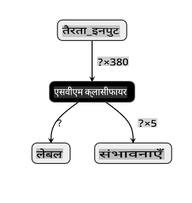
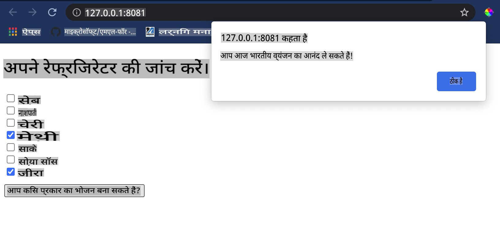

# एक व्यंजन सिफारिश वेब ऐप बनाएं

इस पाठ में, आप कुछ तकनीकों का उपयोग करके एक वर्गीकरण मॉडल बनाएंगे, जिन्हें आपने पिछले पाठों में सीखा है और इस श्रृंखला में उपयोग किए गए स्वादिष्ट व्यंजन डेटासेट के साथ। इसके अतिरिक्त, आप एक छोटा वेब ऐप बनाएंगे जो एक सहेजे गए मॉडल का उपयोग करेगा, Onnx के वेब रनटाइम का लाभ उठाते हुए।

मशीन लर्निंग का सबसे उपयोगी व्यावहारिक उपयोग सिफारिश प्रणाली बनाना है, और आप आज उस दिशा में पहला कदम उठा सकते हैं!

[](https://youtu.be/17wdM9AHMfg "Applied ML")

> 🎥 ऊपर की छवि पर क्लिक करें एक वीडियो के लिए: Jen Looper वर्गीकृत व्यंजन डेटा का उपयोग करके एक वेब ऐप बनाती हैं

## [पाठ पूर्व क्विज़](https://gray-sand-07a10f403.1.azurestaticapps.net/quiz/25/)

इस पाठ में आप सीखेंगे:

- एक मॉडल कैसे बनाएं और इसे एक Onnx मॉडल के रूप में सहेजें
- Netron का उपयोग करके मॉडल का निरीक्षण कैसे करें
- अपने मॉडल को एक वेब ऐप में अनुमान के लिए कैसे उपयोग करें

## अपना मॉडल बनाएं

लागू एमएल सिस्टम का निर्माण इन तकनीकों का उपयोग करके आपके व्यावसायिक सिस्टम के लिए महत्वपूर्ण है। आप Onnx का उपयोग करके अपने वेब एप्लिकेशन में मॉडल का उपयोग कर सकते हैं (और इस प्रकार आवश्यकता पड़ने पर उन्हें ऑफ़लाइन संदर्भ में उपयोग कर सकते हैं)।

एक [पिछले पाठ](../../3-Web-App/1-Web-App/README.md) में, आपने यूएफओ देखे जाने के बारे में एक प्रतिगमन मॉडल बनाया, इसे "पिकल्ड" किया, और इसे एक Flask ऐप में उपयोग किया। जबकि यह आर्किटेक्चर जानने के लिए बहुत उपयोगी है, यह एक फुल-स्टैक पायथन ऐप है, और आपकी आवश्यकताओं में एक जावास्क्रिप्ट एप्लिकेशन का उपयोग शामिल हो सकता है।

इस पाठ में, आप अनुमान के लिए एक बुनियादी जावास्क्रिप्ट-आधारित सिस्टम बना सकते हैं। हालांकि, सबसे पहले, आपको एक मॉडल को प्रशिक्षित करना होगा और इसे Onnx के साथ उपयोग के लिए परिवर्तित करना होगा।

## अभ्यास - वर्गीकरण मॉडल को प्रशिक्षित करें

सबसे पहले, उस साफ किए गए व्यंजन डेटासेट का उपयोग करके एक वर्गीकरण मॉडल को प्रशिक्षित करें जिसे हमने उपयोग किया था।

1. उपयोगी पुस्तकालयों को आयात करके प्रारंभ करें:

    ```python
    !pip install skl2onnx
    import pandas as pd 
    ```

    आपको अपने Scikit-learn मॉडल को Onnx प्रारूप में बदलने में मदद करने के लिए '[skl2onnx](https://onnx.ai/sklearn-onnx/)' की आवश्यकता है।

1. फिर, अपने डेटा के साथ उसी तरह काम करें जैसे आपने पिछले पाठों में किया था, `read_csv()` का उपयोग करके एक CSV फ़ाइल पढ़कर:

    ```python
    data = pd.read_csv('../data/cleaned_cuisines.csv')
    data.head()
    ```

1. पहले दो अनावश्यक स्तंभों को हटा दें और शेष डेटा को 'X' के रूप में सहेजें:

    ```python
    X = data.iloc[:,2:]
    X.head()
    ```

1. लेबल को 'y' के रूप में सहेजें:

    ```python
    y = data[['cuisine']]
    y.head()
    
    ```

### प्रशिक्षण दिनचर्या शुरू करें

हम 'SVC' पुस्तकालय का उपयोग करेंगे जिसमें अच्छी सटीकता है।

1. Scikit-learn से उपयुक्त पुस्तकालयों को आयात करें:

    ```python
    from sklearn.model_selection import train_test_split
    from sklearn.svm import SVC
    from sklearn.model_selection import cross_val_score
    from sklearn.metrics import accuracy_score,precision_score,confusion_matrix,classification_report
    ```

1. प्रशिक्षण और परीक्षण सेट अलग करें:

    ```python
    X_train, X_test, y_train, y_test = train_test_split(X,y,test_size=0.3)
    ```

1. पिछले पाठ में जैसा आपने किया था, एक SVC वर्गीकरण मॉडल बनाएं:

    ```python
    model = SVC(kernel='linear', C=10, probability=True,random_state=0)
    model.fit(X_train,y_train.values.ravel())
    ```

1. अब, अपने मॉडल का परीक्षण करें, `predict()` को कॉल करें:

    ```python
    y_pred = model.predict(X_test)
    ```

1. मॉडल की गुणवत्ता की जांच करने के लिए एक वर्गीकरण रिपोर्ट प्रिंट करें:

    ```python
    print(classification_report(y_test,y_pred))
    ```

    जैसा कि हमने पहले देखा था, सटीकता अच्छी है:

    ```output
                    precision    recall  f1-score   support
    
         chinese       0.72      0.69      0.70       257
          indian       0.91      0.87      0.89       243
        japanese       0.79      0.77      0.78       239
          korean       0.83      0.79      0.81       236
            thai       0.72      0.84      0.78       224
    
        accuracy                           0.79      1199
       macro avg       0.79      0.79      0.79      1199
    weighted avg       0.79      0.79      0.79      1199
    ```

### अपने मॉडल को Onnx में बदलें

सुनिश्चित करें कि उचित टेंसर संख्या के साथ रूपांतरण करें। इस डेटासेट में 380 अवयव सूचीबद्ध हैं, इसलिए आपको `FloatTensorType` में उस संख्या को नोट करना होगा:

1. 380 की टेंसर संख्या का उपयोग करके परिवर्तित करें।

    ```python
    from skl2onnx import convert_sklearn
    from skl2onnx.common.data_types import FloatTensorType
    
    initial_type = [('float_input', FloatTensorType([None, 380]))]
    options = {id(model): {'nocl': True, 'zipmap': False}}
    ```

1. onx बनाएं और इसे **model.onnx** के रूप में फ़ाइल के रूप में सहेजें:

    ```python
    onx = convert_sklearn(model, initial_types=initial_type, options=options)
    with open("./model.onnx", "wb") as f:
        f.write(onx.SerializeToString())
    ```

    > नोट, आप अपने रूपांतरण स्क्रिप्ट में [विकल्प](https://onnx.ai/sklearn-onnx/parameterized.html) पास कर सकते हैं। इस मामले में, हमने 'nocl' को True और 'zipmap' को False पास किया। चूंकि यह एक वर्गीकरण मॉडल है, आपके पास ZipMap को हटाने का विकल्प है जो शब्दकोशों की एक सूची उत्पन्न करता है (आवश्यक नहीं)। `nocl` refers to class information being included in the model. Reduce your model's size by setting `nocl` to 'True'. 

Running the entire notebook will now build an Onnx model and save it to this folder.

## View your model

Onnx models are not very visible in Visual Studio code, but there's a very good free software that many researchers use to visualize the model to ensure that it is properly built. Download [Netron](https://github.com/lutzroeder/Netron) and  open your model.onnx file. You can see your simple model visualized, with its 380 inputs and classifier listed:



Netron is a helpful tool to view your models.

Now you are ready to use this neat model in a web app. Let's build an app that will come in handy when you look in your refrigerator and try to figure out which combination of your leftover ingredients you can use to cook a given cuisine, as determined by your model.

## Build a recommender web application

You can use your model directly in a web app. This architecture also allows you to run it locally and even offline if needed. Start by creating an `index.html` file in the same folder where you stored your `model.onnx` फ़ाइल।

1. इस फ़ाइल _index.html_ में, निम्नलिखित मार्कअप जोड़ें:

    ```html
    <!DOCTYPE html>
    <html>
        <header>
            <title>Cuisine Matcher</title>
        </header>
        <body>
            ...
        </body>
    </html>
    ```

1. अब, `body` टैग के भीतर काम करते हुए, कुछ अवयवों को दर्शाने वाले चेकबॉक्स की एक सूची दिखाने के लिए थोड़ा मार्कअप जोड़ें:

    ```html
    <h1>Check your refrigerator. What can you create?</h1>
            <div id="wrapper">
                <div class="boxCont">
                    <input type="checkbox" value="4" class="checkbox">
                    <label>apple</label>
                </div>
            
                <div class="boxCont">
                    <input type="checkbox" value="247" class="checkbox">
                    <label>pear</label>
                </div>
            
                <div class="boxCont">
                    <input type="checkbox" value="77" class="checkbox">
                    <label>cherry</label>
                </div>
    
                <div class="boxCont">
                    <input type="checkbox" value="126" class="checkbox">
                    <label>fenugreek</label>
                </div>
    
                <div class="boxCont">
                    <input type="checkbox" value="302" class="checkbox">
                    <label>sake</label>
                </div>
    
                <div class="boxCont">
                    <input type="checkbox" value="327" class="checkbox">
                    <label>soy sauce</label>
                </div>
    
                <div class="boxCont">
                    <input type="checkbox" value="112" class="checkbox">
                    <label>cumin</label>
                </div>
            </div>
            <div style="padding-top:10px">
                <button onClick="startInference()">What kind of cuisine can you make?</button>
            </div> 
    ```

    ध्यान दें कि प्रत्येक चेकबॉक्स को एक मान दिया गया है। यह उस इंडेक्स को दर्शाता है जहां अवयव डेटासेट के अनुसार पाए जाते हैं। उदाहरण के लिए, इस वर्णमाला सूची में, Apple पांचवें स्तंभ पर है, इसलिए इसका मान '4' है क्योंकि हम 0 से गिनती शुरू करते हैं। आप [अवयव स्प्रेडशीट](../../../../4-Classification/data/ingredient_indexes.csv) को परामर्श कर सकते हैं ताकि किसी दिए गए अवयव का इंडेक्स खोजा जा सके।

    _index.html_ फ़ाइल में अपने काम को जारी रखते हुए, एक स्क्रिप्ट ब्लॉक जोड़ें जहां अंतिम समापन `</div>` के बाद मॉडल को कॉल किया जाता है।

1. सबसे पहले, [Onnx Runtime](https://www.onnxruntime.ai/) को आयात करें:

    ```html
    <script src="https://cdn.jsdelivr.net/npm/onnxruntime-web@1.9.0/dist/ort.min.js"></script> 
    ```

    > Onnx Runtime का उपयोग आपके Onnx मॉडलों को हार्डवेयर प्लेटफार्मों की एक विस्तृत श्रृंखला में चलाने के लिए किया जाता है, जिसमें अनुकूलन और उपयोग के लिए एक एपीआई शामिल है।

1. एक बार Runtime सेट हो जाने के बाद, आप इसे कॉल कर सकते हैं:

    ```html
    <script>
        const ingredients = Array(380).fill(0);
        
        const checks = [...document.querySelectorAll('.checkbox')];
        
        checks.forEach(check => {
            check.addEventListener('change', function() {
                // toggle the state of the ingredient
                // based on the checkbox's value (1 or 0)
                ingredients[check.value] = check.checked ? 1 : 0;
            });
        });

        function testCheckboxes() {
            // validate if at least one checkbox is checked
            return checks.some(check => check.checked);
        }

        async function startInference() {

            let atLeastOneChecked = testCheckboxes()

            if (!atLeastOneChecked) {
                alert('Please select at least one ingredient.');
                return;
            }
            try {
                // create a new session and load the model.
                
                const session = await ort.InferenceSession.create('./model.onnx');

                const input = new ort.Tensor(new Float32Array(ingredients), [1, 380]);
                const feeds = { float_input: input };

                // feed inputs and run
                const results = await session.run(feeds);

                // read from results
                alert('You can enjoy ' + results.label.data[0] + ' cuisine today!')

            } catch (e) {
                console.log(`failed to inference ONNX model`);
                console.error(e);
            }
        }
               
    </script>
    ```

इस कोड में, कई चीजें हो रही हैं:

1. आपने 380 संभावित मानों (1 या 0) का एक सरणी बनाया है जिसे सेट किया जाएगा और मॉडल को अनुमान के लिए भेजा जाएगा, इस पर निर्भर करता है कि कोई अवयव चेकबॉक्स चेक किया गया है या नहीं।
2. आपने चेकबॉक्स की एक सरणी बनाई और यह निर्धारित करने का एक तरीका कि क्या वे `init` function that is called when the application starts. When a checkbox is checked, the `ingredients` array is altered to reflect the chosen ingredient.
3. You created a `testCheckboxes` function that checks whether any checkbox was checked.
4. You use `startInference` function when the button is pressed and, if any checkbox is checked, you start inference.
5. The inference routine includes:
   1. Setting up an asynchronous load of the model
   2. Creating a Tensor structure to send to the model
   3. Creating 'feeds' that reflects the `float_input` input that you created when training your model (you can use Netron to verify that name)
   4. Sending these 'feeds' to the model and waiting for a response

## Test your application

Open a terminal session in Visual Studio Code in the folder where your index.html file resides. Ensure that you have [http-server](https://www.npmjs.com/package/http-server) installed globally, and type `http-server` पर संकेत पर चेक किए गए थे। एक लोकलहोस्ट खुल जाना चाहिए और आप अपने वेब ऐप को देख सकते हैं। विभिन्न अवयवों के आधार पर कौन सा व्यंजन अनुशंसित है, इसकी जांच करें:



बधाई हो, आपने कुछ फ़ील्ड के साथ एक 'सिफारिश' वेब ऐप बनाया है। इस सिस्टम को बनाने के लिए कुछ समय निकालें!
## 🚀चुनौती

आपका वेब ऐप बहुत न्यूनतम है, इसलिए [ingredient_indexes](../../../../4-Classification/data/ingredient_indexes.csv) डेटा से अवयवों और उनके इंडेक्स का उपयोग करके इसे बनाना जारी रखें। कौन से स्वाद संयोजन एक दिए गए राष्ट्रीय व्यंजन को बनाने के लिए काम करते हैं?

## [पाठ के बाद क्विज़](https://gray-sand-07a10f403.1.azurestaticapps.net/quiz/26/)

## समीक्षा और स्व-अध्ययन

जबकि इस पाठ ने खाद्य अवयवों के लिए एक सिफारिश प्रणाली बनाने की उपयोगिता को छुआ, एमएल अनुप्रयोगों का यह क्षेत्र उदाहरणों में बहुत समृद्ध है। पढ़ें कि इन प्रणालियों को कैसे बनाया जाता है:

- https://www.sciencedirect.com/topics/computer-science/recommendation-engine
- https://www.technologyreview.com/2014/08/25/171547/the-ultimate-challenge-for-recommendation-engines/
- https://www.technologyreview.com/2015/03/23/168831/everything-is-a-recommendation/

## असाइनमेंट 

[एक नई सिफारिशकर्ता बनाएं](assignment.md)

**अस्वीकरण**:
यह दस्तावेज़ मशीन-आधारित एआई अनुवाद सेवाओं का उपयोग करके अनुवादित किया गया है। जबकि हम सटीकता के लिए प्रयास करते हैं, कृपया अवगत रहें कि स्वचालित अनुवाद में त्रुटियां या अशुद्धियां हो सकती हैं। अपनी मूल भाषा में मूल दस्तावेज़ को आधिकारिक स्रोत माना जाना चाहिए। महत्वपूर्ण जानकारी के लिए, पेशेवर मानव अनुवाद की सिफारिश की जाती है। इस अनुवाद के उपयोग से उत्पन्न किसी भी गलतफहमी या गलत व्याख्या के लिए हम उत्तरदायी नहीं हैं।