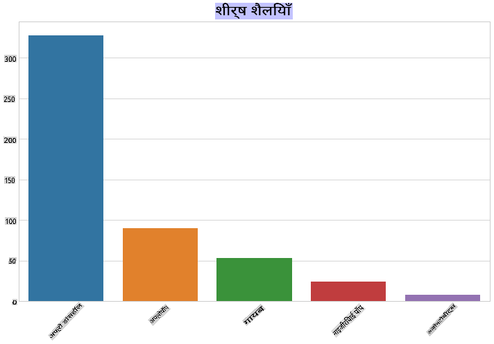
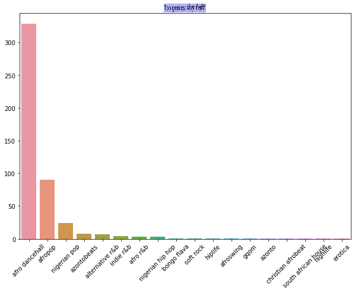
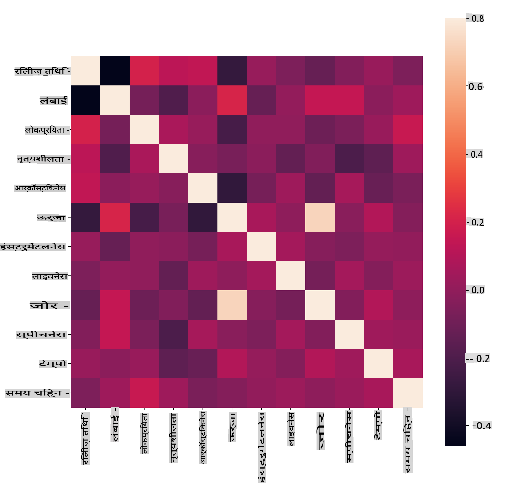
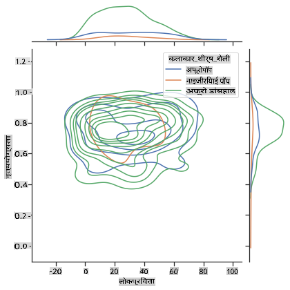
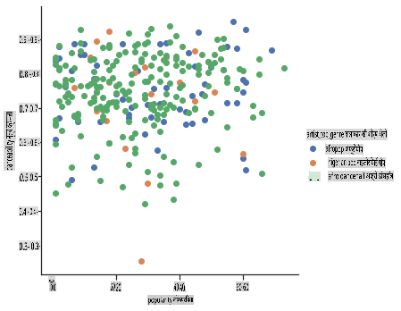

<!--
CO_OP_TRANSLATOR_METADATA:
{
  "original_hash": "0ab69b161efd7a41d325ee28b29415d7",
  "translation_date": "2025-09-03T23:07:54+00:00",
  "source_file": "5-Clustering/1-Visualize/README.md",
  "language_code": "hi"
}
-->
# क्लस्टरिंग का परिचय

क्लस्टरिंग [अनसुपरवाइज्ड लर्निंग](https://wikipedia.org/wiki/Unsupervised_learning) का एक प्रकार है, जो मानता है कि डेटा सेट लेबल रहित है या इसके इनपुट्स को पहले से परिभाषित आउटपुट्स के साथ नहीं जोड़ा गया है। यह विभिन्न एल्गोरिदम का उपयोग करके लेबल रहित डेटा को छांटता है और डेटा में पहचाने गए पैटर्न के अनुसार समूह प्रदान करता है।

[](https://youtu.be/ty2advRiWJM "PSquare द्वारा No One Like You")

> 🎥 ऊपर दी गई छवि पर क्लिक करें और वीडियो देखें। जब आप क्लस्टरिंग के साथ मशीन लर्निंग का अध्ययन कर रहे हों, तो कुछ नाइजीरियाई डांस हॉल ट्रैक्स का आनंद लें - यह PSquare का 2014 का एक उच्च रेटेड गाना है।

## [प्री-लेक्चर क्विज़](https://gray-sand-07a10f403.1.azurestaticapps.net/quiz/27/)

### परिचय

[क्लस्टरिंग](https://link.springer.com/referenceworkentry/10.1007%2F978-0-387-30164-8_124) डेटा एक्सप्लोरेशन के लिए बहुत उपयोगी है। आइए देखें कि क्या यह नाइजीरियाई दर्शकों के संगीत उपभोग के तरीके में रुझान और पैटर्न खोजने में मदद कर सकता है।

✅ एक मिनट लें और क्लस्टरिंग के उपयोगों के बारे में सोचें। असल जिंदगी में, क्लस्टरिंग तब होती है जब आपके पास कपड़ों का ढेर होता है और आपको अपने परिवार के सदस्यों के कपड़े छांटने होते हैं 🧦👕👖🩲। डेटा साइंस में, क्लस्टरिंग तब होती है जब उपयोगकर्ता की प्राथमिकताओं का विश्लेषण करने या किसी लेबल रहित डेटा सेट की विशेषताओं को निर्धारित करने की कोशिश की जाती है। क्लस्टरिंग, एक तरह से, अराजकता को समझने में मदद करती है, जैसे मोजे की दराज।

[](https://youtu.be/esmzYhuFnds "क्लस्टरिंग का परिचय")

> 🎥 ऊपर दी गई छवि पर क्लिक करें और वीडियो देखें: MIT के John Guttag क्लस्टरिंग का परिचय देते हैं।

पेशेवर सेटिंग में, क्लस्टरिंग का उपयोग बाजार विभाजन जैसे चीजों को निर्धारित करने के लिए किया जा सकता है, जैसे कि कौन सी आयु वर्ग कौन सी वस्तुएं खरीदती हैं। एक अन्य उपयोग अनियमितता का पता लगाना हो सकता है, जैसे कि क्रेडिट कार्ड लेनदेन के डेटा सेट से धोखाधड़ी का पता लगाना। या आप मेडिकल स्कैन के बैच में ट्यूमर का निर्धारण करने के लिए क्लस्टरिंग का उपयोग कर सकते हैं।

✅ एक मिनट लें और सोचें कि आपने 'वास्तविक दुनिया' में, बैंकिंग, ई-कॉमर्स, या व्यवसाय सेटिंग में क्लस्टरिंग का सामना कैसे किया होगा।

> 🎓 दिलचस्प बात यह है कि क्लस्टर विश्लेषण की शुरुआत 1930 के दशक में मानवशास्त्र और मनोविज्ञान के क्षेत्रों में हुई थी। क्या आप कल्पना कर सकते हैं कि इसका उपयोग कैसे किया गया होगा?

इसके अलावा, आप इसे खोज परिणामों को समूहित करने के लिए उपयोग कर सकते हैं - उदाहरण के लिए, खरीदारी लिंक, छवियां, या समीक्षाएं। क्लस्टरिंग तब उपयोगी होती है जब आपके पास एक बड़ा डेटा सेट होता है जिसे आप कम करना चाहते हैं और जिस पर आप अधिक गहन विश्लेषण करना चाहते हैं, इसलिए इस तकनीक का उपयोग अन्य मॉडलों के निर्माण से पहले डेटा के बारे में जानने के लिए किया जा सकता है।

✅ एक बार जब आपका डेटा क्लस्टर्स में व्यवस्थित हो जाता है, तो आप इसे एक क्लस्टर आईडी असाइन करते हैं, और यह तकनीक डेटा सेट की गोपनीयता बनाए रखने में उपयोगी हो सकती है; आप इसके बजाय डेटा पॉइंट को इसके क्लस्टर आईडी द्वारा संदर्भित कर सकते हैं, बजाय इसके कि अधिक खुलासा करने वाले पहचान योग्य डेटा द्वारा। क्या आप अन्य कारणों के बारे में सोच सकते हैं कि आप क्लस्टर को पहचानने के लिए क्लस्टर आईडी का उपयोग क्यों करेंगे?

क्लस्टरिंग तकनीकों की अपनी समझ को इस [लर्न मॉड्यूल](https://docs.microsoft.com/learn/modules/train-evaluate-cluster-models?WT.mc_id=academic-77952-leestott) में गहरा करें।

## क्लस्टरिंग के साथ शुरुआत

[Scikit-learn](https://scikit-learn.org/stable/modules/clustering.html) क्लस्टरिंग करने के लिए कई विधियां प्रदान करता है। आप किस प्रकार का चयन करते हैं, यह आपके उपयोग के मामले पर निर्भर करेगा। दस्तावेज़ के अनुसार, प्रत्येक विधि के विभिन्न लाभ हैं। यहां Scikit-learn द्वारा समर्थित विधियों और उनके उपयुक्त उपयोग मामलों की एक सरल तालिका दी गई है:

| विधि का नाम                  | उपयोग का मामला                                                        |
| :--------------------------- | :-------------------------------------------------------------------- |
| K-Means                      | सामान्य उद्देश्य, इंडक्टिव                                           |
| Affinity propagation         | कई, असमान क्लस्टर्स, इंडक्टिव                                       |
| Mean-shift                   | कई, असमान क्लस्टर्स, इंडक्टिव                                       |
| Spectral clustering          | कुछ, समान क्लस्टर्स, ट्रांसडक्टिव                                   |
| Ward hierarchical clustering | कई, बाधित क्लस्टर्स, ट्रांसडक्टिव                                   |
| Agglomerative clustering     | कई, बाधित, गैर-यूक्लिडियन दूरी, ट्रांसडक्टिव                       |
| DBSCAN                       | गैर-फ्लैट ज्यामिति, असमान क्लस्टर्स, ट्रांसडक्टिव                   |
| OPTICS                       | गैर-फ्लैट ज्यामिति, असमान क्लस्टर्स, परिवर्तनीय घनत्व, ट्रांसडक्टिव |
| Gaussian mixtures            | फ्लैट ज्यामिति, इंडक्टिव                                            |
| BIRCH                        | बड़े डेटा सेट के साथ आउटलायर्स, इंडक्टिव                           |

> 🎓 हम क्लस्टर्स कैसे बनाते हैं, इसका बहुत कुछ इस बात से लेना-देना है कि हम डेटा पॉइंट्स को समूहों में कैसे इकट्ठा करते हैं। आइए कुछ शब्दावली को समझें:
>
> 🎓 ['ट्रांसडक्टिव' बनाम 'इंडक्टिव'](https://wikipedia.org/wiki/Transduction_(machine_learning))
> 
> ट्रांसडक्टिव इनफेरेंस उन देखे गए प्रशिक्षण मामलों से प्राप्त होता है जो विशिष्ट परीक्षण मामलों को मैप करते हैं। इंडक्टिव इनफेरेंस उन प्रशिक्षण मामलों से प्राप्त होता है जो सामान्य नियमों को मैप करते हैं और केवल तभी परीक्षण मामलों पर लागू होते हैं।
> 
> उदाहरण: कल्पना करें कि आपके पास एक डेटा सेट है जो केवल आंशिक रूप से लेबल किया गया है। कुछ चीजें 'रिकॉर्ड्स' हैं, कुछ 'सीडी' हैं, और कुछ खाली हैं। आपका काम खाली चीजों के लिए लेबल प्रदान करना है। यदि आप इंडक्टिव दृष्टिकोण चुनते हैं, तो आप 'रिकॉर्ड्स' और 'सीडी' की तलाश में एक मॉडल को प्रशिक्षित करेंगे और उन लेबल्स को अपने लेबल रहित डेटा पर लागू करेंगे। यह दृष्टिकोण उन चीजों को वर्गीकृत करने में कठिनाई करेगा जो वास्तव में 'कैसेट्स' हैं। दूसरी ओर, ट्रांसडक्टिव दृष्टिकोण इस अज्ञात डेटा को अधिक प्रभावी ढंग से संभालता है क्योंकि यह समान वस्तुओं को एक साथ समूहित करने और फिर समूह को एक लेबल लागू करने का काम करता है। इस मामले में, क्लस्टर्स 'गोल संगीत चीजें' और 'चौकोर संगीत चीजें' को दर्शा सकते हैं।
> 
> 🎓 ['गैर-फ्लैट' बनाम 'फ्लैट' ज्यामिति](https://datascience.stackexchange.com/questions/52260/terminology-flat-geometry-in-the-context-of-clustering)
> 
> गणितीय शब्दावली से लिया गया, गैर-फ्लैट बनाम फ्लैट ज्यामिति डेटा पॉइंट्स के बीच की दूरी को 'फ्लैट' ([यूक्लिडियन](https://wikipedia.org/wiki/Euclidean_geometry)) या 'गैर-फ्लैट' (गैर-यूक्लिडियन) ज्यामितीय तरीकों से मापने को संदर्भित करता है।
>
>'फ्लैट' इस संदर्भ में यूक्लिडियन ज्यामिति (जिसके कुछ हिस्से 'प्लेन' ज्यामिति के रूप में पढ़ाए जाते हैं) को संदर्भित करता है, और गैर-फ्लैट गैर-यूक्लिडियन ज्यामिति को संदर्भित करता है। मशीन लर्निंग के साथ ज्यामिति का क्या संबंध है? खैर, गणित में जड़ें होने वाले दो क्षेत्रों के रूप में, पॉइंट्स के बीच की दूरी को मापने का एक सामान्य तरीका होना चाहिए, और इसे डेटा की प्रकृति के आधार पर 'फ्लैट' या 'गैर-फ्लैट' तरीके से किया जा सकता है। [यूक्लिडियन दूरी](https://wikipedia.org/wiki/Euclidean_distance) को दो पॉइंट्स के बीच एक रेखा खंड की लंबाई के रूप में मापा जाता है। [गैर-यूक्लिडियन दूरी](https://wikipedia.org/wiki/Non-Euclidean_geometry) को एक वक्र के साथ मापा जाता है। यदि आपका डेटा, विज़ुअलाइज़ किया गया, ऐसा लगता है कि यह एक प्लेन पर मौजूद नहीं है, तो आपको इसे संभालने के लिए एक विशेष एल्गोरिदम का उपयोग करने की आवश्यकता हो सकती है।
>

> इन्फोग्राफिक [Dasani Madipalli](https://twitter.com/dasani_decoded) द्वारा
> 
> 🎓 ['दूरी'](https://web.stanford.edu/class/cs345a/slides/12-clustering.pdf)
> 
> क्लस्टर्स को उनकी दूरी मैट्रिक्स द्वारा परिभाषित किया जाता है, जैसे कि पॉइंट्स के बीच की दूरी। इस दूरी को कुछ तरीकों से मापा जा सकता है। यूक्लिडियन क्लस्टर्स पॉइंट वैल्यूज़ के औसत द्वारा परिभाषित होते हैं, और इनमें एक 'सेंट्रॉइड' या केंद्र बिंदु होता है। दूरी को उस सेंट्रॉइड से दूरी के रूप में मापा जाता है। गैर-यूक्लिडियन दूरी 'क्लस्ट्रॉइड्स' को संदर्भित करती है, जो अन्य पॉइंट्स के सबसे करीब बिंदु है। क्लस्ट्रॉइड्स को विभिन्न तरीकों से परिभाषित किया जा सकता है।
> 
> 🎓 ['बाधित'](https://wikipedia.org/wiki/Constrained_clustering)
> 
> [बाधित क्लस्टरिंग](https://web.cs.ucdavis.edu/~davidson/Publications/ICDMTutorial.pdf) इस अनसुपरवाइज्ड विधि में 'सेमी-सुपरवाइज्ड' लर्निंग को पेश करती है। पॉइंट्स के बीच के संबंधों को 'cannot link' या 'must-link' के रूप में चिह्नित किया जाता है ताकि डेटा सेट पर कुछ नियम लागू किए जा सकें।
>
>उदाहरण: यदि एक एल्गोरिदम को लेबल रहित या सेमी-लेबल्ड डेटा के बैच पर स्वतंत्र रूप से छोड़ दिया जाता है, तो यह जो क्लस्टर्स उत्पन्न करता है, वे खराब गुणवत्ता के हो सकते हैं। ऊपर दिए गए उदाहरण में, क्लस्टर्स 'गोल संगीत चीजें', 'चौकोर संगीत चीजें', 'त्रिकोणीय चीजें' और 'कुकीज़' को समूहित कर सकते हैं। यदि कुछ बाधाएं दी जाती हैं, या पालन करने के लिए नियम ("आइटम प्लास्टिक से बना होना चाहिए", "आइटम को संगीत उत्पन्न करने में सक्षम होना चाहिए") तो यह एल्गोरिदम को बेहतर विकल्प बनाने में मदद कर सकता है।
> 
> 🎓 'घनत्व'
> 
> डेटा जो 'शोरयुक्त' है, उसे 'घना' माना जाता है। इसके प्रत्येक क्लस्टर्स में पॉइंट्स के बीच की दूरी, जांच करने पर, अधिक या कम घनी, या 'भीड़भाड़' वाली साबित हो सकती है, और इस डेटा को उपयुक्त क्लस्टरिंग विधि के साथ विश्लेषण करने की आवश्यकता होती है। [यह लेख](https://www.kdnuggets.com/2020/02/understanding-density-based-clustering.html) दिखाता है कि शोरयुक्त डेटा सेट के असमान क्लस्टर घनत्व का पता लगाने के लिए K-Means क्लस्टरिंग बनाम HDBSCAN एल्गोरिदम का उपयोग कैसे किया जाता है।

## क्लस्टरिंग एल्गोरिदम

100 से अधिक क्लस्टरिंग एल्गोरिदम हैं, और उनका उपयोग डेटा की प्रकृति पर निर्भर करता है। आइए कुछ प्रमुख एल्गोरिदम पर चर्चा करें:

- **हायरार्किकल क्लस्टरिंग**। यदि किसी वस्तु को उसके निकटवर्ती वस्तु की निकटता के आधार पर वर्गीकृत किया जाता है, बजाय इसके कि वह दूर की वस्तु से हो, तो क्लस्टर्स उनके सदस्यों की दूरी के आधार पर बनते हैं। Scikit-learn का एग्लोमरेटिव क्लस्टरिंग हायरार्किकल है।

   
   > इन्फोग्राफिक [Dasani Madipalli](https://twitter.com/dasani_decoded) द्वारा

- **सेंट्रॉइड क्लस्टरिंग**। यह लोकप्रिय एल्गोरिदम 'k', या बनाने के लिए क्लस्टर्स की संख्या चुनने की आवश्यकता करता है, जिसके बाद एल्गोरिदम क्लस्टर के केंद्र बिंदु को निर्धारित करता है और उस बिंदु के चारों ओर डेटा इकट्ठा करता है। [K-means क्लस्टरिंग](https://wikipedia.org/wiki/K-means_clustering) सेंट्रॉइड क्लस्टरिंग का एक लोकप्रिय संस्करण है। केंद्र निकटतम औसत द्वारा निर्धारित किया जाता है, इसलिए इसका नाम। क्लस्टर से वर्ग दूरी को न्यूनतम किया जाता है।

   
   > इन्फोग्राफिक [Dasani Madipalli](https://twitter.com/dasani_decoded) द्वारा

- **डिस्ट्रिब्यूशन-आधारित क्लस्टरिंग**। सांख्यिकीय मॉडलिंग पर आधारित, डिस्ट्रिब्यूशन-आधारित क्लस्टरिंग का केंद्र यह निर्धारित करना है कि डेटा पॉइंट के क्लस्टर में होने की संभावना कितनी है, और इसे उसी के अनुसार असाइन करना। Gaussian मिश्रण विधियां इस प्रकार से संबंधित हैं।

- **डेंसिटी-आधारित क्लस्टरिंग**। डेटा पॉइंट्स को उनके घनत्व, या उनके एक-दूसरे के चारों ओर समूह बनाने के आधार पर क्लस्टर्स में असाइन किया जाता है। समूह से दूर डेटा पॉइंट्स को आउटलायर्स या शोर माना जाता है। DBSCAN, Mean-shift और OPTICS इस प्रकार की क्लस्टरिंग से संबंधित हैं।

- **ग्रिड-आधारित क्लस्टरिंग**। बहु-आयामी डेटा सेट के लिए, एक ग्रिड बनाया जाता है और डेटा को ग्रिड की कोशिकाओं के बीच विभाजित किया जाता है, जिससे क्लस्टर्स बनते हैं।

## अभ्यास - अपने डेटा को क्लस्टर करें

क्लस्टरिंग एक तकनीक के रूप में उचित विज़ुअलाइज़ेशन से बहुत सहायता प्राप्त करती है, तो आइए अपने संगीत डेटा को विज़ुअलाइज़ करके शुरुआत करें। यह अभ्यास हमें यह तय करने में मदद करेगा कि इस डेटा की प्रकृति के लिए क्लस्टरिंग की कौन सी विधि सबसे प्रभावी रूप से उपयोग की जाए।

1. इस फ़ोल्डर में [_notebook.ipynb_](https://github.com/microsoft/ML-For-Beginners/blob/main/5-Clustering/1-Visualize/notebook.ipynb) फ़ाइल खोलें।

1. डेटा विज़ुअलाइज़ेशन के लिए `Seaborn` पैकेज आयात करें।

    ```python
    !pip install seaborn
    ```

1. [_nigerian-songs.csv_](https://github.com/microsoft/ML-For-Beginners/blob/main/5-Clustering/data/nigerian-songs.csv) से गाने का डेटा जोड़ें। गानों के बारे में कुछ डेटा के साथ एक डेटा फ्रेम लोड करें। लाइब्रेरीज़ आयात करके और डेटा को डंप करके इस डेटा का पता लगाने के लिए तैयार हो जाएं:

    ```python
    import matplotlib.pyplot as plt
    import pandas as pd
    
    df = pd.read_csv("../data/nigerian-songs.csv")
    df.head()
    ```

    डेटा की पहली कुछ पंक्तियों की जांच करें:

    |     | नाम                     | एल्बम                        | कलाकार              | कलाकार का शीर्ष शैली | रिलीज़ तिथि | लंबाई | लोकप्रियता | नृत्य क्षमता | ध्वनिकता | ऊर्जा | वाद्य क्षमता | जीवंतता | तेज़ी | भाषण क्षमता | टेम्पो   | समय हस्ताक्षर |
    | --- | ------------------------ | ---------------------------- | ------------------- | -------------------- | ------------ | ------ | ---------- | ------------ | -------- | ------ | -------------- | -------- | ------ | ----------- | ------- | -------------- |
    | 0   | Sparky                   | Mandy & The Jungle           | Cruel Santino       | वैकल्पिक r&b        | 2019         | 144000 | 48         | 0.666        | 0.851    | 0.42   | 0.534          | 0.11     | -6.699 | 0.0829      | 133.015 | 5              |
    | 1   | shuga rush               | EVERYTHING YOU HEARD IS TRUE | Odunsi (The Engine) | अफ्रोपॉप            | 2020         | 89488  | 30         | 0.71         | 0.0822   | 
| 2   | LITT!                    | LITT!                        | AYLØ                | इंडी आरएंडबी     | 2018         | 207758 | 40         | 0.836        | 0.272        | 0.564  | 0.000537         | 0.11     | -7.127   | 0.0424      | 130.005 | 4              |
| 3   | Confident / Feeling Cool | Enjoy Your Life              | Lady Donli          | नाइजीरियन पॉप     | 2019         | 175135 | 14         | 0.894        | 0.798        | 0.611  | 0.000187         | 0.0964   | -4.961   | 0.113       | 111.087 | 4              |
| 4   | wanted you               | rare.                        | Odunsi (The Engine) | अफ्रोपॉप          | 2018         | 152049 | 25         | 0.702        | 0.116        | 0.833  | 0.91             | 0.348    | -6.044   | 0.0447      | 105.115 | 4              |

1. डेटा फ्रेम की जानकारी प्राप्त करें, `info()` कॉल करके:

    ```python
    df.info()
    ```

   आउटपुट इस प्रकार दिखेगा:

    ```output
    <class 'pandas.core.frame.DataFrame'>
    RangeIndex: 530 entries, 0 to 529
    Data columns (total 16 columns):
     #   Column            Non-Null Count  Dtype  
    ---  ------            --------------  -----  
     0   name              530 non-null    object 
     1   album             530 non-null    object 
     2   artist            530 non-null    object 
     3   artist_top_genre  530 non-null    object 
     4   release_date      530 non-null    int64  
     5   length            530 non-null    int64  
     6   popularity        530 non-null    int64  
     7   danceability      530 non-null    float64
     8   acousticness      530 non-null    float64
     9   energy            530 non-null    float64
     10  instrumentalness  530 non-null    float64
     11  liveness          530 non-null    float64
     12  loudness          530 non-null    float64
     13  speechiness       530 non-null    float64
     14  tempo             530 non-null    float64
     15  time_signature    530 non-null    int64  
    dtypes: float64(8), int64(4), object(4)
    memory usage: 66.4+ KB
    ```

1. नल मानों की दोबारा जांच करें, `isnull()` कॉल करके और सुनिश्चित करें कि योग 0 है:

    ```python
    df.isnull().sum()
    ```

    सब ठीक लग रहा है:

    ```output
    name                0
    album               0
    artist              0
    artist_top_genre    0
    release_date        0
    length              0
    popularity          0
    danceability        0
    acousticness        0
    energy              0
    instrumentalness    0
    liveness            0
    loudness            0
    speechiness         0
    tempo               0
    time_signature      0
    dtype: int64
    ```

1. डेटा का वर्णन करें:

    ```python
    df.describe()
    ```

    |       | रिलीज़ डेट | लंबाई       | लोकप्रियता | डांसएबिलिटी | एकॉस्टिकनेस | ऊर्जा     | इंस्ट्रूमेंटलनेस | लाइवनेस | लाउडनेस   | स्पीचनेस   | टेम्पो      | टाइम सिग्नेचर |
    | ----- | ----------- | ----------- | ---------- | ------------ | ------------ | -------- | ---------------- | -------- | --------- | ----------- | ---------- | -------------- |
    | count | 530         | 530         | 530        | 530          | 530          | 530      | 530              | 530      | 530       | 530         | 530        | 530            |
    | mean  | 2015.390566 | 222298.1698 | 17.507547  | 0.741619     | 0.265412     | 0.760623 | 0.016305         | 0.147308 | -4.953011 | 0.130748    | 116.487864 | 3.986792       |
    | std   | 3.131688    | 39696.82226 | 18.992212  | 0.117522     | 0.208342     | 0.148533 | 0.090321         | 0.123588 | 2.464186  | 0.092939    | 23.518601  | 0.333701       |
    | min   | 1998        | 89488       | 0          | 0.255        | 0.000665     | 0.111    | 0                | 0.0283   | -19.362   | 0.0278      | 61.695     | 3              |
    | 25%   | 2014        | 199305      | 0          | 0.681        | 0.089525     | 0.669    | 0                | 0.07565  | -6.29875  | 0.0591      | 102.96125  | 4              |
    | 50%   | 2016        | 218509      | 13         | 0.761        | 0.2205       | 0.7845   | 0.000004         | 0.1035   | -4.5585   | 0.09795     | 112.7145   | 4              |
    | 75%   | 2017        | 242098.5    | 31         | 0.8295       | 0.403        | 0.87575  | 0.000234         | 0.164    | -3.331    | 0.177       | 125.03925  | 4              |
    | max   | 2020        | 511738      | 73         | 0.966        | 0.954        | 0.995    | 0.91             | 0.811    | 0.582     | 0.514       | 206.007    | 5              |

> 🤔 यदि हम क्लस्टरिंग के साथ काम कर रहे हैं, जो एक अनसुपरवाइज्ड विधि है और लेबल वाले डेटा की आवश्यकता नहीं होती, तो हम इस डेटा को लेबल्स के साथ क्यों दिखा रहे हैं? डेटा एक्सप्लोरेशन चरण में, यह उपयोगी हो सकता है, लेकिन क्लस्टरिंग एल्गोरिदम के काम करने के लिए यह आवश्यक नहीं है। आप कॉलम हेडर्स को हटा सकते हैं और डेटा को कॉलम नंबर द्वारा संदर्भित कर सकते हैं।

डेटा के सामान्य मानों को देखें। ध्यान दें कि लोकप्रियता '0' हो सकती है, जो उन गानों को दिखाती है जिनका कोई रैंकिंग नहीं है। चलिए इसे जल्द ही हटा देते हैं।

1. बारप्लॉट का उपयोग करके सबसे लोकप्रिय जेनर्स का पता लगाएं:

    ```python
    import seaborn as sns
    
    top = df['artist_top_genre'].value_counts()
    plt.figure(figsize=(10,7))
    sns.barplot(x=top[:5].index,y=top[:5].values)
    plt.xticks(rotation=45)
    plt.title('Top genres',color = 'blue')
    ```

    

✅ यदि आप अधिक शीर्ष मान देखना चाहते हैं, तो शीर्ष `[:5]` को बड़े मान में बदलें, या इसे हटाकर सभी देखें।

ध्यान दें, जब शीर्ष जेनर को 'Missing' के रूप में वर्णित किया जाता है, तो इसका मतलब है कि Spotify ने इसे वर्गीकृत नहीं किया, तो चलिए इसे हटा देते हैं।

1. गायब डेटा को फ़िल्टर करके हटा दें

    ```python
    df = df[df['artist_top_genre'] != 'Missing']
    top = df['artist_top_genre'].value_counts()
    plt.figure(figsize=(10,7))
    sns.barplot(x=top.index,y=top.values)
    plt.xticks(rotation=45)
    plt.title('Top genres',color = 'blue')
    ```

    अब जेनर्स को फिर से जांचें:

    

1. अब तक, शीर्ष तीन जेनर्स इस डेटा सेट पर हावी हैं। चलिए `afro dancehall`, `afropop`, और `nigerian pop` पर ध्यान केंद्रित करते हैं, और अतिरिक्त रूप से डेटा सेट को फ़िल्टर करते हैं ताकि 0 लोकप्रियता वाले किसी भी डेटा को हटा दें (जिसका मतलब है कि इसे डेटा सेट में लोकप्रियता के साथ वर्गीकृत नहीं किया गया और हमारे उद्देश्यों के लिए इसे शोर माना जा सकता है):

    ```python
    df = df[(df['artist_top_genre'] == 'afro dancehall') | (df['artist_top_genre'] == 'afropop') | (df['artist_top_genre'] == 'nigerian pop')]
    df = df[(df['popularity'] > 0)]
    top = df['artist_top_genre'].value_counts()
    plt.figure(figsize=(10,7))
    sns.barplot(x=top.index,y=top.values)
    plt.xticks(rotation=45)
    plt.title('Top genres',color = 'blue')
    ```

1. जल्दी से जांचें कि क्या डेटा किसी विशेष रूप से मजबूत तरीके से सहसंबद्ध है:

    ```python
    corrmat = df.corr(numeric_only=True)
    f, ax = plt.subplots(figsize=(12, 9))
    sns.heatmap(corrmat, vmax=.8, square=True)
    ```

    

    केवल मजबूत सहसंबंध `energy` और `loudness` के बीच है, जो बहुत आश्चर्यजनक नहीं है, क्योंकि तेज़ संगीत आमतौर पर काफी ऊर्जावान होता है। अन्यथा, सहसंबंध अपेक्षाकृत कमजोर हैं। यह देखना दिलचस्प होगा कि क्लस्टरिंग एल्गोरिदम इस डेटा से क्या बना सकता है।

    > 🎓 ध्यान दें कि सहसंबंध कारणता को इंगित नहीं करता है! हमारे पास सहसंबंध का प्रमाण है लेकिन कारणता का कोई प्रमाण नहीं है। एक [मजेदार वेबसाइट](https://tylervigen.com/spurious-correlations) में कुछ विज़ुअल्स हैं जो इस बिंदु को उजागर करते हैं।

क्या इस डेटा सेट में गाने की लोकप्रियता और डांसएबिलिटी के आसपास कोई अभिसरण है? एक FacetGrid दिखाता है कि कुछ केंद्रित वृत्त हैं जो लाइन अप करते हैं, चाहे जेनर कुछ भी हो। क्या यह हो सकता है कि नाइजीरियन स्वाद इस जेनर के लिए डांसएबिलिटी के एक निश्चित स्तर पर अभिसरण करता है?

✅ विभिन्न डेटा पॉइंट्स (energy, loudness, speechiness) और अधिक या अलग संगीत जेनर्स आज़माएं। आप क्या खोज सकते हैं? डेटा पॉइंट्स के सामान्य प्रसार को देखने के लिए `df.describe()` टेबल पर एक नज़र डालें।

### अभ्यास - डेटा वितरण

क्या इन तीन जेनर्स में उनकी लोकप्रियता के आधार पर डांसएबिलिटी की धारणा में महत्वपूर्ण अंतर है?

1. हमारे शीर्ष तीन जेनर्स के डेटा वितरण की जांच करें, लोकप्रियता और डांसएबिलिटी के लिए दिए गए x और y अक्षों के साथ।

    ```python
    sns.set_theme(style="ticks")
    
    g = sns.jointplot(
        data=df,
        x="popularity", y="danceability", hue="artist_top_genre",
        kind="kde",
    )
    ```

    आप एक सामान्य अभिसरण बिंदु के आसपास केंद्रित वृत्तों की खोज कर सकते हैं, जो बिंदुओं के वितरण को दिखाता है।

    > 🎓 ध्यान दें कि इस उदाहरण में एक KDE (Kernel Density Estimate) ग्राफ का उपयोग किया गया है जो डेटा को एक सतत संभावना घनत्व वक्र का उपयोग करके प्रस्तुत करता है। यह हमें कई वितरणों के साथ काम करते समय डेटा की व्याख्या करने की अनुमति देता है।

    सामान्य तौर पर, तीन जेनर्स उनकी लोकप्रियता और डांसएबिलिटी के संदर्भ में ढीले ढंग से संरेखित होते हैं। इस ढीले-संरेखित डेटा में क्लस्टर्स निर्धारित करना एक चुनौती होगी:

    

1. एक स्कैटर प्लॉट बनाएं:

    ```python
    sns.FacetGrid(df, hue="artist_top_genre", height=5) \
       .map(plt.scatter, "popularity", "danceability") \
       .add_legend()
    ```

    समान अक्षों के स्कैटरप्लॉट में अभिसरण का समान पैटर्न दिखता है।

    

क्लस्टरिंग के लिए, आप डेटा के क्लस्टर्स दिखाने के लिए स्कैटरप्लॉट्स का उपयोग कर सकते हैं, इसलिए इस प्रकार की विज़ुअलाइज़ेशन में महारत हासिल करना बहुत उपयोगी है। अगले पाठ में, हम इस फ़िल्टर किए गए डेटा को लेंगे और k-means क्लस्टरिंग का उपयोग करके इस डेटा में समूहों की खोज करेंगे जो दिलचस्प तरीकों से ओवरलैप करते हैं।

---

## 🚀चुनौती

अगले पाठ की तैयारी में, उन विभिन्न क्लस्टरिंग एल्गोरिदम के बारे में एक चार्ट बनाएं जिन्हें आप उत्पादन वातावरण में खोज सकते हैं और उपयोग कर सकते हैं। क्लस्टरिंग किस प्रकार की समस्याओं को हल करने की कोशिश कर रही है?

## [पाठ के बाद क्विज़](https://gray-sand-07a10f403.1.azurestaticapps.net/quiz/28/)

## समीक्षा और स्व-अध्ययन

क्लस्टरिंग एल्गोरिदम लागू करने से पहले, जैसा कि हमने सीखा है, अपने डेटा सेट की प्रकृति को समझना एक अच्छा विचार है। इस विषय पर अधिक पढ़ें [यहां](https://www.kdnuggets.com/2019/10/right-clustering-algorithm.html)

[यह उपयोगी लेख](https://www.freecodecamp.org/news/8-clustering-algorithms-in-machine-learning-that-all-data-scientists-should-know/) आपको विभिन्न डेटा आकारों को देखते हुए विभिन्न क्लस्टरिंग एल्गोरिदम के व्यवहार के माध्यम से मार्गदर्शन करता है।

## असाइनमेंट

[क्लस्टरिंग के लिए अन्य विज़ुअलाइज़ेशन पर शोध करें](assignment.md)

---

**अस्वीकरण**:  
यह दस्तावेज़ AI अनुवाद सेवा [Co-op Translator](https://github.com/Azure/co-op-translator) का उपयोग करके अनुवादित किया गया है। जबकि हम सटीकता के लिए प्रयासरत हैं, कृपया ध्यान दें कि स्वचालित अनुवाद में त्रुटियां या अशुद्धियां हो सकती हैं। मूल भाषा में उपलब्ध मूल दस्तावेज़ को आधिकारिक स्रोत माना जाना चाहिए। महत्वपूर्ण जानकारी के लिए, पेशेवर मानव अनुवाद की सिफारिश की जाती है। इस अनुवाद के उपयोग से उत्पन्न किसी भी गलतफहमी या गलत व्याख्या के लिए हम उत्तरदायी नहीं हैं।  