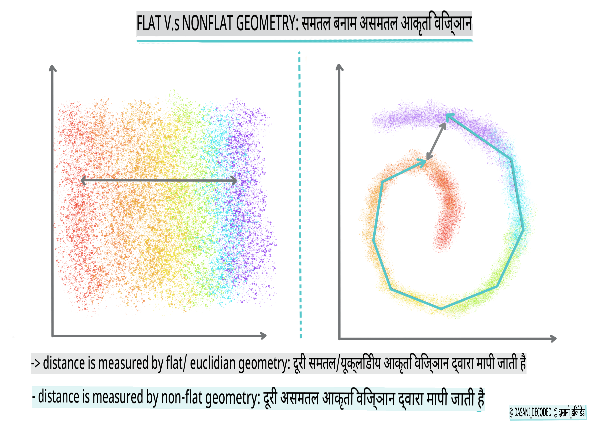
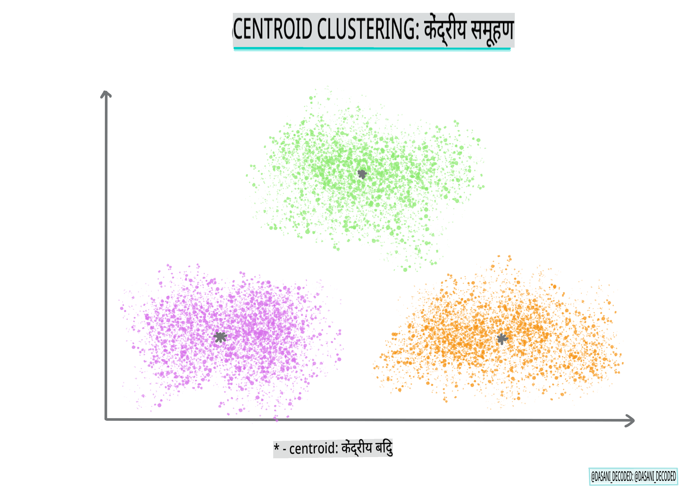

# क्लस्टरिंग का परिचय

क्लस्टरिंग एक प्रकार का [अनसुपरवाइज्ड लर्निंग](https://wikipedia.org/wiki/Unsupervised_learning) है जो मानता है कि एक डेटासेट लेबल्ड नहीं है या उसके इनपुट्स प्री-डिफाइन्ड आउटपुट्स से मेल नहीं खाते। यह विभिन्न एल्गोरिदम का उपयोग करके अनलेबल्ड डेटा को छांटता है और डेटा में पाए गए पैटर्न के अनुसार समूह प्रदान करता है।

[](https://youtu.be/ty2advRiWJM "No One Like You by PSquare")

> 🎥 ऊपर की छवि पर क्लिक करें वीडियो के लिए। क्लस्टरिंग के साथ मशीन लर्निंग का अध्ययन करते समय, कुछ नाइजीरियाई डांस हॉल ट्रैक्स का आनंद लें - यह PSquare का 2014 का एक उच्च रेटेड गीत है।
## [प्री-लेक्चर क्विज़](https://gray-sand-07a10f403.1.azurestaticapps.net/quiz/27/)
### परिचय

[क्लस्टरिंग](https://link.springer.com/referenceworkentry/10.1007%2F978-0-387-30164-8_124) डेटा एक्सप्लोरेशन के लिए बहुत उपयोगी है। आइए देखें कि क्या यह नाइजीरियाई दर्शकों के संगीत उपभोग के तरीकों में रुझानों और पैटर्न की खोज करने में मदद कर सकता है।

✅ क्लस्टरिंग के उपयोग के बारे में एक मिनट सोचें। वास्तविक जीवन में, क्लस्टरिंग तब होती है जब आपके पास कपड़ों का ढेर होता है और आपको अपने परिवार के सदस्यों के कपड़े छांटने होते हैं 🧦👕👖🩲। डेटा साइंस में, क्लस्टरिंग तब होती है जब किसी उपयोगकर्ता की प्राथमिकताओं का विश्लेषण करने या किसी अनलेबल्ड डेटासेट की विशेषताओं का निर्धारण करने की कोशिश की जाती है। क्लस्टरिंग, एक तरह से, अराजकता को समझने में मदद करती है, जैसे एक मोजे के दराज को।

[](https://youtu.be/esmzYhuFnds "Introduction to Clustering")

> 🎥 ऊपर की छवि पर क्लिक करें वीडियो के लिए: MIT के John Guttag क्लस्टरिंग का परिचय देते हैं

पेशेवर सेटिंग में, क्लस्टरिंग का उपयोग बाजार विभाजन जैसे चीजों का निर्धारण करने के लिए किया जा सकता है, उदाहरण के लिए, कौन से आयु समूह कौन सी वस्तुएं खरीदते हैं। एक और उपयोग हो सकता है विसंगति का पता लगाना, शायद क्रेडिट कार्ड लेनदेन के डेटासेट से धोखाधड़ी का पता लगाने के लिए। या आप क्लस्टरिंग का उपयोग चिकित्सा स्कैन के बैच में ट्यूमर का निर्धारण करने के लिए कर सकते हैं।

✅ एक मिनट के लिए सोचें कि आपने बैंकिंग, ई-कॉमर्स, या व्यवसाय सेटिंग में 'जंगली' में क्लस्टरिंग का सामना कैसे किया होगा।

> 🎓 दिलचस्प बात यह है कि क्लस्टर विश्लेषण का उद्भव 1930 के दशक में मानवशास्त्र और मनोविज्ञान के क्षेत्रों में हुआ था। क्या आप कल्पना कर सकते हैं कि इसका उपयोग कैसे किया गया होगा?

वैकल्पिक रूप से, आप इसका उपयोग खोज परिणामों को समूहबद्ध करने के लिए कर सकते हैं - उदाहरण के लिए, शॉपिंग लिंक, छवियों, या समीक्षाओं द्वारा। क्लस्टरिंग तब उपयोगी होती है जब आपके पास एक बड़ा डेटासेट होता है जिसे आप कम करना चाहते हैं और जिस पर आप अधिक विस्तृत विश्लेषण करना चाहते हैं, इसलिए इस तकनीक का उपयोग अन्य मॉडलों के निर्माण से पहले डेटा के बारे में जानने के लिए किया जा सकता है।

✅ एक बार जब आपका डेटा क्लस्टर में संगठित हो जाता है, तो आप इसे एक क्लस्टर आईडी असाइन करते हैं, और यह तकनीक डेटासेट की गोपनीयता बनाए रखने में उपयोगी हो सकती है; आप इसके बजाय डेटा बिंदु को इसके क्लस्टर आईडी द्वारा संदर्भित कर सकते हैं, बजाय अधिक प्रकट पहचान योग्य डेटा के। क्या आप सोच सकते हैं कि क्लस्टर आईडी के बजाय क्लस्टर के अन्य तत्वों को पहचानने के लिए अन्य कारण क्या हो सकते हैं?

इस [लर्न मॉड्यूल](https://docs.microsoft.com/learn/modules/train-evaluate-cluster-models?WT.mc_id=academic-77952-leestott) में क्लस्टरिंग तकनीकों की अपनी समझ को गहरा करें
## क्लस्टरिंग के साथ शुरुआत

[Scikit-learn एक बड़ी श्रृंखला](https://scikit-learn.org/stable/modules/clustering.html) के तरीकों की पेशकश करता है क्लस्टरिंग करने के लिए। आप जो प्रकार चुनते हैं वह आपके उपयोग के मामले पर निर्भर करेगा। प्रलेखन के अनुसार, प्रत्येक विधि के विभिन्न लाभ हैं। यहां Scikit-learn द्वारा समर्थित तरीकों और उनके उपयुक्त उपयोग मामलों की एक सरलीकृत तालिका है:

| विधि का नाम                  | उपयोग का मामला                                                            |
| :--------------------------- | :--------------------------------------------------------------------- |
| K-Means                      | सामान्य प्रयोजन, प्रेरक                                                 |
| Affinity propagation         | कई, असमान क्लस्टर, प्रेरक                                              |
| Mean-shift                   | कई, असमान क्लस्टर, प्रेरक                                              |
| Spectral clustering          | कुछ, समान क्लस्टर, ट्रांसडक्टिव                                        |
| Ward hierarchical clustering | कई, बाधित क्लस्टर, ट्रांसडक्टिव                                        |
| Agglomerative clustering     | कई, बाधित, गैर-यूक्लिडियन दूरी, ट्रांसडक्टिव                           |
| DBSCAN                       | गैर-फ्लैट ज्योमेट्री, असमान क्लस्टर, ट्रांसडक्टिव                       |
| OPTICS                       | गैर-फ्लैट ज्योमेट्री, असमान क्लस्टर के साथ परिवर्तनशील घनत्व, ट्रांसडक्टिव |
| Gaussian mixtures            | फ्लैट ज्योमेट्री, प्रेरक                                                |
| BIRCH                        | आउटलेर्स के साथ बड़ा डेटासेट, प्रेरक                                   |

> 🎓 हम क्लस्टर कैसे बनाते हैं इसका बहुत कुछ इस पर निर्भर करता है कि हम डेटा बिंदुओं को समूहों में कैसे इकट्ठा करते हैं। आइए कुछ शब्दावली को समझें:
>
> 🎓 ['ट्रांसडक्टिव' बनाम 'प्रेरक'](https://wikipedia.org/wiki/Transduction_(machine_learning))
> 
> ट्रांसडक्टिव इंफरेंस उन देखे गए प्रशिक्षण मामलों से प्राप्त होता है जो विशिष्ट परीक्षण मामलों से मेल खाते हैं। प्रेरक इंफरेंस उन प्रशिक्षण मामलों से प्राप्त होता है जो सामान्य नियमों से मेल खाते हैं जो केवल बाद में परीक्षण मामलों पर लागू होते हैं।
> 
> एक उदाहरण: कल्पना करें कि आपके पास एक डेटासेट है जो केवल आंशिक रूप से लेबल्ड है। कुछ चीजें 'रिकॉर्ड्स' हैं, कुछ 'सीडी' हैं, और कुछ खाली हैं। आपका काम खाली जगहों के लिए लेबल प्रदान करना है। यदि आप प्रेरक दृष्टिकोण चुनते हैं, तो आप 'रिकॉर्ड्स' और 'सीडी' की खोज के लिए एक मॉडल प्रशिक्षण देंगे, और उन लेबल्स को आपके अनलेबल्ड डेटा पर लागू करेंगे। इस दृष्टिकोण को उन चीजों को वर्गीकृत करने में कठिनाई होगी जो वास्तव में 'कैसेट्स' हैं। दूसरी ओर, एक ट्रांसडक्टिव दृष्टिकोण इस अज्ञात डेटा को अधिक प्रभावी ढंग से संभालता है क्योंकि यह समान वस्तुओं को एक साथ समूहित करने का काम करता है और फिर एक समूह को एक लेबल लागू करता है। इस मामले में, क्लस्टर 'गोल संगीत चीजें' और 'वर्ग संगीत चीजें' को प्रतिबिंबित कर सकते हैं।
> 
> 🎓 ['गैर-फ्लैट' बनाम 'फ्लैट' ज्योमेट्री](https://datascience.stackexchange.com/questions/52260/terminology-flat-geometry-in-the-context-of-clustering)
> 
> गणितीय शब्दावली से व्युत्पन्न, गैर-फ्लैट बनाम फ्लैट ज्योमेट्री का तात्पर्य बिंदुओं के बीच की दूरी को मापने से है, या तो 'फ्लैट' ([यूक्लिडियन](https://wikipedia.org/wiki/Euclidean_geometry)) या 'गैर-फ्लैट' (गैर-यूक्लिडियन) ज्यामितीय विधियों द्वारा।
>
>'फ्लैट' इस संदर्भ में यूक्लिडियन ज्योमेट्री को संदर्भित करता है (जिसका कुछ भाग 'प्लेन' ज्योमेट्री के रूप में सिखाया जाता है), और गैर-फ्लैट गैर-यूक्लिडियन ज्योमेट्री को संदर्भित करता है। ज्योमेट्री का मशीन लर्निंग से क्या लेना-देना है? खैर, दो क्षेत्र जो गणित में निहित हैं, बिंदुओं के बीच की दूरी को मापने का एक सामान्य तरीका होना चाहिए, और इसे 'फ्लैट' या 'गैर-फ्लैट' तरीके से किया जा सकता है, डेटा की प्रकृति के आधार पर। [यूक्लिडियन दूरी](https://wikipedia.org/wiki/Euclidean_distance) को दो बिंदुओं के बीच एक रेखा खंड की लंबाई के रूप में मापा जाता है। [गैर-यूक्लिडियन दूरी](https://wikipedia.org/wiki/Non-Euclidean_geometry) को एक वक्र के साथ मापा जाता है। यदि आपका डेटा, विज़ुअलाइज़ किया गया, एक प्लेन पर मौजूद नहीं लगता है, तो आपको इसे संभालने के लिए एक विशेष एल्गोरिदम का उपयोग करने की आवश्यकता हो सकती है।
>

> इंफोग्राफिक द्वारा [दसानी मदीपल्ली](https://twitter.com/dasani_decoded)
> 
> 🎓 ['दूरी'](https://web.stanford.edu/class/cs345a/slides/12-clustering.pdf)
> 
> क्लस्टर उनके दूरी मैट्रिक्स द्वारा परिभाषित किए जाते हैं, जैसे बिंदुओं के बीच की दूरी। इस दूरी को कुछ तरीकों से मापा जा सकता है। यूक्लिडियन क्लस्टर बिंदु मानों के औसत द्वारा परिभाषित होते हैं, और इसमें एक 'सेंट्रोइड' या केंद्र बिंदु होता है। दूरी को उस सेंट्रोइड से दूरी के रूप में मापा जाता है। गैर-यूक्लिडियन दूरी 'क्लस्ट्रोइड्स' को संदर्भित करती है, जो अन्य बिंदुओं के सबसे करीब होता है। क्लस्ट्रोइड्स को विभिन्न तरीकों से परिभाषित किया जा सकता है।
> 
> 🎓 ['बाधित'](https://wikipedia.org/wiki/Constrained_clustering)
> 
> [बाधित क्लस्टरिंग](https://web.cs.ucdavis.edu/~davidson/Publications/ICDMTutorial.pdf) इस अनसुपरवाइज्ड विधि में 'अर्ध-सुपरवाइज्ड' लर्निंग को प्रस्तुत करती है। बिंदुओं के बीच के संबंधों को 'लिंक नहीं कर सकते' या 'लिंक करना आवश्यक है' के रूप में चिह्नित किया जाता है, ताकि डेटासेट पर कुछ नियम लागू किए जा सकें।
>
>एक उदाहरण: यदि एक एल्गोरिदम को एक बैच के अनलेबल्ड या अर्ध-लेबल्ड डेटा पर स्वतंत्र रूप से सेट किया जाता है, तो यह जो क्लस्टर उत्पन्न करता है, वे खराब गुणवत्ता के हो सकते हैं। ऊपर के उदाहरण में, क्लस्टर 'गोल संगीत चीजें' और 'वर्ग संगीत चीजें' और 'त्रिकोणीय चीजें' और 'कुकीज़' समूहित कर सकते हैं। यदि कुछ बाधाओं, या नियमों का पालन करने के लिए दिया जाता है ("वस्तु प्लास्टिक से बनी होनी चाहिए", "वस्तु संगीत उत्पन्न करने में सक्षम होनी चाहिए") तो यह एल्गोरिदम को बेहतर विकल्प बनाने में मदद कर सकता है।
> 
> 🎓 'घनत्व'
> 
> डेटा जो 'शोर' है उसे 'घना' माना जाता है। इसके प्रत्येक क्लस्टर में बिंदुओं के बीच की दूरी, जांच पर, अधिक या कम घनी, या 'भीड़' हो सकती है और इसलिए इस डेटा को उपयुक्त क्लस्टरिंग विधि के साथ विश्लेषण करने की आवश्यकता है। [यह लेख](https://www.kdnuggets.com/2020/02/understanding-density-based-clustering.html) शोर वाले डेटासेट के साथ असमान क्लस्टर घनत्व का पता लगाने के लिए K-Means क्लस्टरिंग बनाम HDBSCAN एल्गोरिदम का उपयोग करने के बीच का अंतर प्रदर्शित करता है।

## क्लस्टरिंग एल्गोरिदम

100 से अधिक क्लस्टरिंग एल्गोरिदम हैं, और उनका उपयोग डेटा की प्रकृति पर निर्भर करता है। आइए कुछ प्रमुखों पर चर्चा करें:

- **हाइरार्किकल क्लस्टरिंग**। यदि किसी वस्तु को उसकी निकटता से एक निकट वस्तु के साथ वर्गीकृत किया जाता है, बजाय इसके कि वह किसी दूर की वस्तु के साथ, क्लस्टर उनके सदस्यों की अन्य वस्तुओं से दूरी के आधार पर बनते हैं। Scikit-learn की एग्लोमरेटिव क्लस्टरिंग हाइरार्किकल है।

   
   > इंफोग्राफिक द्वारा [दसानी मदीपल्ली](https://twitter.com/dasani_decoded)

- **सेंट्रोइड क्लस्टरिंग**। यह लोकप्रिय एल्गोरिदम 'k' की पसंद की आवश्यकता होती है, या क्लस्टर की संख्या को बनाने के लिए, जिसके बाद एल्गोरिदम क्लस्टर के केंद्र बिंदु को निर्धारित करता है और उस बिंदु के चारों ओर डेटा एकत्र करता है। [K-means clustering](https://wikipedia.org/wiki/K-means_clustering) सेंट्रोइड क्लस्टरिंग का एक लोकप्रिय संस्करण है। केंद्र को निकटतम औसत द्वारा निर्धारित किया जाता है, इसलिए नाम। क्लस्टर से वर्ग दूरी को कम किया जाता है।

   
   > इंफोग्राफिक द्वारा [दसानी मदीपल्ली](https://twitter.com/dasani_decoded)

- **वितरण-आधारित क्लस्टरिंग**। सांख्यिकीय मॉडलिंग पर आधारित, वितरण-आधारित क्लस्टरिंग एक डेटा बिंदु के क्लस्टर से संबंधित होने की संभावना को निर्धारित करने और तदनुसार असाइन करने पर केंद्रित होती है। Gaussian मिश्रण विधियाँ इस प्रकार से संबंधित हैं।

- **घनत्व-आधारित क्लस्टरिंग**। डेटा बिंदुओं को उनके घनत्व, या उनके आसपास के समूहों के आधार पर क्लस्टर में असाइन किया जाता है। समूह से दूर डेटा बिंदुओं को आउटलेर्स या शोर माना जाता है। DBSCAN, Mean-shift और OPTICS इस प्रकार की क्लस्टरिंग से संबंधित हैं।

- **ग्रिड-आधारित क्लस्टरिंग**। बहु-आयामी डेटासेट के लिए, एक ग्रिड बनाया जाता है और डेटा को ग्रिड की कोशिकाओं के बीच विभाजित किया जाता है, इस प्रकार क्लस्टर बनते हैं।

## अभ्यास - अपने डेटा को क्लस्टर करें

क्लस्टरिंग एक तकनीक के रूप में उचित विज़ुअलाइज़ेशन द्वारा बहुत सहायता प्राप्त होती है, तो चलिए अपने संगीत डेटा को विज़ुअलाइज़ करके शुरू करते हैं। यह अभ्यास हमें यह निर्णय लेने में मदद करेगा कि इस डेटा की प्रकृति के लिए कौन सी क्लस्टरिंग विधियों का सबसे प्रभावी ढंग से उपयोग करना चाहिए।

1. इस फ़ोल्डर में [_notebook.ipynb_](https://github.com/microsoft/ML-For-Beginners/blob/main/5-Clustering/1-Visualize/notebook.ipynb) फ़ाइल खोलें।

1. अच्छे डेटा विज़ुअलाइज़ेशन के लिए `Seaborn` पैकेज आयात करें।

    ```python
    !pip install seaborn
    ```

1. [_nigerian-songs.csv_](https://github.com/microsoft/ML-For-Beginners/blob/main/5-Clustering/data/nigerian-songs.csv) से गाने का डेटा जोड़ें। गानों के बारे में कुछ डेटा के साथ एक डेटा फ्रेम लोड करें। लाइब्रेरी आयात करके और डेटा को डंप करके इस डेटा का पता लगाने के लिए तैयार हो जाएं:

    ```python
    import matplotlib.pyplot as plt
    import pandas as pd
    
    df = pd.read_csv("../data/nigerian-songs.csv")
    df.head()
    ```

    डेटा की पहली कुछ पंक्तियों की जांच करें:

    |     | नाम                     | एल्बम                        | कलाकार              | कलाकार का शीर्ष शैली | रिलीज़ की तारीख | लंबाई | लोकप्रियता | नृत्ययोग्यता | ध्वनिकता | ऊर्जा | वाद्य यंत्र | जीवंतता | जोर | बोलना | गति   | समय हस्ताक्षर |
    | --- | ------------------------ | ---------------------------- | ------------------- | ---------------- | ------------ | ------ | ---------- | ------------ | ------------ | ------ | ---------------- | -------- | -------- | ----------- | ------- | -------------- |
    | 0   | Sparky                   | Mandy & The Jungle           | Cruel Santino       | alternative r&b  | 2019         | 144000 | 48         | 0.666        | 0.851        | 0.42   | 0.534            | 0.11     | -6.699   | 0.0829      | 133.015 | 5              |
    | 1   | shuga rush               | EVERYTHING YOU HEARD IS TRUE | Odunsi (The Engine) | afropop          | 2020         | 89488  | 30         | 0.71         | 0.0822       | 0.683  | 0.000169         | 0.101    | -5.64    | 0.36        | 129.993 | 3              |
    | 2   | LITT!                    | LITT!                        | AYLØ                | indie r
## [व्याख्यान के बाद का क्विज़](https://gray-sand-07a10f403.1.azurestaticapps.net/quiz/28/)

## समीक्षा और आत्म-अध्ययन

जैसा कि हमने सीखा है, क्लस्टरिंग एल्गोरिदम लागू करने से पहले अपने डेटा सेट की प्रकृति को समझना एक अच्छा विचार है। इस विषय पर अधिक पढ़ें [यहाँ](https://www.kdnuggets.com/2019/10/right-clustering-algorithm.html)

[यह सहायक लेख](https://www.freecodecamp.org/news/8-clustering-algorithms-in-machine-learning-that-all-data-scientists-should-know/) विभिन्न क्लस्टरिंग एल्गोरिदम के विभिन्न डेटा आकृतियों को दिए गए व्यवहार के तरीकों के बारे में बताता है।

## असाइनमेंट

[क्लस्टरिंग के लिए अन्य विज़ुअलाइज़ेशन का शोध करें](assignment.md)

**अस्वीकरण**:
यह दस्तावेज़ मशीन-आधारित एआई अनुवाद सेवाओं का उपयोग करके अनुवादित किया गया है। जबकि हम सटीकता के लिए प्रयास करते हैं, कृपया ध्यान दें कि स्वचालित अनुवादों में त्रुटियाँ या अशुद्धियाँ हो सकती हैं। मूल दस्तावेज़ को उसकी मूल भाषा में अधिकारिक स्रोत माना जाना चाहिए। महत्वपूर्ण जानकारी के लिए, पेशेवर मानव अनुवाद की सिफारिश की जाती है। इस अनुवाद के उपयोग से उत्पन्न किसी भी गलतफहमी या गलत व्याख्या के लिए हम जिम्मेदार नहीं हैं।