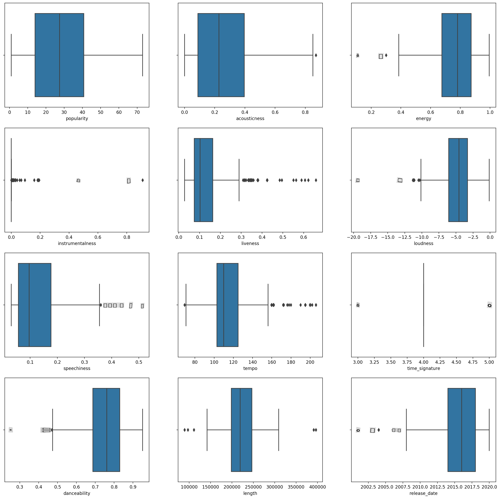
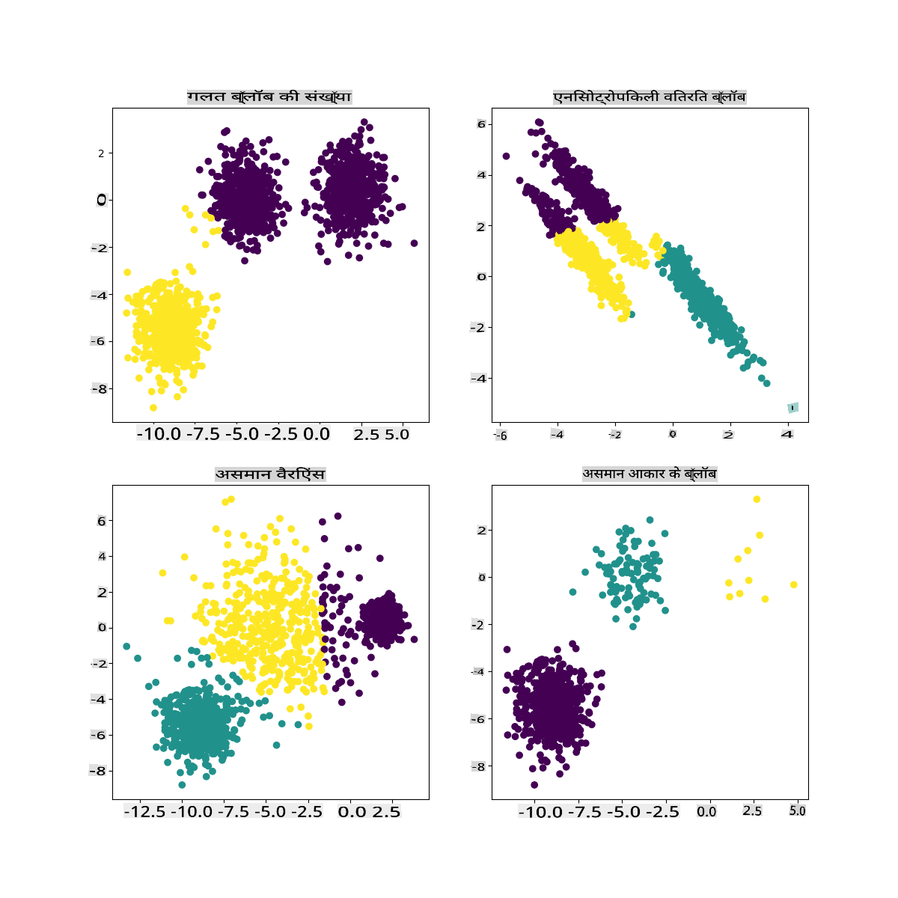

# K-Means क्लस्टरिंग

## [प्री-लेक्चर क्विज़](https://gray-sand-07a10f403.1.azurestaticapps.net/quiz/29/)

इस पाठ में, आप सीखेंगे कि Scikit-learn और पहले से आयात किए गए नाइजीरियाई संगीत डेटा सेट का उपयोग करके क्लस्टर कैसे बनाएं। हम क्लस्टरिंग के लिए K-Means की मूल बातें कवर करेंगे। ध्यान रखें कि, जैसा कि आपने पिछले पाठ में सीखा था, क्लस्टरों के साथ काम करने के कई तरीके हैं और आपके डेटा पर निर्भर करता है कि आप कौन सा तरीका उपयोग करते हैं। हम K-Means को आजमाएंगे क्योंकि यह सबसे सामान्य क्लस्टरिंग तकनीक है। चलिए शुरू करते हैं!

आप जिन शर्तों के बारे में जानेंगे:

- सिल्हूट स्कोरिंग
- एल्बो विधि
- जड़ता
- वैरिएंस

## परिचय

[K-Means क्लस्टरिंग](https://wikipedia.org/wiki/K-means_clustering) सिग्नल प्रोसेसिंग के क्षेत्र से व्युत्पन्न एक विधि है। इसका उपयोग डेटा समूहों को 'k' क्लस्टरों में विभाजित और विभाजन करने के लिए किया जाता है। प्रत्येक अवलोकन एक दिए गए डेटा बिंदु को उसके निकटतम 'मीन', या एक क्लस्टर के केंद्र बिंदु के निकटतम समूह में रखने का कार्य करता है।

क्लस्टरों को [वोरोनोई आरेख](https://wikipedia.org/wiki/Voronoi_diagram) के रूप में देखा जा सकता है, जिसमें एक बिंदु (या 'बीज') और उसका संबंधित क्षेत्र शामिल होता है।


> [जेन लूपर](https://twitter.com/jenlooper) द्वारा इन्फोग्राफिक

K-Means क्लस्टरिंग प्रक्रिया [तीन-चरण प्रक्रिया में निष्पादित होती है](https://scikit-learn.org/stable/modules/clustering.html#k-means):

1. एल्गोरिदम डेटा सेट से सैंपलिंग करके k-संख्या के केंद्र बिंदु का चयन करता है। इसके बाद, यह लूप करता है:
    1. यह प्रत्येक सैंपल को निकटतम सेंट्रॉइड को असाइन करता है।
    2. यह पिछले सेंट्रॉइड को असाइन किए गए सभी सैंपल के औसत मूल्य को लेकर नए सेंट्रॉइड बनाता है।
    3. फिर, यह नए और पुराने सेंट्रॉइड के बीच के अंतर की गणना करता है और सेंट्रॉइड स्थिर होने तक दोहराता है।

K-Means का उपयोग करने में एक कमी यह है कि आपको 'k' स्थापित करने की आवश्यकता होगी, यानी सेंट्रॉइड की संख्या। सौभाग्य से, 'एल्बो विधि' 'k' के लिए एक अच्छा प्रारंभिक मूल्य अनुमान लगाने में मदद करती है। आप इसे अभी आजमाएंगे।

## पूर्वापेक्षा

आप इस पाठ के [_notebook.ipynb_](https://github.com/microsoft/ML-For-Beginners/blob/main/5-Clustering/2-K-Means/notebook.ipynb) फ़ाइल में काम करेंगे जिसमें पिछले पाठ में किए गए डेटा आयात और प्रारंभिक सफाई शामिल है।

## अभ्यास - तैयारी

गानों के डेटा पर एक और नज़र डालकर शुरू करें।

1. प्रत्येक कॉलम के लिए `boxplot()` कॉल करते हुए एक बॉक्सप्लॉट बनाएं:

    ```python
    plt.figure(figsize=(20,20), dpi=200)
    
    plt.subplot(4,3,1)
    sns.boxplot(x = 'popularity', data = df)
    
    plt.subplot(4,3,2)
    sns.boxplot(x = 'acousticness', data = df)
    
    plt.subplot(4,3,3)
    sns.boxplot(x = 'energy', data = df)
    
    plt.subplot(4,3,4)
    sns.boxplot(x = 'instrumentalness', data = df)
    
    plt.subplot(4,3,5)
    sns.boxplot(x = 'liveness', data = df)
    
    plt.subplot(4,3,6)
    sns.boxplot(x = 'loudness', data = df)
    
    plt.subplot(4,3,7)
    sns.boxplot(x = 'speechiness', data = df)
    
    plt.subplot(4,3,8)
    sns.boxplot(x = 'tempo', data = df)
    
    plt.subplot(4,3,9)
    sns.boxplot(x = 'time_signature', data = df)
    
    plt.subplot(4,3,10)
    sns.boxplot(x = 'danceability', data = df)
    
    plt.subplot(4,3,11)
    sns.boxplot(x = 'length', data = df)
    
    plt.subplot(4,3,12)
    sns.boxplot(x = 'release_date', data = df)
    ```

    यह डेटा थोड़ा शोरयुक्त है: प्रत्येक कॉलम को एक बॉक्सप्लॉट के रूप में देखकर, आप बाहरी मान देख सकते हैं।

    

आप डेटा सेट के माध्यम से जा सकते हैं और इन बाहरी मानों को हटा सकते हैं, लेकिन इससे डेटा बहुत न्यूनतम हो जाएगा।

1. अभी के लिए, चुनें कि आप अपने क्लस्टरिंग अभ्यास के लिए कौन से कॉलम का उपयोग करेंगे। समान रेंज वाले कॉलम चुनें और `artist_top_genre` कॉलम को संख्यात्मक डेटा के रूप में एन्कोड करें:

    ```python
    from sklearn.preprocessing import LabelEncoder
    le = LabelEncoder()
    
    X = df.loc[:, ('artist_top_genre','popularity','danceability','acousticness','loudness','energy')]
    
    y = df['artist_top_genre']
    
    X['artist_top_genre'] = le.fit_transform(X['artist_top_genre'])
    
    y = le.transform(y)
    ```

1. अब आपको यह चुनना होगा कि कितने क्लस्टरों को लक्षित करना है। आप जानते हैं कि डेटा सेट से हमने 3 गाना शैलियों को अलग किया है, तो चलिए 3 को आजमाते हैं:

    ```python
    from sklearn.cluster import KMeans
    
    nclusters = 3 
    seed = 0
    
    km = KMeans(n_clusters=nclusters, random_state=seed)
    km.fit(X)
    
    # Predict the cluster for each data point
    
    y_cluster_kmeans = km.predict(X)
    y_cluster_kmeans
    ```

आपको डेटा फ्रेम के प्रत्येक पंक्ति के लिए भविष्यवाणी किए गए क्लस्टरों (0, 1, या 2) के साथ एक सरणी प्रिंट की हुई दिखाई देती है।

1. इस सरणी का उपयोग 'सिल्हूट स्कोर' की गणना के लिए करें:

    ```python
    from sklearn import metrics
    score = metrics.silhouette_score(X, y_cluster_kmeans)
    score
    ```

## सिल्हूट स्कोर

1 के करीब सिल्हूट स्कोर देखें। यह स्कोर -1 से 1 तक भिन्न होता है, और यदि स्कोर 1 है, तो क्लस्टर घना और अन्य क्लस्टरों से अच्छी तरह से अलग होता है। 0 के पास का मान ओवरलैपिंग क्लस्टरों का प्रतिनिधित्व करता है जिसमें नमूने पड़ोसी क्लस्टरों की निर्णय सीमा के बहुत करीब होते हैं। [(स्रोत)](https://dzone.com/articles/kmeans-silhouette-score-explained-with-python-exam)

हमारा स्कोर **.53** है, इसलिए बीच में है। यह इंगित करता है कि हमारा डेटा इस प्रकार की क्लस्टरिंग के लिए विशेष रूप से उपयुक्त नहीं है, लेकिन चलिए जारी रखते हैं।

### अभ्यास - एक मॉडल बनाएं

1. `KMeans` आयात करें और क्लस्टरिंग प्रक्रिया शुरू करें।

    ```python
    from sklearn.cluster import KMeans
    wcss = []
    
    for i in range(1, 11):
        kmeans = KMeans(n_clusters = i, init = 'k-means++', random_state = 42)
        kmeans.fit(X)
        wcss.append(kmeans.inertia_)
    
    ```

    यहां कुछ भाग हैं जिन्हें समझाने की आवश्यकता है।

    > 🎓 range: ये क्लस्टरिंग प्रक्रिया के पुनरावृत्तियां हैं

    > 🎓 random_state: "सेंट्रॉइड प्रारंभिककरण के लिए यादृच्छिक संख्या पीढ़ी निर्धारित करता है।" [स्रोत](https://scikit-learn.org/stable/modules/generated/sklearn.cluster.KMeans.html#sklearn.cluster.KMeans)

    > 🎓 WCSS: "within-cluster sums of squares" एक क्लस्टर के भीतर सभी बिंदुओं की औसत दूरी को मापता है। [स्रोत](https://medium.com/@ODSC/unsupervised-learning-evaluating-clusters-bd47eed175ce)।

    > 🎓 जड़ता: K-Means एल्गोरिदम 'जड़ता' को कम करने के लिए सेंट्रॉइड को चुनने का प्रयास करते हैं, "एक उपाय कि क्लस्टर कितने आंतरिक रूप से सुसंगत हैं।" [स्रोत](https://scikit-learn.org/stable/modules/clustering.html)। मान को प्रत्येक पुनरावृत्ति पर wcss चर में जोड़ा जाता है।

    > 🎓 k-means++: [Scikit-learn](https://scikit-learn.org/stable/modules/clustering.html#k-means) में आप 'k-means++' अनुकूलन का उपयोग कर सकते हैं, जो "सेंट्रॉइड को (सामान्यतः) एक-दूसरे से दूर प्रारंभिक करता है, जिससे यादृच्छिक प्रारंभिककरण की तुलना में संभवतः बेहतर परिणाम मिलते हैं।"

### एल्बो विधि

पहले, आपने अनुमान लगाया कि, क्योंकि आपने 3 गाना शैलियों को लक्षित किया है, आपको 3 क्लस्टर चुनने चाहिए। लेकिन क्या यह मामला है?

1. सुनिश्चित करने के लिए 'एल्बो विधि' का उपयोग करें।

    ```python
    plt.figure(figsize=(10,5))
    sns.lineplot(x=range(1, 11), y=wcss, marker='o', color='red')
    plt.title('Elbow')
    plt.xlabel('Number of clusters')
    plt.ylabel('WCSS')
    plt.show()
    ```

    'wcss' चर का उपयोग करें जिसे आपने पिछले चरण में बनाया था ताकि एक चार्ट बनाया जा सके जहां 'एल्बो' में मोड़ हो, जो क्लस्टरों की इष्टतम संख्या को इंगित करता है। शायद यह **वास्तव में** 3 है!

    

## अभ्यास - क्लस्टरों को प्रदर्शित करें

1. प्रक्रिया को फिर से आजमाएं, इस बार तीन क्लस्टर सेट करें, और क्लस्टरों को एक स्कैटरप्लॉट के रूप में प्रदर्शित करें:

    ```python
    from sklearn.cluster import KMeans
    kmeans = KMeans(n_clusters = 3)
    kmeans.fit(X)
    labels = kmeans.predict(X)
    plt.scatter(df['popularity'],df['danceability'],c = labels)
    plt.xlabel('popularity')
    plt.ylabel('danceability')
    plt.show()
    ```

1. मॉडल की सटीकता की जांच करें:

    ```python
    labels = kmeans.labels_
    
    correct_labels = sum(y == labels)
    
    print("Result: %d out of %d samples were correctly labeled." % (correct_labels, y.size))
    
    print('Accuracy score: {0:0.2f}'. format(correct_labels/float(y.size)))
    ```

    इस मॉडल की सटीकता बहुत अच्छी नहीं है, और क्लस्टरों का आकार आपको एक संकेत देता है कि क्यों।

    

    यह डेटा बहुत असंतुलित है, बहुत कम सहसंबद्ध है और क्लस्टर करने के लिए कॉलम मानों के बीच बहुत अधिक वैरिएंस है। वास्तव में, जो क्लस्टर बनते हैं, वे शायद भारी रूप से ऊपर परिभाषित की गई तीन शैली श्रेणियों से प्रभावित या तिरछे होते हैं। यह एक सीखने की प्रक्रिया थी!

    Scikit-learn के दस्तावेज़ों में, आप देख सकते हैं कि इस तरह के मॉडल, जिसमें क्लस्टर बहुत अच्छी तरह से चिह्नित नहीं होते हैं, में 'वैरिएंस' की समस्या होती है:

    
    > इन्फोग्राफिक स्किकिट-लर्न से

## वैरिएंस

वैरिएंस को "मीन से वर्गीकृत अंतर का औसत" के रूप में परिभाषित किया गया है [(स्रोत)](https://www.mathsisfun.com/data/standard-deviation.html)। इस क्लस्टरिंग समस्या के संदर्भ में, यह हमारे डेटा सेट की संख्या को मीन से थोड़ा अधिक भिन्न होने का संकेत देता है।

✅ यह एक शानदार क्षण है यह सोचने का कि आप इस मुद्दे को ठीक करने के लिए सभी तरीके क्या कर सकते हैं। डेटा को थोड़ा और ट्वीक करें? विभिन्न कॉलम का उपयोग करें? एक अलग एल्गोरिदम का उपयोग करें? संकेत: अपने डेटा को सामान्यीकृत करने के लिए [स्केलिंग](https://www.mygreatlearning.com/blog/learning-data-science-with-k-means-clustering/) आज़माएं और अन्य कॉलम का परीक्षण करें।

> इस '[वैरिएंस कैलकुलेटर](https://www.calculatorsoup.com/calculators/statistics/variance-calculator.php)' को आज़माएं ताकि अवधारणा को थोड़ा और समझ सकें।

---

## 🚀चुनौती

इस नोटबुक के साथ कुछ समय बिताएं, पैरामीटर ट्वीक करें। क्या आप डेटा को और अधिक साफ करके (उदाहरण के लिए बाहरी मानों को हटाकर) मॉडल की सटीकता में सुधार कर सकते हैं? आप दिए गए डेटा नमूनों को अधिक भार देने के लिए वज़न का उपयोग कर सकते हैं। बेहतर क्लस्टर बनाने के लिए आप और क्या कर सकते हैं?

संकेत: अपने डेटा को स्केल करने का प्रयास करें। नोटबुक में टिप्पणी की गई कोड है जो मानक स्केलिंग जोड़ता है ताकि डेटा कॉलम रेंज के संदर्भ में एक-दूसरे के समान हो जाएं। आप पाएंगे कि जबकि सिल्हूट स्कोर नीचे चला जाता है, एल्बो ग्राफ में 'किंक' बाहर हो जाता है। ऐसा इसलिए है क्योंकि डेटा को बिना स्केल किए छोड़ने से कम वैरिएंस वाले डेटा को अधिक भार मिल सकता है। इस समस्या के बारे में और पढ़ें [यहां](https://stats.stackexchange.com/questions/21222/are-mean-normalization-and-feature-scaling-needed-for-k-means-clustering/21226#21226)।

## [पोस्ट-लेक्चर क्विज़](https://gray-sand-07a10f403.1.azurestaticapps.net/quiz/30/)

## समीक्षा और स्व-अध्ययन

K-Means सिम्युलेटर [जैसे इस एक](https://user.ceng.metu.edu.tr/~akifakkus/courses/ceng574/k-means/) को देखें। आप इस टूल का उपयोग नमूना डेटा बिंदुओं को विज़ुअलाइज़ करने और इसके सेंट्रॉइड निर्धारित करने के लिए कर सकते हैं। आप डेटा की यादृच्छिकता, क्लस्टरों की संख्या और सेंट्रॉइड की संख्या को संपादित कर सकते हैं। क्या इससे आपको यह समझने में मदद मिलती है कि डेटा को कैसे समूहित किया जा सकता है?

इसके अलावा, स्टैनफोर्ड से [K-Means पर इस हैंडआउट](https://stanford.edu/~cpiech/cs221/handouts/kmeans.html) को देखें।

## असाइनमेंट

[विभिन्न क्लस्टरिंग विधियों का प्रयास करें](assignment.md)

**अस्वीकरण**:
यह दस्तावेज़ मशीन-आधारित एआई अनुवाद सेवाओं का उपयोग करके अनुवादित किया गया है। जबकि हम सटीकता के लिए प्रयास करते हैं, कृपया ध्यान दें कि स्वचालित अनुवाद में त्रुटियाँ या अशुद्धियाँ हो सकती हैं। मूल भाषा में मूल दस्तावेज़ को प्राधिकृत स्रोत माना जाना चाहिए। महत्वपूर्ण जानकारी के लिए, पेशेवर मानव अनुवाद की सिफारिश की जाती है। इस अनुवाद के उपयोग से उत्पन्न किसी भी गलतफहमी या गलत व्याख्या के लिए हम उत्तरदायी नहीं हैं।