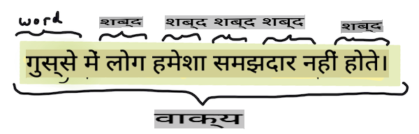

# सामान्य प्राकृतिक भाषा प्रसंस्करण कार्य और तकनीकें

अधिकांश *प्राकृतिक भाषा प्रसंस्करण* कार्यों के लिए, प्रसंस्करण के लिए पाठ को तोड़ना, जांचना और परिणामों को संग्रहीत या नियमों और डेटा सेट के साथ क्रॉस रेफरेंस करना आवश्यक होता है। ये कार्य प्रोग्रामर को एक पाठ में शब्दों और शब्दों की _आवृत्ति_ या _अर्थ_ या केवल _इरादा_ प्राप्त करने की अनुमति देते हैं।

## [पूर्व-व्याख्यान क्विज़](https://gray-sand-07a10f403.1.azurestaticapps.net/quiz/33/)

आइए उन सामान्य तकनीकों की खोज करें जो पाठ प्रसंस्करण में उपयोग की जाती हैं। मशीन लर्निंग के साथ मिलकर, ये तकनीकें आपको बड़े पैमाने पर पाठ को कुशलता से विश्लेषण करने में मदद करती हैं। हालांकि, इन कार्यों पर एमएल लागू करने से पहले, आइए समझें कि एक एनएलपी विशेषज्ञ द्वारा सामना की जाने वाली समस्याएं क्या हैं।

## एनएलपी के सामान्य कार्य

आप जिस पाठ पर काम कर रहे हैं, उसका विश्लेषण करने के विभिन्न तरीके हैं। ऐसे कार्य हैं जिन्हें आप कर सकते हैं और इन कार्यों के माध्यम से आप पाठ की समझ का अनुमान लगा सकते हैं और निष्कर्ष निकाल सकते हैं। आप आमतौर पर इन कार्यों को क्रम में करते हैं।

### टोकनाइजेशन

शायद सबसे पहली चीज जो अधिकांश एनएलपी एल्गोरिदम को करनी होती है वह है पाठ को टोकन या शब्दों में विभाजित करना। जबकि यह सरल लगता है, विराम चिह्नों और विभिन्न भाषाओं के शब्द और वाक्य सीमांककों को ध्यान में रखना इसे जटिल बना सकता है। आपको सीमांकन निर्धारित करने के लिए विभिन्न तरीकों का उपयोग करना पड़ सकता है।


> **Pride and Prejudice** से एक वाक्य को टोकनाइज़ करना। [Jen Looper](https://twitter.com/jenlooper) द्वारा इन्फोग्राफिक

### एम्बेडिंग्स

[शब्द एम्बेडिंग्स](https://wikipedia.org/wiki/Word_embedding) आपके पाठ डेटा को संख्यात्मक रूप में बदलने का एक तरीका है। एम्बेडिंग्स इस तरह से की जाती हैं ताकि समान अर्थ वाले या एक साथ उपयोग किए जाने वाले शब्द एक साथ समूहित हो जाएं।


> "I have the highest respect for your nerves, they are my old friends." - **Pride and Prejudice** में एक वाक्य के लिए शब्द एम्बेडिंग्स। [Jen Looper](https://twitter.com/jenlooper) द्वारा इन्फोग्राफिक

✅ शब्द एम्बेडिंग्स के साथ प्रयोग करने के लिए [यह दिलचस्प उपकरण](https://projector.tensorflow.org/) आज़माएं। एक शब्द पर क्लिक करने से समान शब्दों के समूह दिखते हैं: 'toy' 'disney', 'lego', 'playstation', और 'console' के साथ समूहित होता है।

### पार्सिंग और पार्ट-ऑफ-स्पीच टैगिंग

प्रत्येक शब्द जिसे टोकनाइज़ किया गया है, उसे एक भाग-ऑफ-स्पीच के रूप में टैग किया जा सकता है - एक संज्ञा, क्रिया, या विशेषण। वाक्य `the quick red fox jumped over the lazy brown dog` को पीओएस टैग किया जा सकता है जैसे fox = noun, jumped = verb.


> **Pride and Prejudice** से एक वाक्य पार्स करना। [Jen Looper](https://twitter.com/jenlooper) द्वारा इन्फोग्राफिक

पार्सिंग यह पहचानना है कि एक वाक्य में कौन से शब्द एक-दूसरे से संबंधित हैं - उदाहरण के लिए `the quick red fox jumped` एक विशेषण-संज्ञा-क्रिया अनुक्रम है जो `lazy brown dog` अनुक्रम से अलग है।  

### शब्द और वाक्यांश आवृत्तियाँ

एक बड़े पाठ का विश्लेषण करते समय एक उपयोगी प्रक्रिया यह है कि प्रत्येक रुचिकर शब्द या वाक्यांश की एक डिक्शनरी बनाई जाए और यह कितनी बार प्रकट होता है। वाक्यांश `the quick red fox jumped over the lazy brown dog` में the के लिए शब्द आवृत्ति 2 है।

आइए एक उदाहरण पाठ देखें जहां हम शब्दों की आवृत्ति की गणना करते हैं। रुडयार्ड किपलिंग की कविता द विनर्स में निम्नलिखित श्लोक है:

```output
What the moral? Who rides may read.
When the night is thick and the tracks are blind
A friend at a pinch is a friend, indeed,
But a fool to wait for the laggard behind.
Down to Gehenna or up to the Throne,
He travels the fastest who travels alone.
```

चूंकि वाक्यांश आवृत्तियाँ आवश्यकतानुसार केस सेंसिटिव या केस इंसेंसिटिव हो सकती हैं, वाक्यांश `a friend` has a frequency of 2 and `the` has a frequency of 6, and `travels` 2 है।

### एन-ग्राम्स

एक पाठ को एक सेट लंबाई के शब्दों के अनुक्रम में विभाजित किया जा सकता है, एकल शब्द (यूनिग्राम), दो शब्द (बिग्राम्स), तीन शब्द (ट्रिग्राम्स) या किसी भी संख्या के शब्द (एन-ग्राम्स)।

उदाहरण के लिए `the quick red fox jumped over the lazy brown dog` के साथ 2 के एन-ग्राम स्कोर के साथ निम्नलिखित एन-ग्राम्स उत्पन्न होते हैं:

1. the quick 
2. quick red 
3. red fox
4. fox jumped 
5. jumped over 
6. over the 
7. the lazy 
8. lazy brown 
9. brown dog

इसे वाक्य के ऊपर एक स्लाइडिंग बॉक्स के रूप में देखना आसान हो सकता है। यहां यह 3 शब्दों के एन-ग्राम्स के लिए है, प्रत्येक वाक्य में एन-ग्राम बोल्ड में है:

1.   <u>**the quick red**</u> fox jumped over the lazy brown dog
2.   the **<u>quick red fox</u>** jumped over the lazy brown dog
3.   the quick **<u>red fox jumped</u>** over the lazy brown dog
4.   the quick red **<u>fox jumped over</u>** the lazy brown dog
5.   the quick red fox **<u>jumped over the</u>** lazy brown dog
6.   the quick red fox jumped **<u>over the lazy</u>** brown dog
7.   the quick red fox jumped over <u>**the lazy brown**</u> dog
8.   the quick red fox jumped over the **<u>lazy brown dog</u>**


> एन-ग्राम मान 3: [Jen Looper](https://twitter.com/jenlooper) द्वारा इन्फोग्राफिक

### संज्ञा वाक्यांश निष्कर्षण

अधिकांश वाक्यों में एक संज्ञा होती है जो वाक्य का विषय या वस्तु होती है। अंग्रेजी में, इसे अक्सर 'a' या 'an' या 'the' के पहले होने के रूप में पहचाना जा सकता है। वाक्य के अर्थ को समझने का प्रयास करते समय एनएलपी में 'संज्ञा वाक्यांश को निकालकर' वाक्य के विषय या वस्तु की पहचान करना एक सामान्य कार्य है।

✅ वाक्य "I cannot fix on the hour, or the spot, or the look or the words, which laid the foundation. It is too long ago. I was in the middle before I knew that I had begun." में, क्या आप संज्ञा वाक्यांशों की पहचान कर सकते हैं?

वाक्य `the quick red fox jumped over the lazy brown dog` में 2 संज्ञा वाक्यांश हैं: **quick red fox** और **lazy brown dog**।

### भावना विश्लेषण

एक वाक्य या पाठ का विश्लेषण भावना के लिए किया जा सकता है, या यह कितना *सकारात्मक* या *नकारात्मक* है। भावना को *ध्रुवीयता* और *वस्तुनिष्ठता/अवस्तुनिष्ठता* में मापा जाता है। ध्रुवीयता को -1.0 से 1.0 (नकारात्मक से सकारात्मक) और 0.0 से 1.0 (सबसे वस्तुनिष्ठ से सबसे अवस्तुनिष्ठ) में मापा जाता है।

✅ बाद में आप सीखेंगे कि मशीन लर्निंग का उपयोग करके भावना निर्धारित करने के विभिन्न तरीके हैं, लेकिन एक तरीका यह है कि किसी मानव विशेषज्ञ द्वारा सकारात्मक या नकारात्मक के रूप में वर्गीकृत किए गए शब्दों और वाक्यांशों की एक सूची हो और उस मॉडल को पाठ पर लागू करें ताकि ध्रुवीयता स्कोर की गणना की जा सके। क्या आप देख सकते हैं कि यह कुछ परिस्थितियों में कैसे काम करेगा और दूसरों में कम काम करेगा?

### इंफ्लेक्शन

इंफ्लेक्शन आपको एक शब्द लेने और उस शब्द के एकवचन या बहुवचन को प्राप्त करने में सक्षम बनाता है।

### लेमाटाइजेशन

एक *लेम्मा* एक सेट के शब्दों के लिए मूल या हेडवर्ड है, उदाहरण के लिए *flew*, *flies*, *flying* का लेम्मा क्रिया *fly* है।

एनएलपी शोधकर्ता के लिए कुछ उपयोगी डेटाबेस भी उपलब्ध हैं, विशेष रूप से:

### वर्डनेट

[वर्डनेट](https://wordnet.princeton.edu/) शब्दों, पर्यायवाची, विलोम और कई अन्य विवरणों का डेटाबेस है जो विभिन्न भाषाओं में हर शब्द के लिए है। अनुवाद, वर्तनी परीक्षक, या किसी भी प्रकार के भाषा उपकरण बनाने का प्रयास करते समय यह अविश्वसनीय रूप से उपयोगी है।

## एनएलपी लाइब्रेरीज़

सौभाग्य से, आपको इन सभी तकनीकों को स्वयं बनाने की आवश्यकता नहीं है, क्योंकि उत्कृष्ट पायथन लाइब्रेरीज़ उपलब्ध हैं जो इसे उन डेवलपर्स के लिए अधिक सुलभ बनाती हैं जो प्राकृतिक भाषा प्रसंस्करण या मशीन लर्निंग में विशेषज्ञ नहीं हैं। अगला पाठ इनमें से अधिक उदाहरण शामिल करता है, लेकिन यहां आप अगले कार्य में मदद करने के लिए कुछ उपयोगी उदाहरण सीखेंगे।

### व्यायाम - `TextBlob` library

Let's use a library called TextBlob as it contains helpful APIs for tackling these types of tasks. TextBlob "stands on the giant shoulders of [NLTK](https://nltk.org) and [pattern](https://github.com/clips/pattern), and plays nicely with both." It has a considerable amount of ML embedded in its API.

> Note: A useful [Quick Start](https://textblob.readthedocs.io/en/dev/quickstart.html#quickstart) guide is available for TextBlob that is recommended for experienced Python developers 

When attempting to identify *noun phrases*, TextBlob offers several options of extractors to find noun phrases. 

1. Take a look at `ConllExtractor` का उपयोग करना

    ```python
    from textblob import TextBlob
    from textblob.np_extractors import ConllExtractor
    # import and create a Conll extractor to use later 
    extractor = ConllExtractor()
    
    # later when you need a noun phrase extractor:
    user_input = input("> ")
    user_input_blob = TextBlob(user_input, np_extractor=extractor)  # note non-default extractor specified
    np = user_input_blob.noun_phrases                                    
    ```

    > यहाँ क्या हो रहा है? [ConllExtractor](https://textblob.readthedocs.io/en/dev/api_reference.html?highlight=Conll#textblob.en.np_extractors.ConllExtractor) "एक संज्ञा वाक्यांश निष्कर्षण है जो ConLL-2000 प्रशिक्षण कॉर्पस के साथ प्रशिक्षित चंक पार्सिंग का उपयोग करता है।" ConLL-2000 कंप्यूटेशनल नेचुरल लैंग्वेज लर्निंग पर 2000 सम्मेलन को संदर्भित करता है। हर साल सम्मेलन ने एक कांटेदार एनएलपी समस्या को हल करने के लिए एक कार्यशाला की मेजबानी की, और 2000 में यह संज्ञा चंकिंग थी। एक मॉडल को वॉल स्ट्रीट जर्नल पर प्रशिक्षित किया गया था, "अनुभाग 15-18 को प्रशिक्षण डेटा (211727 टोकन) और अनुभाग 20 को परीक्षण डेटा (47377 टोकन) के रूप में।" आप उपयोग की गई प्रक्रियाओं को [यहां](https://www.clips.uantwerpen.be/conll2000/chunking/) और [परिणाम](https://ifarm.nl/erikt/research/np-chunking.html) देख सकते हैं।

### चुनौती - अपने बॉट को एनएलपी के साथ सुधारना

पिछले पाठ में आपने एक बहुत ही सरल प्रश्नोत्तर बॉट बनाया था। अब, आप अपनी इनपुट का विश्लेषण करके और भावना के अनुसार प्रतिक्रिया प्रिंट करके मार्विन को थोड़ा और सहानुभूतिपूर्ण बनाएंगे। आपको एक `noun_phrase` की पहचान भी करनी होगी और उसके बारे में अधिक इनपुट पूछना होगा।

एक बेहतर संवादात्मक बॉट बनाते समय आपके कदम:

1. उपयोगकर्ता को बॉट के साथ बातचीत कैसे करें, इसके निर्देश प्रिंट करें
2. लूप शुरू करें 
   1. उपयोगकर्ता इनपुट स्वीकार करें
   2. यदि उपयोगकर्ता ने बाहर निकलने के लिए कहा है, तो बाहर निकलें
   3. उपयोगकर्ता इनपुट को संसाधित करें और उपयुक्त भावना प्रतिक्रिया निर्धारित करें
   4. यदि भावना में एक संज्ञा वाक्यांश का पता चला है, तो उसे बहुवचन बनाएं और उस विषय पर अधिक इनपुट के लिए पूछें
   5. प्रतिक्रिया प्रिंट करें
3. चरण 2 पर वापस लूप करें

यहां TextBlob का उपयोग करके भावना निर्धारित करने के लिए कोड स्निपेट है। ध्यान दें कि भावना प्रतिक्रिया के केवल चार *ग्रेडिएंट्स* हैं (यदि आप चाहें तो अधिक हो सकते हैं):

```python
if user_input_blob.polarity <= -0.5:
  response = "Oh dear, that sounds bad. "
elif user_input_blob.polarity <= 0:
  response = "Hmm, that's not great. "
elif user_input_blob.polarity <= 0.5:
  response = "Well, that sounds positive. "
elif user_input_blob.polarity <= 1:
  response = "Wow, that sounds great. "
```

यहां कुछ नमूना आउटपुट है जो आपका मार्गदर्शन करेगा (उपयोगकर्ता इनपुट उन पंक्तियों पर है जो > से शुरू होती हैं):

```output
Hello, I am Marvin, the friendly robot.
You can end this conversation at any time by typing 'bye'
After typing each answer, press 'enter'
How are you today?
> I am ok
Well, that sounds positive. Can you tell me more?
> I went for a walk and saw a lovely cat
Well, that sounds positive. Can you tell me more about lovely cats?
> cats are the best. But I also have a cool dog
Wow, that sounds great. Can you tell me more about cool dogs?
> I have an old hounddog but he is sick
Hmm, that's not great. Can you tell me more about old hounddogs?
> bye
It was nice talking to you, goodbye!
```

कार्य का एक संभावित समाधान [यहां](https://github.com/microsoft/ML-For-Beginners/blob/main/6-NLP/2-Tasks/solution/bot.py) है

✅ ज्ञान की जाँच

1. क्या आपको लगता है कि सहानुभूतिपूर्ण प्रतिक्रियाएँ किसी को यह सोचने के लिए 'धोखा' दे सकती हैं कि बॉट वास्तव में उन्हें समझता है?
2. क्या संज्ञा वाक्यांश की पहचान करने से बॉट अधिक 'विश्वसनीय' बनता है?
3. एक वाक्य से 'संज्ञा वाक्यांश' निकालना उपयोगी क्यों होगा?

---

पिछले ज्ञान की जांच में बॉट को लागू करें और इसे एक मित्र पर परीक्षण करें। क्या यह उन्हें धोखा दे सकता है? क्या आप अपने बॉट को अधिक 'विश्वसनीय' बना सकते हैं?

## 🚀चुनौती

पिछले ज्ञान की जांच में एक कार्य लें और इसे लागू करने का प्रयास करें। बॉट को एक मित्र पर परीक्षण करें। क्या यह उन्हें धोखा दे सकता है? क्या आप अपने बॉट को अधिक 'विश्वसनीय' बना सकते हैं?

## [व्याख्यान के बाद क्विज़](https://gray-sand-07a10f403.1.azurestaticapps.net/quiz/34/)

## समीक्षा और स्व-अध्ययन

अगले कुछ पाठों में आप भावना विश्लेषण के बारे में अधिक जानेंगे। [KDNuggets](https://www.kdnuggets.com/tag/nlp) पर इन लेखों जैसे लेखों में इस दिलचस्प तकनीक पर शोध करें।

## असाइनमेंट 

[बॉट को बात करना सिखाएं](assignment.md)

**अस्वीकरण**:
यह दस्तावेज़ मशीन-आधारित एआई अनुवाद सेवाओं का उपयोग करके अनुवादित किया गया है। जबकि हम सटीकता के लिए प्रयास करते हैं, कृपया ध्यान दें कि स्वचालित अनुवाद में त्रुटियां या अशुद्धियां हो सकती हैं। मूल दस्तावेज़ को उसकी मूल भाषा में प्राधिकृत स्रोत माना जाना चाहिए। महत्वपूर्ण जानकारी के लिए, पेशेवर मानव अनुवाद की सिफारिश की जाती है। इस अनुवाद के उपयोग से उत्पन्न किसी भी गलतफहमी या गलत व्याख्या के लिए हम उत्तरदायी नहीं हैं।