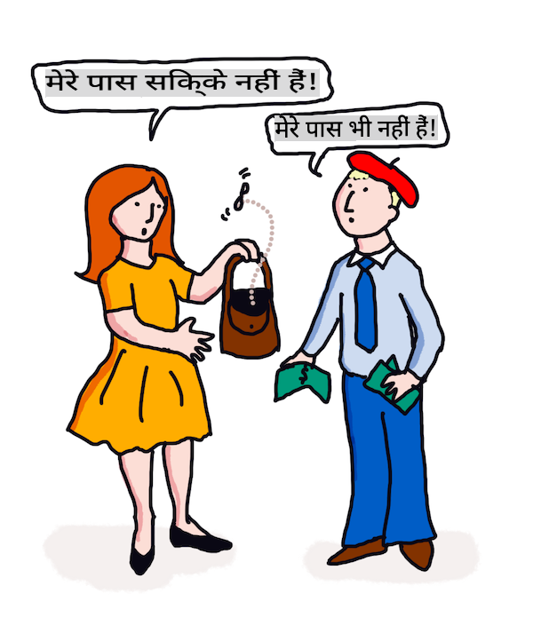

# मशीन लर्निंग के साथ अनुवाद और भाव विश्लेषण

पिछले पाठों में आपने सीखा कि कैसे एक बेसिक बॉट बनाना है, जो `TextBlob` का उपयोग करता है, जो कि एक लाइब्रेरी है जो बेसिक एनएलपी कार्यों जैसे कि संज्ञा वाक्यांश निष्कर्षण को पूरा करने के लिए पर्दे के पीछे एमएल को एम्बेड करती है। कम्प्यूटेशनल लिंग्विस्टिक्स में एक और महत्वपूर्ण चुनौती एक भाषा से दूसरी भाषा में वाक्य का सटीक _अनुवाद_ करना है।

## [प्री-लेक्चर क्विज़](https://gray-sand-07a10f403.1.azurestaticapps.net/quiz/35/)

अनुवाद एक बहुत ही कठिन समस्या है क्योंकि दुनिया में हजारों भाषाएँ हैं और प्रत्येक की व्याकरणिक नियम बहुत अलग हो सकते हैं। एक दृष्टिकोण यह है कि एक भाषा, जैसे अंग्रेज़ी, के औपचारिक व्याकरण नियमों को एक गैर-भाषा निर्भर संरचना में परिवर्तित किया जाए, और फिर इसे दूसरी भाषा में परिवर्तित करके अनुवाद किया जाए। इस दृष्टिकोण का मतलब है कि आप निम्नलिखित चरणों का पालन करेंगे:

1. **पहचान**। इनपुट भाषा के शब्दों को संज्ञा, क्रिया आदि में पहचानें या टैग करें।
2. **अनुवाद बनाएं**। प्रत्येक शब्द का लक्षित भाषा प्रारूप में सीधा अनुवाद तैयार करें।

### उदाहरण वाक्य, अंग्रेजी से आयरिश

'अंग्रेजी' में, वाक्य _I feel happy_ तीन शब्दों में है:

- **विषय** (I)
- **क्रिया** (feel)
- **विशेषण** (happy)

हालांकि, 'आयरिश' भाषा में, वही वाक्य बहुत अलग व्याकरणिक संरचना में होता है - भावनाओं जैसे "*happy*" या "*sad*" को *आप पर* होने के रूप में व्यक्त किया जाता है।

आयरिश में अंग्रेजी वाक्य `I feel happy` होगा `Tá athas orm`। एक *शाब्दिक* अनुवाद होगा `Happy is upon me`।

एक आयरिश वक्ता जो अंग्रेजी में अनुवाद कर रहा है, वह कहेगा `I feel happy`, न कि `Happy is upon me`, क्योंकि वे वाक्य का अर्थ समझते हैं, भले ही शब्द और वाक्य संरचना अलग हों।

आयरिश में वाक्य के औपचारिक क्रम हैं:

- **क्रिया** (Tá या is)
- **विशेषण** (athas, या happy)
- **विषय** (orm, या upon me)

## अनुवाद

एक नासमझ अनुवाद कार्यक्रम केवल शब्दों का अनुवाद कर सकता है, वाक्य संरचना को नजरअंदाज करते हुए।

✅ यदि आपने वयस्क के रूप में दूसरी (या तीसरी या अधिक) भाषा सीखी है, तो आपने अपनी मातृभाषा में सोचने से शुरुआत की होगी, एक अवधारणा को शब्द दर शब्द दूसरी भाषा में अनुवाद किया होगा, और फिर अपने अनुवाद को बोलने की कोशिश की होगी। यह वही है जो नासमझ अनुवाद कंप्यूटर प्रोग्राम कर रहे हैं। यह चरण पार करना महत्वपूर्ण है ताकि आप भाषा में प्रवीणता प्राप्त कर सकें!

नासमझ अनुवाद खराब (और कभी-कभी हास्यास्पद) गलत अनुवाद की ओर ले जाता है: `I feel happy` का शाब्दिक अनुवाद `Mise bhraitheann athas` में आयरिश में होता है। इसका मतलब (शाब्दिक रूप से) है `me feel happy` और यह एक मान्य आयरिश वाक्य नहीं है। भले ही अंग्रेजी और आयरिश दो निकटवर्ती द्वीपों पर बोली जाने वाली भाषाएं हैं, वे बहुत अलग भाषाएं हैं जिनकी व्याकरणिक संरचनाएं अलग हैं।

> आप आयरिश भाषाई परंपराओं के बारे में कुछ वीडियो देख सकते हैं जैसे [यह एक](https://www.youtube.com/watch?v=mRIaLSdRMMs)

### मशीन लर्निंग दृष्टिकोण

अब तक, आपने प्राकृतिक भाषा प्रसंस्करण के औपचारिक नियम दृष्टिकोण के बारे में सीखा है। एक और दृष्टिकोण यह है कि शब्दों का अर्थ नजरअंदाज कर दिया जाए, और _इसके बजाय पैटर्न का पता लगाने के लिए मशीन लर्निंग का उपयोग किया जाए_। यदि आपके पास बहुत सारे टेक्स्ट (एक *कॉर्पस*) या टेक्स्ट (*कॉर्पोरा*) दोनों मूल और लक्षित भाषाओं में हैं, तो यह अनुवाद में काम कर सकता है।

उदाहरण के लिए, *Pride and Prejudice* के मामले पर विचार करें, जो कि 1813 में जेन ऑस्टेन द्वारा लिखी गई एक प्रसिद्ध अंग्रेजी उपन्यास है। यदि आप पुस्तक को अंग्रेजी में और पुस्तक का मानव अनुवाद *फ्रेंच* में देखें, तो आप एक में वाक्यांशों का पता लगा सकते हैं जो दूसरे में _मुहावरेदार_ रूप से अनुवादित हैं। आप इसे कुछ ही समय में करेंगे।

उदाहरण के लिए, जब एक अंग्रेजी वाक्यांश जैसे `I have no money` को शाब्दिक रूप से फ्रेंच में अनुवादित किया जाता है, तो यह `Je n'ai pas de monnaie` बन सकता है। "Monnaie" एक मुश्किल फ्रेंच 'झूठा समानार्थक शब्द' है, क्योंकि 'money' और 'monnaie' पर्यायवाची नहीं हैं। एक बेहतर अनुवाद जो एक मानव कर सकता है वह होगा `Je n'ai pas d'argent`, क्योंकि यह बेहतर तरीके से इस अर्थ को व्यक्त करता है कि आपके पास पैसे नहीं हैं (बल्कि 'ढीला परिवर्तन' जो 'monnaie' का अर्थ है)।



> छवि [Jen Looper](https://twitter.com/jenlooper) द्वारा

यदि एक एमएल मॉडल के पास पर्याप्त मानव अनुवाद हैं जिन पर एक मॉडल बनाया जा सके, तो यह उन सामान्य पैटर्नों की पहचान करके अनुवाद की सटीकता को सुधार सकता है जो पहले दोनों भाषाओं के विशेषज्ञ मानव वक्ताओं द्वारा अनुवादित टेक्स्ट में पाए गए हैं।

### अभ्यास - अनुवाद

आप वाक्यों का अनुवाद करने के लिए `TextBlob` का उपयोग कर सकते हैं। **Pride and Prejudice** की प्रसिद्ध पहली पंक्ति को आजमाएं:

```python
from textblob import TextBlob

blob = TextBlob(
    "It is a truth universally acknowledged, that a single man in possession of a good fortune, must be in want of a wife!"
)
print(blob.translate(to="fr"))

```

`TextBlob` अनुवाद में काफी अच्छा काम करता है: "C'est une vérité universellement reconnue, qu'un homme célibataire en possession d'une bonne fortune doit avoir besoin d'une femme!".

यह तर्क दिया जा सकता है कि TextBlob का अनुवाद वास्तव में 1932 में V. Leconte और Ch. Pressoir द्वारा पुस्तक के फ्रेंच अनुवाद से कहीं अधिक सटीक है:

"C'est une vérité universelle qu'un célibataire pourvu d'une belle fortune doit avoir envie de se marier, et, si peu que l'on sache de son sentiment à cet egard, lorsqu'il arrive dans une nouvelle résidence, cette idée est si bien fixée dans l'esprit de ses voisins qu'ils le considèrent sur-le-champ comme la propriété légitime de l'une ou l'autre de leurs filles."

इस मामले में, एमएल द्वारा सूचित अनुवाद मानव अनुवादक से बेहतर काम करता है जो 'स्पष्टता' के लिए मूल लेखक के शब्दों को अनावश्यक रूप से जोड़ रहा है।

> यहाँ क्या हो रहा है? और TextBlob अनुवाद में इतना अच्छा क्यों है? खैर, पर्दे के पीछे, यह Google अनुवाद का उपयोग कर रहा है, जो एक परिष्कृत एआई है जो लाखों वाक्यांशों को पार्स कर सकता है ताकि कार्य के लिए सबसे अच्छे स्ट्रिंग्स की भविष्यवाणी की जा सके। यहाँ कुछ भी मैन्युअल नहीं हो रहा है और आपको `blob.translate`.

✅ Try some more sentences. Which is better, ML or human translation? In which cases?

## Sentiment analysis

Another area where machine learning can work very well is sentiment analysis. A non-ML approach to sentiment is to identify words and phrases which are 'positive' and 'negative'. Then, given a new piece of text, calculate the total value of the positive, negative and neutral words to identify the overall sentiment. 

This approach is easily tricked as you may have seen in the Marvin task - the sentence `Great, that was a wonderful waste of time, I'm glad we are lost on this dark road` एक व्यंग्यात्मक, नकारात्मक भावना वाला वाक्य है, लेकिन सरल एल्गोरिदम 'great', 'wonderful', 'glad' को सकारात्मक और 'waste', 'lost' और 'dark' को नकारात्मक के रूप में पहचानता है। कुल मिलाकर भावना इन विरोधाभासी शब्दों से प्रभावित होती है।

✅ एक सेकंड रुकें और सोचें कि हम मानव वक्ताओं के रूप में व्यंग्य कैसे व्यक्त करते हैं। टोन इन्फ्लेक्शन इसमें बड़ी भूमिका निभाता है। वाक्यांश "Well, that film was awesome" को अलग-अलग तरीकों से कहने की कोशिश करें ताकि पता चल सके कि आपकी आवाज़ कैसे अर्थ व्यक्त करती है।

### एमएल दृष्टिकोण

एमएल दृष्टिकोण यह होगा कि नकारात्मक और सकारात्मक पाठों का मैन्युअल रूप से संग्रह किया जाए - ट्वीट्स, या मूवी समीक्षाएँ, या कुछ भी जहाँ मानव ने एक स्कोर *और* एक लिखित राय दी हो। फिर एनएलपी तकनीकों को राय और स्कोर पर लागू किया जा सकता है, ताकि पैटर्न उभर सकें (जैसे, सकारात्मक मूवी समीक्षाओं में 'ऑस्कर योग्य' वाक्यांश नकारात्मक मूवी समीक्षाओं की तुलना में अधिक होता है, या सकारात्मक रेस्तरां समीक्षाएँ 'गौर्मेट' शब्द का उपयोग 'घृणास्पद' की तुलना में अधिक करती हैं)।

> ⚖️ **उदाहरण**: यदि आप एक राजनेता के कार्यालय में काम करते हैं और कोई नया कानून बहस के लिए है, तो मतदाता कार्यालय को उस विशेष नए कानून का समर्थन करने वाले या उसके खिलाफ ईमेल लिख सकते हैं। मान लीजिए कि आपको ईमेल पढ़ने और उन्हें 2 ढेरियों में छांटने का काम सौंपा गया है, *समर्थन में* और *विरोध में*। यदि बहुत सारे ईमेल होते, तो आप सभी को पढ़ने की कोशिश में अभिभूत हो सकते थे। क्या यह अच्छा नहीं होगा कि एक बॉट आपके लिए सभी ईमेल पढ़ सके, उन्हें समझ सके और आपको बता सके कि कौन सा ईमेल किस ढेरी में जाना चाहिए?
> 
> इसे प्राप्त करने का एक तरीका मशीन लर्निंग का उपयोग करना है। आप मॉडल को *विरोध में* ईमेल के एक हिस्से और *समर्थन में* ईमेल के एक हिस्से के साथ प्रशिक्षित करेंगे। मॉडल उन वाक्यांशों और शब्दों को *विरोध में* या *समर्थन में* ईमेल के साथ अधिक संभावित रूप से प्रकट होने वाले शब्दों और पैटर्नों के साथ जोड़ देगा, *लेकिन यह किसी भी सामग्री को नहीं समझेगा*, केवल यह कि कुछ शब्द और पैटर्न एक *विरोध में* या *समर्थन में* ईमेल में अधिक संभावना से प्रकट होते हैं। आप इसे उन ईमेल के साथ परीक्षण कर सकते हैं जिन्हें आपने मॉडल को प्रशिक्षित करने के लिए उपयोग नहीं किया था, और देख सकते हैं कि क्या यह आपके समान निष्कर्ष पर पहुंचता है। फिर, एक बार जब आप मॉडल की सटीकता से संतुष्ट हो जाते हैं, तो आप भविष्य के ईमेल को बिना प्रत्येक को पढ़े संसाधित कर सकते हैं।

✅ क्या यह प्रक्रिया उन प्रक्रियाओं जैसी लगती है जिन्हें आपने पिछले पाठों में उपयोग किया है?

## अभ्यास - भावनात्मक वाक्य

भावना को -1 से 1 की *ध्रुवता* के साथ मापा जाता है, जिसका मतलब है कि -1 सबसे नकारात्मक भावना है, और 1 सबसे सकारात्मक। भावना को 0 - 1 के स्कोर के साथ वस्तुनिष्ठता (0) और व्यक्तिनिष्ठता (1) के साथ भी मापा जाता है।

जेन ऑस्टेन की *Pride and Prejudice* पर एक और नज़र डालें। पाठ यहाँ [Project Gutenberg](https://www.gutenberg.org/files/1342/1342-h/1342-h.htm) पर उपलब्ध है। नीचे दिया गया नमूना एक छोटा कार्यक्रम दिखाता है जो पुस्तक के पहले और अंतिम वाक्यों की भावना का विश्लेषण करता है और इसकी भावना ध्रुवता और व्यक्तिनिष्ठता/वस्तुनिष्ठता स्कोर प्रदर्शित करता है।

आपको `sentiment` निर्धारित करने के लिए `TextBlob` लाइब्रेरी (ऊपर वर्णित) का उपयोग करना चाहिए (आपको अपना खुद का भावना कैलकुलेटर लिखने की आवश्यकता नहीं है) निम्नलिखित कार्य में।

```python
from textblob import TextBlob

quote1 = """It is a truth universally acknowledged, that a single man in possession of a good fortune, must be in want of a wife."""

quote2 = """Darcy, as well as Elizabeth, really loved them; and they were both ever sensible of the warmest gratitude towards the persons who, by bringing her into Derbyshire, had been the means of uniting them."""

sentiment1 = TextBlob(quote1).sentiment
sentiment2 = TextBlob(quote2).sentiment

print(quote1 + " has a sentiment of " + str(sentiment1))
print(quote2 + " has a sentiment of " + str(sentiment2))
```

आप निम्नलिखित आउटपुट देखते हैं:

```output
It is a truth universally acknowledged, that a single man in possession of a good fortune, must be in want # of a wife. has a sentiment of Sentiment(polarity=0.20952380952380953, subjectivity=0.27142857142857146)

Darcy, as well as Elizabeth, really loved them; and they were
     both ever sensible of the warmest gratitude towards the persons
      who, by bringing her into Derbyshire, had been the means of
      uniting them. has a sentiment of Sentiment(polarity=0.7, subjectivity=0.8)
```

## चुनौती - भावना ध्रुवता की जाँच करें

आपका कार्य भावना ध्रुवता का उपयोग करके यह निर्धारित करना है कि *Pride and Prejudice* में अधिक बिल्कुल सकारात्मक वाक्य हैं या बिल्कुल नकारात्मक। इस कार्य के लिए, आप मान सकते हैं कि 1 या -1 की ध्रुवता स्कोर बिल्कुल सकारात्मक या नकारात्मक है।

**चरण:**

1. [Pride and Prejudice की एक प्रति](https://www.gutenberg.org/files/1342/1342-h/1342-h.htm) Project Gutenberg से .txt फ़ाइल के रूप में डाउनलोड करें। फ़ाइल की शुरुआत और अंत में मेटाडेटा को हटा दें, केवल मूल पाठ को छोड़ दें
2. फ़ाइल को पायथन में खोलें और सामग्री को एक स्ट्रिंग के रूप में निकालें
3. पुस्तक स्ट्रिंग का उपयोग करके एक TextBlob बनाएं
4. पुस्तक में प्रत्येक वाक्य का एक लूप में विश्लेषण करें
   1. यदि ध्रुवता 1 या -1 है, तो वाक्य को सकारात्मक या नकारात्मक संदेशों की एक सरणी या सूची में संग्रहीत करें
5. अंत में, सभी सकारात्मक वाक्य और नकारात्मक वाक्य (अलग-अलग) और प्रत्येक की संख्या प्रिंट करें।

यहाँ एक नमूना [समाधान](https://github.com/microsoft/ML-For-Beginners/blob/main/6-NLP/3-Translation-Sentiment/solution/notebook.ipynb) है।

✅ ज्ञान जांच

1. भावना वाक्य में उपयोग किए गए शब्दों पर आधारित है, लेकिन क्या कोड *शब्दों को समझता है*?
2. क्या आपको लगता है कि भावना ध्रुवता सटीक है, या दूसरे शब्दों में, क्या आप स्कोर से *सहमत* हैं?
   1. विशेष रूप से, क्या आप निम्नलिखित वाक्यों की पूर्ण **सकारात्मक** ध्रुवता से सहमत हैं या असहमत हैं?
      * “What an excellent father you have, girls!” said she, when the door was shut.
      * “Your examination of Mr. Darcy is over, I presume,” said Miss Bingley; “and pray what is the result?” “I am perfectly convinced by it that Mr. Darcy has no defect.
      * How wonderfully these sort of things occur!
      * I have the greatest dislike in the world to that sort of thing.
      * Charlotte is an excellent manager, I dare say.
      * “This is delightful indeed!
      * I am so happy!
      * Your idea of the ponies is delightful.
   2. अगले 3 वाक्य पूर्ण सकारात्मक भावना के साथ स्कोर किए गए थे, लेकिन नजदीकी पढ़ाई पर, वे सकारात्मक वाक्य नहीं हैं। भावना विश्लेषण ने क्यों सोचा कि वे सकारात्मक वाक्य थे?
      * Happy shall I be, when his stay at Netherfield is over!” “I wish I could say anything to comfort you,” replied Elizabeth; “but it is wholly out of my power.
      * If I could but see you as happy!
      * Our distress, my dear Lizzy, is very great.
   3. क्या आप निम्नलिखित वाक्यों की पूर्ण **नकारात्मक** ध्रुवता से सहमत हैं या असहमत हैं?
      - Everybody is disgusted with his pride.
      - “I should like to know how he behaves among strangers.” “You shall hear then—but prepare yourself for something very dreadful.
      - The pause was to Elizabeth’s feelings dreadful.
      - It would be dreadful!

✅ जेन ऑस्टेन का कोई भी प्रेमी समझेगा कि वह अक्सर अपनी पुस्तकों का उपयोग अंग्रेजी रीजेंसी समाज के अधिक हास्यास्पद पहलुओं की आलोचना करने के लिए करती है। *Pride and Prejudice* की मुख्य पात्र एलिजाबेथ बेनेट एक सटीक सामाजिक पर्यवेक्षक हैं (जैसे कि लेखक) और उनकी भाषा अक्सर भारी तौर पर सूक्ष्म होती है। यहां तक कि मिस्टर डार्सी (कहानी में प्रेम रुचि) भी एलिजाबेथ की चंचल और छेड़छाड़ वाली भाषा का नोट लेते हैं: "मैंने आपके परिचय का आनंद लंबे समय तक लिया है ताकि मैं जान सकूं कि आप कभी-कभी ऐसी राय व्यक्त करने में बहुत आनंद पाते हैं जो वास्तव में आपकी नहीं हैं।"

---

## 🚀चुनौती

क्या आप उपयोगकर्ता इनपुट से अन्य विशेषताओं को निकालकर मार्विन को और भी बेहतर बना सकते हैं?

## [पोस्ट-लेक्चर क्विज़](https://gray-sand-07a10f403.1.azurestaticapps.net/quiz/36/)

## समीक्षा और आत्म-अध्ययन

पाठ से भावना निकालने के कई तरीके हैं। उन व्यावसायिक अनुप्रयोगों के बारे में सोचें जो इस तकनीक का उपयोग कर सकते हैं। सोचें कि यह कैसे गलत हो सकता है। ऐसे परिष्कृत एंटरप्राइज़-तैयार सिस्टम के बारे में और पढ़ें जो भावना का विश्लेषण करते हैं जैसे [Azure Text Analysis](https://docs.microsoft.com/azure/cognitive-services/Text-Analytics/how-tos/text-analytics-how-to-sentiment-analysis?tabs=version-3-1?WT.mc_id=academic-77952-leestott)। ऊपर दिए गए Pride and Prejudice वाक्यों में से कुछ का परीक्षण करें और देखें कि क्या यह सूक्ष्मता का पता लगा सकता है।

## असाइनमेंट

[काव्यात्मक लाइसेंस](assignment.md)

**अस्वीकरण**:
यह दस्तावेज़ मशीन-आधारित एआई अनुवाद सेवाओं का उपयोग करके अनुवादित किया गया है। जबकि हम सटीकता के लिए प्रयास करते हैं, कृपया ध्यान दें कि स्वचालित अनुवादों में त्रुटियां या अशुद्धियां हो सकती हैं। अपनी मूल भाषा में मूल दस्तावेज़ को प्रामाणिक स्रोत माना जाना चाहिए। महत्वपूर्ण जानकारी के लिए, पेशेवर मानव अनुवाद की सिफारिश की जाती है। इस अनुवाद के उपयोग से उत्पन्न किसी भी गलतफहमी या गलत व्याख्या के लिए हम उत्तरदायी नहीं हैं।