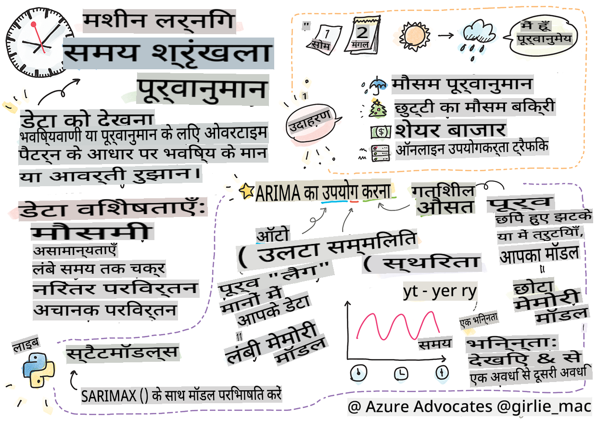
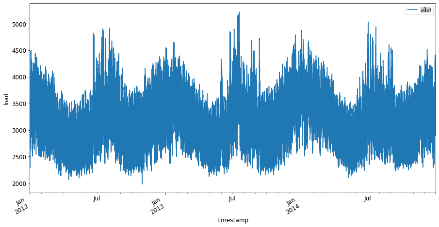
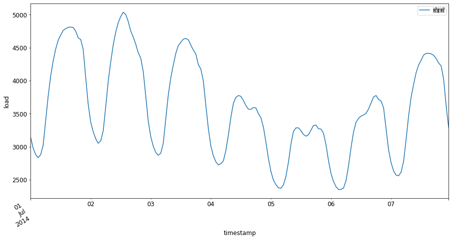

# टाइम सीरीज़ पूर्वानुमान का परिचय



> स्केच नोट [Tomomi Imura](https://www.twitter.com/girlie_mac) द्वारा

इस पाठ और अगले पाठ में, आप टाइम सीरीज़ पूर्वानुमान के बारे में थोड़ा जानेंगे, जो एक एमएल वैज्ञानिक के शस्त्रागार का एक दिलचस्प और मूल्यवान हिस्सा है, जो अन्य विषयों की तुलना में थोड़ा कम जाना जाता है। टाइम सीरीज़ पूर्वानुमान एक प्रकार का 'क्रिस्टल बॉल' है: जैसे मूल्य जैसी चर के पिछले प्रदर्शन के आधार पर, आप इसके भविष्य के संभावित मूल्य की भविष्यवाणी कर सकते हैं।

[](https://youtu.be/cBojo1hsHiI "टाइम सीरीज़ पूर्वानुमान का परिचय")

> 🎥 टाइम सीरीज़ पूर्वानुमान के बारे में वीडियो के लिए ऊपर की छवि पर क्लिक करें

## [पूर्व-व्याख्यान प्रश्नोत्तरी](https://gray-sand-07a10f403.1.azurestaticapps.net/quiz/41/)

यह एक उपयोगी और दिलचस्प क्षेत्र है जिसका व्यवसाय में वास्तविक मूल्य है, इसकी मूल्य निर्धारण, इन्वेंटरी और आपूर्ति श्रृंखला समस्याओं के प्रत्यक्ष अनुप्रयोग को देखते हुए। जबकि गहन सीखने की तकनीकों का उपयोग भविष्य के प्रदर्शन को बेहतर ढंग से पूर्वानुमान लगाने के लिए अधिक अंतर्दृष्टि प्राप्त करने के लिए किया जाने लगा है, टाइम सीरीज़ पूर्वानुमान एक ऐसा क्षेत्र है जो क्लासिक एमएल तकनीकों द्वारा बहुत सूचित है।

> पेन स्टेट का उपयोगी टाइम सीरीज़ पाठ्यक्रम [यहाँ](https://online.stat.psu.edu/stat510/lesson/1) पाया जा सकता है

## परिचय

मान लीजिए कि आप स्मार्ट पार्किंग मीटर की एक श्रृंखला बनाए रखते हैं जो समय के साथ कितनी बार उपयोग किए जाते हैं और कितनी देर तक उपयोग किए जाते हैं, इसका डेटा प्रदान करते हैं।

> क्या होगा यदि आप मीटर के पिछले प्रदर्शन के आधार पर आपूर्ति और मांग के नियमों के अनुसार इसके भविष्य के मूल्य की भविष्यवाणी कर सकते हैं?

अपने लक्ष्य को प्राप्त करने के लिए कब कार्य करना है, इसका सटीक पूर्वानुमान लगाना एक चुनौती है जिसे टाइम सीरीज़ पूर्वानुमान द्वारा निपटाया जा सकता है। व्यस्त समय में जब लोग पार्किंग स्थान की तलाश कर रहे हों तो अधिक शुल्क लेना लोगों को खुश नहीं करेगा, लेकिन यह सड़कों की सफाई के लिए राजस्व उत्पन्न करने का एक निश्चित तरीका होगा!

आइए टाइम सीरीज़ एल्गोरिदम के कुछ प्रकारों का अन्वेषण करें और कुछ डेटा को साफ और तैयार करने के लिए एक नोटबुक शुरू करें। जिस डेटा का आप विश्लेषण करेंगे वह GEFCom2014 पूर्वानुमान प्रतियोगिता से लिया गया है। इसमें 2012 और 2014 के बीच 3 वर्षों के प्रति घंटे के बिजली लोड और तापमान के मान शामिल हैं। बिजली लोड और तापमान के ऐतिहासिक पैटर्न को देखते हुए, आप बिजली लोड के भविष्य के मानों की भविष्यवाणी कर सकते हैं।

इस उदाहरण में, आप केवल ऐतिहासिक लोड डेटा का उपयोग करके एक समय कदम आगे का पूर्वानुमान लगाना सीखेंगे। हालाँकि, शुरू करने से पहले, यह समझना उपयोगी है कि पर्दे के पीछे क्या चल रहा है।

## कुछ परिभाषाएँ

जब 'टाइम सीरीज़' शब्द का सामना करना पड़ता है तो आपको इसे कई अलग-अलग संदर्भों में समझने की आवश्यकता होती है।

🎓 **टाइम सीरीज़**

गणित में, "एक टाइम सीरीज़ समय क्रम में अनुक्रमित (या सूचीबद्ध या ग्राफ़) डेटा बिंदुओं की एक श्रृंखला है। सबसे सामान्यतः, एक टाइम सीरीज़ एक अनुक्रम है जिसे समय में समान अंतराल पर लिया गया है।" टाइम सीरीज़ का एक उदाहरण [डॉव जोन्स इंडस्ट्रियल एवरेज](https://wikipedia.org/wiki/Time_series) का दैनिक समापन मूल्य है। टाइम सीरीज़ प्लॉट्स और सांख्यिकीय मॉडलिंग का उपयोग अक्सर सिग्नल प्रोसेसिंग, मौसम पूर्वानुमान, भूकंप पूर्वानुमान और अन्य क्षेत्रों में होता है जहाँ घटनाएँ होती हैं और डेटा बिंदुओं को समय के साथ प्लॉट किया जा सकता है।

🎓 **टाइम सीरीज़ विश्लेषण**

टाइम सीरीज़ विश्लेषण, उपर्युक्त टाइम सीरीज़ डेटा का विश्लेषण है। टाइम सीरीज़ डेटा विभिन्न रूपों में हो सकता है, जिसमें 'अवरोधित टाइम सीरीज़' भी शामिल है जो किसी अवरोधक घटना से पहले और बाद में टाइम सीरीज़ के विकास में पैटर्न का पता लगाता है। टाइम सीरीज़ के लिए आवश्यक विश्लेषण, डेटा की प्रकृति पर निर्भर करता है। टाइम सीरीज़ डेटा स्वयं संख्याओं या वर्णों की श्रृंखला के रूप में हो सकता है।

जो विश्लेषण किया जाना है, उसमें विभिन्न विधियाँ शामिल हैं, जिनमें आवृत्ति-डोमेन और समय-डोमेन, रैखिक और गैर-रैखिक, और अधिक शामिल हैं। इस प्रकार के डेटा का विश्लेषण करने के कई तरीकों के बारे में [अधिक जानें](https://www.itl.nist.gov/div898/handbook/pmc/section4/pmc4.htm)।

🎓 **टाइम सीरीज़ पूर्वानुमान**

टाइम सीरीज़ पूर्वानुमान एक मॉडल का उपयोग करके भविष्य के मानों की भविष्यवाणी करना है जो पहले एकत्रित डेटा द्वारा प्रदर्शित पैटर्न पर आधारित है जैसा कि अतीत में हुआ था। जबकि समय सूचकांक को x चर के रूप में प्लॉट पर उपयोग करके टाइम सीरीज़ डेटा का पता लगाने के लिए प्रतिगमन मॉडल का उपयोग करना संभव है, ऐसे डेटा का विश्लेषण विशेष प्रकार के मॉडलों का उपयोग करके सबसे अच्छा किया जाता है।

टाइम सीरीज़ डेटा क्रमबद्ध टिप्पणियों की एक सूची है, जो डेटा के विपरीत है जिसे रैखिक प्रतिगमन द्वारा विश्लेषण किया जा सकता है। सबसे सामान्य एक एआरआईएमए है, एक संक्षिप्त नाम जो "ऑटोरेग्रेसिव इंटीग्रेटेड मूविंग एवरेज" के लिए खड़ा है।

[एआरआईएमए मॉडल](https://online.stat.psu.edu/stat510/lesson/1/1.1) "श्रृंखला के वर्तमान मूल्य को पिछले मूल्यों और पिछले पूर्वानुमान त्रुटियों से संबंधित करते हैं।" वे समय-डोमेन डेटा का विश्लेषण करने के लिए सबसे उपयुक्त हैं, जहाँ डेटा समय के साथ क्रमबद्ध होता है।

> एआरआईएमए मॉडलों के कई प्रकार हैं, जिनके बारे में आप [यहाँ](https://people.duke.edu/~rnau/411arim.htm) और अगले पाठ में जान सकते हैं।

अगले पाठ में, आप [एकवचनीय टाइम सीरीज़](https://itl.nist.gov/div898/handbook/pmc/section4/pmc44.htm) का उपयोग करके एक एआरआईएमए मॉडल बनाएंगे, जो एक चर पर केंद्रित है जो समय के साथ अपने मान को बदलता है। इस प्रकार के डेटा का एक उदाहरण [यह डेटासेट](https://itl.nist.gov/div898/handbook/pmc/section4/pmc4411.htm) है जो माउना लोआ वेधशाला में मासिक CO2 सांद्रता को रिकॉर्ड करता है:

|  CO2   | YearMonth | Year  | Month |
| :----: | :-------: | :---: | :---: |
| 330.62 |  1975.04  | 1975  |   1   |
| 331.40 |  1975.13  | 1975  |   2   |
| 331.87 |  1975.21  | 1975  |   3   |
| 333.18 |  1975.29  | 1975  |   4   |
| 333.92 |  1975.38  | 1975  |   5   |
| 333.43 |  1975.46  | 1975  |   6   |
| 331.85 |  1975.54  | 1975  |   7   |
| 330.01 |  1975.63  | 1975  |   8   |
| 328.51 |  1975.71  | 1975  |   9   |
| 328.41 |  1975.79  | 1975  |  10   |
| 329.25 |  1975.88  | 1975  |  11   |
| 330.97 |  1975.96  | 1975  |  12   |

✅ इस डेटासेट में वह चर पहचानें जो समय के साथ बदलता है

## टाइम सीरीज़ डेटा की विशेषताएँ जिन पर विचार करना चाहिए

जब आप टाइम सीरीज़ डेटा को देखते हैं, तो आप देख सकते हैं कि इसमें [कुछ विशेषताएँ](https://online.stat.psu.edu/stat510/lesson/1/1.1) हैं जिन्हें आपको बेहतर समझने के लिए ध्यान में रखना और कम करना होगा। यदि आप टाइम सीरीज़ डेटा को संभावित रूप से एक 'सिग्नल' प्रदान करने के रूप में मानते हैं जिसे आप विश्लेषण करना चाहते हैं, तो इन विशेषताओं को 'शोर' के रूप में माना जा सकता है। आपको अक्सर कुछ सांख्यिकीय तकनीकों का उपयोग करके इन विशेषताओं को ऑफसेट करके इस 'शोर' को कम करने की आवश्यकता होगी।

यहाँ कुछ अवधारणाएँ दी गई हैं जिन्हें आपको टाइम सीरीज़ के साथ काम करने में सक्षम होने के लिए जानना चाहिए:

🎓 **रुझान**

रुझान को समय के साथ मापने योग्य वृद्धि और कमी के रूप में परिभाषित किया गया है। [और पढ़ें](https://machinelearningmastery.com/time-series-trends-in-python)। टाइम सीरीज़ के संदर्भ में, यह इस बारे में है कि आपके टाइम सीरीज़ से रुझानों का उपयोग कैसे करें और, यदि आवश्यक हो, उन्हें कैसे हटाएँ।

🎓 **[मौसमी](https://machinelearningmastery.com/time-series-seasonality-with-python/)**

मौसमी को आवधिक उतार-चढ़ाव के रूप में परिभाषित किया गया है, जैसे कि छुट्टियों की भीड़ जो बिक्री को प्रभावित कर सकती है, उदाहरण के लिए। डेटा में मौसमी को प्रदर्शित करने वाले विभिन्न प्रकार के प्लॉट्स को [देखें](https://itl.nist.gov/div898/handbook/pmc/section4/pmc443.htm)।

🎓 **असामान्य मान**

असामान्य मान मानक डेटा भिन्नता से बहुत दूर होते हैं।

🎓 **दीर्घकालिक चक्र**

मौसमी से स्वतंत्र, डेटा एक दीर्घकालिक चक्र प्रदर्शित कर सकता है जैसे कि एक आर्थिक मंदी जो एक वर्ष से अधिक समय तक चलती है।

🎓 **स्थिर विचलन**

समय के साथ, कुछ डेटा स्थिर उतार-चढ़ाव प्रदर्शित करते हैं, जैसे दिन और रात के प्रति ऊर्जा उपयोग।

🎓 **अचानक परिवर्तन**

डेटा अचानक परिवर्तन प्रदर्शित कर सकता है जिसे आगे के विश्लेषण की आवश्यकता हो सकती है। उदाहरण के लिए, COVID के कारण व्यवसायों के अचानक बंद होने से डेटा में परिवर्तन हुआ।

✅ यहाँ एक [नमूना टाइम सीरीज़ प्लॉट](https://www.kaggle.com/kashnitsky/topic-9-part-1-time-series-analysis-in-python) है जो कुछ वर्षों में दैनिक इन-गेम मुद्रा खर्च दिखाता है। क्या आप इस डेटा में ऊपर सूचीबद्ध किसी भी विशेषता की पहचान कर सकते हैं?


## व्यायाम - बिजली उपयोग डेटा के साथ शुरुआत करना

आइए पिछले उपयोग को देखते हुए भविष्य के बिजली उपयोग की भविष्यवाणी करने के लिए एक टाइम सीरीज़ मॉडल बनाना शुरू करें।

> इस उदाहरण में डेटा GEFCom2014 पूर्वानुमान प्रतियोगिता से लिया गया है। इसमें 2012 और 2014 के बीच 3 वर्षों के प्रति घंटे के बिजली लोड और तापमान के मान शामिल हैं।
>
> Tao Hong, Pierre Pinson, Shu Fan, Hamidreza Zareipour, Alberto Troccoli और Rob J. Hyndman, "Probabilistic energy forecasting: Global Energy Forecasting Competition 2014 and beyond", International Journal of Forecasting, vol.32, no.3, pp 896-913, जुलाई-सितंबर, 2016.

1. इस पाठ के `working` फ़ोल्डर में, _notebook.ipynb_ फ़ाइल खोलें। डेटा लोड और विज़ुअलाइज़ करने में मदद करने के लिए लाइब्रेरी जोड़कर शुरू करें

    ```python
    import os
    import matplotlib.pyplot as plt
    from common.utils import load_data
    %matplotlib inline
    ```

    ध्यान दें, आप शामिल `common` folder which set up your environment and handle downloading the data.

2. Next, examine the data as a dataframe calling `load_data()` and `head()` से फ़ाइलों का उपयोग कर रहे हैं:

    ```python
    data_dir = './data'
    energy = load_data(data_dir)[['load']]
    energy.head()
    ```

    आप देख सकते हैं कि दो कॉलम हैं जो तिथि और लोड का प्रतिनिधित्व करते हैं:

    |                     |  लोड  |
    | :-----------------: | :----: |
    | 2012-01-01 00:00:00 | 2698.0 |
    | 2012-01-01 01:00:00 | 2558.0 |
    | 2012-01-01 02:00:00 | 2444.0 |
    | 2012-01-01 03:00:00 | 2402.0 |
    | 2012-01-01 04:00:00 | 2403.0 |

3. अब, `plot()` को कॉल करके डेटा प्लॉट करें:

    ```python
    energy.plot(y='load', subplots=True, figsize=(15, 8), fontsize=12)
    plt.xlabel('timestamp', fontsize=12)
    plt.ylabel('load', fontsize=12)
    plt.show()
    ```

    

4. अब, जुलाई 2014 के पहले सप्ताह को `energy` in `[from date]: [to date]` पैटर्न को इनपुट के रूप में प्रदान करके प्लॉट करें:

    ```python
    energy['2014-07-01':'2014-07-07'].plot(y='load', subplots=True, figsize=(15, 8), fontsize=12)
    plt.xlabel('timestamp', fontsize=12)
    plt.ylabel('load', fontsize=12)
    plt.show()
    ```

    

    एक सुंदर प्लॉट! इन प्लॉट्स को देखें और देखें कि क्या आप ऊपर सूचीबद्ध किसी भी विशेषता की पहचान कर सकते हैं। डेटा को विज़ुअलाइज़ करके हम क्या निष्कर्ष निकाल सकते हैं?

अगले पाठ में, आप कुछ पूर्वानुमान बनाने के लिए एक एआरआईएमए मॉडल बनाएंगे।

---

## 🚀चुनौती

उन सभी उद्योगों और पूछताछ के क्षेत्रों की एक सूची बनाएं जिनका आप सोच सकते हैं कि टाइम सीरीज़ पूर्वानुमान से लाभ होगा। क्या आप कला में इन तकनीकों के किसी अनुप्रयोग के बारे में सोच सकते हैं? अर्थमिति में? पारिस्थितिकी में? खुदरा? उद्योग? वित्त? और कहाँ?

## [पोस्ट-व्याख्यान प्रश्नोत्तरी](https://gray-sand-07a10f403.1.azurestaticapps.net/quiz/42/)

## समीक्षा और स्व-अध्ययन

हालाँकि हम यहाँ उन्हें कवर नहीं करेंगे, लेकिन कभी-कभी टाइम सीरीज़ पूर्वानुमान के क्लासिक तरीकों को बढ़ाने के लिए न्यूरल नेटवर्क का उपयोग किया जाता है। उनके बारे में [इस लेख](https://medium.com/microsoftazure/neural-networks-for-forecasting-financial-and-economic-time-series-6aca370ff412) में और पढ़ें

## असाइनमेंट

[कुछ और टाइम सीरीज़ को विज़ुअलाइज़ करें](assignment.md)

**अस्वीकरण**:
इस दस्तावेज़ का अनुवाद मशीन-आधारित एआई अनुवाद सेवाओं का उपयोग करके किया गया है। जबकि हम सटीकता के लिए प्रयास करते हैं, कृपया ध्यान दें कि स्वचालित अनुवादों में त्रुटियाँ या अशुद्धियाँ हो सकती हैं। मूल दस्तावेज़ को उसकी मूल भाषा में प्रामाणिक स्रोत माना जाना चाहिए। महत्वपूर्ण जानकारी के लिए, पेशेवर मानव अनुवाद की सिफारिश की जाती है। इस अनुवाद के उपयोग से उत्पन्न किसी भी गलतफहमी या गलत व्याख्या के लिए हम उत्तरदायी नहीं हैं।