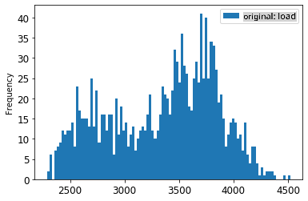
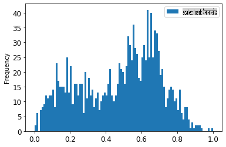
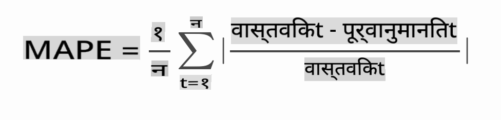

# एआरआईएमए के साथ टाइम सीरीज भविष्यवाणी

पिछले पाठ में, आपने टाइम सीरीज भविष्यवाणी के बारे में थोड़ा सीखा और एक डेटासेट लोड किया जो एक समय अवधि में विद्युत भार के उतार-चढ़ाव को दर्शाता है।

[](https://youtu.be/IUSk-YDau10 "Introduction to ARIMA")

> 🎥 वीडियो के लिए ऊपर की छवि पर क्लिक करें: एआरआईएमए मॉडल्स का संक्षिप्त परिचय। उदाहरण R में किया गया है, लेकिन अवधारणाएँ सार्वभौमिक हैं।

## [प्री-लेक्चर क्विज़](https://gray-sand-07a10f403.1.azurestaticapps.net/quiz/43/)

## परिचय

इस पाठ में, आप [एआरआईएमए: *ऑटो*रेग्रेसिव *इंटीग्रेटेड *मूविंग *एवरेज](https://wikipedia.org/wiki/Autoregressive_integrated_moving_average) के साथ मॉडल बनाने का एक विशिष्ट तरीका खोजेंगे। एआरआईएमए मॉडल विशेष रूप से [गैर-स्टेशनरिटी](https://wikipedia.org/wiki/Stationary_process) दिखाने वाले डेटा को फिट करने के लिए उपयुक्त होते हैं।

## सामान्य अवधारणाएँ

एआरआईएमए के साथ काम करने में सक्षम होने के लिए, कुछ अवधारणाएँ हैं जिन्हें आपको जानना आवश्यक है:

- 🎓 **स्टेशनरिटी**। सांख्यिकीय संदर्भ से, स्टेशनरिटी उन डेटा को संदर्भित करता है जिनका वितरण समय में स्थानांतरित होने पर नहीं बदलता है। गैर-स्टेशनरी डेटा, फिर, रुझानों के कारण उतार-चढ़ाव दिखाता है जिसे विश्लेषण करने के लिए परिवर्तित करना आवश्यक है। उदाहरण के लिए, सीजनलिटी डेटा में उतार-चढ़ाव ला सकती है और इसे 'सीजनल-डिफरेंसिंग' की प्रक्रिया द्वारा समाप्त किया जा सकता है।

- 🎓 **[डिफरेंसिंग](https://wikipedia.org/wiki/Autoregressive_integrated_moving_average#Differencing)**। सांख्यिकीय संदर्भ से फिर से, डिफरेंसिंग डेटा को स्थिर बनाने के लिए गैर-स्टेशनरी डेटा को परिवर्तित करने की प्रक्रिया को संदर्भित करता है। "डिफरेंसिंग समय श्रृंखला के स्तर में बदलाव को हटा देता है, रुझान और सीजनलिटी को समाप्त करता है और परिणामस्वरूप समय श्रृंखला के माध्य को स्थिर करता है।" [शिक्सिओंग एट अल का पेपर](https://arxiv.org/abs/1904.07632)

## टाइम सीरीज के संदर्भ में एआरआईएमए

आइए एआरआईएमए के भागों को समझें ताकि यह समझ सकें कि यह हमें टाइम सीरीज मॉडल बनाने और इसके खिलाफ भविष्यवाणियाँ करने में कैसे मदद करता है।

- **एआर - ऑटोरेग्रेसिव के लिए**। जैसा कि नाम से पता चलता है, ऑटोरेग्रेसिव मॉडल आपके डेटा में पिछली मानों को 'पीछे' देखने और उनके बारे में धारणाएँ बनाने के लिए देखता है। इन पिछली मानों को 'लैग्स' कहा जाता है। एक उदाहरण पेंसिल की मासिक बिक्री दिखाने वाले डेटा का होगा। प्रत्येक महीने की बिक्री कुल को डेटासेट में एक 'विकसित हो रहा चर' माना जाएगा। यह मॉडल इस प्रकार बनाया गया है कि "रुचि का विकसित चर अपने स्वयं के लैग्ड (यानी, पूर्व) मानों पर पुनरावृत्त होता है।" [विकिपीडिया](https://wikipedia.org/wiki/Autoregressive_integrated_moving_average)

- **आई - इंटीग्रेटेड के लिए**। समान 'एआरएमए' मॉडल के विपरीत, एआरआईएमए में 'आई' इसके *[इंटीग्रेटेड](https://wikipedia.org/wiki/Order_of_integration)* पहलू को संदर्भित करता है। गैर-स्टेशनरिटी को समाप्त करने के लिए डिफरेंसिंग चरणों को लागू करने पर डेटा 'इंटीग्रेटेड' हो जाता है।

- **एमए - मूविंग एवरेज के लिए**। इस मॉडल के [मूविंग-एवरेज](https://wikipedia.org/wiki/Moving-average_model) पहलू का तात्पर्य आउटपुट वेरिएबल से है जो लैग्स के वर्तमान और पिछले मानों का निरीक्षण करके निर्धारित होता है।

निचला रेखा: एआरआईएमए का उपयोग विशेष प्रकार के टाइम सीरीज डेटा को यथासंभव निकटता से फिट करने के लिए किया जाता है।

## व्यायाम - एक एआरआईएमए मॉडल बनाएं

इस पाठ में [_/working_](https://github.com/microsoft/ML-For-Beginners/tree/main/7-TimeSeries/2-ARIMA/working) फ़ोल्डर खोलें और [_notebook.ipynb_](https://github.com/microsoft/ML-For-Beginners/blob/main/7-TimeSeries/2-ARIMA/working/notebook.ipynb) फ़ाइल खोजें।

1. नोटबुक चलाएं ताकि आप `statsmodels` Python लाइब्रेरी को लोड कर सकें; आपको एआरआईएमए मॉडल के लिए इसकी आवश्यकता होगी।

1. आवश्यक लाइब्रेरी लोड करें

1. अब, डेटा को प्लॉट करने के लिए उपयोगी कई और लाइब्रेरी लोड करें:

    ```python
    import os
    import warnings
    import matplotlib.pyplot as plt
    import numpy as np
    import pandas as pd
    import datetime as dt
    import math

    from pandas.plotting import autocorrelation_plot
    from statsmodels.tsa.statespace.sarimax import SARIMAX
    from sklearn.preprocessing import MinMaxScaler
    from common.utils import load_data, mape
    from IPython.display import Image

    %matplotlib inline
    pd.options.display.float_format = '{:,.2f}'.format
    np.set_printoptions(precision=2)
    warnings.filterwarnings("ignore") # specify to ignore warning messages
    ```

1. `/data/energy.csv` फ़ाइल से डेटा को एक पांडा डेटा फ्रेम में लोड करें और एक नज़र डालें:

    ```python
    energy = load_data('./data')[['load']]
    energy.head(10)
    ```

1. जनवरी 2012 से दिसंबर 2014 तक सभी उपलब्ध ऊर्जा डेटा को प्लॉट करें। कोई आश्चर्य नहीं होना चाहिए क्योंकि हमने इस डेटा को पिछले पाठ में देखा था:

    ```python
    energy.plot(y='load', subplots=True, figsize=(15, 8), fontsize=12)
    plt.xlabel('timestamp', fontsize=12)
    plt.ylabel('load', fontsize=12)
    plt.show()
    ```

    अब, आइए एक मॉडल बनाएं!

### प्रशिक्षण और परीक्षण डेटासेट बनाएं

अब आपका डेटा लोड हो गया है, इसलिए आप इसे ट्रेन और टेस्ट सेट में अलग कर सकते हैं। आप अपने मॉडल को ट्रेन सेट पर प्रशिक्षित करेंगे। हमेशा की तरह, मॉडल के प्रशिक्षण समाप्त होने के बाद, आप इसके सटीकता का मूल्यांकन परीक्षण सेट का उपयोग करके करेंगे। आपको यह सुनिश्चित करने की आवश्यकता है कि परीक्षण सेट प्रशिक्षण सेट की तुलना में समय की एक बाद की अवधि को कवर करता है ताकि यह सुनिश्चित हो सके कि मॉडल भविष्य की समय अवधि से जानकारी प्राप्त नहीं करता है।

1. 1 सितंबर से 31 अक्टूबर, 2014 की दो महीने की अवधि को ट्रेनिंग सेट में आवंटित करें। परीक्षण सेट में 1 नवंबर से 31 दिसंबर, 2014 की दो महीने की अवधि शामिल होगी:

    ```python
    train_start_dt = '2014-11-01 00:00:00'
    test_start_dt = '2014-12-30 00:00:00'
    ```

    चूंकि यह डेटा ऊर्जा की दैनिक खपत को दर्शाता है, इसलिए एक मजबूत मौसमी पैटर्न है, लेकिन खपत हाल के दिनों में खपत के समान है।

1. अंतर को दृश्य रूप में देखें:

    ```python
    energy[(energy.index < test_start_dt) & (energy.index >= train_start_dt)][['load']].rename(columns={'load':'train'}) \
        .join(energy[test_start_dt:][['load']].rename(columns={'load':'test'}), how='outer') \
        .plot(y=['train', 'test'], figsize=(15, 8), fontsize=12)
    plt.xlabel('timestamp', fontsize=12)
    plt.ylabel('load', fontsize=12)
    plt.show()
    ```

    

    इसलिए, डेटा को प्रशिक्षित करने के लिए अपेक्षाकृत छोटे समय विंडो का उपयोग करना पर्याप्त होना चाहिए।

    > नोट: चूंकि हम एआरआईएमए मॉडल को फिट करने के लिए जिस फ़ंक्शन का उपयोग करते हैं वह फिटिंग के दौरान इन-सैंपल सत्यापन का उपयोग करता है, हम सत्यापन डेटा को छोड़ देंगे।

### प्रशिक्षण के लिए डेटा तैयार करें

अब, आपको अपने डेटा को फिल्टर और स्केल करके प्रशिक्षण के लिए तैयार करना होगा। अपने डेटासेट को केवल आवश्यक समय अवधि और कॉलम को शामिल करने के लिए फिल्टर करें, और यह सुनिश्चित करने के लिए स्केलिंग करें कि डेटा को 0,1 के अंतराल में प्रक्षेपित किया गया है।

1. मूल डेटासेट को केवल उपरोक्त समय अवधि प्रति सेट और केवल आवश्यक कॉलम 'लोड' और तारीख को शामिल करने के लिए फिल्टर करें:

    ```python
    train = energy.copy()[(energy.index >= train_start_dt) & (energy.index < test_start_dt)][['load']]
    test = energy.copy()[energy.index >= test_start_dt][['load']]

    print('Training data shape: ', train.shape)
    print('Test data shape: ', test.shape)
    ```

    आप डेटा का आकार देख सकते हैं:

    ```output
    Training data shape:  (1416, 1)
    Test data shape:  (48, 1)
    ```

1. डेटा को (0, 1) के रेंज में स्केल करें।

    ```python
    scaler = MinMaxScaler()
    train['load'] = scaler.fit_transform(train)
    train.head(10)
    ```

1. मूल बनाम स्केल डेटा को दृश्य रूप में देखें:

    ```python
    energy[(energy.index >= train_start_dt) & (energy.index < test_start_dt)][['load']].rename(columns={'load':'original load'}).plot.hist(bins=100, fontsize=12)
    train.rename(columns={'load':'scaled load'}).plot.hist(bins=100, fontsize=12)
    plt.show()
    ```

    

    > मूल डेटा

    

    > स्केल किया हुआ डेटा

1. अब जब आपने स्केल किए गए डेटा को कैलिब्रेट कर लिया है, तो आप परीक्षण डेटा को स्केल कर सकते हैं:

    ```python
    test['load'] = scaler.transform(test)
    test.head()
    ```

### एआरआईएमए लागू करें

अब एआरआईएमए लागू करने का समय है! अब आप `statsmodels` लाइब्रेरी का उपयोग करेंगे जिसे आपने पहले इंस्टॉल किया था।

अब आपको कई चरणों का पालन करना होगा

   1. `SARIMAX()` and passing in the model parameters: p, d, and q parameters, and P, D, and Q parameters.
   2. Prepare the model for the training data by calling the fit() function.
   3. Make predictions calling the `forecast()` function and specifying the number of steps (the `horizon`) to forecast.

> 🎓 What are all these parameters for? In an ARIMA model there are 3 parameters that are used to help model the major aspects of a time series: seasonality, trend, and noise. These parameters are:

`p`: the parameter associated with the auto-regressive aspect of the model, which incorporates *past* values.
`d`: the parameter associated with the integrated part of the model, which affects the amount of *differencing* (🎓 remember differencing 👆?) to apply to a time series.
`q`: the parameter associated with the moving-average part of the model.

> Note: If your data has a seasonal aspect - which this one does - , we use a seasonal ARIMA model (SARIMA). In that case you need to use another set of parameters: `P`, `D`, and `Q` which describe the same associations as `p`, `d`, and `q` कॉल करके मॉडल को परिभाषित करें, लेकिन मॉडल के मौसमी घटकों से संबंधित हैं।

1. अपनी पसंदीदा क्षितिज मान सेट करके प्रारंभ करें। आइए 3 घंटे आजमाएं:

    ```python
    # Specify the number of steps to forecast ahead
    HORIZON = 3
    print('Forecasting horizon:', HORIZON, 'hours')
    ```

    एआरआईएमए मॉडल के पैरामीटर के लिए सर्वोत्तम मानों का चयन करना चुनौतीपूर्ण हो सकता है क्योंकि यह कुछ हद तक व्यक्तिपरक और समय लेने वाला है। आप `auto_arima()` function from the [`pyramid` लाइब्रेरी](https://alkaline-ml.com/pmdarima/0.9.0/modules/generated/pyramid.arima.auto_arima.html) का उपयोग करने पर विचार कर सकते हैं,

1. अभी के लिए कुछ मैनुअल चयन आजमाएं ताकि एक अच्छा मॉडल मिल सके।

    ```python
    order = (4, 1, 0)
    seasonal_order = (1, 1, 0, 24)

    model = SARIMAX(endog=train, order=order, seasonal_order=seasonal_order)
    results = model.fit()

    print(results.summary())
    ```

    परिणामों की एक तालिका मुद्रित होती है।

आपने अपना पहला मॉडल बना लिया है! अब हमें इसे मूल्यांकन करने का तरीका खोजना होगा।

### अपने मॉडल का मूल्यांकन करें

अपने मॉडल का मूल्यांकन करने के लिए, आप तथाकथित `वॉक फॉरवर्ड` सत्यापन कर सकते हैं। व्यवहार में, टाइम सीरीज मॉडल को हर बार एक नया डेटा उपलब्ध होने पर पुन: प्रशिक्षित किया जाता है। यह मॉडल को प्रत्येक समय चरण पर सर्वोत्तम पूर्वानुमान बनाने की अनुमति देता है।

इस तकनीक का उपयोग करके टाइम सीरीज की शुरुआत में शुरू करते हुए, ट्रेन डेटा सेट पर मॉडल को प्रशिक्षित करें। फिर अगले समय चरण पर एक भविष्यवाणी करें। भविष्यवाणी ज्ञात मान के खिलाफ मूल्यांकित की जाती है। फिर ट्रेनिंग सेट को ज्ञात मान को शामिल करने के लिए विस्तारित किया जाता है और प्रक्रिया को दोहराया जाता है।

> नोट: आपको अधिक कुशल प्रशिक्षण के लिए प्रशिक्षण सेट विंडो को स्थिर रखना चाहिए ताकि हर बार जब आप प्रशिक्षण सेट में एक नया अवलोकन जोड़ते हैं, तो आप सेट की शुरुआत से अवलोकन को हटा देते हैं।

यह प्रक्रिया इस बात का अधिक मजबूत अनुमान प्रदान करती है कि मॉडल व्यवहार में कैसा प्रदर्शन करेगा। हालाँकि, यह इतने सारे मॉडल बनाने की गणना लागत पर आता है। यदि डेटा छोटा है या मॉडल सरल है तो यह स्वीकार्य है, लेकिन पैमाने पर एक समस्या हो सकती है।

वॉक-फॉरवर्ड वैलिडेशन टाइम सीरीज मॉडल मूल्यांकन का स्वर्ण मानक है और आपके अपने प्रोजेक्ट के लिए अनुशंसित है।

1. सबसे पहले, प्रत्येक HORIZON चरण के लिए एक परीक्षण डेटा बिंदु बनाएं।

    ```python
    test_shifted = test.copy()

    for t in range(1, HORIZON+1):
        test_shifted['load+'+str(t)] = test_shifted['load'].shift(-t, freq='H')

    test_shifted = test_shifted.dropna(how='any')
    test_shifted.head(5)
    ```

    |            |          | लोड | लोड+1 | लोड+2 |
    | ---------- | -------- | ---- | ------ | ------ |
    | 2014-12-30 | 00:00:00 | 0.33 | 0.29   | 0.27   |
    | 2014-12-30 | 01:00:00 | 0.29 | 0.27   | 0.27   |
    | 2014-12-30 | 02:00:00 | 0.27 | 0.27   | 0.30   |
    | 2014-12-30 | 03:00:00 | 0.27 | 0.30   | 0.41   |
    | 2014-12-30 | 04:00:00 | 0.30 | 0.41   | 0.57   |

    डेटा को उसके क्षितिज बिंदु के अनुसार क्षैतिज रूप से स्थानांतरित किया गया है।

1. इस स्लाइडिंग विंडो दृष्टिकोण का उपयोग करके अपने परीक्षण डेटा पर भविष्यवाणियाँ करें और परीक्षण डेटा की लंबाई के आकार में एक लूप में करें:

    ```python
    %%time
    training_window = 720 # dedicate 30 days (720 hours) for training

    train_ts = train['load']
    test_ts = test_shifted

    history = [x for x in train_ts]
    history = history[(-training_window):]

    predictions = list()

    order = (2, 1, 0)
    seasonal_order = (1, 1, 0, 24)

    for t in range(test_ts.shape[0]):
        model = SARIMAX(endog=history, order=order, seasonal_order=seasonal_order)
        model_fit = model.fit()
        yhat = model_fit.forecast(steps = HORIZON)
        predictions.append(yhat)
        obs = list(test_ts.iloc[t])
        # move the training window
        history.append(obs[0])
        history.pop(0)
        print(test_ts.index[t])
        print(t+1, ': predicted =', yhat, 'expected =', obs)
    ```

    आप प्रशिक्षण होते हुए देख सकते हैं:

    ```output
    2014-12-30 00:00:00
    1 : predicted = [0.32 0.29 0.28] expected = [0.32945389435989236, 0.2900626678603402, 0.2739480752014323]

    2014-12-30 01:00:00
    2 : predicted = [0.3  0.29 0.3 ] expected = [0.2900626678603402, 0.2739480752014323, 0.26812891674127126]

    2014-12-30 02:00:00
    3 : predicted = [0.27 0.28 0.32] expected = [0.2739480752014323, 0.26812891674127126, 0.3025962399283795]
    ```

1. भविष्यवाणियों की तुलना वास्तविक लोड से करें:

    ```python
    eval_df = pd.DataFrame(predictions, columns=['t+'+str(t) for t in range(1, HORIZON+1)])
    eval_df['timestamp'] = test.index[0:len(test.index)-HORIZON+1]
    eval_df = pd.melt(eval_df, id_vars='timestamp', value_name='prediction', var_name='h')
    eval_df['actual'] = np.array(np.transpose(test_ts)).ravel()
    eval_df[['prediction', 'actual']] = scaler.inverse_transform(eval_df[['prediction', 'actual']])
    eval_df.head()
    ```

    आउटपुट
    |     |            | टाइमस्टैम्प | एच   | भविष्यवाणी | वास्तविक   |
    | --- | ---------- | --------- | --- | ---------- | -------- |
    | 0   | 2014-12-30 | 00:00:00  | t+1 | 3,008.74   | 3,023.00 |
    | 1   | 2014-12-30 | 01:00:00  | t+1 | 2,955.53   | 2,935.00 |
    | 2   | 2014-12-30 | 02:00:00  | t+1 | 2,900.17   | 2,899.00 |
    | 3   | 2014-12-30 | 03:00:00  | t+1 | 2,917.69   | 2,886.00 |
    | 4   | 2014-12-30 | 04:00:00  | t+1 | 2,946.99   | 2,963.00 |


    वास्तविक लोड की तुलना में प्रति घंटे डेटा की भविष्यवाणी देखें। यह कितना सटीक है?

### मॉडल सटीकता की जांच करें

सभी भविष्यवाणियों पर अपने मॉडल की सटीकता की जांच उसके माध्य पूर्ण प्रतिशत त्रुटि (MAPE) का परीक्षण करके करें।

> **🧮 गणित दिखाओ**
>
> 
>
>  [MAPE](https://www.linkedin.com/pulse/what-mape-mad-msd-time-series-allameh-statistics/) को उपरोक्त सूत्र द्वारा परिभाषित अनुपात के रूप में पूर्वानुमान सटीकता दिखाने के लिए उपयोग किया जाता है। वास्तविक<sub>t</sub> और पूर्वानुमानित<sub>t</sub> के बीच का अंतर वास्तविक<sub>t</sub> द्वारा विभाजित किया जाता है। "इस गणना में पूर्ण मान को समय में प्रत्येक पूर्वानुमानित बिंदु के लिए जोड़ा जाता है और फिट किए गए बिंदुओं n की संख्या से विभाजित किया जाता है।" [विकिपीडिया](https://wikipedia.org/wiki/Mean_absolute_percentage_error)

1. कोड में समीकरण व्यक्त करें:

    ```python
    if(HORIZON > 1):
        eval_df['APE'] = (eval_df['prediction'] - eval_df['actual']).abs() / eval_df['actual']
        print(eval_df.groupby('h')['APE'].mean())
    ```

1. एक चरण का MAPE गणना करें:

    ```python
    print('One step forecast MAPE: ', (mape(eval_df[eval_df['h'] == 't+1']['prediction'], eval_df[eval_df['h'] == 't+1']['actual']))*100, '%')
    ```

    एक चरण पूर्वानुमान MAPE:  0.5570581332313952 %

1. बहु-चरण पूर्वानुमान MAPE प्रिंट करें:

    ```python
    print('Multi-step forecast MAPE: ', mape(eval_df['prediction'], eval_df['actual'])*100, '%')
    ```

    ```output
    Multi-step forecast MAPE:  1.1460048657704118 %
    ```

    एक अच्छा कम संख्या सबसे अच्छा है: विचार करें कि 10 का MAPE वाला पूर्वानुमान 10% से बंद है।

1. लेकिन हमेशा की तरह, इस प्रकार की सटीकता माप को दृश्य रूप से देखना आसान होता है, इसलिए आइए इसे प्लॉट करें:

    ```python
     if(HORIZON == 1):
        ## Plotting single step forecast
        eval_df.plot(x='timestamp', y=['actual', 'prediction'], style=['r', 'b'], figsize=(15, 8))

    else:
        ## Plotting multi step forecast
        plot_df = eval_df[(eval_df.h=='t+1')][['timestamp', 'actual']]
        for t in range(1, HORIZON+1):
            plot_df['t+'+str(t)] = eval_df[(eval_df.h=='t+'+str(t))]['prediction'].values

        fig = plt.figure(figsize=(15, 8))
        ax = plt.plot(plot_df['timestamp'], plot_df['actual'], color='red', linewidth=4.0)
        ax = fig.add_subplot(111)
        for t in range(1, HORIZON+1):
            x = plot_df['timestamp'][(t-1):]
            y = plot_df['t+'+str(t)][0:len(x)]
            ax.plot(x, y, color='blue', linewidth=4*math.pow(.9,t), alpha=math.pow(0.8,t))

        ax.legend(loc='best')

    plt.xlabel('timestamp', fontsize=12)
    plt.ylabel('load', fontsize=12)
    plt.show()
    ```

    

🏆 एक बहुत ही अच्छा प्लॉट, जो एक अच्छे सटीकता वाले मॉडल को दिखा रहा है। बहुत बढ़िया!

---

## 🚀चुनौती

टाइम सीरीज मॉडल की सटीकता का परीक्षण करने के तरीकों में गहराई से जाएं। हम इस पाठ में MAPE को छूते हैं, लेकिन क्या अन्य विधियाँ हैं जिन्हें आप उपयोग कर सकते हैं? उनका शोध करें और उन्हें एनोटेट करें। एक सहायक दस्तावेज़ [यहां](https://otexts.com/fpp2/accuracy.html) पाया जा सकता है

## [पोस्ट-लेक्चर क्विज़](https://gray-sand-07a10f403.1.azurestaticapps.net/quiz/44/)

## समीक्षा और स्व-अध्ययन

यह पाठ एआरआईएमए के साथ टाइम सीरीज भविष्यवाणी की केवल मूल बातें छूता है। [इस भंडार](https://microsoft.github.io/forecasting/) और इसके विभिन्न मॉडल प्रकारों में गहराई से जानकारी लेकर अन्य तरीकों से टाइम सीरीज मॉडल बनाने के तरीकों को सीखने के लिए अपना ज्ञान बढ़ाने के लिए समय निकालें।

## असाइनमेंट

[एक नया एआरआईएमए मॉडल](assignment.md)

**अस्वीकरण**:
यह दस्तावेज़ मशीन-आधारित एआई अनुवाद सेवाओं का उपयोग करके अनुवादित किया गया है। जबकि हम सटीकता के लिए प्रयास करते हैं, कृपया ध्यान दें कि स्वचालित अनुवादों में त्रुटियाँ या गलतियाँ हो सकती हैं। इसकी मूल भाषा में मूल दस्तावेज़ को आधिकारिक स्रोत माना जाना चाहिए। महत्वपूर्ण जानकारी के लिए, पेशेवर मानव अनुवाद की सिफारिश की जाती है। इस अनुवाद के उपयोग से उत्पन्न किसी भी गलतफहमी या गलत व्याख्या के लिए हम उत्तरदायी नहीं हैं।