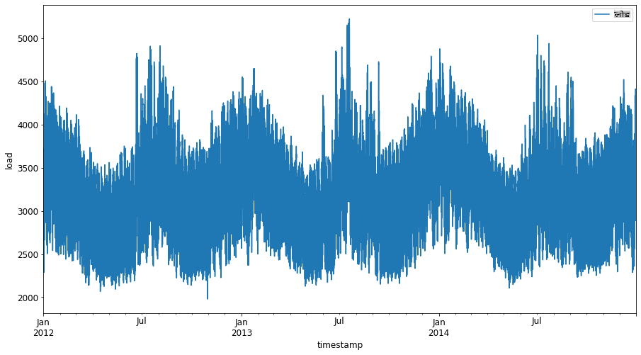
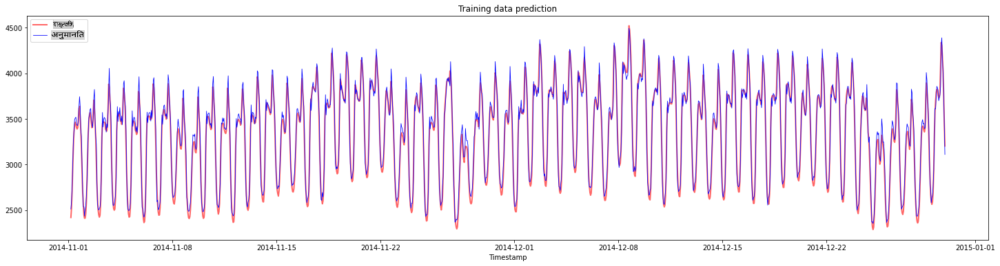
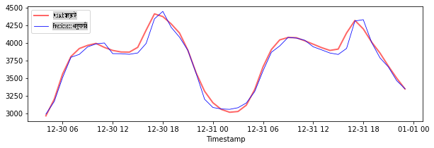
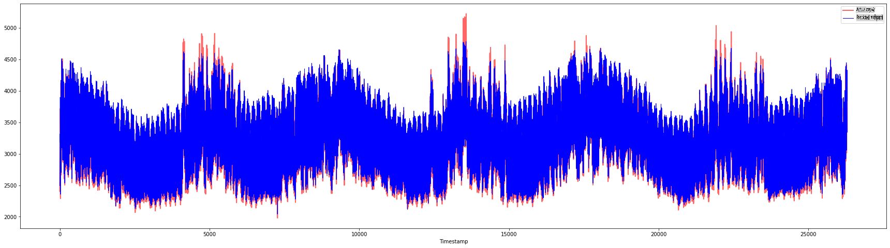

# सपोर्ट वेक्टर रिग्रेशर के साथ टाइम सीरीज फोरकास्टिंग

पिछले पाठ में, आपने ARIMA मॉडल का उपयोग करके टाइम सीरीज प्रेडिक्शन करना सीखा था। अब आप सपोर्ट वेक्टर रिग्रेशर मॉडल को देखेंगे, जो एक रिग्रेशर मॉडल है जिसका उपयोग निरंतर डेटा की भविष्यवाणी करने के लिए किया जाता है।

## [पूर्व-व्याख्यान क्विज़](https://gray-sand-07a10f403.1.azurestaticapps.net/quiz/51/)

## परिचय

इस पाठ में, आप रिग्रेशन के लिए [**SVM**: **S**upport **V**ector **M**achine](https://en.wikipedia.org/wiki/Support-vector_machine) के साथ मॉडल बनाने का एक विशिष्ट तरीका खोजेंगे, जिसे **SVR: Support Vector Regressor** कहा जाता है।

### टाइम सीरीज के संदर्भ में SVR [^1]

टाइम सीरीज प्रेडिक्शन में SVR के महत्व को समझने से पहले, यहाँ कुछ महत्वपूर्ण अवधारणाएँ हैं जिन्हें आपको जानना आवश्यक है:

- **रिग्रेशन:** सुपरवाइज्ड लर्निंग तकनीक जो दिए गए इनपुट सेट से निरंतर मानों की भविष्यवाणी करती है। विचार यह है कि फीचर स्पेस में एक कर्व (या लाइन) फिट करना जिसमें अधिकतम संख्या में डेटा पॉइंट्स हों। अधिक जानकारी के लिए [यहाँ क्लिक करें](https://en.wikipedia.org/wiki/Regression_analysis)।
- **सपोर्ट वेक्टर मशीन (SVM):** एक प्रकार का सुपरवाइज्ड मशीन लर्निंग मॉडल जो वर्गीकरण, रिग्रेशन और आउटलेयर डिटेक्शन के लिए उपयोग किया जाता है। मॉडल फीचर स्पेस में एक हाइपरप्लेन होता है, जो वर्गीकरण के मामले में एक सीमा के रूप में कार्य करता है, और रिग्रेशन के मामले में बेस्ट-फिट लाइन के रूप में कार्य करता है। SVM में, आमतौर पर एक कर्नल फंक्शन का उपयोग करके डेटासेट को उच्च आयामों की जगह में बदल दिया जाता है, ताकि उन्हें आसानी से विभाजित किया जा सके। SVMs पर अधिक जानकारी के लिए [यहाँ क्लिक करें](https://en.wikipedia.org/wiki/Support-vector_machine)।
- **सपोर्ट वेक्टर रिग्रेशर (SVR):** SVM का एक प्रकार, जो बेस्ट फिट लाइन (जो SVM के मामले में एक हाइपरप्लेन है) खोजने के लिए उपयोग किया जाता है जिसमें अधिकतम संख्या में डेटा पॉइंट्स होते हैं।

### SVR क्यों? [^1]

पिछले पाठ में आपने ARIMA के बारे में सीखा, जो टाइम सीरीज डेटा की भविष्यवाणी के लिए एक बहुत ही सफल सांख्यिकीय रैखिक विधि है। हालाँकि, कई मामलों में, टाइम सीरीज डेटा में *नॉन-लाइनियरिटी* होती है, जिसे रैखिक मॉडलों द्वारा मैप नहीं किया जा सकता। ऐसे मामलों में, रिग्रेशन कार्यों के लिए डेटा में नॉन-लाइनियरिटी पर विचार करने की SVM की क्षमता SVR को टाइम सीरीज फोरकास्टिंग में सफल बनाती है।

## अभ्यास - एक SVR मॉडल बनाना

डेटा तैयारी के पहले कुछ चरण पिछले पाठ [ARIMA](https://github.com/microsoft/ML-For-Beginners/tree/main/7-TimeSeries/2-ARIMA) के समान हैं।

इस पाठ में [_/working_](https://github.com/microsoft/ML-For-Beginners/tree/main/7-TimeSeries/3-SVR/working) फ़ोल्डर खोलें और [_notebook.ipynb_](https://github.com/microsoft/ML-For-Beginners/blob/main/7-TimeSeries/3-SVR/working/notebook.ipynb) फ़ाइल खोजें।[^2]

1. नोटबुक चलाएं और आवश्यक लाइब्रेरीज़ इम्पोर्ट करें: [^2]

   ```python
   import sys
   sys.path.append('../../')
   ```

   ```python
   import os
   import warnings
   import matplotlib.pyplot as plt
   import numpy as np
   import pandas as pd
   import datetime as dt
   import math
   
   from sklearn.svm import SVR
   from sklearn.preprocessing import MinMaxScaler
   from common.utils import load_data, mape
   ```

2. `/data/energy.csv` फ़ाइल से डेटा को एक पांडास डेटा फ्रेम में लोड करें और एक नज़र डालें: [^2]

   ```python
   energy = load_data('../../data')[['load']]
   ```

3. जनवरी 2012 से दिसंबर 2014 तक उपलब्ध सभी ऊर्जा डेटा को प्लॉट करें: [^2]

   ```python
   energy.plot(y='load', subplots=True, figsize=(15, 8), fontsize=12)
   plt.xlabel('timestamp', fontsize=12)
   plt.ylabel('load', fontsize=12)
   plt.show()
   ```

   

   अब, चलिए हमारा SVR मॉडल बनाते हैं।

### प्रशिक्षण और परीक्षण डेटा सेट बनाएं

अब आपका डेटा लोड हो गया है, इसलिए आप इसे ट्रेन और टेस्ट सेट में विभाजित कर सकते हैं। फिर आप डेटा को समय-चरण आधारित डेटासेट बनाने के लिए रीशेप करेंगे, जो SVR के लिए आवश्यक होगा। आप अपने मॉडल को ट्रेन सेट पर प्रशिक्षित करेंगे। मॉडल के प्रशिक्षण के बाद, आप इसके सटीकता का मूल्यांकन ट्रेनिंग सेट, टेस्टिंग सेट और फिर पूरे डेटासेट पर करेंगे ताकि समग्र प्रदर्शन देखा जा सके। आपको यह सुनिश्चित करने की आवश्यकता है कि टेस्ट सेट ट्रेनिंग सेट से एक बाद की अवधि को कवर करता है ताकि यह सुनिश्चित किया जा सके कि मॉडल भविष्य की समय अवधि से जानकारी प्राप्त न करे [^2] (एक स्थिति जिसे *ओवरफिटिंग* के रूप में जाना जाता है)।

1. 1 सितंबर से 31 अक्टूबर 2014 की दो महीने की अवधि को ट्रेनिंग सेट के लिए आवंटित करें। टेस्ट सेट में 1 नवंबर से 31 दिसंबर 2014 की दो महीने की अवधि शामिल होगी: [^2]

   ```python
   train_start_dt = '2014-11-01 00:00:00'
   test_start_dt = '2014-12-30 00:00:00'
   ```

2. अंतर को विज़ुअलाइज़ करें: [^2]

   ```python
   energy[(energy.index < test_start_dt) & (energy.index >= train_start_dt)][['load']].rename(columns={'load':'train'}) \
       .join(energy[test_start_dt:][['load']].rename(columns={'load':'test'}), how='outer') \
       .plot(y=['train', 'test'], figsize=(15, 8), fontsize=12)
   plt.xlabel('timestamp', fontsize=12)
   plt.ylabel('load', fontsize=12)
   plt.show()
   ```

   

### प्रशिक्षण के लिए डेटा तैयार करें

अब, आपको अपने डेटा को फ़िल्टर और स्केल करके प्रशिक्षण के लिए तैयार करने की आवश्यकता है। अपने डेटासेट को केवल उन समय अवधि और कॉलम को शामिल करने के लिए फ़िल्टर करें जिन्हें आपको चाहिए, और यह सुनिश्चित करने के लिए स्केलिंग करें कि डेटा 0,1 के अंतराल में प्रक्षेपित हो।

1. मूल डेटासेट को फ़िल्टर करें ताकि केवल उपर्युक्त समय अवधि प्रति सेट और केवल आवश्यक कॉलम 'लोड' और तारीख शामिल हों: [^2]

   ```python
   train = energy.copy()[(energy.index >= train_start_dt) & (energy.index < test_start_dt)][['load']]
   test = energy.copy()[energy.index >= test_start_dt][['load']]
   
   print('Training data shape: ', train.shape)
   print('Test data shape: ', test.shape)
   ```

   ```output
   Training data shape:  (1416, 1)
   Test data shape:  (48, 1)
   ```
   
2. ट्रेनिंग डेटा को (0, 1) की सीमा में स्केल करें: [^2]

   ```python
   scaler = MinMaxScaler()
   train['load'] = scaler.fit_transform(train)
   ```
   
4. अब, आप टेस्टिंग डेटा को स्केल करें: [^2]

   ```python
   test['load'] = scaler.transform(test)
   ```

### समय-चरणों के साथ डेटा बनाएं [^1]

SVR के लिए, आप इनपुट डेटा को `[batch, timesteps]`. So, you reshape the existing `train_data` and `test_data` के रूप में बदलते हैं ताकि एक नया आयाम हो जो समय-चरणों को संदर्भित करता है।

```python
# Converting to numpy arrays
train_data = train.values
test_data = test.values
```

इस उदाहरण के लिए, हम `timesteps = 5` लेते हैं। इसलिए, मॉडल के इनपुट पहले 4 समय-चरणों के डेटा हैं, और आउटपुट 5वें समय-चरण का डेटा होगा।

```python
timesteps=5
```

नेस्टेड सूची समग्रण का उपयोग करके प्रशिक्षण डेटा को 2D टेंसर में परिवर्तित करना:

```python
train_data_timesteps=np.array([[j for j in train_data[i:i+timesteps]] for i in range(0,len(train_data)-timesteps+1)])[:,:,0]
train_data_timesteps.shape
```

```output
(1412, 5)
```

टेस्टिंग डेटा को 2D टेंसर में परिवर्तित करना:

```python
test_data_timesteps=np.array([[j for j in test_data[i:i+timesteps]] for i in range(0,len(test_data)-timesteps+1)])[:,:,0]
test_data_timesteps.shape
```

```output
(44, 5)
```

प्रशिक्षण और परीक्षण डेटा से इनपुट और आउटपुट का चयन करना:

```python
x_train, y_train = train_data_timesteps[:,:timesteps-1],train_data_timesteps[:,[timesteps-1]]
x_test, y_test = test_data_timesteps[:,:timesteps-1],test_data_timesteps[:,[timesteps-1]]

print(x_train.shape, y_train.shape)
print(x_test.shape, y_test.shape)
```

```output
(1412, 4) (1412, 1)
(44, 4) (44, 1)
```

### SVR लागू करें [^1]

अब, SVR को लागू करने का समय है। इस कार्यान्वयन के बारे में अधिक पढ़ने के लिए, आप [इस दस्तावेज़](https://scikit-learn.org/stable/modules/generated/sklearn.svm.SVR.html) को संदर्भित कर सकते हैं। हमारे कार्यान्वयन के लिए, हम इन चरणों का पालन करते हैं:

  1. मॉडल को `SVR()` and passing in the model hyperparameters: kernel, gamma, c and epsilon
  2. Prepare the model for the training data by calling the `fit()` function
  3. Make predictions calling the `predict()` फ़ंक्शन को कॉल करके परिभाषित करें

अब हम एक SVR मॉडल बनाते हैं। यहाँ हम [RBF कर्नल](https://scikit-learn.org/stable/modules/svm.html#parameters-of-the-rbf-kernel) का उपयोग करते हैं, और हाइपरपैरामीटर गामा, C और एप्सिलॉन को क्रमशः 0.5, 10 और 0.05 के रूप में सेट करते हैं।

```python
model = SVR(kernel='rbf',gamma=0.5, C=10, epsilon = 0.05)
```

#### प्रशिक्षण डेटा पर मॉडल फिट करें [^1]

```python
model.fit(x_train, y_train[:,0])
```

```output
SVR(C=10, cache_size=200, coef0=0.0, degree=3, epsilon=0.05, gamma=0.5,
    kernel='rbf', max_iter=-1, shrinking=True, tol=0.001, verbose=False)
```

#### मॉडल प्रेडिक्शन बनाएं [^1]

```python
y_train_pred = model.predict(x_train).reshape(-1,1)
y_test_pred = model.predict(x_test).reshape(-1,1)

print(y_train_pred.shape, y_test_pred.shape)
```

```output
(1412, 1) (44, 1)
```

आपने अपना SVR बना लिया है! अब हमें इसका मूल्यांकन करना है।

### अपने मॉडल का मूल्यांकन करें [^1]

मूल्यांकन के लिए, पहले हम डेटा को हमारे मूल पैमाने पर वापस स्केल करेंगे। फिर, प्रदर्शन की जांच करने के लिए, हम मूल और भविष्यवाणी किए गए समय श्रृंखला प्लॉट को प्लॉट करेंगे, और MAPE परिणाम भी प्रिंट करेंगे।

भविष्यवाणी और मूल आउटपुट को स्केल करें:

```python
# Scaling the predictions
y_train_pred = scaler.inverse_transform(y_train_pred)
y_test_pred = scaler.inverse_transform(y_test_pred)

print(len(y_train_pred), len(y_test_pred))
```

```python
# Scaling the original values
y_train = scaler.inverse_transform(y_train)
y_test = scaler.inverse_transform(y_test)

print(len(y_train), len(y_test))
```

#### प्रशिक्षण और परीक्षण डेटा पर मॉडल प्रदर्शन की जांच करें [^1]

हम अपने प्लॉट के x-अक्ष में दिखाने के लिए डेटासेट से टाइमस्टैम्प निकालते हैं। ध्यान दें कि हम पहले ```timesteps-1``` मानों का उपयोग पहले आउटपुट के लिए इनपुट के रूप में कर रहे हैं, इसलिए आउटपुट के लिए टाइमस्टैम्प उसके बाद शुरू होंगे।

```python
train_timestamps = energy[(energy.index < test_start_dt) & (energy.index >= train_start_dt)].index[timesteps-1:]
test_timestamps = energy[test_start_dt:].index[timesteps-1:]

print(len(train_timestamps), len(test_timestamps))
```

```output
1412 44
```

प्रशिक्षण डेटा के लिए भविष्यवाणियों को प्लॉट करें:

```python
plt.figure(figsize=(25,6))
plt.plot(train_timestamps, y_train, color = 'red', linewidth=2.0, alpha = 0.6)
plt.plot(train_timestamps, y_train_pred, color = 'blue', linewidth=0.8)
plt.legend(['Actual','Predicted'])
plt.xlabel('Timestamp')
plt.title("Training data prediction")
plt.show()
```



प्रशिक्षण डेटा के लिए MAPE प्रिंट करें

```python
print('MAPE for training data: ', mape(y_train_pred, y_train)*100, '%')
```

```output
MAPE for training data: 1.7195710200875551 %
```

परीक्षण डेटा के लिए भविष्यवाणियों को प्लॉट करें

```python
plt.figure(figsize=(10,3))
plt.plot(test_timestamps, y_test, color = 'red', linewidth=2.0, alpha = 0.6)
plt.plot(test_timestamps, y_test_pred, color = 'blue', linewidth=0.8)
plt.legend(['Actual','Predicted'])
plt.xlabel('Timestamp')
plt.show()
```



परीक्षण डेटा के लिए MAPE प्रिंट करें

```python
print('MAPE for testing data: ', mape(y_test_pred, y_test)*100, '%')
```

```output
MAPE for testing data:  1.2623790187854018 %
```

🏆 आपके पास परीक्षण डेटासेट पर बहुत अच्छा परिणाम है!

### पूर्ण डेटासेट पर मॉडल प्रदर्शन की जांच करें [^1]

```python
# Extracting load values as numpy array
data = energy.copy().values

# Scaling
data = scaler.transform(data)

# Transforming to 2D tensor as per model input requirement
data_timesteps=np.array([[j for j in data[i:i+timesteps]] for i in range(0,len(data)-timesteps+1)])[:,:,0]
print("Tensor shape: ", data_timesteps.shape)

# Selecting inputs and outputs from data
X, Y = data_timesteps[:,:timesteps-1],data_timesteps[:,[timesteps-1]]
print("X shape: ", X.shape,"\nY shape: ", Y.shape)
```

```output
Tensor shape:  (26300, 5)
X shape:  (26300, 4) 
Y shape:  (26300, 1)
```

```python
# Make model predictions
Y_pred = model.predict(X).reshape(-1,1)

# Inverse scale and reshape
Y_pred = scaler.inverse_transform(Y_pred)
Y = scaler.inverse_transform(Y)
```

```python
plt.figure(figsize=(30,8))
plt.plot(Y, color = 'red', linewidth=2.0, alpha = 0.6)
plt.plot(Y_pred, color = 'blue', linewidth=0.8)
plt.legend(['Actual','Predicted'])
plt.xlabel('Timestamp')
plt.show()
```



```python
print('MAPE: ', mape(Y_pred, Y)*100, '%')
```

```output
MAPE:  2.0572089029888656 %
```

🏆 बहुत अच्छे प्लॉट्स, एक अच्छे सटीकता वाले मॉडल को दिखाते हुए। बहुत बढ़िया!

---

## 🚀चुनौती

- मॉडल बनाते समय हाइपरपैरामीटर (गामा, C, एप्सिलॉन) को ट्वीक करने का प्रयास करें और डेटा पर मूल्यांकन करें कि कौन सा हाइपरपैरामीटर सेट परीक्षण डेटा पर सर्वोत्तम परिणाम देता है। इन हाइपरपैरामीटर के बारे में अधिक जानने के लिए, आप [यहाँ](https://scikit-learn.org/stable/modules/svm.html#parameters-of-the-rbf-kernel) दस्तावेज़ संदर्भित कर सकते हैं।
- मॉडल के लिए विभिन्न कर्नल फंक्शन का उपयोग करने का प्रयास करें और उनके प्रदर्शन का विश्लेषण करें। एक सहायक दस्तावेज़ [यहाँ](https://scikit-learn.org/stable/modules/svm.html#kernel-functions) पाया जा सकता है।
- मॉडल को भविष्यवाणी करने के लिए पीछे देखने के लिए `timesteps` के विभिन्न मानों का उपयोग करने का प्रयास करें।

## [व्याख्यान के बाद का क्विज़](https://gray-sand-07a10f403.1.azurestaticapps.net/quiz/52/)

## समीक्षा और स्व-अध्ययन

यह पाठ टाइम सीरीज फोरकास्टिंग के लिए SVR के अनुप्रयोग को प्रस्तुत करने के लिए था। SVR के बारे में अधिक पढ़ने के लिए, आप [इस ब्लॉग](https://www.analyticsvidhya.com/blog/2020/03/support-vector-regression-tutorial-for-machine-learning/) को संदर्भित कर सकते हैं। यह [scikit-learn पर दस्तावेज़](https://scikit-learn.org/stable/modules/svm.html) सामान्य रूप से SVMs के बारे में अधिक व्यापक स्पष्टीकरण प्रदान करता है, [SVRs](https://scikit-learn.org/stable/modules/svm.html#regression) और अन्य कार्यान्वयन विवरण जैसे कि विभिन्न [कर्नल फंक्शन](https://scikit-learn.org/stable/modules/svm.html#kernel-functions) जो उपयोग किए जा सकते हैं, और उनके पैरामीटर।

## असाइनमेंट

[एक नया SVR मॉडल](assignment.md)

## क्रेडिट्स

[^1]: इस अनुभाग में पाठ, कोड और आउटपुट [@AnirbanMukherjeeXD](https://github.com/AnirbanMukherjeeXD) द्वारा योगदान किया गया था
[^2]: इस अनुभाग में पाठ, कोड और आउटपुट [ARIMA](https://github.com/microsoft/ML-For-Beginners/tree/main/7-TimeSeries/2-ARIMA) से लिया गया था

**अस्वीकरण**:
यह दस्तावेज़ मशीन आधारित एआई अनुवाद सेवाओं का उपयोग करके अनुवादित किया गया है। जबकि हम सटीकता के लिए प्रयासरत हैं, कृपया ध्यान दें कि स्वचालित अनुवाद में त्रुटियाँ या अशुद्धियाँ हो सकती हैं। मूल भाषा में दस्तावेज़ को प्रामाणिक स्रोत माना जाना चाहिए। महत्वपूर्ण जानकारी के लिए, पेशेवर मानव अनुवाद की सिफारिश की जाती है। इस अनुवाद के उपयोग से उत्पन्न किसी भी गलतफहमी या गलत व्याख्या के लिए हम उत्तरदायी नहीं हैं।