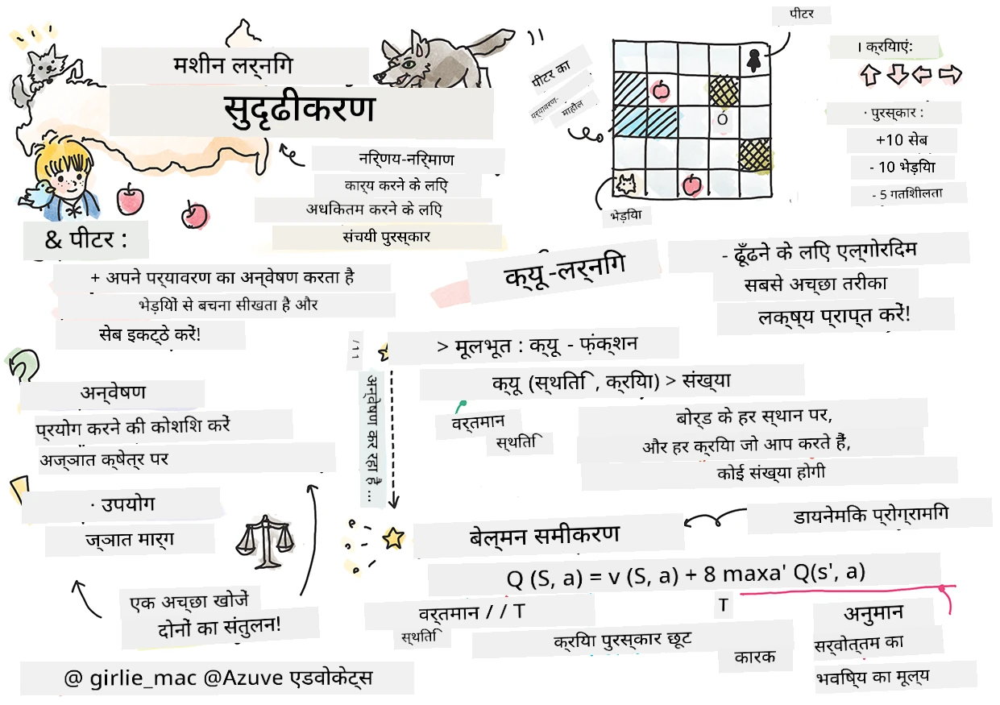
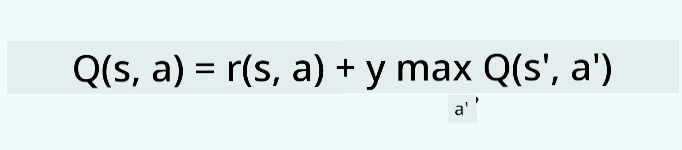
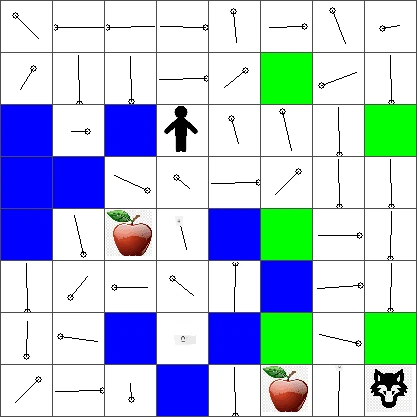

# सुदृढ़ीकरण शिक्षण और क्यू-लर्निंग का परिचय


> स्केचनोट द्वारा [Tomomi Imura](https://www.twitter.com/girlie_mac)

सुदृढ़ीकरण शिक्षण में तीन महत्वपूर्ण अवधारणाएँ शामिल हैं: एजेंट, कुछ अवस्थाएं, और प्रत्येक अवस्था के लिए कुछ क्रियाएं। किसी विशिष्ट अवस्था में कोई क्रिया करके, एजेंट को पुरस्कार (रिवार्ड) दिया जाता है। फिर से सोचिए कंप्यूटर गेम सुपर मारियो के बारे में। आप मारियो हैं, आप एक गेम स्तर में हैं, एक चट्टान के किनारे खड़े हैं। आपके ऊपर एक सिक्का है। आप मारियो हैं, एक गेम स्तर में, एक विशिष्ट स्थान पर ... वह आपकी अवस्था है। दाईं ओर एक कदम बढ़ाना (एक क्रिया) आपको किनारे से नीचे गिरा देगा, और इसका आपको कम अंक मिलेगा। हालांकि, जंप बटन दबाने पर आप एक पॉइंट स्कोर करेंगे और ज़िंदा रहेंगे। यह एक सकारात्मक परिणाम है और इसके लिए आपको सकारात्मक अंक मिलना चाहिए।

सुदृढ़ीकरण सीखने और एक सिम्युलेटर (गेम) का उपयोग करके, आप गेम को इस तरह खेलना सीख सकते हैं ताकि पुरस्कार को अधिकतम किया जा सके, अर्थात ज़िंदा रहना और अधिक से अधिक अंक जमा करना।

[](https://www.youtube.com/watch?v=lDq_en8RNOo)

> 🎥 ऊपर चित्र पर क्लिक करें और Dmitry से सुदृढ़ीकरण शिक्षण पर चर्चा सुनें

## [प्री-लेक्चर क्विज़](https://ff-quizzes.netlify.app/en/ml/)

## पूर्व आवश्यकताएँ और सेटअप

इस पाठ में, हम Python में कुछ कोड के साथ प्रयोग करेंगे। आपको इस पाठ का Jupyter Notebook कोड अपने कंप्यूटर या क्लाउड में कहीं भी चला पाने में सक्षम होना चाहिए।

आप [पाठ नोटबुक](https://github.com/microsoft/ML-For-Beginners/blob/main/8-Reinforcement/1-QLearning/notebook.ipynb) खोल सकते हैं और इस पाठ को सीखने के लिए इसका अनुसरण कर सकते हैं।

> **नोट:** यदि आप यह कोड क्लाउड से खोल रहे हैं, तो आपको [`rlboard.py`](https://github.com/microsoft/ML-For-Beginners/blob/main/8-Reinforcement/1-QLearning/rlboard.py) फाइल भी प्राप्त करनी होगी, जो नोटबुक के कोड में इस्तेमाल होती है। इसे नोटबुक के उसी डायरेक्टरी में जोड़ें।

## परिचय

इस पाठ में, हम **[पीटर और वुल्फ](https://en.wikipedia.org/wiki/Peter_and_the_Wolf)** की दुनिया का अन्वेषण करेंगे, जो रूसी संगीतकार, [Sergei Prokofiev](https://en.wikipedia.org/wiki/Sergei_Prokofiev) की एक संगीत परिकथा से प्रेरित है। हम **सुदृढ़ीकरण शिक्षण** का उपयोग करेंगे ताकि पीटर अपने पर्यावरण का अन्वेषण कर सके, स्वादिष्ट सेब इकट्ठा कर सके और भेड़िये से मिलना टाल सके।

**सुदृढ़ीकरण शिक्षण** (RL) एक सीखने की तकनीक है जो हमें कई प्रयोग करके किसी **एजेंट** का किसी **पर्यावरण** में इष्टतम व्यवहार सीखने देती है। इस पर्यावरण में एजेंट का एक **लक्ष्य** होना चाहिए, जिसका निर्धारण एक **पुरस्कार फलन** द्वारा किया जाता है।

## पर्यावरण

सरलता के लिए, आइए पीटर की दुनिया को `width` x `height` के एक वर्गाकार बोर्ड के रूप में मानते हैं, इस प्रकार:


इस बोर्ड के प्रत्येक सेल में हो सकता है:

* **भूमि**, जिस पर पीटर और अन्य जीव चल सकते हैं।
* **पानी**, जिस पर आप स्पष्ट रूप से नहीं चल सकते।
* एक **पेड़** या **घास**, जहाँ आप आराम कर सकते हैं।
* एक **सेब**, जो दर्शाता है कि पीटर अपने आप को खिलाने के लिए उसे पाकर खुश होगा।
* एक **भेड़िया**, जो खतरनाक है और बचना चाहिए।

एक अलग Python मॉड्यूल, [`rlboard.py`](https://github.com/microsoft/ML-For-Beginners/blob/main/8-Reinforcement/1-QLearning/rlboard.py), इसमें इस पर्यावरण के साथ काम करने के लिए कोड है। क्योंकि यह कोड हमारे अवधारणाओं को समझने के लिए आवश्यक नहीं है, हम मॉड्यूल को इम्पोर्ट करेंगे और इसका उपयोग नमूना बोर्ड बनाने के लिए करेंगे (कोड ब्लॉक 1):

```python
from rlboard import *

width, height = 8,8
m = Board(width,height)
m.randomize(seed=13)
m.plot()
```

यह कोड ऊपर के समान पर्यावरण की एक तस्वीर प्रिंट करेगा।

## क्रियाएं और नीति

हमारे उदाहरण में, पीटर का लक्ष्य सेब ढूंढना होगा, जबकि भेड़िये और अन्य बाधाओं से बचना होगा। इसके लिए, वह मूल रूप से तब तक चल सकता है जब तक उसे सेब न मिल जाए।

इसलिए, किसी भी स्थान पर, वह निम्नलिखित क्रियाओं में से एक चुन सकता है: ऊपर, नीचे, बाएँ और दाएँ।

हम उन क्रियाओं को एक डिक्शनरी के रूप में परिभाषित करेंगे, और उन्हें संबंधित निर्देशांक परिवर्तनों के जोड़े से मैप करेंगे। उदाहरण के लिए, दाईं ओर जाना (`R`) `(1,0)` जोड़े के अनुरूप होगा। (कोड ब्लॉक 2):

```python
actions = { "U" : (0,-1), "D" : (0,1), "L" : (-1,0), "R" : (1,0) }
action_idx = { a : i for i,a in enumerate(actions.keys()) }
```

संक्षेप में, इस परिदृश्य की रणनीति और लक्ष्य इस प्रकार हैं:

- **रणनीति**, हमारे एजेंट (पीटर) के लिए एक तथाकथित **नीति** द्वारा परिभाषित है। एक नीति एक फंक्शन है जो किसी भी ज्ञात अवस्था में क्रिया वापस करता है। हमारे मामले में, समस्या की स्थिति का प्रतिनिधित्व बोर्ड द्वारा किया जाता है, जिसमें खिलाड़ी का वर्तमान स्थान शामिल है।

- **लक्ष्य**, सुदृढ़ीकरण शिक्षण का उद्देश्य अंततः एक अच्छी नीति सीखना है जो हमें समस्या को कुशलतापूर्वक हल करने की अनुमति देगा। हालांकि, एक आधारभूत रूप में, चलिए सबसे सरल नीति जिसे हम कहते हैं **random walk** (यादृच्छिक चाल) को मानते हैं।

## रैंडम वॉक

पहले हम एक यादृच्छिक चाल रणनीति लागू करके हमारी समस्या को हल करेंगे। रैंडम वॉक के साथ, हम अनुमत क्रियाओं में से अगली क्रिया यादृच्छिक रूप से चुनेंगे, जब तक कि हम सेब तक न पहुँच जाएं (कोड ब्लॉक 3)।

1. नीचे दिए गए कोड से यादृच्छिक चाल लागू करें:

    ```python
    def random_policy(m):
        return random.choice(list(actions))
    
    def walk(m,policy,start_position=None):
        n = 0 # कदमों की संख्या
        # प्रारंभिक स्थिति सेट करें
        if start_position:
            m.human = start_position 
        else:
            m.random_start()
        while True:
            if m.at() == Board.Cell.apple:
                return n # सफलता!
            if m.at() in [Board.Cell.wolf, Board.Cell.water]:
                return -1 # भेड़िये द्वारा खाया गया या डूबा हुआ
            while True:
                a = actions[policy(m)]
                new_pos = m.move_pos(m.human,a)
                if m.is_valid(new_pos) and m.at(new_pos)!=Board.Cell.water:
                    m.move(a) # वास्तविक चाल करें
                    break
            n+=1
    
    walk(m,random_policy)
    ```

    `walk` कॉल संबंधित पथ की लंबाई लौटाएगी, जो रन के आधार पर भिन्न हो सकती है।

1. चल प्रयोग को कई बार (मान लें 100) चलाएं और परिणामी सांख्यिकी प्रिंट करें (कोड ब्लॉक 4):

    ```python
    def print_statistics(policy):
        s,w,n = 0,0,0
        for _ in range(100):
            z = walk(m,policy)
            if z<0:
                w+=1
            else:
                s += z
                n += 1
        print(f"Average path length = {s/n}, eaten by wolf: {w} times")
    
    print_statistics(random_policy)
    ```

    ध्यान दें कि पथ की औसत लंबाई लगभग 30-40 कदम है, जो कि काफी अधिक है, जबकि निकटतम सेब की औसत दूरी लगभग 5-6 कदम है।

    आप यह भी देख सकते हैं कि रैंडम वॉक के दौरान पीटर की चाल कैसी दिखती है:

    

## पुरस्कार फ़ंक्शन

हमारी नीति को अधिक बुद्धिमान बनाने के लिए, हमें समझना होगा कि कौन से कदम "बेहतर" हैं। इसके लिए, हमें अपना लक्ष्य परिभाषित करना होगा।

लक्ष्य को एक **पुरस्कार फ़ंक्शन** के रूप में परिभाषित किया जा सकता है, जो प्रत्येक अवस्था के लिए कुछ स्कोर मूल्य लौटाएगा। मूल्य जितना अधिक होगा, पुरस्कार फ़ंक्शन उतना बेहतर होगा। (कोड ब्लॉक 5)

```python
move_reward = -0.1
goal_reward = 10
end_reward = -10

def reward(m,pos=None):
    pos = pos or m.human
    if not m.is_valid(pos):
        return end_reward
    x = m.at(pos)
    if x==Board.Cell.water or x == Board.Cell.wolf:
        return end_reward
    if x==Board.Cell.apple:
        return goal_reward
    return move_reward
```

पुरस्कार फ़ंक्शन के बारे में एक दिलचस्प बात यह है कि अधिकांश मामलों में, *हमें केवल खेल के अंत में महत्वपूर्ण पुरस्कार मिलता है*। इसका मतलब है कि हमारा एल्गोरिदम किसी तरह "अच्छे" कदमों को याद रखना चाहिए जो अंत में सकारात्मक पुरस्कार की ओर ले जाते हैं, और उनकी महत्ता बढ़ानी चाहिए। इसी तरह, सभी कदम जो बुरी परिणामों की ओर ले जाते हैं उन्हें हतोत्साहित किया जाना चाहिए।

## क्यू-लर्निंग

एक एल्गोरिदम जिसे हम यहाँ चर्चा करेंगे, उसे **क्यू-लर्निंग** कहा जाता है। इस एल्गोरिदम में, नीति एक फ़ंक्शन (या डेटा संरचना) द्वारा परिभाषित होती है जिसे **क्यू-टेबल** कहा जाता है। यह किसी निर्दिष्ट अवस्था में प्रत्येक क्रिया की "भलाइ" को रिकॉर्ड करता है।

इसे क्यू-टेबल कहा जाता है क्योंकि इसे अक्सर एक तालिका या बहुआयामी सरणी के रूप में दर्शाना सुविधाजनक होता है। चूंकि हमारे बोर्ड के आकार `width` x `height` हैं, हम क्यू-टेबल को numpy सरणी के रूप में आकार `width` x `height` x `len(actions)` के साथ दर्शा सकते हैं: (कोड ब्लॉक 6)

```python
Q = np.ones((width,height,len(actions)),dtype=np.float)*1.0/len(actions)
```

ध्यान दें कि हम क्यू-टेबल के सभी मानों को समान मान के साथ प्रारंभ करते हैं, हमारे मामले में - 0.25। यह "यादृच्छिक चाल" नीति के अनुरूप है, क्योंकि प्रत्येक अवस्था में सभी चालें समान रूप से अच्छी हैं। हम इस क्यू-टेबल को `plot` फ़ंक्शन में पास कर सकते हैं ताकि बोर्ड पर इसे देखा जा सके: `m.plot(Q)`.


प्रत्येक सेल के केंद्र में एक "तीर" होता है जो पसंदीदा आंदोलन दिशा को दर्शाता है। चूंकि सभी दिशाएँ समान हैं, इसलिए एक डॉट दिखाया जाता है।

अब हमें सिमुलेशन चलाना होगा, अपने पर्यावरण का अन्वेषण करना होगा, और क्यू-टेबल मानों का एक बेहतर वितरण सीखना होगा, जो हमें सेब तक तेजी से पहुंचने में मदद करेगा।

## क्यू-लर्निंग का सार: बेलमैन समीकरण

जैसे ही हम चलना शुरू करेंगे, प्रत्येक क्रिया का एक संबंधित पुरस्कार होगा, अर्थात हम सैद्धांतिक रूप से सबसे उच्च तत्काल पुरस्कार के आधार पर अगली क्रिया चुन सकते हैं। लेकिन अधिकांश अवस्थाओं में, वह चाल हमारे लक्ष्य सेब तक पहुँचने को पूरा नहीं करेगी, इसलिए हम तुरंत नहीं तय कर सकते कि कौन सी दिशा बेहतर है।

> याद रखें कि तत्काल परिणाम महत्वपूर्ण नहीं है, बल्कि अंतिम परिणाम महत्वपूर्ण है, जिसे हम सिमुलेशन के अंत में प्राप्त करेंगे।

इस विलंबित पुरस्कार को ध्यान में रखने के लिए, हमें **[डायनेमिक प्रोग्रामिंग](https://en.wikipedia.org/wiki/Dynamic_programming)** के सिद्धांतों का उपयोग करना होगा, जो हमें हमारी समस्या को पुनरावृत्तिमूलक रूप से सोचने की अनुमति देते हैं।

मान लीजिए हम अब अवस्था *s* में हैं, और हम अगली अवस्था *s'* में जाना चाहते हैं। ऐसा करने पर, हम तत्काल पुरस्कार *r(s,a)* प्राप्त करेंगे, जो पुरस्कार फ़ंक्शन द्वारा परिभाषित है, साथ ही कुछ भविष्य के पुरस्कार भी। यदि हम मान लें कि हमारा क्यू-टेबल प्रत्येक क्रिया की "आकर्षकता" को सही ढंग से दर्शाता है, तो अवस्था *s'* में हम ऐसी क्रिया *a* चुनेंगे जिसका मान अधिकतम होगा *Q(s',a')*। इस प्रकार, अवस्था *s* में हमारे लिए सबसे अच्छा संभव भविष्य का पुरस्कार `max`<sub>a'</sub>*Q(s',a')* होगा (यह अधिकतम सभी संभावित क्रियाओं *a'* पर अवस्था *s'* में लिया जाता है)।

इससे क्यू-टेबल के मूल्य की गणना के लिए **बेलमैन सूत्र** मिलता है, जो अवस्था *s* में क्रिया *a* के लिए है:



यहाँ γ वह तथाकथित **छूट कारक** है जो यह निर्धारित करता है कि आपको वर्तमान पुरस्कार को भविष्य के पुरस्कार से कितनी प्राथमिकता देनी चाहिए।

## सीखने का एल्गोरिदम

उपरोक्त समीकरण के आधार पर, अब हम अपने सीखने वाले एल्गोरिदम के लिए छद्म-कोड लिख सकते हैं:

* क्यू-टेबल Q को सभी अवस्थाओं और क्रियाओं के लिए समान मानों से आरंभ करें
* सीखने की दर α ← 1 सेट करें
* सिमुलेशन को कई बार दोहराएं
   1. यादृच्छिक स्थान से शुरू करें
   1. दोहराएं
        1. अवस्था *s* पर एक क्रिया *a* चुनें
        2. क्रिया निष्पादित करें, नई अवस्था *s'* में जाएं
        3. यदि हम खेल के अंत की स्थिति में पहुँच गए हैं, या कुल पुरस्कार बहुत कम है - सिमुलेशन बंद करें  
        4. नई अवस्था पर पुरस्कार *r* गणना करें
        5. बेलमैन समीकरण के अनुसार क्यू-फ़ंक्शन अपडेट करें: *Q(s,a)* ← *(1-α)Q(s,a)+α(r+γ max<sub>a'</sub>Q(s',a'))*
        6. *s* ← *s'*
        7. कुल पुरस्कार अपडेट करें और α घटाएं।

## विवेचना बनाम अन्वेषण

ऊपर के एल्गोरिदम में, हमने यह निर्दिष्ट नहीं किया कि हम चरण 2.1 में क्रिया कैसे चुनेंगे। यदि हम क्रियाओं को यादृच्छिक रूप से चुनते हैं, तो हम पर्यावरण का यादृच्छिक **अन्वेषण** करेंगे, और हमें अक्सर मरना पड़ सकता है, साथ ही हम उन क्षेत्रों की जांच भी करेंगे जहाँ हम आमतौर पर नहीं जाते। एक वैकल्पिक दृष्टिकोण यह होगा कि हम पहले से ज्ञात क्यू-टेबल मानों का **शोषण** करें, और इसलिए अवस्था *s* पर सबसे अच्छी क्रिया (जिसके क्यू-टेबल मान अधिक हैं) चुनें। हालांकि, यह हमें अन्य अवस्थाओं का अन्वेषण करने से रोकेगा, और संभवतः हम सर्वोत्कृष्ट समाधान नहीं पा सकेंगे।

इसलिए, सबसे अच्छा तरीका यह है कि अन्वेषण और शोषण के बीच संतुलन बनाया जाए। इसे किया जा सकता है कि हम अवस्था *s* पर क्रिया को उन क्यू-टेबल मानों के अनुपात में चुनें। शुरुआत में, जब क्यू-टेबल के सभी मान समान होंगे, तो यह यादृच्छिक चयन के समान होगा, लेकिन जैसे-जैसे हम पर्यावरण के बारे में अधिक सीखेंगे, हम अधिक संभावना के साथ इष्टतम मार्ग का पालन करेंगे, जबकि एजेंट को कभी-कभी अनदेखे रास्ते चुनने की अनुमति भी देंगे।

## Python कार्यान्वयन

अब हम सीखने वाले एल्गोरिदम को लागू करने के लिए तैयार हैं। इसके पहले, हमें ऐसी फ़ंक्शन की भी आवश्यकता है जो क्यू-टेबल में मनमाने नंबरों को संबंधित क्रियाओं के लिए संभावनाओं के वेक्टर में बदल सके।

1. `probs()` नामक फ़ंक्शन बनाएं:

    ```python
    def probs(v,eps=1e-4):
        v = v-v.min()+eps
        v = v/v.sum()
        return v
    ```

    हम कुछ `eps` को मूल वेक्टर में जोड़ते हैं ताकि प्रारंभिक स्थिति में, जब वेक्टर के सभी घटक समान होते हैं, तो 0 से विभाजन से बचा जा सके।

इसे 5000 प्रयोगों, जिन्हें **इपोक्स** भी कहा जाता है, के माध्यम से चलाएं: (कोड ब्लॉक 8)
```python
    for epoch in range(5000):
    
        # प्रारंभिक बिंदु चुनें
        m.random_start()
        
        # यात्रा शुरू करें
        n=0
        cum_reward = 0
        while True:
            x,y = m.human
            v = probs(Q[x,y])
            a = random.choices(list(actions),weights=v)[0]
            dpos = actions[a]
            m.move(dpos,check_correctness=False) # हम खिलाड़ी को बोर्ड के बाहर जाने की अनुमति देते हैं, जो एपिसोड को समाप्त करता है
            r = reward(m)
            cum_reward += r
            if r==end_reward or cum_reward < -1000:
                lpath.append(n)
                break
            alpha = np.exp(-n / 10e5)
            gamma = 0.5
            ai = action_idx[a]
            Q[x,y,ai] = (1 - alpha) * Q[x,y,ai] + alpha * (r + gamma * Q[x+dpos[0], y+dpos[1]].max())
            n+=1
```

इस एल्गोरिदम को निष्पादित करने के बाद, क्यू-टेबल उन मानों के साथ अद्यतन हो जाएगा जो प्रत्येक चरण पर विभिन्न क्रियाओं की आकर्षकता को परिभाषित करते हैं। हम क्यू-टेबल को अपने बोर्ड पर चलने की इच्छित दिशा दिखाने वाले वेक्टर को प्रत्येक सेल पर प्लॉट करके विज़ुअलाइज़ कर सकते हैं। सरलता के लिए, हम तीर के सिर की जगह एक छोटा वृत्त बनाते हैं।



## नीति की जांच

चूंकि क्यू-टेबल प्रत्येक अवस्था में प्रत्येक क्रिया की "आकर्षकता" सूचिबद्ध करता है, इसका उपयोग हमारे विश्व में कुशल नेविगेशन को परिभाषित करने के लिए काफी सरल है। सबसे सरल मामले में, हम सबसे उच्च क्यू-टेबल मान वाले क्रिया का चयन कर सकते हैं: (कोड ब्लॉक 9)

```python
def qpolicy_strict(m):
        x,y = m.human
        v = probs(Q[x,y])
        a = list(actions)[np.argmax(v)]
        return a

walk(m,qpolicy_strict)
```


> यदि आप ऊपर दिया गया कोड कई बार चलाते हैं, तो आप देख सकते हैं कि कभी-कभी यह "अटक" जाता है, और आपको इसे रोकने के लिए नोटबुक में STOP बटन दबाना पड़ता है। ऐसा इसलिए होता है क्योंकि ऐसी स्थितियां हो सकती हैं जब दो राज्य अनुकूल Q-मूल्य के संदर्भ में एक-दूसरे की "मुद्दा" करते हैं, जिस स्थिति में एजेंट अनंत काल तक उन राज्यों के बीच घूमता रहता है।

## 🚀चुनौती

> **कार्य 1:** `walk` फ़ंक्शन को इस प्रकार संशोधित करें कि पथ की अधिकतम लंबाई एक निश्चित संख्या के चरणों (मान लीजिए, 100) तक सीमित हो, और ऊपर दिए गए कोड को समय-समय पर यह मान लौटाते हुए देखें।

> **कार्य 2:** `walk` फ़ंक्शन को इस तरह बदलें कि यह उन स्थानों पर वापस न जाए जहां यह पहले ही जा चुका हो। इससे `walk` के लूप में फंसने से बचा जा सकेगा, हालांकि, एजेंट फिर भी एक ऐसे स्थान पर "फंस" सकता है जहाँ से वह निकल न सके।

## नेविगेशन

एक बेहतर नेविगेशन नीति वही होगी जिसका हमने प्रशिक्षण के दौरान उपयोग किया था, जो शोषण और अन्वेषण का संयोजन करती है। इस नीति में, हम प्रत्येक क्रिया को निश्चित संभावना के साथ चुनेंगे, जो Q-टेबल में मानों के अनुपात में होगी। यह रणनीति एजेंट को पहले से देखे गए स्थान पर वापस लौटने का कारण बन सकती है, लेकिन जैसा कि नीचे के कोड में देख सकते हैं, यह वांछित स्थान तक बहुत छोटा औसत पथ प्रदान करती है (ध्यान दें कि `print_statistics` सिमुलेशन को 100 बार चलाता है): (कोड ब्लॉक 10)

```python
def qpolicy(m):
        x,y = m.human
        v = probs(Q[x,y])
        a = random.choices(list(actions),weights=v)[0]
        return a

print_statistics(qpolicy)
```

इस कोड को चलाने के बाद, आपको पहले की तुलना में बहुत छोटा औसत पथ लंबाई प्राप्त होनी चाहिए, लगभग 3-6 के बीच।

## सीखने की प्रक्रिया की जांच

जैसा कि हमने उल्लेख किया है, सीखने की प्रक्रिया समस्या स्थान की संरचना के बारे में प्राप्त ज्ञान के अन्वेषण और उपयोग के बीच संतुलन है। हमने देखा कि सीखने के परिणाम (एजेंट को लक्ष्य तक छोटा पथ खोजने में मदद करने की क्षमता) बेहतर हुए हैं, लेकिन यह देखना भी दिलचस्प है कि सीखने की प्रक्रिया के दौरान औसत पथ लंबाई कैसे व्यवहार करती है:


सीखने को इस प्रकार संक्षेपित किया जा सकता है:

- **औसत पथ लंबाई बढ़ती है।** यहाँ हम देखते हैं कि पहले औसत पथ लंबाई बढ़ती है। यह संभवतः इसलिए होता है क्योंकि जब हमें पर्यावरण के बारे में कुछ पता नहीं होता, तो हम खराब राज्यों, पानी या भेड़िये में फंस सकते हैं। जैसे-जैसे हम अधिक सीखते हैं और इस ज्ञान का उपयोग करते हैं, हम पर्यावरण का अधिक अन्वेषण कर सकते हैं, लेकिन फिर भी हमें सेबों के स्थान के बारे में पूरी जानकारी नहीं होती।

- **जैसे-जैसे हम अधिक सीखते हैं, पथ लंबाई घटती है।** जब हम पर्याप्त सीख जाते हैं, तो एजेंट के लिए लक्ष्य प्राप्त करना आसान हो जाता है, और पथ लंबाई घटने लगती है। फिर भी, हम अन्वेषण के लिए खुले होते हैं, इसलिए हम अक्सर सर्वोत्तम पथ से भटक जाते हैं, और नए विकल्प खोजते हैं, जिससे पथ औप्टिमल से लंबा हो जाता है।

- **लंबाई अचानक बढ़ जाती है।** इस ग्राफ़ पर हम यह भी देखते हैं कि कुछ बिंदु पर लंबाई अचानक बढ़ गई। यह प्रक्रिया की यादृच्छिक प्रकृति को दर्शाता है, और यह कि कभी-कभी हम Q-टेबल गुणांक को नए मानों से अधिलेखित करके "खराब" कर देते हैं। आदर्श रूप से, इसे सीखने की दर को घटाकर कम किया जाना चाहिए (उदाहरण के लिए, प्रशिक्षण के अंत में, हम केवल Q-टेबल मानों को थोड़े मान से समायोजित करते हैं)।

कुल मिलाकर, यह याद रखना महत्वपूर्ण है कि सीखने की प्रक्रिया की सफलता और गुणवत्ता काफी हद तक कुछ पैरामीटरों पर निर्भर करती है, जैसे कि सीखने की दर, सीखने की दर में कमी, और डिस्काउंट फैक्टर। इन्हें अक्सर **हाइपरपैरामीटर** कहा जाता है, ताकि उन्हें उन **पैरामीटरों** से अलग किया जा सके जिन्हें हम प्रशिक्षण के दौरान अनुकूलित करते हैं (उदाहरण के लिए, Q-टेबल गुणांक)। सबसे अच्छे हाइपरपैरामीटर मान खोजने की प्रक्रिया को **हाइपरपैरामीटर ऑप्टिमाइज़ेशन** कहा जाता है, और यह एक अलग विषय का हकदार है।

## [प्रसारण के बाद क्विज़](https://ff-quizzes.netlify.app/en/ml/)

## असाइनमेंट
[एक अधिक यथार्थवादी दुनिया](assignment.md)

---

<!-- CO-OP TRANSLATOR DISCLAIMER START -->
**अस्वीकरण**:
इस दस्तावेज़ का अनुवाद AI अनुवाद सेवा [Co-op Translator](https://github.com/Azure/co-op-translator) का उपयोग करके किया गया है। जबकि हम सटीकता के लिए प्रयास करते हैं, कृपया ध्यान दें कि स्वचालित अनुवादों में त्रुटियाँ या अशुद्धियाँ हो सकती हैं। मूल दस्तावेज़ अपनी मूल भाषा में ही प्रामाणिक स्रोत माना जाना चाहिए। महत्वपूर्ण जानकारी के लिए, पेशेवर मानव अनुवाद की सिफारिश की जाती है। इस अनुवाद के उपयोग से उत्पन्न किसी भी गलतफहमी या गलत व्याख्या के लिए हम उत्तरदायी नहीं हैं।
<!-- CO-OP TRANSLATOR DISCLAIMER END -->