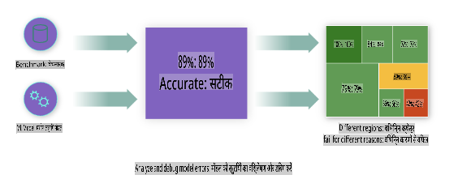
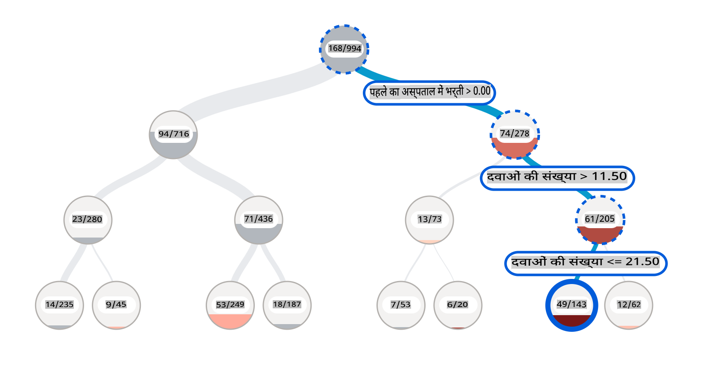
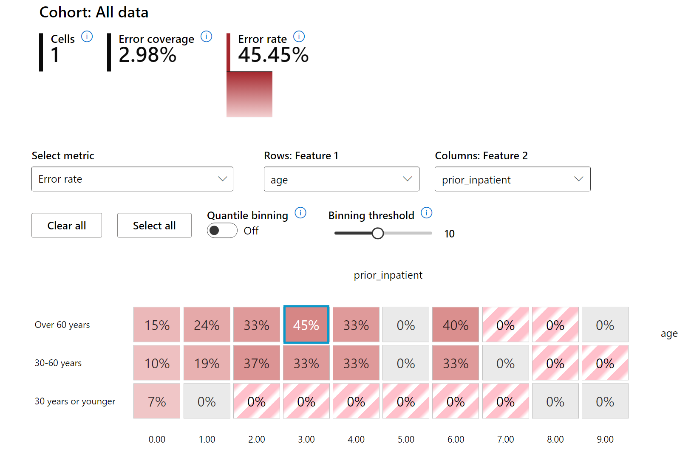
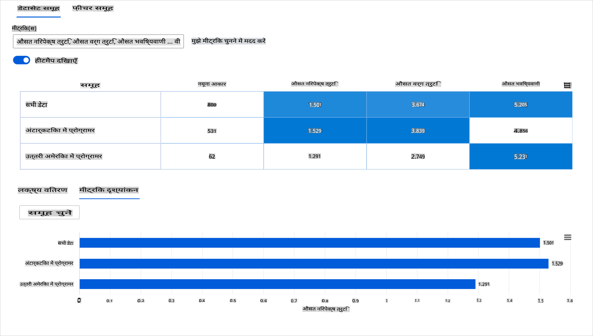
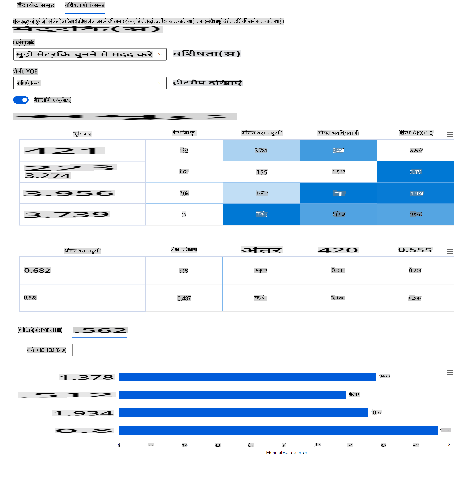
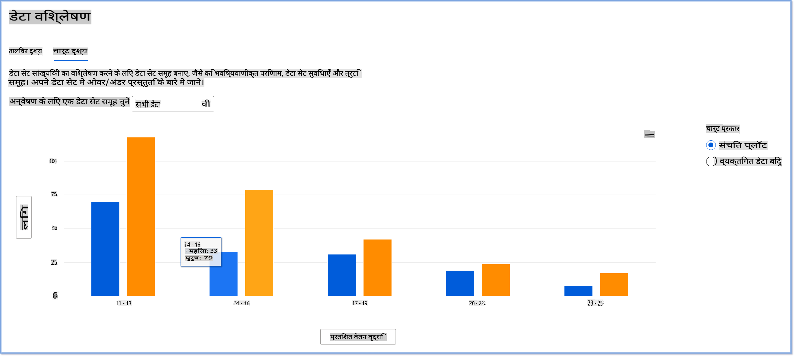

# पोस्टस्क्रिप्ट: मशीन लर्निंग में मॉडल डिबगिंग का उपयोग जिम्मेदार एआई डैशबोर्ड घटकों के साथ

## [प्री-लेक्चर क्विज](https://gray-sand-07a10f403.1.azurestaticapps.net/quiz/5/)

## परिचय

मशीन लर्निंग हमारे रोजमर्रा के जीवन को प्रभावित करता है। एआई हमारे समाज के सबसे महत्वपूर्ण सिस्टमों में अपनी जगह बना रहा है, जैसे कि स्वास्थ्य सेवा, वित्त, शिक्षा, और रोजगार। उदाहरण के लिए, सिस्टम और मॉडल दैनिक निर्णय लेने के कार्यों में शामिल होते हैं, जैसे कि स्वास्थ्य देखभाल निदान या धोखाधड़ी का पता लगाना। परिणामस्वरूप, एआई में प्रगति के साथ-साथ तेजी से अपनाने के साथ सामाजिक अपेक्षाएं और बढ़ती विनियमन बदल रहे हैं। हम लगातार देखते हैं कि एआई सिस्टम किस प्रकार अपेक्षाओं को पूरा नहीं करते हैं; वे नई चुनौतियों को उजागर करते हैं; और सरकारें एआई समाधानों को विनियमित करना शुरू कर रही हैं। इसलिए, यह महत्वपूर्ण है कि इन मॉडलों का विश्लेषण किया जाए ताकि सभी के लिए निष्पक्ष, विश्वसनीय, समावेशी, पारदर्शी, और जवाबदेह परिणाम प्रदान किए जा सकें।

इस पाठ्यक्रम में, हम व्यावहारिक उपकरणों को देखेंगे जिनका उपयोग यह आकलन करने के लिए किया जा सकता है कि क्या किसी मॉडल में जिम्मेदार एआई मुद्दे हैं। पारंपरिक मशीन लर्निंग डिबगिंग तकनीकें आमतौर पर मात्रात्मक गणनाओं पर आधारित होती हैं, जैसे कि संपूर्ण सटीकता या औसत त्रुटि हानि। कल्पना करें कि जब आप इन मॉडलों को बनाने के लिए उपयोग कर रहे डेटा में कुछ जनसांख्यिकी की कमी हो, जैसे कि नस्ल, लिंग, राजनीतिक दृष्टिकोण, धर्म, या असंतुलित रूप से प्रतिनिधित्व करता हो। जब मॉडल का आउटपुट किसी जनसांख्यिकी को पक्षपाती रूप से व्याख्या किया जाता है, तो क्या होगा? इससे संवेदनशील विशेषता समूहों की अधिक या कम प्रतिनिधित्व की संभावना होती है, जिससे मॉडल में निष्पक्षता, समावेशिता, या विश्वसनीयता के मुद्दे उत्पन्न हो सकते हैं। एक और कारक है, मशीन लर्निंग मॉडल को ब्लैक बॉक्स माना जाता है, जिससे यह समझना और समझाना मुश्किल हो जाता है कि मॉडल की भविष्यवाणी को क्या प्रेरित करता है। ये सभी चुनौतियां डेटा वैज्ञानिकों और एआई डेवलपर्स का सामना करती हैं जब उनके पास मॉडल की निष्पक्षता या विश्वसनीयता का डिबग और आकलन करने के लिए पर्याप्त उपकरण नहीं होते हैं।

इस पाठ में, आप अपने मॉडलों को डिबग करने के बारे में जानेंगे:

- **त्रुटि विश्लेषण**: यह पहचानें कि आपके डेटा वितरण में मॉडल की उच्च त्रुटि दर कहाँ है।
- **मॉडल ओवरव्यू**: विभिन्न डेटा समूहों के बीच तुलनात्मक विश्लेषण करें ताकि आपके मॉडल के प्रदर्शन मेट्रिक्स में असमानताएं खोजी जा सकें।
- **डेटा विश्लेषण**: यह जांचें कि आपके डेटा में कहाँ अधिक या कम प्रतिनिधित्व हो सकता है जो आपके मॉडल को एक डेटा जनसांख्यिकी के पक्ष में कर सकता है।
- **फीचर महत्व**: समझें कि कौन सी विशेषताएं आपके मॉडल की भविष्यवाणियों को वैश्विक स्तर या स्थानीय स्तर पर प्रेरित कर रही हैं।

## पूर्वापेक्षा

पूर्वापेक्षा के रूप में, कृपया [डेवलपर्स के लिए जिम्मेदार एआई उपकरण](https://www.microsoft.com/ai/ai-lab-responsible-ai-dashboard) की समीक्षा करें।

> 

## त्रुटि विश्लेषण

सटीकता मापने के लिए पारंपरिक मॉडल प्रदर्शन मेट्रिक्स आमतौर पर सही और गलत भविष्यवाणियों पर आधारित गणनाएं होती हैं। उदाहरण के लिए, यह निर्धारित करना कि एक मॉडल 89% समय सटीक है और त्रुटि हानि 0.001 है, एक अच्छा प्रदर्शन माना जा सकता है। त्रुटियां अक्सर आपके आधारभूत डेटा सेट में समान रूप से वितरित नहीं होती हैं। आपको 89% मॉडल सटीकता स्कोर मिल सकता है लेकिन पता चलता है कि आपके डेटा के विभिन्न क्षेत्रों में मॉडल 42% समय विफल हो रहा है। इन विफलता पैटर्न के परिणामस्वरूप कुछ डेटा समूहों के साथ निष्पक्षता या विश्वसनीयता के मुद्दे हो सकते हैं। यह समझना आवश्यक है कि मॉडल कहाँ अच्छा प्रदर्शन कर रहा है और कहाँ नहीं। डेटा क्षेत्रों में जहाँ आपके मॉडल में बड़ी संख्या में गलतियाँ हैं, वे एक महत्वपूर्ण डेटा जनसांख्यिकी हो सकते हैं।

RAI डैशबोर्ड पर त्रुटि विश्लेषण घटक विभिन्न समूहों के बीच मॉडल विफलता को एक पेड़ दृश्य के साथ दिखाता है। यह आपके डेटा सेट में उच्च त्रुटि दर वाले क्षेत्रों या विशेषताओं की पहचान करने में सहायक होता है। यह देखकर कि अधिकांश मॉडल की गलतियाँ कहाँ से आ रही हैं, आप मूल कारण की जांच शुरू कर सकते हैं। आप डेटा के समूह भी बना सकते हैं जिन पर विश्लेषण किया जा सके। ये डेटा समूह डिबगिंग प्रक्रिया में मदद करते हैं यह निर्धारित करने में कि एक समूह में मॉडल का प्रदर्शन अच्छा क्यों है और दूसरे में गलत क्यों है।

पेड़ मानचित्र पर दृश्य संकेतक समस्या क्षेत्रों को तेजी से खोजने में मदद करते हैं। उदाहरण के लिए, पेड़ नोड का गहरा लाल रंग जितना गहरा होता है, त्रुटि दर उतनी ही अधिक होती है।

हीट मैप एक और दृश्य कार्यक्षमता है जिसका उपयोग उपयोगकर्ता त्रुटि दर की जांच करने के लिए एक या दो विशेषताओं का उपयोग करके कर सकते हैं ताकि मॉडल की त्रुटियों में योगदानकर्ता का पता लगाया जा सके।

त्रुटि विश्लेषण का उपयोग करें जब आपको आवश्यकता हो:

* यह गहराई से समझें कि मॉडल विफलताएँ डेटा सेट और कई इनपुट और फीचर आयामों में कैसे वितरित होती हैं।
* समग्र प्रदर्शन मेट्रिक्स को तोड़ें ताकि त्रुटिपूर्ण समूहों की स्वचालित रूप से खोज की जा सके और लक्षित सुधारात्मक कदमों की जानकारी प्राप्त हो सके।

## मॉडल ओवरव्यू

एक मशीन लर्निंग मॉडल के प्रदर्शन का मूल्यांकन करने के लिए इसके व्यवहार की समग्र समझ प्राप्त करना आवश्यक है। यह त्रुटि दर, सटीकता, रिकॉल, प्रिसिजन, या MAE (मीन एब्सोल्यूट एरर) जैसे एक से अधिक मेट्रिक्स की समीक्षा करके प्राप्त किया जा सकता है ताकि प्रदर्शन मेट्रिक्स में असमानताएं पाई जा सकें। एक प्रदर्शन मेट्रिक बहुत अच्छा लग सकता है, लेकिन एक अन्य मेट्रिक में गलतियाँ उजागर हो सकती हैं। इसके अलावा, पूरे डेटा सेट या समूहों में मेट्रिक्स की तुलना करने से यह पता चलता है कि मॉडल कहाँ अच्छा प्रदर्शन कर रहा है और कहाँ नहीं। यह विशेष रूप से महत्वपूर्ण है संवेदनशील और असंवेदनशील विशेषताओं (जैसे, रोगी की नस्ल, लिंग, या आयु) के बीच मॉडल के प्रदर्शन को देखने के लिए ताकि संभावित अनुचितता को उजागर किया जा सके जो मॉडल में हो सकती है। उदाहरण के लिए, यह पता लगाना कि मॉडल एक समूह में अधिक गलत है जिसमें संवेदनशील विशेषताएं हैं, मॉडल में संभावित अनुचितता को उजागर कर सकता है।

RAI डैशबोर्ड के मॉडल ओवरव्यू घटक न केवल समूह में डेटा प्रतिनिधित्व के प्रदर्शन मेट्रिक्स का विश्लेषण करने में मदद करते हैं, बल्कि यह उपयोगकर्ताओं को विभिन्न समूहों के बीच मॉडल के व्यवहार की तुलना करने की क्षमता भी देता है।

घटक की फीचर-आधारित विश्लेषण कार्यक्षमता उपयोगकर्ताओं को एक विशेष फीचर के भीतर डेटा उपसमूहों को संकीर्ण करने की अनुमति देती है ताकि सूक्ष्म स्तर पर विसंगतियों की पहचान की जा सके। उदाहरण के लिए, डैशबोर्ड में उपयोगकर्ता-चयनित फीचर (जैसे, *"time_in_hospital < 3"* या *"time_in_hospital >= 7"*) के लिए स्वचालित रूप से समूह उत्पन्न करने के लिए अंतर्निहित बुद्धिमत्ता है। यह उपयोगकर्ता को बड़े डेटा समूह से एक विशेष फीचर को अलग करने की अनुमति देता है ताकि यह देखा जा सके कि क्या यह मॉडल के गलत परिणामों का प्रमुख प्रभावक है।

मॉडल ओवरव्यू घटक दो प्रकार के असमानता मेट्रिक्स का समर्थन करता है:

**मॉडल प्रदर्शन में असमानता**: ये मेट्रिक्स का सेट डेटा के उपसमूहों में चयनित प्रदर्शन मेट्रिक के मानों में असमानता (अंतर) की गणना करता है। यहाँ कुछ उदाहरण हैं:

* सटीकता दर में असमानता
* त्रुटि दर में असमानता
* प्रिसिजन में असमानता
* रिकॉल में असमानता
* मीन एब्सोल्यूट एरर (MAE) में असमानता

**चयन दर में असमानता**: यह मेट्रिक उपसमूहों के बीच चयन दर (अनुकूल भविष्यवाणी) में अंतर को शामिल करता है। इसका एक उदाहरण ऋण स्वीकृति दरों में असमानता है। चयन दर का अर्थ है प्रत्येक वर्ग में डेटा बिंदुओं का अंश जिसे 1 के रूप में वर्गीकृत किया गया है (बाइनरी वर्गीकरण में) या भविष्यवाणी मानों का वितरण (पुनरावृत्ति में)।

## डेटा विश्लेषण

> "यदि आप डेटा को लंबे समय तक प्रताड़ित करेंगे, तो यह किसी भी चीज़ को स्वीकार कर लेगा" - रोनाल्ड कोस

यह कथन अत्यधिक लगता है, लेकिन यह सच है कि डेटा को किसी भी निष्कर्ष का समर्थन करने के लिए हेरफेर किया जा सकता है। ऐसी हेरफेर कभी-कभी अनजाने में हो सकती है। हम सभी मनुष्य हैं, और हमारे पास पूर्वाग्रह होते हैं, और यह अक्सर कठिन होता है यह जानना कि कब आप डेटा में पूर्वाग्रह ला रहे हैं। एआई और मशीन लर्निंग में निष्पक्षता सुनिश्चित करना एक जटिल चुनौती बनी हुई है।

डेटा पारंपरिक मॉडल प्रदर्शन मेट्रिक्स के लिए एक बड़ा अंधा स्थान है। आपके पास उच्च सटीकता स्कोर हो सकते हैं, लेकिन यह हमेशा आपके डेटा सेट में मौजूद अंतर्निहित डेटा पूर्वाग्रह को प्रतिबिंबित नहीं करता है। उदाहरण के लिए, यदि किसी कंपनी में कार्यकारी पदों पर 27% महिलाएं और 73% पुरुष हैं, तो एक नौकरी विज्ञापन एआई मॉडल जो इस डेटा पर प्रशिक्षित है, वरिष्ठ स्तर की नौकरी पदों के लिए मुख्य रूप से पुरुष दर्शकों को लक्षित कर सकता है। इस डेटा में असंतुलन ने मॉडल की भविष्यवाणी को एक लिंग के पक्ष में झुका दिया। यह एक निष्पक्षता मुद्दा प्रकट करता है जहाँ एआई मॉडल में लिंग पूर्वाग्रह है।

RAI डैशबोर्ड पर डेटा विश्लेषण घटक उन क्षेत्रों की पहचान करने में मदद करता है जहाँ डेटा सेट में अधिक या कम प्रतिनिधित्व है। यह उपयोगकर्ताओं को डेटा असंतुलन या किसी विशेष डेटा समूह की कमी से उत्पन्न त्रुटियों और निष्पक्षता मुद्दों के मूल कारण का निदान करने में मदद करता है। यह उपयोगकर्ताओं को पूर्वानुमानित और वास्तविक परिणामों, त्रुटि समूहों, और विशिष्ट विशेषताओं के आधार पर डेटा सेट को देखने की क्षमता देता है। कभी-कभी एक कम प्रतिनिधित्व वाले डेटा समूह की खोज यह भी प्रकट कर सकती है कि मॉडल अच्छी तरह से नहीं सीख रहा है, इसलिए उच्च त्रुटियां हैं। एक मॉडल में डेटा पूर्वाग्रह का होना न केवल एक निष्पक्षता मुद्दा है बल्कि यह दिखाता है कि मॉडल समावेशी या विश्वसनीय नहीं है।

डेटा विश्लेषण का उपयोग करें जब आपको आवश्यकता हो:

* विभिन्न फिल्टर का चयन करके अपने डेटा सेट के आंकड़ों का अन्वेषण करें ताकि अपने डेटा को विभिन्न आयामों (जिसे समूह भी कहा जाता है) में विभाजित किया जा सके।
* विभिन्न समूहों और फीचर समूहों के बीच अपने डेटा सेट का वितरण समझें।
* यह निर्धारित करें कि क्या आपके निष्कर्ष जो निष्पक्षता, त्रुटि विश्लेषण, और कारणता से संबंधित हैं (अन्य डैशबोर्ड घटकों से प्राप्त) आपके डेटा सेट के वितरण का परिणाम हैं।
* यह तय करें कि प्रतिनिधित्व मुद्दों, लेबल शोर, फीचर शोर, लेबल पूर्वाग्रह, और समान कारकों से उत्पन्न त्रुटियों को कम करने के लिए किन क्षेत्रों में अधिक डेटा एकत्र करना है।

## मॉडल व्याख्यात्मकता

मशीन लर्निंग मॉडल अक्सर ब्लैक बॉक्स होते हैं। यह समझना कि कौन सी प्रमुख डेटा विशेषताएँ मॉडल की भविष्यवाणी को प्रेरित करती हैं, चुनौतीपूर्ण हो सकता है। यह महत्वपूर्ण है कि एक मॉडल क्यों एक निश्चित भविष्यवाणी करता है, इसके लिए पारदर्शिता प्रदान की जाए। उदाहरण के लिए, यदि एक एआई सिस्टम भविष्यवाणी करता है कि एक मधुमेह रोगी 30 दिनों से कम समय में अस्पताल में फिर से भर्ती होने के जोखिम में है, तो इसे अपनी भविष्यवाणी का समर्थन करने वाला डेटा प्रदान करने में सक्षम होना चाहिए। सहायक डेटा संकेतक पारदर्शिता लाते हैं ताकि चिकित्सक या अस्पताल सूचित निर्णय लेने में सक्षम हों। इसके अलावा, एक व्यक्तिगत रोगी के लिए मॉडल ने भविष्यवाणी क्यों की, इसे समझाने में सक्षम होना स्वास्थ्य विनियमों के साथ जवाबदेही सक्षम करता है। जब आप मशीन लर्निंग मॉडलों का उपयोग ऐसे तरीकों से करते हैं जो लोगों के जीवन को प्रभावित करते हैं, तो यह समझना और समझाना महत्वपूर्ण है कि मॉडल के व्यवहार को क्या प्रेरित करता है। मॉडल व्याख्यात्मकता और व्याख्यात्मकता निम्नलिखित परिदृश्यों में प्रश्नों का उत्तर देने में मदद करती है:

* मॉडल डिबगिंग: मेरे मॉडल ने यह गलती क्यों की? मैं अपने मॉडल को कैसे सुधार सकता हूँ?
* मानव-एआई सहयोग: मैं मॉडल के निर्णयों को कैसे समझ सकता हूँ और उन पर विश्वास कर सकता हूँ?
* नियामक अनुपालन: क्या मेरा मॉडल कानूनी आवश्यकताओं को पूरा करता है?

RAI डैशबोर्ड का फीचर महत्व घटक आपको डिबग करने और यह समझने में मदद करता है कि एक मॉडल भविष्यवाणियाँ कैसे करता है। यह मशीन लर्निंग पेशेवरों और निर्णयकर्ताओं के लिए एक उपयोगी उपकरण भी है ताकि वे यह समझा सकें और दिखा सकें कि कौन सी विशेषताएँ मॉडल के व्यवहार को प्रभावित कर रही हैं, ताकि नियामक अनुपालन के लिए सबूत प्रदान किया जा सके। इसके बाद, उपयोगकर्ता वैश्विक और स्थानीय व्याख्याओं दोनों का अन्वेषण कर सकते हैं ताकि यह सत्यापित किया जा सके कि कौन सी विशेषताएँ मॉडल की भविष्यवाणी को प्रेरित करती हैं। वैश्विक व्याख्याएँ शीर्ष विशेषताओं को सूचीबद्ध करती हैं जिन्होंने मॉडल की समग्र भविष्यवाणी को प्रभावित किया। स्थानीय व्याख्याएँ यह दिखाती हैं कि कौन सी विशेषताएँ एक व्यक्तिगत मामले के लिए मॉडल की भविष्यवाणी को प्रेरित करती हैं। स्थानीय व्याख्याओं का मूल्यांकन करने की क्षमता एक विशिष्ट मामले को डिबग या ऑडिट करने में भी सहायक होती है ताकि यह बेहतर समझा जा सके और व्याख्या की जा सके कि मॉडल ने एक सटीक या गलत भविष्यवाणी क्यों की।

* वैश्विक व्याख्याएँ: उदाहरण के लिए, कौन सी विशेषताएँ मधुमेह अस्पताल पुनः भर्ती मॉडल के समग्र व्यवहार को प्रभावित करती हैं?
* स्थानीय व्याख्याएँ: उदाहरण के लिए, एक 60 वर्ष से अधिक आयु के मधुमेह रोगी के साथ पूर्व अस्पताल में भर्ती होने वाले को 30 दिनों के भीतर अस्पताल में पुनः भर्ती होने की भविष्यवाणी क्यों की गई?

विभिन्न समूहों के बीच मॉडल के प्रदर्शन की जांच करने की प्रक्रिया में, फीचर महत्व यह दिखाता है कि समूहों में एक फीचर का कितना प्रभाव है। यह तुलना करते समय विसंगतियों को प्रकट करने में मदद करता है कि मॉडल की गलत भविष्यवाणियों को प्रेरित करने में फीचर का कितना प्रभाव है। फीचर महत्व घटक यह दिखा सकता है कि एक फीचर में कौन सी मानें मॉडल के परिणाम को सकारात्मक या नकारात्मक रूप से प्रभावित करती हैं। उदाहरण के लिए, यदि मॉडल ने एक गलत भविष्यवाणी की, तो घटक आपको यह ड्रिल करने और यह पता लगाने की क्षमता देता है कि भविष्यवाणी को कौन सी विशेषताएँ या विशेषता मानें प्रेरित करती हैं। यह स्तर का विवरण न केवल डिबगिंग में मदद करता है बल्कि ऑडिटिंग स्थितियों में पारदर्शिता और जवाबदेही प्रदान करता है। अंत में, घटक आपको निष्पक्षता मुद्दों की पहचान करने में मदद कर सकता है। उदाहरण के लिए, यदि एक संवेदनशील विशेषता जैसे कि जातीयता या लिंग मॉडल की भविष्यवाणी को प्रेरित करने में अत्यधिक प्रभावशाली है, तो यह मॉडल में नस्ल या लिंग पूर्वाग्रह का संकेत हो सकता है।

व्याख्यात्मकता का उपयोग करें जब आपको आवश्यकता हो:

* यह निर्धारित करें कि आपके एआई सिस्टम की भविष्यवाणियाँ कितनी विश्वसनीय हैं यह समझकर कि कौन सी विशेषताएँ भविष्यवाणियों के लिए सबसे महत्वपूर्ण हैं।
* अपने मॉडल को समझकर और यह पहचानकर कि क्या मॉडल स्वस्थ विशेषताओं का उपयोग कर रहा है या केवल झूठे सहसंबंधों का उपयोग कर रहा है, अपने मॉडल को डिबग करने के लिए दृष्टिकोण अपनाएँ।
* यह समझकर संभावित अनुचितता के स्रोतों का पता लगाएँ कि क्या मॉडल संवेदनशील विशेषताओं या उनके साथ

**अस्वीकरण**:
यह दस्तावेज़ मशीन-आधारित एआई अनुवाद सेवाओं का उपयोग करके अनुवादित किया गया है। जबकि हम सटीकता के लिए प्रयास करते हैं, कृपया ध्यान दें कि स्वचालित अनुवादों में त्रुटियां या अशुद्धियाँ हो सकती हैं। मूल भाषा में मूल दस्तावेज़ को प्रामाणिक स्रोत माना जाना चाहिए। महत्वपूर्ण जानकारी के लिए, पेशेवर मानव अनुवाद की सिफारिश की जाती है। इस अनुवाद के उपयोग से उत्पन्न किसी भी गलतफहमी या गलत व्याख्या के लिए हम उत्तरदायी नहीं हैं।