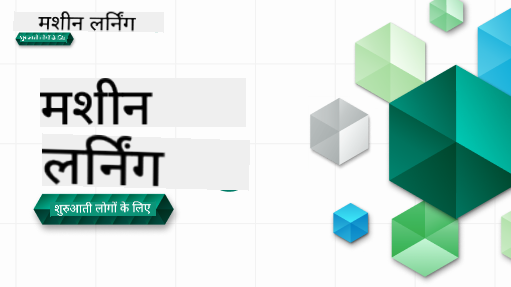

<!--
CO_OP_TRANSLATOR_METADATA:
{
  "original_hash": "7a13afb3674838f557d61f8d67e4d5f8",
  "translation_date": "2025-10-24T09:00:30+00:00",
  "source_file": "README.md",
  "language_code": "hi"
}
-->

### 🌐 बहुभाषी समर्थन

#### GitHub Action के माध्यम से समर्थित (स्वचालित और हमेशा अद्यतन)

<!-- CO-OP TRANSLATOR LANGUAGES TABLE START -->
[अरबी](../ar/README.md) | [बंगाली](../bn/README.md) | [बुल्गेरियन](../bg/README.md) | [बर्मी (म्यांमार)](../my/README.md) | [चीनी (सरलीकृत)](../zh/README.md) | [चीनी (पारंपरिक, हांगकांग)](../hk/README.md) | [चीनी (पारंपरिक, मकाऊ)](../mo/README.md) | [चीनी (पारंपरिक, ताइवान)](../tw/README.md) | [क्रोएशियन](../hr/README.md) | [चेक](../cs/README.md) | [डेनिश](../da/README.md) | [डच](../nl/README.md) | [एस्टोनियन](../et/README.md) | [फिनिश](../fi/README.md) | [फ्रेंच](../fr/README.md) | [जर्मन](../de/README.md) | [ग्रीक](../el/README.md) | [हिब्रू](../he/README.md) | [हिंदी](./README.md) | [हंगेरियन](../hu/README.md) | [इंडोनेशियन](../id/README.md) | [इतालवी](../it/README.md) | [जापानी](../ja/README.md) | [कोरियाई](../ko/README.md) | [लिथुआनियन](../lt/README.md) | [मलय](../ms/README.md) | [मराठी](../mr/README.md) | [नेपाली](../ne/README.md) | [नॉर्वेजियन](../no/README.md) | [फारसी (फारसी)](../fa/README.md) | [पोलिश](../pl/README.md) | [पुर्तगाली (ब्राजील)](../br/README.md) | [पुर्तगाली (पुर्तगाल)](../pt/README.md) | [पंजाबी (गुरमुखी)](../pa/README.md) | [रोमानियन](../ro/README.md) | [रूसी](../ru/README.md) | [सर्बियन (सिरिलिक)](../sr/README.md) | [स्लोवाक](../sk/README.md) | [स्लोवेनियन](../sl/README.md) | [स्पेनिश](../es/README.md) | [स्वाहिली](../sw/README.md) | [स्वीडिश](../sv/README.md) | [टैगालोग (फिलिपिनो)](../tl/README.md) | [तमिल](../ta/README.md) | [थाई](../th/README.md) | [तुर्की](../tr/README.md) | [यूक्रेनी](../uk/README.md) | [उर्दू](../ur/README.md) | [वियतनामी](../vi/README.md)
<!-- CO-OP TRANSLATOR LANGUAGES TABLE END -->

#### हमारे समुदाय से जुड़ें

हमारे पास एक डिस्कॉर्ड "Learn with AI" सीरीज चल रही है, अधिक जानें और [Learn with AI Series](https://aka.ms/learnwithai/discord) में 18 - 30 सितंबर, 2025 तक शामिल हों। आपको डेटा साइंस के लिए GitHub Copilot का उपयोग करने के टिप्स और ट्रिक्स मिलेंगे।

# शुरुआती लोगों के लिए मशीन लर्निंग - एक पाठ्यक्रम

> 🌍 दुनिया भर की संस्कृतियों के माध्यम से मशीन लर्निंग का अन्वेषण करें 🌍

Microsoft के Cloud Advocates को **मशीन लर्निंग** के बारे में 12-सप्ताह, 26-पाठ का पाठ्यक्रम पेश करने में खुशी हो रही है। इस पाठ्यक्रम में, आप **क्लासिक मशीन लर्निंग** के बारे में जानेंगे, मुख्य रूप से Scikit-learn का उपयोग करते हुए और डीप लर्निंग से बचते हुए, जिसे हमारे [AI for Beginners' पाठ्यक्रम](https://aka.ms/ai4beginners) में शामिल किया गया है। इन पाठों को हमारे ['Data Science for Beginners' पाठ्यक्रम](https://aka.ms/ds4beginners) के साथ जोड़ें!

हमारे साथ दुनिया भर की यात्रा करें क्योंकि हम इन क्लासिक तकनीकों को दुनिया के विभिन्न क्षेत्रों के डेटा पर लागू करते हैं। प्रत्येक पाठ में प्री- और पोस्ट-लेसन क्विज़, लिखित निर्देश, समाधान, असाइनमेंट और अधिक शामिल हैं। हमारा प्रोजेक्ट-आधारित शिक्षण आपको निर्माण करते हुए सीखने की अनुमति देता है, जो नए कौशल को बनाए रखने का एक सिद्ध तरीका है।

**✍️ हमारे लेखकों को हार्दिक धन्यवाद** Jen Looper, Stephen Howell, Francesca Lazzeri, Tomomi Imura, Cassie Breviu, Dmitry Soshnikov, Chris Noring, Anirban Mukherjee, Ornella Altunyan, Ruth Yakubu और Amy Boyd

**🎨 हमारे चित्रकारों को भी धन्यवाद** Tomomi Imura, Dasani Madipalli, और Jen Looper

**🙏 विशेष धन्यवाद 🙏 हमारे Microsoft Student Ambassador लेखकों, समीक्षकों और सामग्री योगदानकर्ताओं को**, विशेष रूप से Rishit Dagli, Muhammad Sakib Khan Inan, Rohan Raj, Alexandru Petrescu, Abhishek Jaiswal, Nawrin Tabassum, Ioan Samuila, और Snigdha Agarwal

**🤩 अतिरिक्त आभार Microsoft Student Ambassadors Eric Wanjau, Jasleen Sondhi, और Vidushi Gupta को हमारे R पाठों के लिए!**

# शुरुआत कैसे करें

इन चरणों का पालन करें:
1. **रेपो को फोर्क करें**: इस पेज के ऊपर-दाईं ओर "Fork" बटन पर क्लिक करें।
2. **रेपो को क्लोन करें**:   `git clone https://github.com/microsoft/ML-For-Beginners.git`

> [इस कोर्स के लिए सभी अतिरिक्त संसाधन हमारे Microsoft Learn संग्रह में खोजें](https://learn.microsoft.com/en-us/collections/qrqzamz1nn2wx3?WT.mc_id=academic-77952-bethanycheum)

> 🔧 **मदद चाहिए?** हमारे [Troubleshooting Guide](TROUBLESHOOTING.md) में इंस्टॉलेशन, सेटअप और पाठ चलाने से संबंधित सामान्य समस्याओं के समाधान देखें।

**[छात्र](https://aka.ms/student-page)**, इस पाठ्यक्रम का उपयोग करने के लिए, पूरे रेपो को अपने GitHub खाते में फोर्क करें और अभ्यास को स्वयं या समूह के साथ पूरा करें:

- प्री-लेक्चर क्विज़ से शुरू करें।
- लेक्चर पढ़ें और गतिविधियों को पूरा करें, प्रत्येक ज्ञान जांच पर रुकें और विचार करें।
- पाठों को समझकर प्रोजेक्ट बनाने का प्रयास करें बजाय समाधान कोड चलाने के; हालांकि वह कोड `/solution` फोल्डर्स में प्रत्येक प्रोजेक्ट-उन्मुख पाठ में उपलब्ध है।
- पोस्ट-लेक्चर क्विज़ लें।
- चुनौती पूरी करें।
- असाइनमेंट पूरा करें।
- एक पाठ समूह पूरा करने के बाद, [Discussion Board](https://github.com/microsoft/ML-For-Beginners/discussions) पर जाएं और "लाउड में सीखें" द्वारा उपयुक्त PAT रूब्रिक भरें। 'PAT' एक प्रगति मूल्यांकन उपकरण है जो एक रूब्रिक है जिसे आप अपनी सीखने को आगे बढ़ाने के लिए भरते हैं। आप अन्य PATs पर प्रतिक्रिया भी दे सकते हैं ताकि हम एक साथ सीख सकें।

> आगे की पढ़ाई के लिए, हम इन [Microsoft Learn](https://docs.microsoft.com/en-us/users/jenlooper-2911/collections/k7o7tg1gp306q4?WT.mc_id=academic-77952-leestott) मॉड्यूल और लर्निंग पाथ्स का अनुसरण करने की सिफारिश करते हैं।

**शिक्षकों**, हमने इस पाठ्यक्रम का उपयोग करने के तरीके पर [कुछ सुझाव शामिल किए हैं](for-teachers.md)।

---

## वीडियो वॉकथ्रू

कुछ पाठ छोटे वीडियो के रूप में उपलब्ध हैं। आप इन सभी को पाठों में इन-लाइन पा सकते हैं, या [Microsoft Developer YouTube चैनल पर ML for Beginners प्लेलिस्ट](https://aka.ms/ml-beginners-videos) पर क्लिक करके नीचे दी गई छवि पर पा सकते हैं।

---

## टीम से मिलें

**Gif द्वारा** [Mohit Jaisal](https://linkedin.com/in/mohitjaisal)

> 🎥 ऊपर दी गई छवि पर क्लिक करें परियोजना और इसे बनाने वाले लोगों के बारे में वीडियो के लिए!

---

## शिक्षण पद्धति

हमने इस पाठ्यक्रम को बनाते समय दो शिक्षण सिद्धांतों को चुना है: यह सुनिश्चित करना कि यह हाथों-हाथ **प्रोजेक्ट-आधारित** है और इसमें **बार-बार क्विज़** शामिल हैं। इसके अलावा, इस पाठ्यक्रम में एक सामान्य **थीम** है जो इसे एकजुटता प्रदान करती है।

सुनिश्चित करके कि सामग्री प्रोजेक्ट्स के साथ मेल खाती है, प्रक्रिया छात्रों के लिए अधिक आकर्षक बन जाती है और अवधारणाओं की प्रतिधारण बढ़ जाती है। इसके अलावा, कक्षा से पहले एक कम-जोखिम क्विज़ छात्र को एक विषय सीखने के इरादे की ओर सेट करता है, जबकि कक्षा के बाद दूसरा क्विज़ आगे प्रतिधारण सुनिश्चित करता है। यह पाठ्यक्रम लचीला और मजेदार बनाया गया है और इसे पूरे या आंशिक रूप से लिया जा सकता है। प्रोजेक्ट्स छोटे से शुरू होते हैं और 12-सप्ताह के चक्र के अंत तक धीरे-धीरे जटिल हो जाते हैं। इस पाठ्यक्रम में ML के वास्तविक दुनिया के अनुप्रयोगों पर एक पोस्टस्क्रिप्ट भी शामिल है, जिसे अतिरिक्त क्रेडिट के रूप में या चर्चा के आधार के रूप में उपयोग किया जा सकता है।

> हमारा [Code of Conduct](CODE_OF_CONDUCT.md), [Contributing](CONTRIBUTING.md), [Translation](TRANSLATIONS.md), और [Troubleshooting](TROUBLESHOOTING.md) दिशानिर्देश खोजें। हम आपकी रचनात्मक प्रतिक्रिया का स्वागत करते हैं!

## प्रत्येक पाठ में शामिल है

- वैकल्पिक स्केच नोट
- वैकल्पिक पूरक वीडियो
- वीडियो वॉकथ्रू (कुछ पाठों में ही)
- [प्री-लेक्चर वार्मअप क्विज़](https://ff-quizzes.netlify.app/en/ml/)
- लिखित पाठ
- प्रोजेक्ट-आधारित पाठों के लिए, प्रोजेक्ट बनाने के लिए चरण-दर-चरण गाइड
- ज्ञान जांच
- एक चुनौती
- पूरक पढ़ाई
- असाइनमेंट
- [पोस्ट-लेक्चर क्विज़](https://ff-quizzes.netlify.app/en/ml/)

> **भाषाओं के बारे में एक नोट**: ये पाठ मुख्य रूप से Python में लिखे गए हैं, लेकिन कई R में भी उपलब्ध हैं। R पाठ पूरा करने के लिए, `/solution` फोल्डर पर जाएं और R पाठ खोजें। इनमें .rmd एक्सटेंशन होता है जो **R Markdown** फ़ाइल का प्रतिनिधित्व करता है जिसे `Markdown दस्तावेज़` में `कोड चंक्स` (R या अन्य भाषाओं के) और `YAML हेडर` (जो आउटपुट जैसे PDF को प्रारूपित करने का मार्गदर्शन करता है) के एम्बेडिंग के रूप में सरलता से परिभाषित किया जा सकता है। इस प्रकार, यह डेटा विज्ञान के लिए एक आदर्श लेखन ढांचा के रूप में कार्य करता है क्योंकि यह आपको अपने कोड, उसके आउटपुट और अपने विचारों को Markdown में लिखने की अनुमति देता है। इसके अलावा, R Markdown दस्तावेज़ों को PDF, HTML, या Word जैसे आउटपुट प्रारूपों में प्रस्तुत किया जा सकता है।

> **क्विज़ के बारे में एक नोट**: सभी क्विज़ [Quiz App फोल्डर](../../quiz-app) में शामिल हैं, कुल 52 क्विज़ प्रत्येक में तीन प्रश्नों के साथ। वे पाठों के भीतर से जुड़े हुए हैं लेकिन क्विज़ ऐप को स्थानीय रूप से चलाया जा सकता है; `quiz-app` फोल्डर में निर्देशों का पालन करें इसे स्थानीय रूप से होस्ट करने या Azure पर तैनात करने के लिए।

| पाठ संख्या |                             विषय                              |                   पाठ समूह                   | सीखने के उद्देश्य                                                                                                             |                                                              लिंक्ड पाठ                                                               |                        लेखक                        |
| :-----------: | :------------------------------------------------------------: | :-------------------------------------------------: | ------------------------------------------------------------------------------------------------------------------------------- | :--------------------------------------------------------------------------------------------------------------------------------------: | :--------------------------------------------------: |
|      01       |                मशीन लर्निंग का परिचय                |      [Introduction](1-Introduction/README.md)       | मशीन लर्निंग के पीछे के बुनियादी सिद्धांतों को जानें                                                                                |                                             [Lesson](1-Introduction/1-intro-to-ML/README.md)                                             |                       मुहम्मद                       |
|      02       |                मशीन लर्निंग का इतिहास                 |      [Introduction](1-Introduction/README.md)       | इस क्षेत्र के पीछे के इतिहास को जानें                                                                                         |                                            [Lesson](1-Introduction/2-history-of-ML/README.md)                                            |                     जेन और एमी                      |
|      03       |                 निष्पक्षता और मशीन लर्निंग                  |      [Introduction](1-Introduction/README.md)       | मशीन लर्निंग मॉडल बनाते और लागू करते समय छात्रों को निष्पक्षता के महत्वपूर्ण दार्शनिक मुद्दों पर विचार करना चाहिए। |                                              [Lesson](1-Introduction/3-fairness/README.md)                                               |                        तोमोमी                        |
|      04       |                मशीन लर्निंग के लिए तकनीकें                 |      [Introduction](1-Introduction/README.md)       | मशीन लर्निंग शोधकर्ता मॉडल बनाने के लिए कौन-कौन सी तकनीकें उपयोग करते हैं?                                                                       |                                          [Lesson](1-Introduction/4-techniques-of-ML/README.md)                                           |                    क्रिस और जेन                     |
|      05       |                   रिग्रेशन का परिचय                   |        [Regression](2-Regression/README.md)         | रिग्रेशन मॉडल के लिए Python और Scikit-learn के साथ शुरुआत करें                                                                  |         [Python](2-Regression/1-Tools/README.md) • [R](../../2-Regression/1-Tools/solution/R/lesson_1.html)         |      जेन • एरिक वानजाउ       |
|      06       |                उत्तरी अमेरिकी कद्दू की कीमतें 🎃                |        [Regression](2-Regression/README.md)         | मशीन लर्निंग की तैयारी के लिए डेटा को विज़ुअलाइज़ और साफ करें                                                                                  |          [Python](2-Regression/2-Data/README.md) • [R](../../2-Regression/2-Data/solution/R/lesson_2.html)          |      जेन • एरिक वानजाउ       |
|      07       |                उत्तरी अमेरिकी कद्दू की कीमतें 🎃                |        [Regression](2-Regression/README.md)         | रेखीय और बहुपद रिग्रेशन मॉडल बनाएं                                                                                   |        [Python](2-Regression/3-Linear/README.md) • [R](../../2-Regression/3-Linear/solution/R/lesson_3.html)        |      जेन और दिमित्री • एरिक वानजाउ       |
|      08       |                उत्तरी अमेरिकी कद्दू की कीमतें 🎃                |        [Regression](2-Regression/README.md)         | एक लॉजिस्टिक रिग्रेशन मॉडल बनाएं                                                                                               |     [Python](2-Regression/4-Logistic/README.md) • [R](../../2-Regression/4-Logistic/solution/R/lesson_4.html)      |      जेन • एरिक वानजाउ       |
|      09       |                          एक वेब ऐप 🔌                          |           [Web App](3-Web-App/README.md)            | अपने प्रशिक्षित मॉडल का उपयोग करने के लिए एक वेब ऐप बनाएं                                                                                       |                                                 [Python](3-Web-App/1-Web-App/README.md)                                                  |                         जेन                          |
|      10       |                 वर्गीकरण का परिचय                 |    [Classification](4-Classification/README.md)     | अपने डेटा को साफ करें, तैयार करें और विज़ुअलाइज़ करें; वर्गीकरण का परिचय                                                            | [Python](4-Classification/1-Introduction/README.md) • [R](../../4-Classification/1-Introduction/solution/R/lesson_10.html)  | जेन और कैसी • एरिक वानजाउ |
|      11       |             स्वादिष्ट एशियाई और भारतीय व्यंजन 🍜             |    [Classification](4-Classification/README.md)     | वर्गीकरणकर्ताओं का परिचय                                                                                                     | [Python](4-Classification/2-Classifiers-1/README.md) • [R](../../4-Classification/2-Classifiers-1/solution/R/lesson_11.html) | जेन और कैसी • एरिक वानजाउ |
|      12       |             स्वादिष्ट एशियाई और भारतीय व्यंजन 🍜             |    [Classification](4-Classification/README.md)     | अधिक वर्गीकरणकर्ता                                                                                                                | [Python](4-Classification/3-Classifiers-2/README.md) • [R](../../4-Classification/3-Classifiers-2/solution/R/lesson_12.html) | जेन और कैसी • एरिक वानजाउ |
|      13       |             स्वादिष्ट एशियाई और भारतीय व्यंजन 🍜             |    [Classification](4-Classification/README.md)     | अपने मॉडल का उपयोग करके एक अनुशंसा वेब ऐप बनाएं                                                                                    |                                              [Python](4-Classification/4-Applied/README.md)                                              |                         जेन                          |
|      14       |                   क्लस्टरिंग का परिचय                   |        [Clustering](5-Clustering/README.md)         | अपने डेटा को साफ करें, तैयार करें और विज़ुअलाइज़ करें; क्लस्टरिंग का परिचय                                                                |         [Python](5-Clustering/1-Visualize/README.md) • [R](../../5-Clustering/1-Visualize/solution/R/lesson_14.html)         |      जेन • एरिक वानजाउ       |
|      15       |              नाइजीरियाई संगीत स्वाद का अन्वेषण 🎧              |        [Clustering](5-Clustering/README.md)         | के-मीन्स क्लस्टरिंग विधि का अन्वेषण करें                                                                                           |           [Python](5-Clustering/2-K-Means/README.md) • [R](../../5-Clustering/2-K-Means/solution/R/lesson_15.html)           |      जेन • एरिक वानजाउ       |
|      16       |        प्राकृतिक भाषा प्रसंस्करण का परिचय ☕️         |   [Natural language processing](6-NLP/README.md)    | एक साधारण बॉट बनाकर एनएलपी के बारे में मूल बातें जानें                                                                             |                                             [Python](6-NLP/1-Introduction-to-NLP/README.md)                                              |                       स्टीफन                        |
|      17       |                      सामान्य एनएलपी कार्य ☕️                      |   [Natural language processing](6-NLP/README.md)    | भाषा संरचनाओं से निपटने के दौरान आवश्यक सामान्य कार्यों को समझकर अपने एनएलपी ज्ञान को गहरा करें                          |                                                    [Python](6-NLP/2-Tasks/README.md)                                                     |                       स्टीफन                        |
|      18       |             अनुवाद और भावना विश्लेषण ♥️              |   [Natural language processing](6-NLP/README.md)    | जेन ऑस्टेन के साथ अनुवाद और भावना विश्लेषण                                                                             |                                            [Python](6-NLP/3-Translation-Sentiment/README.md)                                             |                       स्टीफन                        |
|      19       |                  यूरोप के रोमांटिक होटल ♥️                  |   [Natural language processing](6-NLP/README.md)    | होटल समीक्षाओं के साथ भावना विश्लेषण 1                                                                                         |                                               [Python](6-NLP/4-Hotel-Reviews-1/README.md)                                                |                       स्टीफन                        |
|      20       |                  यूरोप के रोमांटिक होटल ♥️                  |   [Natural language processing](6-NLP/README.md)    | होटल समीक्षाओं के साथ भावना विश्लेषण 2                                                                                         |                                               [Python](6-NLP/5-Hotel-Reviews-2/README.md)                                                |                       स्टीफन                        |
|      21       |            समय श्रृंखला पूर्वानुमान का परिचय             |        [Time series](7-TimeSeries/README.md)        | समय श्रृंखला पूर्वानुमान का परिचय                                                                                         |                                             [Python](7-TimeSeries/1-Introduction/README.md)                                              |                      फ्रांसेस्का                       |
|      22       | ⚡️ विश्व ऊर्जा उपयोग ⚡️ - ARIMA के साथ समय श्रृंखला पूर्वानुमान |        [Time series](7-TimeSeries/README.md)        | ARIMA के साथ समय श्रृंखला पूर्वानुमान                                                                                              |                                                 [Python](7-TimeSeries/2-ARIMA/README.md)                                                 |                      फ्रांसेस्का                       |
|      23       |  ⚡️ विश्व ऊर्जा उपयोग ⚡️ - SVR के साथ समय श्रृंखला पूर्वानुमान  |        [Time series](7-TimeSeries/README.md)        | सपोर्ट वेक्टर रिग्रेसर के साथ समय श्रृंखला पूर्वानुमान                                                                           |                                                  [Python](7-TimeSeries/3-SVR/README.md)                                                  |                       अनिर्बान                        |
|      24       |             सुदृढीकरण सीखने का परिचय             | [Reinforcement learning](8-Reinforcement/README.md) | क्यू-लर्निंग के साथ सुदृढीकरण सीखने का परिचय                                                                          |                                             [Python](8-Reinforcement/1-QLearning/README.md)                                              |                        दिमित्री                        |
|      25       |                 पीटर को भेड़िये से बचाने में मदद करें! 🐺                  | [Reinforcement learning](8-Reinforcement/README.md) | सुदृढीकरण सीखने का जिम                                                                                                      |                                                [Python](8-Reinforcement/2-Gym/README.md)                                                 |                        दिमित्री                        |
|  Postscript   |            वास्तविक दुनिया के एमएल परिदृश्य और अनुप्रयोग            |      [ML in the Wild](9-Real-World/README.md)       | क्लासिकल मशीन लर्निंग के दिलचस्प और खुलासा करने वाले वास्तविक दुनिया के अनुप्रयोग                                                               |                                             [Lesson](9-Real-World/1-Applications/README.md)                                              |                         टीम                         |
|  Postscript   |            RAI डैशबोर्ड का उपयोग करके एमएल में मॉडल डिबगिंग          |      [ML in the Wild](9-Real-World/README.md)       | जिम्मेदार एआई डैशबोर्ड घटकों का उपयोग करके मशीन लर्निंग में मॉडल डिबगिंग                                                              |                                             [Lesson](9-Real-World/2-Debugging-ML-Models/README.md)                                              |                         रूथ याकुब                       |

> [इस कोर्स के लिए सभी अतिरिक्त संसाधन हमारे Microsoft Learn संग्रह में खोजें](https://learn.microsoft.com/en-us/collections/qrqzamz1nn2wx3?WT.mc_id=academic-77952-bethanycheum)

## ऑफलाइन एक्सेस

आप [Docsify](https://docsify.js.org/#/) का उपयोग करके इस दस्तावेज़ को ऑफलाइन चला सकते हैं। इस रिपॉजिटरी को फोर्क करें, [Docsify इंस्टॉल करें](https://docsify.js.org/#/quickstart) अपने स्थानीय मशीन पर, और फिर इस रिपॉजिटरी के रूट फ़ोल्डर में `docsify serve` टाइप करें। वेबसाइट आपके लोकलहोस्ट पर पोर्ट 3000 पर सर्व की जाएगी: `localhost:3000`।

## पीडीएफ

लिंक्स के साथ पाठ्यक्रम का पीडीएफ [यहां](https://microsoft.github.io/ML-For-Beginners/pdf/readme.pdf) खोजें।

## 🎒 अन्य कोर्स 

हमारी टीम अन्य कोर्स भी बनाती है! देखें:

### Azure / Edge / MCP / Agents

---

### जनरेटिव एआई सीरीज

[-9333EA?style=for-the-badge&labelColor=E5E7EB&color=9333EA)](https://github.com/microsoft/Generative-AI-for-beginners-dotnet?WT.mc_id=academic-105485-koreyst)
[-C084FC?style=for-the-badge&labelColor=E5E7EB&color=C084FC)](https://github.com/microsoft/generative-ai-for-beginners-java?WT.mc_id=academic-105485-koreyst)
[-E879F9?style=for-the-badge&labelColor=E5E7EB&color=E879F9)](https://github.com/microsoft/generative-ai-with-javascript?WT.mc_id=academic-105485-koreyst)

---

### कोर लर्निंग
  
  
  
  
  
  
  

---

### Copilot सीरीज  
  
  
  
<!-- CO-OP TRANSLATOR OTHER COURSES END -->

## मदद प्राप्त करें  

यदि आप अटक जाते हैं या AI ऐप्स बनाने के बारे में कोई सवाल है, तो शामिल हों:  

  

यदि आपको उत्पाद पर प्रतिक्रिया देनी है या निर्माण के दौरान कोई त्रुटि आती है, तो यहां जाएं:  

  

---

**अस्वीकरण**:  
यह दस्तावेज़ AI अनुवाद सेवा [Co-op Translator](https://github.com/Azure/co-op-translator) का उपयोग करके अनुवादित किया गया है। जबकि हम सटीकता के लिए प्रयास करते हैं, कृपया ध्यान दें कि स्वचालित अनुवाद में त्रुटियां या अशुद्धियां हो सकती हैं। मूल भाषा में दस्तावेज़ को आधिकारिक स्रोत माना जाना चाहिए। महत्वपूर्ण जानकारी के लिए, पेशेवर मानव अनुवाद की सिफारिश की जाती है। इस अनुवाद के उपयोग से उत्पन्न किसी भी गलतफहमी या गलत व्याख्या के लिए हम उत्तरदायी नहीं हैं।